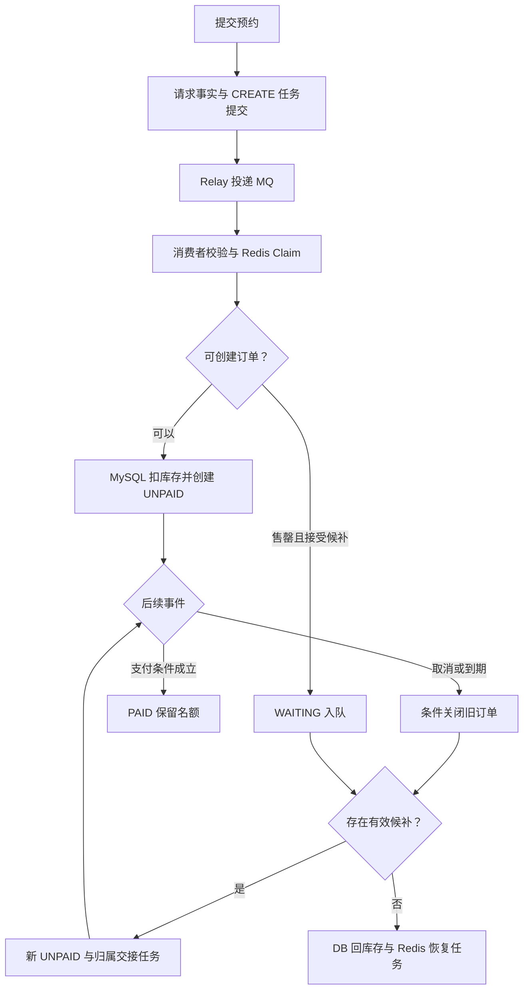
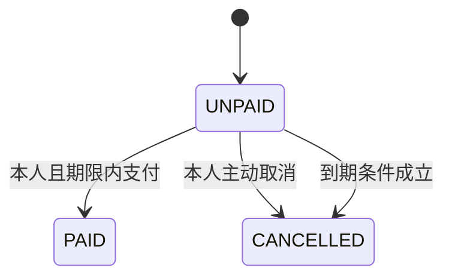
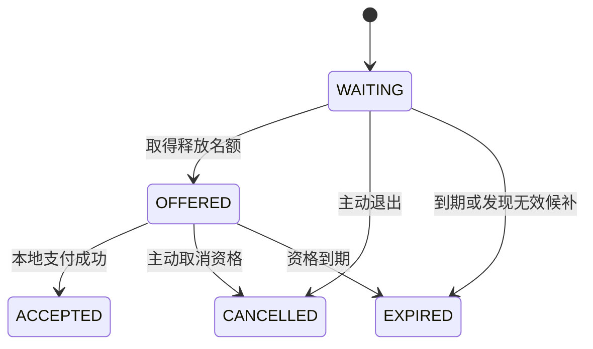
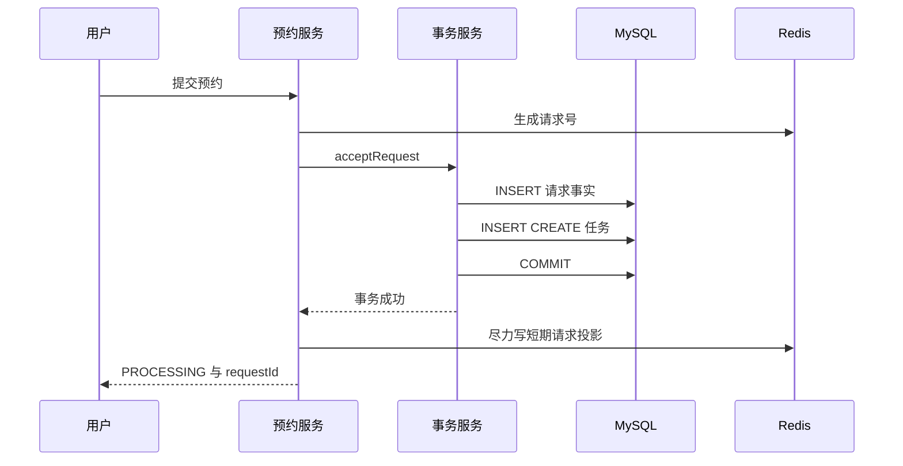
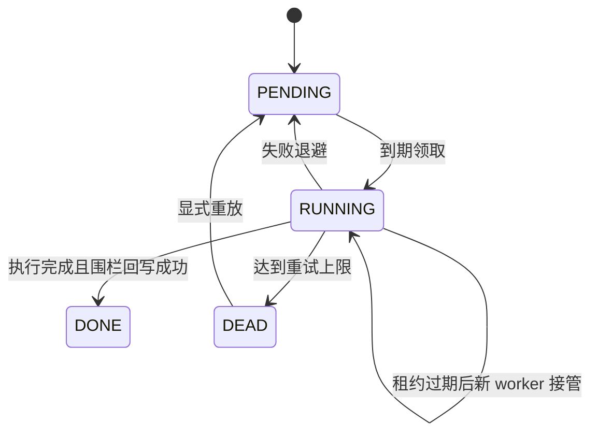
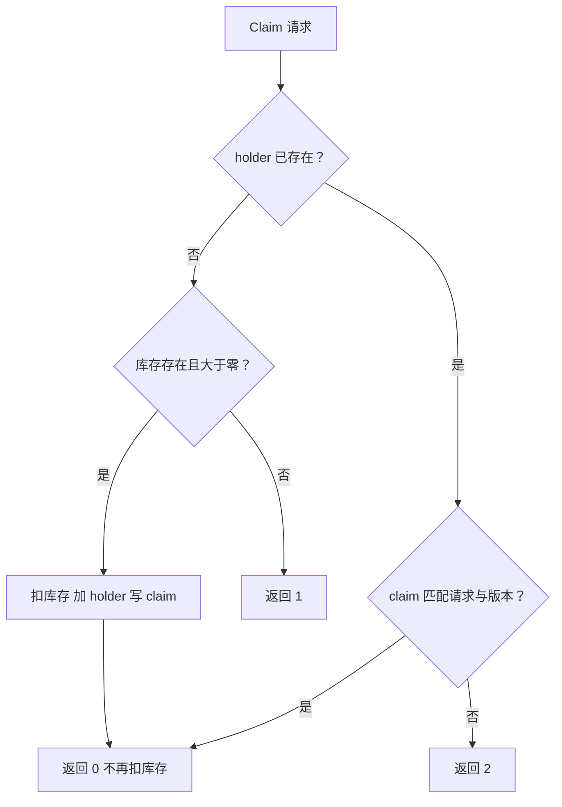
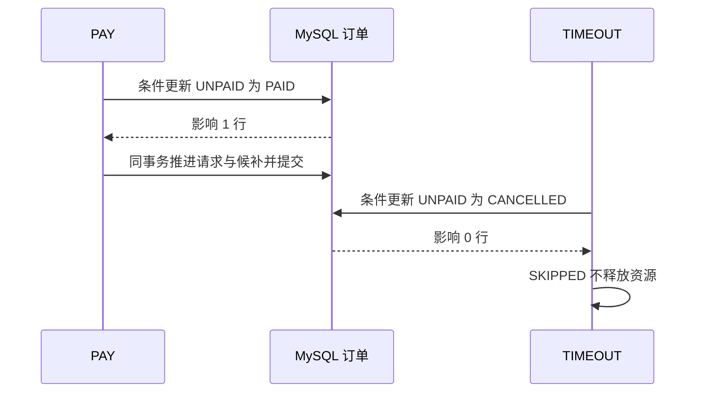

# CityPass 学习文档一：异步预约与候补调度

> **对应简历点**：基于本地可靠任务与 RocketMQ 解耦请求受理和订单创建，通过 Redis Lua 占位、MySQL 条件扣减及有效订单唯一约束防止超卖与重复预约；以 CAS 控制支付、取消和超时竞争，按请求号锁定候补队首并直接交接释放名额，结合资源版本、幂等重试与定时对账推进资源状态收敛。
>
> **源码基线**：GitHub main，`7b51ffafcea428e2877db0541709d130828236e7`。所有“当前实现”均以该提交为准。本篇整合原来预约、防并发冲突、候补交接三篇的知识，重新组织成一条资源生命周期，而不是把三份材料直接拼接。
>
> **验证口径**：本次完成静态源码、SQL、Lua、配置与测试脚本交叉阅读；未重新运行 MySQL/Redis/RocketMQ 容器验收。下文“已有测试覆盖”表示仓库有对应断言，不等于本次重新实测通过。示例中的人数、订单号和时刻均为教学数据。

**阅读目录**

- [1. 先理解业务：被争抢的到底是什么](#section-1)
- [2. 从基础概念建立阅读坐标](#section-2)
- [3. 总链路：请求事实、订单、资源与候补如何连起来](#section-3)
- [4. 四张业务表与三套状态](#section-4)
- [5. 阶段一：可靠受理，为什么先写 MySQL 再发 MQ](#section-5)
- [6. 阶段二：ReliableTask Relay 与 MQ 各做一半工作](#section-6)
- [7. 阶段三：Redis Claim 是资格预占，不是最终订单](#section-7)
- [8. 阶段四：MySQL 最终建单与双层约束](#section-8)
- [9. 阶段五：售罄后入队，与释放共享串行点](#section-9)
- [10. 阶段六：PAY、CANCEL、TIMEOUT 如何竞争](#section-10)
- [11. 阶段七：释放名额时优先候补，不先回公共池](#section-11)
- [12. 资源版本与永久 marker 如何保护 Redis 交接](#section-12)
- [13. 对账：主动发现问题，不是另一个重试器](#section-13)
- [14. 故障窗口逐个推演](#section-14)
- [15. 怎样自己调试与验证](#section-15)
- [16. 面试官追问与详细回答](#section-16)
- [17. 最后怎样学到能脱离文档讲出来](#section-17)
- [附录：源码与原学习材料导航](#section-18)

**源码精读导航（本次增强）**

本次保留原有链路讲解、图表与面试问答，并在相应章节补入真实源码。阅读顺序建议是：先看本章业务解释，再读带“教学”注释的代码，最后用失败边界检查自己是否理解。代码以本篇固定提交为准，不是新设计或待实现方案。

- [第 5 章 · reserve：先拿到可追踪的请求号，再等待异步结果](#code-1-1)
- [第 5 章 · acceptRequest：请求事实与 CREATE 待办一起提交](#code-1-2)
- [第 6 章 · claimReady：领取任务的租约与版本一起变化](#code-1-3)
- [第 6 章 · 领取 SQL：跳过锁住的独立任务，并为新执行轮次加一](#code-1-4)
- [第 6 章 · markDone：完成回写必须证明自己仍是当前执行轮次](#code-1-5)
- [第 6 章 · sendOrderCreate：Relay 发的是普通创建消息](#code-1-6)
- [第 7 章 · Claim Lua：重投先认原归属，再决定是否扣库存](#code-1-7)
- [第 7 章 · createOrderFromMQ：把 Lua 返回值连接到事务建单](#code-1-8)
- [第 8 章 · createOrder：条件扣库存、建单、请求状态和超时待办同事务](#code-1-9)
- [第 8 章 · 落库失败分支：为什么有 rollbackClaim 和 clearStaleClaim 两种清理](#code-1-10)
- [第 9 章 · createWaitlist：入队前锁住活动库存行](#code-1-11)
- [第 10 章 · payUnpaidOrder：UPDATE 的条件才是支付竞争裁判](#code-1-12)
- [第 11 章 · releaseOrPromote：先赢得关单资格，再处理名额](#code-1-13)
- [第 11 章 · promoteFirstValidWaiter：创建新候补订单，资源版本向前走](#code-1-14)
- [第 12 章 · TRANSFER Lua：只换归属，不增加公共库存](#code-1-15)
- [第 12 章 · RESTORE Lua：确实回公共池时，也必须核对旧归属](#code-1-16)
- [第 13 章 · reconcileFinishedStocks：从订单事实重算结束活动的数量](#code-1-17)

> **阅读约定**：完整方法保留事务注解；方法内节选会明确说明省略范围，不能单独复制成可运行类。所有新增行内注释均以“教学”标识，原代码中的英文／中文注释保留，但过时的原注释会在解释中指出。数值、订单号与时序例子均为教学推演，不是新增实测结果。

<a id="section-1"></a>

## 1. 先理解业务：被争抢的到底是什么

假设一场城市夜跑限量 10 人，100 人点击预约。系统不是简单保存 100 条表单，而是要回答四个问题：谁取得 10 份名额；取得后多久必须支付确认；放弃的人把名额交给谁；进程或中间件故障以后，这些决定还能不能恢复。

把名额想成一张可转交的入场资格卡。订单记录“资格现在由谁占用、处于什么状态”，候补记录“没拿到资格的人如何排队”。取消一个订单不一定意味着库存加一：后面有人排队时，可以直接交卡。

这里存在三种成功，不能混说：

| 成功层次 | 表达的事实 | 尚未保证什么 |
|---|---|---|
| 请求受理成功 | MySQL 记住了请求及待处理意图 | 尚未取得名额 |
| 预约成功 | 订单 UNPAID，持有有效支付资格 | 没有真实付款事实 |
| 本地支付状态成功 | 订单变成 PAID | 当前项目未接第三方支付、扣款或退款渠道 |

HTTP 接口最初返回 PROCESSING 是诚实表达异步状态，不是为了掩饰失败。库存竞争的结果稍后查询。

本篇维护的核心约束是：数据库条件扣减不能使本次库存扣成负数；同一用户同一活动不能拥有多笔有效订单；一笔未支付订单最多有一次离开 UNPAID 的迁移提交；释放的一个名额不能既回池又交给候补。

这些是业务不变量。Redis、MQ、锁、版本各自为它们服务，不是互相替代的装饰。

<a id="section-2"></a>

## 2. 从基础概念建立阅读坐标

| 概念 | 通俗理解 | 在源码中的位置 |
|---|---|---|
| 本地事务 | 一组 MySQL 修改一起提交或一起回滚 | `ReservationTransactionalService` 公共事务方法 |
| 异步 | 先记住工作，再由其他执行路径完成 | reserve 与 CREATE 消费分离 |
| Outbox | 业务账本旁同时写一张待办单 | `tb_reliable_task` |
| 幂等 | 同一动作重试，不再次产生不该重复的效果 | 订单条件更新、唯一键、Lua marker |
| CAS 式更新 | 只有旧状态仍符合条件，才允许改状态 | `WHERE status=1` 等复合条件 |
| 行锁 | 修改同一条记录时，数据库协调访问次序 | 库存条件更新、FOR UPDATE |
| Lease | worker 领取工作后获得有限期执行所有权 | `locked_by / lease_until` |
| Fencing | 接管后拒绝旧 worker 覆盖执行记录 | 回写时比较任务 `version` |
| Reconciliation | 重新比较账本和派生状态，发现遗漏或漂移 | `ReservationReconcileTask` |

特别注意：这里的 CAS 是数据库条件更新，不是 CPU 的 CAS 指令，也不是无锁自旋。InnoDB 底层仍通过锁等机制协调并发写入。

`@Transactional` 也不会让 Redis 和 MQ 自动参与 MySQL 的原子提交。正是因为跨系统不能靠这个注解一起回滚，才需要保存恢复意图。

<a id="section-3"></a>

## 3. 总链路：请求事实、订单、资源与候补如何连起来



图中的“可创建”概括多个判断，不代表一个跨 Redis/MySQL 的原子操作。Redis Claim 和 MySQL 建单是先后发生的两段。

对应调用层次：

| 层 | 职责 | 不负责什么 |
|---|---|---|
| `ReservationController` | 接收参数、调用服务 | 不在 Controller 内编排事务 |
| `ReservationServiceImpl` | 用户检查、用户锁、Redis、调用事务、返回结果 | 不把所有外部调用放入一个长数据库事务 |
| `ReservationTransactionalService` | MySQL 请求、订单、候补、库存及任务意图 | 不直接完成 Redis 名额交接 |
| `ReliableTaskScheduler` | 领取工作、发布 MQ 或执行副作用、回写结果 | 不决定订单是否可以支付 |
| `OrderMQConsumer` | 按 CREATE/TIMEOUT 分发，异常要求重投 | 不保证业务只执行一次 |
| `ReservationReconcileTask` | 补充扫描到期记录和结束库存 | 不重建所有 Redis 归属 |

源码：[Controller](https://github.com/SyH-101/citypass-platform/blob/7b51ffafcea428e2877db0541709d130828236e7/src/main/java/com/citypass/controller/ReservationController.java#L19)、[编排服务](https://github.com/SyH-101/citypass-platform/blob/7b51ffafcea428e2877db0541709d130828236e7/src/main/java/com/citypass/service/impl/ReservationServiceImpl.java#L48)、[事务服务](https://github.com/SyH-101/citypass-platform/blob/7b51ffafcea428e2877db0541709d130828236e7/src/main/java/com/citypass/service/impl/ReservationTransactionalService.java#L33)。

<a id="section-4"></a>

## 4. 四张业务表与三套状态

### 4.1 请求事实为什么不能和订单混成一张表

请求可能还在排队、处理失败或进入候补，根本没有订单。用订单表表达所有请求，会迫使“没有资格的请求”也伪装成订单。

| 表 | 关键字段 | 解释 |
|---|---|---|
| `tb_reservation_request` | request_id、user_id、status、order_id | 用户提交的请求及处理结论 |
| `tb_reservation_order` | id、user_id、activity_pass_id、status、offer_expire_time | 已分配名额的订单 |
| `tb_reservation_waitlist` | request_id、status、offered_order_id、wait_expire_time | 等待及候补资格记录 |
| `tb_limited_pass_stock` | stock、initial_stock、begin_time、end_time | 剩余名额、初始基准和预约窗口 |

直接订单使用请求号作为订单号；候补被选中以后，也复用其 request_id 创建新订单。注意“复用候补请求号”不等于把旧持有者订单改成新用户。

### 4.2 三套状态分别回答不同问题

| 对象 | 主要状态 | 关键区别 |
|---|---|---|
| 请求事实 | PROCESSING、RESERVED、WAITLISTED、PAID、CANCELLED、EXPIRED、FAIL_* | 表达这次请求怎样了 |
| 订单 | 1 UNPAID、2 PAID、4 CANCELLED | 表达名额所属订单的生命周期 |
| 候补 | WAITING、OFFERED、ACCEPTED、EXPIRED、CANCELLED | 表达排队与取得候补资格的过程 |

订单表还定义 3 核销、5 退款中、6 已退款，但当前代码没有相应完整业务流程。不能因为字段定义了就宣称已经接入核销和退款。



超时也把订单写成数字 4；请求事实使用 EXPIRED 区分超时原因。不要发明“订单第七种 EXPIRED 状态”。



WAITING 本身没有占库存；OFFERED 已有关联 UNPAID 订单，必须通过订单释放链退出，不能只删队列记录。

### 4.3 有效用户生成列怎样防重复

DDL 将订单状态在 1、2、3、5 时的 `active_user_id` 生成为 user_id，其余状态为 NULL，再设置 `(activity_pass_id, active_user_id)` 唯一索引。

假设用户 8 预约活动 100：第一笔有效订单对应唯一键 `(100,8)`，再插有效订单会冲突。取消后生成列成为 NULL，MySQL 唯一索引允许多条 NULL 组合，于是保留历史取消订单的同时，可以再预约。

这比永久唯一 `(activity_pass_id,user_id)` 更符合“取消后可重新预约”。候补表也对 WAITING/OFFERED 使用类似有效用户约束。两张表的唯一索引各管本表，并不直接构成跨表互斥约束。

源码：[数据库 DDL](https://github.com/SyH-101/citypass-platform/blob/7b51ffafcea428e2877db0541709d130828236e7/src/main/resources/db/citypass.sql#L1)。

<a id="section-5"></a>

## 5. 阶段一：可靠受理，为什么先写 MySQL 再发 MQ

`POST /reservations/{passId}?acceptWaitlist=true` 进入 `reserve()`：

1. 检查活动 ID 和登录用户；
2. `RedisIdWorker.nextId("reservation")` 生成请求号；
3. 构造请求载体，初始 resourceVersion=0；
4. 调用独立事务 Bean 的 `acceptRequest()`；
5. 事务里插 PROCESSING 请求事实和 CREATE_RESERVATION 任务；
6. 事务返回后尽力写 Redis 请求投影，再返回请求号及 PROCESSING。



如果先提交请求再发 MQ，中间宕机会留下“有请求但没有消息”的缺口。Outbox 把“必须继续处理”也记入同一事务，即使进程退出，其他 worker 还能发现工作。

但是这不意味着入口不访问数据库。每次受理都要写请求和任务，MQ 缓冲的是后续业务执行压力。入口还依赖 Redis 生成 ID；不能把“Redis 投影异常可忽略”扩大为“Redis 整体故障时预约入口不受影响”。

### 5.1 Redis 请求投影到底有什么用

`projectRequest()` 写 owner 与 status，TTL 为 5 分钟。异常被捕获，只记警告，不能推翻已提交事实。

**当前查询不是 Redis-first。** `getReservationResult()` 先读 MySQL 请求事实并校验归属，再查询订单、候补；只有旧版缺少请求事实的数据才走 Redis 回退。因此当前不能宣称投影已经让大多数轮询绕开数据库。原学习材料中相反的补充说明不适用于此源码。

### 5.2 拆出事务 Bean 的原因

Spring 常见事务依赖代理调用。Service 调用另一个受管理 Bean 的 public 事务方法，能清楚进入事务代理。一个对象内部 `this.xxx()` 不能被认为会自动开启另一段新事务。

本项目 public 取消/超时入口已经开启事务，随后调用内部释放方法是在现有事务中继续执行，不是靠内部调用再次“神奇开启”事务。


<a id="code-1-1"></a>

### 源码精读 1：reserve：先拿到可追踪的请求号，再等待异步结果

**源码位置**：[ReservationServiceImpl.java · reserve](https://github.com/SyH-101/citypass-platform/blob/7b51ffafcea428e2877db0541709d130828236e7/src/main/java/com/citypass/service/impl/ReservationServiceImpl.java#L74-L98)。完整方法；仅追加标有“教学”的中文注释，未改动原有语句。节选依赖的变量和外围事务请结合本章上下文阅读。

**这个方法／片段实现什么？** 输入活动 ID 与是否接受候补，输出 requestId 和 PROCESSING。这里构造的 ReservationOrder 是传输请求载体，此刻还不是已经插入订单表的有效订单。

```java
@Override
public Result reserve(Long activityPassId, boolean acceptWaitlist) {
    if (activityPassId == null || UserHolder.getUser() == null) {
        return Result.fail("参数错误或用户未登录");
    }
    Long userId = UserHolder.getUser().getId();
    long requestId = redisIdWorker.nextId("reservation"); // 教学：此处仍依赖 Redis 生成请求号，不是完全无 Redis 的入口
    ReservationOrder request = new ReservationOrder()
            .setId(requestId)
            .setUserId(userId)
            .setActivityPassId(activityPassId)
            .setSource(ReservationStatus.SOURCE_DIRECT)
            .setPromotionRound(0)
            .setResourceVersion(0L)
            .setAcceptWaitlist(acceptWaitlist);

    // 这里不直接发 MQ。请求事实与 CREATE Outbox 在同一事务落库，宕机后仍可继续投递。
    transactionalService.acceptRequest(request); // 教学：跨 Bean 调用，使 Spring 事务代理能够生效
    projectRequest(requestId, userId, ReservationStatus.PROCESSING); // 教学：事务返回以后才写可丢失的 Redis 查询投影

    Map<String, Object> data = new HashMap<>(2);
    data.put("requestId", requestId);
    data.put("status", ReservationStatus.PROCESSING); // 教学：返回 PROCESSING 只承诺已受理
    return Result.ok(data);
}
```

**沿代码往下看**

1. 校验登录态，生成贯穿请求事实、MQ 与后续订单的请求号。
2. 初始化 DIRECT、轮次 0、资源版本 0，为后续归属变化提供起点。
3. 先提交 acceptRequest 的本地事务，再尝试写 Redis 投影。
4. 返回请求号供轮询；真正的库存竞争由消费者执行。

**失败与边界**：ID 生成失败时不能受理；本地事务失败也不能返回成功。Redis 投影失败由 projectRequest 捕获，不撤销已经提交的 MySQL 事实。


<a id="code-1-2"></a>

### 源码精读 2：acceptRequest：请求事实与 CREATE 待办一起提交

**源码位置**：[ReservationTransactionalService.java · acceptRequest](https://github.com/SyH-101/citypass-platform/blob/7b51ffafcea428e2877db0541709d130828236e7/src/main/java/com/citypass/service/impl/ReservationTransactionalService.java#L69-L82)。完整方法；仅追加标有“教学”的中文注释，未改动原有语句。节选依赖的变量和外围事务请结合本章上下文阅读。

**这个方法／片段实现什么？** 这是一笔小事务：保存“我收到了这个预约请求”和“我还需要发送创建消息”两件事。

```java
@Transactional(rollbackFor = Exception.class) // 教学：同一个数据源的数据库修改加入同一事务
public void acceptRequest(ReservationOrder request) {
    ReservationRequest fact = new ReservationRequest()
            .setRequestId(request.getId())
            .setUserId(request.getUserId())
            .setActivityPassId(request.getActivityPassId())
            .setAcceptWaitlist(Boolean.TRUE.equals(request.getAcceptWaitlist()))
            .setStatus(ReservationStatus.PROCESSING);
    requestMapper.insert(fact); // 教学：先记录请求存在，状态为处理中
    reliableTaskRepository.enqueue(
            ReliableTaskRepository.CREATE_RESERVATION, // 教学：任务负责将来投递创建消息
            "create-reservation:" + request.getId(), // 教学：业务幂等键关联本次请求
            JSONUtil.toJsonStr(request));
}
```

**沿代码往下看**

1. fact 记录用户、活动、候补意愿和状态，成为可查询事实。
2. enqueue 在 tb_reliable_task 插入 CREATE_RESERVATION；任务 payload 保存后续消费需要的请求。
3. 事务提交后，两张表的修改一起生效，Relay 可以发现待办。
4. 若第二步抛异常，第一步的插入回滚，不会留下没有后续推进意图的已受理请求。

**失败与边界**：这是本地事务加普通 MQ 的 Outbox 实现，不是跨 MySQL 与 RocketMQ 的分布式原子提交，也不是 RocketMQ 事务消息 API。

<a id="section-6"></a>

## 6. 阶段二：ReliableTask Relay 与 MQ 各做一半工作

任务表主要字段：task_type 指定工作，biz_key 去重，payload 保存参数，status 记录执行阶段，retry_count/max_retry 控制失败次数，next_retry_time 表示到期可执行，locked_by/lease_until/version 协调 worker。



### 6.1 领取不是全局排他执行

`relay()` 默认每轮最多处理 50 条，但每次 `claimReady(1,...)` 只领取马上执行的一条。数据库短事务使用 `FOR UPDATE SKIP LOCKED`：别的实例锁住某个独立任务时，本实例可拿其他任务。

领取后写 RUNNING、实例 UUID、默认 30 秒租约，并把任务 version 加一。事务结束才执行 MQ/Redis I/O，避免长期持有任务行锁。

### 6.2 围栏回写到底挡住什么

`markDone/markFailed` 条件包含 id、RUNNING、locked_by、version。A 拿到 v3 后卡住，B 在租约过期后以 v4 接管，则 A 的 v3 回写影响零行。

准确边界：代码不在回写条件中再次要求 `lease_until > NOW()`。若只是时间过期但尚未被接管，旧 owner/version 仍可能回写成功。因此应说“阻止已失去所有权或版本的旧 worker 覆盖任务状态”，而非“超过 30 秒的 worker 任何操作都被拒绝”。

更重要的是：围栏条件只保护任务表，不能撤回已经发出的 MQ 消息或已经执行的 Redis 命令。外部动作仍需独立幂等。

### 6.3 MQ 消息确认与业务完成不是一回事

CREATE、TIMEOUT 都通过同步 send，Scheduler 检查 `SendStatus.SEND_OK`。CREATE 任务 DONE 表示 Broker 确认收到，不表示订单已创建。消费侧由 `OrderMQConsumer` 分发：CREATE 调 `createOrderFromMQ`，TIMEOUT 调 `cancelTimeoutOrder`；处理异常要求重投。

如果 Broker 已接受而进程在写 DONE 前宕机，同一任务会再发消息。系统必须接受至少一次执行，而不是假设“不重复发送”。

### 6.4 退避、DEAD 与模块共享

失败计数先加一，退避公式 `min(300, 1 << min(nextRetryCount,8))` 实际得到 2、4、8……256 秒，上限不是 300 秒，也没有随机抖动。默认第 12 次失败进入 DEAD。管理员可以通过受 token 保护的接口重放，但需先解决根因。

当前共有七类任务：预约使用 CREATE、TIMEOUT、INIT、RESTORE、TRANSFER；缓存和搜索分别使用 INVALIDATE_VENUE_CACHE、INDEX_ACTIVITY_SEARCH。搜索关闭时领取 SQL 排除 INDEX，其余任务继续执行。共享机制不等于提供各业务独立线程池、优先级和资源隔离。

源码：[任务仓储](https://github.com/SyH-101/citypass-platform/blob/7b51ffafcea428e2877db0541709d130828236e7/src/main/java/com/citypass/reliable/ReliableTaskRepository.java#L14)、[执行器](https://github.com/SyH-101/citypass-platform/blob/7b51ffafcea428e2877db0541709d130828236e7/src/main/java/com/citypass/task/ReliableTaskScheduler.java#L34)、[MQ 发布](https://github.com/SyH-101/citypass-platform/blob/7b51ffafcea428e2877db0541709d130828236e7/src/main/java/com/citypass/mq/RocketMQProducer.java#L25)、[消费分发](https://github.com/SyH-101/citypass-platform/blob/7b51ffafcea428e2877db0541709d130828236e7/src/main/java/com/citypass/mq/OrderMQConsumer.java#L28)。


<a id="code-1-3"></a>

### 源码精读 3：claimReady：领取任务的租约与版本一起变化

**源码位置**：[ReliableTaskRepository.java · claimReady](https://github.com/SyH-101/citypass-platform/blob/7b51ffafcea428e2877db0541709d130828236e7/src/main/java/com/citypass/reliable/ReliableTaskRepository.java#L51-L54)。完整方法；仅追加标有“教学”的中文注释，未改动原有语句。节选依赖的变量和外围事务请结合本章上下文阅读。

**这个方法／片段实现什么？** 这是三参数入口，委托四参数重载执行领取；搜索模块关闭时，调度器使用另一重载排除搜索任务。

```java
@Transactional(rollbackFor = Exception.class)
public List<ReliableTask> claimReady(int limit, String owner, int leaseSeconds) {
    return claimReady(limit, owner, leaseSeconds, true); // 教学：默认允许领取搜索任务；调度器可调用带开关的重载
}
```

**沿代码往下看**

1. limit 限制本次最多领取数量。
2. owner 标识执行者；leaseSeconds 决定超时后何时允许接管。
3. includeSearchTasks 由四参数入口控制，下方继续读实际领取 SQL。

**失败与边界**：委托方法本身没有完成外部副作用；事务只覆盖短暂领取过程。


<a id="code-1-4"></a>

### 源码精读 4：领取 SQL：跳过锁住的独立任务，并为新执行轮次加一

**源码位置**：[ReliableTaskRepository.java · 脚本](https://github.com/SyH-101/citypass-platform/blob/7b51ffafcea428e2877db0541709d130828236e7/src/main/java/com/citypass/reliable/ReliableTaskRepository.java#L58-L91)。方法内连续节选；仅追加标有“教学”的中文注释，未改动原有语句。节选依赖的变量和外围事务请结合本章上下文阅读。

**这个方法／片段实现什么？** 查询到期 PENDING 或租约过期 RUNNING，在数据库行锁保护下变成 RUNNING。摘录省略外围事务注解及最后方法括号，原方法有 @Transactional。

```java
public List<ReliableTask> claimReady(int limit, String owner, int leaseSeconds, boolean includeSearchTasks) {
    String searchFilter = includeSearchTasks ? "" : " AND task_type<>'" + INDEX_ACTIVITY_SEARCH + "'"; // 教学：关闭可选搜索模块时，索引任务继续留在 PENDING
    List<ReliableTask> candidates = jdbcTemplate.query(
            "SELECT id,task_type,payload,retry_count,max_retry,version FROM tb_reliable_task " +
                    "WHERE ((status='PENDING' AND next_retry_time<=NOW()) " +
                    "OR (status='RUNNING' AND lease_until<=NOW())) " + searchFilter +
                    "ORDER BY id LIMIT ? FOR UPDATE SKIP LOCKED", // 教学：任务之间无 FIFO 业务依赖，可跳过其他工作者占用的任务
            new Object[]{limit},
            (rs, rowNum) -> {
                ReliableTask task = new ReliableTask();
                task.setId(rs.getLong("id"));
                task.setTaskType(rs.getString("task_type"));
                task.setPayload(rs.getString("payload"));
                task.setRetryCount(rs.getInt("retry_count"));
                task.setMaxRetry(rs.getInt("max_retry"));
                task.setVersion(rs.getLong("version"));
                return task;
            });

    LocalDateTime leaseUntil = LocalDateTime.now().plusSeconds(Math.max(1, leaseSeconds));
    List<ReliableTask> claimed = new ArrayList<>(candidates.size());
    for (ReliableTask task : candidates) {
        int changed = jdbcTemplate.update(
                "UPDATE tb_reliable_task SET status='RUNNING',locked_by=?,lease_until=?," +
                        "version=version+1,update_time=NOW() WHERE id=? AND version=?", // 教学：接管产生新围栏版本，旧执行者持有的版本作废
                owner, leaseUntil, task.getId(), task.getVersion());
        if (changed == 1) {
            task.setLockedBy(owner);
            task.setLeaseUntil(leaseUntil);
            task.setVersion(task.getVersion() + 1); // 教学：内存对象同步持有本轮版本，回写时必须携带
            claimed.add(task);
        }
    }
    return claimed;
```

**沿代码往下看**

1. WHERE 两组条件分别覆盖首次／重试任务和执行者失联后的任务。
2. SKIP LOCKED 让多个实例分摊不同待办；不是让多个实例同时合法领取同一行。
3. UPDATE 写 owner、lease_until，并令 version 加一。
4. 后续执行与完成回写携带这个新版本，形成“本轮执行”的身份。

**失败与边界**：租约到期不杀死旧线程。接管后仍可能两个线程都在调用外部系统，所以副作用必须另外实现幂等／版本保护。


<a id="code-1-5"></a>

### 源码精读 5：markDone：完成回写必须证明自己仍是当前执行轮次

**源码位置**：[ReliableTaskRepository.java · markDone](https://github.com/SyH-101/citypass-platform/blob/7b51ffafcea428e2877db0541709d130828236e7/src/main/java/com/citypass/reliable/ReliableTaskRepository.java#L94-L99)。完整方法；仅追加标有“教学”的中文注释，未改动原有语句。节选依赖的变量和外围事务请结合本章上下文阅读。

**这个方法／片段实现什么？** 把待办标成 DONE，而不是重新执行业务；返回 false 表示本次回写未匹配到当前任务状态。

```java
public boolean markDone(ReliableTask task) {
    return jdbcTemplate.update(
            "UPDATE tb_reliable_task SET status='DONE',locked_by=NULL,lease_until=NULL,update_time=NOW() " +
                    "WHERE id=? AND status='RUNNING' AND locked_by=? AND version=?", // 教学：同时比较任务 ID、RUNNING、owner 和 version
            task.getId(), task.getLockedBy(), task.getVersion()) == 1; // 教学：影响行数为 1 才算完成回写成功
}
```

**沿代码往下看**

1. 假设 A 持有 version=7，停顿后 B 接管为 version=8。
2. A 恢复并调用 markDone，WHERE version=7 匹配不到，因此不能覆盖 B 的进度。
3. B 使用 owner=B、version=8 回写才有机会成功。

**失败与边界**：这里没有 lease_until > NOW() 条件；仅租约过期、尚未被接管时，旧执行者仍可能回写成功。围栏保护任务行，不自动撤销已经发出的 MQ 或 Redis 操作。


<a id="code-1-6"></a>

### 源码精读 6：sendOrderCreate：Relay 发的是普通创建消息

**源码位置**：[RocketMQProducer.java · sendOrderCreate](https://github.com/SyH-101/citypass-platform/blob/7b51ffafcea428e2877db0541709d130828236e7/src/main/java/com/citypass/mq/RocketMQProducer.java#L42-L52)。完整方法；仅追加标有“教学”的中文注释，未改动原有语句。节选依赖的变量和外围事务请结合本章上下文阅读。

**这个方法／片段实现什么？** Relay 执行 CREATE 任务时调用发布器，输入预约请求，输出 RocketMQ SendResult。方法名中的 Order 不代表发送前已经存在数据库订单。

```java
@Override
public SendResult sendOrderCreate(ReservationOrder order)
        throws MQClientException, MQBrokerException, RemotingException, InterruptedException {
    Message message = new Message(
            RocketMQConstants.ORDER_TOPIC,
            RocketMQConstants.ORDER_TAG_CREATE, // 教学：同一订单主题下用 CREATE 标签区分业务
            JSONUtil.toJsonStr(order).getBytes(StandardCharsets.UTF_8)); // 教学：请求载体序列化为消息体，包含后续建单所需标识
    SendResult result = producer.send(message); // 教学：同步等待发送结果，不等待消费者建单完成
    log.debug("预约请求消息发送成功, requestId={}, msgId={}", order.getId(), result.getMsgId());
    return result; // 教学：上层调度器还需要检查 SEND_OK
}
```

**沿代码往下看**

1. 使用 ORDER_TOPIC 和 CREATE 标签构造普通 Message。
2. 把请求对象转换为 UTF-8 JSON 字节。
3. producer.send 同步得到发送结果，调度器检查成功状态后才尝试写任务 DONE。
4. 消息已经被接收但 DONE 没写成功时，Relay 可能重发，因此消费者仍必须幂等。

**失败与边界**：这段没有发送事务消息，也没有把数据库事务延长到 MQ 消费端。发送成功与订单创建成功是不同里程碑。日志写“成功”不能代替上层对 SendStatus 的判断。

<a id="section-7"></a>

## 7. 阶段三：Redis Claim 是资格预占，不是最终订单

消费者先检查消息字段，使用 `lock:reservation:user:{userId}` 获取用户锁，校验活动上架、限量类型和预约窗口，再检查已有有效订单/候补，之后才执行 Lua。

这个锁按用户而非用户加活动划分，会串行同一用户的不同活动 CREATE。它减少重复处理竞争，但不能代替数据库唯一约束；PAY/CANCEL/TIMEOUT 也不是都依靠这个用户锁。

### 7.1 三个 Redis 对象分别存什么

| Key 示例 | 类型 | 意义 |
|---|---|---|
| `reservation:stock:100` | String 数字 | Redis 可竞争库存 |
| `reservation:holders:100` | Set | 哪些用户持有占位 |
| `reservation:claim:100:8` | String | 用户 8 的归属令牌，例如 `10001:0` |

claim 中前半段是订单/请求号，后半段是资源代次。它不只是“这个用户占过位”的布尔值。

`reservation-claim.lua` 的三种结果：

- 0：允许继续建单，可能是新扣库存，也可能是同一归属重试；
- 1：库存不存在或不足；
- 2：该用户被其他归属占用。



Lua 避免三个命令在并发下被其他 Redis 命令插入，但不能保护后续 MySQL 事务。脚本还只对期望版本 0 兼容旧版纯订单号 claim。

### 7.2 为什么要先检查“同一个 claim”

第一次执行扣了 Redis，随后数据库暂时失败。重试若只看库存和“用户已占位”，就会把合法恢复判为重复预约；若重新扣减，则会多扣一次。精确匹配 claim 让重试继续完成原工作而不再扣库存。

源码：[Claim 脚本](https://github.com/SyH-101/citypass-platform/blob/7b51ffafcea428e2877db0541709d130828236e7/src/main/resources/reservation-claim.lua#L1)。


<a id="code-1-7"></a>

### 源码精读 7：Claim Lua：重投先认原归属，再决定是否扣库存

**源码位置**：[reservation-claim.lua · 脚本](https://github.com/SyH-101/citypass-platform/blob/7b51ffafcea428e2877db0541709d130828236e7/src/main/resources/reservation-claim.lua#L1-L36)。完整脚本；仅追加标有“教学”的中文注释，未改动原有语句。节选依赖的变量和外围事务请结合本章上下文阅读。

**这个方法／片段实现什么？** 消费者调用脚本，输入活动、用户、订单号和资源版本，输出 0／1／2。0 是“允许继续尝试数据库建单”，不是“数据库订单已经成功”。

```lua
-- 预约消费者：Redis 库存 + 一人一单（幂等：已 claim 则返回 0，便于 MQ 重试续跑落库）。
-- ARGV: activityPassId, userId, orderId, resourceVersion
-- 返回: 0 可落库；1 库存不足；2 该用户已被另一订单 claim
local activityPassId = ARGV[1]
local userId = ARGV[2]
local orderId = ARGV[3]
local resourceVersion = ARGV[4]
local expectedClaim = orderId .. ':' .. resourceVersion -- 教学：订单号和资源版本组成归属身份

local stockKey = 'reservation:stock:' .. activityPassId
local holderKey = 'reservation:holders:' .. activityPassId
local claimKey = 'reservation:claim:' .. activityPassId .. ':' .. userId

-- 已 claim：说明上次可能扣了 Redis 但 SQL 未成功，允许继续落库
if redis.call('sismember', holderKey, userId) == 1 then
    local existing = redis.call('get', claimKey)
    if existing == expectedClaim then -- 教学：同一请求重投，不再扣 Redis 库存
        return 0
    end
    -- 兼容 v3 留下的无版本直接预约 claim，并原地升级。
    if resourceVersion == '0' and existing == orderId then
        redis.call('set', claimKey, expectedClaim)
        return 0
    end
    return 2 -- 教学：用户已有其他归属，本请求不可继续占位
end

local stock = tonumber(redis.call('get', stockKey))
if stock == nil or stock <= 0 then -- 教学：库存未初始化也按不可领取处理
    return 1
end

redis.call('incrby', stockKey, -1) -- 教学：检查、扣库存和占位在同一次 Lua 执行中完成
redis.call('sadd', holderKey, userId)
redis.call('set', claimKey, expectedClaim)
return 0
```

**沿代码往下看**

1. 先查看 holder：同一 claim 已存在就返回 0，让上次落库失败的消息续跑。
2. 用户被别的 claim 占用则返回 2，阻止一人重复占位。
3. 新领取需要 Redis stock 大于 0，之后扣一份并登记 holder 与 claim。
4. 例如第一次 Redis 10→9 后进程宕机，重投时命中相同 claim，库存保持 9。

**失败与边界**：Lua 原子性只作用于 Redis，不能包住随后 MySQL 的事务。返回值如何分支由 Java 消费逻辑决定；Redis 数量失真时仍由数据库库存和唯一约束兜底。


<a id="code-1-8"></a>

### 源码精读 8：createOrderFromMQ：把 Lua 返回值连接到事务建单

**源码位置**：[ReservationServiceImpl.java · createOrderFromMQ](https://github.com/SyH-101/citypass-platform/blob/7b51ffafcea428e2877db0541709d130828236e7/src/main/java/com/citypass/service/impl/ReservationServiceImpl.java#L138-L154)。方法内连续节选；仅追加标有“教学”的中文注释，未改动原有语句。节选依赖的变量和外围事务请结合本章上下文阅读。

**这个方法／片段实现什么？** 本段位于获取用户锁、检查现有订单与候补之后，说明 Java 如何消费 Lua 的协议返回值。最后省略 try 的 catch 与方法外围，后续失败处理紧接下一段。

```java
Long claim = stringRedisTemplate.execute(
        RESERVE_CLAIM_SCRIPT, Collections.emptyList(), // 教学：执行本章的 Claim Lua，四个 ARGV 对应资源身份
        activityPassId.toString(), userId.toString(), requestId.toString(),
        String.valueOf(request.getResourceVersion()));
if (claim == null) throw new IllegalStateException("Redis 预约占位返回空"); // 教学：返回空是异常，不能当作售罄或成功
if (claim == 1L) { // 教学：Redis 库存不足时转到候补／失败处理
    handleSoldOut(request);
    return;
}
if (claim == 2L) { // 教学：同一用户有其他归属，本请求记为重复
    markRequest(requestId, userId, ReservationStatus.FAIL_REPEAT, null, "CLAIM_OWNED_BY_OTHER");
    return;
}

ReservationTransactionalService.CreateResult created;
try {
    created = transactionalService.createOrder(request, offerMinutes); // 教学：Lua 允许继续后，才进入真正的 MySQL 建单事务
```

**沿代码往下看**

1. userId、activityPassId、requestId、resourceVersion 是连接 Redis 与 MySQL 两端的共同标识。
2. 返回 1 走 handleSoldOut：同意候补则尝试入队，否则记录库存不足。
3. 返回 2 记录 FAIL_REPEAT，不能创建另一个用户占位。
4. 正常返回 0 才调用 createOrder，数据库再执行条件扣减与唯一约束检查。

**失败与边界**：“Redis 放行”不是“数据库无条件接受”。源码按约定处理 0／1／2；空结果抛异常让 MQ 重试，不能把所有技术失败伪装成业务售罄。

<a id="section-8"></a>

## 8. 阶段四：MySQL 最终建单与双层约束

`createOrder()` 用带条件的 UPDATE 扣库存。等价语义如下，参数仅用于解释：

```sql
UPDATE tb_limited_pass_stock
SET stock = stock - 1
WHERE activity_pass_id = :id
  AND begin_time <= :now
  AND end_time > :now
  AND stock > 0;
```

影响 1 行才继续：计算支付资格截止时间、插 UNPAID 订单、请求事实变 RESERVED、登记 ORDER_TIMEOUT。这些一起提交。插订单时唯一约束失败，前面的数据库扣减随事务回滚。

两个线程都曾读到库存 1，不意味着都能扣成功。最终条件 UPDATE 由数据库协调，后执行的竞争者会根据可更新记录是否仍满足条件来决定影响行数。这比“先 SELECT，看起来够，再无条件 UPDATE”安全。

支付资格时间为：

`min(now + max(1, offerMinutes), 预约截止 end_time)`

默认配置 15 分钟，但活动只剩 3 分钟时，资格不会被延长到预约截止以后。注意这里限制的是预约有效窗口，不是搜索模块新增的活动实际举办时间。

### 8.1 Cache Guard + DB Invariant 的准确意思

Redis 提前减少部分无效落单竞争；MySQL 在实际事务中检验库存、窗口、唯一性。Redis 数据即使偏多，也不能仅凭 Claim 成功突破数据库约束。

但 Redis 偏少可能造成保守拒绝或重试，并非只要数据库正确就没有可用性损失。双层防线保护安全性，也引入派生状态维护成本。

### 8.2 失败后为什么有两种清理

| 方法 | 典型情况 | 对 Redis 的处理 |
|---|---|---|
| `rollbackClaim(request)` | 本次预占需要撤销，例如数据库重复键异常 | 归属匹配才删占位并加回库存 |
| `clearStaleClaim(request)` | DB 已售罄；当前代码也用于部分结束/不可用分支 | 归属匹配才清占位，并把 Redis stock 置零 |

这不是同一件事换两个名字。前者撤销本次预占；后者阻止已判断不可继续的 Redis 库存继续制造无效竞争。不要给后者附会一个“全量精确库存重算”能力，它并没有数订单。

对于一般运行异常，外层重抛交给 MQ 重试；不能把所有异常都当成业务失败并永久结束请求。


<a id="code-1-9"></a>

### 源码精读 9：createOrder：条件扣库存、建单、请求状态和超时待办同事务

**源码位置**：[ReservationTransactionalService.java · createOrder](https://github.com/SyH-101/citypass-platform/blob/7b51ffafcea428e2877db0541709d130828236e7/src/main/java/com/citypass/service/impl/ReservationTransactionalService.java#L85-L114)。完整方法；仅追加标有“教学”的中文注释，未改动原有语句。节选依赖的变量和外围事务请结合本章上下文阅读。

**这个方法／片段实现什么？** 输入已取得 Redis Claim 的订单载体；输出 CREATED 或具体拒绝原因。成功时 MySQL 库存减少一份，并产生 UNPAID 订单。

```java
@Transactional(rollbackFor = Exception.class)
public CreateResult createOrder(ReservationOrder order, int offerMinutes) throws DuplicateKeyException {
    LocalDateTime now = LocalDateTime.now();
    int stockRows = stockMapper.update(null,
            new UpdateWrapper<LimitedPassStock>()
                    .setSql("stock = stock - 1") // 教学：直接在数据库计算，避免先读后算造成覆盖
                    .eq("activity_pass_id", order.getActivityPassId())
                    .le("begin_time", now)
                    .gt("end_time", now)
                    .gt("stock", 0)); // 教学：库存不足时 UPDATE 影响行数为 0
    if (stockRows == 0) { // 教学：未扣成功就分类返回，不允许继续插订单
        LimitedPassStock current = stockMapper.selectById(order.getActivityPassId());
        if (current == null) return CreateResult.UNAVAILABLE;
        if (current.getBeginTime() != null && current.getBeginTime().isAfter(now)) return CreateResult.NOT_STARTED;
        if (current.getEndTime() == null || !current.getEndTime().isAfter(now)) return CreateResult.ENDED;
        return CreateResult.SOLD_OUT;
    }

    LimitedPassStock current = stockMapper.selectById(order.getActivityPassId());
    LocalDateTime expiresAt = capOfferExpiry(now, offerMinutes, current == null ? null : current.getEndTime());
    order.setStatus(ORDER_STATUS_UNPAID);
    order.setSource(order.getSource() == null ? ReservationStatus.SOURCE_DIRECT : order.getSource());
    order.setPromotionRound(order.getPromotionRound() == null ? 0 : order.getPromotionRound());
    order.setResourceVersion(order.getResourceVersion() == null ? 0L : order.getResourceVersion());
    order.setOfferExpireTime(expiresAt);
    orderMapper.insert(order); // 教学：唯一约束冲突会抛异常并回滚本事务
    updateRequestState(order.getId(), ReservationStatus.RESERVED, order.getId(), null);
    enqueueTimeout(order.getId(), expiresAt); // 教学：用真实截止时间登记将来的关单任务
    return CreateResult.CREATED;
}
```

**沿代码往下看**

1. UpdateWrapper 生成带活动、预约时间窗和 stock > 0 的 UPDATE。数据库协调竞争同一库存行的写操作。
2. stockRows=0 表示没有拿到数据库名额，代码进一步区分未开始、已结束、售罄等原因。
3. 成功后计算 min(配置保留时间, 活动结束时间)，初始化订单状态与资源版本。
4. 订单插入、请求转 RESERVED、ORDER_TIMEOUT 待办一起提交。唯一键冲突会回滚已经执行的 stock - 1。

**失败与边界**：事务回滚不会自动回滚先前 Redis Claim；外层消费者要根据重复订单、售罄等不同原因选择 rollbackClaim 或 clearStaleClaim。不要把 Lua 与此事务说成一个原子操作。


<a id="code-1-10"></a>

### 源码精读 10：落库失败分支：为什么有 rollbackClaim 和 clearStaleClaim 两种清理

**源码位置**：[ReservationServiceImpl.java · createOrderFromMQ](https://github.com/SyH-101/citypass-platform/blob/7b51ffafcea428e2877db0541709d130828236e7/src/main/java/com/citypass/service/impl/ReservationServiceImpl.java#L155-L185)。方法内连续节选；仅追加标有“教学”的中文注释，未改动原有语句。节选依赖的变量和外围事务请结合本章上下文阅读。

**这个方法／片段实现什么？** 紧接事务 createOrder 调用。它不是对所有失败都执行 Redis +1，而是区分重复键、真实售罄、未开始、结束与不可用。

```java
} catch (DuplicateKeyException duplicate) {
    rollbackClaim(request); // 教学：归属匹配时撤销本次预占，恢复 Redis 数量
    ReservationOrder winner = findActiveOrder(activityPassId, userId); // 教学：数据库唯一键裁决后，回读实际胜出的有效订单
    String status = winner != null && requestId.equals(winner.getId())
            ? orderStatus(winner) : ReservationStatus.FAIL_REPEAT;
    markRequest(requestId, userId, status,
            winner != null && requestId.equals(winner.getId()) ? winner.getId() : null,
            winner == null ? "DUPLICATE_ACTIVE_ORDER" : null);
    return;
}

if (created == ReservationTransactionalService.CreateResult.SOLD_OUT) {
    clearStaleClaim(request); // 教学：数据库售罄时清归属并将 Redis 库存归零
    handleSoldOut(request); // 教学：清理后按用户意愿继续候补／失败路径
    return;
}
if (created != ReservationTransactionalService.CreateResult.CREATED) {
    String status;
    if (created == ReservationTransactionalService.CreateResult.NOT_STARTED) {
        rollbackClaim(request);
        status = ReservationStatus.FAIL_NOT_STARTED;
    } else {
        clearStaleClaim(request);
        status = created == ReservationTransactionalService.CreateResult.ENDED
                ? ReservationStatus.FAIL_ENDED : ReservationStatus.FAIL_UNAVAILABLE;
    }
    markRequest(requestId, userId, status, null, null);
    return;
}
// createOrder 已在同一事务更新请求事实；这里只刷新短期 Redis 投影。
projectRequest(requestId, userId, ReservationStatus.RESERVED); // 教学：只有事务确实创建成功才刷新 RESERVED 投影
```

**沿代码往下看**

1. DuplicateKeyException：数据库事务已回滚，撤销本次匹配的 Redis Claim，再读取胜出订单决定是幂等成功还是重复预约。
2. SOLD_OUT：MySQL 已证明无库存，使用 clearStaleClaim，不能把失真的 Redis 库存再加一后让后来者继续误抢。
3. NOT_STARTED：撤销预占，记录尚未开始。ENDED／UNAVAILABLE 则清理过期资格并记录对应终态。
4. CREATED：数据库请求事实已是 RESERVED，这里只刷新可丢失的短期 Redis 投影。

**失败与边界**：脚本仍核对订单与资源版本，不能随意删除别人的新归属。数据库技术异常的外围处理是抛回 MQ 重试；不要自行理解成每次异常都立即补库存。

<a id="section-9"></a>

## 9. 阶段五：售罄后入队，与释放共享串行点

Redis 返回库存不足且用户愿意候补时，`createWaitlist()` 先 `selectByIdForUpdate(activityPassId)` 锁活动库存行。

为什么入队也要锁库存？考虑释放事务刚判断“无人排队”准备回库存，同时另一个事务准备入队。如果没有共同协调点，就可能出现已有库存却留下等待者，或名额回公共池时队列刚好增加。

锁住同一活动行以后，入队重新检查：窗口已结束则结束请求；DB 库存已经大于零则返回 RETRY_DIRECT，让 MQ 重试直接预约；只有仍然售罄才插 WAITING，并将请求事实推进 WAITLISTED。

**活动行是资源串行点，不是整个系统只有一把锁。** 不同活动有不同库存行。同一活动的入队和释放承担串行代价，这是公平性与吞吐的取舍。

`request_id` 定义已持久化 WAITING 队列的排序。MQ 可以并发、乱序消费，较早的请求也可能尚未入队，因此不能把该规则扩大成所有 HTTP 请求的绝对先来先服务。


<a id="code-1-11"></a>

### 源码精读 11：createWaitlist：入队前锁住活动库存行

**源码位置**：[ReservationTransactionalService.java · createWaitlist](https://github.com/SyH-101/citypass-platform/blob/7b51ffafcea428e2877db0541709d130828236e7/src/main/java/com/citypass/service/impl/ReservationTransactionalService.java#L120-L134)。完整方法；仅追加标有“教学”的中文注释，未改动原有语句。节选依赖的变量和外围事务请结合本章上下文阅读。

**这个方法／片段实现什么？** 处理 Redis 返回售罄后的候补入队，同时防止“刚释放了库存，却把用户留在无人触发的候补队列”这一竞态。

```java
@Transactional(rollbackFor = Exception.class)
public WaitlistResult createWaitlist(ReservationWaitlist waitlist) throws DuplicateKeyException {
    LimitedPassStock stock = stockMapper.selectByIdForUpdate(waitlist.getActivityPassId()); // 教学：与释放名额共用活动级数据库串行点
    if (stock == null || stock.getEndTime() == null || !stock.getEndTime().isAfter(LocalDateTime.now())) {
        updateRequestState(waitlist.getRequestId(), ReservationStatus.FAIL_ENDED, null, null);
        return WaitlistResult.ENDED;
    }
    if (stock.getStock() != null && stock.getStock() > 0) {
        return WaitlistResult.RETRY_DIRECT; // 教学：已有库存就回到直接预约重试，不继续排队
    }
    waitlist.setStatus(ReservationStatus.WAITING).setWaitExpireTime(stock.getEndTime());
    waitlistMapper.insert(waitlist); // 教学：此时才真正创建 WAITING 记录
    updateRequestState(waitlist.getRequestId(), ReservationStatus.WAITLISTED, null, null);
    return WaitlistResult.WAITLISTED;
}
```

**沿代码往下看**

1. 加 FOR UPDATE 锁，等待同活动正在执行的释放事务完成。
2. 再判断活动有效性和数据库 stock。
3. 如果释放先提交、stock 已大于 0，就返回 RETRY_DIRECT；外层通过 MQ 重试回到直接预约。
4. 否则插入 WAITING，并把请求事实推进到 WAITLISTED。

**失败与边界**：这里没有扣库存。候补排队不是取得名额；真正取得名额发生在后面的 OFFERED 与新订单创建事务中。

<a id="section-10"></a>

## 10. 阶段六：PAY、CANCEL、TIMEOUT 如何竞争

### 10.1 三种动作的合法条件

| 动作 | 关键条件 | 成功后的事实 |
|---|---|---|
| PAY | 本人、status=1、offer_expire_time 大于应用采样时间 | 订单 2，请求 PAID，候补来源同步 ACCEPTED |
| CANCEL | 本人、status=1 | 订单 4，请求 CANCELLED，再释放或交接 |
| TIMEOUT | status=1、offer_expire_time 不晚于应用采样时间 | 订单 4，请求 EXPIRED，再释放或交接 |

到期条件使用 Java `LocalDateTime.now()` 参数，并非 SQL 内每一刻动态执行的数据库 NOW。不要将其说成依据事务提交时刻的绝对实时裁决；时区一致和时钟管理是部署前提。

### 10.2 谁先成功，谁才有资格继续



若 PAY 最终回滚，则不能算赢家；TIMEOUT 仍可能在随后条件成立时关闭。准确说法是“最多有一个离开 UNPAID 的合法迁移最终提交”，不是“每次竞争必有一个成功”。

支付不会扣第二次库存，也不释放 claim。取消与超时虽都写数字 4，但库存/候补副作用仍只能做一次；相同目标状态不自动等于幂等。

### 10.3 TIMEOUT 为什么不再依靠固定 MQ 延迟等级

建单时把真实 offerExpireTime 放进任务 next_retry_time。Relay 到期才发普通 TIMEOUT 消息；数据库条件更新再次检查是否到期。消息即使提前到达，也不能无条件关闭订单。Service 发现仍未支付且尚未到期时抛异常要求稍后重试。

这是一层调度条件加一层业务条件，不是定时任务每隔 15 分钟统一关一批订单。调度、发送和消费都会产生延迟，不能承诺毫秒级准点。


<a id="code-1-12"></a>

### 源码精读 12：payUnpaidOrder：UPDATE 的条件才是支付竞争裁判

**源码位置**：[ReservationTransactionalService.java · payUnpaidOrder](https://github.com/SyH-101/citypass-platform/blob/7b51ffafcea428e2877db0541709d130828236e7/src/main/java/com/citypass/service/impl/ReservationTransactionalService.java#L286-L309)。完整方法；仅追加标有“教学”的中文注释，未改动原有语句。节选依赖的变量和外围事务请结合本章上下文阅读。

**这个方法／片段实现什么？** 验证当前用户并尝试 UNPAID→PAID，返回是否迁移成功；当前项目这是本地支付状态动作，不代表已经接入第三方资金扣款。

```java
@Transactional(rollbackFor = Exception.class)
public boolean payUnpaidOrder(Long orderId, Long userId) {
    ReservationOrder order = orderMapper.selectById(orderId);
    if (order == null || !userId.equals(order.getUserId())) return false;
    int changed = orderMapper.update(null,
            new UpdateWrapper<ReservationOrder>()
                    .set("status", ORDER_STATUS_PAID)
                    .set("pay_time", LocalDateTime.now())
                    .eq("id", orderId)
                    .eq("user_id", userId)
                    .eq("status", ORDER_STATUS_UNPAID) // 教学：读取之后状态仍可能变，所以 UPDATE 必须再比较
                    .gt("offer_expire_time", LocalDateTime.now())); // 教学：截止时间必须仍晚于本次应用取到的 now
    if (changed != 1) return false; // 教学：没有抢到状态迁移资格，不能继续写 PAID 投影
    updateRequestState(orderId, ReservationStatus.PAID, orderId, null);
    if (ReservationStatus.SOURCE_WAITLIST.equals(order.getSource())) {
        int accepted = waitlistMapper.update(null,
                new UpdateWrapper<ReservationWaitlist>()
                        .set("status", ReservationStatus.ACCEPTED) // 教学：候补支付还要把 OFFERED 推进为 ACCEPTED
                        .eq("request_id", orderId)
                        .eq("status", ReservationStatus.OFFERED));
        if (accepted != 1) throw new IllegalStateException("候补支付与候补状态不一致: " + orderId);
    }
    return true;
}
```

**沿代码往下看**

1. selectById 用于存在性、归属和订单来源判断，不能独自保证并发安全。
2. SQL 同时比较 id、user_id、UNPAID 和截止时间，只有满足条件才能修改。
3. 影响行数为 1 后才更新请求 PAID。候补来源还需把候补状态变成 ACCEPTED。
4. 候补状态更新不符预期就抛异常，将前面的支付状态一起回滚。

**失败与边界**：重复支付会返回 false，不能简单把 false 都解释为“资金支付失败”。支付与超时使用应用时间构造条件，最终竞争依赖数据库状态条件，不是消息到达的先后口头排序。

<a id="section-11"></a>

## 11. 阶段七：释放名额时优先候补，不先回公共池

`releaseOrPromote()` 的关键顺序：

1. 初查订单和用户归属；
2. 锁活动库存行；
3. 对旧订单执行状态/时间复合条件更新；
4. 未成功则 SKIPPED，不执行后续资源动作；
5. 推进旧请求事实，必要时关闭旧候补资格；
6. 窗口未结束时寻找有效候补；
7. 有人则创建新订单及 TRANSFER/TIMEOUT；无人则 DB stock+1 及 RESTORE。

### 11.1 如何锁定真正队首

```sql
SELECT * FROM tb_reservation_waitlist
WHERE activity_pass_id = :activityPassId AND status = 'WAITING'
ORDER BY request_id
LIMIT 1 FOR UPDATE;
```

业务队列不用 SKIP LOCKED。队首被其他事务锁住时，跳过它会使后到者抢先取得资格；可靠任务表则是互相独立工作，跳过被领任务可以提高并行度。两种锁策略服务不同语义。

队首已拥有有效订单，或等待资格过期，会被标 EXPIRED 并记录原因，然后继续找下一位。不是遇到无效队首就直接把名额放回公共池。

当前循环没有额外的候选扫描上限；大量无效队首会加长事务。`now` 在锁住活动行后采样，随后若长时间阻塞于候补行，不会每次重采样，可能产生较短甚至已经过期的新资格。这属于时间与长事务边界，不应在面试中宣称已完全消除。

### 11.2 名额交接的数字例子

活动只有 1 个名额。A 的订单 10001 是 UNPAID，B 请求 10002 为 WAITING。

| 时间 | A 订单 | B 候补/订单 | DB stock | Redis 归属 |
|---|---|---|---:|---|
| 初始 | UNPAID，version 0 | WAITING，无订单 | 0 | A → 10001:0 |
| 释放事务提交 | CANCELLED | OFFERED，新 UNPAID，version 1 | 0 | 仍可能暂时属于 A |
| TRANSFER 完成 | CANCELLED | OFFERED，新 UNPAID | 0 | B → 10002:1 |
| B 支付 | 不变 | ACCEPTED，订单 PAID | 0 | 仍属于 B |

关键是 stock 始终为 0。没有先 +1 再 -1，也没有把名额暴露给其他新请求。

旧订单关闭、新候补 OFFERED、新订单插入、请求推进、两个任务登记在同一 MySQL 事务；任何必要修改失败都回滚。

源码：[候补队首 Mapper](https://github.com/SyH-101/citypass-platform/blob/7b51ffafcea428e2877db0541709d130828236e7/src/main/java/com/citypass/mapper/ReservationWaitlistMapper.java#L8)。


<a id="code-1-13"></a>

### 源码精读 13：releaseOrPromote：先赢得关单资格，再处理名额

**源码位置**：[ReservationTransactionalService.java · releaseOrPromote](https://github.com/SyH-101/citypass-platform/blob/7b51ffafcea428e2877db0541709d130828236e7/src/main/java/com/citypass/service/impl/ReservationTransactionalService.java#L162-L183)。方法内连续节选；仅追加标有“教学”的中文注释，未改动原有语句。节选依赖的变量和外围事务请结合本章上下文阅读。

**这个方法／片段实现什么？** 展示五参数内部实现的前半段：在持有活动行锁后以 CAS 关闭 UNPAID 订单。外围由公共事务方法调用，后续候补处理仍在同一事务。

```java
ReservationOrder oldOrder = orderMapper.selectById(orderId);
if (oldOrder == null || !Integer.valueOf(ORDER_STATUS_UNPAID).equals(oldOrder.getStatus())) {
    return new ReleaseResult(ReleaseAction.SKIPPED, oldOrder, null);
}
if (expectedUserId != null && !expectedUserId.equals(oldOrder.getUserId())) {
    return new ReleaseResult(ReleaseAction.DENIED, oldOrder, null);
}

LimitedPassStock pass = stockMapper.selectByIdForUpdate(oldOrder.getActivityPassId()); // 教学：同活动的释放与入队被同一行锁协调
LocalDateTime now = LocalDateTime.now();
UpdateWrapper<ReservationOrder> close = new UpdateWrapper<ReservationOrder>()
        .set("status", ORDER_STATUS_CANCELLED)
        .eq("id", orderId)
        .eq("status", ORDER_STATUS_UNPAID);
if (expectedUserId != null) close.eq("user_id", expectedUserId);
if (requireExpired) close.le("offer_expire_time", now); // 教学：只有超时关单才额外要求真实到期
int cancelled = orderMapper.update(null, close); // 教学：这一条条件 UPDATE 决定本次是否有释放资格
if (cancelled == 0) { // 教学：重复取消或支付已抢先成功时，禁止再次释放
    return new ReleaseResult(ReleaseAction.SKIPPED, oldOrder, null);
}

updateRequestState(orderId, waitlistTerminalStatus, orderId, null);
```

**沿代码往下看**

1. 初次读取筛掉不存在、非 UNPAID 和无权操作的订单。
2. 获取活动行锁后再执行条件 UPDATE；初读结果可能过时，因此必须保留 status 条件。
3. TIMEOUT 额外要求 offer_expire_time <= now，提前到达的消息不能关闭有效订单。
4. cancelled=0 立即 SKIPPED，确保没有资格的重复事件不再做库存 +1 或交接。

**失败与边界**：订单状态的 CANCELLED 常量与请求／候补的 CANCELLED、EXPIRED 不是同一套表达：超时在请求事实中体现 EXPIRED，而订单使用关闭状态。


<a id="code-1-14"></a>

### 源码精读 14：promoteFirstValidWaiter：创建新候补订单，资源版本向前走

**源码位置**：[ReservationTransactionalService.java · promoteFirstValidWaiter](https://github.com/SyH-101/citypass-platform/blob/7b51ffafcea428e2877db0541709d130828236e7/src/main/java/com/citypass/service/impl/ReservationTransactionalService.java#L257-L278)。方法内连续节选；仅追加标有“教学”的中文注释，未改动原有语句。节选依赖的变量和外围事务请结合本章上下文阅读。

**这个方法／片段实现什么？** 前置代码已锁定队首、剔除失效候补并将 WAITING 改为 OFFERED；本片段建立新订单和 Redis 交接意图。

```java
long oldVersion = oldOrder.getResourceVersion() == null ? 0L : oldOrder.getResourceVersion();
long newVersion = oldVersion + 1; // 教学：同一名额交接到下一位，归属版本加一
ReservationOrder promoted = new ReservationOrder()
        .setId(candidate.getRequestId()) // 教学：新订单关联候补自己的请求号
        .setActivityPassId(candidate.getActivityPassId())
        .setUserId(candidate.getUserId())
        .setStatus(ORDER_STATUS_UNPAID)
        .setSource(ReservationStatus.SOURCE_WAITLIST)
        .setPromotionRound((oldOrder.getPromotionRound() == null ? 0 : oldOrder.getPromotionRound()) + 1)
        .setOfferExpireTime(expiresAt)
        .setResourceVersion(newVersion);
orderMapper.insert(promoted); // 教学：创建新的 UNPAID 订单，不复用旧用户订单
updateRequestState(candidate.getRequestId(), ReservationStatus.RESERVED, promoted.getId(), null);
enqueueTimeout(promoted.getId(), expiresAt); // 教学：候补得到名额后同样有确认截止时间

ReservationClaimTransfer transfer = new ReservationClaimTransfer( // 教学：把旧归属与新归属一起写入可靠副作用待办
        oldOrder.getActivityPassId(), oldOrder.getUserId(), oldOrder.getId(), oldVersion,
        promoted.getUserId(), promoted.getId(), newVersion);
reliableTaskRepository.enqueue(
        ReliableTaskRepository.TRANSFER_RESERVATION_CLAIM,
        "transfer-reservation:" + oldOrder.getId(),
        JSONUtil.toJsonStr(transfer));
```

**沿代码往下看**

1. oldVersion→newVersion 确定新旧归属关系，promotionRound 则描述交接轮次。
2. 新订单以候补请求号为 ID、source=WAITLIST，状态仍是未支付。
3. 更新候补请求为 RESERVED 并登记新超时任务。
4. TRANSFER payload 同时携带旧用户、旧订单、旧版本和对应的新三元组。整个事务不先增加公共库存再减回。

**失败与边界**：该片段能执行的前提是旧订单关单 CAS 成功。数据库交接提交后 Redis 可能暂时仍显示旧归属，由 TRANSFER 任务异步追赶；不代表跨存储强一致。

<a id="section-12"></a>

## 12. 资源版本与永久 marker 如何保护 Redis 交接

TRANSFER 载荷包含七项：活动、旧用户、旧订单、旧版本、新用户、新订单、新版本。

`transfer-reservation.lua` 先看该交接 marker 是否已存在；再检查目标用户的 claim 不属于别人；再确认旧 claim 与期待的旧订单和版本匹配；最后原子删除旧 holder/claim、添加新 holder/claim、写 marker。不修改库存。

RESTORE 则要求 stock 存在、当前 claim 属于期待旧订单版本，才删除占位、库存加一、写永久 marker。

| 防护 | 解决的问题 | 不能代替什么 |
|---|---|---|
| marker | 同一个恢复/交接动作重复执行 | 不判断不同动作的先后代次 |
| resourceVersion | 归属是否仍属于期待的这一代 | 不记住每个动作是否已经完成 |
| 任务 version | 哪个 worker 能回写任务状态 | 不直接围栏 Redis 外部 I/O |

### 12.1 A → B → C 的乱序例子

如果 B→C 任务先到，而 Redis 仍属于 A，它不会强行覆盖，而会因旧 claim 不匹配失败重试。A→B 完成后，B→C 才有机会成功。资源版本是防止破坏后继归属的条件，不是自动排序所有 MQ 消息。

若 A→B 一直 DEAD，后继可能持续失败；Redis 结构整体丢失后，marker 和 claim 也可能丢失。因此“最终收敛”有基础设施恢复、任务可执行和人工处理等前提。

marker 不设置 TTL，避免很晚的重放重复加库存，但会积累空间。归档清理必须证明不会再有合法迟到任务，当前没有完整清理策略。

源码：[资源交接 Lua](https://github.com/SyH-101/citypass-platform/blob/7b51ffafcea428e2877db0541709d130828236e7/src/main/resources/transfer-reservation.lua#L1)、[库存恢复 Lua](https://github.com/SyH-101/citypass-platform/blob/7b51ffafcea428e2877db0541709d130828236e7/src/main/resources/restore-stock.lua#L1)。


<a id="code-1-15"></a>

### 源码精读 15：TRANSFER Lua：只换归属，不增加公共库存

**源码位置**：[transfer-reservation.lua · 脚本](https://github.com/SyH-101/citypass-platform/blob/7b51ffafcea428e2877db0541709d130828236e7/src/main/resources/transfer-reservation.lua#L1-L39)。完整脚本；仅追加标有“教学”的中文注释，未改动原有语句。节选依赖的变量和外围事务请结合本章上下文阅读。

**这个方法／片段实现什么？** 把已经在 MySQL 中交接的资源变化投影到 Redis。脚本没有 stock +1 或 stock -1，因此外部抢购者不会在交接中间看到一份公共库存。

```lua
-- 将已释放订单持有的 Redis 名额原子转给候补订单；库存数量保持不变。
-- KEYS[1] permanent idempotency marker
-- ARGV: activityPassId, oldUserId, oldOrderId, oldVersion, newUserId, newOrderId, newVersion
if redis.call('exists', KEYS[1]) == 1 then -- 教学：永久 marker 已存在说明该交接做过，可安全重投
    return 0
end

local activityPassId = ARGV[1]
local oldUserId = ARGV[2]
local oldOrderId = ARGV[3]
local oldVersion = ARGV[4]
local newUserId = ARGV[5]
local newOrderId = ARGV[6]
local newVersion = ARGV[7]
local holderKey = 'reservation:holders:' .. activityPassId
local oldClaimKey = 'reservation:claim:' .. activityPassId .. ':' .. oldUserId
local newClaimKey = 'reservation:claim:' .. activityPassId .. ':' .. newUserId

local oldClaim = redis.call('get', oldClaimKey)
local newClaim = redis.call('get', newClaimKey)
local expectedOld = oldOrderId .. ':' .. oldVersion
local expectedNew = newOrderId .. ':' .. newVersion

-- 不允许覆盖新用户的其他有效归属。
if newClaim and newClaim ~= expectedNew then -- 教学：不能覆盖新用户已经持有的另一份归属
    return -2
end

-- 兼容 v3 的无版本直接 claim，其他不匹配一律拒绝交接。
if oldClaim ~= expectedOld and not (oldVersion == '0' and oldClaim == oldOrderId) then -- 教学：迟到任务必须仍能证明旧资源属于自己
    return -1
end

redis.call('srem', holderKey, oldUserId) -- 教学：移除旧用户持有关系
redis.call('del', oldClaimKey)
redis.call('sadd', holderKey, newUserId)
redis.call('set', newClaimKey, expectedNew) -- 教学：新归属写入新订单号与新版本
redis.call('set', KEYS[1], '1') -- 教学：与归属变更在同一脚本里落幂等标记
return 1
```

**沿代码往下看**

1. marker 处理“脚本成功、DONE 回写失败”后的同任务重投。
2. 新 claim 冲突返回 -2，旧 claim 不匹配返回 -1，均不强行修改归属。
3. 只有验证成功才删除旧 claim、登记新 claim，并写永久 marker。
4. A→B→C 后迟到的 A→B 任务不能把 C 的资源拉回 B：已执行任务命中 marker；未执行任务则必须重新通过旧归属校验。

**失败与边界**：拒绝旧写不等于自动补齐所有丢失前序。前序未完成、归属缺失时可能需要重试甚至人工处理 DEAD。永久 marker 还需要容量与生命周期治理，当前不能宣称已自动安全回收。


<a id="code-1-16"></a>

### 源码精读 16：RESTORE Lua：确实回公共池时，也必须核对旧归属

**源码位置**：[restore-stock.lua · 脚本](https://github.com/SyH-101/citypass-platform/blob/7b51ffafcea428e2877db0541709d130828236e7/src/main/resources/restore-stock.lua#L1-L24)。完整脚本；仅追加标有“教学”的中文注释，未改动原有语句。节选依赖的变量和外围事务请结合本章上下文阅读。

**这个方法／片段实现什么？** 对应没有可补位候补时的释放分支，与 TRANSFER 是二选一的后续副作用。

```lua
-- 名额释放后的 Redis 库存与归属回补。
-- KEYS[1] stock key, KEYS[2] permanent idempotency marker
-- ARGV: activityPassId, userId, orderId, resourceVersion
if redis.call('exists', KEYS[2]) == 1 then -- 教学：恢复任务重投时不再加库存
    return 0
end
if redis.call('exists', KEYS[1]) == 0 then
    return -1
end
local activityPassId = ARGV[1]
local userId = ARGV[2]
local orderId = ARGV[3]
local resourceVersion = ARGV[4]
local claimKey = 'reservation:claim:' .. activityPassId .. ':' .. userId
local existing = redis.call('get', claimKey)
local expectedClaim = orderId .. ':' .. resourceVersion
if existing ~= expectedClaim and not (resourceVersion == '0' and existing == orderId) then -- 教学：订单号相同但资源版本变化，也不能误释放
    return -2
end
redis.call('srem', 'reservation:holders:' .. activityPassId, userId)
redis.call('del', claimKey)
redis.call('incrby', KEYS[1], 1) -- 教学：无有效候补时才对应公共库存增加
redis.call('set', KEYS[2], '1') -- 教学：库存变化与已处理标记一起完成
return 1
```

**沿代码往下看**

1. marker 已存在直接返回 0；库存 key 缺失返回 -1，不臆造库存。
2. 检查 claim 是否仍属于被释放订单的资源版本。
3. 删除 holder／claim，Redis 库存加一并登记 marker。
4. Relay 根据返回值确认成功或失败；负值不能当作已成功完成。

**失败与边界**：MySQL 库存回补先在释放事务提交，这段 Lua 只是让 Redis 追上事实；MySQL 和 Redis 不在同一事务。

<a id="section-13"></a>

## 13. 对账：主动发现问题，不是另一个重试器

可靠任务从已知工作开始；对账从业务事实开始。当前每分钟取得独立 Redisson 对账锁，执行：

1. 查到期 UNPAID，复用超时关闭入口；
2. 每轮最多取 500 条到期 WAITING，关闭并推进请求事实；
3. 对预约结束超过 2 分钟的活动，按初始库存和有效订单数量重算库存。

`expected = max(0, initial_stock - count(status in (1,2,3,5)))`

缺少正数 initialStock 时跳过。这里的 2 分钟是缓冲时间，不是已经验证 MQ 和所有资源任务排空的屏障。

**当前第二阶段已不是“holder 差集补单”。** 类注释中的“补单”属于遗留描述，以实际执行方法为准。

库存重算先写 Redis，再写 DB，没有与所有在途 RESTORE/TRANSFER 建立统一事务或版本协调。它不修复全部 holder/claim，也不能把“数量对上了”理解成“用户归属全部正确”。

源码：[对账任务](https://github.com/SyH-101/citypass-platform/blob/7b51ffafcea428e2877db0541709d130828236e7/src/main/java/com/citypass/task/ReservationReconcileTask.java#L38)。


<a id="code-1-17"></a>

### 源码精读 17：reconcileFinishedStocks：从订单事实重算结束活动的数量

**源码位置**：[ReservationReconcileTask.java · reconcileFinishedStocks](https://github.com/SyH-101/citypass-platform/blob/7b51ffafcea428e2877db0541709d130828236e7/src/main/java/com/citypass/task/ReservationReconcileTask.java#L115-L149)。完整方法；仅追加标有“教学”的中文注释，未改动原有语句。节选依赖的变量和外围事务请结合本章上下文阅读。

**这个方法／片段实现什么？** 主动发现库存数字漂移；区别于重试一个已知 TRANSFER／RESTORE 待办，它从当前事实重新计算应该有多少份可用库存。

```java
private void reconcileFinishedStocks() {
    List<LimitedPassStock> finished = limitedPassStockService.lambdaQuery()
            .lt(LimitedPassStock::getEndTime, LocalDateTime.now().minusMinutes(RECONCILE_AFTER_END_MINUTES)) // 教学：只处理结束一段时间后的活动，避免热路径频繁重算
            .list();
    for (LimitedPassStock pass : finished) {
        Long activityPassId = pass.getActivityPassId();
        int initial = pass.getInitialStock() == null ? 0 : pass.getInitialStock();
        if (initial <= 0) { // 教学：没有初始库存基准时不盲目覆盖
            // 无账本基准（存量数据未回填/发布时未赋值），跳过重算避免误刷库存
            log.warn("对账库存重算跳过：activityPassId={} 缺少 initialStock，请确认是否执行回填 SQL", activityPassId);
            continue;
        }
        long valid = reservationService.lambdaQuery()
                .eq(ReservationOrder::getActivityPassId, activityPassId)
                .in(ReservationOrder::getStatus, 1, 2, 3, 5) // 教学：这组有效状态必须与数据库唯一约束口径一致
                .count();
        int expected = Math.max(0, initial - (int) valid); // 教学：库存账本关系：初始名额减去有效占用

        boolean dbOk = pass.getStock() != null && pass.getStock() == expected;
        String redisStock = stringRedisTemplate.opsForValue().get(RESERVATION_STOCK_KEY + activityPassId);
        boolean redisOk = String.valueOf(expected).equals(redisStock);
        if (dbOk && redisOk) {
            continue; // 两边已一致，跳过写库
        }
        log.warn("对账库存重算：activityPassId={}, db={}, redis={} → expected={}（初始库存={}, 有效订单={}）",
                activityPassId, pass.getStock(), redisStock, expected, initial, valid);
        // 告警与修复同一步：差异已记录，Redis 与 DB 统一改写为 expected
        stringRedisTemplate.opsForValue().set( // 教学：先写 Redis 再写 DB，两个动作并不原子
                RedisConstants.RESERVATION_STOCK_KEY + activityPassId, String.valueOf(expected));
        limitedPassStockService.update(
                Wrappers.<LimitedPassStock>lambdaUpdate()
                        .set(LimitedPassStock::getStock, expected)
                        .eq(LimitedPassStock::getActivityPassId, activityPassId));
    }
}
```

**沿代码往下看**

1. 找出结束至少配置缓冲时间的活动。
2. initialStock 为重算基准，有效订单数表示仍被占用的份数。
3. expected=max(0, initial-valid)，比较 MySQL 与 Redis。
4. 有差异就记录日志，并依次覆盖两边数量；无差异则不写。

**失败与边界**：这段不重建 holder／claim，不是完整归属对账；也没有把读取订单、写 Redis、写 DB 放进一个跨存储原子操作。不能据此宣称任何漂移都自动修复。

<a id="section-14"></a>

## 14. 故障窗口逐个推演

| 故障点 | 保留下来的事实 | 下一步与边界 |
|---|---|---|
| 受理事务回滚 | 没有成功受理的请求和任务 | 返回失败，不能告诉用户预约成功 |
| 受理提交后进程退出 | 请求 PROCESSING、CREATE PENDING | Relay 恢复投递 |
| Broker 接收后 DONE 未写 | MQ 可能已有消息、任务可再执行 | 重投，消费者依赖业务幂等 |
| Redis Claim 成功后数据库异常 | claim 仍可能属于本次请求 | 同 claim 重试不再扣库存，继续建单 |
| 订单事务提交后消费确认丢失 | 订单与请求事实存在 | 重投检查已有订单，不新增有效订单 |
| CANCEL 与 TIMEOUT 同时执行 | 只有成功迁移者有释放权 | 失败者不能再恢复或交接 |
| MySQL 交接已提交，Redis 未迁移 | 新订单事实、TRANSFER 任务 | 任务重试推进 Redis；窗口内两边不同 |
| Redis 副作用成功后 worker 退出 | marker 已存在，任务可能 RUNNING | 接管重放返回已做过，再写 DONE |
| 任务长期 DEAD | 有错误与待处理工作 | 先定位根因再重放，不是无条件自动恢复 |
| Redis 全量丢失 | MySQL 仍在，归属派生结构不在 | 当前没有一键完整归属重建能力 |

<a id="section-15"></a>

## 15. 怎样自己调试与验证

### 15.1 先沿请求号找事实

只在学习环境操作。将示例 ID 替换成真实值，先查询，不要一上来手动改库存：

```sql
SELECT * FROM tb_reservation_request WHERE request_id = 10001;
SELECT * FROM tb_reservation_order WHERE id = 10001;
SELECT * FROM tb_reservation_waitlist WHERE request_id = 10001;
SELECT id,task_type,biz_key,status,retry_count,locked_by,lease_until,version,last_error
FROM tb_reliable_task
WHERE biz_key IN ('create-reservation:10001','order-timeout:10001',
                 'restore-redis-stock:10001','transfer-reservation:10001');
```

查到 PROCESSING 先看 CREATE；查到 RESERVED 但 Redis 旧，不要把 Redis 投影当最终结论；查到 CANCELLED 但归属未变，区分 RESTORE 和 TRANSFER。

适合断点的位置：reserve → acceptRequest → relay → createOrderFromMQ → createOrder → releaseOrPromote → promoteFirstValidWaiter。不要在生产环境长时间暂停持锁事务。

### 15.2 仓库测试覆盖与没有证明的部分

| 文件/场景 | 能观察什么 | 不应扩大成什么 |
|---|---|---|
| `ReservationTransactionalServiceTest` | mock 下事务方法分支与条件 | 真实 InnoDB 并发事务正确性 |
| `reliability-test.ps1` 百用户十库存 | 有效订单与候补数量断言 | 生产 QPS、无限并发能力 |
| 锁住候补队首 | 释放等待队首、不跳到队尾 | 所有 HTTP 请求全局公平 |
| Broker 停机恢复 | 受理事实与 CREATE 保存、后续恢复 | 任意网络分区都不丢工作 |
| 支付期限附近提交 | 一个受控边界场景 | 已穷尽 PAY/TIMEOUT 所有调度次序 |
| 恢复 Lua 连续两次 | 返回 1/0、只加一次库存 | 已真实注入副作用后进程宕机 |

源码：[可靠性脚本](https://github.com/SyH-101/citypass-platform/blob/7b51ffafcea428e2877db0541709d130828236e7/scripts/reliability-test.ps1#L1)、[事务单测](https://github.com/SyH-101/citypass-platform/blob/7b51ffafcea428e2877db0541709d130828236e7/src/test/java/com/citypass/service/impl/ReservationTransactionalServiceTest.java#L1)。本次没有重新运行这些脚本，使用简历中的“实测通过”前应保留你自己对应提交的运行结果。

<a id="section-16"></a>

## 16. 面试官追问与详细回答

### Q1：请用两分钟介绍这条预约链。

**回答：** HTTP 入口先用 MySQL 本地事务保存请求事实和 CREATE 待办，再返回请求号。Relay 通过任务级租约领取任务，向 RocketMQ 投递；消费者做业务校验和用户级并发协调，Redis Lua 完成归属占位，MySQL 条件扣减与有效订单唯一约束决定能否落单。订单创建时同时登记真实期限的超时任务。支付、取消、超时通过条件更新竞争，只有成功关闭的事务才能释放名额；有候补时直接创建新订单并交接归属，没有候补才回库存。外部动作依靠任务重试和 Lua 幂等，定时对账补充检查明确覆盖的遗漏。

**追问边界：** 这是有限资源生命周期，不是已经接入真实资金渠道的支付系统，也没有跨系统 exactly-once。

### Q2：为什么不在请求线程里直接创建订单？

**回答：** 直接创建时，所有请求都同步竞争库存行并等待完整建单结果。现在把持久受理与建单执行分开，使入口不用等待整条业务链，也允许 MQ 暂存后续执行压力。代价是用户需要查询结果、系统需要处理积压与重复消费。入口仍要写 MySQL 请求和任务，所以不能说所有数据库压力都被 Redis 或 MQ 挡住；吞吐还要通过实际容量测试评估。

### Q3：Outbox 和 RocketMQ 事务消息是不是同一个东西？

**回答：** 本项目实际使用同库事务任务表配合普通消息发送。Outbox 的原子边界是业务记录和待发送意图一起写入 MySQL，后续独立投递。RocketMQ 事务消息有自己的半消息、本地事务执行与回查协议，不能因为都解决一致性问题就说当前已经使用那套 API。项目中的注释或旧简历如果写“事务消息”，应改成“本地可靠任务/Transactional Outbox 思路”。

### Q4：既然 Redis 已扣库存，为什么数据库还要扣？

**回答：** Redis 是竞争资格的前置派生状态，可能由于恢复滞后、误操作或数据丢失而偏离事实。MySQL 条件扣减在真正落单时再次保证剩余资源和时间条件，订单插入与这次扣减同事务。Redis 认为有库存但 DB 没有时，订单不能成功；数据库约束是最终防线。Redis 偏少则可能保守失败，说明安全性与可用性需要分别讨论。

### Q5：条件 UPDATE 为什么能防超卖？两个线程不是都看到库存为 1 吗？

**回答：** 先前 SELECT 到 1 不是扣减授权。真正授权是带 stock>0 的原子条件 UPDATE 成功影响一行。InnoDB 协调对同一库存记录的竞争写入，首个成功扣到 0 后，后续合法执行不能再满足大于零条件。事务后续插单失败时扣减回滚，因此也不能仅看一条 UPDATE 的临时成功，要看整笔事务是否提交。

### Q6：为什么生成列唯一索引比普通用户活动唯一键合适？

**回答：** 业务允许保留历史取消单，并允许取消后重新预约。永久唯一的用户加活动键会让历史单阻止新预约。生成列只在有效状态映射 userId，终止状态映射 NULL，再对活动和有效用户建立唯一约束，能把业务有效性转成数据库约束。它维护一表内有效订单唯一，不负责自动修复订单与候补之间所有跨表异常。

### Q7：用户锁和唯一索引是不是重复？

**回答：** 用户锁减少同一用户消息的并发处理和无效数据库竞争；唯一索引在最终提交处兜住有效订单重复。锁可能被其他入口绕开，也有超时或连接故障边界，数据库约束不能省。当前锁粒度还是 userId，会串行同用户不同活动的 CREATE，这是一项可讨论的取舍，不是最细粒度锁设计。

### Q8：支付和超时到底谁赢？

**回答：** 以合法条件迁移最终提交为准，不以谁先点击或先 SELECT 为准。PAY 要求本人、UNPAID、采样时间尚在资格内；TIMEOUT 要求 UNPAID 且到期。先提交的迁移消耗了 UNPAID 状态，另一方条件不再成立。如果先更新的一方回滚，它不是最终赢家。还要说明时间条件基于应用采样参数，并非承诺以渠道付款时刻或事务提交时刻裁决。

### Q9：重复取消虽然都是 CANCELLED，为什么还会有危险？

**回答：** 状态值相同不代表附带资源动作相同。两次 stock+1 会多出库存，两次补位会发出两个资格。当前只有 UNPAID→CANCELLED 条件更新成功的事务才进入释放分支，失败者提前退出。数据库内资源变化和任务登记跟关闭同事务，Redis 侧再通过 marker 和归属检查避免任务重放的重复效果。

### Q10：候补为什么不能先回库存，再让队首抢？

**回答：** 名额先回公共池会与新请求竞争，已有候补未必拿得到，系统还会经历库存恢复与再次扣减。当前有有效候补时直接把旧订单的资源转给新订单，DB 库存不变化，Redis 也只迁移归属。这样表达了候补优先的业务规则，代价是释放事务包含更多写入和锁，热点活动会有串行等待。

### Q11：为什么任务表用 SKIP LOCKED，候补表不用？

**回答：** 任务表里的独立工作允许多个 worker 分工，被别人领取的工作可以跳过。候补队首则承载业务公平性，跳过被锁的较早候补可能使后到者先取得资格。因此可靠任务领取选择吞吐和并行，业务队列选择阻塞等待队首。不能只背“SKIP LOCKED 性能好”而忽略排序语义。

### Q12：你实现了严格 FIFO 吗？

**回答：** 准确表述是按 request_id 对已持久化 WAITING 记录锁定队首，不跳过被锁的合法队首。异步消费本身可能乱序，较早请求未入队时无法被当前队列选中，所以不是全局 HTTP 到达顺序保证。无效或过期记录会被关闭后继续选择，公平性也不是让不再有资格的人永久阻塞队列。

### Q13：候补入队为什么需要锁活动行？

**回答：** 入队和释放要对“此刻是否还有可用库存、是否应该排队”作出互相兼容的决定。共享活动行锁能协调这两个判断。释放先回库存时，后来的入队事务会看到库存已正，返回 RETRY_DIRECT；入队先完成时，后续释放可以看到候补并直接交接。只有各入口遵循共同协议，这种串行点才有意义。

### Q14：resourceVersion、任务 version 和幂等标记有什么区别？

**回答：** resourceVersion 表达名额归属代次，防止旧动作干扰后继归属；任务 version 表达当前 worker 执行所有权，阻止旧 worker 回写任务表；marker 表达一个特定外部动作是否已经做过。三者分别约束不同对象。任务围栏不能替代 Redis 的业务版本，资源版本也不能替代记录重复恢复的 marker。

### Q15：Redis 恢复成功但 DONE 没写，怎么办？

**回答：** 任务租约过期后会被接管，新的执行仍可能重复调用 Lua。恢复 Lua 会先检查永久 marker，已经执行过就返回 0，不再加库存。新 worker 再按自己的 owner/version 写 DONE。旧 worker 若已经被接管，其围栏回写失败。这体现至少一次尝试加业务幂等，不是执行只发生一次。

### Q16：有定时对账，能不能删掉可靠任务？

**回答：** 对账扫描不是已知副作用的精确工作记录，当前还只覆盖超时订单、到期候补和结束库存。删除任务后会失去“需要把 A 归属交给 B”这样的明确意图，而且对账不重建所有 claim。两者互补：任务重做已知工作，对账发现一定范围内的遗漏和差异，不能互相无损替代。

### Q17：查询结果为什么还要查 MySQL？Redis 不是更快吗？

**回答：** 当前新请求的事实由 MySQL 持久保存，查询先校验该事实，再组合订单或候补。Redis 的五分钟投影可能丢失、过期或迟到，不能当最终状态。代码尚未把它做成新请求的优先读路径，所以我不会声称它已显著减少轮询数据库压力。未来若优化，需要明确版本、新鲜度和归属校验后再测收益。

### Q18：这条链最值得继续改进的是什么？

**回答：** 我会优先补与风险对应的验证：旧 worker 被接管后迟到回写、真实副作用成功后进程退出、连续多代交接乱序，以及对账与在途恢复任务竞争。实现方面需要关注永久 marker 归档、固定租约无续期、长候补扫描、时钟采样和 Redis 归属重建边界。这些比继续叠一个没有需求的新中间件更能提高可信度。

### Q19：对 Agent 开发岗位，这个项目能证明什么？

**回答：** 它证明我能区分受理、执行和副作用完成，理解持久状态、幂等、故障恢复以及并发边界。这些方法可迁移到 Agent 调用有副作用的工具，但订单状态机不等于 Agent 编排器，Redis claim 也不是工具执行账本。CityPass 是后端能力证据，不用给它贴没有实现的 AI 标签。

### Q20：你做过哪些测试，哪些没有证明？

**回答：** 仓库有真实依赖的可靠性脚本，检查十库存百请求、队首阻塞、Broker 恢复、期限边界和 Lua 重放。它们有明确断言，但不等于生产容量测试；顺序执行两次 Lua 也不等于进程宕机注入。我会展示自己实际运行对应提交的报告，并把未验证的网络分区、长租约执行和归属重建单独说明。

<a id="section-17"></a>

## 17. 最后怎样学到能脱离文档讲出来

第一遍只沿“受理→建单→事件竞争→释放/交接”讲一遍，不记常量。第二遍给每个箭头补上“谁调用谁、修改哪张表、事务在哪里结束”。第三遍在每两个系统之间假设宕机，回答留下什么事实、谁重试、靠什么避免重复。第四遍用上面的面试问答口述，不照读名词列表。

自测要求：拿出一张空纸，写下 A 取消、B 候补、TRANSFER 迟到的例子；能列出两笔订单、两条请求、候补状态、DB stock、Redis claim、任务状态的变化，就已经比单独背三个旧标题更接近掌握完整生命周期。

本篇独立成立：它只关心资源安全与交接。场馆查询副本和 ES 搜索索引使用同一任务底座，但不改变本篇的库存分配规则。

<a id="section-18"></a>

## 附录：源码与原学习材料导航

下列链接固定到本次审查提交，后续 main 更新不会悄悄改变本文证据。源码中的类型、方法和 SQL 可通过浏览器页内搜索定位。

| 源码文件 | 路径 |
|---|---|
| [ReservationController.java](https://github.com/SyH-101/citypass-platform/blob/7b51ffafcea428e2877db0541709d130828236e7/src/main/java/com/citypass/controller/ReservationController.java) | `src/main/java/com/citypass/controller/ReservationController.java` |
| [ReservationServiceImpl.java](https://github.com/SyH-101/citypass-platform/blob/7b51ffafcea428e2877db0541709d130828236e7/src/main/java/com/citypass/service/impl/ReservationServiceImpl.java) | `src/main/java/com/citypass/service/impl/ReservationServiceImpl.java` |
| [ReservationTransactionalService.java](https://github.com/SyH-101/citypass-platform/blob/7b51ffafcea428e2877db0541709d130828236e7/src/main/java/com/citypass/service/impl/ReservationTransactionalService.java) | `src/main/java/com/citypass/service/impl/ReservationTransactionalService.java` |
| [citypass.sql](https://github.com/SyH-101/citypass-platform/blob/7b51ffafcea428e2877db0541709d130828236e7/src/main/resources/db/citypass.sql) | `src/main/resources/db/citypass.sql` |
| [ReliableTaskRepository.java](https://github.com/SyH-101/citypass-platform/blob/7b51ffafcea428e2877db0541709d130828236e7/src/main/java/com/citypass/reliable/ReliableTaskRepository.java) | `src/main/java/com/citypass/reliable/ReliableTaskRepository.java` |
| [ReliableTaskScheduler.java](https://github.com/SyH-101/citypass-platform/blob/7b51ffafcea428e2877db0541709d130828236e7/src/main/java/com/citypass/task/ReliableTaskScheduler.java) | `src/main/java/com/citypass/task/ReliableTaskScheduler.java` |
| [RocketMQProducer.java](https://github.com/SyH-101/citypass-platform/blob/7b51ffafcea428e2877db0541709d130828236e7/src/main/java/com/citypass/mq/RocketMQProducer.java) | `src/main/java/com/citypass/mq/RocketMQProducer.java` |
| [OrderMQConsumer.java](https://github.com/SyH-101/citypass-platform/blob/7b51ffafcea428e2877db0541709d130828236e7/src/main/java/com/citypass/mq/OrderMQConsumer.java) | `src/main/java/com/citypass/mq/OrderMQConsumer.java` |
| [reservation-claim.lua](https://github.com/SyH-101/citypass-platform/blob/7b51ffafcea428e2877db0541709d130828236e7/src/main/resources/reservation-claim.lua) | `src/main/resources/reservation-claim.lua` |
| [ReservationWaitlistMapper.java](https://github.com/SyH-101/citypass-platform/blob/7b51ffafcea428e2877db0541709d130828236e7/src/main/java/com/citypass/mapper/ReservationWaitlistMapper.java) | `src/main/java/com/citypass/mapper/ReservationWaitlistMapper.java` |
| [transfer-reservation.lua](https://github.com/SyH-101/citypass-platform/blob/7b51ffafcea428e2877db0541709d130828236e7/src/main/resources/transfer-reservation.lua) | `src/main/resources/transfer-reservation.lua` |
| [restore-stock.lua](https://github.com/SyH-101/citypass-platform/blob/7b51ffafcea428e2877db0541709d130828236e7/src/main/resources/restore-stock.lua) | `src/main/resources/restore-stock.lua` |
| [ReservationReconcileTask.java](https://github.com/SyH-101/citypass-platform/blob/7b51ffafcea428e2877db0541709d130828236e7/src/main/java/com/citypass/task/ReservationReconcileTask.java) | `src/main/java/com/citypass/task/ReservationReconcileTask.java` |
| [reliability-test.ps1](https://github.com/SyH-101/citypass-platform/blob/7b51ffafcea428e2877db0541709d130828236e7/scripts/reliability-test.ps1) | `scripts/reliability-test.ps1` |
| [ReservationTransactionalServiceTest.java](https://github.com/SyH-101/citypass-platform/blob/7b51ffafcea428e2877db0541709d130828236e7/src/test/java/com/citypass/service/impl/ReservationTransactionalServiceTest.java) | `src/test/java/com/citypass/service/impl/ReservationTransactionalServiceTest.java` |

**参考与重组的仓库学习材料：**

- [01-异步预约与防超卖.md](https://github.com/SyH-101/citypass-platform/blob/7b51ffafcea428e2877db0541709d130828236e7/01-异步预约与防超卖.md)
- [02-订单状态机与并发控制.md](https://github.com/SyH-101/citypass-platform/blob/7b51ffafcea428e2877db0541709d130828236e7/02-订单状态机与并发控制.md)
- [03-候补调度与资源交接.md](https://github.com/SyH-101/citypass-platform/blob/7b51ffafcea428e2877db0541709d130828236e7/03-候补调度与资源交接.md)
- [04-最终一致性与缓存治理.md](https://github.com/SyH-101/citypass-platform/blob/7b51ffafcea428e2877db0541709d130828236e7/04-最终一致性与缓存治理.md)

本文重新组织为独立主线；保留必要的基础解释，纠正与当前执行代码冲突的旧注释或旧文档表述，不把原文档中的历史验收记录当成本次实测。
