# CityPass 源码学习 01：从一次预约请求理解异步削峰与双层防超卖

> **异步预约与防超卖：以 MySQL 请求事实表和 Transactional Outbox 可靠受理请求，由 RocketMQ 解耦订单落库，通过 Redis Lua 原子完成库存校验与版本化名额占位，并结合 MySQL 条件扣减与唯一索引形成 Cache Guard + DB Invariant 双重一致性防线。**

## 0. 先把自己放进一次预约现场

活动 A：City Music Festival，活动通行证 `activityPassId=101`，总名额 100。活动开始时，10000 名用户同时点击预约。我们跟着其中一位用户小林（`userId=42`），看这次点击怎样变成数据库中的订单。

这是教学场景，不是项目压测数据。后文用 `requestId=10001` 方便阅读，真实 ID 是 `RedisIdWorker` 生成的长整数。默认活动已发布、处于预约时间窗，Redis 库存已初始化，RocketMQ 已启用。为聚焦直接预约，示例请求显式传 `acceptWaitlist=false`；接口默认值其实是 `true`。

先带着三个问题往下读：

1. 为什么不让大量 HTTP 请求直接竞争 MySQL 的同一行库存？
2. Redis 已经扣了库存，为什么还不能向小林宣布预约成功？
3. 同一条消息重试、同一用户重复点击时，谁保证不会多扣库存、多建有效订单？

不是说 MySQL 不能正确处理并发，而是热点竞争会消耗连接、增加锁等待；这里选择把请求受理和后续写业务拆开。整篇只沿着这条链路解释，不把组件名称当成答案。

**源码基线**：GitHub `main` 分支的 v4 可靠性实现，核心代码版本为 `bb089e4258f6c0eee13e778644b657aacf95ceff`。所有路径均相对于 `citypass-platform/` 根目录。本文以 Java、Lua、SQL、配置和实际验收脚本为依据；旧注释不作为实现保证。文末提供路径与方法速查。

**阅读顺序**：先读第 1～10 节走通请求，再读第 11 节推演异常，最后用第 14～16 节练习面试回答。候补、支付、取消、可靠任务和对账仅在必要处交代边界。

## 1. 先拿到地图，然后从入口出发

这张图只标出正常创建订单的骨架。消费者在 Lua 前还会做用户锁、活动校验和数据库查重，第 5 节再展开。

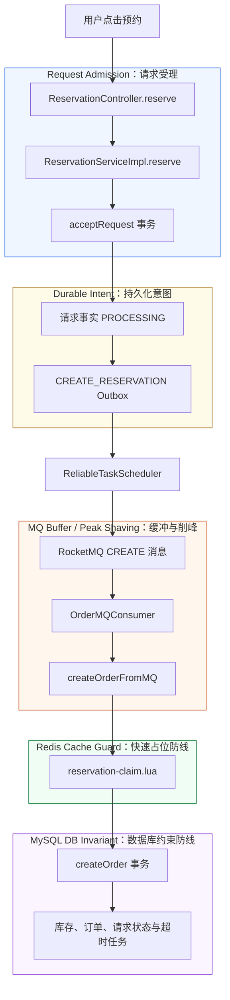

> 接下来从用户点击“预约”的入口源码开始，一步一步走完整条链路。始终分清四件事：**请求事实与 CREATE 意图已提交、消息已被 Broker 确认、Redis 占位成功、MySQL 订单事务已提交**。

## 2. 用户点击以后，Controller 做了什么？

小林发出：

```http
POST /reservations/101?acceptWaitlist=false
```

入口在 `src/main/java/com/citypass/controller/ReservationController.java`：

```java
@PostMapping("/{passId}")
public Result reserve(@PathVariable Long passId,
                      @RequestParam(defaultValue = "true") boolean acceptWaitlist) {
    return reservationService.reserve(passId, acceptWaitlist);
}
```

Controller 把活动通行证 ID 和是否接受候补交给 `IReservationService`，实际进入 `ReservationServiceImpl.reserve()`。它没有在这里查库存，也没有创建数据库订单。

此时运行的是处理本次请求的 HTTP 线程。进入 Controller 前，项目的登录刷新、登录校验和预约限流拦截器可能已经操作 Redis；本文后面的“Redis 尚未变化”，仅指**本次预约的请求状态、名额库存和 Claim 数据**，不包含登录与限流 Key。

| 刚进入 Controller 时 | 本次请求对应的状态 |
| --- | --- |
| MySQL 订单 | 还没有创建 |
| MySQL 请求事实 | 还没有创建 |
| Redis 请求状态投影 | 还没有初始化 |
| Redis 库存、持有人 | 还没有被本次请求修改 |
| CREATE Outbox / 消息 | 都还没有创建或发送 |

Controller 是入口，真正编排请求受理的是 `ReservationServiceImpl.reserve()`。现在继续进入这个方法。

## 3. reserve：先给请求一个身份，而不是直接发名额

### 3.1 先拿 userId

方法先检查 `activityPassId` 非空、`UserHolder.getUser()` 非空，否则返回“参数错误或用户未登录”。随后从 `UserHolder` 取出当前用户 ID。

这里没有接收前端传来的 `userId` 作为预约归属，而是使用登录上下文里的身份。活动是否存在、是否上架、是否到预约时间，**此刻尚未校验**，这些检查在消费者中进行。

### 3.2 生成 requestId，并装进一个请求对象

关键代码：

```java
long requestId = redisIdWorker.nextId("reservation");
ReservationOrder request = new ReservationOrder()
        .setId(requestId)
        .setUserId(userId)
        .setActivityPassId(activityPassId)
        .setSource(ReservationStatus.SOURCE_DIRECT)
        .setPromotionRound(0)
        .setResourceVersion(0L)
        .setAcceptWaitlist(acceptWaitlist);
```

虽然对象类型叫 `ReservationOrder`，现在它只是内存中的请求载体。`new ReservationOrder()` 不等于执行过数据库 `INSERT`。

`RedisIdWorker.nextId()` 使用时间差与 Redis 自增计数拼接 ID：计数 Key 是 `icr:reservation:yyyy:MM:dd`，最终表达式为 `timestamp << 32 | count`。这里记住 ID 在入口生成即可，不需要为了理解预约而背位运算细节。

**这个 ID 后面会怎样使用？**

| 时刻 | `10001` 的含义 |
| --- | --- |
| HTTP 受理事务 | `tb_reservation_request.request_id`，也是 CREATE Outbox 的业务身份 |
| CREATE 消息 | `ReservationOrder.id`，标识同一业务请求 |
| Lua 占位 | Claim 中 `orderId:resourceVersion` 的订单部分；直接预约初始版本为 0 |
| 直接预约落库 | `tb_reservation_order.id`，同时成为订单号 |
| 结果查询 | 用同一个 ID 查询请求或订单 |

> `requestId` 是预先分配的身份，**不是已创建订单的证明**。正常直接预约成功后，`requestId == orderId`；这不代表生成 ID 的时候订单已经存在。

每次重新调用 HTTP `reserve()` 都会生成一个新 ID。因此“用户又点了一次”与“MQ 重投同一条消息”是两种不同情况，后面的 Claim 必须区分它们。

### 3.3 持久化 PROCESSING 与 CREATE 意图：先让“已受理”可恢复

`reserve()` 不直接发送 MQ，而是调用另一个 Spring Bean 的事务方法 `acceptRequest(request)`：

```java
@Transactional(rollbackFor = Exception.class)
public void acceptRequest(ReservationOrder request) {
    requestMapper.insert(new ReservationRequest()
            .setRequestId(request.getId())
            .setUserId(request.getUserId())
            .setActivityPassId(request.getActivityPassId())
            .setAcceptWaitlist(Boolean.TRUE.equals(request.getAcceptWaitlist()))
            .setStatus(ReservationStatus.PROCESSING));
    reliableTaskRepository.enqueue(
            ReliableTaskRepository.CREATE_RESERVATION,
            "create-reservation:" + request.getId(),
            JSONUtil.toJsonStr(request));
}
```

| 数据 | 写入前 | 事务提交后 | 用途 |
| --- | --- | --- | --- |
| `tb_reservation_request(10001)` | 不存在 | `user_id=42, status=PROCESSING` | 持久化请求归属与处理结果 |
| `tb_reliable_task` | 无本请求任务 | `CREATE_RESERVATION / PENDING` | 持久化尚待投递的 CREATE 意图 |
| Redis 请求状态投影 | 不存在 | 尽力写入 owner 与 `PROCESSING`，TTL 5 分钟 | 降低短期轮询成本，不承担最终事实 |
| Redis / MySQL 库存 | 100 / 100 | 100 / 100 | 此刻尚未竞争名额 |

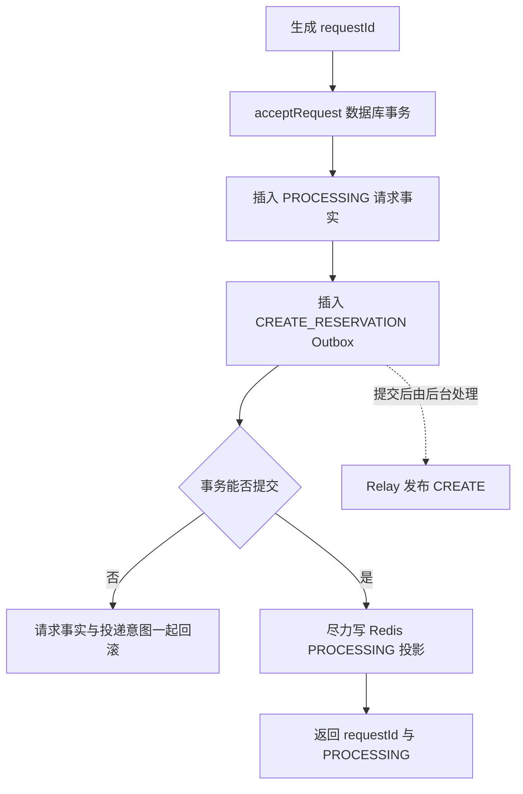

**💡 为什么这么设计？**

请求后面可能排队，HTTP 线程无需一直占着连接等库存竞争和订单事务。`PROCESSING` 让“尚未得出结果”成为持久化、可查询的状态；`requestId` 则把入口响应、Outbox、MQ 消息和未来订单连接起来。

**⚠️ 容易讲错**：Redis owner 和状态仍然是两个普通写入，但它们已经降级为短期投影。即使 Redis 投影失败，已经提交的 MySQL 请求事实和 CREATE Outbox 也不会被推翻，查询接口会直接读取 MySQL。

现在 HTTP 线程已经完成的是**可靠受理**，还没有占用名额，也没有要求 Broker 此刻可用。

## 4. CREATE Outbox：HTTP 提交意图，Relay 再同步发送消息

### 4.1 消息里有什么？送到哪里？

`acceptRequest()` 已经把请求对象的 JSON 保存为 Outbox payload。后台 `ReliableTaskScheduler` 领取 `CREATE_RESERVATION` 任务后，才调用 `OrderMessagePublisher.sendOrderCreate(request)`；MQ 启用时实现为 `RocketMQProducer`，它把同一请求对象序列化成 UTF-8 JSON。

下面仅展示本次请求已设置的核心字段，不保证字段顺序或空值序列化形式：

```json
{
  "id": 10001,
  "userId": 42,
  "activityPassId": 101,
  "source": "DIRECT",
  "promotionRound": 0,
  "resourceVersion": 0,
  "acceptWaitlist": false
}
```

`acceptWaitlist` 在实体上标了 `@TableField(exist = false)`：可以携带在 MQ 请求里，不是订单表字段。消息里也没有另设一个 `requestId` 字段，业务请求号使用 `id`。

| 配置项 | 本版本实际值 |
| --- | --- |
| Topic：业务消息主题 | `citypass-reservation-topic` |
| CREATE Tag：创建请求分类 | `CREATE` |
| Producer Group | `citypass-reservation-producer` |
| Consumer Group | `citypass-reservation-consumer` |
| Consumer 订阅表达式 | `CREATE || TIMEOUT` |
| 发送超时配置 | `setSendMsgTimeout(3000)` |
| 发送失败重试次数配置 | `setRetryTimesWhenSendFailed(2)` |
| Relay 批量上限 | 50；每次紧邻执行前只领取 1 条，避免同批后部任务租约先过期 |

发送端重试和消费端重试不是同一件事。前者是 Relay 把消息送到 Broker 的重试；后者是业务处理失败后的重新消费。上面的 3 秒只限制一次同步发送尝试，不能直接当作一条可靠任务从 PENDING 到 DONE 的总耗时上限。

### 4.2 核实：Producer 仍是同步发送，但等待者已经不是 HTTP 线程

`RocketMQProducer.sendOrderCreate()` 的决定性一行是：

```java
SendResult result = producer.send(message);
```

这里没有 `SendCallback`，没有异步发送回调。等待 `producer.send()` 返回的是可靠任务线程；`ReliableTaskScheduler.requireSendOk()` 检查 `SendStatus.SEND_OK` 后才把任务标成 DONE。发送异常或未得到 SEND_OK 时，任务按指数退避重试，达到上限后进入 DEAD。这一发送形态与 [RocketMQ 4.x 官方同步发送示例](https://rocketmq.apache.org/docs/4.x/producer/02message1/) 一致。

成功受理后，方法返回的数据语义是：

```json
{
  "success": true,
  "data": {
    "requestId": 10001,
    "status": "PROCESSING"
  }
}
```

这不是代码显式设置的 HTTP `202 Accepted`；源码返回的是 `Result.ok(data)`。`success=true` 说明请求事实与 CREATE 意图已经提交，**不是消息必然已经发送，更不是预约已经成功**。

> HTTP 只同步等待本地数据库受理事务；Relay 线程再同步等待 Broker 的发送结果；订单业务由消费者异步执行。三段边界必须分开。

Outbox 提交后，Relay 可能很快发布，消费者甚至可能在 HTTP 响应到达用户前完成订单。准确的关系是“HTTP 不等待消息发布和消费者”，不是“后台必须等 HTTP 返回才启动”。入口返回固定的 `PROCESSING`，也未必代表用户收到响应时的最新状态。

### 4.3 为什么多加一层 MQ？看压力发生了什么变化

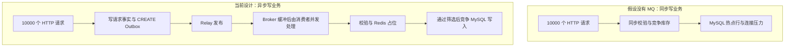

MQ 没有让 MySQL 单次 `UPDATE` 更快。它让库存竞争和订单事务不必跟着 HTTP 瞬时并发一起启动。Broker 可用时压力转成消息积压；Broker 不可用时，尚未发布的意图先积压在 `tb_reliable_task`，恢复后继续发送。无论积压在哪一层，用户看到的都是处理时间变长，而不是数据库能力凭空增加。

当前消费者使用 `MessageListenerConcurrently`，不是单线程 FIFO 扣库存，也没有在源码里设置专门的消费 QPS 或显式消费线程数。因此“可控速率”应理解为**可以通过消费并发和部署容量调节**，不能声称这个项目已经实现严格固定速率。

另外，后面会看到 Lua 之前已有 MySQL 读取；选择候补的售罄请求还可能写候补表。因此不能说“用了 Redis 后，所有失败请求完全不访问数据库”。Lua 主要减少无效的**扣库存和创建订单写竞争**。

**🔥 面试重点：削峰到底是什么？**

> 我把请求受理和订单创建拆开：入口先在一个 MySQL 事务里保存 PROCESSING 请求事实和 CREATE Outbox，提交后就返回请求号；Relay 再向 RocketMQ 发布，消费者独立处理库存与订单。这样 Broker 暂时不可用也不会丢掉已经受理的 CREATE 意图，瞬时业务压力则转成 Outbox 或消息积压。它不提高数据库单次操作速度，仍要管理消费并发、积压和等待时间。

## 5. CREATE 到达消费者：为什么还没进 Lua，就要考虑重试？

### 5.1 Consumer 解析的是“请求”，不是成功订单

`OrderMQConsumer.init()` 注册了并发消息监听器。监听器取得 Tag 和消息体后，CREATE 分支执行：

```java
ReservationOrder order = JSONUtil.toBean(body, ReservationOrder.class);
reservationService.createOrderFromMQ(order);
```

因此真正的写业务入口是 `ReservationServiceImpl.createOrderFromMQ()`。源码没有一个单独声明的 `OrderMQConsumer.consumeMessage()` 方法；消费逻辑写在 `init()` 里的 Lambda 监听器中。

处理过程中抛出 `Exception`，监听器返回 `RECONSUME_LATER`；遍历本批消息没有异常，才返回 `CONSUME_SUCCESS`。如果批次前面的消息已完成、后面的失败，也要考虑已经处理过的消息再次出现。

与这个项目有关的 At-Least-Once（至少一次投递语义）可以这样理解：**不能假设同一业务请求只进入消费者一次**。消费者失败重试会带来重复投递；Relay 在 Broker 已收消息、但自身租约过期或尚未标记 DONE 时也可能再次发送。两层都要求业务处理重复请求。它不是“任何失败都会无限重试直到预约成功”的承诺，Outbox 达到 `max_retry` 后会进入 DEAD。消费失败的重投机制可参见 [RocketMQ 官方消费重试说明](https://rocketmq.apache.org/docs/featureBehavior/10consumerretrypolicy/)。

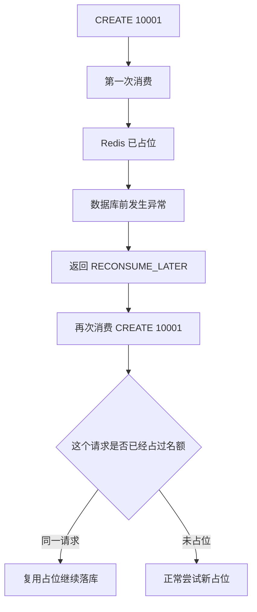

问题已经很具体了：第一次扣过 Redis，第二次如果再扣一次，名额就被同一个请求多占了。所以后面需要知道的不是简单的“用户有没有来过”，而是“名额究竟属于用户的哪一次请求”。

### 5.2 进入 createOrderFromMQ 后，真实顺序是什么？

还不能直接跳到 Lua。源码依次执行：

| 顺序 | 代码位置 | 实际动作与短路结果 |
| --- | --- | --- |
| 1 | 方法开头 | 检查 `userId/activityPassId/requestId` 非空；缺失则抛异常 |
| 2 | `getLock()`、`tryLock()` | 获取 `lock:reservation:user:42`；拿不到锁就抛异常，交给 MQ 重试 |
| 3 | `validateActivityWindow()` | 查询活动、库存记录；检查活动 `status=1`、`type=1` 和预约时间；不满足则写对应 `FAIL_*` 并返回 |
| 4 | `findActiveOrder()` | 查询该用户该活动状态为 `1,2,3,5` 的订单；同 ID 返回已有订单状态，其他 ID 返回 `FAIL_REPEAT` |
| 5 | `findActiveWaitlist()` | 查询 `WAITING/OFFERED` 候补；同请求返回已有候补状态，其他请求返回 `FAIL_REPEAT` |
| 6 | `RESERVE_CLAIM_SCRIPT` | 前面没有结果，才执行 Redis Lua 占位 |

这把锁的粒度是**用户**，不是“活动 + 用户”，同一用户预约不同活动也共用该用户锁。它降低并行处理同一用户的竞争，但不替代数据库约束；不同用户争同一个活动，仍需 Lua 和数据库条件更新。

举例：`10001` 已经成功落库但 MQ 又投了一次，只要活动校验仍通过，第 4 步就能找到它，返回 `RESERVED` 或当前订单状态，**不用再执行 Lua 和扣数据库库存**。

注意第 3 步在第 4 步之前。活动已结束时，重试先被写成 `FAIL_ENDED`，不会先查已有订单；这个顺序对异常边界有影响，第 11 节再讨论。

现在假定小林没有订单、没有候补，活动正常，我们终于来到 Lua。

## 6. Lua Claim：一次认领要同时记下哪些事实？

Claim 在这里是“名额认领或占位”。脚本要在一次不可被其他 Redis 命令穿插的执行中回答：用户已有名额吗？如果有，是否属于本次请求？如果没有，还有库存吗？成功时要怎样把三份 Redis 数据一起改好？

### 6.1 先看三种 Key 的数据结构

| Key 模板 | 实际示例 | 类型与值 | 为什么需要 |
| --- | --- | --- | --- |
| `reservation:stock:{activityPassId}` | `reservation:stock:101` | String，数字，如 `10` | 判断可竞争名额；没有它就无法在这里筛掉无库存请求 |
| `reservation:holders:{activityPassId}` | `reservation:holders:101` | Set，成员为用户 ID，如 `42` | 记录这个活动哪些用户占位；支持成员判断和按活动枚举 |
| `reservation:claim:{activityPassId}:{userId}` | `reservation:claim:101:42` | String，`orderId:resourceVersion`，如 `10001:0` | 记录名额属于哪个订单及哪一代交接，支持重试、回滚和补位版本校验 |

表里的花括号表示文档占位符。真实 Key 是 `reservation:stock:101`，**不含花括号**。Java 把参数放在 `ARGV` 里，Lua 自己拼 Key：

```java
stringRedisTemplate.execute(
        RESERVE_CLAIM_SCRIPT,
        Collections.emptyList(),
        activityPassId.toString(), userId.toString(), requestId.toString(),
        String.valueOf(request.getResourceVersion()));
```

因此不要把这个脚本描述为已经按 Redis Cluster 同槽要求设计好的脚本。当前部署是单 Redis 实例；迁移 Cluster 需要另行检查 Key 传递与槽位。

为方便读图，下面将三个长 Key 简写成 stock、holders、claim；实际名称以上表为准。

| 一次正常新占位 | stock | holders | claim(42) | MySQL |
| --- | --- | --- | --- | --- |
| 执行前 | 10 | 不含 42 | 不存在 | 无本次订单 |
| 执行后 | 9 | 加入 42 | `10001:0` | 仍无本次订单 |

**holderKey 和 claimKey 为什么不能随便删一个？**

只剩 holders，就只知道小林占过位，不知道是 `10001` 重试、`10002` 新请求，还是一次更晚的候补交接。只删 holders 而保留 claim，也会破坏当前脚本的成员判断，以及对账代码按活动枚举持有人的方式。

不过，这不等于从数据建模上“必须两个 Key 才能实现”。例如按活动建立 `Hash<userId,requestId>`，理论上可以同时表达成员和归属；那是另一种实现，需要一起修改 Claim、回滚、释放和对账。本源码选择 Set + String，本文解释的是这套实际结构。

### 6.2 场景 A：库存充足，小林第一次预约

脚本首先检查 holders，不存在小林；再读取 stock，值为 10；于是执行：

```lua
redis.call('incrby', stockKey, -1)
redis.call('sadd', holderKey, userId)
redis.call('set', claimKey, expectedClaim)
return 0
```

`expectedClaim` 由 `orderId .. ':' .. resourceVersion` 得到。直接预约的资源版本从 0 开始，因此 stock 从 10 变成 9，holders 加入 `42`，claim 写入 `10001:0`。返回 `0` 表示**允许继续落库**。

**💡 为什么必须原子执行？**

假如“查是否占位”“判断库存”“扣库存”“登记归属”分成多次普通请求，中间就可能穿插别的消费者：两个不同用户都先看到最后 1 个名额，随后都执行扣减；或者同一请求重试时看到库存已扣，却还没看到归属登记。

Lua 把这些检查和修改放进一次连续执行，其他命令不能插在中间。关于这一执行语义，参见 [Redis 官方 Lua 脚本说明](https://redis.io/docs/latest/develop/programmability/eval-intro/)。这里说的是正常脚本执行时的隔离，**不是 MySQL 式异常自动回滚，也不是跨 Redis、MySQL 的事务**。

### 6.3 场景 B：同一个 requestId 被 MQ 再次投递

假设第一次执行 Lua 后，程序在数据库落库前异常。第二次依然是 `userId=42, requestId=10001`。

脚本先执行：

```lua
if redis.call('sismember', holderKey, userId) == 1 then  //如果当前用户已经在 holder 集合中
    local existing = redis.call('get', claimKey)    //查询这个用户当前对应的 claim

    -- 如果现有 claim 和本次请求期望的 claim 完全一致，
    -- 说明这是同一个请求的重复执行，例如 MQ 重试
    -- 此时不能再次扣库存，直接返回 0，允许后续继续落 MySQL
    if existing == expectedClaim then
        return 0
    end

    -- 兼容旧版本 v3 的 claim 格式
    -- v3 可能只保存了 orderId，没有拼接 resourceVersion
    if resourceVersion == '0' and existing == orderId then
        redis.call('set', claimKey, expectedClaim)
        return 0
    end

    -- 用户已经占有名额，但 claim 不是当前请求的
    -- 说明名额属于另一个 request/order
    -- 返回 2，表示“该用户的名额已被其他请求占用”
    --同一个用户用两个不同 requestId 重复占名额。
    return 2 
end
```

| 同请求重试 | stock | holders | claim(42) | 返回值 |
| --- | --- | --- | --- | --- |
| 执行前 | 9 | 含 42 | `10001:0` | — |
| 执行后 | 9 | 仍含 42 | 仍为 `10001:0` | `0` |

它直接返回 `0`，没有再执行 `INCRBY -1`。即使 stock 已是 0，只要 holders 与 claim 仍匹配，也会先走这个分支，复用已经占到的名额。

> `0` 有两种来源：**本次新占位成功**，或者**同一个请求此前已占位，本次允许续跑**。不能把每次返回 `0` 都理解成刚刚又扣了一份库存。

如果前一次已经存在有效数据库订单，正常情况下早在第 5 节的数据库查重处就返回了；本场景专门讨论“Redis 有占位，MySQL 还没有订单”。

### 6.4 场景 C：小林又点了一次，生成新请求 10002

已有 `holders` 包含 `42`，`claim(42)=10001:0`；现在消息带的是 `10002:0`。

Lua 发现用户已占位，但归属不是当前 ID，返回 `2`。Redis 三种数据保持不变，Service 写 `FAIL_REPEAT` 并返回。

| 判断对象 | 条件 | 动作 |
| --- | --- | --- |
| 同一个请求与资源版本的重试 | holder 存在，claim 等于 `requestId:resourceVersion` | 返回 `0`，不重复扣，继续落库 |
| 新请求或错误资源版本 | holder 存在，claim 与期望值不同 | 返回 `2`，拒绝本次请求 |

它比较的是**业务请求 ID 与资源版本**，不是 RocketMQ 的 `msgId`。脚本还兼容 v3 遗留的无版本直接预约 claim：当资源版本为 0 且旧值恰好等于 requestId 时，会原地升级成 `requestId:0`。其他版本不匹配一律拒绝。

### 6.5 场景 D：库存耗尽，或者库存 Key 不存在

在用户尚无 holder 的前提下，脚本读取 stock：

```lua
local stock = tonumber(redis.call('get', stockKey))
if stock == nil or stock <= 0 then
    return 1
end
```

返回 `1`，不写 holder、不写 claim、不扣库存。Java 接着进入 `handleSoldOut()`：不接受候补则写 `FAIL_STOCK`；接受候补则尝试创建候补记录。

**Key 不存在也会按库存不足处理**，不是当场回源 MySQL 重新初始化。活动发布后的库存初始化是另一条可靠任务链；这一部分将在后续对应简历模块单独展开。

### 6.6 把脚本返回值和 Java 分支对齐

| Lua 结果 | 精确含义 | `createOrderFromMQ()` 接下来做什么 |
| --- | --- | --- |
| `0` | 新占位成功，或同请求已占位 | 调用数据库创建事务 |
| `1` | 新占位时库存缺失、不可转成数字或不大于 0 | 调用 `handleSoldOut()` |
| `2` | holder 已存在且 claim 与当前请求及资源版本不相等 | 尝试将请求结果写为 `FAIL_REPEAT`，结束 |
| Java 收到 `null` | 脚本结果异常 | 抛异常，走 MQ 重试 |

本脚本正常返回只有 `0/1/2`。Java 当前写法是先排除 `null/1/2`，其余值进入事务，并没有额外显式校验 `claim == 0`。

这层就可以称为 **Cache Guard（缓存侧的快速防线）**：它做库存筛选、重复占位判断和重试识别。项目没有一个名为 `CacheGuard` 的类，这只是对职责的归纳。

**🔥 面试重点：Lua 如何支持 MQ 重试幂等？**

> 我不只记录用户占位，还把 claim 写成 `orderId:resourceVersion`。重复投递同一请求时，Lua 发现 holder 与归属版本都匹配，就允许继续落库而不再扣 Redis；不同请求或错误版本会被拒绝。直接预约版本从 0 开始，后续候补交接逐次递增，回滚与转移也校验期望版本。已经落库的重试还会优先在数据库有效订单查询处结束，所以幂等是多层配合。

最后记住前提：如果 Redis 数据被部分删除，holder 与 claim 不一致，脚本不会自动修复这种结构。比如 holder 有值但 claim 丢失，会返回 `2`；反过来 holder 丢失时，脚本不会仅凭孤立 claim 识别旧占位。

## 7. Redis 明明已经扣库存了，为什么 MySQL 还要再扣一次？

先暂停在这个时刻：小林的 Lua 返回 `0`，Redis stock 已减一，claim 写入 `10001:0`。**数据库还没有当前订单，也没有完成这次名额的最终记账。**

两份 stock 看起来都是数字，职责却不同：Redis 数字用于快速筛选谁可以进入后面的写竞争；数据库数字用于在提交订单时，检查并记录真实剩余资源。它们不是为了“同一个数字存两份备份”。

### 7.1 用一个不一致场景理解数据库为什么不能盲信 Redis

假设此刻：

| 数据位置 | 库存 |
| --- | --- |
| Redis | 1 |
| MySQL | 0 |

这不必是正常主链路的必然状态，但它是需要防御的状态：例如 Redis 被错误恢复成较旧值、人工修复写错、回补与数据库状态变化存在时间差。普通 Claim 成功而 DB 尚未落库，往往会造成 Redis 比 DB 更少；**并不是所有异常都一定造成 Redis 比 DB 多**。

如果应用认为“Lua 成功就可以无条件插订单”，小林就会在数据库已经没有名额时拿到新订单。

当前代码没有这样做。Lua 返回 `0` 后，仍进入 `ReservationTransactionalService.createOrder()`，由数据库自己的条件更新做最终检查。如果数据库 stock 为 0，这次扣减不会成功，也不会插入订单。

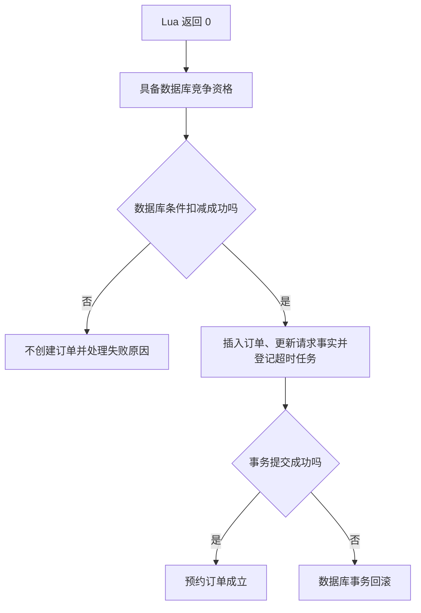

> Redis Claim 成功只是“已占到一个前置资格”，最终预约成立必须以**数据库订单事务提交**为准。`RESERVED` 是预约成功、等待支付，不是已经支付成功。

### 7.2 两份库存暂时不同，什么时候是正常的？

| 时间点 | Redis stock | MySQL stock | 当前请求订单 |
| --- | --- | --- | --- |
| 占位前 | 10 | 10 | 无 |
| Lua 完成，DB 尚未扣减 | 9 | 10 | 无 |
| DB 事务已提交 | 9 | 9 | 有，状态 1 |

中间这一行并不自动意味着错误。两套系统没有被同一个事务包住，异步执行本来就有先后；问题在于失败时能否继续、清理或修复，而不是要求每一微秒都相等。

## 8. 进入 createOrder：把名额和订单放进同一笔数据库事务

现在定位 `src/main/java/com/citypass/service/impl/ReservationTransactionalService.java` 的 `createOrder()`。

入口注解：

```java
@Transactional(rollbackFor = Exception.class)
public CreateResult createOrder(ReservationOrder order, int offerMinutes)
```

调用方是另一个 Spring Service 中注入的 `transactionalService`，不是本类内部自调用。正常 Spring 事务代理生效时，事务包住整个方法；调用方拿到正常返回结果时，提交阶段已经经过。

### 8.1 第一步不是先 SELECT，而是直接条件更新

核心代码如下：

```java
int stockRows = stockMapper.update(null,
        new UpdateWrapper<LimitedPassStock>()
                .setSql("stock = stock - 1")
                .eq("activity_pass_id", order.getActivityPassId())
                .le("begin_time", now)
                .gt("end_time", now)
                .gt("stock", 0));
```

用于理解语义的等价 SQL 是：

```sql
UPDATE tb_limited_pass_stock
SET stock = stock - 1
WHERE activity_pass_id = :activityPassId
  AND begin_time <= :now
  AND end_time > :now
  AND stock > 0;
```

这里的 `:now` 是教学参数记号，实际 Java 用 `LocalDateTime.now()` 生成参数；不是声称仓库里存在这份手写 SQL，也不是数据库 `NOW()`。Mapper 都继承 MyBatis-Plus `BaseMapper`，SQL 由框架根据 Wrapper 生成。

这一步同时验证库存行、预约时间窗和剩余名额。消费者之前已经检查过活动信息，但排队、运行时间和并发变化可能让前一次检查过时，所以数据库写入时仍带时间窗和库存条件。

严格说，事务里没有再次读取 `ActivityPass.status/type` 做完整上架校验；它在库存更新条件里复核的是**时间和库存**。不能将两层校验笼统说成“事务内再次验证所有业务条件”。

### 8.2 UPDATE 没改到行时，才查询原因

如果 `stockRows == 0`，源码 `selectById()` 读取库存行，再分类：

| 当前库存记录 | `CreateResult` |
| --- | --- |
| 记录不存在 | `UNAVAILABLE` |
| 开始时间晚于当前时间 | `NOT_STARTED` |
| 结束时间为空或不晚于当前时间 | `ENDED` |
| 以上均不满足 | `SOLD_OUT` |

因此，**受影响行数为 0 不只可能代表库存不足**，也可能是时间窗或记录条件不满足。这个后续 SELECT 用于解释失败，不是“先查库存再决定要不要减”的并发控制。

### 8.3 最后一个名额，两位消费者怎么竞争？

假设 Redis 漂移或其他异常让不同用户 A、B 都来到数据库，而 MySQL stock 只剩 1。活动时间条件都满足。

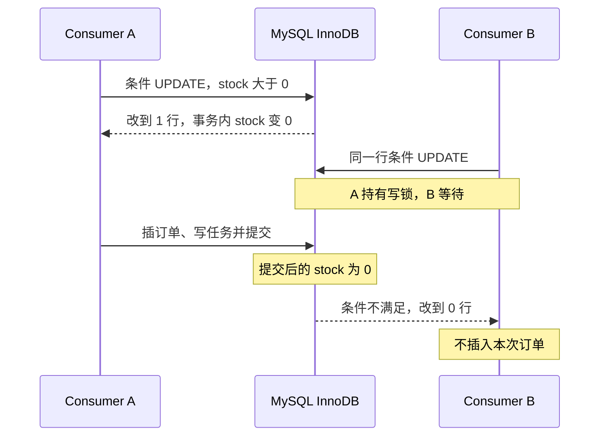

表使用 InnoDB。修改同一库存行需要相应的写锁，竞争方不能各自按照早先读到的 `1` 同时扣减；在 A 提交后，B 的更新条件不再满足。如果 A 最后回滚，库存仍可供 B 竞争。锁等待也可能超时或出现异常，这种情况走异常处理，不能把所有并发都简化成必然立即返回 0 行。相关锁语义见 [MySQL 官方 InnoDB 锁说明](https://dev.mysql.com/doc/refman/8.2/en/innodb-locking.html)。

对比错误写法：两个线程普通 `SELECT` 都读到 1，分别在 Java 判断通过，再无条件执行 `stock = stock - 1`，就可能扣成 -1。即使用 `@Transactional` 包住普通查询和无条件更新，也不自动把这段检查变成安全的并发约束。使用锁定读也可以设计正确方案，但本方法采用的是单条条件更新。

**🔥 面试重点：条件更新为什么防超卖？**

> 因为库存大于零的判断和减一在同一条数据库 UPDATE 中完成，并发更新同一库存行会受到 InnoDB 写锁协调。最后一个名额被前一个事务提交扣掉后，后一个更新不再满足条件，因此不能继续插单。这里没有版本号字段，不是版本号式乐观锁，更不是 Java CAS 自旋。

### 8.4 扣减成功后，订单才真正被插入

`stockRows` 非零后，代码设置：

| 订单字段 | 正常直接预约的值 |
| --- | --- |
| `id` | 入口请求号 `10001` |
| `userId` / `activityPassId` | `42` / `101` |
| `status` | `ORDER_STATUS_UNPAID = 1` |
| `source` | 入口设置的 `DIRECT`；为空也会补成 `DIRECT` |
| `promotionRound` | 入口设置的 `0`；为空也会补 0 |
| `resourceVersion` | 直接预约为 0；以后每次候补接力递增 |
| `offerExpireTime` | `min(now + offerMinutes, activityEnd)`，不会晚于活动结束 |

随后执行 `orderMapper.insert(order)`。注意我们只是拿到待支付名额，支付是后续流程。

但 INSERT 还有一个必须跨过去的数据库约束：**同一个用户不能有多张有效预约**。这个问题和总库存是两回事，单独看下一节。

## 9. INSERT 时的 UNIQUE：保护“一个人几张”，不是“总共多少张”

### 9.1 条件扣减与唯一索引分别约束什么？

| 机制 | 要阻止的错误 | 即使另一机制存在，为什么仍需要它 |
| --- | --- | --- |
| `stock > 0` 条件扣减 | 总名额被扣到负数 | 用户都不同，也可能总量超限 |
| 有效订单唯一索引 | 同一用户、同一活动多张有效订单 | 库存再多，也不应让同一用户占多份 |
| 订单主键 `id` | 相同订单 ID 重复插入 | 它只约束 ID，不等于约束用户与活动 |

Redis 查重和用户锁减少常见重复，但数据库才是订单最终存放的位置，关键业务限制需要在实际写入时成立，不能只靠更早的“我查过没有”。

### 9.2 为什么不直接 UNIQUE(activity_pass_id, user_id)？

如果永久约束活动与用户组合，订单取消后记录仍在，小林以后重新预约也会撞唯一索引。项目希望保留历史记录，又限制同一时刻的有效订单，所以用了 Generated Column（生成列：由数据库根据其他列计算的字段）。

`src/main/resources/db/citypass.sql` 的真实定义节选：

```sql
`active_user_id` bigint(20) GENERATED ALWAYS AS (
    CASE WHEN `status` IN (1,2,3,5) THEN `user_id` ELSE NULL END
) STORED,
UNIQUE INDEX `uk_active_user_pass`(`activity_pass_id`, `active_user_id`) USING BTREE
```

`active_user_id` 不由 Java 实体手动维护。数据库根据状态计算，并以 `STORED` 形式存储生成结果。

| 数据库 status | 含义 | `active_user_id` | 是否参与有效用户唯一性限制 |
| --- | --- | --- | --- |
| 1 | 未支付 | `user_id` | 是 |
| 2 | 已支付 | `user_id` | 是 |
| 3 | 已核销 | `user_id` | 是 |
| 4 | 已取消 | `NULL` | 不再占用非空用户组合 |
| 5 | 退款中 | `user_id` | 是 |
| 6 | 已退款 | `NULL` | 不再占用非空用户组合 |

**“有效”在这里是索引业务口径 `1,2,3,5`，不是只有已支付，也不只是未取消。** `findActiveOrder()` 使用同样的四种状态，与 SQL 对齐。

### 9.3 用两张订单看取消后重新预约

| 时刻 | 订单 | 用户 / 活动 | status | 生成列值 | 唯一索引看到的组合 |
| --- | --- | --- | --- | --- | --- |
| 首次预约 | 10001 | 42 / 101 | 1 | 42 | `(101, 42)` |
| 此时新建第二张 | 10002 | 42 / 101 | 1 | 42 | `(101, 42)`，冲突 |
| 旧订单已取消 | 10001 | 42 / 101 | 4 | `NULL` | `(101, NULL)` |
| 之后重新预约 | 10003 | 42 / 101 | 1 | 42 | `(101, 42)`，可以通过这项约束 |

MySQL 的 UNIQUE 索引允许可空列存在多个 `NULL`，所以历史取消订单可以保留多条，同时非空的有效用户组合仍只能出现一次。这一性质见 [MySQL 官方 CREATE INDEX 文档](https://dev.mysql.com/doc/refman/8.0/en/create-index.html)。

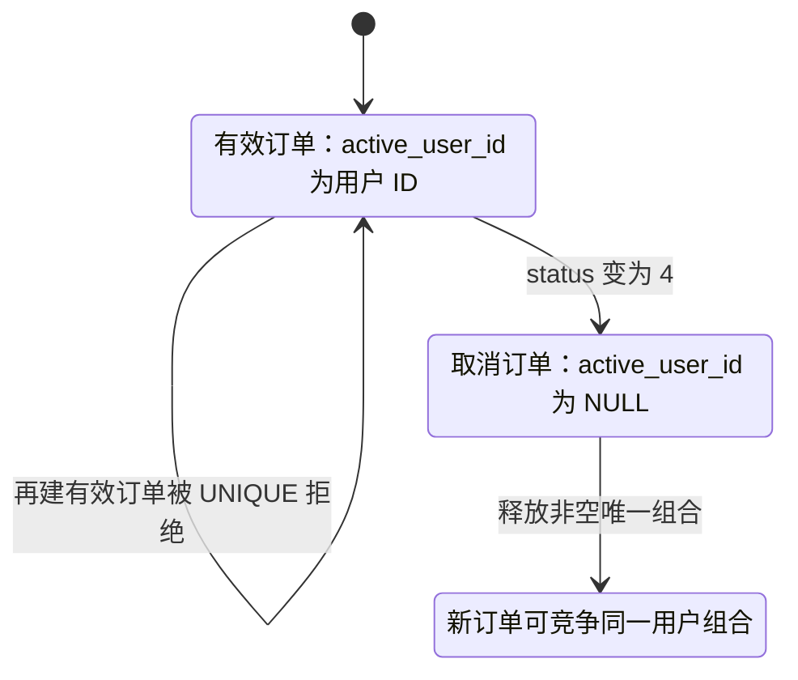

这张图描述的是**唯一组合的占用资格**，不是完整订单状态机。旧订单不会变成新订单；重新预约仍要满足活动时间、库存以及 Redis 占位清理等条件。唯一索引“允许重新预约”不等于“取消后其他资源处理尚未完成也能立刻成功”。

迁移 SQL `deploy/mysql/migration-v3-waitlist.sql` 也会移除旧组合唯一索引并加入这套生成列约束。本文基于当前完整建表 SQL 或已完成对应迁移的数据库，不把老库未迁移的结构当成现状。

## 10. 事务提交：库存、订单、请求事实和超时意图一起成立

### 10.1 不能漏掉 createOrder 最后三项动作

订单插入后，源码继续：

```java
orderMapper.insert(order);
updateRequestState(order.getId(), ReservationStatus.RESERVED, order.getId(), null);
enqueueTimeout(order.getId(), expiresAt);
return CreateResult.CREATED;
```

`updateRequestState()` 以请求表当前状态作为比较条件，将 `PROCESSING` 单调推进为 `RESERVED`，同时写入 `order_id=10001`。`enqueueTimeout()` 再通过 `ReliableTaskRepository.enqueueAt()` 写 `tb_reliable_task`：类型 `ORDER_TIMEOUT`，业务键 `order-timeout:10001`，payload 为订单 ID，`next_retry_time` 就是本单真实 `offerExpireTime`。

因此正常首次创建在同一数据库事务里完成四件事：**扣库存、插订单、推进请求事实、登记按真实截止时间执行的超时任务**。可靠任务后续如何发送 TIMEOUT 消息将在第二篇展开；这里仅为了说明准确的事务边界。

Repository 使用 `INSERT IGNORE`，不是无条件保证每次插入一条新任务：相同业务键已存在时可以被忽略。正常首次创建会登记任务；不能把这里描述成“每个 insert 都检查影响行数必须等于 1”。

### 10.2 用 Before / After 看正常提交

| 数据 | 进入事务前 | 事务执行中 | 成功提交后 |
| --- | --- | --- | --- |
| MySQL stock | 10 | 条件扣成 9 | 9 |
| 订单 10001 | 无 | 插入，状态 1 | 有有效待支付订单 |
| 请求事实 10001 | `PROCESSING` | CAS 更新为 `RESERVED` 并关联订单 | `RESERVED` |
| 超时任务 | 无 | 写 `ORDER_TIMEOUT`，到期时间等于资格截止时间 | 有待到期任务记录 |
| Redis stock | Lua 已扣成 9 | 仍为 9 | 仍为 9 |
| Redis 请求状态投影 | `PROCESSING` 或写入失败 | 不在事务中 | 事务返回后尽力刷新为 `RESERVED` |

如果订单 INSERT 抛出唯一键异常，事务中此前已经执行的库存减一会回滚；如果后面的任务登记抛异常，订单和库存修改也一起回滚。这里依赖项目正常的 Spring 事务、同一数据源以及 InnoDB 表，不是靠 Java 手动执行一条反向 UPDATE。

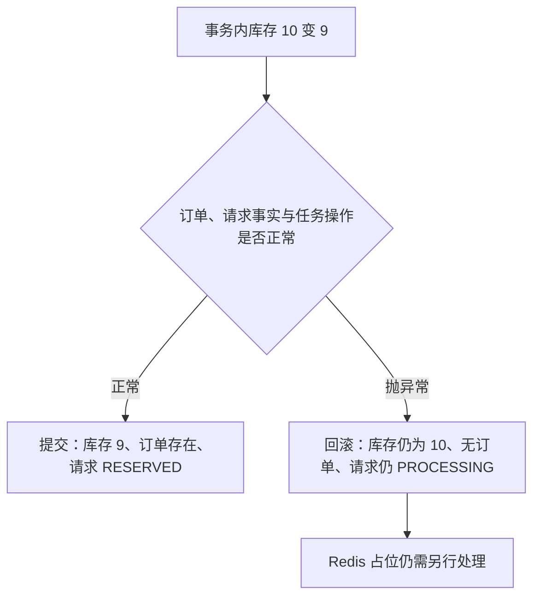

**⚠️ 容易讲错**：`@Transactional` 只覆盖这笔数据库事务。前置 Lua、后置 Redis 投影和 MQ 消费确认都在事务外，不会因为 MySQL 回滚而自动撤销；但 `tb_reservation_request` 的状态更新和超时 Outbox 确实在事务内，不能再把请求状态全部说成 Redis 临时值。

### 10.3 MySQL 已经是 RESERVED，Redis 只做短期投影

`createOrder()` 返回 `CREATED` 时，请求事实已经随订单事务提交。外层 `createOrderFromMQ()` 只执行：

```java
projectRequest(requestId, userId, ReservationStatus.RESERVED);
```

它尽力把 Redis owner 和 `reservation:request:10001=RESERVED` 都刷新为 5 分钟 TTL。Redis 异常只记录警告，不会推翻已提交的数据库事实。随后释放用户锁，业务方法返回；监听器在没有其他异常时返回 `CONSUME_SUCCESS`。

到这里，正常创建链路才真正闭合。

### 10.4 小林怎么知道最终结果？

调用：

```http
GET /reservations/requests/10001
```

`ReservationController.result()` 进入 `getReservationResult()`，顺序是：

1. **先按 requestId 查 `tb_reservation_request`**。存在时立即用持久化 `user_id` 校验归属。
2. 再查订单表；存在则组合订单字段与请求事实状态返回。
3. 没订单，再查候补表；存在则组合候补字段与请求事实状态返回。
4. 订单和候补都尚未出现时，直接返回请求事实里的 `PROCESSING/FAIL_*`、`orderId` 与 `lastError`。
5. 只有查不到 v4 请求事实时，才为旧版存量请求回退 Redis owner 和状态；缺失则返回 `NOT_FOUND`。

订单状态 `1` 映射为 `RESERVED`，`2` 映射为 `PAID`，`4` 映射为 `CANCELLED`；其他状态返回 `ORDER_STATUS_` 加数字。直接预约正常成功还会返回 `orderId`、`source`、`promotionRound`、`offerExpireTime` 等字段。

> **查询优先相信 MySQL 请求事实和业务表，而不是盲信 Redis 投影。** 因此订单已提交但 Redis `RESERVED` 写失败时，用户仍能拿到正确结果；Broker 暂时不可用时，也能从请求表看到持久化的 `PROCESSING`，不会因五分钟 TTL 到期变成身份不明的请求。

### 10.5 到这里再理解 DB Invariant

Invariant 是“所有受支持操作都应维护的业务条件”。对这条创建链路，重点是：

| 业务条件 | 当前实现怎么维护 |
| --- | --- |
| 库存不能被预约扣减成负数 | `stock > 0` 的条件 UPDATE |
| 同一活动、同一用户最多一张有效订单 | `uk_active_user_pass(activity_pass_id, active_user_id)` |
| 成功扣减应对应订单与可查询结果 | 库存、订单、请求事实和超时任务同一数据库事务提交或回滚 |

这就是 **DB Invariant（数据库侧业务不变量）**，也不是源码中某个类的名称。

它让正常链路中的并发、重复投递，以及 Redis 错误放行，不容易直接变成错误订单。但不能脱离前提说“任何情况下数据库都不可能错”：当前 `stock` 是普通有符号整数，DDL **没有 `CHECK(stock >= 0)`**；绕过条件更新手工写成负数，数据库不会凭本文的术语自动阻止。错误增加库存或绕过库存直接插单也不由该条件 UPDATE 全局防住。

正确的面试表达是：**在库存初值合理、经这条事务路径扣减、实际唯一索引生效的前提下，最终写入维护这两项约束。** 防超卖的正确性与所有请求都能成功恢复，是不同问题。

## 11. 如果中间失败了，源码究竟往哪里走？

现在你已经走过正常路线，才适合讨论异常。先记住两种 Redis 脚本，后面所有分支都要区分它们。

### 11.1 rollbackClaim 与 clearStaleClaim 不是一回事

| 方法 / 脚本 | 归属前提 | 对 stock 的动作 | 对 holder / claim 的动作 |
| --- | --- | --- | --- |
| `rollbackClaim()` / `reservation-rollback.lua` | claim 等于当前 `requestId:resourceVersion`，且 stock Key 存在 | 加 1，撤销本次预扣 | 移除该用户、删除 claim；另清理 `reservation:txn:{id}` |
| `clearStaleClaim()` / `clear-stale-claim.lua` | claim 等于当前 `requestId:resourceVersion` | **设置为 0** | 移除该用户、删除 claim |

两个脚本都兼容 v3 的无版本直接预约 claim，但只在当前资源版本为 0 时接受。若 claim 不属于当前请求版本，两者都返回 `0`，不修改数据。回滚脚本若发现 stock Key 不存在，返回 `-1`，**不会继续清 holder 或 claim**；Java 只记录警告。清理脚本的作用则是止住继续放行，不是把本次预扣简单加回去。

`reservation:txn:{id}` 只在这里被清理，本篇 CREATE 主链路没有把它建立为事务状态记录，所以不能据此说“CREATE 使用 RocketMQ 事务消息”。

### 11.2 Case 1：Lua 成功，MySQL 尚未建单，应用异常

第一次消费后：

| 数据 | 状态 |
| --- | --- |
| Redis stock | 10 → 9 |
| holders / claim | 有 42，归属 `10001:0` |
| MySQL stock | 仍为 10，或未提交修改已回滚 |
| MySQL 订单 | 无 10001 |
| MySQL 请求事实 | 仍为 `PROCESSING`，CREATE 意图已持久化 |
| Redis 请求投影 | 可能为 `PROCESSING`，也可能写入失败 |

如果是被捕获的运行时异常，`createOrderFromMQ()` 记录日志后重新抛出，监听器返回 `RECONSUME_LATER`。如果整个进程直接宕机，它当然来不及返回这个枚举；后续依赖 MQ 对未完成消费的再次投递。

**这里不会在所有 RuntimeException 后立即回滚 Claim。** 保留归属正是为了重试：再次收到 `10001`，活动仍有效、没有现存有效订单和候补时，Lua 识别同一请求，返回 `0` 而不再扣 Redis，然后继续数据库创建。

这条续跑不再依赖 HTTP 进程记住 CREATE 意图：入口 Outbox 已经持久化，Broker 接收后的消费也有自己的重投。但业务续跑仍依赖活动窗口有效、Redis holder 与 claim 未丢失；达到 Outbox 最大重试次数的任务还需要运维查看 DEAD 并重放。因此不能把“可靠受理”说成任何外部故障下都必然成功建单。

### 11.3 Case 2：Redis 认为还有，MySQL 实际售罄

这次执行过程是：Lua 放行；DB 条件更新 0 行；失败原因被归为 `SOLD_OUT`。源码随后：

```java
clearStaleClaim(activityPassId, userId, requestId);
handleSoldOut(request);
```

归属匹配时，Redis stock 被设为 0，同时删除本次 holder 和 claim。**不是执行 rollbackClaim 把 stock 加 1**，否则会继续把错误的库存当成可售名额。

接下来：

| 请求意愿 | 实际结果 |
| --- | --- |
| `acceptWaitlist=false` | 写 `FAIL_STOCK`，没有本次订单 |
| `acceptWaitlist=true` | 尝试事务创建候补，成功写 `WAITLISTED`；候补唯一冲突另按已有记录处理 |

这里的清理是当前失败分支的动作，不是 Redis 与数据库从此永久同步的证明。若清理或状态写入再次报错，仍会抛给 MQ 重试。

候补状态机与补位规则将在后续对应简历模块单独展开。

### 11.4 Case 3：前面的检查漏过重复，订单 INSERT 撞 UNIQUE

假设 Lua 已占位，MySQL 条件扣减成功，但订单 INSERT 抛出 `DuplicateKeyException`。

首先，异常跨出 `createOrder()` 的事务代理，数据库回滚本次库存扣减和未提交写入。然后外层编排方法捕获它，执行：

```java
rollbackClaim(request);
ReservationOrder winner = findActiveOrder(activityPassId, userId);
markRequest(requestId, userId,
        winner != null && requestId.equals(winner.getId())
                ? orderStatus(winner) : ReservationStatus.FAIL_REPEAT,
        winner == null ? null : winner.getId(), "DUPLICATE_ACTIVE_ORDER");
```

所以准确说法是：**先尝试按归属回滚 Redis Claim，再查询有效订单判断结果**。若赢家就是当前 requestId，映射其订单状态；否则写 `FAIL_REPEAT`。

在 stock Key 存在、claim 仍属于本请求的常规场景下，预扣会加回，holder 与 claim 被清理。归属不匹配则不动，避免旧失败请求破坏另一个请求的占位。

不能把这个 catch 简化成“所有唯一冲突都返回失败”，也不能说“这里会按冲突索引名称精确分类”。源码没有检查究竟是主键冲突还是有效用户索引冲突；当前 ID 指向非有效历史订单时，`findActiveOrder()` 也未必找到它。

如果 Redis 回滚过程中抛异常，则本次 catch 不能走到写状态，外层仍抛出并触发重试。如果脚本只返回 `-1`，Java 只记警告，仍继续判断请求结果。

### 11.5 Case 4：Broker 发送失败，已受理请求会怎样？

HTTP 入口不再接触 Broker。只要 `acceptRequest()` 提交成功，调用方就拿到 `requestId` 与 `PROCESSING`；请求事实和 CREATE Outbox 都已经在 MySQL 中。Broker 停机不会把这次请求改成入口失败。

Relay 的处理规则是：

| 情况 | 可靠任务怎样变化 | 请求事实怎样变化 |
| --- | --- | --- |
| Broker 返回 `SEND_OK`，任务租约仍属于当前实例 | 标记 DONE | 先保持 PROCESSING，等待消费者处理 |
| 发送抛异常或返回非 `SEND_OK` | 释放租约，指数退避后回到 PENDING | 保持 PROCESSING |
| 实例在发送后、标记 DONE 前退出 | 租约过期后可被其他实例重新领取，可能重复发送 | 保持已有状态，由业务幂等处理重投 |
| 达到 `max_retry` | 进入 DEAD，可由 Token 保护的接口人工重放 | 保留事实与最后结果，不伪装成已建单 |

本地配置默认 `rocketmq.enabled=false`；完整预约链路必须启用 MQ。Disabled 实现会让 Relay 的任务重试，而不会把请求退回同步建单。可靠性验收脚本实际停止 Broker 后提交请求，验证请求保持 `PROCESSING` 且 CREATE 任务存在；Broker 恢复后最终到达 `RESERVED`。

### 11.6 Case 5：DB 已提交，但写 RESERVED 或消费确认失败

与 Case 1 的差别是：这次订单已真实存在，MySQL stock 已减一，不应再创建一张。

重投后，若活动校验通过，`findActiveOrder()` 找到 ID 为 `10001` 的有效订单，就通过单调请求状态更新取得当前有效状态并返回，不进入 Lua 和建单事务。所以不再扣库存、不再插单。

即使 Redis 还显示 `PROCESSING`，MySQL 请求事实也已经在建单事务中变为 `RESERVED`。`getReservationResult(10001)` 先校验请求事实归属，再组合订单返回；Redis 只承担短期投影。

### 11.7 其他业务结果不是统一“失败就加回库存”

下面专指 **Lua 已放行，事务返回分类结果** 的分支：

| `CreateResult` | Redis 动作 | 请求后续 |
| --- | --- | --- |
| `NOT_STARTED` | `rollbackClaim()`，满足前提时加回预扣 | `FAIL_NOT_STARTED` |
| `ENDED` | `clearStaleClaim()`，满足归属时置零并清占位 | `FAIL_ENDED` |
| `UNAVAILABLE` | 同上 | `FAIL_UNAVAILABLE` |
| `SOLD_OUT` | 同上 | 售罄或候补 |
| `CREATED` | 保留占位 | `RESERVED` |

如果是在 Lua **之前** 的 `validateActivityWindow()` 失败，则直接写对应状态返回，不调用这些清理脚本。两处失败的执行位置不同，不要混画成一条补偿路径。

### 11.8 升级以后仍不能越界承诺什么

这不是让你背一份额外架构，而是防止面试回答超出源码。

- **可靠受理不等于 exactly-once**：Outbox 与 RocketMQ 都按至少一次思路工作，租约恢复可能重复发送；正确性仍依靠 Claim、主键、有效订单唯一索引和状态 CAS。
- **Claim 后跨过活动结束时间**：重试首先被 `validateActivityWindow()` 拒绝并尝试把请求事实推进为 `FAIL_ENDED`，不会进入同请求 Claim 续跑。对账会重算结束活动库存，但不会把过期请求强行补成订单。
- **DEAD 仍需要运维动作**：任务有最大重试次数、积压与死信指标以及重放接口，但外部依赖长期不可用时，系统不会无限静默重试。
- **历史终态消息只保证不产生新业务效果**：同一 ID 的取消订单再次收到 CREATE，可能继续走到主键冲突与 Claim 回滚；单调请求状态 CAS 不会让 `CANCELLED/EXPIRED/PAID` 倒退成 `RESERVED`，但不承诺每次重投都返回和第一次完全相同的内部分支。

这些边界不意味着正常创建路径会轻易超卖；它们说明：**防止错误订单提交，与保证任何已受理请求最终完成，是两种不同的能力。** 本篇能够讲清前者和现有重试路径，不把后续模块的名字当作后者已经完备的证据。

## 12. 正常链路最终版：把刚才的步骤连起来

为了避免参与者横排导致 GitHub 图过宽，完整时序拆成两张连续图：A 负责 HTTP 受理与 Outbox 发布，B 从同一条 CREATE 消息继续到订单提交。**拆图不表示 Relay 或消费者必须等 HTTP 响应完成后才运行。**

### 12.1 图 A：从点击到受理响应

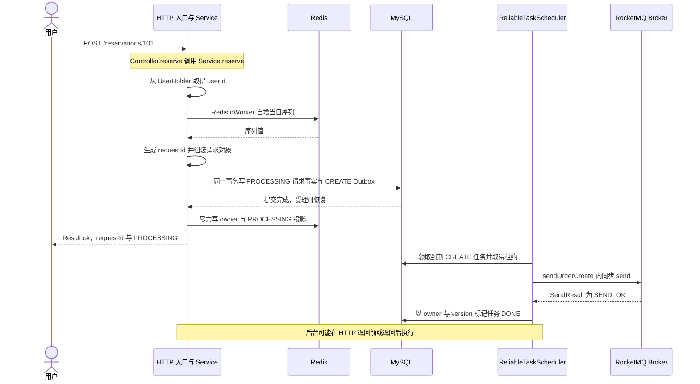

### 12.2 图 B：同一条 CREATE 从消费到最终订单

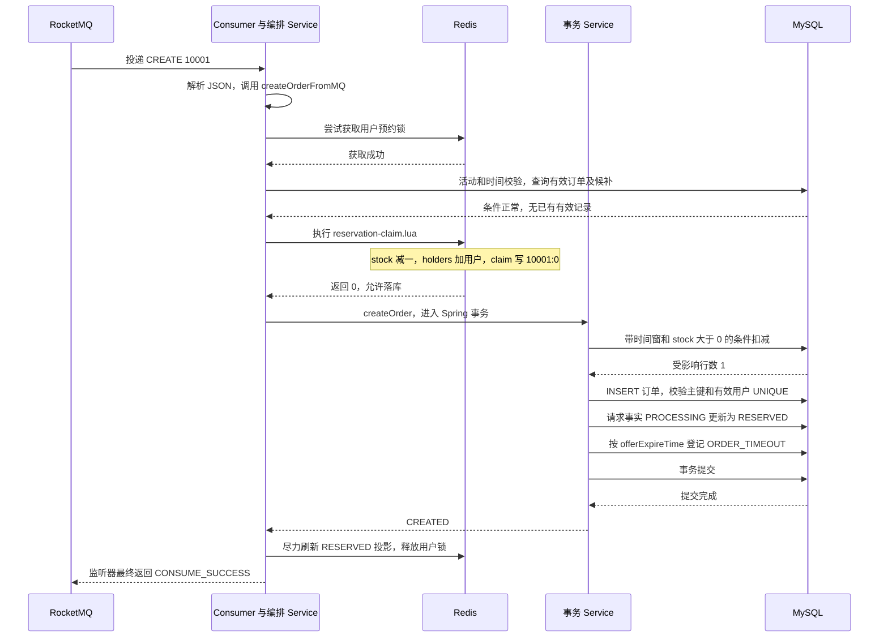

两张图默认所有操作正常、消费者批次没有其他失败、活动窗口有效，并省略了已经展开过的异常分支。

从用户角度看，最后还可以执行结果查询：`GET /reservations/requests/10001`。它先用 MySQL 请求事实校验归属，再组合状态 1 订单，返回 `RESERVED` 和 `orderId=10001`。至此，HTTP 点击和最终订单通过同一个持久化请求号连起来了。

### 12.3 一张表复盘数据的真实变化

| 阶段 | MySQL 请求事实 | CREATE / TIMEOUT 任务 | Redis 请求投影与资源 | MySQL stock / 订单 |
| --- | --- | --- | --- | --- |
| 点击前 | 无 | 无 | 无本请求投影；stock=10 | stock=10，无订单 |
| 入口事务提交 | `PROCESSING` | CREATE=PENDING | 随后尽力投影 PROCESSING | stock=10，无订单 |
| CREATE 发送确认 | 通常仍为 `PROCESSING` | CREATE=DONE | 资源尚未由入口修改 | stock=10，无订单 |
| 消费者新占位 | `PROCESSING` | CREATE=DONE | stock=9，claim=`10001:0` | stock=10，无订单 |
| 建单事务提交 | `RESERVED`，order_id=10001 | 新增到期 TIMEOUT | stock=9，投影可能稍后刷新 | stock=9，订单状态 1 |
| 投影刷新 | `RESERVED` | TIMEOUT 等待真实截止时间 | 请求状态 `RESERVED` | 保持不变 |

表按教学时间线展示一次执行。真实 Relay、消费者和 HTTP 响应可以交错，因此“CREATE 发送确认”不用于断言用户此刻一定尚未收到响应，也不用于断言消费者尚未处理。

## 13. 现在再看“双重防线”，就不是背术语了

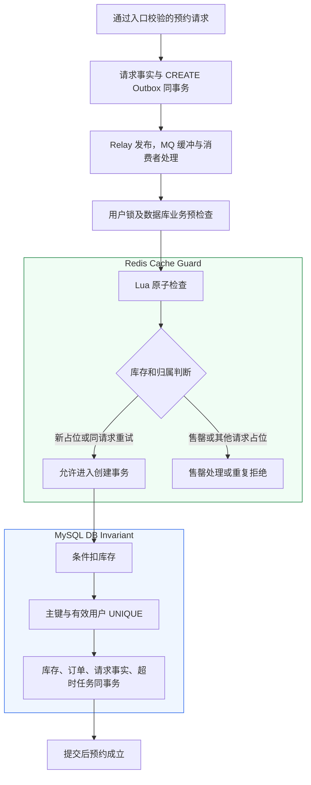

> **Redis 负责减少无效的订单写竞争，MySQL 在实际创建事务中维护库存和有效订单约束。** 两层分工清晰，但不构成一个跨系统强一致事务。

### 为什么不能只用其中一层？

| 方案 | 能做什么 | 与当前需求相比的代价或缺口 |
| --- | --- | --- |
| 只用 MySQL | 条件扣减、UNIQUE、事务也可以实现正确预约 | 高频竞争都靠 DB 处理，热点写锁与连接压力更集中；不是逻辑上不可行 |
| 只用 Redis，取消 DB 最终约束 | Lua 能高效判断和占位 | 一旦 Redis 漂移或结构丢失，订单落库缺少最终库存与重复约束；不适合把它当成本项目唯一业务账本 |
| Redis + MySQL | Redis 筛掉部分无效写入，DB 在提交时验证约束 | 多了跨系统状态差异与失败处理，需要准确区分重试、回滚和清理 |
| 再加入 MQ | 受理与业务执行分离，积压缓冲瞬时压力 | 多了异步结果查询、重复投递和积压管理，处理能力仍然有限 |

这里“最终账本”主要指持久化订单事实；数据库 stock 是随业务维护的剩余资源数，库存重算还会参考 `initial_stock` 和有效订单数量。不能把 Redis stock 或数据库 stock 的任意当前值都当作永不需要核对的真相。

## 14. 源码调用链速查：回 IDEA 应该打开哪些文件？

以下路径都相对于源码根目录。表按调用顺序排列，不依赖容易随修改漂移的行号。`OrderMQConsumer` 的监听器是 Lambda，所以表中不用虚构的 `consumeMessage()` 方法。

| 顺序 | 真实相对路径 | 类 / 方法或位置 | 负责什么 |
| --- | --- | --- | --- |
| 1 | `src/main/java/com/citypass/controller/ReservationController.java` | `ReservationController.reserve()` | POST 入口，委托预约 Service |
| 2 | `src/main/java/com/citypass/service/IReservationService.java` | `IReservationService.reserve()` / `createOrderFromMQ()` | HTTP 与消费者使用的业务接口 |
| 3 | `src/main/java/com/citypass/service/impl/ReservationServiceImpl.java` | `reserve()` / `projectRequest()` | 生成请求载体，提交受理事务，尽力写 Redis 投影并返回请求号 |
| 4 | `src/main/java/com/citypass/utils/RedisIdWorker.java` | `nextId()` | Redis 自增配合时间信息生成 ID |
| 5 | `src/main/java/com/citypass/service/impl/ReservationTransactionalService.java` | `acceptRequest()` | 同事务插入 PROCESSING 请求事实与 CREATE Outbox |
| 6 | `src/main/java/com/citypass/entity/ReservationRequest.java` / `mapper/ReservationRequestMapper.java` | 请求事实映射 | 持久化归属、状态、订单 ID 与最后错误 |
| 7 | `src/main/java/com/citypass/task/ReliableTaskScheduler.java` | `relay()` / `execute()` | 以任务租约领取 CREATE，发布并检查 SEND_OK |
| 8 | `src/main/java/com/citypass/mq/OrderMessagePublisher.java` / `RocketMQProducer.java` | `sendOrderCreate()` | JSON 编码并同步 send |
| 9 | `src/main/java/com/citypass/utils/RocketMQConstants.java` | Topic / Tag / Group 常量 | 确认真实消息路由名称 |
| 10 | `src/main/java/com/citypass/mq/OrderMQConsumer.java` | `init()` 中注册的监听器 | 订阅、解析、分流 CREATE；异常返回重试 |
| 11 | `src/main/java/com/citypass/service/impl/ReservationServiceImpl.java` | `createOrderFromMQ()` | 用户锁、校验、查重、Claim、事务调用与结果编排 |
| 12 | 同上 | `validateActivityWindow()` / `findActiveOrder()` / `findActiveWaitlist()` | Lua 之前的数据库读取与提前返回 |
| 13 | `src/main/resources/reservation-claim.lua` | 脚本主体 | 原子占位并校验 `orderId:resourceVersion`；返回 0、1、2 |
| 14 | `src/main/java/com/citypass/service/impl/ReservationTransactionalService.java` | `createOrder()` | 库存、订单、请求状态与 TIMEOUT 任务的事务边界 |
| 15 | `src/main/java/com/citypass/mapper/LimitedPassStockMapper.java` | 继承 `BaseMapper.update()` / `selectById()` | 更新库存；未命中时查询失败原因 |
| 16 | `src/main/java/com/citypass/mapper/ReservationOrderMapper.java` | 继承 `BaseMapper.insert()` | 插入订单，交由数据库约束检查 |
| 17 | `src/main/java/com/citypass/reliable/ReliableTaskRepository.java` | `enqueueAt()` | 按资格截止时间登记超时任务 |
| 18 | `src/main/java/com/citypass/controller/ReservationController.java` | `result()` | GET 异步结果入口 |
| 19 | `src/main/java/com/citypass/service/impl/ReservationServiceImpl.java` | `getReservationResult()` | 先读请求事实并校验归属，再组合订单或候补，旧请求才回退 Redis |

异常与约束核验时再打开这些文件：

| 文件路径 | 对照重点 |
| --- | --- |
| `src/main/resources/reservation-rollback.lua` | claim 归属一致才回滚；stock 缺失返回 -1 |
| `src/main/resources/clear-stale-claim.lua` | 归属一致时清占位并把库存置零 |
| `src/main/java/com/citypass/service/impl/ReservationServiceImpl.java` | `handleSoldOut()`、`rollbackClaim()`、`clearStaleClaim()`、`DuplicateKeyException` catch |
| `src/main/java/com/citypass/entity/LimitedPassStock.java` | 库存表映射、`initialStock`、预约时间窗 |
| `src/main/java/com/citypass/entity/ReservationOrder.java` | 订单字段、状态、非表字段 `acceptWaitlist` |
| `src/main/java/com/citypass/entity/ReservationRequest.java` | v4 持久化请求事实及单调状态投影 |
| `src/main/java/com/citypass/utils/RedisConstants.java` | Redis Key 前缀、5 分钟 TTL、数字订单状态 |
| `src/main/java/com/citypass/utils/ReservationStatus.java` | `PROCESSING/RESERVED/FAIL_*` 等请求状态 |
| `src/main/resources/db/citypass.sql` | InnoDB 表、生成列、主键、`uk_active_user_pass`；库存没有 CHECK |
| `deploy/mysql/migration-v3-waitlist.sql` / `migration-v4-reliability.sql` | 老库迁移到有效订单唯一约束、请求事实、任务租约和资源版本 |
| `src/main/resources/application.yaml` | MQ 默认关闭、预约资格默认 15 分钟 |
| `src/main/java/com/citypass/mq/DisabledOrderMessagePublisher.java` | MQ 关闭时明确抛异常，不退回同步建单 |
| `src/main/java/com/citypass/task/ReservationReconcileTask.java` | 超时兜底、过期候补关闭与结束活动库存重算 |
| `src/test/java/com/citypass/service/impl/ReservationTransactionalServiceTest.java` | 创建、售罄、时间窗相关 mock 单元测试 |

建议实际阅读时，只先打开 Controller、Service、Producer、Consumer、Lua、事务 Service 和建表 SQL。顺着一条成功请求走完，再在编排 Service 里逐个跟失败分支，学习负担会小得多。

## 15. 面试重点：只抓八个真正能串起项目的问题

每题先给理解抓手，再给可直接口述的回答。回答按约 30～60 秒准备，不需要机械背诵。

### 🔥 重点 1：为什么引入 RocketMQ？CREATE 又怎样保证可靠受理？

**初学者理解**：先把申请和待办事项一起写进不会随进程消失的登记簿，再由后台把待办送入队列。用户拿到的是可追踪的申请号，不必站在入口等办理完成。

**面试回答**：

> 我在预约入口生成 requestId，并在同一 MySQL 事务写入 PROCESSING 请求事实和 CREATE Outbox，HTTP 提交后就返回。后台 Relay 领取任务，再用同步 send 发布 RocketMQ，检查 SEND_OK 后完成任务；消费者异步执行库存竞争和订单落库。这样 Broker 停机时已受理意图仍可恢复，瞬时业务压力可以转成 Outbox 或消息积压，但仍需管理消费并发、死信和等待时间。

### 🔥 重点 2：为什么消费者必须幂等？你在哪几层做？

**初学者理解**：工作人员可能把同一张申请再处理一遍。程序要认出“这件事办过或办到一半”，不能当成全新申请重复扣资源。

**面试回答**：

> Outbox 重发和消费异常都可能让同一业务请求重复到达。我先用用户锁减少同一用户的竞争，再查询有效订单；已有当前 ID 的订单就返回已有状态。若只完成 Redis 占位，Lua 用 `orderId:resourceVersion` 识别同请求重试，不再扣 Redis。最后数据库主键和有效用户唯一索引兜住重复插入，请求事实状态也只能单调前进。它是多层业务幂等，不是 MQ 保证只消费一次。

### 🔥 重点 3：为什么用 Lua，两个 claim 相关结构分别做什么？

**初学者理解**：库存数字、谁占名额、名额属于哪次申请必须对得上。只记用户，分不清重试和重新点击。

**面试回答**：

> Lua 把库存检查、用户占位判断和成功后的三项修改放进同一次 Redis 执行，避免并发命令穿插。holders 集合保存占位用户，claim 保存 `orderId:resourceVersion`。已有占位且请求与版本都相同就续跑，其他归属就拒绝；没占位且有库存才减一并登记。版本在候补接力时递增，让迟到回滚不能清掉后来名额。Lua 原子执行仍不等于跨数据库事务。

### 🔥 重点 4：Redis 已经减了库存，DB 为什么还减？

**初学者理解**：Redis 的结果是前置资格，数据库还要确认真实资源并生成订单，不能因为前置筛选通过就跳过最终记账。

**面试回答**：

> Redis stock 用于快速竞争，可能因恢复、补偿延迟或错误写入偏离实际状态，所以 Claim 成功不等于订单成功。数据库用自己的 stock 大于零和预约时间条件执行扣减，通过后才插单、提交事务。例如 Redis 还有 1 而 DB 已是 0，最终扣减会失败，当前代码清理本请求 Claim 并把 Redis 库存置零，再按是否接受候补处理。两份库存承担的是不同职责。

### 🔥 重点 5：条件扣库存为什么能防超卖？事务又解决什么？

**初学者理解**：不能先看见最后一个名额，隔一会再无条件减。要让数据库在动手减的那一刻检查“现在还有没有”。

**面试回答**：

> 我把 stock 大于零和减一放进同一条 UPDATE，并带活动 ID 与时间窗条件。同一库存行的并发更新受 InnoDB 写锁协调，前一个事务提交扣掉最后一份后，后一个不再命中条件，不能继续插单。扣减、订单插入、请求事实推进和按截止时间登记的超时任务又在同一事务里，任一步异常都会一起回滚。这里的库存更新没有版本号，也不是 Java CAS 自旋。

### 🔥 重点 6：UNIQUE 为什么配合 Generated Column？

**初学者理解**：要限制的是“有效预约重复”，不是“这个用户一辈子只能在这场活动留一条记录”。

**面试回答**：

> 我没有直接永久唯一约束活动和 userId，而是生成 active_user_id：订单状态属于 1、2、3、5 时取 userId，其他状态取 NULL，再对活动和 active_user_id 建唯一索引。这样同一用户最多一张有效订单，取消后的历史记录又可以保留，不再占用非空唯一组合。MySQL UNIQUE 允许多个 NULL，所以后续新请求可以重新竞争，但仍要经过库存和活动校验。

### 🔥 重点 7：Cache Guard 和 DB Invariant 各自负责什么？

**初学者理解**：前面减少没必要的竞争，最后写入时维持业务规则，两者不是同一种保险。

**面试回答**：

> Cache Guard 是我对 Redis 层职责的概括，它用 Lua 筛库存、判断重复并识别同请求重试，减少无效订单写竞争。DB Invariant 则是创建事务必须维护的条件：库存不被扣成负数，同用户同活动最多一个有效订单，扣库存与插单共同提交。它们不是源码组件名，也不是全链路强一致。尤其 Lua 前仍有数据库查询，不能声称所有失败请求都被挡在数据库之外。

### 🔥 重点 8：Redis Claim 后宕机怎么办？能保证一定恢复吗？

**初学者理解**：先分清数据库有没有提交。没提交就尝试沿同一请求继续；已提交就找回事实，不再做一遍。

**面试回答**：

> 请求入口已经把 PROCESSING 事实和 CREATE Outbox 同事务持久化，Broker 停机后可以继续投递。如果只有 Redis 占位，普通异常会保留带版本 claim，消费重试不会重复扣库存；如果 DB 已提交，重试通过有效订单查重结束，请求事实也已随事务更新。边界是活动结束后不会强行补单、Redis 结构损坏仍需对账、任务达到最大重试会进入 DEAD，所以我承诺可恢复与可运维，不声称 exactly-once 或任何故障下必然成功。

## 16. 把第一条简历完整讲出来

### 16.1 30 秒版本：简单说说怎么防超卖

> 我的预约系统先用 MySQL 请求事实和 CREATE Outbox 可靠受理，入口提交后返回请求号，Relay 再发布 RocketMQ，订单由消费者异步创建。消费者用 Redis Lua 原子检查库存和带版本占位归属，同一请求重试不重复扣 Redis。最终 MySQL 通过 stock 大于零的条件扣减防止超卖，通过生成列唯一索引限制同一用户多个有效订单，并把扣库存、插订单、请求状态和超时任务放进同一事务。Redis 负责筛选，数据库负责最终写入约束。

### 16.2 1～2 分钟版本：详细讲高并发预约链路

> 用户点击预约后，Controller 调用 reserve，从登录上下文取 userId，用 RedisIdWorker 生成 requestId。随后 `acceptRequest` 在一个数据库事务中写入 PROCESSING 请求事实和 CREATE_RESERVATION Outbox；这个 ID 后面会复用成直接预约订单 ID，但此时订单还没有创建。事务提交后入口返回请求号，Redis 只尽力保存五分钟投影。后台 Relay 取得任务租约，再向预约 Topic 的 CREATE Tag 同步发送并检查 SEND_OK，HTTP 不等待 Broker 或订单落库。
>
> 消费者解析消息后进入 createOrderFromMQ，先拿用户锁、校验活动时间，并查已有有效订单和候补。没有已有结果才调用 Lua。Lua 同时处理库存、持有人集合和 claim 归属：新请求有库存就扣减并写 `requestId:resourceVersion`；同请求同版本的重投直接续跑；其他归属被拒绝。
>
> Lua 成功还不算预约成功，因为 Redis 可能漂移。接下来数据库用带时间窗和 stock 大于零条件的 UPDATE 扣库存，通过后才插订单。订单表根据有效状态生成 active_user_id，再对活动和这个字段建 UNIQUE，既限制同一用户的多个有效预约，也允许取消后保留历史并重新预约。扣库存、订单、请求事实 RESERVED 和按真实资格截止时间执行的 TIMEOUT 任务同事务提交；查询接口先用请求事实校验归属，再组合订单结果。
>
> 异常也分情况：一般运行时异常保留 Claim 等 MQ 重试；DB 售罄则清 Claim 并把 Redis 库存置零；唯一冲突先由数据库事务回滚，再按版本归属回滚 Redis。Broker 故障由 CREATE Outbox 续投，超出重试上限进入 DEAD。我把它总结为持久化受理、Redis Cache Guard 和 MySQL DB Invariant 三段，不承诺跨系统 exactly-once。

### 16.3 深挖版追问树

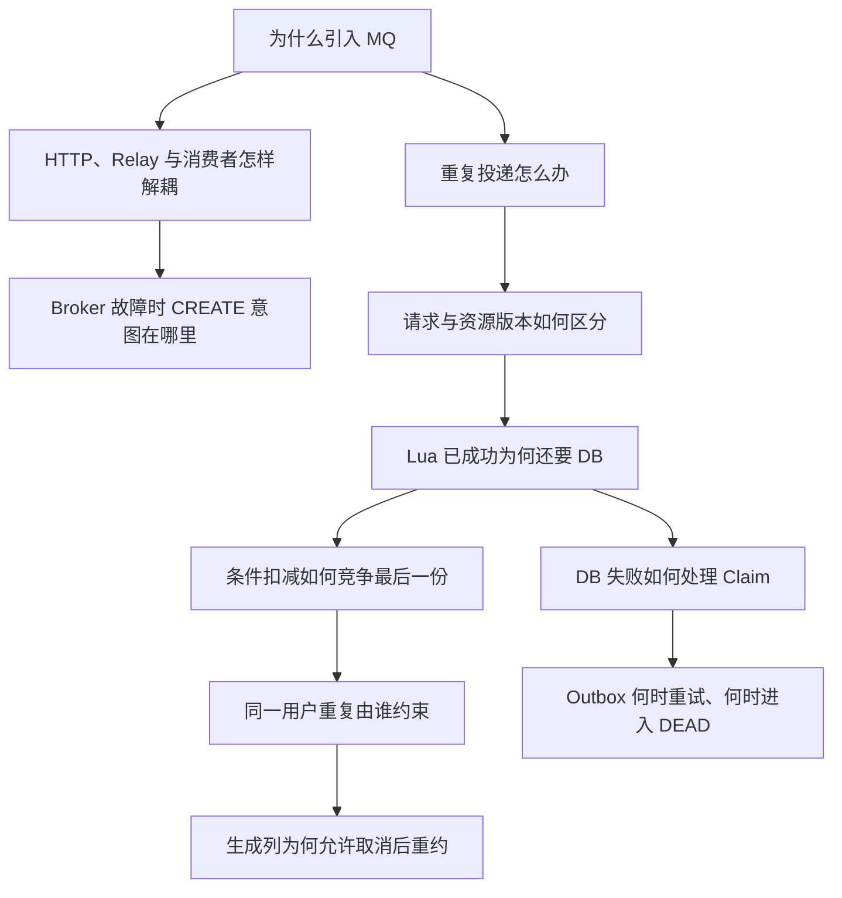

练习时用一句话接住每次追问，再回到源码事实：请求事实 + Outbox、Relay 同步 `send`、业务 requestId、带版本 Claim、Lua 的 `0/1/2`、条件 UPDATE、`uk_active_user_pass`、两种不同的清理脚本。这样回答有连续因果，不会变成罗列中间件。

## 17. 常见错误理解：复习时重点纠正这些话

| 容易讲错的说法 | 当前源码支持的说法 |
| --- | --- |
| “HTTP 线程同步把 CREATE 发到 RocketMQ。” | HTTP 只提交请求事实与 CREATE Outbox；Relay 线程才同步 `send(message)` |
| “返回 success=true，就预约成功了。” | 入口成功表示请求事实和 CREATE 意图已持久化，返回 `PROCESSING`；订单事务提交才成立 |
| “Redis Lua 成功就算预约成功。” | 返回 0 只允许进入数据库创建，DB 仍可能拒绝或回滚 |
| “Redis 和 MySQL 各扣一次只是做备份。” | Redis 做快速占位，DB 维护最终资源和订单约束 |
| “Redis 防重复，数据库 UNIQUE 多余。” | 早期检查可能过时或丢失，最终 INSERT 仍要验证有效订单唯一性 |
| “用了 MQ 就不会压垮数据库。” | 削峰转成积压，消费者并发过高和查询压力仍需管理 |
| “Lua 过滤掉失败请求，所以失败完全不查 DB。” | Lua 前已经做活动、订单、候补查询；售罄也可能写候补 |
| “Lua 每次返回 0 都会扣一次库存。” | 同请求已占位也返回 0，但不再扣减 |
| “所有 DB 失败都回滚 Redis，加回一份库存。” | 普通异常留 Claim 重试，售罄置零清理，唯一冲突等才按归属回滚 |
| “@Transactional 会把 Redis 一起回滚。” | 这里只有数据库事务；Redis 与 MQ 不在同一事务里 |
| “更新 0 行一定是售罄。” | 也可能是库存记录不存在或时间窗不满足，代码会进一步分类 |
| “唯一索引只看未支付、已支付两种状态。” | 实际有效状态是 1、2、3、5 |
| “用了 Transactional Outbox 就是 RocketMQ 事务消息。” | 当前是 MySQL 本地任务表 + Relay；发送和消费仍按至少一次语义处理 |
| “Relay 标记 DONE 就说明业务已经落库。” | DONE 只说明 Broker 返回 SEND_OK；订单结果由消费者和数据库事务决定 |
| “只要有 Outbox 和对账，任何已占位请求都会成功。” | 活动结束后不会强行补单，DEAD 需要运维重放，跨系统不承诺 exactly-once |

## 18. 本文校验范围与阅读后的自测

本次对照了入口、请求事实与 Mapper、事务 Service、可靠任务 Relay、MQ 发布端与监听器、相关库存/占位脚本、完整建表 SQL、v4 迁移、配置和自动验收脚本。为避免夸大恢复能力，也交叉读取了对账任务、死信重放和多实例任务租约实现。

| 校验项 | 本文采用的结果 |
| --- | --- |
| 类名、方法、方向 | `IReservationService` 是接口；监听器位于 `OrderMQConsumer.init()`；Claim 在消费者中 |
| MQ 消息 | 真实 Topic 与 CREATE Tag；Relay 普通同步 send 并检查 SEND_OK，不写成 RocketMQ 事务消息 |
| 请求受理 | `tb_reservation_request` 与 CREATE Outbox 同事务；Redis 状态只是 5 分钟投影 |
| Redis Key、TTL、Lua 返回码 | 与常量和脚本逐项对照；Claim 为 `orderId:resourceVersion`，0 有两种业务来源 |
| DB 扣减 | 时间窗和 stock 条件同条 UPDATE；0 行后再分类 |
| 唯一约束 | 真实生成列、`1/2/3/5` 状态、`uk_active_user_pass` |
| 事务范围 | 建单事务包含库存、订单、请求事实和 TIMEOUT；不包含前置 Lua 与后置 Redis 投影 |
| 异常处理 | 区分一般异常、DuplicateKeyException、SOLD_OUT、Outbox 重试和 DEAD |
| 恢复边界 | 明确至少一次、活动结束、Redis 结构与人工重放边界，不声称 exactly-once |

**验证说明**：除静态源码与文档检查外，仓库的 `reliability-test.ps1` 已在真实 MySQL、Redis、RocketMQ 容器中验证 100 个用户竞争 10 份库存得到 10 笔有效订单和 90 条候补，并验证 Broker 停机时请求事实与 CREATE 任务仍存在、恢复后到达 `RESERVED`。这属于并发正确性与故障恢复验收，不是 QPS 压测；开篇 10000 用户仍只是教学场景。

读完后，合上文档，试着回答这五句：

1. 我拿到 `requestId` 时，系统具体做完了什么？
2. 第一次 Lua 成功、第二次同消息再来，哪一行判断让它不重复扣？
3. Redis 与 MySQL 库存不一致时，哪个写入决定能不能创建订单？
4. 插单失败为什么不会留下本次数据库扣减？Redis 又为什么需要另外处理？
5. 同一用户取消后重新预约，数据库为什么既保留历史又允许新单？

能按发生顺序把这五个问题讲清楚，再补上发送与恢复的真实边界，你就已经能够从源码解释这条简历，而不只是复述技术名词。

## 19.个人注记
1. 什么是Transactional Outbox  思想？

    Transactional Outbox（事务发件箱），可以把它理解成一种解决：“数据库已经改成功了，但消息没发出去怎么办？”的经典最终一致性方案，即不要在数据库事务里直接保证“消息一定发送成功”，而是先把 “我要发送这条消息” 也存进数据库，本质是如何解决 DB 和 MQ 无法原子提交导致的双写一致性问题。

2. 前面为啥要redis投影呢，直接查数据库不就好了？
   
   可以直接查数据库，功能上完全没问题；设置 Redis 投影主要是为了**降低数据库查询压力、提升状态查询速度**。像预约系统里，用户提交请求后往往会频繁轮询“我的预约现在是什么状态”，这些查询通常只需要 `requestId → status`、`requestId → userId` 这种很简单的数据，如果每次都访问 MySQL，会产生大量重复查询，而 Redis 读取更快、吞吐量也更高，所以把这些高频、短期、简单的状态数据投影到 Redis，可以让大部分查询直接在 Redis 完成；同时 MySQL 仍然作为真实数据源，所以 Redis 异常被 catch 掉了之后，不继续往上抛，直接 fallback 到 redis 就行，因此它本质上是一个**用额外缓存复杂度换取更高查询性能和更低数据库压力**的设计。

3. 这一部分的项目链路
 ```text
用户调用预约接口
    ↓
ReservationController.reserve(...)
    ↓
ReservationServiceImpl.reserve(...)
    ↓
生成 requestId
    ↓
transactionalService.acceptRequest(request)
    ↓
┌──────────── MySQL 本地事务 ────────────┐
│                                        │
│ ① requestMapper.insert(...)            │
│    tb_reservation_request              │
│    status = PROCESSING                 │
│                                        │
│ ② reliableTaskRepository.enqueue(...)  │
│    tb_reliable_task                    │
│    type = CREATE_RESERVATION           │
│    status = PENDING                    │
│    payload = 预约请求 JSON              │
│                                        │
└──────────────── COMMIT ────────────────┘
    ↓
projectRequest(...)
    ↓
Redis 临时写一份 PROCESSING 短期投影
    ↓
HTTP 返回
requestId + PROCESSING


========== 此时 reserve() 已经结束 ==========


Spring 定时调度器
    ↓
@Scheduled(...)
    ↓
ReliableTaskScheduler.relay()
    ↓
repository.claimReady(...)
    ↓
从 tb_reliable_task 找到：
CREATE_RESERVATION + PENDING
    ↓
把任务改成 RUNNING
    ↓
execute(task)
    ↓
判断：
taskType == CREATE_RESERVATION
    ↓
JSON → ReservationOrder
    ↓
producer.sendOrderCreate(request)
    ↓
RocketMQProducer
    ↓
RocketMQ Broker
    ↓
OrderMQConsumer
    ↓
reservationService.createOrderFromMQ(order)
    ↓
Redis Lua Claim
    ↓
MySQL 条件扣库存 + 创建订单
```
reserve() 不会直接调用 relay()；两者通过 tb_reliable_task 可靠任务表衔接。HTTP 请求先把 PROCESSING 请求事实和 CREATE_RESERVATION 待办任务一起提交到 MySQL，随后后台 ReliableTaskScheduler.relay() 再扫描并投递任务，最终由 MQ Consumer 完成 Redis 占位和 MySQL 落单。

4. 关于 rollbackClaim 和 clearStaleClaim
   
   `rollbackClaim` 和 `clearStaleClaim` 都是在清理 Redis 占位，但区别在于：`rollbackClaim` 用在“这次 Redis 预扣本身是合理的，只是后面的 MySQL 落库失败”这种场景，所以会把 Redis 库存 `+1`、删除 holder 和 claim，相当于把刚才占的名额退回去；而 `clearStaleClaim` 用在“Redis 认为还有库存，但 MySQL 已经确认真实库存为 0”这种场景，此时 Redis 数据本来就是脏的（Redis 里的库存值已经失真，不能反映真实库存），所以不能再把库存加回去，只会删除 holder 和 claim，并把 Redis 库存直接修正为 `0`。一句话记：**rollbackClaim 是回滚一次合法预扣，clearStaleClaim 是修正 Redis 的错误库存。**

5. redis漂移

    Redis 漂移指的是 **Redis 中的缓存/库存状态与 MySQL 中的真实业务状态不一致**。常见原因是 Redis 和 MySQL 属于两个独立系统，Redis Lua 操作和 MySQL 事务无法放在同一个本地事务里，因此在网络异常、服务宕机、事务失败、补偿未执行、MQ 重试等情况下，可能出现一边已经更新、另一边还没同步的情况。比如 MySQL 库存已经是 `0`，Redis 还显示 `1`，这就是库存漂移。项目中 `rollbackClaim` 用于回滚一次正常但最终失败的 Redis 预扣，而 `clearStaleClaim` 用于发现 Redis 状态已经失真时，将 Redis 库存修正为与 MySQL 一致的真实状态。


