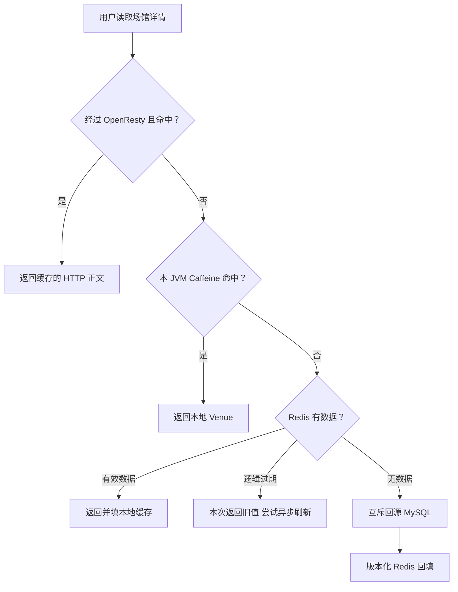
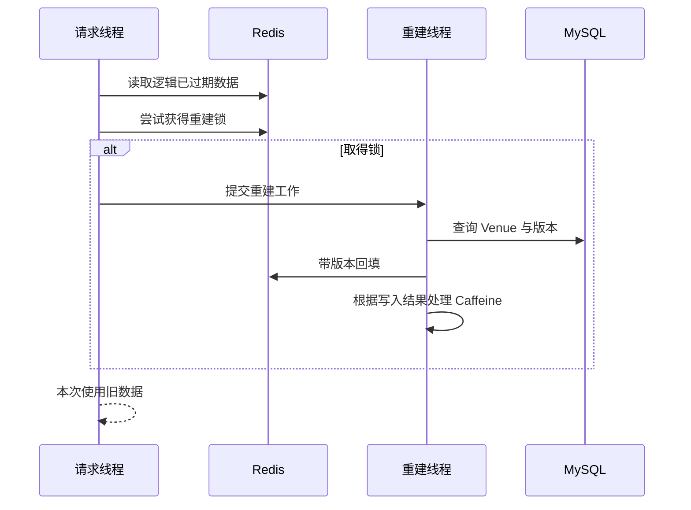
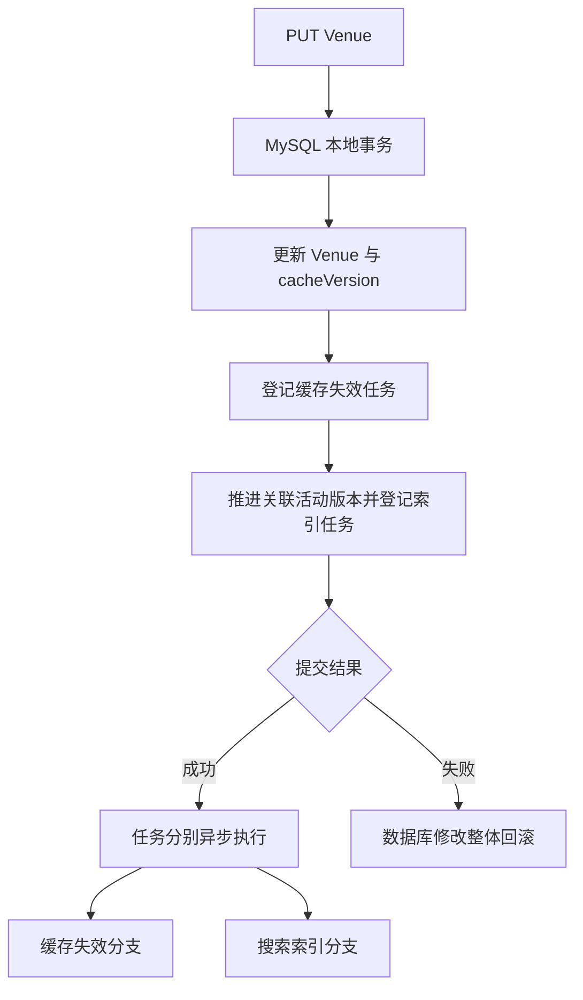
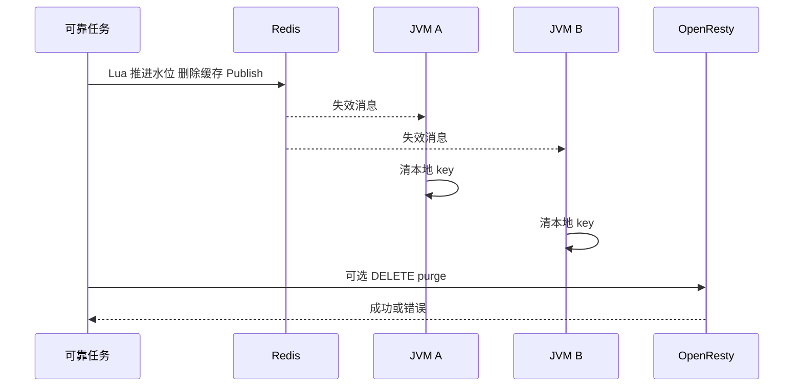
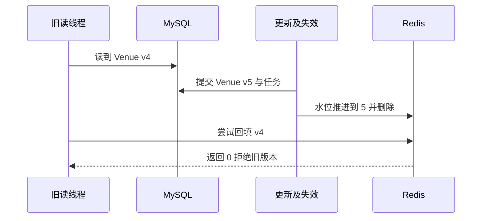
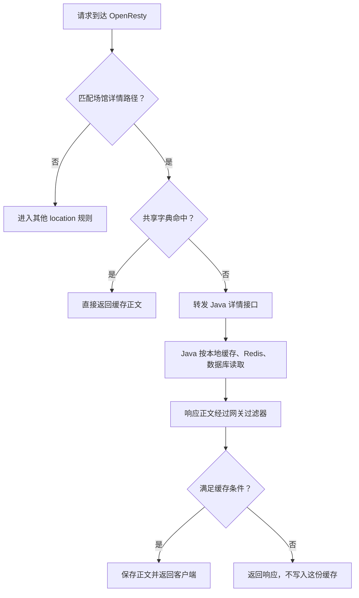
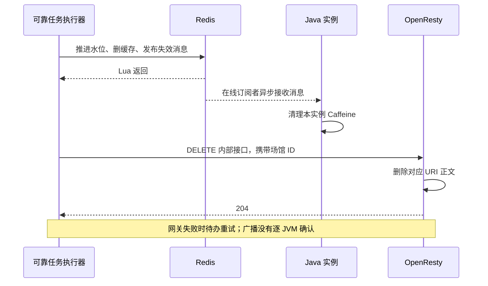

# CityPass 学习文档二：多级缓存一致性

> **对应简历点**：构建 Caffeine、Redis 多级缓存及可选 OpenResty 缓存层，结合逻辑过期与互斥重建控制回源压力；将场馆更新、缓存版本递增与失效任务同事务提交，通过版本水位拒绝旧版本 Redis 回填，并利用 Pub/Sub 清理在线 JVM 本地缓存，完成双实例更新收敛与旧版本拒写验证。
>
> **源码基线**：GitHub main，`7b51ffafcea428e2877db0541709d130828236e7`。本篇以 Venue 详情的读写链路为中心，可独立阅读，不要求先掌握预约状态机。
>
> **验证口径**：本文静态核对当前源码、Lua、OpenResty 配置和测试脚本，未重新运行双 JVM 或 Docker 验收。简历中的“完成验证”需要你实际执行对应脚本并保留结果；本文会区别脚本存在、历史文档记录与本次实测。

**阅读目录**

- [1. 业务问题：场馆改了名字，为什么用户还能看到旧名字](#section-1)
- [2. 基础概念：缓存命中、穿透、击穿、雪崩](#section-2)
- [3. 总体结构与每层缓存的边界](#section-3)
- [4. 数据结构与真实默认值](#section-4)
- [5. 读链路一：Caffeine 命中](#section-5)
- [6. 读链路二：Redis 有数据，分清三种情况](#section-6)
- [7. 读链路三：Redis 冷 miss 与互斥回源](#section-7)
- [8. 写链路：Venue 更新、版本和失效意图同事务](#section-8)
- [9. 失效执行：先推进水位，再删缓存，再广播](#section-9)
- [10. 版本水位怎样阻止旧 Redis 回填](#section-10)
- [11. 必须掌握：Redis 防旧写不等于所有 JVM 都不会旧](#section-11)
- [12. 可选 OpenResty：缓存 HTTP 正文与缓存 Java 对象不同](#section-12)
- [13. Canal、Outbox 和 Pub/Sub 不在同一层](#section-13)
- [14. 缓存失效任务为什么能够恢复，又在哪结束](#section-14)
- [15. 双 JVM 验证与排查顺序](#section-15)
- [16. 面试官追问与详细回答](#section-16)
- [17. 一张表完成复习](#section-17)
- [附录：源码与原学习材料导航](#section-18)

**OpenResty 新增内容导航**

首次接触 OpenResty，可以先读第 12 章的下列小节，再回看前面的 Java 缓存链路：

- [12.1 是什么：Nginx、Lua 与 Java 的关系](#openresty-basics)
- [12.2 部署位置与 8080／8081 的区别](#openresty-position)
- [12.3 已有 Caffeine、Redis，为什么还加网关缓存](#openresty-purpose)
- [12.4 请求命中与未命中的完整流程](#openresty-request)
- [12.5 共享字典与 Redis Lua 的区别](#openresty-memory)
- [12.6 命中返回代码](#openresty-hit-code)
- [12.7 响应回填代码与 TTL](#openresty-fill-code)
- [12.8 请求处理阶段](#openresty-phases)
- [12.9 更新后的网关驱逐链路](#openresty-invalidation)
- [12.10 旧响应重新回填的并发窗口](#openresty-race)
- [12.11 缓存范围与鉴权边界](#openresty-auth)
- [12.12 预约入口的网关限流](#openresty-rate)
- [12.13 本地观察实验与排错](#openresty-practice)
- [12.14 八道专项面试问答](#openresty-interview)

**源码精读导航（本次增强）**

本次保留原有链路讲解、图表与面试问答，并在相应章节补入真实源码。阅读顺序建议是：先看本章业务解释，再读带“教学”注释的代码，最后用失败边界检查自己是否理解。代码以本篇固定提交为准，不是新设计或待实现方案。

- [第 4 章 · Caffeine 配置：容量、过期和统计分别约束什么](#code-2-1)
- [第 6 章 · queryWithMultiLevel：逐行读清三层分支](#code-2-2)
- [第 6 章 · rebuildAsync：旧值响应以后，后台怎样更新](#code-2-3)
- [第 7 章 · queryWithMutexLock：双重检查、空值标记与有限等待](#code-2-4)
- [第 7 章 · tryLock：UUID 是本次锁所有者的凭证](#code-2-5)
- [第 7 章 · unlock.lua：比较和删除必须在一次原子执行中](#code-2-6)
- [第 8 章 · Venue.update：更新与两个派生系统的待办一起落库](#code-2-7)
- [第 9 章 · 失效 Lua：版本水位只能前进，旧任务也能安全删除](#code-2-8)
- [第 9 章 · evict 与 onMessage：执行端和订阅端的职责](#code-2-9)
- [第 9 章 · onMessage：广播携带版本，但本地只按 ID 删除](#code-2-10)
- [第 10 章 · writeWithLogicalExpire：逻辑截止与物理 TTL 一起打包](#code-2-11)
- [第 10 章 · 回填 Lua：拒绝的是小于水位的旧版本](#code-2-12)
- [第 12 章 · purgeGateway：可选网关缓存的失败继续向上抛](#code-2-13)

> **阅读约定**：完整方法保留事务注解；方法内节选会明确说明省略范围，不能单独复制成可运行类。所有新增行内注释均以“教学”标识，原代码中的英文／中文注释保留，但过时的原注释会在解释中指出。数值、订单号与时序例子均为教学推演，不是新增实测结果。

<a id="section-1"></a>

## 1. 业务问题：场馆改了名字，为什么用户还能看到旧名字

假设场馆 2 的名称原来是“城市音乐空间”，运营人员改成“星港音乐空间”。MySQL 更新成功，只证明数据库里的值变了。用户可能先命中网关缓存，或者命中某台 Java 应用的本地缓存，还没有任何机会读到数据库。

缓存的价值是用更多副本减少重复读取；一致性的成本也是这些副本带来的。第一步不是问“用了几层缓存”，而是问：每层保存什么、多久过期、谁负责让它失效、读到旧值是否可接受。

对于场馆介绍，短暂旧名称通常比数据库过载更可接受。对于“最后一份库存属于谁”，不能照搬同样的旧读策略。本篇只治理可回源的 Venue 查询副本，不把预约库存当普通详情缓存。

| 对象 | 权威事实 | 缓存/派生层 | 允许的语义 |
|---|---|---|---|
| 场馆详情 | MySQL Venue 行 | Caffeine、Redis、可选网关 | 暂时旧读，最终收敛 |
| 预约资源 | 订单、库存等业务事实 | Redis stock、claim | 不可用普通删缓存替代归属恢复 |
| 搜索结果 | MySQL 活动及场馆 | ES 活动文档 | 查询投影有独立版本与搜索视图 |

本篇要解决的是：既减少热点详情的回源压力，又保存失效意图、传播失效，并尽量阻止迟到的旧数据库快照重新覆盖缓存。

<a id="section-2"></a>

## 2. 基础概念：缓存命中、穿透、击穿、雪崩

**缓存命中**：这一层已经有可用副本，直接返回。**miss**：没有副本，需要问下一层。**回源**：最终查询权威数据源，本项目主要指 MySQL。

| 问题 | 场景 | 本项目对应手段 | 不应夸大的地方 |
|---|---|---|---|
| 穿透 | 不存在的 ID 被不断查询 | Redis null marker，2 分钟 | 不等于完整恶意请求防护 |
| 击穿 | 某热点 Key 到期，大量请求同时回源 | 互斥锁、逻辑过期异步重建 | 锁到期、等待超时后仍可能并发查 DB |
| 雪崩 | 大量 Key 同时过期 | 正向随机 TTL 增量 | Redis 整体故障没有统一自动 DB 降级 |
| 脏回填 | 旧查询在更新后才写缓存 | cacheVersion 水位与 Lua | Caffeine/负缓存等路径仍有边界 |
| 多副本旧值 | 某 JVM 或网关漏清理 | Pub/Sub、本地 TTL、网关 purge | 非逐实例持久确认协议 |

“逻辑过期”是在数据里保存一个应刷新时间；“物理过期”是 Redis 到期后真的让 Key 不再存在。二者不是重复设置同一个 TTL。

<a id="section-3"></a>

## 3. 总体结构与每层缓存的边界



| 层 | 真实存储内容 | 共享范围 | 命中后绕过 |
|---|---|---|---|
| OpenResty | HTTP 响应正文字符串 | 单个网关实例的共享字典，worker 间共享 | Java、Redis、MySQL |
| Caffeine | `LocalEntry(data,version)` | 一个 JVM | Redis、MySQL |
| Redis | `RedisData(data,version,expireTime,nullValue)` | 使用同一 Redis 的应用实例 | MySQL |
| MySQL | Venue 字段及 cache_version | 数据库事实 | 不适用 |

Java 代码称 Caffeine 为 L1；OpenResty 配置也称自己 L1。面试时用组件名称避免两种 L1 混淆。MySQL 是事实源，不要因为画在第三层就把它叫作“第三份缓存”。

当前主要调用链：`VenueController.queryVenueById` → `VenueServiceImpl.queryById` → `MultiLevelCacheService.queryWithMultiLevel` → Caffeine/Redis/MySQL。

场馆列表、GEO 列表不是这套单 Venue key 治理的自动覆盖范围。搜索接口也不通过本方法获得 ES 查询结果。

源码：[Venue 服务](https://github.com/SyH-101/citypass-platform/blob/7b51ffafcea428e2877db0541709d130828236e7/src/main/java/com/citypass/service/impl/VenueServiceImpl.java#L41)、[缓存服务](https://github.com/SyH-101/citypass-platform/blob/7b51ffafcea428e2877db0541709d130828236e7/src/main/java/com/citypass/utils/MultiLevelCacheService.java#L34)、[网关配置](https://github.com/SyH-101/citypass-platform/blob/7b51ffafcea428e2877db0541709d130828236e7/src/main/resources/openresty/nginx.conf#L1)。

<a id="section-4"></a>

## 4. 数据结构与真实默认值

### 4.1 RedisData 不是裸 Venue JSON

教学表示如下，时间与版本为示例：

```json
{
  "data": {"id": 2, "name": "城市音乐空间", "cacheVersion": 4},
  "version": 4,
  "expireTime": "2098-05-01T10:30:00",
  "nullValue": false
}
```

外层 version 用于判断回填代次，expireTime 表达逻辑新鲜度。两者解决不同问题：一个版本很新的对象也会随着时间到达刷新点；一个尚未逻辑到期的缓存也可能因数据库更新而已经过时。

关键 Key：

| Key | 用途 |
|---|---|
| `cache:venue:{id}` | 主查询 RedisData |
| `cache:venue:version:{id}` | 已知缓存版本水位 |
| `cache:venue:baseline:{id}` | 独立 Redis 基线查询的裸对象格式 |
| `lock:venue:{id}` | 冷 miss 与异步重建共用互斥锁 |
| `cache:venue:invalidate` | Redis Pub/Sub 失效频道 |

基线接口不是另一份版本化查询实现。它使用 `CacheClient.queryWithPassThrough`；与主查询隔离 key，避免两种 JSON 格式互相读坏。失效脚本会同时删主缓存和基线缓存。

### 4.2 TTL 不能全写成“30 分钟”

| 项目 | 当前默认行为 |
|---|---|
| Caffeine | 最多 10000 项，写入后 10 分钟过期，启用 recordStats |
| Redis 逻辑 TTL | 基础 30 分钟，加 `[0,20%)` 正向随机增量 |
| Redis 物理 TTL | `max(逻辑秒数×2, 逻辑秒数+3600)` |
| 负缓存 | 2 分钟物理 TTL |
| Redis 锁 | SET NX，10 秒，UUID 所有者 |
| 冷 miss 等锁 | 最多 20 轮，每轮睡 25～50ms，并检查是否已被别人填好 |
| 重建线程池 | 固定 10 个 daemon 线程；固定线程池默认队列并非有界隔离队列 |
| OpenResty | 约 600±60 秒，缓存正文最大 1MiB |

按 1800 秒基础计算，逻辑时间在 1800～2159 秒，物理时间在 5400～5759 秒。物理时间更长是为了保留可供旧读和刷新使用的数据。

缓存版本水位没有随主数据使用相同 TTL；它保留“已知至少到了哪一代”的记忆。Redis 整体丢失后水位也会丢失，协议边界会改变。

源码：[Caffeine 配置](https://github.com/SyH-101/citypass-platform/blob/7b51ffafcea428e2877db0541709d130828236e7/src/main/java/com/citypass/config/CaffeineConfig.java#L14)、[常量](https://github.com/SyH-101/citypass-platform/blob/7b51ffafcea428e2877db0541709d130828236e7/src/main/java/com/citypass/utils/RedisConstants.java#L3)、[RedisData](https://github.com/SyH-101/citypass-platform/blob/7b51ffafcea428e2877db0541709d130828236e7/src/main/java/com/citypass/utils/RedisData.java#L8)。


<a id="code-2-1"></a>

### 源码精读 1：Caffeine 配置：容量、过期和统计分别约束什么

**源码位置**：[CaffeineConfig.java · venueLocalCache](https://github.com/SyH-101/citypass-platform/blob/7b51ffafcea428e2877db0541709d130828236e7/src/main/java/com/citypass/config/CaffeineConfig.java#L19-L26)。完整方法；仅追加标有“教学”的中文注释，未改动原有语句。节选依赖的变量和外围事务请结合本章上下文阅读。

**这个方法／片段实现什么？** 创建当前 JVM 进程使用的一份场馆缓存，每个服务实例各自持有，进程之间不会自动共享 Java 对象。

```java
@Bean
public Cache<String, Object> venueLocalCache() {
    return Caffeine.newBuilder()
            .maximumSize(10_000) // 教学：限制条目数，不是精确限制内存字节数
            .expireAfterWrite(10, TimeUnit.MINUTES) // 教学：从写入计时，命中不会把这段时间重新延长
            .recordStats() // 教学：开启命中等统计，不等于已经接好完整监控面板
            .build();
}
```

**沿代码往下看**

1. 10,000 条容量限制减少无限增长风险。
2. 写入后 10 分钟过期使本地缓存有自然淘汰路径。
3. recordStats 允许读取缓存统计数据；观察命中率仍要结合采集与压测。

**失败与边界**：该 TTL 不表示数据最多只旧 10 分钟：如果上游数据本身仍旧，重新回填也可能继续旧。是否及时更新还依赖 Redis 失效、消息传播和在途读写。

<a id="section-5"></a>

## 5. 读链路一：Caffeine 命中

`getIfPresent(cacheKey)` 得到 LocalEntry 就直接返回 data。这个路径没有访问 Redis，没有查询最新水位，也没有重新检查 RedisData 的 expireTime。

收益很直接：同一热点场馆在本 JVM 内重复读取，不必每次跨网络访问 Redis。但一个 JVM 清理自己的缓存，不代表另一个 JVM 自动清理。每个实例的局部内存是独立副本。

LocalEntry 虽然保存 version，当前命中时没有使用它比较新旧。**字段存在不等于版本协议已覆盖所有读写路径。** 后文的 Pub/Sub listener 也没有依据消息版本维护本地单调水位，它只是删 key。

<a id="section-6"></a>

## 6. 读链路二：Redis 有数据，分清三种情况

### 6.1 负缓存命中

`nullValue=true` 表示数据库之前没有对应 Venue。方法直接返回 null，业务层返回“场馆不存在”。当前不会把这个 null marker 放入 Caffeine。

它让重复访问不存在 ID 的请求在两分钟内不用每次查 MySQL，但如果这期间新增了该 Venue，需要考虑负缓存失效。代码注释写“没有创建流程”，实际 `POST /venues` 存在，不能按这条旧注释理解系统。

### 6.2 RedisData 逻辑未过期

转换成 Venue，写入本 JVM Caffeine，并返回。这里认为 Redis 缓存已经是可以使用的副本，而不是每次再查 MySQL 证明它最新。

逻辑未过期不等于强一致：若更新事务刚提交而失效任务还没有执行，旧 RedisData 仍可能被读取。这是异步失效窗口。

### 6.3 RedisData 逻辑已过期

当前请求仍返回旧 Venue，同时调用 `rebuildAsync()` 尝试刷新。获取不到锁就不重复安排重建，也不让本次请求一直等待刷新。

拿到锁的线程将任务提交到线程池：回源 MySQL → 尝试版本化写 Redis → 写成功才 put Caffeine，拒写或无数据则清本地项 → finally 按 token 解锁。



图中的并行意味着返回与后台刷新没有强制完成顺序。逻辑过期选择了可用性与延迟优先，同时承担短暂旧读。


<a id="code-2-2"></a>

### 源码精读 2：queryWithMultiLevel：逐行读清三层分支

**源码位置**：[MultiLevelCacheService.java · queryWithMultiLevel](https://github.com/SyH-101/citypass-platform/blob/7b51ffafcea428e2877db0541709d130828236e7/src/main/java/com/citypass/utils/MultiLevelCacheService.java#L63-L90)。完整方法；仅追加标有“教学”的中文注释，未改动原有语句。节选依赖的变量和外围事务请结合本章上下文阅读。

**这个方法／片段实现什么？** 输入缓存前缀、ID、目标类型和数据库查询函数 dbFallback；返回场馆对象或 null。R／ID 是 Java 泛型，允许调用者传入具体实体类型和主键类型。

```java
@SuppressWarnings("unchecked")
public <R, ID> R queryWithMultiLevel(String keyPrefix, ID id, Class<R> type,
                                     Function<ID, R> dbFallback, Long ttl, TimeUnit unit) {
    String cacheKey = keyPrefix + id;
    Object cached = venueLocalCache.getIfPresent(cacheKey);
    if (cached instanceof LocalEntry) { // 教学：本地命中直接返回，不远程核对版本
        log.debug("[多级缓存] L1 Caffeine 命中: {}", cacheKey);
        return (R) ((LocalEntry) cached).getData();
    }

    RedisData redisData = readRedis(cacheKey);
    if (redisData != null) {
        if (Boolean.TRUE.equals(redisData.getNullValue())) return null; // 教学：命中空值标记就是查无数据，不再回源
        R data = convert(redisData, type);
        long version = redisData.getVersion() == null ? 0L : redisData.getVersion();
        if (redisData.getExpireTime() != null && redisData.getExpireTime().isAfter(LocalDateTime.now())) {
            venueLocalCache.put(cacheKey, new LocalEntry(data, version)); // 教学：Redis 逻辑未过期时把对象提升到本地
            log.debug("[多级缓存] L2 Redis 命中: {}", cacheKey);
            return data;
        }
        rebuildAsync(keyPrefix, id, dbFallback, ttl, unit); // 教学：逻辑过期先触发异步重建，当前请求仍返回旧值
        return data;
    }

    R result = queryWithMutexLock(keyPrefix, id, type, dbFallback, ttl, unit); // 教学：Redis 真正不存在时才走同步互斥回源
    if (result != null) venueLocalCache.put(cacheKey, new LocalEntry(result, versionOf(result)));
    return result;
}
```

**沿代码往下看**

1. Caffeine 命中：直接拿 LocalEntry.data，减少网络访问。
2. 本地未命中：读 RedisData，先区分 nullValue，再判断 expireTime。
3. Redis 未逻辑过期则写入 Caffeine；逻辑过期则尝试后台重建，同时用旧值响应。
4. Redis 完全没有 key 才同步走 queryWithMutexLock；返回非空结果后又会写本地。

**失败与边界**：LocalEntry 虽然保存 version，命中分支没有比较水位。末尾冷回源分支也没有根据 Redis 回填是否被拒绝决定能否写本地，正是第 11 章讨论的旧值窗口。


<a id="code-2-3"></a>

### 源码精读 3：rebuildAsync：旧值响应以后，后台怎样更新

**源码位置**：[MultiLevelCacheService.java · rebuildAsync](https://github.com/SyH-101/citypass-platform/blob/7b51ffafcea428e2877db0541709d130828236e7/src/main/java/com/citypass/utils/MultiLevelCacheService.java#L148-L172)。完整方法；仅追加标有“教学”的中文注释，未改动原有语句。节选依赖的变量和外围事务请结合本章上下文阅读。

**这个方法／片段实现什么？** 逻辑过期分支的后台工作：尝试互斥、查库、版本化写 Redis、更新或失效本地缓存。

```java
private <R, ID> void rebuildAsync(String keyPrefix, ID id, Function<ID, R> dbFallback,
                                  Long ttl, TimeUnit unit) {
    String lockKey = LOCK_VENUE_KEY + id;
    String token = tryLock(lockKey);
    if (token == null) return; // 教学：已有重建者时，本请求不再提交重建
    try {
        rebuildExecutor.submit(() -> { // 教学：后台线程执行数据库读取，主请求不用等待
            try {
                R data = dbFallback.apply(id);
                if (data != null && writeWithLogicalExpire(keyPrefix + id, id, data, ttl, unit)) { // 教学：只有非空且 Redis 接受当前版本，才进入本地写入
                    venueLocalCache.put(keyPrefix + id, new LocalEntry(data, versionOf(data)));
                } else {
                    venueLocalCache.invalidate(keyPrefix + id); // 教学：没拿到可写的新值时，驱逐本地条目
                }
            } catch (RuntimeException e) {
                log.error("异步重建场馆缓存失败: {}", id, e);
            } finally {
                unlock(lockKey, token);
            }
        });
    } catch (RuntimeException rejected) { // 教学：任务提交失败时也要释放已获得的锁
        unlock(lockKey, token);
        throw rejected;
    }
}
```

**沿代码往下看**

1. 先拿分布式锁，再提交线程池任务。
2. 后台调用 dbFallback；非空且 Lua 返回接受，才 put 到本地。
3. Redis 拒绝旧版本时走 invalidate，避免该分支直接安装被拒绝的对象。
4. 执行异常记录日志，finally 解锁；提交阶段异常则在外层解锁并抛出。

**失败与边界**：这里的“Lua 接受→本地 put”仍不是跨 Redis/JVM 的原子操作；中间若完成新一轮失效，随后本地 put 可能重新安装旧对象。线程池是固定线程数，但不能据此宣称任务队列有界。

<a id="section-7"></a>

## 7. 读链路三：Redis 冷 miss 与互斥回源

冷 miss 没有旧数据可返回，进入 `queryWithMutexLock()`。

1. SET NX 尝试锁，value 为本次 UUID，TTL 10 秒。
2. 拿到锁后再次检查缓存；别人可能刚刚填好。
3. 仍然没有则查询 MySQL。
4. 数据存在则写带版本的 RedisData；不存在则写 null marker。
5. finally 用 Lua 检查锁 token 后删除。
6. 未拿到锁时有限睡眠、重新检查缓存；20 轮未成功或线程中断则直接查数据库。

**二次检查**避免“等待期间别人已填好，但我拿锁后仍重复查库”。**token 解锁**避免误删别人后来取得的锁。

### 7.1 为什么不能直接 DEL 锁

A 的锁 10 秒过期，B 获得新的锁。A 迟到完成，如果无条件 DEL，就会删掉 B 的锁。Lua 将 GET token 与 DEL 放在一次 Redis 执行内，只有 token 仍属于 A 时才删除。

但这不等于有续期。A 执行超过 TTL 后，B 仍然可能开始另一个重建；A 并不会因为 Redis 锁到期自动停止数据库查询或回填。

### 7.2 “互斥重建”不是绝对单飞

等待超时允许直接查 DB，长重建可能超过锁 TTL，线程中断也会回源。因此锁是在正常条件下减少重复回源，不是保证所有场景只有一个查询。

只有冷 miss 等锁超时路径显式降级查 DB。`readRedis()` 或 Redis 锁操作自身抛异常时，没有统一捕获后直查数据库的流程。不要用“降级”一个词把两者混在一起。

源码：[锁释放 Lua](https://github.com/SyH-101/citypass-platform/blob/7b51ffafcea428e2877db0541709d130828236e7/src/main/resources/unlock.lua#L1)、[多级缓存服务](https://github.com/SyH-101/citypass-platform/blob/7b51ffafcea428e2877db0541709d130828236e7/src/main/java/com/citypass/utils/MultiLevelCacheService.java#L34)。


<a id="code-2-4"></a>

### 源码精读 4：queryWithMutexLock：双重检查、空值标记与有限等待

**源码位置**：[MultiLevelCacheService.java · queryWithMutexLock](https://github.com/SyH-101/citypass-platform/blob/7b51ffafcea428e2877db0541709d130828236e7/src/main/java/com/citypass/utils/MultiLevelCacheService.java#L102-L146)。完整方法；仅追加标有“教学”的中文注释，未改动原有语句。节选依赖的变量和外围事务请结合本章上下文阅读。

**这个方法／片段实现什么？** 把热点冷 miss 的大多数并发请求挡在短期互斥锁外；只有拿锁者优先查询数据库并尝试回填。

```java
private <R, ID> R queryWithMutexLock(String keyPrefix, ID id, Class<R> type,
                                     Function<ID, R> dbFallback, Long ttl, TimeUnit unit) {
    String key = keyPrefix + id;
    String lockKey = LOCK_VENUE_KEY + id;
    for (int attempt = 0; attempt < 20; attempt++) { // 教学：最多等待 20 轮，避免递归和无限等待
        String token = tryLock(lockKey);
        if (token != null) {
            try {
                RedisData doubleChecked = readRedis(key); // 教学：拿锁前后别人可能已重建，所以再读一次
                if (doubleChecked != null) {
                    if (Boolean.TRUE.equals(doubleChecked.getNullValue())) return null;
                    return convert(doubleChecked, type);
                }
                R result = dbFallback.apply(id); // 教学：this::getById 等数据库函数在这里真正执行
                if (result == null) {
                    // No create flow exists for venues; a short null marker is sufficient for penetration control. // 教学：原注释已过时：仓库存在新增场馆入口，见本章边界
                    RedisData nullData = new RedisData();
                    nullData.setNullValue(true);
                    nullData.setVersion(currentVersion(id));
                    nullData.setExpireTime(LocalDateTime.now().plusMinutes(CACHE_NULL_TTL));
                    stringRedisTemplate.opsForValue().set(
                            key, JSONUtil.toJsonStr(nullData), CACHE_NULL_TTL, TimeUnit.MINUTES);
                    return null;
                }
                writeWithLogicalExpire(key, id, result, ttl, unit); // 教学：这里没有接住 boolean 返回值，拒写后仍返回 DB 对象
                return result;
            } finally {
                unlock(lockKey, token);
            }
        }
        try {
            Thread.sleep(25L + RANDOM.nextInt(26)); // 教学：带随机抖动的短等待，不是固定睡很久
        } catch (InterruptedException e) {
            Thread.currentThread().interrupt();
            return dbFallback.apply(id);
        }
        RedisData refreshed = readRedis(key);
        if (refreshed != null) {
            if (Boolean.TRUE.equals(refreshed.getNullValue())) return null;
            return convert(refreshed, type);
        }
    }
    log.warn("缓存互斥锁等待超时，降级查询数据库: {}", key);
    return dbFallback.apply(id);
}
```

**沿代码往下看**

1. tryLock 返回随机 token 代表本次获取成功，null 代表没拿到。
2. 成功后双重检查 Redis，已有数据就直接使用，避免重复查库。
3. 查库为空时写短期 null marker；不为空时提交版本化回填。注意普通 null marker 的写入没有走版本比较 Lua。
4. finally 用 token 解锁；未获锁者短暂等待后查看他人是否已回填。20 轮耗尽直接查库，线程中断则恢复中断标志后查库。

**失败与边界**：这不是严格“一次只会有一个数据库查询”：锁超时、排队耗尽与降级均可能并发回源。源代码关于没有场馆新增流程的注释不符合真实入口；不能把这句原注释当作设计保证。


<a id="code-2-5"></a>

### 源码精读 5：tryLock：UUID 是本次锁所有者的凭证

**源码位置**：[MultiLevelCacheService.java · tryLock](https://github.com/SyH-101/citypass-platform/blob/7b51ffafcea428e2877db0541709d130828236e7/src/main/java/com/citypass/utils/MultiLevelCacheService.java#L219-L223)。完整方法；仅追加标有“教学”的中文注释，未改动原有语句。节选依赖的变量和外围事务请结合本章上下文阅读。

**这个方法／片段实现什么？** 返回 token 表示取得 10 秒锁，返回 null 表示未取得；token 的作用不是加密，而是防止删除别人的后来锁。

```java
private String tryLock(String key) {
    String token = UUID.randomUUID().toString(); // 教学：为每次获取生成不同 token
    Boolean ok = stringRedisTemplate.opsForValue().setIfAbsent(key, token, 10, TimeUnit.SECONDS); // 教学：相当于原子的 SET key token NX EX 10
    return Boolean.TRUE.equals(ok) ? token : null; // 教学：只有明确获取成功才返回凭证
}
```

**沿代码往下看**

1. A 拿到 token-A，持有锁开始查库。
2. A 很慢，10 秒后锁自动失效，B 拿到 token-B。
3. A 最后解锁必须证明 Redis 中仍是 token-A，否则就不能删除 B 的锁。

**失败与边界**：token 比较只防误删，不延长锁、不取消 A，也不阻止 A 的业务结果迟到。版本水位负责另一类问题：是否接受旧数据。


<a id="code-2-6"></a>

### 源码精读 6：unlock.lua：比较和删除必须在一次原子执行中

**源码位置**：[unlock.lua · 脚本](https://github.com/SyH-101/citypass-platform/blob/7b51ffafcea428e2877db0541709d130828236e7/src/main/resources/unlock.lua#L1-L6)。完整脚本；仅追加标有“教学”的中文注释，未改动原有语句。节选依赖的变量和外围事务请结合本章上下文阅读。

**这个方法／片段实现什么？** 输入一个锁 key 和调用者 token，匹配时删除并返回删除数量，不匹配返回 0。

```lua
-- 比较线程标示与锁中的标示是否一致
if(redis.call('get', KEYS[1]) ==  ARGV[1]) then -- 教学：检查当前锁 token 是否仍属于本次调用
    -- 释放锁 del key
    return redis.call('del', KEYS[1]) -- 教学：相等才删除，比较与删除之间不能插入其他请求
end
return 0
```

**沿代码往下看**

1. 若 A 的锁仍有效，GET 等于 token-A，DEL 成功。
2. 若 A 的锁已被 B 接管，GET 是 token-B，脚本返回 0。
3. 不应把 GET 和 DEL 拆成两个独立 Redis 请求，否则两步之间锁可能换主人。

**失败与边界**：解锁正确不等于回填数据一定正确。拿着过期锁的旧线程仍能跑到回填逻辑，所以需要版本检查。

<a id="section-8"></a>

## 8. 写链路：Venue 更新、版本和失效意图同事务

当前 `PUT /venues` 的完整数据库事务已受到新增搜索模块影响，顺序是：

1. `assertWritesAllowed()` 锁搜索重建状态行，检查维护窗口；
2. 更新 Venue 业务字段；
3. SQL 执行 `cache_version=cache_version+1`；
4. 重读 Venue 获取本次版本，登记 INVALIDATE_VENUE_CACHE；
5. 为关联活动递增 search_version；
6. 逐活动登记 INDEX_ACTIVITY_SEARCH；
7. 提交。

缓存版本、搜索版本分别服务不同副本。任一步必要数据库写失败，整笔事务回滚，不是 Venue 已改但索引任务失败可以随便忽略。



本篇继续跟随 I。搜索分支的完整展开在独立搜索篇，不把它重新解释成缓存删除。

### 8.1 为什么不先删缓存再更新数据库

如果缓存先删，读线程 miss 后查询到尚未提交的新事务之前的旧数据库值，再写回缓存，就可能把旧值留住。甚至更新事务最终回滚，也无法自动撤销之前发出的外部删除。

### 8.2 为什么不是 afterCommit 就够了

afterCommit 回调可以避免事务提交前执行，但应用可能在 COMMIT 成功后、回调执行前退出。内存里知道要做什么不能供其他进程恢复。

持久任务把失效意图与 Venue 修改一起记在 MySQL。它不消除提交到失效执行的时间差，但把不可恢复的漏执行窗口变成有记录可重试的窗口。

### 8.3 不能说“所有场馆写路径都覆盖了”

当前 PUT 已覆盖上述事务；`POST /venues` 仍直接 save，没有同样的失效登记。场馆列表、GEO 索引也没有因为单详情缓存治理而自动同步。搜索维护锁和关联活动扇出还会增加 PUT 的锁范围与写放大。

源码：[VenueServiceImpl.update](https://github.com/SyH-101/citypass-platform/blob/7b51ffafcea428e2877db0541709d130828236e7/src/main/java/com/citypass/service/impl/VenueServiceImpl.java#L41)、[VenueController](https://github.com/SyH-101/citypass-platform/blob/7b51ffafcea428e2877db0541709d130828236e7/src/main/java/com/citypass/controller/VenueController.java#L22)。


<a id="code-2-7"></a>

### 源码精读 7：Venue.update：更新与两个派生系统的待办一起落库

**源码位置**：[VenueServiceImpl.java · update](https://github.com/SyH-101/citypass-platform/blob/7b51ffafcea428e2877db0541709d130828236e7/src/main/java/com/citypass/service/impl/VenueServiceImpl.java#L85-L109)。完整方法；仅追加标有“教学”的中文注释，未改动原有语句。节选依赖的变量和外围事务请结合本章上下文阅读。

**这个方法／片段实现什么？** 写链路以场馆为数据库事实源；修改成功后不是立刻保证所有缓存已更新，而是保证可恢复的失效意图已经持久化。

```java
@Override
@Transactional // 教学：事务覆盖场馆、版本和本地可靠任务
public Result update(Venue venue) {
    Long id = venue.getId();
    if (id == null) {
        return Result.fail("场馆id不能为空");
    }
    searchRebuildStateRepository.assertWritesAllowed(); // 教学：搜索重建时对相关写入设置维护门禁
    // 1.更新数据库
    boolean updated = updateById(venue);
    if (!updated) {
        return Result.fail("场馆不存在或更新失败");
    }
    if (getBaseMapper().incrementCacheVersion(id) != 1) { // 教学：数据库内自增，避免 Java 读旧版本再相加
        throw new IllegalStateException("场馆缓存版本更新失败");
    }
    Venue refreshed = getById(id);
    reliableTaskRepository.enqueue(
            ReliableTaskRepository.INVALIDATE_VENUE_CACHE, // 教学：记录这次提交对应的缓存失效意图
            "invalidate-venue-cache:" + id + ":" + refreshed.getCacheVersion(),
            JSONUtil.toJsonStr(new VenueCacheInvalidation(id, refreshed.getCacheVersion())));
    // Venue name/address/area/coordinates are denormalized into all related activity documents.
    activitySearchOutboxService.bumpVenueDocumentsAndEnqueue(id); // 教学：场馆字段也影响活动搜索文档，登记索引联动任务
    return Result.ok();
}
```

**沿代码往下看**

1. 校验 ID 并通过重建门禁，再更新场馆。
2. SQL 将 cacheVersion 加一，重新读取已更新版本。
3. 以 venueId:version 为业务键，写入 INVALIDATE_VENUE_CACHE payload。
4. 同事务给关联活动推进 searchVersion 并登记 INDEX 任务。两类版本用途不同，但同一次业务写要同步记录各自意图。

**失败与边界**：普通数据库事务不包含随后 Redis、Pub/Sub、OpenResty 或 ES 的执行。源码的场馆新增入口没有完全复用这条失效流程，因此不能说所有写入口都已覆盖。

<a id="section-9"></a>

## 9. 失效执行：先推进水位，再删缓存，再广播

任务载荷是 `venueId + cacheVersion`，幂等业务键包含场馆 ID 和版本。Scheduler 领取任务后调用 `VenueCacheInvalidator.evict()`。

Redis 失效脚本在一次执行中：

1. 读当前水位；
2. 取 `max(当前水位, 请求提交版本)`；
3. 保存水位；
4. 删除主缓存；
5. 删除基线缓存；
6. Publish `venueId:version`。

发布端随后主动清自己的 Caffeine，再尝试配置的 OpenResty purge。网关失败会抛异常，使整个任务重试，不是仅记一条日志后标 DONE。



重复执行 v5 的失效不会把已到 v6 的水位降回去，但可能再次删除现有缓存、再次广播，造成额外 miss。幂等不等于完全没有成本。

源码：[Invalidator](https://github.com/SyH-101/citypass-platform/blob/7b51ffafcea428e2877db0541709d130828236e7/src/main/java/com/citypass/utils/VenueCacheInvalidator.java#L26)、[失效 Lua](https://github.com/SyH-101/citypass-platform/blob/7b51ffafcea428e2877db0541709d130828236e7/src/main/resources/invalidate-venue-cache.lua#L1)、[Pub/Sub 配置](https://github.com/SyH-101/citypass-platform/blob/7b51ffafcea428e2877db0541709d130828236e7/src/main/java/com/citypass/config/RedisPubSubConfig.java#L13)。


<a id="code-2-8"></a>

### 源码精读 8：失效 Lua：版本水位只能前进，旧任务也能安全删除

**源码位置**：[invalidate-venue-cache.lua · 脚本](https://github.com/SyH-101/citypass-platform/blob/7b51ffafcea428e2877db0541709d130828236e7/src/main/resources/invalidate-venue-cache.lua#L1-L16)。完整脚本；仅追加标有“教学”的中文注释，未改动原有语句。节选依赖的变量和外围事务请结合本章上下文阅读。

**这个方法／片段实现什么？** 把 Redis 版本水位、主缓存删除、压测基线缓存删除和失效广播串在一个 Lua 脚本中执行。

```lua
-- KEYS[1] main cache, KEYS[2] baseline cache, KEYS[3] version key
-- ARGV[1] pub/sub channel, ARGV[2] venueId, ARGV[3] committed database version
local current = tonumber(redis.call('get', KEYS[3]) or '0') -- 教学：Redis 当前已知的最低可接受版本
local requested = tonumber(ARGV[3])
if requested < 0 then -- 教学：没有提交版本的兼容调用，改为从 Redis 水位加一
    requested = current + 1
end
local version = requested
if current > requested then -- 教学：乱序到达的旧失效任务不能让水位倒退
    version = current
end
redis.call('set', KEYS[3], version) -- 教学：先推进版本水位
redis.call('del', KEYS[1])
redis.call('del', KEYS[2])
redis.call('publish', ARGV[1], ARGV[2] .. ':' .. version) -- 教学：通知在线订阅者清理本地缓存
return version
```

**沿代码往下看**

1. 正常任务携带数据库已提交版本；取 max(current, requested)。
2. 先保存新水位，再删除缓存，避免后来的旧回填只看到空 key 就被接受。
3. 广播 venueId:version，让在线 JVM 按 ID 驱逐 Caffeine。
4. 例如 v6 任务先于 v5 执行，水位仍保持 6；v5 的重复删除可能增加回源，但不会降低版本。

**失败与边界**：PUBLISH 没有持久化订阅确认；Lua 执行成功不能证明每个 JVM 已经消费广播。负版本兼容模式还可能使 Redis 水位领先未同步加版本的数据库行。


<a id="code-2-9"></a>

### 源码精读 9：evict 与 onMessage：执行端和订阅端的职责

**源码位置**：[VenueCacheInvalidator.java · evict](https://github.com/SyH-101/citypass-platform/blob/7b51ffafcea428e2877db0541709d130828236e7/src/main/java/com/citypass/utils/VenueCacheInvalidator.java#L52-L64)。方法内连续节选；仅追加标有“教学”的中文注释，未改动原有语句。节选依赖的变量和外围事务请结合本章上下文阅读。

**这个方法／片段实现什么？** 这里摘录带版本 evict 的方法体；无版本重载只是兼容入口。可靠任务执行到此后，才可能继续回写 DONE。

```java
public void evict(Object venueId, Long committedVersion) {
    Long version = redisTemplate.execute( // 教学：先在 Redis 原子推进水位并失效
            INVALIDATE_SCRIPT,
            Arrays.asList(CACHE_VENUE_KEY + venueId,
                    CACHE_VENUE_BASELINE_KEY + venueId,
                    CACHE_VENUE_VERSION_KEY + venueId),
            CACHE_VENUE_INVALIDATION_CHANNEL,
            String.valueOf(venueId),
            String.valueOf(committedVersion == null ? -1L : committedVersion));
    if (version == null) throw new IllegalStateException("场馆缓存失效脚本返回空"); // 教学：异常结果不能被当成任务完成
    // 发布端也立即清理，避免依赖自身能否收到 pub/sub 回环消息。
    multiLevelCacheService.evictLocal(CACHE_VENUE_KEY, venueId); // 教学：发布实例立即自行驱逐，不依赖广播回环
    purgeGateway(venueId); // 教学：配置了网关缓存才继续做 HTTP 驱逐
```

**沿代码往下看**

1. 把主 key、基线 key、水位 key 以及频道、ID、版本传给 Lua。
2. 脚本返回空就抛错，让任务框架安排重试。
3. 清理发布 JVM 自己的缓存，再调用可选 OpenResty purge。

**失败与边界**：Lua 已成功但 purge 失败时会抛异常，整条失效任务重试；重试可能再次广播。Redis 已执行的操作不因 Java 异常而回滚。


<a id="code-2-10"></a>

### 源码精读 10：onMessage：广播携带版本，但本地只按 ID 删除

**源码位置**：[VenueCacheInvalidator.java · onMessage](https://github.com/SyH-101/citypass-platform/blob/7b51ffafcea428e2877db0541709d130828236e7/src/main/java/com/citypass/utils/VenueCacheInvalidator.java#L67-L74)。完整方法；仅追加标有“教学”的中文注释，未改动原有语句。节选依赖的变量和外围事务请结合本章上下文阅读。

**这个方法／片段实现什么？** 每个在线订阅实例收到广播后清理自身 Caffeine。它不是在所有实例上重新执行完整的失效任务。

```java
@Override
public void onMessage(Message message, byte[] pattern) {
    String event = new String(message.getBody(), StandardCharsets.UTF_8);
    int separator = event.lastIndexOf(':'); // 教学：从 venueId:version 拆出 ID
    String venueId = separator < 0 ? event : event.substring(0, separator);
    multiLevelCacheService.evictLocal(CACHE_VENUE_KEY, venueId); // 教学：执行 invalidate，不查询数据库、不对比本地版本
    log.debug("收到场馆缓存失效广播: {}", event);
}
```

**沿代码往下看**

1. UTF-8 解码消息。
2. 按最后一个冒号提取场馆 ID，兼容只有 ID 的消息。
3. 删除该实例的本地条目，使下次读取走 Redis／数据库。

**失败与边界**：版本出现在消息中，但此方法没有维护本地版本墓碑，也没有阻止已经在途的旧读取稍后 put。断线实例漏收广播依靠后续读取与过期等机制收敛。

<a id="section-10"></a>

## 10. 版本水位怎样阻止旧 Redis 回填

设数据库查询 Q 读到 v4，然后运营提交 v5，失效任务已将 Redis 水位推进为 5。Q 此时才回填：如果无版本判断，就会重新放入旧名称；有水位以后，v4<5，Lua 返回 0，不写主缓存。



回填脚本比较 `expected < current`，低版本拒绝；相同版本和更高版本允许，接受时同时设置水位和带物理 TTL 的缓存值。

**水位来自事实变化，不是随便用当前时间戳。** 同一个 Venue 的数据库版本递增与修改在同一事务，正常路径使旧内容与较小版本对应。若绕过协议直接改数据却不推进版本，版本相等也可能携带不同内容，协议无法凭空识别。

### 10.1 锁与版本为什么都需要

锁减少同时重建的数量；版本解决重建结果的先后代次。即使只有一个旧重建线程，它也可能与业务更新交错，因此锁不能代替版本判断。反过来，版本拒绝旧值也不能减少大量相同版本数据库查询，所以版本不能代替互斥。

源码：[版本回填 Lua](https://github.com/SyH-101/citypass-platform/blob/7b51ffafcea428e2877db0541709d130828236e7/src/main/resources/write-cache-if-version.lua#L1)。


<a id="code-2-11"></a>

### 源码精读 11：writeWithLogicalExpire：逻辑截止与物理 TTL 一起打包

**源码位置**：[MultiLevelCacheService.java · writeWithLogicalExpire](https://github.com/SyH-101/citypass-platform/blob/7b51ffafcea428e2877db0541709d130828236e7/src/main/java/com/citypass/utils/MultiLevelCacheService.java#L175-L191)。完整方法；仅追加标有“教学”的中文注释，未改动原有语句。节选依赖的变量和外围事务请结合本章上下文阅读。

**这个方法／片段实现什么？** 把数据、版本、逻辑过期时间序列化为 RedisData，并带物理 TTL 调用写入脚本。

```java
private boolean writeWithLogicalExpire(String key, Object id, Object value, Long ttl, TimeUnit unit) {
    long baseSec = Math.max(1L, unit.toSeconds(ttl));
    long jitter = (long) (baseSec * 0.2 * RANDOM.nextDouble()); // 教学：随机增加最多约 20%，避免同时过期
    long logicalTtlSeconds = baseSec + jitter;
    long physicalTtlSeconds = Math.max(logicalTtlSeconds * 2, logicalTtlSeconds + 3600); // 教学：保留旧值的物理生命周期要长于逻辑有效期

    RedisData redisData = new RedisData();
    redisData.setData(value);
    redisData.setVersion(versionOf(value)); // 教学：Venue 对象的 cacheVersion 随数据一起传递
    redisData.setExpireTime(LocalDateTime.now().plusSeconds(logicalTtlSeconds));
    Long written = stringRedisTemplate.execute(
            WRITE_IF_VERSION_SCRIPT, // 教学：版本比较和写入由同一个 Lua 执行
            Arrays.asList(key, CACHE_VENUE_VERSION_KEY + id),
            String.valueOf(redisData.getVersion()), JSONUtil.toJsonStr(redisData),
            String.valueOf(physicalTtlSeconds));
    return Long.valueOf(1L).equals(written); // 教学：明确向调用者报告是否被接受
}
```

**沿代码往下看**

1. 先统一 TTL 为秒，再增加随机抖动。
2. expireTime 决定读者是否触发重建；EX 决定 Redis 何时真正删除 key。
3. 传入数据 key 与独立的版本水位 key，让缓存被删后仍能拒绝旧回填。
4. 返回 boolean；异步分支检查它，冷回源分支当前未检查。

**失败与边界**：两个时间都使用真实公式，不能把配置 30 分钟等同于所有 key 固定存活 30 分钟。版本水位只保存序号，不代替数据本身。


<a id="code-2-12"></a>

### 源码精读 12：回填 Lua：拒绝的是小于水位的旧版本

**源码位置**：[write-cache-if-version.lua · 脚本](https://github.com/SyH-101/citypass-platform/blob/7b51ffafcea428e2877db0541709d130828236e7/src/main/resources/write-cache-if-version.lua#L1-L9)。完整脚本；仅追加标有“教学”的中文注释，未改动原有语句。节选依赖的变量和外围事务请结合本章上下文阅读。

**这个方法／片段实现什么？** 判断当前读出的数据库对象是否还能进入 Redis。没有 Lua 时，Java 先读水位再 SET 中间会被更新插入。

```lua
-- KEYS[1] cache data, KEYS[2] version key; ARGV[1] expectedVersion, ARGV[2] json, ARGV[3] ttlSeconds
local current = tonumber(redis.call('get', KEYS[2]) or '0')
local expected = tonumber(ARGV[1])
if expected < current then -- 教学：只有严格更旧才拒绝，相等版本可重放
    return 0 -- 教学：回填未发生，调用方需要理解该结果
end
redis.call('set', KEYS[2], expected) -- 教学：接受更新时同步推进水位
redis.call('set', KEYS[1], ARGV[2], 'EX', ARGV[3]) -- 教学：真正写入 JSON，并设置物理 TTL
return 1
```

**沿代码往下看**

1. 旧线程读到了 v4，更新任务把水位推进为 v5。
2. 旧线程回填 expected=4，脚本看到 4<5，返回 0 且不写任何数据。
3. 新线程回填 v5 或 v6 可被接受。相等可重放依赖同版本内容一致。

**失败与边界**：脚本不会自动重新查库，更不会同步撤销 JVM 已持有的旧对象。可靠失效降低旧数据重新进入 Redis 的风险，但不构成整个读取链的线性一致性。

<a id="section-11"></a>

## 11. 必须掌握：Redis 防旧写不等于所有 JVM 都不会旧

这是本篇最容易被问深的部分。

### 11.1 冷 miss 忽略拒写结果

`queryWithMutexLock()` 调用 `writeWithLogicalExpire()`，但不把 false 传回外层，而是返回读到的 Venue。外层只要 result 不为 null 就写入 Caffeine。因此 Redis 拒绝 v4，不代表本 JVM 没有把 v4 缓存十分钟。

### 11.2 异步分支也有“判断后本地写”的交错

异步分支确实只有 Redis 写成功才 put 本地，拒写时会 invalidate。这个条件比冷 miss 更严，但仍不是将 Redis 和 Caffeine 原子提交：

| 时刻 | 重建线程 | 更新/订阅线程 |
|---|---|---|
| T1 | v4 成功写 Redis | 尚未失效 |
| T2 | 暂停在本地 put 前 | v5 失效推进水位，清 JVM 本地 |
| T3 | 将 v4 put 回本地 | 本轮失效已处理完 |

此外，普通 Redis 命中后到 Caffeine put 之间也可能发生类似交错。当前没有使用 LocalEntry.version 进行本地单调写入校验。因此不能把“异步分支拒绝失败回填”写成“异步分支任何时序都不存在旧本地值”。

### 11.3 Pub/Sub 漏消息

进程重启后 Caffeine 为空是一种情况；进程仍在运行但订阅连接短暂断开，则可能保留旧本地值又漏掉消息。Redis Pub/Sub 不保存逐实例待确认工作，TTL 是兜底之一，不是即时一致保证。

### 11.4 null marker 与新增路径

空结果使用普通 Redis SET，不走版本化 Lua；POST 新增又未统一接失效。若旧空查询跨越创建事务，短期负缓存可能屏蔽新记录。不能因为 nullData 带 version 就认为写入已被版本条件约束。

### 11.5 准确的简历口径

可以说：“通过版本水位拒绝旧版本 Redis 回填，结合广播和 TTL 推进本地副本收敛。”

不要说：“所有层强一致”“彻底杜绝任何旧值”“数据库更新后任何请求必定立即读新”。这些边界是源码事实，本篇说明它们，不擅自修改项目。

<a id="section-12"></a>

## 12. 可选 OpenResty：缓存 HTTP 正文与缓存 Java 对象不同

> **新增入门讲解**：本节从零解释 OpenResty，再回到 CityPass 的真实配置。原有第 12 章概览、源码精读，以及其他章节均保留。源码仍使用本篇标注的 `7b51ffaf`，本次只补学习内容，没有修改项目代码，也没有执行网关容器验收。

<a id="openresty-basics"></a>

### 12.1 OpenResty 是什么？先把 Nginx、Lua 和 Java 的关系讲清楚

**OpenResty 是一个以 Nginx 为基础、集成 LuaJIT 和相关模块的 Web 平台，可以用 Lua 在 HTTP 请求处理过程中加入逻辑。** 比如，收到请求时先查缓存、做流量限制，必要时再转发给 Java 后端。[OpenResty 官方介绍](https://openresty.org/en/)

先用 CityPass 中的一次请求理解：浏览器想访问某个场馆，真正处理业务的仍然可以是 Spring Boot。但是我们可以在 Spring Boot 前面放一个 OpenResty 服务，让请求先经过它，由它决定“这次是否需要继续找 Java”。

| 名称 | 通俗理解 | 在这里负责什么 |
|---|---|---|
| Nginx | 对外接收 HTTP 请求、再向后端转交请求的服务器 | 监听端口、匹配 URL、反向代理 |
| Lua | 写处理规则的一门脚本语言 | 写缓存查询、响应收集、删除缓存等逻辑 |
| LuaJIT | 执行 Lua 的运行环境，包含即时编译能力 | 为 OpenResty 的 Lua 逻辑提供执行能力 |
| OpenResty | 把 Nginx 与 Lua 等能力集成起来的平台 | 让上述规则在网关请求处理阶段执行 |
| Spring Boot | 运行 CityPass Java 代码的应用服务 | Controller、Service、事务和业务规则 |

**它不是放进 Spring Boot 的一个缓存依赖。** 当前仓库把它配置成单独的容器；Java 容器和 OpenResty 容器通过 HTTP 通信。也不需要把 Java 方法改写成 Lua 才能使用它，先配置反向代理就能转发请求。

“反向代理”在本项目中的具体意思是：客户端请求 OpenResty，OpenResty 代客户端去访问 `app:8081`，然后把后端响应返回给客户端。转发由 `proxy_pass` 配置指定。[Nginx 官方 proxy_pass 说明](https://nginx.org/en/docs/http/ngx_http_proxy_module.html#proxy_pass)

> 先记住这一句：**OpenResty 位于 Java 服务之前，能让一部分请求提前得到响应，从而减少进入 Java 的请求量。** 是否能够提前返回，由具体配置决定，不是安装后自动发生。

<a id="openresty-position"></a>

### 12.2 它在 CityPass 中部署在哪里？8080 和 8081 有什么不同？

本项目 [docker-compose.yml](https://github.com/SyH-101/citypass-platform/blob/7b51ffafcea428e2877db0541709d130828236e7/docker-compose.yml) 的相关真实片段如下，仅追加中文教学注释：

```yaml
  openresty:
    image: openresty/openresty:1.25.3.2-alpine # 教学：本仓库固定的镜像版本，不表示官方最新版
    ports:
      - "8080:80" # 教学：宿主机 8080 转到 OpenResty 容器的 80 端口
    volumes:
      - ./src/main/resources/openresty/nginx.conf:/usr/local/openresty/nginx/conf/nginx.conf:ro
      - ./src/main/resources/openresty/lua:/usr/local/openresty/nginx/lua:ro
    depends_on:
      - app # 教学：声明启动依赖；不等于已做应用业务健康确认
```

两个 `volumes` 分别把仓库的 Nginx 配置和 Lua 脚本目录挂进容器。`:ro` 表示容器只读访问挂载内容。

对应 [nginx.conf](https://github.com/SyH-101/citypass-platform/blob/7b51ffafcea428e2877db0541709d130828236e7/src/main/resources/openresty/nginx.conf) 的真实配置节选：

```nginx
upstream java_backend {
    server app:8081 weight=1; # 教学：app 是 Compose 网络中的 Java 服务名
    # server 127.0.0.1:8082 weight=1;
}
```

`upstream` 给后端地址起了一个名字 `java_backend`。后面的 `proxy_pass http://java_backend` 就是把未直接处理的请求交给它。注释中的第二台服务没有启用，不能据此说默认已经部署双 Java 实例。

| 访问方式 | 实际入口 | 是否经过这里的 OpenResty |
|---|---|---|
| `http://localhost:8080/venues/2` | 宿主机 8080 → OpenResty 80 → 必要时 app:8081 | 是 |
| `http://localhost:8081/venues/2` | 宿主机 8081 → Java 应用 | 否 |
| Java 调用 `http://openresty/internal/cache/venue?id=2` | Compose 内网中的 OpenResty 80 | 是，用于清缓存 |

这里的 `localhost` 假设你在部署该 Compose 的同一台机器上访问。容器中的 `localhost` 指容器自己，所以网关到 Java 使用 `app:8081`，Java 到网关使用服务名 `openresty`。

**“可选 OpenResty”指应用设计上可以不经过网关，并不代表默认 Compose 中它被放在可选 profile 里。** 当前 Compose 普通服务列表包含它，而且为 Java 设置了网关 purge URL。若自行采用纯 Java 部署，应使该 URL 与真实部署匹配；只停掉网关却保留不可达的 purge URL，会使缓存失效任务在驱逐网关这一步报错重试。

<a id="openresty-purpose"></a>

### 12.3 已经有 Caffeine 和 Redis，为什么还需要这一层？

Caffeine 再快，请求通常也得先到 Java 应用，经过网络接收、相关拦截器、Controller／Service 调用，然后才能命中本地缓存。OpenResty 缓存命中时可以在 Java 之前返回，减少 Java 的 HTTP 处理和业务入口开销。

以场馆介绍为例，许多用户可能查看相同的名称、地址和简介。在满足响应可共享的前提下，网关可以把上次返回的 JSON 正文保存一份，后续相同请求直接使用。

下面是教学计算，**不是 CityPass 的压测结果**：假设每秒 10,000 次访问中，8,000 次命中网关共享响应，且没有额外重建请求，那么大约只有剩余 2,000 次需要进入 Java。Java 内部再由 Caffeine、Redis 继续减少数据库查询。网关命中率和 Caffeine 命中率是不同层的指标，不能混成一个数字。

| 层 | 在当前项目中保存什么 | 命中主要减少什么 | 主要代价 |
|---|---|---|---|
| OpenResty | `/venues/{id}` 对应的 HTTP 响应正文字符串 | 进入 Java 的请求与相关处理 | 多一份响应副本，涉及 HTTP、权限和失效传播 |
| Caffeine | JVM 中的 `LocalEntry` 与 Venue 对象 | Java 到 Redis 的访问 | 每个 JVM 各自一份，需清理本地副本 |
| Redis | 带版本、逻辑过期时间等字段的 `RedisData` | MySQL 查询 | 网络访问、回填竞争与版本治理 |
| MySQL | 场馆事实记录 | 不适用，它是事实源 | 查询、连接与事务成本 |

本篇说“Caffeine L1、Redis L2”时，计数范围是 Java 内部；响应头 `OpenResty-L1` 则采用网关视角。两个 L1 名称不是指同一个缓存。学习时直接说“网关缓存”“JVM 本地缓存”“Redis 缓存”更不容易混淆。

<a id="openresty-request"></a>

### 12.4 请求经过 OpenResty，会发生什么？先看分支，再看代码

以下图只描述**匹配场馆详情缓存 location 的请求**，不代表所有 URL 都被缓存：



**第一次访问且各层都未命中时**：OpenResty 没有 `/venues/2`，请求进入 Java；通过必要的登录检查后，Java 查询 Caffeine、Redis，必要时查 MySQL，生成 JSON 响应；响应回到网关时，网关的 body filter 尝试保存这段正文。

**后续访问命中网关时**：OpenResty 直接返回保存的正文。这个请求不再执行 Java Controller，也不会因此读取 Caffeine、Redis 或 MySQL。其他并发请求、后台任务仍可访问这些系统，不要把“该请求没回源”理解成整个系统没有任何数据库活动。

**网关 miss、Java 本地 hit 时**：OpenResty 仍需向 Java 请求，但 Java 不必再查 Redis／数据库。网关回源只是“找下一层”，不等于一定查到 MySQL。

**绕过 8080 直接请求 8081 时**：全部网关缓存规则都不参与。这也是排查“我明明配置了 OpenResty，怎么一直看不到命中头”的第一步。

<a id="openresty-memory"></a>

### 12.5 ngx.shared.venue_cache 是什么？和 Redis 有关系吗？

真实配置节选：

```nginx
worker_processes  4; # 教学：配置四个 worker 进程

# 以下三行实际位于 http 块中，本段省略外围结构
lua_shared_dict venue_cache   128m; # 教学：场馆响应正文的共享内存区域
lua_shared_dict lock_dict     16m;  # 教学：声明了该区域，但不等于场馆缓存已使用互斥锁
lua_shared_dict rate_limit    16m;  # 教学：预约入口限流状态使用的区域
```

`lua_shared_dict` 声明共享内存字典；Lua 通过 `ngx.shared.venue_cache` 访问其中一个。共享范围是**同一个 OpenResty 实例的 worker 进程**，不是不同机器上的所有网关。普通 Lua 模块变量则不具有这种跨 worker 共享范围。[OpenResty 官方共享数据教程](https://blog.openresty.com/en/data-share/)

在 CityPass 场馆缓存中：

- key 是 URI，如 `/venues/2`；
- value 是 HTTP 正文字符串，例如包含 `success`、`data` 的 JSON；
- 保存位置是网关的内存区域，不是 Redis；
- `cache:get` 与 `cache:set` 没有自动转成 Redis GET／SET；
- 128m 是这块区域的容量配置，不代表能保存 128 MB 的纯业务正文，内部结构也占空间。

此处尤其要区分两类 Lua：预约 Claim Lua 在 **Redis 服务端**执行，操作 `redis.call`；网关 Lua 在 **OpenResty** 中执行，操作 `ngx` API。语言相同，运行环境和可操作的资源不同，原子性边界也不同。

如果部署两个 OpenResty 容器，它们会各自有自己的 `venue_cache`。当前 Java 的 purge 调用没有枚举全部网关实例，所以扩成多网关以后，需要额外解决失效传播，不能把 shared 理解成分布式共享。

<a id="openresty-hit-code"></a>

### 12.6 配置精读一：如何命中缓存并提前返回？

以下是 `nginx.conf` 场馆 location 的连续源码节选，仅新增注释：

```nginx
location ~ ^/venues/(\d+)$ {
    default_type application/json;

    access_by_lua_block {
        local cache = ngx.shared.venue_cache -- 教学：拿到本实例的共享缓存区域
        local key   = ngx.var.uri -- 教学：使用请求路径作为 key，如 /venues/2
        local data  = cache:get(key) -- 教学：查网关内存，不是查 Redis

        if data then -- 教学：存在缓存正文才进入命中分支
            ngx.header["X-Cache-Hit"] = "OpenResty-L1" -- 教学：在响应头上标记命中层
            ngx.say(data) -- 教学：输出正文，say 会追加换行
            ngx.exit(200) -- 教学：结束本次正常代理处理，以 HTTP 200 返回
        end
    }

    proxy_pass http://java_backend; # 教学：未提前返回时，转给 Java 后端
    proxy_set_header Host $host;
    proxy_set_header X-Cache-Miss "OpenResty";
```

这是 location 的前半段，结尾省略后面的 body filter 和闭括号，不能当作完整 Nginx 配置直接运行。

逐句读：

1. `location ~` 表示按正则匹配路径；这里匹配 `/venues/` 后面全是数字的详情路径。
2. `access_by_lua_block` 是请求处理阶段的一个 Lua 入口，在这里先判断是否能用缓存响应。
3. Lua 的 `local` 表示局部变量；`cache:get(key)` 是调用缓存字典方法；未找到数据时得到 nil，`if data then` 不进入。
4. 命中后设置响应头，输出保存的正文，并结束后续代理流程。
5. 未命中没有执行提前退出，接下来由 `proxy_pass` 转交 Java。

**两个很容易看错的地方：**

- `X-Cache-Hit` 通过 `ngx.header` 设置，是客户端可以看到的**响应头**。
- `X-Cache-Miss` 使用 `proxy_set_header`，是网关发给 Java 的**请求头**；不能默认在客户端响应中一定看到它。

缓存 key 使用 `ngx.var.uri`，不包含查询字符串，也没有用户或 HTTP 方法维度。当前场馆 ID 由路径表达，但如果未来 `/venues/2?lang=zh` 和 `?lang=en` 返回不同正文，继续只按 URI 缓存就会混用内容。新增响应变化因素时，必须同时审视缓存 key。

<a id="openresty-fill-code"></a>

### 12.7 配置精读二：Java 返回之后，网关怎样缓存正文？

真实 body filter 代码如下，仅新增教学注释：

```nginx
body_filter_by_lua_block {
    local cache  = ngx.shared.venue_cache
    local key    = ngx.var.uri
    local status = ngx.status -- 教学：HTTP 状态，不是 JSON 里的 success 字段
    local chunk  = ngx.arg[1] -- 教学：当前经过过滤器的一段响应正文
    local eof    = ngx.arg[2] -- 教学：是否已经到响应正文结尾

    if status == 200 and chunk then
        ngx.ctx.response_body = (ngx.ctx.response_body or "") .. chunk -- 教学：把多个正文片段拼起来
    end
    if eof and status == 200 and ngx.ctx.response_body
       and #ngx.ctx.response_body <= 1048576 then -- 教学：最终正文不超过 1 MiB 才写缓存
        local ttl = 600 + math.random(-60, 60) -- 教学：每次写入给出 540～660 秒的 TTL
        cache:set(key, ngx.ctx.response_body, ttl) -- 教学：把正文保存到网关共享字典
    end
}
```

HTTP 响应可能分多块经过过滤器，所以 `chunk` 不一定是完整 JSON。`ngx.ctx` 用来保存这次请求处理过程中的上下文；代码把各块拼进 `response_body`，看到 `eof` 才尝试保存完整正文。

Lua 中 `..` 是字符串连接，`#字符串` 取字节长度，`or ""` 用来在尚未建立正文时从空字符串开始。

当前缓存条件只有三个重点：HTTP 状态为 200、有累计正文、最终大小不超过 1,048,576 字节。**它没有解析 JSON，没有验证 `Result.success`，也没有提取 cacheVersion。** Java 返回 HTTP 200 但正文表示业务失败时，也可能进入缓存。

540～660 秒即 9～11 分钟，抖动用于分散同时写入的缓存过期时间。但以下结论不能由这几行代码推出：

- 不能说“大正文最多只占 1 MiB 内存”：当前是在最后才判断大小，前面仍然累计了 chunk。
- 不能说“声明 lock_dict 就解决网关击穿”：场馆路径没有使用该锁区，多次同时 miss 仍可能一起转给 Java。
- 不能说“cache:set 调用后一定写入成功”：当前没有检查它的返回结果，容量不足等情况下需要进一步观测。
- 不能把 9～11 分钟当作端到端旧值的严格上限：这只是一次成功写入时的 TTL；下游可能仍返回旧值，过滤器也没有用请求上下文标记显式区分“上游响应”和“网关命中时自己输出的响应”。命中响应是否触发再次写入、是否续期，应通过实际运行验证，不能假设只在首次 miss 时写入。

OpenResty 缓存的是**正文**，当前代码没有把后端完整状态码、所有响应头及其语义一起存入缓存。不能直接把它当作支持任意接口的通用 HTTP 缓存代理。

<a id="openresty-phases"></a>

### 12.8 access、proxy、body filter、content：分别在哪一步做事？

按本项目配置阅读即可，不需要一开始背完 Nginx 全部处理阶段：

| 配置 | 在 CityPass 中的具体作用 | 如何理解 |
|---|---|---|
| `access_by_lua_block` | 详情接口先查缓存；预约入口先限流 | 请求进来，先判断能否继续或提前回答 |
| `proxy_pass` | 把未提前结束的请求转交 Java | 网关代客户端访问后端 |
| `body_filter_by_lua_block` | 收集经过的响应正文，满足条件就写缓存 | 响应返回时执行正文处理逻辑，可能调用多次 |
| `content_by_lua_block` | 内部 purge 接口直接删除缓存并返回 | 网关自己完成这个接口，不再交给 Java |

同一套框架允许你在不同阶段处理请求，但不是每个阶段都能随意调用所有 Lua API。当前学习目标是掌握仓库里这些具体用法，不把网关变成执行长事务和重业务逻辑的地方。

<a id="openresty-invalidation"></a>

### 12.9 场馆改名以后，为什么还要单独通知 OpenResty？

设 `/venues/2` 的旧正文是“城市音乐空间”。数据库更新为“星港音乐空间”以后，即使 Redis 和两个 JVM 都已经清掉旧缓存，OpenResty 仍可能直接返回自己保存的旧正文。因为网关命中时根本没有机会读到 Java 内部的新结果。

当前 `VenueCacheInvalidator.evict` 执行失效时：先执行 Redis 失效 Lua，Lua 同时发出 Pub/Sub；接着发布 JVM 自己清本地缓存；最后调用 `purgeGateway`。其他 JVM 消费广播是异步的，不要理解成所有 JVM 确认完成以后才调用网关。



Java 使用的配置是 `gateway-cache.purge-url`。在普通应用配置中默认可为空，Compose 则设置：

```yaml
GATEWAY_CACHE_PURGE_URL: http://openresty/internal/cache/venue
```

Java 的 `purgeGateway` 方法已在原章的“源码精读 13”完整展示。它拼接 `?id=2`，发出 DELETE。所谓 purge，在这里就是**按场馆 ID 删除对应网关缓存**，不是刷新全部缓存，更不是立即查询数据库把新正文写进去。新正文通常等后续读取再填充。

网关内部接口的真实核心代码如下，外围 IP 白名单省略：

```nginx
content_by_lua_block {
    if ngx.req.get_method() ~= "DELETE" then -- 教学：Lua 的 ~= 表示不等于
        return ngx.exit(405) -- 教学：请求方法不允许
    end
    local id = ngx.var.arg_id -- 教学：取查询参数 ?id=2 中的 id
    if not id or not string.match(id, "^%d+$") then
        return ngx.exit(400) -- 教学：缺失或非数字 ID 都拒绝
    end
    ngx.shared.venue_cache:delete("/venues/" .. id) -- 教学：必须与读取时 URI key 对齐
    ngx.status = 204
    return ngx.exit(204) -- 教学：处理完成，无响应正文
}
```

删除一个已经不存在的 key 仍可以达到预期状态，因此重复 purge 的业务含义是安全的。接口外围只允许本机和列出的私网地址，并不是验证管理员身份；实际网络拓扑改变时，不能认为只要叫 internal 就天然不可被外部访问。

<a id="openresty-race"></a>

### 12.10 最重要的一致性边界：删完以后，旧响应可能又回来

下面是根据当前读写代码推演的并发时序，不是新增故障实测：

| 时刻 | 已经在途的详情读取 R | 场馆更新 W | OpenResty 中的正文 |
|---|---|---|---|
| T1 | 网关 miss，Java 读取到旧名称 | 尚未更新 | 无 |
| T2 | Java 旧响应仍在返回途中 | 数据库提交新名称与失效待办 | 无 |
| T3 | 旧响应尚未经过网关 body filter | 待办删除 Redis、本地及网关缓存 | 无 |
| T4 | body filter 收到旧响应，按 HTTP 200 写入 | 本轮 purge 已结束 | 又出现旧名称 |
| T5 | 后来的客户端命中旧正文 | 数据库仍是新名称 | 读者仍看到旧值 |

为什么 Java 的 Redis 版本水位没有阻止 T4？因为 T4 写入的是 `ngx.shared.venue_cache`，不经过 `write-cache-if-version.lua`。网关正文里即使恰好含有某个版本字段，当前脚本也没有解析并比较它。

所以当前可以表述为：**网关通过主动 purge 与缓存过期减少旧响应驻留，但没有实现与 Redis 相同的版本化拒写协议。**

如果未来确实要强化，可以研究“网关保存版本水位并在安装正文时比较”“合理的响应版本协议”“在途请求与驱逐的同步策略”。这些属于后续方案，不是本次已实现能力。不要为了学习 OpenResty 就立即增加一套复杂的跨网关协议；先把现有范围和证据讲准确。

<a id="openresty-auth"></a>

### 12.11 什么内容适合这样缓存？命中以后 Java 鉴权还会执行吗？

**网关直接返回时，Java 的拦截器不会执行。** 这是短路返回的直接结果，不能一边强调“请求没进 Java”，一边又声称“每次都会执行 Java 登录鉴权”。

当前 [MvcConfig](https://github.com/SyH-101/citypass-platform/blob/7b51ffafcea428e2877db0541709d130828236e7/src/main/java/com/citypass/config/MvcConfig.java) 的登录拦截器排除列表中没有场馆详情路径，因此网关 miss 时，这条请求进入 Java 后仍需满足登录要求；但网关 hit 时，场馆 location 没有对应身份校验就会直接返回。**这说明当前网关命中与回源的访问控制并不对称**，不能当作已经解决的生产安全设计。

| 响应内容 | 能否只按 `/venues/{id}` 共享缓存 | 原因 |
|---|---|---|
| 明确公开、所有人相同的名称与地址 | 在公开访问策略明确且其他响应语义满足时可以考虑 | 内容不因用户而变化 |
| 当前用户是否收藏 | 不应直接用当前 key | 不同用户结果不同 |
| 用户优惠价格、会员权益 | 不应直接用当前 key | 会混用用户结果 |
| 订单状态、个人信息 | 不应使用本场馆正文缓存方案 | 既有隐私与权限，也有较强时效要求 |

即使正文是公共内容，也要统一“是否必须登录才可读取”的接口策略。若继续要求登录，就需要在缓存短路之前落实对应访问控制；这是待改进方向，本次只补文档，不改配置。

另外，当前 location 只匹配路径，没有明确只允许 GET 的缓存判断；参数、身份和 HTTP 方法都不在 key 中。它的适用范围必须保持窄而明确，不能直接给所有 Controller 套同一段配置。

<a id="openresty-rate"></a>

### 12.12 除了缓存，它在 CityPass 中还做了什么？

仓库还在预约路径上配置了网关令牌桶。下面是连续源码节选，省略拒绝分支与后续代理配置：

```nginx
location ~ ^/reservations/\d+$ {
    access_by_lua_block {
        local tb = require "token_bucket" -- 教学：加载仓库中的 token_bucket.lua 模块
        local dict = ngx.shared.rate_limit -- 教学：本实例多个 worker 共享限流状态
        local ok = tb.allow(dict, "reservation", 1000, 3000) -- 教学：每秒补充 1000 个令牌，容量 3000
```

如果 `ok` 为 false，后续配置返回 HTTP 429，并设置 `X-RateLimit-Layer: gateway-global-token-bucket`；允许则代理到 Java。

把令牌桶想成可累积的入场券：有券就消耗一张并放行，没有就拒绝；每秒按速率补券，最多存到桶容量。容量允许一定突发，所以不能把配置 1000/s 解释成“任何一个自然秒都绝不会放过 1000 个请求”。实现按经过时间懒补充，不是另起线程每秒固定塞券。

这里所有匹配请求使用同一个 `"reservation"` 前缀，实际是**单个网关实例内的共享桶**，不是用户桶、不是活动桶，也不是多个网关共享的分布式全局桶。配置顶部关于按 IP 的泛化注释不能替代真实调用参数。[令牌桶实际源码](https://github.com/SyH-101/citypass-platform/blob/7b51ffafcea428e2877db0541709d130828236e7/src/main/resources/openresty/lua/token_bucket.lua)

缓存与限流解决不同问题：缓存让可重复的读取少回源；限流限制进入下一层的请求量。预约写操作没有因此被缓存，也没有因此绕过 MySQL 的防超卖和状态迁移规则。Java 中的滑动窗口拦截器则是另一层业务侧保护。

<a id="openresty-practice"></a>

### 12.13 最小观察实验：怎么亲眼看到“经过”和“命中”？

以下步骤用于你本地已经启动的测试环境，**本次没有实际执行**。使用仓库 Compose 默认端口；如果自行改了映射，要替换对应地址。选择确实存在的场馆 ID，并准备当前有效的登录 token。Windows PowerShell 使用 `curl.exe`，避免把 curl 误解析成其他命令别名。

```powershell
$venueId = 2
$token = "替换为本地测试账号的有效登录token"

# 直连 Java：可以观察业务响应，但不会经过 OpenResty 场馆缓存。
curl.exe -i -H "authorization: $token" "http://localhost:8081/venues/$venueId"

# 经网关访问：若此前未缓存，通常会先回源到 Java。
curl.exe -i -H "authorization: $token" "http://localhost:8080/venues/$venueId"

# 再次访问相同路径：缓存安装成功后，应看到命中响应头。
curl.exe -i -H "authorization: $token" "http://localhost:8080/venues/$venueId"
```

观察重点：命中响应是否包含 `X-Cache-Hit: OpenResty-L1`；两次 JSON 是否都是业务成功；是否真正访问 8080。**仅看第二次更快不能证明命中网关**，Caffeine 或 Redis 也可能让回源请求更快。

如需验证清理，在测试环境中、从允许的网络地址请求内部接口：

```powershell
# 只删除该场馆的网关响应副本，不修改数据库业务记录。
curl.exe -i -X DELETE "http://localhost:8080/internal/cache/venue?id=$venueId"

# 无其他并发预热时，这次应重新走回源，再尝试安装缓存。
curl.exe -i -H "authorization: $token" "http://localhost:8080/venues/$venueId"
```

正常 purge 返回 204。若返回 403，先核对 Nginx 看到的客户端地址与白名单，不要为了通过实验直接放开内部接口。若 204 后立即又命中，还要考虑其他请求已经预热，以及并发在途响应回填。

| 观察问题 | 先查什么 |
|---|---|
| 没有任何网关命中头 | 是否访问 8081；路径是否匹配；上次 HTTP 是否 200；正文是否太大；是否写缓存失败 |
| 200 但 JSON 是失败 | Java Result 的业务状态；body filter 没有按 success 判断 |
| Redis 已更新，8080 还是旧 | 网关缓存是否 purge；是否仍有旧响应在途；是否存在多网关 |
| purge 返回 405／400／403 | 分别排查方法、ID 参数、来源地址限制 |
| 响应出现 429 | 检查 `X-RateLimit-Layer`，区分网关令牌桶与 Java 限流 |
| 直连 Java 正常，经网关异常 | 网关容器、upstream 地址、网络、配置加载和日志 |

为了证实“网关命中不再进入 Java”，可以结合后端请求日志或请求计数观察，但先确认该计数确实已接入；本文不假设仓库已经有专门的网关命中指标或自动化面板。

<a id="openresty-interview"></a>

### 12.14 OpenResty 专项面试问答：能解释流程，比背名词更重要

**OR-Q1：你为什么把 OpenResty 放在 Java 前面？Caffeine 不够吗？**

Caffeine 解决请求进入 Java 后的本地读取成本，OpenResty 则有机会在进入 Java 前直接返回共享响应。两者作用位置不同。CityPass 的场馆详情是相对稳定的展示数据，因此可以研究在网关缓存正文，减少 Java 入口的重复处理。但这会增加响应副本和失效边界，所以项目把它作为可选层；不能仅凭多一层就声称系统更快，实际收益需要通过命中率、延迟和后端请求量验证。

**OR-Q2：请讲一次第一次访问和第二次访问有什么不同。**

第一次如果共享字典没有 `/venues/{id}`，access 阶段不提前返回，proxy_pass 把请求交给 Java。Java 完成鉴权和缓存／数据库读取后返回响应；body filter 收集正文，HTTP 200 且大小满足条件就尝试保存。后一次命中时，网关直接输出正文并设置命中头，不再调用 Controller。这里“第一次”指该 key 当前尚未缓存，并不保证数据库一定冷。

**OR-Q3：你缓存的是 Venue 对象还是 RedisData？**

网关这里两者都不是，保存的是整个 HTTP 正文字符串。Venue 和 RedisData 属于 Java／Redis 内部的表示。网关按 URI 找正文，并未理解业务对象中的版本。这个区别解释了为什么 Java 内部清完缓存后仍需 purge 网关，也解释了为什么不能直接把 Redis 的旧版本拒写保证推广到网关。

**OR-Q4：shared dict 是所有应用实例共享的吗？**

不是。当前声明的是同一个 OpenResty 实例内、worker 之间共享的内存区域。不同网关容器仍然各有一份。扩容后要考虑所有网关的失效传播；当前配置的一个 purge URL 不代表有逐节点清理与确认协议。Java 的 Caffeine 也有自己的进程范围，两者不能混淆。

**OR-Q5：你的网关有版本控制吗？删缓存为什么还可能读旧？**

当前网关没有实现版本水位比较。Java 的 Redis 回填有版本检查，但网关只按 URI 保存正文。并发情况下，旧请求先读取旧数据，更新任务随后 purge，旧响应最后才返回并被 body filter 安装，就能重新出现旧正文。准确说法是目前有主动驱逐和过期机制，有最终收敛的目标与剩余窗口，不能声称彻底杜绝旧值回填。

**OR-Q6：网关命中以后，你的登录拦截器还有用吗？**

对该次已经在网关返回的请求，Java 登录拦截器不会执行。它只在请求进入 Java 时生效。当前场馆 location 没有对应网关鉴权，且 Java 场馆详情并不在登录排除列表中，因此命中与回源路径存在访问控制差异。我会把这一点作为当前实现边界如实说明；若部署要求登录访问，应先统一短路返回前的鉴权策略，而不是把已有 Java 鉴权当作网关也自动执行。

**OR-Q7：网关缓存失效失败会丢吗？**

应用场馆更新会同事务登记可靠失效任务。执行时先完成 Redis 侧失效与广播，再清发布实例本地缓存，最后调用网关 DELETE；网关调用失败抛异常，任务按规则重试，长期失败进入 DEAD。已经完成的 Redis 删除不会回滚，所以重试是再次执行幂等失效。任务 DONE 也不意味着所有订阅 JVM 或所有网关都确认新值，保证范围要分层描述。

**OR-Q8：你现在应该把这部分学到什么程度？**

先能不看文档讲清楚部署位置、命中与未命中、响应正文缓存、主动 purge、访问控制与旧响应回填这六件事，再能读懂当前 access/body filter/content 三段配置即可。对于 Agent 开发岗，它体现的是 HTTP 服务治理与缓存边界意识；当前没有用这段配置缓存模型流式输出、用户对话或带身份的工具结果，不应把这些额外能力写进项目经历。

### 12.15 原有实现概览与 Java 驱逐源码（完整保留）

下面继续保留原章的实现概览和源码精读。前面是入门与链路展开，这里用于快速回顾既有一致性边界。


当前 `location ~ ^/venues/(\d+)$` 按 URI 访问共享字典，命中则直接返回正文并标 `X-Cache-Hit: OpenResty-L1`。未命中代理给 app:8081，body filter 收集状态 200 的正文，结束时不超过 1MiB 就缓存。

它不解析 cacheVersion，不参加 Java 本地版本比较，也没有将数据库版本编码进缓存 key。purge 只是按 ID 删除 `/venues/{id}`。

因此还存在：

- 网关收到旧响应后，在 purge 已完成之后才回填正文；
- purgeUrl 只配置一个地址，代码不枚举全部网关并逐个确认；
- 缓存 key 不区分用户；当前详情应保持可共享语义，未来加入用户私有字段不能直接复用；
- location 没有显式 GET 限定，body filter 只判断 HTTP 200，不判断业务 Result.success；Java 某些业务失败仍返回 HTTP 200，可能被缓存；
- 网关命中绕过 Java 登录检查，因此不能把 Java 入口鉴权等同于缓存命中也执行鉴权。

这些不是说网关缓存没有用，而是说明它比多一份 Venue 对象多了 HTTP、鉴权和响应语义边界。当前部署是可选层，不能把配置文件存在直接当作生产集群已验证。

失效入口 `/internal/cache/venue` 只允许 DELETE，校验数字 ID，并按本机/私网 IP 白名单限制。它是网络范围保护，不是完整管理员角色系统。


<a id="code-2-13"></a>

### 源码精读 13：purgeGateway：可选网关缓存的失败继续向上抛

**源码位置**：[VenueCacheInvalidator.java · purgeGateway](https://github.com/SyH-101/citypass-platform/blob/7b51ffafcea428e2877db0541709d130828236e7/src/main/java/com/citypass/utils/VenueCacheInvalidator.java#L76-L85)。完整方法；仅追加标有“教学”的中文注释，未改动原有语句。节选依赖的变量和外围事务请结合本章上下文阅读。

**这个方法／片段实现什么？** 展示 Java 到 OpenResty 的失效出口；网关缓存的是 HTTP 正文，与 Java 层缓存 Venue 对象不同。

```java
private void purgeGateway(Object venueId) {
    if (purgeUrl == null || purgeUrl.trim().isEmpty()) return; // 教学：未配置就跳过，OpenResty 不是强制部署层
    try {
        String url = purgeUrl + "?id=" + URLEncoder.encode(
                String.valueOf(venueId), StandardCharsets.UTF_8.name());
        restTemplate.exchange(url, HttpMethod.DELETE, null, String.class); // 教学：按场馆 ID 请求网关删除 HTTP 响应缓存
    } catch (Exception e) {
        throw new IllegalStateException("OpenResty 场馆缓存驱逐失败: " + venueId, e); // 教学：驱逐失败交给可靠任务重试，不能静默 DONE
    }
}
```

**沿代码往下看**

1. 没有 purge URL 时直接结束，保证可选部署。
2. 有 URL 时带上编码后的 ID 发 DELETE。
3. HTTP 调用失败转换为运行时异常，可靠任务处理失败并安排重试。

**失败与边界**：这只证明后端会尝试驱逐；没有证明全部边缘节点已更新。当前 RestTemplate 创建处未显式配置请求超时，不能宣称已有完整网关超时与多节点确认机制。

<a id="section-13"></a>

## 13. Canal、Outbox 和 Pub/Sub 不在同一层

可选 Canal 链路是：MySQL binlog → Canal → RocketMQ flat JSON → `CanalMQConsumer` → 同一个 invalidator。应用配置默认关闭 Canal，需要容器、binlog、topic 和消费者开关共同配置。

| 能力 | 触发源 | 解决的问题 |
|---|---|---|
| 缓存 Outbox | 应用 PUT 本地事务 | 业务提交后失效意图不随进程丢失 |
| Canal | 数据库变更日志 | 补充观察绕过应用的写入 |
| Redis Pub/Sub | invalidator 执行 | 将一次失效传播给在线 JVM |
| TTL | 时间流逝与后续读取 | 对漏失效和副本残留提供兜底 |

RocketMQ 同一消费者组通常由一个实例处理某条 Canal 消息，但这个实例 Publish 后，所有在线 JVM 都可收到失效。因此 MQ 集群消费和本地缓存 fan-out 不矛盾。

Canal 事件若带 cache_version，就用该版本；缺少版本时失效脚本按当前 Redis 水位加一。这并不意味着任意直接 SQL 都自动获得完整版本协议：直接改名称却不增 DB 版本，可能无法拒绝同版本旧快照；缺版本失效反复加水位，还可能超过数据库版本使正常回填被拒。当前不应宣称 Canal 使所有绕过应用的写入都拥有严格版本一致性。

源码：[Canal 消费者](https://github.com/SyH-101/citypass-platform/blob/7b51ffafcea428e2877db0541709d130828236e7/src/main/java/com/citypass/mq/CanalMQConsumer.java#L34)、[配置](https://github.com/SyH-101/citypass-platform/blob/7b51ffafcea428e2877db0541709d130828236e7/src/main/resources/application.yaml#L1)。

<a id="section-14"></a>

## 14. 缓存失效任务为什么能够恢复，又在哪结束

理解本篇只需要掌握任务运行时的一小部分：业务事务写 PENDING；Scheduler 用任务行锁和租约领取，执行 invalidator；成功以 owner/version 标 DONE，失败退避，达到上限 DEAD。

关键故障窗口：

| 情况 | 当前处理 | 剩余边界 |
|---|---|---|
| Venue 事务回滚 | 字段、版本、任务一起回滚 | 不提前执行失效 |
| COMMIT 后进程退出 | 任务仍可被其他 worker 执行 | 执行前缓存可能旧 |
| Redis Lua 成功，DONE 未写 | 重试推进同一水位并重复删/广播 | 不是所有操作只执行一次 |
| Redis 成功，网关 purge 失败 | 整个 handler 抛错，任务重试 | Redis/JVM 可能已新，网关仍旧 |
| 长期基础设施故障 | 退避后 DEAD | 需要查根因、恢复并显式重放 |
| Pub/Sub 对某 JVM 丢失 | 任务可能仍 DONE | DONE 不包含逐 JVM 清理确认 |
| 网关请求长时间阻塞 | 固定任务租约可能到期接管 | 当前 invalidator 的 RestTemplate 没有显式设置超时 |

任务 version 仅围栏任务状态回写，不是分布式缓存同步提交协议。默认固定 30 秒租约且无续期，不能用“有 fencing”抹平外部调用时间和重入问题。

源码：[任务执行器](https://github.com/SyH-101/citypass-platform/blob/7b51ffafcea428e2877db0541709d130828236e7/src/main/java/com/citypass/task/ReliableTaskScheduler.java#L34)、[任务仓储](https://github.com/SyH-101/citypass-platform/blob/7b51ffafcea428e2877db0541709d130828236e7/src/main/java/com/citypass/reliable/ReliableTaskRepository.java#L14)。

<a id="section-15"></a>

## 15. 双 JVM 验证与排查顺序

### 15.1 已有缓存脚本实际检查什么

`cache-consistency-test.ps1` 启动第二个应用，分别预热两个 JVM 的同一场馆详情，经 PUT 修改名称，再轮询两边直到新名称出现，检查 MySQL 与 Redis 版本水位。另外直接执行 Lua，验证水位 5 拒绝版本 4 的回填。

它证明的是正常在线条件下的跨实例收敛断言，以及 Redis Lua 的低版本拒写规则。没有强制暂停旧读线程在本地 put 前，也没有模拟订阅断网、旧网关响应跨越 purge 或多个网关逐实例确认。

本次没有重新执行该脚本，因此不会生成虚构的耗时和通过次数。

### 15.2 缓存没更新时按层定位

1. 直接查 MySQL 名称与 cache_version，确认事务是否提交。
2. 查 INVALIDATE 任务状态，区分 PENDING、RUNNING、DEAD、DONE。
3. 查 Redis 水位和主缓存 JSON，比较版本，别只看名称。
4. 分别直连不同 Java 实例，判断是不是某 JVM 局部旧值。
5. 再经过 OpenResty，观察 X-Cache-Hit，区分网关缓存。
6. 若任务 DONE 但某 JVM 旧，考虑漏广播或在途本地 put，而不是断言可靠任务丢了。

示例只读 SQL：

```sql
SELECT id,name,cache_version FROM tb_venue WHERE id=2;
SELECT id,biz_key,status,retry_count,last_error
FROM tb_reliable_task
WHERE task_type='INVALIDATE_VENUE_CACHE'
  AND biz_key LIKE 'invalidate-venue-cache:2:%'
ORDER BY id DESC;
```

Redis 检查值应包括 `cache:venue:2`、`cache:venue:version:2`。Redis 存在新版本而 Java 旧，问题通常不能再单纯归因于 MySQL 未更新。

### 15.3 怎样做性能验证才不夸大

现有 Redis baseline 接口用于隔离比较，但并不是性能报告。比较时应记录同样数据、并发、预热、应用实例数、网关是否经过、命中率、P95、错误率和数据库查询量。不能拿热缓存与完全冷数据库的单次时间直接宣称固定倍数提升。

Caffeine 配置 `recordStats()` 表示可以记录本地统计，不等于这些统计已经全部注册到 Actuator 或可视化看板。可靠任务的 Micrometer 指标也不是完整告警平台。

源码：[缓存验收脚本](https://github.com/SyH-101/citypass-platform/blob/7b51ffafcea428e2877db0541709d130828236e7/scripts/cache-consistency-test.ps1#L1)。

<a id="section-16"></a>

## 16. 面试官追问与详细回答

### Q1：为什么需要 Caffeine 和 Redis 两层？

**回答：** Caffeine 在当前 JVM 内，命中省去网络访问，适合非常频繁的详情读取；Redis 由多实例共享，避免每个实例都单独回源数据库。代价是本地副本之间不自动同步，所以写路径需要失效广播和 TTL。层数不是越多越好，是否保留 Caffeine 要依据热点分布、实例数量和真实测量，而不能只靠“本地更快”下结论。

### Q2：逻辑过期和 TTL 到期有什么区别？

**回答：** 逻辑过期是数据内部声明需要刷新，Redis Key 仍存在，因此当前请求可以返回旧值，另一个线程刷新；物理 TTL 到期后 Key 不再可读，查询进入 miss。项目让物理 TTL 比逻辑 TTL 长，为旧读留出空间。如果把物理 TTL 设置得与逻辑 TTL 一样，逻辑过期的旧值优势就会被削弱。

### Q3：热点缓存失效时为什么要互斥？

**回答：** 大量请求同时 miss 会把压力集中到数据库。同一 Venue 的 Redis 锁让正常情况下只有一个线程进行回填，其他线程等候并复查缓存。当前等待是有限的，超时可直接回源，因此不能声称永远只允许一个数据库查询。锁的意义是控制常见场景的重复工作，同时避免所有请求无限阻塞。

### Q4：为什么拿锁后还要查一次 Redis？

**回答：** 从第一次 miss 到拿锁之间有时间窗口。可能另一个线程已经查 DB 并填好缓存，只是当前请求随后才取得锁。二次检查能利用新副本，避免再次查 DB。它解决的是重复工作，不是业务更新与回填交错的全部一致性问题；后者仍需要版本判断。

### Q5：锁 token 有什么作用？

**回答：** token 记录本次锁所有者。旧锁过期后，别人可能已拿到新锁，旧线程此时无条件删除会误删新锁。解锁 Lua 只有值仍等于自己的 token 才删除。它不延长租约，也不能阻止旧线程在锁过期后继续执行，所以仍需考虑长任务重入和结果版本。

### Q6：为什么采用删除缓存，而不是更新数据库后更新缓存？

**回答：** 缓存可以由下一次读取重新构建，删除减少了写路径维护完整副本的负担。但删除本身不解决旧读晚到回填，也存在漏删窗口。当前把失效意图同事务保存，再由版本 Lua 推进水位、删除和广播，回填时比较版本。不能把“先更新 DB 再删缓存”当作已经证明强一致的口诀。

### Q7：afterCommit 不就能保证提交后删吗？

**回答：** 它保证执行时点在事务提交后，但内存回调可能在进程退出时尚未执行。Outbox 把待删除的意图持久化，使另一实例能够发现并执行。两者解决的问题不同：一个管理时机，一个保存恢复依据。当前方案仍接受提交后到任务执行之间的短暂旧读。

### Q8：cacheVersion 是怎样生成的，为什么可靠？

**回答：** Venue 更新事务执行数据库 `cache_version=cache_version+1`，再读取版本并登记任务。字段修改、版本递增和意图提交在同一事务，所以正常应用写路径里的旧快照携带较小版本。版本不是墙上时钟，不依赖时间戳精度。但绕过应用不推进版本的直接写入会破坏前提，不能说字段存在就覆盖所有变更来源。

### Q9：版本水位如何防止旧数据复活？

**回答：** 假设旧查询读 v4，更新事务提交 v5，失效任务先把 Redis 水位设到 5。旧查询回填 v4 时，Lua 比较发现低于水位，拒绝写入。水位与写入必须在 Redis 内原子比较，否则比较后再 SET 仍有竞态。保护对象是 Redis 回填，不是让已在客户端或 JVM 中的所有旧值瞬间消失。

### Q10：加了版本以后，本地缓存就彻底没问题了吗？

**回答：** 没有。当前冷 miss 忽略 Redis 拒写返回值，外层仍可能把旧对象 put 到 Caffeine。异步分支虽检查成功结果，但成功写 Redis 与 put 本地之间仍可能插入一次新版本失效，产生晚到本地 put。LocalEntry.version 当前没有形成完整本地单调协议，因此准确表述是共享 Redis 防旧写，加本地广播和 TTL 收敛。

### Q11：为什么 Pub/Sub 能让多个 JVM 收到一次失效？

**回答：** 每个应用都创建 listener container 订阅同一频道。执行 invalidator 的实例在 Redis 发布消息，当前连接正常的订阅者都会收到并清自己的本地项，不要求 MQ 把同一消息广播给全部实例。Pub/Sub 没有逐实例持久确认，连接中断时仍运行的 JVM 可能漏消息，所以在线广播不能被说成可靠全员完成协议。

### Q12：如果 Redis 删除成功，但 OpenResty 清理失败呢？

**回答：** 当前 invalidator 会把网关失败抛给 Scheduler，任务退避重试，重新执行 Redis 删除和广播后再次尝试网关。重复操作需要可承受，但不能把一次部分完成当整个任务完成。如果长期失败进入 DEAD，网关可能仍旧到 TTL，必须定位网络、地址或权限问题后再重放。

### Q13：缓存任务 DONE 能证明什么？

**回答：** 它表明当前执行器按 handler 成功返回并完成了 owner/version 回写。对于缓存，包含 Redis 脚本、本实例清理和配置的网关调用成功，但不包含所有 JVM 对 Pub/Sub 的独立确认。已经失联但仍提供服务的实例可能仍旧。任务完成语义必须按 handler 定义，不能扩大成端到端强一致证明。

### Q14：空值缓存为什么也有一致性问题？

**回答：** “不存在”同样是带时间性的观察。旧请求查到不存在以后，另一事务可能创建 Venue，旧请求再写空标记就会短期屏蔽新数据。当前 null marker 是普通 SET，POST 创建没有统一失效任务，所以这条边界尚未完整治理。两分钟 TTL 限制了一部分影响时间，但不等于创建后立即可见。

### Q15：Canal 和 Outbox 是不是重复建设？

**回答：** 应用 Outbox 把正常写请求的失效意图与业务一起提交，Canal 观察数据库日志，可覆盖一些绕过应用的变化；Pub/Sub 又负责 JVM 传播。它们角色不同，但多条通道会产生重复，需要版本和幂等承受。当前 Canal 可选且默认关闭，不能只因为类存在就声称线上已使用完整 CDC 治理。

### Q16：OpenResty 为什么需要单独说明？

**回答：** 它缓存的是响应正文，命中会绕过 Java，因此涉及 HTTP 方法、用户隔离、业务错误和在途响应回填，不只是再多放一个 Venue。当前 key 只按 URI，版本不参与网关写入，也没有多网关确认协议。所以我把它描述为可选缓存层，说明 TTL 和 purge 范围，不把配置存在当成生产验证完成。

### Q17：Redis 挂了是不是直接降级查数据库？

**回答：** 当前只有冷 miss 互斥等待耗尽或中断时明确回源；Redis GET/SET NX 抛异常并没有统一的直查 DB catch。不能把有限等待回源概括成 Redis 故障自动降级。如果未来增加降级，还要限流和容量保护，否则缓存故障会把全部流量转移到数据库，导致级联问题。

### Q18：双 JVM 测试证明了什么？

**回答：** 它验证两个在线实例预热后，一次 Venue 更新能在轮询时最终让两边读到新名称，并检查水位；另直接验证 Lua 低版本拒写。没有覆盖所有线程交错、网络分区和多网关，因此我会把它叫作受控一致性验收。性能收益、强一致和任意故障恢复需要不同证据，不能混用一个脚本证明全部。

### Q19：新增搜索模块对缓存写链有什么影响？

**回答：** Venue 字段被搜索文档冗余，所以 PUT 现在还要推进关联活动搜索版本并登记索引任务，并先检查搜索重建维护状态。缓存与搜索意图同事务提交，但之后异步执行，读副本不一定同一时刻更新。关联活动多时会有事务内写放大，维护状态行还串行相关写入，这些是共享事实源带来的具体耦合。

### Q20：你会怎么向 Agent 开发面试官解释缓存设计的价值？

**回答：** 我会强调对事实源、派生副本、新鲜度和失效传播的理解。Agent 服务同样可能缓存工具读结果，但是否允许旧值必须由业务决定，不能把场馆详情的策略直接套到权限、支付或操作资格上。这个项目展示的是可解释的一致性取舍，以及通过源码和故障窗口限定保证范围的能力。

<a id="section-17"></a>

## 17. 一张表完成复习

| 看到的问题 | 首先想到 |
|---|---|
| 缓存 miss 并发很高 | 互斥、二次检查、等待上限 |
| 想降低刷新等待 | 逻辑过期与旧读代价 |
| COMMIT 后失效丢失 | 同事务失效 Outbox |
| 旧查询晚到 | Redis 版本水位与回填 Lua |
| 只有一个 JVM 旧 | Pub/Sub 漏收、晚到 put、本地 TTL |
| Java 已新而网关旧 | purge 失败、旧响应回填、多网关范围 |
| 新 Venue 查不到 | POST 写路径与负缓存边界 |
| 任务 DONE 仍有旧值 | handler 成功不等于所有副本已确认 |

口述顺序建议：为什么缓存 → 每层存什么 → 三种读分支 → 更新事务 → 失效广播 → 旧回填竞态 → 已验证与剩余边界。能用“旧查询 v4、新提交 v5”的例子讲完整，比记住三层缓存名称更重要。

<a id="section-18"></a>

## 附录：源码与原学习材料导航

下列链接固定到本次审查提交，后续 main 更新不会悄悄改变本文证据。源码中的类型、方法和 SQL 可通过浏览器页内搜索定位。

| 源码文件 | 路径 |
|---|---|
| [VenueServiceImpl.java](https://github.com/SyH-101/citypass-platform/blob/7b51ffafcea428e2877db0541709d130828236e7/src/main/java/com/citypass/service/impl/VenueServiceImpl.java) | `src/main/java/com/citypass/service/impl/VenueServiceImpl.java` |
| [MultiLevelCacheService.java](https://github.com/SyH-101/citypass-platform/blob/7b51ffafcea428e2877db0541709d130828236e7/src/main/java/com/citypass/utils/MultiLevelCacheService.java) | `src/main/java/com/citypass/utils/MultiLevelCacheService.java` |
| [nginx.conf](https://github.com/SyH-101/citypass-platform/blob/7b51ffafcea428e2877db0541709d130828236e7/src/main/resources/openresty/nginx.conf) | `src/main/resources/openresty/nginx.conf` |
| [CaffeineConfig.java](https://github.com/SyH-101/citypass-platform/blob/7b51ffafcea428e2877db0541709d130828236e7/src/main/java/com/citypass/config/CaffeineConfig.java) | `src/main/java/com/citypass/config/CaffeineConfig.java` |
| [RedisConstants.java](https://github.com/SyH-101/citypass-platform/blob/7b51ffafcea428e2877db0541709d130828236e7/src/main/java/com/citypass/utils/RedisConstants.java) | `src/main/java/com/citypass/utils/RedisConstants.java` |
| [RedisData.java](https://github.com/SyH-101/citypass-platform/blob/7b51ffafcea428e2877db0541709d130828236e7/src/main/java/com/citypass/utils/RedisData.java) | `src/main/java/com/citypass/utils/RedisData.java` |
| [unlock.lua](https://github.com/SyH-101/citypass-platform/blob/7b51ffafcea428e2877db0541709d130828236e7/src/main/resources/unlock.lua) | `src/main/resources/unlock.lua` |
| [VenueController.java](https://github.com/SyH-101/citypass-platform/blob/7b51ffafcea428e2877db0541709d130828236e7/src/main/java/com/citypass/controller/VenueController.java) | `src/main/java/com/citypass/controller/VenueController.java` |
| [VenueCacheInvalidator.java](https://github.com/SyH-101/citypass-platform/blob/7b51ffafcea428e2877db0541709d130828236e7/src/main/java/com/citypass/utils/VenueCacheInvalidator.java) | `src/main/java/com/citypass/utils/VenueCacheInvalidator.java` |
| [invalidate-venue-cache.lua](https://github.com/SyH-101/citypass-platform/blob/7b51ffafcea428e2877db0541709d130828236e7/src/main/resources/invalidate-venue-cache.lua) | `src/main/resources/invalidate-venue-cache.lua` |
| [RedisPubSubConfig.java](https://github.com/SyH-101/citypass-platform/blob/7b51ffafcea428e2877db0541709d130828236e7/src/main/java/com/citypass/config/RedisPubSubConfig.java) | `src/main/java/com/citypass/config/RedisPubSubConfig.java` |
| [write-cache-if-version.lua](https://github.com/SyH-101/citypass-platform/blob/7b51ffafcea428e2877db0541709d130828236e7/src/main/resources/write-cache-if-version.lua) | `src/main/resources/write-cache-if-version.lua` |
| [CanalMQConsumer.java](https://github.com/SyH-101/citypass-platform/blob/7b51ffafcea428e2877db0541709d130828236e7/src/main/java/com/citypass/mq/CanalMQConsumer.java) | `src/main/java/com/citypass/mq/CanalMQConsumer.java` |
| [application.yaml](https://github.com/SyH-101/citypass-platform/blob/7b51ffafcea428e2877db0541709d130828236e7/src/main/resources/application.yaml) | `src/main/resources/application.yaml` |
| [ReliableTaskScheduler.java](https://github.com/SyH-101/citypass-platform/blob/7b51ffafcea428e2877db0541709d130828236e7/src/main/java/com/citypass/task/ReliableTaskScheduler.java) | `src/main/java/com/citypass/task/ReliableTaskScheduler.java` |
| [ReliableTaskRepository.java](https://github.com/SyH-101/citypass-platform/blob/7b51ffafcea428e2877db0541709d130828236e7/src/main/java/com/citypass/reliable/ReliableTaskRepository.java) | `src/main/java/com/citypass/reliable/ReliableTaskRepository.java` |
| [cache-consistency-test.ps1](https://github.com/SyH-101/citypass-platform/blob/7b51ffafcea428e2877db0541709d130828236e7/scripts/cache-consistency-test.ps1) | `scripts/cache-consistency-test.ps1` |

**参考与重组的仓库学习材料：**

- [04-最终一致性与缓存治理.md](https://github.com/SyH-101/citypass-platform/blob/7b51ffafcea428e2877db0541709d130828236e7/04-最终一致性与缓存治理.md)

本文重新组织为独立主线；保留必要的基础解释，纠正与当前执行代码冲突的旧注释或旧文档表述，不把原文档中的历史验收记录当成本次实测。
