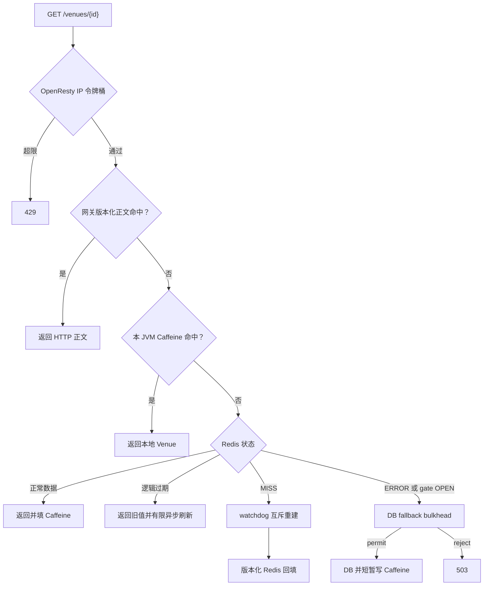
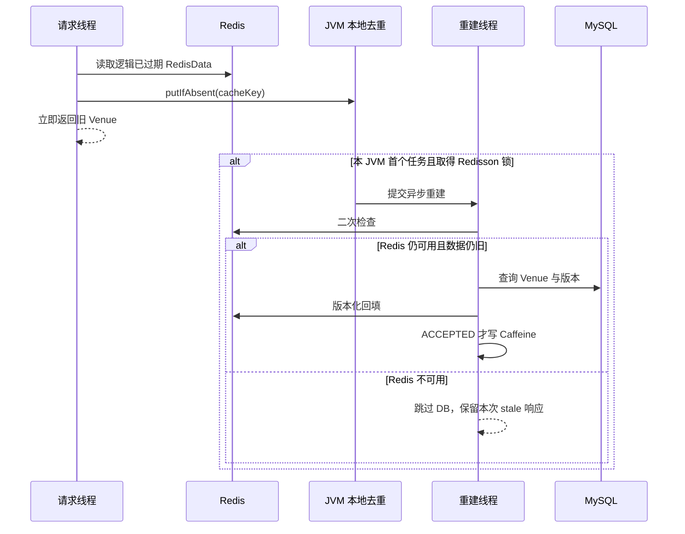
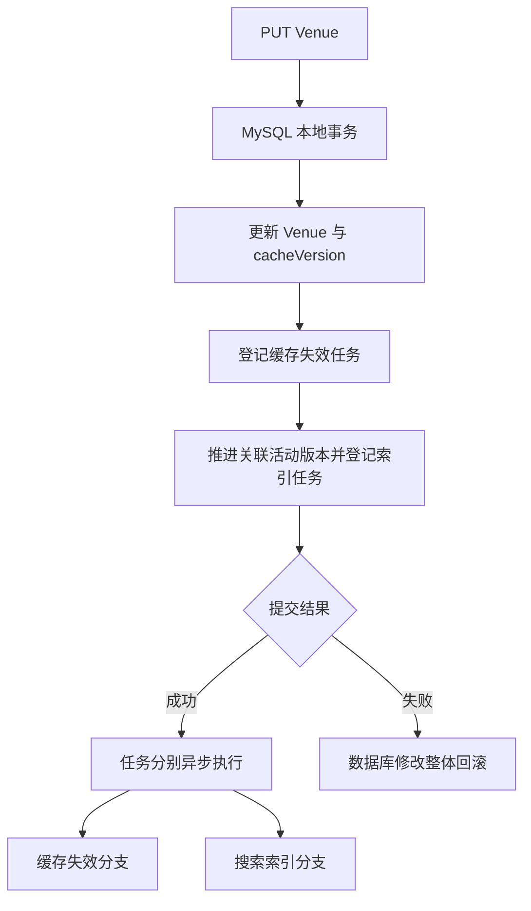
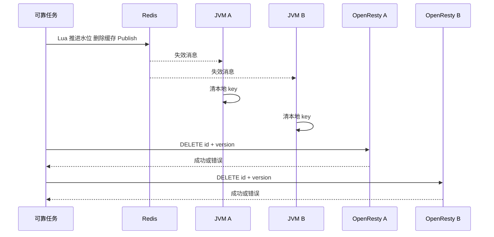
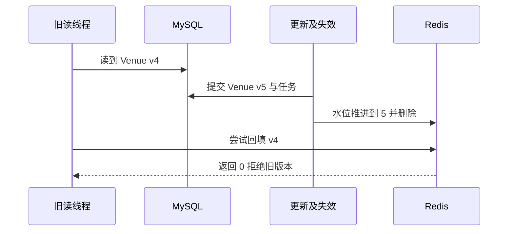
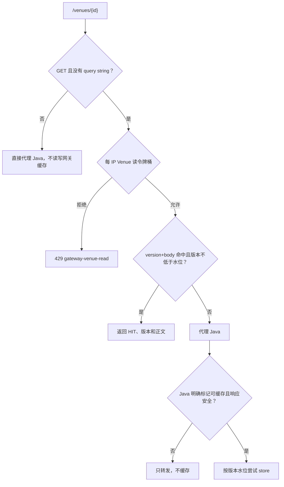
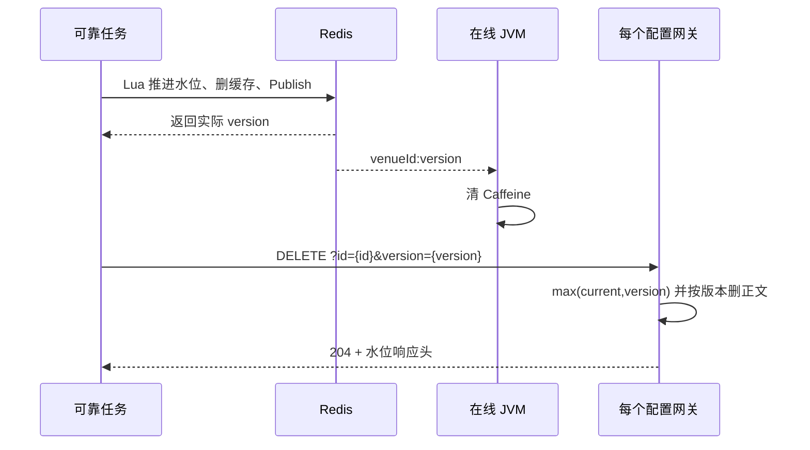
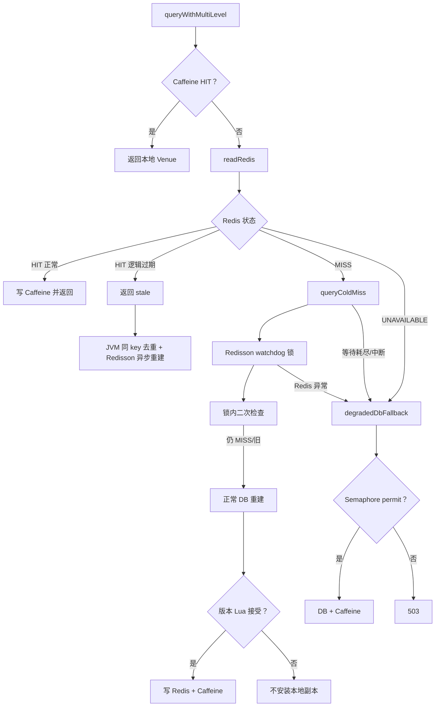

# CityPass 学习文档二：多级缓存一致性

> **对应简历点**：构建 OpenResty、Caffeine、Redis 多级缓存，通过逻辑过期、Redisson watchdog 互斥与受控 DB 降级保护热点读链路；将场馆更新、缓存版本递增与失效任务同事务提交，以 Redis／网关版本水位拒绝旧回填，并利用 Pub/Sub 推动在线 JVM 本地缓存收敛。
>
> **源码基线**：GitHub main，`ead3427ce9d12fe7bae78a5225d7b1ec4d12b8e9`。本篇以 Venue 详情的读写链路为中心，可独立阅读，不要求先掌握预约状态机。
>
> **验证口径**：本文按最新 Java、Lua、OpenResty 配置和测试结果更新。2026-09-19 实际执行 `mvn clean package`、真实 OpenResty 配置检查、双 JVM 缓存一致性脚本和网关专项脚本；Redis 故障／恢复采用可控异常注入，watchdog 另用两个真实 Redisson 客户端验证。本文会明确区分真实集成验证与单元故障注入。

**阅读目录**

- [1. 业务问题：场馆改了名字，为什么用户还能看到旧名字](#section-1)
- [2. 基础概念：缓存命中、穿透、击穿、雪崩](#section-2)
- [3. 总体结构与每层缓存的边界](#section-3)
- [4. 数据结构与真实默认值](#section-4)
- [5. 读链路一：Caffeine 命中](#section-5)
- [6. 读链路二：Redis 有数据，分清三种情况](#section-6)
- [7. 读链路三：Redis 冷 miss 与互斥回源](#section-7)
- [8. 写链路：Venue 更新、版本和失效意图同事务](#section-8)
- [9. 失效执行：先推进水位，再删缓存，再广播](#section-9)
- [10. 版本水位怎样阻止旧 Redis 回填](#section-10)
- [11. 必须掌握：Redis 防旧写不等于所有 JVM 都不会旧](#section-11)
- [12. 可选 OpenResty：缓存 HTTP 正文与缓存 Java 对象不同](#section-12)
- [13. Canal、Outbox 和 Pub/Sub 不在同一层](#section-13)
- [14. 缓存失效任务为什么能够恢复，又在哪结束](#section-14)
- [15. 双 JVM 验证与排查顺序](#section-15)
- [16. 面试官追问与详细回答](#section-16)
- [17. 一张表完成复习](#section-17)
- [附录：源码与原学习材料导航](#section-18)

**OpenResty 内容导航**

首次接触 OpenResty，可以先读第 12 章的下列小节，再回看前面的 Java 缓存链路：

- [12.1 是什么：Nginx、Lua 与 Java 的关系](#openresty-basics)
- [12.2 部署位置与 8080／8081 的区别](#openresty-position)
- [12.3 已有 Caffeine、Redis，为什么还加网关缓存](#openresty-purpose)
- [12.4 请求命中与未命中的完整流程](#openresty-request)
- [12.5 共享字典、缓存项与版本水位](#openresty-memory)
- [12.6 命中读取与版本校验](#openresty-hit-code)
- [12.7 响应回填、可信信号与旧写拒绝](#openresty-fill-code)
- [12.8 请求处理阶段](#openresty-phases)
- [12.9 更新后的网关驱逐链路](#openresty-invalidation)
- [12.10 旧响应为什么不能在 purge 后复活](#openresty-race)
- [12.11 缓存范围与鉴权边界](#openresty-auth)
- [12.12 Venue 读限流与预约限流怎样分工](#openresty-rate)
- [12.13 本地观察实验与排错](#openresty-practice)
- [12.14 八道专项面试问答](#openresty-interview)

**源码精读导航（本次增强）**

本次保留原有链路讲解、图表与面试问答，并在相应章节补入真实源码。阅读顺序建议是：先看本章业务解释，再读带“教学”注释的代码，最后用失败边界检查自己是否理解。代码以本篇固定提交为准，不是新设计或待实现方案。

- [第 4 章 · Caffeine 配置：容量、过期和统计分别约束什么](#code-2-1)
- [第 6 章 · queryWithMultiLevel：分清 Redis MISS 与 ERROR](#code-2-2)
- [第 6 章 · rebuildAsync：旧值响应以后，后台怎样更新](#code-2-3)
- [第 7 章 · queryColdMiss：watchdog、双重检查与有限等待](#code-2-4)
- [第 7 章 · tryRebuildLock：为什么不传固定 lease time](#code-2-5)
- [第 7 章 · degradedDbFallback：无等待 DB bulkhead](#code-2-6)
- [第 8 章 · Venue.update：更新与两个派生系统的待办一起落库](#code-2-7)
- [第 9 章 · 失效 Lua：版本水位只能前进，旧任务也能安全删除](#code-2-8)
- [第 9 章 · evict 与 purgeGateways：Redis 水位怎样传到网关](#code-2-9)
- [第 9 章 · onMessage：广播携带版本，但本地只按 ID 删除](#code-2-10)
- [第 10 章 · writeWithLogicalExpire：时间、版本和 Redis 故障状态](#code-2-11)
- [第 10 章 · 回填 Lua：拒绝的是小于水位的旧版本](#code-2-12)
- [第 12 章 · purgeGateways：携带版本并逐个驱逐配置节点](#code-2-13)

> **阅读约定**：完整方法保留事务注解；方法内节选会明确说明省略范围，不能单独复制成可运行类。所有新增行内注释均以“教学”标识，原代码中的英文／中文注释保留，但过时的原注释会在解释中指出。数值、订单号与时序例子均为教学推演，不是新增实测结果。

<a id="section-1"></a>

## 1. 业务问题：场馆改了名字，为什么用户还能看到旧名字

假设场馆 2 的名称原来是“城市音乐空间”，运营人员改成“星港音乐空间”。MySQL 更新成功，只证明数据库里的值变了。用户可能先命中网关缓存，或者命中某台 Java 应用的本地缓存，还没有任何机会读到数据库。

缓存的价值是用更多副本减少重复读取；一致性的成本也是这些副本带来的。第一步不是问“用了几层缓存”，而是问：每层保存什么、多久过期、谁负责让它失效、读到旧值是否可接受。

对于场馆介绍，短暂旧名称通常比数据库过载更可接受。对于“最后一份库存属于谁”，不能照搬同样的旧读策略。本篇只治理可回源的 Venue 查询副本，不把预约库存当普通详情缓存。

| 对象 | 权威事实 | 缓存/派生层 | 允许的语义 |
|---|---|---|---|
| 场馆详情 | MySQL Venue 行 | Caffeine、Redis、可选网关 | 暂时旧读，最终收敛 |
| 预约资源 | 订单、库存等业务事实 | Redis stock、claim | 不可用普通删缓存替代归属恢复 |
| 搜索结果 | MySQL 活动及场馆 | ES 活动文档 | 查询投影有独立版本与搜索视图 |

本篇要解决的是：既减少热点详情的回源压力，又保存失效意图、传播失效，并尽量阻止迟到的旧数据库快照重新覆盖缓存。

<a id="section-2"></a>

## 2. 基础概念：缓存命中、穿透、击穿、雪崩

**缓存命中**：这一层已经有可用副本，直接返回。**miss**：没有副本，需要问下一层。**回源**：最终查询权威数据源，本项目主要指 MySQL。

| 问题 | 场景 | 本项目对应手段 | 不应夸大的地方 |
|---|---|---|---|
| 穿透 | 不存在的 ID 被不断查询 | 重复 key 用 Redis null marker；随机 key 用 OpenResty 每 IP 读令牌桶 | 不是完整 WAF，也不是跨网关全局限流 |
| 击穿 | 某热点 Key 到期，大量请求同时回源 | 逻辑过期旧读、JVM 内异步去重、Redisson watchdog 锁、二次检查 | 等待耗尽只进入有限 DB 降级，不承诺所有请求成功 |
| 雪崩 | 大量 Key 同时过期或 Redis 整体不可用 | 正向 TTL jitter；Caffeine 优先；Redis failure gate；DB fallback bulkhead | Redis 故障是受控降级，超容量返回 503，不是无损切库 |
| 脏回填 | 旧查询在更新后才写缓存 | Redis 与 OpenResty 版本水位、原子回填 | Caffeine／负缓存／故障降级仍有边界 |
| 多副本旧值 | 某 JVM 或网关漏清理 | Pub/Sub、本地 TTL、网关 purge | 非逐实例持久确认协议 |

“逻辑过期”是在数据里保存一个应刷新时间；“物理过期”是 Redis 到期后真的让 Key 不再存在。二者不是重复设置同一个 TTL。

<a id="section-3"></a>

## 3. 总体结构与每层缓存的边界



| 层 | 真实存储内容 | 共享范围 | 命中后绕过 |
|---|---|---|---|
| OpenResty | `version + 换行 + HTTP 正文`，另有每 Venue 版本水位 | 单个网关实例的共享字典，worker 间共享 | Java、Redis、MySQL |
| Caffeine | `LocalEntry(data,version)` | 一个 JVM | Redis、MySQL |
| Redis | `RedisData(data,version,expireTime,nullValue)` | 使用同一 Redis 的应用实例 | MySQL |
| MySQL | Venue 字段及 cache_version | 数据库事实 | 不适用 |

Java 代码称 Caffeine 为 L1；OpenResty 配置也称自己 L1。面试时用组件名称避免两种 L1 混淆。MySQL 是事实源，不要因为画在第三层就把它叫作“第三份缓存”。

当前主要调用链：`VenueController.queryVenueById` → `VenueServiceImpl.queryById` → `MultiLevelCacheService.queryWithMultiLevel` → Caffeine/Redis/MySQL。

场馆列表、GEO 列表不是这套单 Venue key 治理的自动覆盖范围。搜索接口也不通过本方法获得 ES 查询结果。

源码：[Venue 服务](https://github.com/SyH-101/citypass-platform/blob/7b51ffafcea428e2877db0541709d130828236e7/src/main/java/com/citypass/service/impl/VenueServiceImpl.java#L41)、[缓存服务](https://github.com/SyH-101/citypass-platform/blob/ead3427ce9d12fe7bae78a5225d7b1ec4d12b8e9/src/main/java/com/citypass/utils/MultiLevelCacheService.java#L121)、[网关配置](https://github.com/SyH-101/citypass-platform/blob/ead3427ce9d12fe7bae78a5225d7b1ec4d12b8e9/src/main/resources/openresty/nginx.conf#L68)。

<a id="section-4"></a>

## 4. 数据结构与真实默认值

### 4.1 RedisData 不是裸 Venue JSON

教学表示如下，时间与版本为示例：

```json
{
  "data": {"id": 2, "name": "城市音乐空间", "cacheVersion": 4},
  "version": 4,
  "expireTime": "2098-05-01T10:30:00",
  "nullValue": false
}
```

外层 version 用于判断回填代次，expireTime 表达逻辑新鲜度。两者解决不同问题：一个版本很新的对象也会随着时间到达刷新点；一个尚未逻辑到期的缓存也可能因数据库更新而已经过时。

关键 Key：

| Key | 用途 |
|---|---|
| `cache:venue:{id}` | 主查询 RedisData |
| `cache:venue:version:{id}` | 已知缓存版本水位 |
| `cache:venue:baseline:{id}` | 独立 Redis 基线查询的裸对象格式 |
| `lock:venue:rebuild:{id}` | 主读链路冷 miss 与异步重建共用的 Redisson 锁 |
| `lock:venue:{id}` | `CacheClient` 中保留的旧字符串锁命名空间，不与 Redisson Hash 锁混用 |
| `cache:venue:invalidate` | Redis Pub/Sub 失效频道 |

基线接口不是另一份版本化查询实现。它使用 `CacheClient.queryWithPassThrough`；与主查询隔离 key，避免两种 JSON 格式互相读坏。失效脚本会同时删主缓存和基线缓存。

### 4.2 TTL 不能全写成“30 分钟”

| 项目 | 当前默认行为 |
|---|---|
| Caffeine | 最多 10000 项，写入后 10 分钟过期，启用 recordStats |
| Redis 逻辑 TTL | 基础 30 分钟，加 `[0,20%)` 正向随机增量 |
| Redis 物理 TTL | `max(逻辑秒数×2, 逻辑秒数+3600)` |
| 负缓存 | 2 分钟物理 TTL |
| Redis 重建锁 | Redisson `RLock.tryLock()`，不传固定 lease time，由 watchdog 自动续期 |
| 冷 miss 等锁 | 默认最多 20 轮，每轮随机睡 25～50ms，并检查是否已被别人填好；参数可配置 |
| Redis failure gate | 连续 3 次 Redis 异常后 OPEN 3 秒；冷却后只允许一个 HALF_OPEN 探测 |
| DB fallback bulkhead | 每 JVM 默认 8 个并发 permit；`tryAcquire()` 失败立即返回 503，不排队 |
| 重建线程池 | 固定 10 个 daemon 线程；固定线程池默认队列并非有界隔离队列 |
| OpenResty | 约 600±60 秒，版本与正文作为一个值，正文最大 1MiB；Venue 读限流默认 60/s、burst 120 |

按 1800 秒基础计算，逻辑时间在 1800～2159 秒，物理时间在 5400～5759 秒。物理时间更长是为了保留可供旧读和刷新使用的数据。

缓存版本水位没有随主数据使用相同 TTL；它保留“已知至少到了哪一代”的记忆。Redis 整体丢失后水位也会丢失，协议边界会改变。

源码：[Caffeine 配置](https://github.com/SyH-101/citypass-platform/blob/7b51ffafcea428e2877db0541709d130828236e7/src/main/java/com/citypass/config/CaffeineConfig.java#L14)、[常量](https://github.com/SyH-101/citypass-platform/blob/ead3427ce9d12fe7bae78a5225d7b1ec4d12b8e9/src/main/java/com/citypass/utils/RedisConstants.java#L3)、[可靠性配置](https://github.com/SyH-101/citypass-platform/blob/ead3427ce9d12fe7bae78a5225d7b1ec4d12b8e9/src/main/java/com/citypass/config/CacheReliabilityProperties.java#L8)、[RedisData](https://github.com/SyH-101/citypass-platform/blob/7b51ffafcea428e2877db0541709d130828236e7/src/main/java/com/citypass/utils/RedisData.java#L8)。


<a id="code-2-1"></a>

### 源码精读 1：Caffeine 配置：容量、过期和统计分别约束什么

**源码位置**：[CaffeineConfig.java · venueLocalCache](https://github.com/SyH-101/citypass-platform/blob/7b51ffafcea428e2877db0541709d130828236e7/src/main/java/com/citypass/config/CaffeineConfig.java#L19-L26)。完整方法；仅追加标有“教学”的中文注释，未改动原有语句。节选依赖的变量和外围事务请结合本章上下文阅读。

**这个方法／片段实现什么？** 创建当前 JVM 进程使用的一份场馆缓存，每个服务实例各自持有，进程之间不会自动共享 Java 对象。

```java
@Bean
public Cache<String, Object> venueLocalCache() {
    return Caffeine.newBuilder()
            .maximumSize(10_000) // 教学：限制条目数，不是精确限制内存字节数
            .expireAfterWrite(10, TimeUnit.MINUTES) // 教学：从写入计时，命中不会把这段时间重新延长
            .recordStats() // 教学：开启命中等统计，不等于已经接好完整监控面板
            .build();
}
```

**沿代码往下看**

1. 10,000 条容量限制减少无限增长风险。
2. 写入后 10 分钟过期使本地缓存有自然淘汰路径。
3. recordStats 允许读取缓存统计数据；观察命中率仍要结合采集与压测。

**失败与边界**：该 TTL 不表示数据最多只旧 10 分钟：如果上游数据本身仍旧，重新回填也可能继续旧。是否及时更新还依赖 Redis 失效、消息传播和在途读写。

<a id="section-5"></a>

## 5. 读链路一：Caffeine 命中

`getIfPresent(cacheKey)` 得到 LocalEntry 就直接返回 data。这个路径没有访问 Redis，没有查询最新水位，也没有重新检查 RedisData 的 expireTime。

收益很直接：同一热点场馆在本 JVM 内重复读取，不必每次跨网络访问 Redis。但一个 JVM 清理自己的缓存，不代表另一个 JVM 自动清理。每个实例的局部内存是独立副本。

LocalEntry 虽然保存 version，当前命中时没有使用它比较新旧。**字段存在不等于版本协议已覆盖所有读写路径。** 后文的 Pub/Sub listener 也没有依据消息版本维护本地单调水位，它只是删 key。

<a id="section-6"></a>

## 6. 读链路二：Redis 有数据，分清三种情况

### 6.1 负缓存命中

`nullValue=true` 表示数据库之前没有对应 Venue。方法记录 `cache.null.marker.hit` 并返回 null，业务层返回“场馆不存在”；null marker 不进入 Caffeine。

它解决的是**同一个不存在 ID 的重复查询**。如果请求不断更换随机 ID，每个新 key 仍可能首次到达数据库，因此网关另有独立的 Venue 读限流。两个机制作用范围不同，不能只靠 null marker 宣称已经治理所有穿透。

### 6.2 RedisData 逻辑未过期

Redis HIT 会转换成 Venue；逻辑截止仍在未来时，写入本 JVM Caffeine 并返回。这里认为 Redis 副本可用，不会每次再查 MySQL 证明它最新。

逻辑未过期不等于强一致：若更新事务刚提交而失效任务尚未执行，旧 RedisData 仍可能被读取。这是异步失效窗口。

### 6.3 RedisData 逻辑已过期

当前请求仍返回旧 Venue，同时调用 `rebuildAsync()`。方法先用 `localRebuilds.putIfAbsent` 做同 JVM、同 key 的任务去重，再在线程池中尝试同一把 Redisson 重建锁。拿不到锁直接结束，不重复查询数据库。

拿到锁后还会二次读取 Redis：如果已有其他实例完成刷新，就直接使用新值；如果 Redis 此时不可用，当前请求既然已经拿到 stale，就跳过数据库刷新，避免缓存故障时后台任务继续放大 DB 压力。只有数据仍旧或确实缺失时才查 MySQL，版本化写 Redis 成功后才写 Caffeine。



图中的返回与后台刷新没有强制完成顺序。逻辑过期选择可用性与延迟优先，同时用本地去重和分布式锁限制重建数量。

<a id="code-2-2"></a>

### 源码精读 2：queryWithMultiLevel：先分清 Redis MISS 与 ERROR

**源码位置**：[MultiLevelCacheService.java · queryWithMultiLevel](https://github.com/SyH-101/citypass-platform/blob/ead3427ce9d12fe7bae78a5225d7b1ec4d12b8e9/src/main/java/com/citypass/utils/MultiLevelCacheService.java#L121-L139)。完整方法；仅追加标有“教学”的中文注释。

**这个方法／片段实现什么？** 输入缓存前缀、ID、目标类型和数据库函数；按 Caffeine、Redis、MySQL 的顺序查询，并把 Redis 正常未命中与 Redis 不可用分流。

```java
@SuppressWarnings("unchecked")
public <R, ID> R queryWithMultiLevel(String keyPrefix, ID id, Class<R> type,
                                     Function<ID, R> dbFallback, Long ttl, TimeUnit unit) {
    String cacheKey = keyPrefix + id;
    Object cached = venueLocalCache.getIfPresent(cacheKey);
    if (cached instanceof LocalEntry) {
        metrics.caffeineHit();
        return (R) ((LocalEntry) cached).getData(); // 教学：本地命中时 Redis 故障不影响本次读取
    }

    RedisReadResult redisRead = readRedis(cacheKey);
    if (redisRead.state == RedisReadState.HIT) {
        return serveRedisHit(keyPrefix, id, type, dbFallback, ttl, unit, redisRead.data);
    }
    if (redisRead.state == RedisReadState.UNAVAILABLE) {
        return degradedDbFallback(cacheKey, id, dbFallback, "REDIS_UNAVAILABLE"); // 教学：受控降级，不是无界直查
    }
    return queryColdMiss(keyPrefix, id, type, dbFallback, ttl, unit); // 教学：普通 MISS 进入正常互斥重建
}
```

**沿代码往下看**

1. Caffeine 命中直接返回，并记录指标。
2. Redis HIT 再区分 null marker、正常数据和逻辑过期。
3. Redis MISS 进入正常的 watchdog 互斥重建。
4. 连接超时、拒绝、命令异常或 gate OPEN 表示 `UNAVAILABLE`，只能进入带并发上限的降级入口。

**失败与边界**：Caffeine 只有进程内副本；Redis 故障且本地未命中时，系统宁可让超容量请求得到 503，也不把全部流量转给 MySQL。

<a id="code-2-3"></a>

### 源码精读 3：rebuildAsync：旧值响应以后，后台怎样更新

**源码位置**：[MultiLevelCacheService.java · rebuildAsync](https://github.com/SyH-101/citypass-platform/blob/ead3427ce9d12fe7bae78a5225d7b1ec4d12b8e9/src/main/java/com/citypass/utils/MultiLevelCacheService.java#L268-L317)。方法核心节选；线程池创建和异常日志结合源码阅读。

```java
private <R, ID> void rebuildAsync(String keyPrefix, ID id, Class<R> type,
                                  Function<ID, R> dbFallback, Long ttl, TimeUnit unit) {
    String cacheKey = keyPrefix + id;
    if (localRebuilds.putIfAbsent(cacheKey, Boolean.TRUE) != null) return; // 教学：同 JVM 同 key 只安排一个任务
    try {
        rebuildExecutor.submit(() -> {
            RLock lock = null;
            String lockKey = LOCK_VENUE_REBUILD_KEY + id;
            try {
                LockAttempt lockAttempt = tryRebuildLock(lockKey);
                if (lockAttempt.state != LockState.ACQUIRED) return;
                lock = lockAttempt.lock;

                RedisReadResult latest = readRedis(cacheKey); // 教学：分布式锁内再检查一次
                if (latest.state == RedisReadState.UNAVAILABLE) return; // 教学：已有 stale 可返回，Redis 故障时不额外压 DB
                if (latest.state == RedisReadState.HIT && !isLogicallyExpired(latest.data)) {
                    serveFreshRedisData(cacheKey, type, latest.data);
                    return;
                }

                metrics.rebuildStarted();
                R data = dbFallback.apply(id);
                if (data == null) {
                    writeNullMarker(cacheKey, id);
                    venueLocalCache.invalidate(cacheKey);
                } else if (writeWithLogicalExpire(cacheKey, id, data, ttl, unit)
                        == WriteState.ACCEPTED) {
                    venueLocalCache.put(cacheKey, new LocalEntry(data, versionOf(data)));
                } else {
                    venueLocalCache.invalidate(cacheKey);
                }
            } finally {
                unlockSafely(lock, lockKey);
                localRebuilds.remove(cacheKey);
            }
        });
    } catch (RuntimeException rejected) {
        localRebuilds.remove(cacheKey);
    }
}
```

**沿代码往下看**

1. `localRebuilds` 防止一个 JVM 因并发旧读向线程池塞入大量同 key 任务。
2. Redisson 锁负责跨 JVM 串行正常重建。
3. 锁内二次检查避免其他实例已完成刷新后再次查询数据库。
4. Redis 不可用时不把异步刷新变成新的 DB 降级流量。
5. Redis 版本写拒绝或写异常都不会把该对象写入 Caffeine。

**失败与边界**：固定 10 线程池仍使用默认无界工作队列；本地去重限制同 key 数量，不等于对大量不同 key 提供全局有界队列。

<a id="section-7"></a>

## 7. 读链路三：Redis 冷 miss、watchdog 与受控回源

冷 miss 没有旧值可返回。当前代码先区分两条路径：

- **正常重建**：Redis 正常返回 MISS，一个请求持有 Redisson 锁，二次检查后查询 DB 并回填。
- **降级回源**：Redis 读／锁异常、gate OPEN、等待耗尽或线程中断时，进入每 JVM 的 DB fallback bulkhead。

正常重建没有先占 bulkhead permit，因为同一个 key 已被分布式锁串行；降级路径则不再拥有可靠的 Redis 协调能力，必须通过独立容量边界保护 MySQL。

### 7.1 为什么改用 Redisson watchdog

旧实现是 `SET NX + 10 秒 TTL + UUID + unlock.lua`。UUID 与 Lua 能避免旧线程误删后来者的锁，却不能阻止数据库查询超过 10 秒后锁先过期，第二个线程再次成为正常重建者。

当前主链使用 `RLock.tryLock()`，**没有传 lease time**。Redisson 在持锁客户端仍存活时由 watchdog 自动续期；释放时又先检查 `isHeldByCurrentThread()`。它同时解决固定 10 秒锁提前过期和 owner 安全释放问题。

watchdog 仍不等于 fencing：进程长暂停、网络分区或 Redis 状态丢失时，旧工作不能仅靠锁证明结果仍新。因此 `cacheVersion + version watermark` 继续保留。

### 7.2 等锁耗尽为什么不能直接查数据库

未获得锁的请求按配置等待并反复读取 Redis。若等待 20 轮仍没有结果，旧实现会让每个请求直接执行 `dbFallback`，热点压力会重新集中到 MySQL。

现在等待耗尽只表示进入降级入口。`Semaphore.tryAcquire()` 有 permit 才允许查 DB，没有 permit 立即抛 `CacheDegradedException`，由全局异常处理返回 HTTP 503。该设计明确选择“保护数据库并拒绝一部分请求”，不承诺缓存故障期间所有请求都成功。

### 7.3 Redis failure gate 怎样避免每次都等待超时

`readRedis`、获取重建锁、写 RedisData 和写 null marker 都接入同一个线程安全 failure gate：

```text
CLOSED --连续 Redis 异常达到阈值--> OPEN
OPEN --冷却时间到，只允许一个探测--> HALF_OPEN
HALF_OPEN --探测成功--> CLOSED
HALF_OPEN --探测失败--> OPEN
```

普通 Redis MISS 是一次成功命令，不计为故障。OPEN 期间请求不再逐个等待 Redis 网络超时；Caffeine 命中仍可服务，Caffeine miss 才进入受控 DB 降级。默认连续失败阈值为 3，OPEN 3 秒，Redis 命令超时 1 秒。

<a id="code-2-4"></a>

### 源码精读 4：queryColdMiss：watchdog、双重检查与有限等待

**源码位置**：[MultiLevelCacheService.java · queryColdMiss](https://github.com/SyH-101/citypass-platform/blob/ead3427ce9d12fe7bae78a5225d7b1ec4d12b8e9/src/main/java/com/citypass/utils/MultiLevelCacheService.java#L151-L200)。方法核心节选。

```java
for (int attempt = 0; attempt < attempts; attempt++) {
    LockAttempt lockAttempt = tryRebuildLock(lockKey);
    if (lockAttempt.state == LockState.UNAVAILABLE) {
        return degradedDbFallback(cacheKey, id, dbFallback, "REDIS_LOCK_UNAVAILABLE");
    }
    if (lockAttempt.state == LockState.ACQUIRED) {
        boolean redisUnavailable = false;
        try {
            RedisReadResult doubleChecked = readRedis(cacheKey);
            if (doubleChecked.state == RedisReadState.UNAVAILABLE) {
                redisUnavailable = true;
            } else if (doubleChecked.state == RedisReadState.HIT
                    && !isLogicallyExpired(doubleChecked.data)) {
                return serveFreshRedisData(cacheKey, type, doubleChecked.data);
            } else {
                return normalRebuild(cacheKey, id, dbFallback, ttl, unit);
            }
        } finally {
            unlockSafely(lockAttempt.lock, lockKey);
        }
        if (redisUnavailable) {
            return degradedDbFallback(cacheKey, id, dbFallback,
                    "REDIS_DOUBLE_CHECK_UNAVAILABLE");
        }
    }

    if (!sleepBeforeRetry()) {
        return degradedDbFallback(cacheKey, id, dbFallback, "LOCK_WAIT_INTERRUPTED");
    }
    RedisReadResult refreshed = readRedis(cacheKey);
    if (refreshed.state == RedisReadState.HIT) {
        return serveRedisHit(keyPrefix, id, type, dbFallback, ttl, unit, refreshed.data);
    }
    if (refreshed.state == RedisReadState.UNAVAILABLE) {
        return degradedDbFallback(cacheKey, id, dbFallback, "REDIS_WAIT_UNAVAILABLE");
    }
}
return degradedDbFallback(cacheKey, id, dbFallback, "LOCK_WAIT_EXHAUSTED");
```

**失败与边界**：等待轮数和 25～50ms 抖动是配置边界，不是数据库 SLA；大量不同 key 仍可能各有一个正常重建，需要与网关限流、数据库连接池共同评估。

<a id="code-2-5"></a>

### 源码精读 5：tryRebuildLock：为什么不传固定 lease time

**源码位置**：[MultiLevelCacheService.java · tryRebuildLock](https://github.com/SyH-101/citypass-platform/blob/ead3427ce9d12fe7bae78a5225d7b1ec4d12b8e9/src/main/java/com/citypass/utils/MultiLevelCacheService.java#L395-L421)。连续方法节选。

```java
private LockAttempt tryRebuildLock(String key) {
    RedisFailureGate.Permission permission = redisFailureGate.tryAcquire();
    if (permission == RedisFailureGate.Permission.REJECTED) {
        metrics.redisBypassed();
        return new LockAttempt(LockState.UNAVAILABLE, null);
    }
    try {
        RLock lock = redissonClient.getLock(key);
        boolean acquired = lock.tryLock(); // 教学：不传 lease time 才启用 watchdog 自动续期
        redisFailureGate.onSuccess(permission);
        return new LockAttempt(acquired ? LockState.ACQUIRED : LockState.BUSY,
                acquired ? lock : null);
    } catch (RuntimeException e) {
        recordRedisFailure(permission, "rebuild lock", key, e);
        return new LockAttempt(LockState.UNAVAILABLE, null);
    }
}

private void unlockSafely(RLock lock, String key) {
    if (lock == null) return;
    try {
        if (lock.isHeldByCurrentThread()) lock.unlock(); // 教学：当前线程仍是 owner 才释放
    } catch (RuntimeException e) {
        metrics.redisError();
    }
}
```

Redisson 内部仍会使用 owner 身份与 Lua 保证解锁安全，但主业务代码不再自己维护 UUID 和续租线程。旧 `unlock.lua` 仍被通用 `CacheClient` 使用，不能再把它描述成 Venue 主查询链的当前锁实现。

<a id="code-2-6"></a>

### 源码精读 6：degradedDbFallback：无等待 DB bulkhead

**源码位置**：[MultiLevelCacheService.java · degradedDbFallback](https://github.com/SyH-101/citypass-platform/blob/ead3427ce9d12fe7bae78a5225d7b1ec4d12b8e9/src/main/java/com/citypass/utils/MultiLevelCacheService.java#L220-L239)。完整方法。

```java
private <R, ID> R degradedDbFallback(String cacheKey, ID id,
                                      Function<ID, R> dbFallback, String reason) {
    if (!dbFallbackBulkhead.tryAcquire()) { // 教学：不排队；没有容量立即拒绝
        metrics.dbFallbackRejected();
        throw new CacheDegradedException("缓存服务暂时不可用，请稍后重试");
    }
    metrics.dbFallbackAccepted();
    try {
        R result = dbFallback.apply(id);
        if (result != null) {
            venueLocalCache.put(cacheKey, new LocalEntry(result, versionOf(result)));
        }
        return result;
    } finally {
        dbFallbackBulkhead.release(); // 教学：数据库调用成功或抛错都释放 permit
    }
}
```

**沿代码往下看**

1. permit 上限来自 `cache.reliability.db-fallback-max-concurrency`，默认 8。
2. `tryAcquire` 不等待，避免把线程堆积从 Redis 转移到应用。
3. 成功结果可写 Caffeine，让同 JVM 后续请求在 Redis 故障期间继续命中。
4. 超容量异常由 `WebExceptionAdvice` 映射成 503。

**失败与边界**：bulkhead 是每 JVM 的；部署 N 个实例时，全局理论上限约为 N 倍配置值。降级写 Caffeine 时 Redis 不可用，无法读取共享版本水位，因此仍依赖较短的本地 TTL、恢复后的正常失效和后续治理收敛。

<a id="section-8"></a>

## 8. 写链路：Venue 更新、版本和失效意图同事务

当前 `PUT /venues` 的完整数据库事务已受到新增搜索模块影响，顺序是：

1. `assertWritesAllowed()` 锁搜索重建状态行，检查维护窗口；
2. 更新 Venue 业务字段；
3. SQL 执行 `cache_version=cache_version+1`；
4. 重读 Venue 获取本次版本，登记 INVALIDATE_VENUE_CACHE；
5. 为关联活动递增 search_version；
6. 逐活动登记 INDEX_ACTIVITY_SEARCH；
7. 提交。

缓存版本、搜索版本分别服务不同副本。任一步必要数据库写失败，整笔事务回滚，不是 Venue 已改但索引任务失败可以随便忽略。



本篇继续跟随 I。搜索分支的完整展开在独立搜索篇，不把它重新解释成缓存删除。

### 8.1 为什么不先删缓存再更新数据库

如果缓存先删，读线程 miss 后查询到尚未提交的新事务之前的旧数据库值，再写回缓存，就可能把旧值留住。甚至更新事务最终回滚，也无法自动撤销之前发出的外部删除。

### 8.2 为什么不是 afterCommit 就够了

afterCommit 回调可以避免事务提交前执行，但应用可能在 COMMIT 成功后、回调执行前退出。内存里知道要做什么不能供其他进程恢复。

持久任务把失效意图与 Venue 修改一起记在 MySQL。它不消除提交到失效执行的时间差，但把不可恢复的漏执行窗口变成有记录可重试的窗口。

### 8.3 不能说“所有场馆写路径都覆盖了”

当前 PUT 已覆盖上述事务；`POST /venues` 仍直接 save，没有同样的失效登记。场馆列表、GEO 索引也没有因为单详情缓存治理而自动同步。搜索维护锁和关联活动扇出还会增加 PUT 的锁范围与写放大。

源码：[VenueServiceImpl.update](https://github.com/SyH-101/citypass-platform/blob/7b51ffafcea428e2877db0541709d130828236e7/src/main/java/com/citypass/service/impl/VenueServiceImpl.java#L41)、[VenueController](https://github.com/SyH-101/citypass-platform/blob/ead3427ce9d12fe7bae78a5225d7b1ec4d12b8e9/src/main/java/com/citypass/controller/VenueController.java#L22)。


<a id="code-2-7"></a>

### 源码精读 7：Venue.update：更新与两个派生系统的待办一起落库

**源码位置**：[VenueServiceImpl.java · update](https://github.com/SyH-101/citypass-platform/blob/7b51ffafcea428e2877db0541709d130828236e7/src/main/java/com/citypass/service/impl/VenueServiceImpl.java#L85-L109)。完整方法；仅追加标有“教学”的中文注释，未改动原有语句。节选依赖的变量和外围事务请结合本章上下文阅读。

**这个方法／片段实现什么？** 写链路以场馆为数据库事实源；修改成功后不是立刻保证所有缓存已更新，而是保证可恢复的失效意图已经持久化。

```java
@Override
@Transactional // 教学：事务覆盖场馆、版本和本地可靠任务
public Result update(Venue venue) {
    Long id = venue.getId();
    if (id == null) {
        return Result.fail("场馆id不能为空");
    }
    searchRebuildStateRepository.assertWritesAllowed(); // 教学：搜索重建时对相关写入设置维护门禁
    // 1.更新数据库
    boolean updated = updateById(venue);
    if (!updated) {
        return Result.fail("场馆不存在或更新失败");
    }
    if (getBaseMapper().incrementCacheVersion(id) != 1) { // 教学：数据库内自增，避免 Java 读旧版本再相加
        throw new IllegalStateException("场馆缓存版本更新失败");
    }
    Venue refreshed = getById(id);
    reliableTaskRepository.enqueue(
            ReliableTaskRepository.INVALIDATE_VENUE_CACHE, // 教学：记录这次提交对应的缓存失效意图
            "invalidate-venue-cache:" + id + ":" + refreshed.getCacheVersion(),
            JSONUtil.toJsonStr(new VenueCacheInvalidation(id, refreshed.getCacheVersion())));
    // Venue name/address/area/coordinates are denormalized into all related activity documents.
    activitySearchOutboxService.bumpVenueDocumentsAndEnqueue(id); // 教学：场馆字段也影响活动搜索文档，登记索引联动任务
    return Result.ok();
}
```

**沿代码往下看**

1. 校验 ID 并通过重建门禁，再更新场馆。
2. SQL 将 cacheVersion 加一，重新读取已更新版本。
3. 以 venueId:version 为业务键，写入 INVALIDATE_VENUE_CACHE payload。
4. 同事务给关联活动推进 searchVersion 并登记 INDEX 任务。两类版本用途不同，但同一次业务写要同步记录各自意图。

**失败与边界**：普通数据库事务不包含随后 Redis、Pub/Sub、OpenResty 或 ES 的执行。源码的场馆新增入口没有完全复用这条失效流程，因此不能说所有写入口都已覆盖。

<a id="section-9"></a>

## 9. 失效执行：先推进水位，再删缓存，再广播

任务载荷是 `venueId + cacheVersion`，幂等业务键包含场馆 ID 和版本。Scheduler 领取任务后调用 `VenueCacheInvalidator.evict()`。

Redis 失效脚本在一次执行中：

1. 读当前水位；
2. 取 `max(当前水位, 请求提交版本)`；
3. 保存水位；
4. 删除主缓存；
5. 删除基线缓存；
6. Publish `venueId:version`。

发布端随后主动清自己的 Caffeine，再把 Lua 返回的实际水位作为 `version` 参数，逐个调用 `gateway-cache.purge-urls` 和兼容的单地址配置。所有地址都会尝试；只要一个失败，handler 就抛异常，使整个任务重试，而不是仅记日志后标 DONE。



重复执行 v5 的失效不会把已到 v6 的水位降回去，但可能再次删除现有缓存、再次广播，造成额外 miss。幂等不等于完全没有成本。

源码：[Invalidator](https://github.com/SyH-101/citypass-platform/blob/ead3427ce9d12fe7bae78a5225d7b1ec4d12b8e9/src/main/java/com/citypass/utils/VenueCacheInvalidator.java#L78)、[失效 Lua](https://github.com/SyH-101/citypass-platform/blob/7b51ffafcea428e2877db0541709d130828236e7/src/main/resources/invalidate-venue-cache.lua#L1)、[Pub/Sub 配置](https://github.com/SyH-101/citypass-platform/blob/7b51ffafcea428e2877db0541709d130828236e7/src/main/java/com/citypass/config/RedisPubSubConfig.java#L13)。


<a id="code-2-8"></a>

### 源码精读 8：失效 Lua：版本水位只能前进，旧任务也能安全删除

**源码位置**：[invalidate-venue-cache.lua · 脚本](https://github.com/SyH-101/citypass-platform/blob/7b51ffafcea428e2877db0541709d130828236e7/src/main/resources/invalidate-venue-cache.lua#L1-L16)。完整脚本；仅追加标有“教学”的中文注释，未改动原有语句。节选依赖的变量和外围事务请结合本章上下文阅读。

**这个方法／片段实现什么？** 把 Redis 版本水位、主缓存删除、压测基线缓存删除和失效广播串在一个 Lua 脚本中执行。

```lua
-- KEYS[1] main cache, KEYS[2] baseline cache, KEYS[3] version key
-- ARGV[1] pub/sub channel, ARGV[2] venueId, ARGV[3] committed database version
local current = tonumber(redis.call('get', KEYS[3]) or '0') -- 教学：Redis 当前已知的最低可接受版本
local requested = tonumber(ARGV[3])
if requested < 0 then -- 教学：没有提交版本的兼容调用，改为从 Redis 水位加一
    requested = current + 1
end
local version = requested
if current > requested then -- 教学：乱序到达的旧失效任务不能让水位倒退
    version = current
end
redis.call('set', KEYS[3], version) -- 教学：先推进版本水位
redis.call('del', KEYS[1])
redis.call('del', KEYS[2])
redis.call('publish', ARGV[1], ARGV[2] .. ':' .. version) -- 教学：通知在线订阅者清理本地缓存
return version
```

**沿代码往下看**

1. 正常任务携带数据库已提交版本；取 max(current, requested)。
2. 先保存新水位，再删除缓存，避免后来的旧回填只看到空 key 就被接受。
3. 广播 venueId:version，让在线 JVM 按 ID 驱逐 Caffeine。
4. 例如 v6 任务先于 v5 执行，水位仍保持 6；v5 的重复删除可能增加回源，但不会降低版本。

**失败与边界**：PUBLISH 没有持久化订阅确认；Lua 执行成功不能证明每个 JVM 已经消费广播。负版本兼容模式还可能使 Redis 水位领先未同步加版本的数据库行。


<a id="code-2-9"></a>

### 源码精读 9：evict 与 purgeGateways：Redis 水位怎样传到网关

**源码位置**：[VenueCacheInvalidator.java · evict／purgeGateways](https://github.com/SyH-101/citypass-platform/blob/ead3427ce9d12fe7bae78a5225d7b1ec4d12b8e9/src/main/java/com/citypass/utils/VenueCacheInvalidator.java#L78-L136)。方法核心节选。

**这个方法／片段实现什么？** Redis Lua 完成版本推进、删除和广播后，把脚本返回的真实水位传给每个显式配置的 OpenResty 节点。

```java
public void evict(Object venueId, Long committedVersion) {
    Long version = redisTemplate.execute(
            INVALIDATE_SCRIPT,
            Arrays.asList(CACHE_VENUE_KEY + venueId,
                    CACHE_VENUE_BASELINE_KEY + venueId,
                    CACHE_VENUE_VERSION_KEY + venueId),
            CACHE_VENUE_INVALIDATION_CHANNEL,
            String.valueOf(venueId),
            String.valueOf(committedVersion == null ? -1L : committedVersion));
    if (version == null) throw new IllegalStateException("场馆缓存失效脚本返回空");
    multiLevelCacheService.evictLocal(CACHE_VENUE_KEY, venueId);
    purgeGateways(venueId, version); // 教学：传脚本实际接受的水位，不只传原请求版本
}

void purgeGateways(Object venueId, long committedVersion) {
    List<String> endpoints = configuredPurgeUrls();
    if (endpoints.isEmpty()) return;
    List<String> failedEndpoints = new ArrayList<>();
    for (String endpoint : endpoints) {
        URI uri = UriComponentsBuilder.fromHttpUrl(endpoint)
                .queryParam("id", String.valueOf(venueId))
                .queryParam("version", committedVersion)
                .build().encode(StandardCharsets.UTF_8).toUri();
        try {
            restTemplate.exchange(uri, HttpMethod.DELETE, null, Void.class);
        } catch (Exception e) {
            failedEndpoints.add(endpoint); // 教学：单点失败后仍继续尝试其他配置节点
        }
    }
    if (!failedEndpoints.isEmpty()) {
        throw new IllegalStateException("OpenResty 场馆缓存驱逐失败: " + failedEndpoints);
    }
}
```

**沿代码往下看**

1. 脚本返回空就抛错，让可靠任务安排重试。
2. 发布 JVM 立即清本地缓存，不依赖自己收到 Pub/Sub 回环。
3. `purge-urls` 支持逗号、分号或换行分隔，并与旧 `purge-url` 去重合并。
4. RestTemplate 连接超时 1 秒、读取超时 2 秒；任一节点失败，任务不能标 DONE。

**失败与边界**：Redis 已执行的操作不因 Java HTTP 异常而回滚；重试会再次删除和广播。网关地址来自静态配置，没有服务发现和逐节点持久确认。

<a id="code-2-10"></a>

### 源码精读 10：onMessage：广播携带版本，但本地只按 ID 删除

**源码位置**：[VenueCacheInvalidator.java · onMessage](https://github.com/SyH-101/citypass-platform/blob/ead3427ce9d12fe7bae78a5225d7b1ec4d12b8e9/src/main/java/com/citypass/utils/VenueCacheInvalidator.java#L94-L100)。完整方法；仅追加标有“教学”的中文注释，未改动原有语句。节选依赖的变量和外围事务请结合本章上下文阅读。

**这个方法／片段实现什么？** 每个在线订阅实例收到广播后清理自身 Caffeine。它不是在所有实例上重新执行完整的失效任务。

```java
@Override
public void onMessage(Message message, byte[] pattern) {
    String event = new String(message.getBody(), StandardCharsets.UTF_8);
    int separator = event.lastIndexOf(':'); // 教学：从 venueId:version 拆出 ID
    String venueId = separator < 0 ? event : event.substring(0, separator);
    multiLevelCacheService.evictLocal(CACHE_VENUE_KEY, venueId); // 教学：执行 invalidate，不查询数据库、不对比本地版本
    log.debug("收到场馆缓存失效广播: {}", event);
}
```

**沿代码往下看**

1. UTF-8 解码消息。
2. 按最后一个冒号提取场馆 ID，兼容只有 ID 的消息。
3. 删除该实例的本地条目，使下次读取走 Redis／数据库。

**失败与边界**：版本出现在消息中，但此方法没有维护本地版本墓碑，也没有阻止已经在途的旧读取稍后 put。断线实例漏收广播依靠后续读取与过期等机制收敛。

<a id="section-10"></a>

## 10. 版本水位怎样阻止旧 Redis 回填

设数据库查询 Q 读到 v4，然后运营提交 v5，失效任务已将 Redis 水位推进为 5。Q 此时才回填：如果无版本判断，就会重新放入旧名称；有水位以后，v4<5，Lua 返回 0，不写主缓存。



回填脚本比较 `expected < current`，低版本拒绝；相同版本和更高版本允许，接受时同时设置水位和带物理 TTL 的缓存值。

**水位来自事实变化，不是随便用当前时间戳。** 同一个 Venue 的数据库版本递增与修改在同一事务，正常路径使旧内容与较小版本对应。若绕过协议直接改数据却不推进版本，版本相等也可能携带不同内容，协议无法凭空识别。

### 10.1 锁与版本为什么都需要

锁减少同时重建的数量；版本解决重建结果的先后代次。即使只有一个旧重建线程，它也可能与业务更新交错，因此锁不能代替版本判断。反过来，版本拒绝旧值也不能减少大量相同版本数据库查询，所以版本不能代替互斥。

源码：[版本回填 Lua](https://github.com/SyH-101/citypass-platform/blob/7b51ffafcea428e2877db0541709d130828236e7/src/main/resources/write-cache-if-version.lua#L1)。


<a id="code-2-11"></a>

### 源码精读 11：writeWithLogicalExpire：时间、版本和 Redis 故障状态一起返回

**源码位置**：[MultiLevelCacheService.java · writeWithLogicalExpire](https://github.com/SyH-101/citypass-platform/blob/ead3427ce9d12fe7bae78a5225d7b1ec4d12b8e9/src/main/java/com/citypass/utils/MultiLevelCacheService.java#L319-L347)。完整方法核心；异常日志方法结合源码阅读。

**这个方法／片段实现什么？** 把数据、版本、逻辑截止序列化为 RedisData，通过 Lua 原子比较水位，同时明确区分“接受”“旧版本拒绝”和“Redis 不可用”。

```java
private WriteState writeWithLogicalExpire(String key, Object id, Object value,
                                           Long ttl, TimeUnit unit) {
    RedisFailureGate.Permission permission = redisFailureGate.tryAcquire();
    if (permission == RedisFailureGate.Permission.REJECTED) {
        metrics.redisBypassed();
        return WriteState.UNAVAILABLE;
    }
    try {
        long baseSec = Math.max(1L, unit.toSeconds(ttl));
        long jitter = (long) (baseSec * 0.2 * ThreadLocalRandom.current().nextDouble());
        long logicalTtlSeconds = baseSec + jitter;
        long physicalTtlSeconds = Math.max(logicalTtlSeconds * 2, logicalTtlSeconds + 3600);
        RedisData redisData = new RedisData();
        redisData.setData(value);
        redisData.setVersion(versionOf(value));
        redisData.setExpireTime(LocalDateTime.now().plusSeconds(logicalTtlSeconds));
        Long written = stringRedisTemplate.execute(
                WRITE_IF_VERSION_SCRIPT,
                Arrays.asList(key, CACHE_VENUE_VERSION_KEY + id),
                String.valueOf(redisData.getVersion()), JSONUtil.toJsonStr(redisData),
                String.valueOf(physicalTtlSeconds));
        redisFailureGate.onSuccess(permission);
        return Long.valueOf(1L).equals(written)
                ? WriteState.ACCEPTED : WriteState.STALE_REJECTED;
    } catch (RuntimeException e) {
        recordRedisFailure(permission, "cache write", key, e);
        return WriteState.UNAVAILABLE;
    }
}
```

**沿代码往下看**

1. 逻辑 TTL 使用基础值加 `[0,20%)` 正向 jitter；物理 TTL 保留更久的旧值窗口。
2. Redis 命令成功才调用 `onSuccess`；普通旧版本拒绝是协议结果，不是 Redis 故障。
3. failure gate 拒绝调用或 Redis 抛异常都返回 `UNAVAILABLE`。
4. 正常冷重建和异步重建都只有在 `ACCEPTED` 时才写 Caffeine；拒写或 Redis 不可用时清理本地项。

**失败与边界**：写入被拒绝时，本次冷 miss 的调用者仍可拿到刚查出的 DB 对象，但它不会被安装进 Redis 或 Caffeine。该方法也不能让 Redis、Caffeine 和客户端响应形成一个原子提交。

<a id="code-2-12"></a>

### 源码精读 12：回填 Lua：拒绝的是小于水位的旧版本

**源码位置**：[write-cache-if-version.lua · 脚本](https://github.com/SyH-101/citypass-platform/blob/7b51ffafcea428e2877db0541709d130828236e7/src/main/resources/write-cache-if-version.lua#L1-L9)。完整脚本；仅追加标有“教学”的中文注释，未改动原有语句。节选依赖的变量和外围事务请结合本章上下文阅读。

**这个方法／片段实现什么？** 判断当前读出的数据库对象是否还能进入 Redis。没有 Lua 时，Java 先读水位再 SET 中间会被更新插入。

```lua
-- KEYS[1] cache data, KEYS[2] version key; ARGV[1] expectedVersion, ARGV[2] json, ARGV[3] ttlSeconds
local current = tonumber(redis.call('get', KEYS[2]) or '0')
local expected = tonumber(ARGV[1])
if expected < current then -- 教学：只有严格更旧才拒绝，相等版本可重放
    return 0 -- 教学：回填未发生，调用方需要理解该结果
end
redis.call('set', KEYS[2], expected) -- 教学：接受更新时同步推进水位
redis.call('set', KEYS[1], ARGV[2], 'EX', ARGV[3]) -- 教学：真正写入 JSON，并设置物理 TTL
return 1
```

**沿代码往下看**

1. 旧线程读到了 v4，更新任务把水位推进为 v5。
2. 旧线程回填 expected=4，脚本看到 4<5，返回 0 且不写任何数据。
3. 新线程回填 v5 或 v6 可被接受。相等可重放依赖同版本内容一致。

**失败与边界**：脚本不会自动重新查库，更不会同步撤销 JVM 已持有的旧对象。可靠失效降低旧数据重新进入 Redis 的风险，但不构成整个读取链的线性一致性。

<a id="section-11"></a>

## 11. 必须掌握：版本拒写加强了，但仍不是所有层强一致

这是本篇最容易被问深的部分。

### 11.1 正常冷 miss 已处理 Redis 拒写结果

`normalRebuild()` 读取 DB 后检查 `WriteState`：只有 Lua 返回 `ACCEPTED` 才把结果写进 Caffeine；`STALE_REJECTED` 或 `UNAVAILABLE` 都会 invalidate 本地项。旧文档中“Redis 拒绝 v4，但外层仍把 v4 缓存十分钟”的描述已不符合当前源码。

不过当前调用仍会收到这次数据库查询结果。也就是说，版本水位阻止的是**继续安装旧副本**，不是追溯撤回已经生成的单次 HTTP 响应。

### 11.2 ACCEPTED 到本地 put 仍有交错窗口

Redis 写成功与 Caffeine put 不是一个跨存储原子操作：

| 时刻 | 重建线程 | 更新／订阅线程 |
|---|---|---|
| T1 | v4 成功写 Redis | 尚未失效 |
| T2 | 暂停在本地 put 前 | v5 失效推进水位，清 JVM 本地 |
| T3 | 将 v4 put 回本地 | 本轮失效已处理完 |

普通 Redis HIT 到 Caffeine put 之间也可能发生类似交错。`LocalEntry.version` 当前没有形成 JVM 内的单调水位协议，因此仍需 Pub/Sub、本地 TTL 和后续请求推进收敛。

### 11.3 Redis 故障降级有独立本地窗口

`degradedDbFallback()` 在 Redis 不可用时无法读取共享版本水位。获得 permit 的请求查询 MySQL 后可以写 Caffeine，以便同 JVM 后续读取继续服务；如果查询与业务更新并发，这份本地结果仍可能短暂旧。它是故障期间的可用性取舍，不应包装成强一致。

### 11.4 Pub/Sub 漏消息

进程仍在运行但订阅连接短暂断开时，可能保留旧 Caffeine 并漏掉广播。Redis Pub/Sub 不保存逐实例待确认工作，TTL 是兜底之一，不是即时一致保证。

### 11.5 null marker 与新增路径

空结果会先读取当前版本水位并把版本放入 RedisData，但最终仍使用普通 SET，不走版本比较 Lua；`POST /venues` 也未统一登记失效任务。若旧空查询跨越创建事务，短期负缓存可能屏蔽新记录。两分钟 TTL 限制影响时间，不等于创建后立即可见。

### 11.6 准确的简历口径

可以说：“通过 Redis 与 OpenResty 版本水位拒绝低版本正常回填，结合可靠失效、Pub/Sub 和 TTL 推动多层副本收敛；Redis 故障时用每 JVM bulkhead 控制 DB 降级容量。”

不要说：“所有层强一致”“彻底杜绝任何旧值”“Redis 故障无损切换到 MySQL”。当前协议有明确的异步窗口和容量上限。

<a id="section-12"></a>

## 12. 可选 OpenResty：缓存 HTTP 正文与缓存 Java 对象不同

本节按最新 `nginx.conf`、`venue_cache.lua`、`VenueController`、`LoginInterceptor` 和 `VenueCacheInvalidator` 更新。网关仍是可选层，但已经不再是“只按 URI 缓存任意 200 正文，再按 ID 删除”的旧实现。

<a id="openresty-basics"></a>

### 12.1 OpenResty 是什么？先把 Nginx、Lua 与 Java 的关系讲清楚

Nginx 擅长连接接入、反向代理和静态响应。OpenResty 把 LuaJIT、共享内存字典和常用 Lua 模块整合进 Nginx，使请求可以在代理到 Java 前执行少量逻辑，也可以在 Java 响应返回时处理正文。

CityPass 的 OpenResty 做三件事：

1. 对预约写入口做一个网关实例内的共享令牌桶；
2. 对公开 Venue 详情做独立的每 IP 读令牌桶；
3. 对满足缓存契约的 Venue JSON 响应保存版本与正文，并在更新后接受带版本 purge。

Lua 运行在网关 worker 中，不适合执行长事务或承载核心业务状态机。库存、订单与权限事实仍由 Java、MySQL、Redis 业务协议负责。

<a id="openresty-position"></a>

### 12.2 它在 CityPass 中部署在哪里？8080 和 8081 有什么不同？

Compose 中 OpenResty 对外映射 8080，Java 应用映射 8081。典型链路是：

```text
客户端
  ↓ 8080
OpenResty
  ├─ 网关缓存 HIT：直接返回
  ├─ Venue 读超限：429
  └─ MISS：proxy_pass app:8081
                  ↓
           Caffeine → Redis → MySQL
```

直连 8081 可以观察 Java 行为，但不能证明网关缓存和网关限流正确。经 8080 访问才能看到 `X-Cache-Hit`、`X-Cache-Layer`、`X-Cache-Version` 或 `X-RateLimit-Layer`。

<a id="openresty-purpose"></a>

### 12.3 已经有 Caffeine、Redis，为什么还需要这一层？

Caffeine 命中仍意味着请求已经进入 Java。网关缓存命中时可以在 Java 之前返回，减少 HTTP 解析、拦截器、Controller 和应用线程开销。代价是系统多了一份 HTTP 正文副本，必须重新处理缓存资格、访问控制、失效传播和迟到响应回填。

所以 OpenResty 的价值需要用真实命中率、后端请求数和延迟衡量；“多了一层”本身不是性能结论。

<a id="openresty-request"></a>

### 12.4 请求经过 OpenResty，会发生什么？先看分支，再看代码

只有**无查询参数的精确 GET `/venues/{id}`**会成为缓存候选：



查询参数被排除，是因为未来参数可能改变业务语义；非 GET 也不能复用读取正文。缓存 key 以 Venue ID 为核心，不会把不同语义的请求混在一起。

<a id="openresty-memory"></a>

### 12.5 共享字典、缓存项与版本水位

当前相关共享字典有：

| 字典 | 内容 | 作用域 |
|---|---|---|
| `venue_cache` | `version + "\n" + body` | 单个 OpenResty 实例的 worker 共享 |
| `venue_cache_version` | 每个 Venue 最低可接受版本 | 单个 OpenResty 实例的 worker 共享 |
| `lock_dict` | `resty.lock` 的 Venue 级短锁 | 协调 lookup、store、purge |
| `venue_read_rate_limit` | 每 IP 令牌桶状态和限流计数 | 与预约限流字典隔离 |

版本与正文被编码为一个共享字典值，避免分别 set 时读到“新版本 + 旧正文”或“旧版本 + 新正文”的撕裂组合。水位使用独立字典，并通过 `safe_set` 写入；容量不足时显式失败，不允许以 LRU 淘汰版本底线后继续假装安全。

这些字典都不是 Redis。它们只在当前网关实例中共享，重启后丢失；多个网关实例各有自己的正文和水位。

<a id="openresty-hit-code"></a>

### 12.6 配置精读一：如何命中并校验版本？

`venue_cache.lookup(id)` 在同一把 Venue 锁内读取缓存项和水位：

```lua
local raw = cache:get(entry_key(id))
if not raw then
    release(lock)
    return nil, nil, "MISS"
end

local entry_version, body = _M.parse_entry(raw)
local watermark = tonumber(versions:get(watermark_key(id))) or 0
if not entry_version then
    cache:delete(entry_key(id))
    release(lock)
    return nil, nil, "MALFORMED"
end
if entry_version < watermark then
    cache:delete(entry_key(id))
    release(lock)
    return nil, nil, "STALE"
end

release(lock)
return body, entry_version, "HIT"
```

命中后响应头为：

```text
X-Cache-Hit: HIT
X-Cache-Layer: OpenResty-L1
X-Cache-Version: {version}
X-Venue-Cache-Version: {version}
```

如果 entry 格式错误或版本低于水位，会删除正文并回源。lookup 最多等待锁 50ms；锁繁忙时选择 MISS，不让可选网关缓存长时间阻塞请求。

<a id="openresty-fill-code"></a>

### 12.7 响应回填、可信信号与旧写拒绝

Java Controller 只有在业务成功、data 确实是 Venue、`cacheVersion` 合法时，才返回内部信号：

```java
if (Boolean.TRUE.equals(result.getSuccess()) && result.getData() instanceof Venue) {
    Long cacheVersion = ((Venue) result.getData()).getCacheVersion();
    if (cacheVersion != null && cacheVersion >= 0) {
        response.setHeader("X-Venue-Cache-Version", String.valueOf(cacheVersion));
        response.setHeader("X-Gateway-Cacheable", "1");
    }
}
```

OpenResty 回填还要求：

- HTTP 200；
- `X-Gateway-Cacheable: 1`；
- 有非负版本；
- 没有 `Set-Cookie`；
- Content-Type 包含 `application/json`；
- Cache-Control 不含 `private` 或 `no-store`；
- 正文不超过 1MiB。

`X-Gateway-Cacheable` 在 header filter 中被清除，不暴露给外部客户端。业务失败即使 HTTP 仍是 200，也不会获得该信号，因此不会进入缓存。

store 在 `body_filter` 中不能 yield，所以抢不到 Venue 锁就跳过这次可选回填。拿到锁后比较响应版本与网关水位：

```lua
local watermark = tonumber(versions:get(key)) or 0
if version < watermark then
    release(lock)
    return false, "stale version"
end
if version > watermark then
    local version_ok, version_err = versions:safe_set(key, version)
    if not version_ok then
        release(lock)
        return false, version_err
    end
end
local ok, err = cache:set(entry_key(id), tostring(version) .. "\n" .. body, ttl)
```

更新水位与正文写入在同一把锁内，lookup 和 purge 也使用该锁。这不是跨网关分布式事务，但能在单个网关实例内阻止低版本慢响应覆盖新水位。

<a id="openresty-phases"></a>

### 12.8 access、proxy、header filter、body filter、content 分别做什么？

| 阶段 | 本项目职责 |
|---|---|
| access | 判断精确 GET、执行读令牌桶、尝试网关缓存命中 |
| proxy | MISS 时把请求转给 Java |
| header filter | 标记 MISS、向客户端暴露可观察响应头、隐藏内部可信信号 |
| body filter | 收集满足条件的响应正文，结束时版本化 store |
| content | 处理内部 DELETE purge，不代理到 Java |

阶段限制会影响设计。例如 body filter 不能等待 `resty.lock`，因此锁忙时跳过回填，比在响应过滤阶段阻塞更安全。

<a id="openresty-invalidation"></a>

### 12.9 场馆改名以后，为什么还要单独通知 OpenResty？

网关命中不会进入 Java，因此 Redis 和 Caffeine 已经清理并不等于 HTTP 正文副本消失。当前失效链是：



内部 purge 校验 ID 和 version 都是数字。`venue_cache.purge` 取 `max(当前水位, committedVersion)`；乱序到达的低版本 purge 不能让水位倒退，也不会删除版本等于或高于当前水位的正文。

Java 会尝试所有配置地址；任一失败让可靠任务重试。该机制覆盖显式枚举的节点，不会自动发现刚扩容但没有加入配置的网关。

<a id="openresty-race"></a>

### 12.10 旧响应为什么不能在 purge 后复活？

仍用旧读 v4 与更新 v5 举例：

| 时刻 | 在途读取 R | 更新 W | 网关状态 |
|---|---|---|---|
| T1 | 网关 MISS，Java 得到 v4 | 尚未更新 | 无正文 |
| T2 | v4 响应在途 | 数据库提交 v5 与失效任务 | 无正文 |
| T3 | v4 尚未经过 body filter | purge 把水位推进到 5 | watermark=5 |
| T4 | body filter 尝试 store(v4) | 已完成 purge | 因 4<5 被拒绝 |

旧实现只有删除正文，T4 可以把 v4 再装回来。当前 `version + body` 原子缓存项、单调水位和 Venue 级锁共同关闭了这个具体窗口。

边界仍然存在：已经在 T1 返回给原客户端的旧响应无法撤回；不同网关的水位不共享；未进入配置的节点不会收到 purge；共享字典重启后水位会丢失。

<a id="openresty-auth"></a>

### 12.11 什么内容适合这样缓存？命中以后 Java 鉴权还会执行吗？

网关 HIT 时 Java 拦截器不会执行，因此命中与回源必须具有一致的访问语义。当前 `LoginInterceptor.isPublicRead()` 明确把精确 GET `/venues/{id}` 设为公开读取，网关缓存的也是无查询参数、无用户维度的公共 Venue 详情。

| 响应内容 | 能否按 Venue ID 共享 | 原因 |
|---|---|---|
| 公共名称、地址、介绍 | 可以进入当前候选协议 | 不因用户变化 |
| 当前用户是否收藏 | 不可以 | 用户结果不同 |
| 会员价格、优惠资格 | 不可以 | 涉及身份与业务资格 |
| 订单状态、个人信息 | 不可以 | 隐私和时效要求不同 |

如果未来 Venue 响应加入用户私有字段，必须重新设计 key、缓存资格或直接禁用网关缓存，不能因为当前公开语义已经对称就永久认为安全。

<a id="openresty-rate"></a>

### 12.12 Venue 读限流与预约限流怎样分工？

两条入口复用同一个 `token_bucket.lua`，但状态、key 和阈值分开：

| 入口 | 字典与 key | 默认阈值 | 目的 |
|---|---|---:|---|
| Venue 精确 GET | `venue_read_rate_limit`，`venue-read:{remote_addr}` | 60/s，burst 120 | 约束同一来源扫描大量随机 ID |
| 预约写入 | `rate_limit`，共享 `reservation` 桶 | 1000/s，capacity 3000 | 控制进入 Java 的总写入洪峰 |

Venue 超限返回 429 和 `X-RateLimit-Layer: gateway-venue-read`，同时递增共享字典中的 `metric:gateway.venue.rate_limited` 并记录警告日志。参数来自 `VENUE_READ_RATE_PER_SECOND` 与 `VENUE_READ_BURST`。

null marker 与读限流不能互相替代：前者保护重复不存在 key，后者限制不同随机 key 的请求速率。当前实现按单网关看到的 `remote_addr` 计数，不是跨节点分布式限流，也没有实现完整 WAF 或 DDoS 防护。

<a id="openresty-practice"></a>

### 12.13 最小观察实验：怎么亲眼看到经过、命中和版本？

Venue 详情现在是公开读取，不需要为了测试准备登录 token：

```powershell
$venueId = 2

# 直连 Java，只观察应用内部缓存链。
curl.exe -i "http://localhost:8081/venues/$venueId"

# 第一次经网关通常为 MISS；后一次满足条件时应 HIT。
curl.exe -i "http://localhost:8080/venues/$venueId"
curl.exe -i "http://localhost:8080/venues/$venueId"

# 测试环境内部 purge 必须同时携带 ID 与版本。
curl.exe -i -X DELETE `
  "http://localhost:8080/internal/cache/venue?id=$venueId&version=5"
```

观察重点：

| 现象 | 首先检查 |
|---|---|
| 一直 MISS | Java 是否返回可缓存信号和版本；Content-Type／Set-Cookie／Cache-Control；正文是否超限 |
| HIT 但版本异常 | `X-Cache-Version`、Controller 的 Venue cacheVersion、网关水位 |
| purge 返回 400 | 是否同时传入数字 ID 与数字 version |
| purge 返回 403 | 来源地址是否满足内部白名单 |
| purge 返回 503 | `safe_set` 或 Venue 锁是否失败 |
| 出现 429 | 看 `X-RateLimit-Layer` 区分 Venue 读桶、预约网关桶或 Java 限流 |

仓库的 `gateway-cache-consistency-test.ps1` 已自动覆盖 MISS→HIT、版本升级、低版本乱序 purge、旧响应拒写、公开访问语义和随机 ID 限流。

<a id="openresty-interview"></a>

### 12.14 OpenResty 专项面试问答：能解释协议，比背名词更重要

**OR-Q1：为什么已经有 Caffeine 和 Redis，还需要 OpenResty？**

它能在进入 Java 前直接返回公共详情正文，减少应用入口成本；代价是增加 HTTP 语义和失效边界，所以只缓存满足显式契约的响应，并用真实命中率判断收益。

**OR-Q2：第一次与第二次访问有什么区别？**

第一次通过读令牌桶后，若网关没有可接受版本的正文就代理 Java。Java 返回明确的缓存资格和版本后，body filter 才尝试存储；后一次 HIT 可直接返回 `version+body` 中的正文，不再进入 Java。

**OR-Q3：网关保存 Venue 对象还是 RedisData？**

都不是。它保存版本号和完整 HTTP 正文的原子组合。RedisData 属于 Java Redis 缓存表示；两层版本水位相似，但存储、生命周期和实例范围不同。

**OR-Q4：shared dict 是所有网关共享的吗？**

不是。它只在一个 OpenResty 实例的 worker 之间共享。多个网关必须分别 purge；当前 Java 枚举静态配置地址，但没有服务发现或逐节点持久确认。

**OR-Q5：如何阻止 purge 后的旧响应重新写入？**

Java 响应携带 Venue 版本；purge 单调推进网关水位；store 在同一 Venue 锁内比较响应版本，低于水位就拒绝。版本与正文又作为一个值写入，避免撕裂组合。

**OR-Q6：网关 HIT 绕过 Java 鉴权是否安全？**

当前 Venue 详情在 Java 拦截器中也明确是公开 GET，且缓存 key 不包含用户。安全成立依赖这个响应保持公共语义；一旦加入用户字段，就必须调整协议。

**OR-Q7：网关 purge 失败会怎样？**

Java 继续尝试其他配置节点，最终只要有失败就抛异常，让本地可靠任务退避重试，长期失败可能进入 DEAD。Redis 已完成的失效不会因此回滚。

**OR-Q8：Venue 读限流与 null marker 各解决什么？**

null marker 让相同不存在 ID 在两分钟内不再查 DB；每 IP 读桶限制大量不同随机 ID 到达 Java 的速率。它们分别治理重复 key 与随机 key 扫描。

### 12.15 当前实现边界

- 网关水位只在单实例共享内存中，重启后会丢失；
- 多网关由静态地址配置覆盖，没有自动发现与逐节点 ack；
- IP 取 `remote_addr`，生产代理链需要明确信任边界；
- 读限流是应用网关保护，不是完整恶意流量治理平台；
- 已返回给客户端的旧响应无法撤回；
- 只有精确公共 GET Venue 详情进入缓存，列表、搜索、个人化响应不在该协议内。

<a id="code-2-13"></a>

### 源码精读 13：purgeGateways：携带版本并逐个驱逐配置节点

**源码位置**：[VenueCacheInvalidator.java · purgeGateways](https://github.com/SyH-101/citypass-platform/blob/ead3427ce9d12fe7bae78a5225d7b1ec4d12b8e9/src/main/java/com/citypass/utils/VenueCacheInvalidator.java#L102-L136)。方法核心节选。

```java
for (String endpoint : configuredPurgeUrls()) {
    URI uri = UriComponentsBuilder.fromHttpUrl(endpoint)
            .queryParam("id", String.valueOf(venueId))
            .queryParam("version", committedVersion)
            .build().encode(StandardCharsets.UTF_8).toUri();
    try {
        ResponseEntity<Void> response = restTemplate.exchange(
                uri, HttpMethod.DELETE, null, Void.class);
        if (!response.getStatusCode().is2xxSuccessful()) {
            throw new IllegalStateException("HTTP " + response.getStatusCodeValue());
        }
    } catch (Exception e) {
        failedEndpoints.add(endpoint);
    }
}
if (!failedEndpoints.isEmpty()) {
    throw new IllegalStateException("OpenResty 场馆缓存驱逐失败: " + failedEndpoints);
}
```

**失败与边界**：该代码证明的是“显式配置的节点都被尝试，失败会使任务重试”，不证明所有真实网关都已经被配置，也不证明各节点持久确认了新正文。

<a id="section-13"></a>

## 13. Canal、Outbox 和 Pub/Sub 不在同一层

可选 Canal 链路是：MySQL binlog → Canal → RocketMQ flat JSON → `CanalMQConsumer` → 同一个 invalidator。应用配置默认关闭 Canal，需要容器、binlog、topic 和消费者开关共同配置。

| 能力 | 触发源 | 解决的问题 |
|---|---|---|
| 缓存 Outbox | 应用 PUT 本地事务 | 业务提交后失效意图不随进程丢失 |
| Canal | 数据库变更日志 | 补充观察绕过应用的写入 |
| Redis Pub/Sub | invalidator 执行 | 将一次失效传播给在线 JVM |
| TTL | 时间流逝与后续读取 | 对漏失效和副本残留提供兜底 |

RocketMQ 同一消费者组通常由一个实例处理某条 Canal 消息，但这个实例 Publish 后，所有在线 JVM 都可收到失效。因此 MQ 集群消费和本地缓存 fan-out 不矛盾。

Canal 事件若带 cache_version，就用该版本；缺少版本时失效脚本按当前 Redis 水位加一。这并不意味着任意直接 SQL 都自动获得完整版本协议：直接改名称却不增 DB 版本，可能无法拒绝同版本旧快照；缺版本失效反复加水位，还可能超过数据库版本使正常回填被拒。当前不应宣称 Canal 使所有绕过应用的写入都拥有严格版本一致性。

源码：[Canal 消费者](https://github.com/SyH-101/citypass-platform/blob/7b51ffafcea428e2877db0541709d130828236e7/src/main/java/com/citypass/mq/CanalMQConsumer.java#L34)、[配置](https://github.com/SyH-101/citypass-platform/blob/ead3427ce9d12fe7bae78a5225d7b1ec4d12b8e9/src/main/resources/application.yaml#L1)。

<a id="section-14"></a>

## 14. 缓存失效任务为什么能够恢复，又在哪结束

理解本篇只需要掌握任务运行时的一小部分：业务事务写 PENDING；Scheduler 用任务行锁和租约领取，执行 invalidator；成功以 owner/version 标 DONE，失败退避，达到上限 DEAD。

关键故障窗口：

| 情况 | 当前处理 | 剩余边界 |
|---|---|---|
| Venue 事务回滚 | 字段、版本、任务一起回滚 | 不提前执行失效 |
| COMMIT 后进程退出 | 任务仍可被其他 worker 执行 | 执行前缓存可能旧 |
| Redis Lua 成功，DONE 未写 | 重试推进同一水位并重复删/广播 | 不是所有操作只执行一次 |
| Redis 成功，任一网关 purge 失败 | 所有配置节点仍会被尝试，之后 handler 抛错、任务重试 | Redis/JVM 可能已新，失败网关仍旧 |
| 长期基础设施故障 | 退避后 DEAD | 需要查根因、恢复并显式重放 |
| Pub/Sub 对某 JVM 丢失 | 任务可能仍 DONE | DONE 不包含逐 JVM 清理确认 |
| 网关请求阻塞 | RestTemplate 连接 1 秒、读取 2 秒后失败重试 | 多节点总耗时仍会累计，任务固定租约没有自动续期 |

任务 version 仅围栏任务状态回写，不是分布式缓存同步提交协议。默认固定 30 秒租约且无续期，不能用“有 fencing”抹平外部调用时间和重入问题。

源码：[任务执行器](https://github.com/SyH-101/citypass-platform/blob/7b51ffafcea428e2877db0541709d130828236e7/src/main/java/com/citypass/task/ReliableTaskScheduler.java#L34)、[任务仓储](https://github.com/SyH-101/citypass-platform/blob/7b51ffafcea428e2877db0541709d130828236e7/src/main/java/com/citypass/reliable/ReliableTaskRepository.java#L14)。

<a id="section-15"></a>

## 15. 双 JVM、网关和故障边界怎样验证

### 15.1 两个集成脚本分别证明什么

`cache-consistency-test.ps1` 启动第二个 Java 实例，分别预热两个 JVM 的同一场馆详情，经 PUT 修改名称，再轮询两边直到新名称出现；同时检查 MySQL 与 Redis 版本水位，并直接验证低版本 Lua 写入被拒绝。

`gateway-cache-consistency-test.ps1` 经过真实 OpenResty 验证：

1. 第一次 MISS、后续 HIT；
2. Java 成功响应才会携带内部缓存资格；
3. Venue v1 更新后，网关水位推进并返回新版本；
4. 低版本乱序 purge 不能降低水位；
5. 模拟旧响应的低版本 store 不能覆盖新水位；
6. 网关 HIT 与 Java 回源都遵守公开读取语义；
7. 将读桶临时设置为 1/s、burst 3 后，20 个随机不存在 ID 中有 17 个返回 429。

2026-09-19 两个脚本均在真实 MySQL、Redis、RocketMQ、Java 和 OpenResty 环境通过。测试完成后临时 Compose 项目已清理。

### 15.2 缓存可靠性测试记录了哪些 DB 调用次数

`MultiLevelCacheServiceTest` 使用可控并发和 Redis 异常验证代码分支，记录结果如下：

| 场景 | 请求规模 | 实际 DB 调用／结果 |
|---|---:|---:|
| 同一不存在 ID 连续读取 | 2 | 1，第二次命中 null marker |
| 同一真实 Venue 冷 miss | 200 并发 | 1 次正常重建 |
| DB 查询耗时 10.2 秒 | 2 个请求 | 1 次正常重建 |
| 锁等待耗尽，bulkhead=2 | 32 并发 | 2 次 DB，30 次快速拒绝 |
| Redis 不可用、Caffeine miss，bulkhead=2 | 32 并发 | 2 次 DB，30 次快速拒绝 |
| Redis 不可用、Caffeine 已预热 | 多次 | 0 次 DB |
| RedisData 逻辑过期 | 100 并发 | 先返回 stale，只安排 1 次 DB 重建 |

Redis failure → OPEN → HALF_OPEN → 恢复使用 Redis 的路径由确定性单元故障注入验证。本轮没有把“真实 Redis 容器断网”写成已经完成的测试。

另用真实 Redis 7.2 和两个 Redisson 3.13.6 客户端验证 watchdog：把 watchdog 周期设为 3 秒后持锁 10.2 秒，锁仍剩约 2660ms；第二客户端持锁期间不能进入，owner 解锁后才能成功。

### 15.3 缓存异常时按层定位

1. 先看响应来自 OpenResty HIT、Java Caffeine、Redis 还是 DB。
2. 查看 `cache.redis.miss` 与 `cache.redis.error`，不要把 MISS 当连接故障。
3. 查看 `cache.redis.failure.gate.state` 和 `cache.redis.bypassed`，确认是否 OPEN。
4. 查看 `cache.db.fallback.accepted/rejected`，判断降级容量是否耗尽。
5. 查 MySQL 名称与 cache_version，再查 INVALIDATE 任务状态。
6. 比较 Redis 水位、RedisData 版本、两个 JVM 和网关 `X-Cache-Version`。
7. 网关侧查看 `gateway.venue.rate_limited` 日志／共享字典计数，区分防刷 429 与后端 503。

示例只读 SQL：

```sql
SELECT id,name,cache_version FROM tb_venue WHERE id=2;
SELECT id,biz_key,status,retry_count,last_error
FROM tb_reliable_task
WHERE task_type='INVALIDATE_VENUE_CACHE'
  AND biz_key LIKE 'invalidate-venue-cache:2:%'
ORDER BY id DESC;
```

### 15.4 怎样做性能验证才不夸大

现有 Redis baseline 接口用于隔离比较，但不是性能报告。比较时应记录相同数据、并发、预热、实例数、是否经过网关、命中率、P95、错误率、DB 查询量和 429／503 比例。不能拿热缓存与完全冷数据库的单次耗时宣称固定倍数提升。

当前 Micrometer 已注册 Caffeine 命中、Redis HIT/MISS/ERROR/BYPASS、重建开始、锁忙、DB fallback 接纳／拒绝、null marker 命中和 failure gate 状态，共 11 个指标。指标存在不等于已经配置告警阈值或完整监控面板。

源码：[双 JVM 脚本](https://github.com/SyH-101/citypass-platform/blob/ead3427ce9d12fe7bae78a5225d7b1ec4d12b8e9/scripts/cache-consistency-test.ps1)、[网关脚本](https://github.com/SyH-101/citypass-platform/blob/ead3427ce9d12fe7bae78a5225d7b1ec4d12b8e9/scripts/gateway-cache-consistency-test.ps1)、[可靠性测试](https://github.com/SyH-101/citypass-platform/blob/ead3427ce9d12fe7bae78a5225d7b1ec4d12b8e9/src/test/java/com/citypass/utils/MultiLevelCacheServiceTest.java)。

<a id="section-16"></a>

## 16. 面试官追问与详细回答

### Q1：为什么需要 Caffeine 和 Redis 两层？

**回答：** Caffeine 在当前 JVM 内，命中省去网络访问，适合非常频繁的详情读取；Redis 由多实例共享，避免每个实例都单独回源数据库。代价是本地副本之间不自动同步，所以写路径需要失效广播和 TTL。层数不是越多越好，是否保留 Caffeine 要依据热点分布、实例数量和真实测量，而不能只靠“本地更快”下结论。

### Q2：逻辑过期和 TTL 到期有什么区别？

**回答：** 逻辑过期是数据内部声明需要刷新，Redis Key 仍存在，因此当前请求可以返回旧值，另一个线程刷新；物理 TTL 到期后 Key 不再可读，查询进入 miss。项目让物理 TTL 比逻辑 TTL 长，为旧读留出空间。如果把物理 TTL 设置得与逻辑 TTL 一样，逻辑过期的旧值优势就会被削弱。

### Q3：热点缓存失效时为什么要互斥？

**回答：** 大量请求同时 miss 会把压力集中到数据库。同一 Venue 的 Redisson watchdog 锁让正常情况下只有一个线程进行回填，其他线程有限等待并复查缓存。等待耗尽不会无界直查 DB，而是进入每 JVM Semaphore bulkhead；超容量立即 503。锁控制正常重建，bulkhead 控制失去协调能力后的降级容量。

### Q4：为什么拿锁后还要查一次 Redis？

**回答：** 从第一次 miss 到拿锁之间有时间窗口。可能另一个线程已经查 DB 并填好缓存，只是当前请求随后才取得锁。二次检查能利用新副本，避免再次查 DB。它解决的是重复工作，不是业务更新与回填交错的全部一致性问题；后者仍需要版本判断。

### Q5：锁 token 有什么作用？

**回答：** Venue 主查询链已经不再由业务代码保存 UUID token，而是使用 Redisson RLock 的 owner 语义；不传固定 lease time 时 watchdog 会自动续期，finally 中也只有 `isHeldByCurrentThread()` 为真才 unlock。通用 CacheClient 仍保留 UUID + unlock.lua，所以要按具体调用链回答。无论哪种锁都不能代替 cacheVersion 对结果新旧的判断。

### Q6：为什么采用删除缓存，而不是更新数据库后更新缓存？

**回答：** 缓存可以由下一次读取重新构建，删除减少了写路径维护完整副本的负担。但删除本身不解决旧读晚到回填，也存在漏删窗口。当前把失效意图同事务保存，再由版本 Lua 推进水位、删除和广播，回填时比较版本。不能把“先更新 DB 再删缓存”当作已经证明强一致的口诀。

### Q7：afterCommit 不就能保证提交后删吗？

**回答：** 它保证执行时点在事务提交后，但内存回调可能在进程退出时尚未执行。Outbox 把待删除的意图持久化，使另一实例能够发现并执行。两者解决的问题不同：一个管理时机，一个保存恢复依据。当前方案仍接受提交后到任务执行之间的短暂旧读。

### Q8：cacheVersion 是怎样生成的，为什么可靠？

**回答：** Venue 更新事务执行数据库 `cache_version=cache_version+1`，再读取版本并登记任务。字段修改、版本递增和意图提交在同一事务，所以正常应用写路径里的旧快照携带较小版本。版本不是墙上时钟，不依赖时间戳精度。但绕过应用不推进版本的直接写入会破坏前提，不能说字段存在就覆盖所有变更来源。

### Q9：版本水位如何防止旧数据复活？

**回答：** 假设旧查询读 v4，更新事务提交 v5，失效任务先把 Redis 水位设到 5。旧查询回填 v4 时，Lua 比较发现低于水位，拒绝写入。水位与写入必须在 Redis 内原子比较，否则比较后再 SET 仍有竞态。保护对象是 Redis 回填，不是让已在客户端或 JVM 中的所有旧值瞬间消失。

### Q10：加了版本以后，本地缓存就彻底没问题了吗？

**回答：** 没有。当前正常冷 miss 和异步重建都只有 Redis 版本写入 ACCEPTED 时才 put Caffeine，旧版文档中的‘冷 miss 忽略拒写’已经修复；但 Redis 写成功到本地 put 仍不是原子操作，普通 Redis HIT 也有相同交错。Redis 故障降级又无法读取共享水位，因此准确表述仍是版本拒写保护正常回填，结合广播与 TTL 推动本地收敛。

### Q11：为什么 Pub/Sub 能让多个 JVM 收到一次失效？

**回答：** 每个应用都创建 listener container 订阅同一频道。执行 invalidator 的实例在 Redis 发布消息，当前连接正常的订阅者都会收到并清自己的本地项，不要求 MQ 把同一消息广播给全部实例。Pub/Sub 没有逐实例持久确认，连接中断时仍运行的 JVM 可能漏消息，所以在线广播不能被说成可靠全员完成协议。

### Q12：如果 Redis 删除成功，但 OpenResty 清理失败呢？

**回答：** invalidator 会携带 Redis 实际水位逐个调用全部配置网关；单点失败后仍继续尝试其余节点，最终只要有失败就抛给 Scheduler。重试会再次执行 Redis 删除、广播和网关 purge。长期失败进入 DEAD 后需要修复网络、地址或权限再重放。

### Q13：缓存任务 DONE 能证明什么？

**回答：** 它表明 handler 成功返回并完成任务 owner/version 回写；对于缓存，包含 Redis 脚本、本实例清理和所有显式配置网关的 HTTP 成功。它不包含每个 JVM 对 Pub/Sub 的独立确认，也不能证明真实网关拓扑全部进入静态配置，因此不能扩大成端到端强一致证明。

### Q14：空值缓存为什么也有一致性问题？

**回答：** ‘不存在’同样是带时间性的观察。null marker 能让相同不存在 ID 在两分钟内不再查 DB，但大量不同随机 ID 仍可能首次回源，所以网关又增加了独立的每 IP 读令牌桶。POST 创建仍没有统一失效任务，null marker 又是普通 SET，因此创建并发边界尚未完整治理。

### Q15：Canal 和 Outbox 是不是重复建设？

**回答：** 应用 Outbox 把正常写请求的失效意图与业务一起提交，Canal 观察数据库日志，可覆盖一些绕过应用的变化；Pub/Sub 又负责 JVM 传播。它们角色不同，但多条通道会产生重复，需要版本和幂等承受。当前 Canal 可选且默认关闭，不能只因为类存在就声称线上已使用完整 CDC 治理。

### Q16：OpenResty 为什么需要单独说明？

**回答：** 它缓存的是 HTTP 正文，命中会绕过 Java，因此必须明确方法、查询参数、公共访问语义和业务成功条件。当前只缓存无参数的公开 Venue GET；Controller 发出内部可信信号和版本，网关用版本水位拒绝 purge 后的旧响应回填。多网关仍靠静态地址枚举，没有自动发现或逐节点持久确认。

### Q17：Redis 挂了是不是直接降级查数据库？

**回答：** 不是全部直查。Caffeine 命中继续服务；Caffeine miss 才进入每 JVM DB bulkhead，拿到 permit 才查库，拿不到立即 503。Redis 连续异常达到阈值后 failure gate 短暂 OPEN，避免每个请求都等待 Redis 超时；冷却后只允许一个 HALF_OPEN 探测，成功便恢复正常 Redis 路径。这是有损但受控的降级。

### Q18：双 JVM 测试证明了什么？

**回答：** 双 JVM 脚本验证在线实例预热后，一次 Venue 更新能让两边最终读到新名称，并检查 MySQL/Redis 水位与低版本拒写。网关脚本另验证 MISS/HIT、版本升级、乱序 purge、旧响应拒写和随机 ID 429。它们没有覆盖网络分区、动态网关拓扑和所有 JVM 同时耗尽 bulkhead，因此仍是受控条件下的验收。

### Q19：新增搜索模块对缓存写链有什么影响？

**回答：** Venue 字段被搜索文档冗余，所以 PUT 现在还要推进关联活动搜索版本并登记索引任务，并先检查搜索重建维护状态。缓存与搜索意图同事务提交，但之后异步执行，读副本不一定同一时刻更新。关联活动多时会有事务内写放大，维护状态行还串行相关写入，这些是共享事实源带来的具体耦合。

### Q20：你会怎么向 Agent 开发面试官解释缓存设计的价值？

**回答：** 我会强调对事实源、派生副本、新鲜度、容量边界和失效传播的理解。Agent 服务同样可能缓存工具读结果，但是否允许旧值必须由业务决定；缓存依赖故障时也不能把全部流量无界转给下游。这个项目展示的是可解释的一致性和降级取舍，以及用测试数据限定保证范围的能力。

### Q21：为什么没有增加 Bloom Filter？

**回答：** 当前 Venue 新增路径没有形成 Bloom 初始化、增量添加和异常修复的可靠闭环。Bloom false positive 可以接受，但 false negative 会把真实 Venue 错误拦截在数据库之前。现阶段复用 OpenResty 令牌桶限制随机 key，再用 Redis null marker 保护重复 key，成本更低且不会引入新的事实同步问题。

### Q22：为什么降级容量满了要返回 503？

**回答：** Redis 故障时如果所有 Caffeine miss 都查询 MySQL，会把缓存故障演变成数据库过载。非阻塞 bulkhead 用明确并发上限保护事实源；503 表示当前降级容量已满，客户端可以稍后重试。这里的目标是系统整体不级联崩溃，而不是保证每个请求都成功。

<a id="section-17"></a>

## 17. 一张表完成复习

| 看到的问题 | 首先想到 |
|---|---|
| 同一不存在 ID 重复访问 | Redis null marker |
| 大量随机不存在 ID | OpenResty 每 IP Venue 读令牌桶；不是 Bloom 或 WAF |
| 热点冷 miss 并发很高 | Redisson watchdog、二次检查、有限等待 |
| 锁等待耗尽或 Redis ERROR | 每 JVM DB fallback bulkhead，超量 503 |
| Redis 连续异常 | CLOSED／OPEN／HALF_OPEN failure gate；MISS 不算故障 |
| 想降低刷新等待 | 逻辑过期、stale-while-revalidate 与同 key 异步去重 |
| COMMIT 后失效丢失 | 同事务失效 Outbox |
| 旧查询晚到 Redis | Redis 版本水位与回填 Lua |
| 旧 HTTP 响应晚到网关 | `version+body` 原子项、网关水位与 Venue 锁 |
| 只有一个 JVM 旧 | Pub/Sub 漏收、晚到 put、本地 TTL |
| Java 已新而某网关旧 | 静态 purge 地址遗漏、节点失败或水位丢失 |
| 新 Venue 查不到 | POST 写路径与负缓存版本边界 |
| 任务 DONE 仍有旧值 | handler 成功不等于所有副本逐个确认 |

口述顺序建议：为什么缓存 → 每层存什么 → HIT/MISS/ERROR 三种读结果 → 正常重建与降级回源 → 更新事务 → Redis/JVM/网关失效 → 版本拒写 → 已验证数据与剩余边界。能用“旧查询 v4、新提交 v5”讲清三个缓存层，比只背中间件名称更重要。

<a id="section-18"></a>

## 附录：源码与原学习材料导航

下列链接固定到对应源码审查提交；本轮未改变的文件仍保留原证据链接，发生变更的文件指向 `ead3427`。源码中的类型、方法和 SQL 可通过浏览器页内搜索定位。

| 源码文件 | 路径 |
|---|---|
| [VenueServiceImpl.java](https://github.com/SyH-101/citypass-platform/blob/7b51ffafcea428e2877db0541709d130828236e7/src/main/java/com/citypass/service/impl/VenueServiceImpl.java) | `src/main/java/com/citypass/service/impl/VenueServiceImpl.java` |
| [MultiLevelCacheService.java](https://github.com/SyH-101/citypass-platform/blob/ead3427ce9d12fe7bae78a5225d7b1ec4d12b8e9/src/main/java/com/citypass/utils/MultiLevelCacheService.java) | `src/main/java/com/citypass/utils/MultiLevelCacheService.java` |
| [nginx.conf](https://github.com/SyH-101/citypass-platform/blob/ead3427ce9d12fe7bae78a5225d7b1ec4d12b8e9/src/main/resources/openresty/nginx.conf) | `src/main/resources/openresty/nginx.conf` |
| [CaffeineConfig.java](https://github.com/SyH-101/citypass-platform/blob/7b51ffafcea428e2877db0541709d130828236e7/src/main/java/com/citypass/config/CaffeineConfig.java) | `src/main/java/com/citypass/config/CaffeineConfig.java` |
| [RedisConstants.java](https://github.com/SyH-101/citypass-platform/blob/7b51ffafcea428e2877db0541709d130828236e7/src/main/java/com/citypass/utils/RedisConstants.java) | `src/main/java/com/citypass/utils/RedisConstants.java` |
| [RedisData.java](https://github.com/SyH-101/citypass-platform/blob/7b51ffafcea428e2877db0541709d130828236e7/src/main/java/com/citypass/utils/RedisData.java) | `src/main/java/com/citypass/utils/RedisData.java` |
| [unlock.lua](https://github.com/SyH-101/citypass-platform/blob/7b51ffafcea428e2877db0541709d130828236e7/src/main/resources/unlock.lua) | `src/main/resources/unlock.lua` |
| [VenueController.java](https://github.com/SyH-101/citypass-platform/blob/ead3427ce9d12fe7bae78a5225d7b1ec4d12b8e9/src/main/java/com/citypass/controller/VenueController.java) | `src/main/java/com/citypass/controller/VenueController.java` |
| [VenueCacheInvalidator.java](https://github.com/SyH-101/citypass-platform/blob/ead3427ce9d12fe7bae78a5225d7b1ec4d12b8e9/src/main/java/com/citypass/utils/VenueCacheInvalidator.java) | `src/main/java/com/citypass/utils/VenueCacheInvalidator.java` |
| [invalidate-venue-cache.lua](https://github.com/SyH-101/citypass-platform/blob/7b51ffafcea428e2877db0541709d130828236e7/src/main/resources/invalidate-venue-cache.lua) | `src/main/resources/invalidate-venue-cache.lua` |
| [RedisPubSubConfig.java](https://github.com/SyH-101/citypass-platform/blob/7b51ffafcea428e2877db0541709d130828236e7/src/main/java/com/citypass/config/RedisPubSubConfig.java) | `src/main/java/com/citypass/config/RedisPubSubConfig.java` |
| [write-cache-if-version.lua](https://github.com/SyH-101/citypass-platform/blob/7b51ffafcea428e2877db0541709d130828236e7/src/main/resources/write-cache-if-version.lua) | `src/main/resources/write-cache-if-version.lua` |
| [CanalMQConsumer.java](https://github.com/SyH-101/citypass-platform/blob/7b51ffafcea428e2877db0541709d130828236e7/src/main/java/com/citypass/mq/CanalMQConsumer.java) | `src/main/java/com/citypass/mq/CanalMQConsumer.java` |
| [application.yaml](https://github.com/SyH-101/citypass-platform/blob/ead3427ce9d12fe7bae78a5225d7b1ec4d12b8e9/src/main/resources/application.yaml) | `src/main/resources/application.yaml` |
| [ReliableTaskScheduler.java](https://github.com/SyH-101/citypass-platform/blob/7b51ffafcea428e2877db0541709d130828236e7/src/main/java/com/citypass/task/ReliableTaskScheduler.java) | `src/main/java/com/citypass/task/ReliableTaskScheduler.java` |
| [ReliableTaskRepository.java](https://github.com/SyH-101/citypass-platform/blob/7b51ffafcea428e2877db0541709d130828236e7/src/main/java/com/citypass/reliable/ReliableTaskRepository.java) | `src/main/java/com/citypass/reliable/ReliableTaskRepository.java` |
| [cache-consistency-test.ps1](https://github.com/SyH-101/citypass-platform/blob/ead3427ce9d12fe7bae78a5225d7b1ec4d12b8e9/scripts/cache-consistency-test.ps1) | `scripts/cache-consistency-test.ps1` |
| [CacheReliabilityProperties.java](https://github.com/SyH-101/citypass-platform/blob/ead3427ce9d12fe7bae78a5225d7b1ec4d12b8e9/src/main/java/com/citypass/config/CacheReliabilityProperties.java) | `src/main/java/com/citypass/config/CacheReliabilityProperties.java` |
| [RedisFailureGate.java](https://github.com/SyH-101/citypass-platform/blob/ead3427ce9d12fe7bae78a5225d7b1ec4d12b8e9/src/main/java/com/citypass/utils/RedisFailureGate.java) | `src/main/java/com/citypass/utils/RedisFailureGate.java` |
| [CacheReliabilityMetrics.java](https://github.com/SyH-101/citypass-platform/blob/ead3427ce9d12fe7bae78a5225d7b1ec4d12b8e9/src/main/java/com/citypass/utils/CacheReliabilityMetrics.java) | `src/main/java/com/citypass/utils/CacheReliabilityMetrics.java` |
| [venue_cache.lua](https://github.com/SyH-101/citypass-platform/blob/ead3427ce9d12fe7bae78a5225d7b1ec4d12b8e9/src/main/resources/openresty/lua/venue_cache.lua) | `src/main/resources/openresty/lua/venue_cache.lua` |
| [gateway-cache-consistency-test.ps1](https://github.com/SyH-101/citypass-platform/blob/ead3427ce9d12fe7bae78a5225d7b1ec4d12b8e9/scripts/gateway-cache-consistency-test.ps1) | `scripts/gateway-cache-consistency-test.ps1` |
| [MultiLevelCacheServiceTest.java](https://github.com/SyH-101/citypass-platform/blob/ead3427ce9d12fe7bae78a5225d7b1ec4d12b8e9/src/test/java/com/citypass/utils/MultiLevelCacheServiceTest.java) | `src/test/java/com/citypass/utils/MultiLevelCacheServiceTest.java` |

**参考与重组的仓库学习材料：**

- [04-最终一致性与缓存治理.md](https://github.com/SyH-101/citypass-platform/blob/7b51ffafcea428e2877db0541709d130828236e7/04-最终一致性与缓存治理.md)

本文重新组织为独立主线；保留必要的基础解释，纠正与当前执行代码冲突的旧注释或旧文档表述，不把原文档中的历史验收记录当成本次实测。


## 补充：为什么 Redisson watchdog 仍不能代替版本水位？

Venue 主查询过去使用固定 10 秒的字符串锁。即使 UUID + `unlock.lua` 能保证“只有 owner 删除自己的锁”，数据库查询超过 10 秒时，锁仍会先过期，第二个请求可能成为新的重建者。

当前主链改成：

```java
RLock lock = redissonClient.getLock("lock:venue:rebuild:" + venueId);
boolean acquired = lock.tryLock(); // 没有显式 lease time
```

不传 lease time 时，Redisson watchdog 会在 owner 客户端存活且仍持锁时续期。这样数据库查询超过旧的 10 秒边界，也不会仅因为固定 TTL 到点就放入第二个正常重建者。

解锁仍需确认 owner：

```java
if (lock.isHeldByCurrentThread()) {
    lock.unlock();
}
```

### watchdog 解决什么？

```text
固定 TTL 可能早于业务完成
        ↓
watchdog 在 owner 存活时续期
        ↓
减少长查询产生第二个正常重建者
```

真实 Redis 探针把 watchdog 周期设为 3 秒，持锁 10.2 秒后锁仍剩约 2660ms；第二客户端持锁期间不能进入，owner 解锁后才成功。

### watchdog 没解决什么？

它没有给数据库查询结果提供代次证明。假设旧线程已经读到 v4，随后数据库提交 v5；即使整个过程始终只有一个缓存重建线程，v4 仍可能晚到。因此仍要使用：

```text
cacheVersion
    +
Redis version watermark
    +
write-cache-if-version.lua
```

锁回答“当前谁可以执行正常重建”，版本回答“这个结果是否还足够新”。两者不能互相替代。

### 为什么还需要 DB fallback bulkhead？

watchdog 的前提是 Redis 协调能力可用。Redis 连接异常、failure gate OPEN 或等待耗尽时，请求不能再依赖分布式锁证明单飞。此时统一进入：

```text
degradedDbFallback
        ↓
Semaphore.tryAcquire
   /             \
permit          reject
  ↓               ↓
 MySQL           HTTP 503
```

因此三个机制分别解决三个问题：

```text
Redisson watchdog
→ 防止固定租约过早失效造成正常重建重入

cacheVersion + watermark
→ 拒绝低版本正常回填

DB fallback bulkhead
→ Redis 协调失效时限制数据库降级并发
```

旧 `unlock.lua` 没有从仓库删除，因为通用 `CacheClient` 仍使用字符串锁；但它已经不是 Venue 多级缓存主读链的锁实现。

## 补充： CityPass 多级缓存读链路



网关前置链路还包括：精确 GET → 每 IP 读令牌桶 → 网关 `version+body` 查找。网关 MISS 才进入上图；随机 ID 先受读限流约束，同一不存在 ID 在 Java 查询后由 Redis null marker 保护。
