# CityPass 学习文档二：多级缓存一致性

> **对应简历点**：构建 Caffeine、Redis 多级缓存及可选 OpenResty 缓存层，结合逻辑过期与互斥重建控制回源压力；将场馆更新、缓存版本递增与失效任务同事务提交，通过版本水位（Version Watermark，即缓存已知的最低可接受版本线）拒绝旧版本回填，并利用发布/订阅（Pub/Sub，即向当前在线订阅者广播消息）清理 JVM 本地副本。
>
> **源码审计基线**：`main`，`ead3427ce9d12fe7bae78a5225d7b1ec4d12b8e9`。本文只描述这一提交中的真实实现。配置值是当前项目默认值，不代表生产环境的通用最优值。

这篇文档不从中间件名词开始，而是沿着两条真实业务链学习：

- `GET /venues/2`：一次场馆查询怎样经过 OpenResty 网关缓存、Caffeine JVM 本地缓存、Redis 共享缓存，最后才可能访问 MySQL 事实源；
- `PUT /venues`：一次场馆更新怎样产生新版本，并把失效意图可靠地传播到 Redis、在线 JVM 和显式配置的 OpenResty 网关。

读完后，你应当能解释三个问题：为什么要缓存、旧数据为什么不应重新写回来、Redis 故障时为什么不能让全部流量直接压向 MySQL。

## 阅读地图

1. [先建立全局认识](#ch-01)
2. [一次正常查询怎样走](#ch-02)
3. [Redis HIT 后发生什么](#ch-03)
4. [逻辑过期后的异步重建](#ch-04)
5. [真正冷 MISS 与看门狗续租](#ch-05)
6. [为什么还需要 cacheVersion](#ch-06)
7. [Redis 版本水位](#ch-07)
8. [Redis 拒旧后怎样约束 Caffeine](#ch-08)
9. [Venue 更新事务](#ch-09)
10. [ReliableTask 怎样传播失效](#ch-10)
11. [OpenResty 版本水位](#ch-11)
12. [多网关 Purge 与重试](#ch-12)
13. [Redis 故障不能无界回源](#ch-13)
14. [RedisFailureGate](#ch-14)
15. [数据库降级舱壁](#ch-15)
16. [穿透、击穿与雪崩](#ch-16)
17. [完整读链总图](#ch-17)
18. [完整写链总图](#ch-18)
19. [用 v4 → v5 串起全篇](#ch-19)
20. [当前实现边界](#ch-20)
21. [真实测试怎样验证设计](#ch-21)
22. [大厂面试问答](#ch-22)

---

<a id="ch-01"></a>

## 第 1 章：先建立全局认识——这套缓存到底解决什么

假设客户端请求 `GET /venues/2`。如果每次请求都查询 MySQL，同一份热门场馆资料会被反复解析 SQL、访问索引和传输结果。缓存的第一层价值是让读多写少的数据尽量在更靠近用户的位置返回。

但 CityPass 不能只考虑“快”。这套模块同时面对三类问题：

| 问题 | 具体场景 | 设计目标 |
|---|---|---|
| 性能 | 热门 Venue 被高频读取 | 尽量让请求在网关、JVM 或 Redis 返回，减少 MySQL 压力 |
| 一致性 | MySQL 已从 v4 更新到 v5，旧读 v4 却稍后回填 | 用数据版本和版本水位拒绝低版本回填，允许短暂旧读并推动最终收敛 |
| 故障 | Redis 整体超时或不可用 | 保留 Caffeine 命中能力，对 DB 降级流量设上限，超出容量返回 503 |

它们对应四个层次，而不是为了堆砌四种技术：

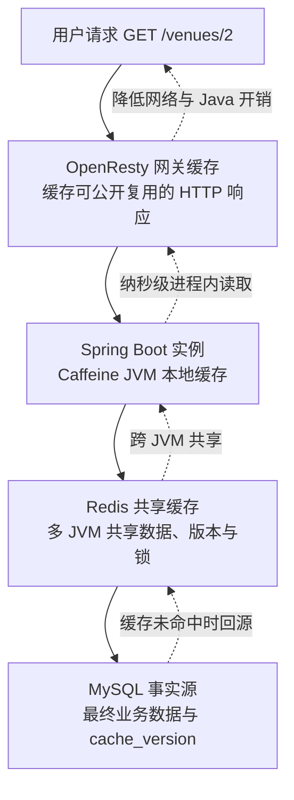

**图解：** OpenResty 网关缓存保存的是 HTTP JSON 正文；Caffeine JVM 本地缓存保存当前 Java 进程里的 Venue 对象；Redis 共享缓存让多个 Java 实例共享缓存、版本水位和重建锁；MySQL 是事实源。后文统一使用这四个名称，避免用编号层级造成歧义。

OpenResty 是带 Lua 能力的 Nginx。在 CityPass 中它位于 Java 服务之前，只有精确的、无查询参数的 `GET /venues/{id}` 才会进入场馆网关缓存协议。OpenResty 是可选部署层；即使直连 8081，Java 内部的 Caffeine、Redis 和 MySQL 读链仍然成立。

**这一章只需要记住：** 这套设计同时处理性能、一致性和故障隔离，评价它时不能只看缓存命中率。

---

<a id="ch-02"></a>

## 第 2 章：先把一次正常查询完整走一遍

### 2.1 从 HTTP 请求走到缓存组件

请求经过 OpenResty 后，如果网关没有命中，就转发给 [`VenueController.queryVenueById()`](./src/main/java/com/citypass/controller/VenueController.java)：

```java
@GetMapping("/{id}")
public Result queryVenueById(@PathVariable("id") Long id,
                             HttpServletResponse response) {
    Result result = venueService.queryById(id);
    if (Boolean.TRUE.equals(result.getSuccess()) && result.getData() instanceof Venue) {
        Long cacheVersion = ((Venue) result.getData()).getCacheVersion();
        if (cacheVersion != null && cacheVersion >= 0) {
            response.setHeader("X-Venue-Cache-Version", String.valueOf(cacheVersion));
            response.setHeader("X-Gateway-Cacheable", "1");
        }
    }
    return result;
}
```

**这段代码在做什么：** Controller 调用业务服务；只有成功返回且数据确实是带合法版本的 `Venue` 时，才向 OpenResty 提供版本和“允许缓存”的内部信号。

**为什么这样做：** 网关不能仅凭 `200` 就缓存任意响应，否则错误结构、私有响应或没有版本的响应可能进入公共缓存。

**如果没有它：** OpenResty 无法判断响应属于哪一代，也就无法拒绝迟到的低版本正文。

**上下游连接：** 上游是 `nginx.conf` 的代理和 `body_filter_by_lua_block`；下游是 `VenueServiceImpl.queryById()`。

[`VenueServiceImpl.queryById()`](./src/main/java/com/citypass/service/impl/VenueServiceImpl.java) 把最终数据库查询作为函数传入缓存服务：

```java
Venue venue = multiLevelCache.queryWithMultiLevel(
        CACHE_VENUE_KEY,
        id,
        Venue.class,
        this::getById,
        CACHE_VENUE_TTL,
        TimeUnit.MINUTES);
```

- `CACHE_VENUE_KEY` 是 `cache:venue:`，与 `id=2` 拼成 `cache:venue:2`；
- `id` 是本次查找的业务主键；
- `Venue.class` 用于把 Redis 中的 JSON 转回 Venue；
- `this::getById` 是 MyBatis-Plus 提供的最终 MySQL 回源函数，只有缓存链决定需要回源时才执行；
- `CACHE_VENUE_TTL=30` 分钟是逻辑过期的基础时长，实际写入还会加随机抖动。

### 2.2 为什么 Redis 不只有 HIT 和 MISS

[`MultiLevelCacheService.queryWithMultiLevel()`](./src/main/java/com/citypass/utils/MultiLevelCacheService.java) 的主干如下：

```java
private enum RedisReadState { HIT, MISS, UNAVAILABLE }

Object cached = venueLocalCache.getIfPresent(cacheKey);
if (cached instanceof LocalEntry) {
    return (R) ((LocalEntry) cached).getData();
}

RedisReadResult redisRead = readRedis(cacheKey);
if (redisRead.state == RedisReadState.HIT) {
    return serveRedisHit(..., redisRead.data);
}
if (redisRead.state == RedisReadState.UNAVAILABLE) {
    return degradedDbFallback(cacheKey, id, dbFallback, "REDIS_UNAVAILABLE");
}
return queryColdMiss(...);
```

**这段代码在做什么：** 先读 Caffeine。未命中时读 Redis，并把结果分成三种状态。

**三种状态不是同义词：**

- `HIT`：Redis 正常返回了缓存内容，接着还要区分正常数据、逻辑过期数据和 null marker；
- `MISS`：Redis 命令成功执行，只是 key 不存在。这是真实冷 MISS，应进入互斥重建；
- `UNAVAILABLE`：Redis 命令抛异常，或者 Failure Gate 正在拒绝调用。这是缓存基础设施故障，应进入有界的数据库降级。

**为什么必须分开：** 把 `MISS` 当故障会因为正常缺失 key 而错误熔断；把 `UNAVAILABLE` 当 `MISS` 又会尝试 Redis 分布式锁，并可能把大量请求无界转到 MySQL。

**上下游连接：** `readRedis()` 产生这三个状态；它们分别连接 `serveRedisHit()`、`queryColdMiss()` 和 `degradedDbFallback()`。

### 2.3 完整入口读链

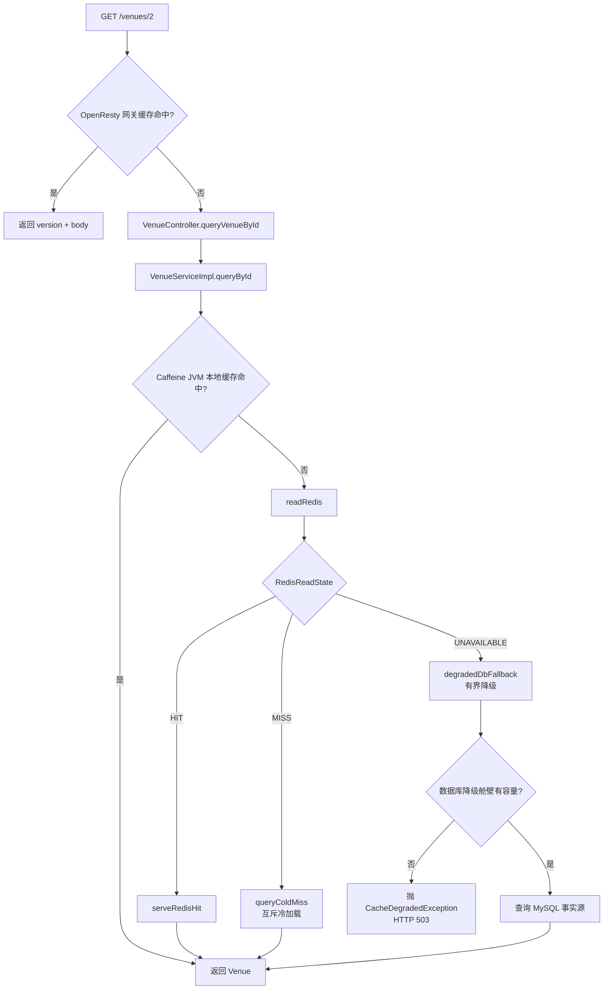

**图解：** 正常命中、真实冷 MISS、缓存基础设施故障从 `readRedis()` 后就进入完全不同的路线。后续章节依次展开 HIT、MISS 和 UNAVAILABLE，避免把所有复杂性同时堆在入口处。

**这一章只需要记住：** `MISS` 说明 Redis 工作正常但没有数据；`UNAVAILABLE` 说明 Redis 路径不可用。两者绝不能用同一个 `catch → 查 DB` 处理。

---

<a id="ch-03"></a>

## 第 3 章：Redis HIT 后到底发生什么

Redis HIT 并不等于“直接把 JSON 返回”。Redis 中保存的 [`RedisData`](./src/main/java/com/citypass/utils/RedisData.java) 是一个包装对象：

```java
public class RedisData {
    private LocalDateTime expireTime;
    private Object data;
    private Long version;
    private Boolean nullValue;
}
```

| 字段 | 含义 |
|---|---|
| `data` | 真正的 Venue 对象；null marker 时可以没有业务对象 |
| `version` | 这份数据的 `cacheVersion` |
| `expireTime` | 逻辑过期时间，决定是否后台刷新 |
| `nullValue` | `true` 表示 MySQL 当时不存在该 ID |

### 3.1 正常数据：回填 Caffeine 后返回

[`serveRedisHit()`](./src/main/java/com/citypass/utils/MultiLevelCacheService.java) 的核心分支是：

```java
if (Boolean.TRUE.equals(redisData.getNullValue())) {
    metrics.nullMarkerHit();
    return null;
}
R data = convert(redisData, type);
if (!isLogicallyExpired(redisData)) {
    venueLocalCache.put(cacheKey,
            new LocalEntry(data, versionOfRedisData(redisData)));
    return data;
}
rebuildAsync(...);
return data;
```

**这段代码在做什么：** null marker 直接返回不存在；正常且未逻辑过期的数据进入 Caffeine；逻辑过期的数据先触发后台重建，再把旧值返回给当前请求。

**为什么把 fresh 数据写 Caffeine：** 同一 JVM 的后续请求不再访问 Redis，进一步降低网络和序列化成本。

**如果没有分支判断：** null marker 可能被当正常对象解析；逻辑过期值也不会触发刷新。

**上下游连接：** 上游是 `queryWithMultiLevel()` 的 `HIT` 分支；逻辑过期分支连接第 4 章的 `rebuildAsync()`。

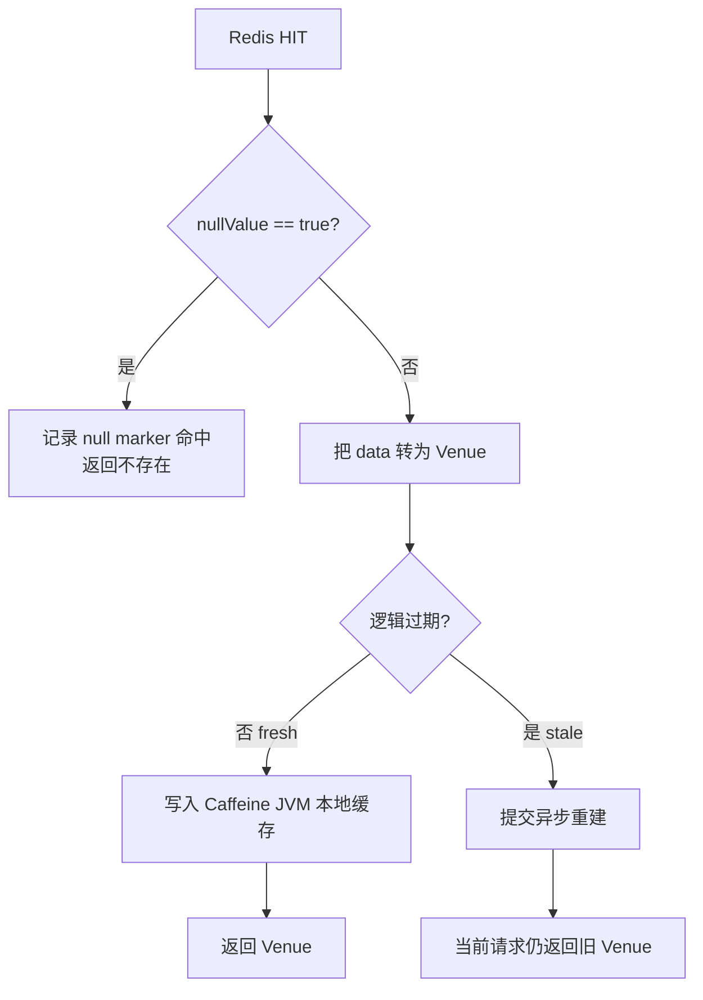

**图解：** HIT 只是说明 Redis key 存在；真正的业务动作还取决于 `nullValue` 与 `expireTime`。

### 3.2 null marker：挡住同一个不存在 ID 的重复穿透

以 `/venues/999999` 为例：

1. 第一次请求 Redis MISS，MySQL 也查不到；`writeNullMarker()` 把 `nullValue=true` 的 `RedisData` 写入 Redis，物理 TTL 为 2 分钟；
2. 第二次请求成为 Redis HIT，看到 null marker 后直接返回“场馆不存在”，不再访问 MySQL。

它解决的是**同一个不存在 ID 被重复查询**。它解决不了攻击者持续更换 `999998、999999、1000000...` 这类随机 ID，因为每个新 ID 第一次仍可能回源。CityPass 在 OpenResty 使用每 IP 的 Venue 读取令牌桶约束这种扫描，详见第 16 章。

当前 `writeNullMarker()` 会先读取版本水位，把水位写进 null marker，但它使用普通 `SET`，没有经过 `write-cache-if-version.lua` 的原子版本比较。这是明确边界，第 20 章会再次说明。

### 3.3 逻辑过期与物理过期不是一回事

逻辑过期（Logical Expiration）是**缓存内容里的一个时间字段到期**。Redis key 仍存在，所以请求还能拿到旧值。CityPass 随后异步刷新，这种“先返回旧值、后台重建”的模式叫 stale-while-revalidate，意为“使用稍旧内容的同时重新验证”。

物理过期是 Redis TTL 真正到期，key 被删除，读取结果成为 MISS。

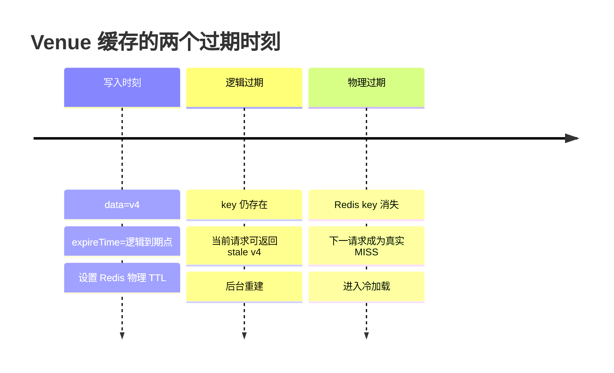

**图解：** 当前源码以 30 分钟为逻辑 TTL 基数，再增加最高约 20% 的随机抖动；物理 TTL 取 `max(逻辑 TTL × 2, 逻辑 TTL + 3600 秒)`。物理 TTL 比逻辑 TTL 长，正是为了给异步刷新保留旧值窗口。

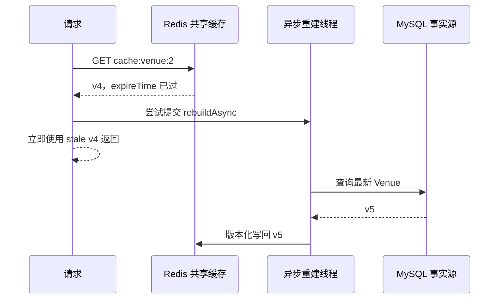

**图解：** stale-while-revalidate 用短暂旧读换取稳定延迟。它适合 Venue 名称、地址等允许短暂陈旧的数据；余额、库存扣减等强约束数据不应照搬这套返回旧值策略。

**这一章只需要记住：** Redis HIT 仍有 fresh、stale、null marker 三条路线；逻辑过期不是 key 消失。

---

<a id="ch-04"></a>

## 第 4 章：逻辑过期后，后台重建为什么不会重复启动

如果 100 个请求同时看到 Venue 2 已逻辑过期，直接提交 100 个后台任务仍会冲击线程池和数据库。当前代码做两层去重：

1. `localRebuilds` 在单个 JVM 内按 key 去重；
2. Redisson `RLock` 在多个 JVM 之间互斥。

[`rebuildAsync()`](./src/main/java/com/citypass/utils/MultiLevelCacheService.java) 的关键结构如下：

```java
if (localRebuilds.putIfAbsent(cacheKey, Boolean.TRUE) != null) return;
rebuildExecutor.submit(() -> {
    RLock lock = null;
    try {
        LockAttempt lockAttempt = tryRebuildLock(lockKey);
        if (lockAttempt.state != LockState.ACQUIRED) return;
        lock = lockAttempt.lock;

        RedisReadResult latest = readRedis(cacheKey);
        if (latest.state == RedisReadState.UNAVAILABLE) return;
        if (latest.state == RedisReadState.HIT && !isLogicallyExpired(latest.data)) {
            serveFreshRedisData(cacheKey, type, latest.data);
            return;
        }
        // 查询 DB，再按版本写回；只有 ACCEPTED 才安装到 Caffeine
        ...
    } finally {
        unlockSafely(lock, lockKey);
        localRebuilds.remove(cacheKey);
    }
});
```

**这段代码在做什么：** 同 JVM 只有第一个请求能把 key 放入 `localRebuilds`；后台线程还要拿跨 JVM 的 Redisson 锁；拿锁后再次检查 Redis，确认没有其他实例已经刷新；最后一定释放锁并移除本地标记。

**为什么需要两层：** 仅有 `localRebuilds` 无法协调两台 Java 实例；仅有分布式锁则每个并发请求都要访问 Redis 竞争锁并提交任务，浪费线程池和网络资源。

**如果 Redis 故障：** 逻辑过期请求已经把 stale 数据返回给用户，后台任务看到 `UNAVAILABLE` 后直接停止，不在故障期间额外压 MySQL。

**上下游连接：** `serveRedisHit()` 触发它；内部调用 `tryRebuildLock()`、`readRedis()`、数据库回源和 `writeWithLogicalExpire()`。

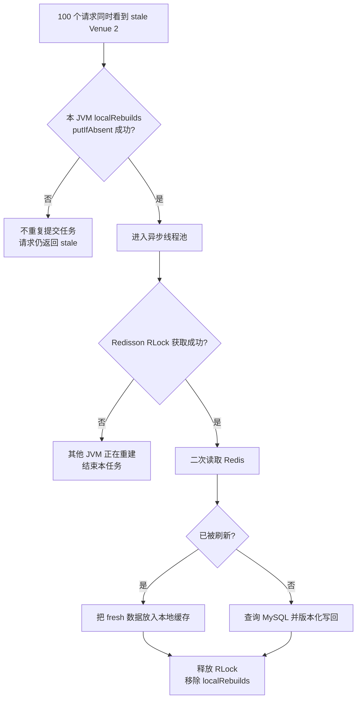

**图解：** `localRebuilds` 解决单 JVM 的重复任务，Redisson 锁解决多 JVM 的重复重建。源码目标是正常情况下减少重复回源，并不等同于承诺任何故障下都只会有一个线程执行。

**这一章只需要记住：** 单 JVM 去重和跨 JVM 互斥解决的是两个不同范围的问题。

---

# 补充这部分的流程图
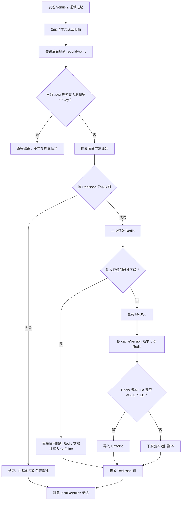


<a id="ch-05"></a>

## 第 5 章：真正 Redis MISS——Redisson 看门狗续租与二次检查

冷 MISS 表示 Redis 正常工作，但 `cache:venue:2` 不存在。当前主链进入 [`queryColdMiss()`](./src/main/java/com/citypass/utils/MultiLevelCacheService.java)：

```java
LockAttempt lockAttempt = tryRebuildLock(lockKey);
if (lockAttempt.state == LockState.UNAVAILABLE) {
    return degradedDbFallback(..., "REDIS_LOCK_UNAVAILABLE");
}
if (lockAttempt.state == LockState.ACQUIRED) {
    try {
        RedisReadResult doubleChecked = readRedis(cacheKey);
        if (doubleChecked.state == RedisReadState.HIT
                && !isLogicallyExpired(doubleChecked.data)) {
            return serveFreshRedisData(cacheKey, type, doubleChecked.data);
        }
        return normalRebuild(cacheKey, id, dbFallback, ttl, unit);
    } finally {
        unlockSafely(lockAttempt.lock, lockKey);
    }
}
```

**这段代码在做什么：** 先尝试获取重建锁；成功后重新读取 Redis；只有第二次仍需重建时才查 MySQL。锁忙的请求会短暂随机等待后再读 Redis，超过有限轮次才进入受限降级。

**为什么拿锁后必须二次检查：** A、B 同时第一次 MISS，B 先拿锁并写好缓存；A 之后拿到锁。如果 A 不再检查，就会重复查数据库并重复回填。

**如果锁服务本身不可用：** 这不是普通“锁忙”，而是 `LockState.UNAVAILABLE`，因此进入故障降级链。

**上下游连接：** 上游是 `queryWithMultiLevel()` 的 `MISS`；成功重建连接 `normalRebuild()`，Redis 故障或等待耗尽连接 `degradedDbFallback()`。

### 5.1 当前真实锁与看门狗续租

看门狗续租（Watchdog Renewal）是 Redisson 在持锁客户端仍存活时，周期性延长锁过期时间的机制。当前代码没有给 `tryLock()` 传固定 lease time：

```java
RLock lock = redissonClient.getLock(key);
boolean acquired = lock.tryLock();
...
if (lock.isHeldByCurrentThread()) lock.unlock();
```

这使 Redisson 的 Watchdog 参与续租。它解决的是：数据库查询或重建超过旧固定 10 秒时，锁不能因为租期先到而让第二个正常重建者提前进入。进程消失后，锁仍会依赖 Redisson 的租约机制最终过期，不会永久保留。

`LOCK_VENUE_KEY + UUID token + unlock.lua` 仍存在于仓库的通用 `CacheClient`/基线路径中，可用来理解“只能由所有者释放字符串锁”。**它不是当前 Venue 多级缓存主重建链的核心锁实现。** 主链使用的是 `LOCK_VENUE_REBUILD_KEY`、Redisson `RLock`、Watchdog，以及 `isHeldByCurrentThread()` 后再 `unlock()`。

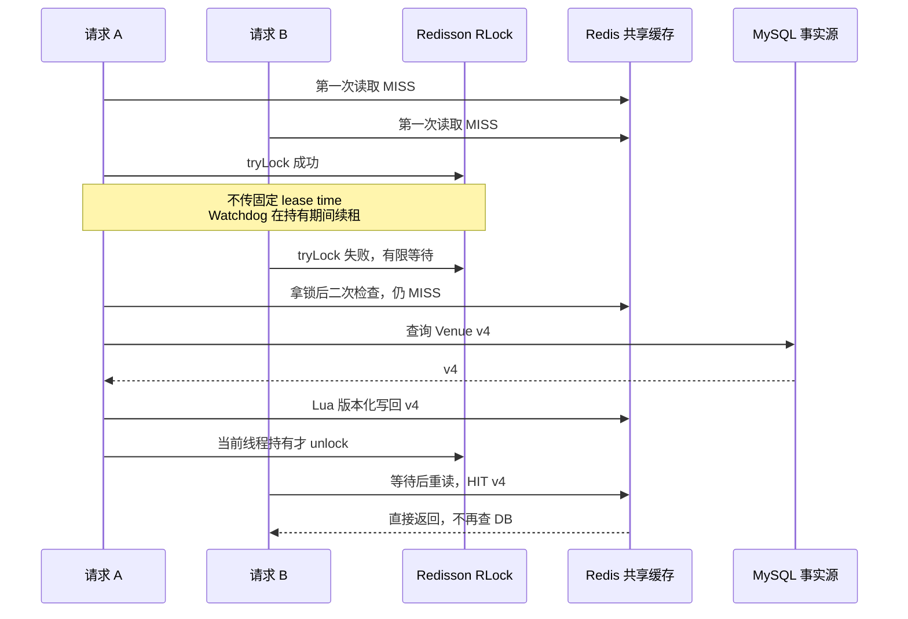

**图解：** Watchdog 防止固定租期早于正常重建结束，二次检查防止后来拿锁者重复回源。锁只控制“谁重建”，不能判断“重建结果是否仍是最新”，所以第 6～8 章还需要版本治理。

**这一章只需要记住：** 当前 Venue 主链是 Redisson Watchdog 锁；锁与版本控制解决的问题不同。

---

<a id="ch-06"></a>

## 第 6 章：为什么还需要 `cacheVersion`

分布式锁能约束同一个 key 的正常重建者，却不能证明查询结果在写回时仍然最新。看下面的交错：

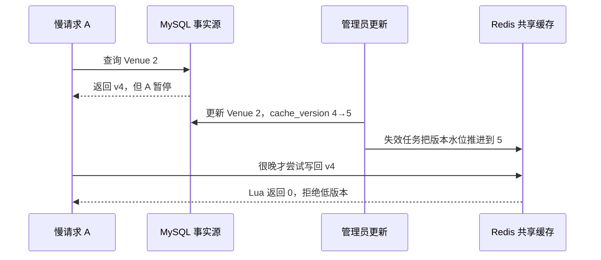

**图解：** A 曾经合法查询数据库，甚至可能合法持有过重建锁，但它拿到的 v4 在管理员提交 v5 后已经过时。Watchdog 只能保护锁的持有期，无法把 v4 自动变成 v5。

[`Venue`](./src/main/java/com/citypass/entity/Venue.java) 中的 `cacheVersion` 对应数据库 `tb_venue.cache_version`：

```java
@TableField(updateStrategy = FieldStrategy.NEVER)
private Long cacheVersion;
```

[`VenueMapper.incrementCacheVersion()`](./src/main/java/com/citypass/mapper/VenueMapper.java) 负责递增：

```java
@Update("UPDATE tb_venue " +
        "SET cache_version=cache_version+1 WHERE id=#{id}")
int incrementCacheVersion(@Param("id") Long id);
```

**这段代码在做什么：** 每次统一 Venue 更新链都会在数据库中把数据代次加一。`FieldStrategy.NEVER` 避免客户端提交的 Venue 对象通过普通 `updateById()` 覆盖服务端版本。

**为什么不用时间戳：** 这里需要的是同一行的单调代次，不依赖不同机器的时钟是否完全同步。

**如果没有版本：** 失效只能删除“当前缓存”，不能识别删除之后迟到的旧回填。

**上下游连接：** `VenueServiceImpl.update()` 在事务中递增并读取新版本；Redis Lua 和 OpenResty Lua 都用这个版本做比较。

**这一章只需要记住：** 锁决定谁能重建，`cacheVersion` 决定重建结果属于哪一代。

---

<a id="ch-07"></a>

## 第 7 章：Redis 版本水位到底是什么

版本水位（Version Watermark）可以先用一句话理解：**Redis 已知的最低可接受版本线。**

若 Venue 2 的水位是 5：

- v1～v4 低于水位，拒绝；
- v5 等于水位，可以幂等重放；
- v6 高于水位，可以写入并把水位推进到 6。

Redis 有两个不同职责的 key：

| Key | 保存内容 | 删除策略 |
|---|---|---|
| `cache:venue:2` | 现在缓存的 `RedisData` | Venue 更新时删除 |
| `cache:venue:version:2` | 至少已经见过的版本 | 更新时保留并单调推进 |

主缓存回答“现在存了什么”；版本水位回答“最低还能接受哪一代”。如果删除主缓存时也删除水位，v4 慢请求会在失效后失去拒写依据。

[`write-cache-if-version.lua`](./src/main/resources/write-cache-if-version.lua) 把比较和写入放在同一条 Redis 命令中：

```lua
local current = tonumber(redis.call('get', KEYS[2]) or '0')
local expected = tonumber(ARGV[1])
if expected < current then
    return 0
end
redis.call('set', KEYS[2], expected)
redis.call('set', KEYS[1], ARGV[2], 'EX', ARGV[3])
return 1
```

逐行理解：

1. `current` 读取现有水位，没有水位时按 0 处理；
2. `expected` 是本次回填数据的 `cacheVersion`；
3. `expected < current` 说明结果已经落后，返回 `0`，既不降低水位，也不写主缓存；
4. 相同版本允许写入，支持超时重试或任务重放；
5. 更高版本既写主缓存，也推进水位；
6. 返回 `1` 表示这次版本化写入被接受。

**为什么必须用 Lua：** 如果 Java 先 `GET version`、再判断、再 `SET cache`，更新任务可能插在检查和写入之间，形成 check-then-act 竞态。Redis 在单线程执行一段 Lua，能让“比较水位 + 更新水位 + 写主缓存”相对于其他 Redis 命令原子完成。

**它和上下游怎样连接：** `writeWithLogicalExpire()` 传入数据版本、JSON 和物理 TTL；脚本返回值再转成 `WriteState.ACCEPTED` 或 `STALE_REJECTED`，交给第 8 章的 Caffeine 决策。

**这一章只需要记住：** 删除数据 key 不等于忘记历史；版本 key 正是失效之后继续拒旧的记忆。

---

<a id="ch-08"></a>

## 第 8 章：Redis 拒旧以后，Caffeine 如何避免安装旧副本

只让 Redis 拒绝 v4 还不够。如果 Java 无视 Lua 返回值，仍把 v4 放进 Caffeine，同一 JVM 还是会继续返回旧对象。当前 [`normalRebuild()`](./src/main/java/com/citypass/utils/MultiLevelCacheService.java) 已把 Redis 写入结果传递给本地缓存决策：

```java
R result = dbFallback.apply(id);
if (result == null) {
    writeNullMarker(cacheKey, id);
    return null;
}
WriteState state = writeWithLogicalExpire(
        cacheKey, id, result, ttl, unit);
if (state == WriteState.ACCEPTED) {
    venueLocalCache.put(cacheKey,
            new LocalEntry(result, versionOf(result)));
} else {
    venueLocalCache.invalidate(cacheKey);
}
return result;
```

**这段代码在做什么：** MySQL 返回非空数据后先尝试版本化写 Redis。只有 Lua 接受时，结果才进入 Caffeine；低版本被拒或 Redis 不可用时，当前 key 的本地副本被清理。

**为什么这样做：** Redis 水位是多 JVM 共享的版本裁判。Caffeine 安装动作必须尊重这个裁判的结果，否则会出现“Redis 正确拒旧，本地却保存旧值”。

**如果 Redis 不可用：** 正常重建写入得到 `UNAVAILABLE`，不会在这里安装本地副本。故障降级读取是另一条路径，第 13 章会说明它的边界。

**上下游连接：** 上游是冷 MISS 或异步重建的 MySQL 结果；下游是同 JVM 后续读取。

这里仍不能说“Caffeine 永远没有旧值”。原因至少有两个：

1. Redis Lua 返回 `ACCEPTED` 与随后执行 Caffeine `put` 不是跨系统原子操作，两个动作之间仍可能穿插更新；
2. 普通 fresh Redis HIT 进入 Caffeine 时没有再次用本地版本栅栏比较更新事件。

因此准确表述是：**低版本 Redis 回填会被版本 Lua 拒绝，正常重建只有被 Redis 接受后才安装 Caffeine；系统仍允许短暂旧读并依靠失效事件、TTL 和后续访问推动收敛。**

**这一章只需要记住：** Redis 的拒写结果必须影响本地缓存，而不是只在日志里记录。

---

<a id="ch-09"></a>

## 第 9 章：Venue 更新时为什么不能简单 `update DB → DEL Redis`

先看三个直觉方案的缺口：

- `update MySQL → DEL Redis`：数据库提交后、删除缓存前进程崩溃，旧缓存会继续存在；
- `DEL Redis → update MySQL`：并发读可能在数据库提交前读到旧值，并把旧值回填；
- 把 Redis 删除写进 `@Transactional`：Spring 的普通 MySQL 本地事务不能让 Redis 命令随数据库一起原子提交或回滚。

CityPass 使用事务发件箱思想（Transactional Outbox）：业务数据和“以后必须执行的副作用意图”先写进同一个 MySQL 事务。事务成功，两者都存在；事务回滚，两者都不存在。项目中的具体载体是 `tb_reliable_task`。

[`VenueServiceImpl.update()`](./src/main/java/com/citypass/service/impl/VenueServiceImpl.java) 的关键代码是：

```java
@Transactional
public Result update(Venue venue) {
    Long id = venue.getId();
    if (id == null) return Result.fail("场馆id不能为空");

    searchRebuildStateRepository.assertWritesAllowed();
    if (!updateById(venue)) {
        return Result.fail("场馆不存在或更新失败");
    }
    if (getBaseMapper().incrementCacheVersion(id) != 1) {
        throw new IllegalStateException("场馆缓存版本更新失败");
    }
    Venue refreshed = getById(id);
    reliableTaskRepository.enqueue(
            ReliableTaskRepository.INVALIDATE_VENUE_CACHE,
            "invalidate-venue-cache:" + id + ":" + refreshed.getCacheVersion(),
            JSONUtil.toJsonStr(new VenueCacheInvalidation(
                    id, refreshed.getCacheVersion())));
    activitySearchOutboxService.bumpVenueDocumentsAndEnqueue(id);
    return Result.ok();
}
```

**这段代码在做什么：** 同一个 MySQL 事务先校验搜索重建期间是否允许写入，再更新 Venue、递增 `cache_version`、重读事务内的新行、登记缓存失效任务，并推进受场馆信息影响的搜索文档版本与索引任务。

**为什么必须同事务：** 若 Venue 提交而失效任务没有落库，系统没有可靠的重试依据；若任务落库而 Venue 回滚，又会传播不存在的版本。唯一业务键 `invalidate-venue-cache:{id}:{version}` 还让同一版本的入队具备去重基础。

**如果后续 Redis 或网关暂时失败：** 业务事务已经保存了失效意图，后台任务可以重试，不要求 HTTP 更新线程同时完成所有跨系统操作。

**上下游连接：** 上游是 `PUT /venues`；下游是 `ReliableTaskScheduler` 和搜索索引 Outbox。本文只展开缓存失效任务。

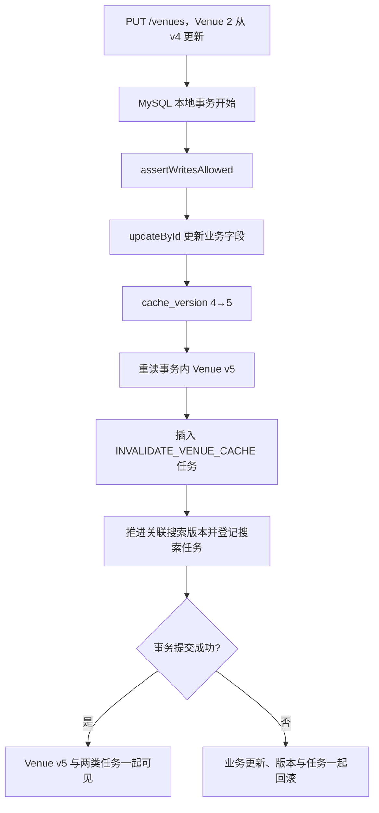

**图解：** Outbox 不把 MySQL 与 Redis 变成一个分布式事务；它先保证“事实”和“待办”不分家，再由后台执行器推动跨存储最终收敛。

**这一章只需要记住：** 可靠性的起点不是更努力地 `DEL`，而是先可靠记录“必须失效”这件事。

---

<a id="ch-10"></a>

## 第 10 章：ReliableTask 怎样真正把缓存失效传播出去

[`ReliableTaskScheduler`](./src/main/java/com/citypass/task/ReliableTaskScheduler.java) 定时领取到 `INVALIDATE_VENUE_CACHE` 后，反序列化任务并调用 `VenueCacheInvalidator.evict()`：

```java
} else if (ReliableTaskRepository.INVALIDATE_VENUE_CACHE
        .equals(task.getTaskType())) {
    VenueCacheInvalidation invalidation = JSONUtil.toBean(
            task.getPayload(), VenueCacheInvalidation.class);
    venueCacheInvalidator.evict(
            invalidation.getVenueId(),
            invalidation.getCacheVersion());
}
if (!repository.markDone(task)) {
    return; // 执行结束时已经丢失租约，不越权改状态
}
```

可靠任务采用 `PENDING → RUNNING → DONE / DEAD` 状态流转。`ReliableTaskRepository.claimReady()` 用任务级 `FOR UPDATE SKIP LOCKED`、`locked_by`、`lease_until` 和 `version` 让多个实例并行领取不同任务；失败时指数退避，最大延迟封顶 300 秒，当前默认最多重试 12 次。租约过期的 `RUNNING` 任务可被重新领取；达到上限进入 `DEAD`，管理员可调用重放逻辑把它恢复为 `PENDING`。

### 10.1 Redis 里的失效动作为什么也是 Lua

[`invalidate-venue-cache.lua`](./src/main/resources/invalidate-venue-cache.lua) 执行四件事：

```lua
local current = tonumber(redis.call('get', KEYS[3]) or '0')
local requested = tonumber(ARGV[3])
local version = requested
if current > requested then
    version = current
end
redis.call('set', KEYS[3], version)
redis.call('del', KEYS[1])
redis.call('del', KEYS[2])
redis.call('publish', ARGV[1], ARGV[2] .. ':' .. version)
return version
```

**这段代码在做什么：** 水位取 `max(current, requested)`，删除主缓存和基线缓存，并向 `cache:venue:invalidate` 发布 `venueId:version`。

**为什么取最大值：** 假设 v6 任务先执行、v5 任务因为重试后执行，水位不能从 6 倒退到 5。旧任务可以安全重放，但不能降低系统已知版本。

**为什么发布 Pub/Sub：** Caffeine 属于每个 JVM 的进程内内存，执行任务的实例无法直接删除其他 JVM 的副本。

Pub/Sub 是发布/订阅：发布者向频道发送消息，当前在线且连接正常的订阅者会收到。`RedisPubSubConfig` 让每个 Java 实例订阅失效频道；`VenueCacheInvalidator.onMessage()` 解析 ID 后删除本机 Caffeine。它是在线广播，不保存离线消息，也没有逐 JVM 的持久 ACK。

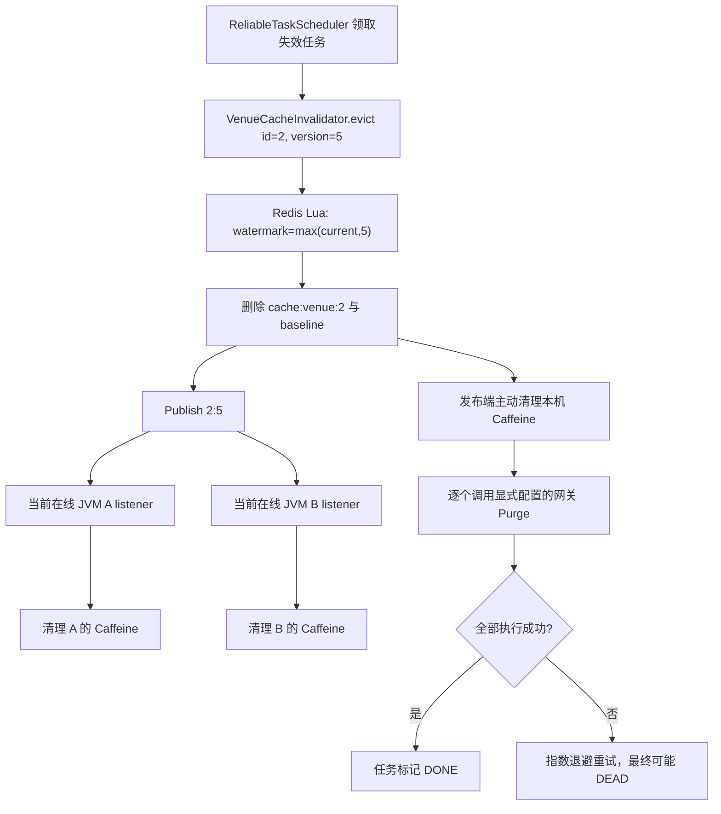

**图解：** Redis 数据、水位、广播和网关清理组成一次 handler 执行。任一显式网关失败都会使 handler 失败并由 ReliableTask 重试；Pub/Sub 接收本身没有逐实例确认。

### 10.2 Outbox、Pub/Sub 与 Canal 各管什么

| 机制 | 在当前项目中的职责 | 可靠性边界 |
|---|---|---|
| ReliableTask / Outbox | 把 Venue 更新与缓存失效意图同事务落库，并可重试 | 可靠保存“要做什么”；不直接提供跨系统原子提交 |
| Redis Pub/Sub | 通知在线 JVM 清 Caffeine | 低延迟在线广播；离线无补发、无逐 JVM ACK |
| Canal | 可选监听数据库 binlog，覆盖绕开应用服务的变更 | `CANAL_ENABLED` 默认 `false`；不是当前正常 `PUT` 主链的必要组件 |

它们不在同一层，不能用“已经有 Pub/Sub，所以不需要 Outbox”或“有 Canal 就自动强一致”来概括。

**这一章只需要记住：** Outbox 保存意图，调度器重试执行，Pub/Sub 清理在线 JVM；三者不能互相替代。

---

<a id="ch-11"></a>

## 第 11 章：为什么 OpenResty 现在也需要版本水位

OpenResty 网关缓存保存的是完整 HTTP 正文。如果它只按 ID 删除缓存，仍会发生网关层的旧值复活：请求 A 在 purge 前已经向 Java 发出请求，Java 返回 v4 很慢；管理员随后提交 v5 并 purge；A 的 v4 响应最后到达，`body_filter` 又把它存回网关。

当前 [`venue_cache.lua`](./src/main/resources/openresty/lua/venue_cache.lua) 同时维护：

- `venue_cache`：缓存项格式为 `version + 换行 + body`；
- `venue_cache_version`：网关侧的版本水位共享字典；
- `resty.lock`：让同一 Venue 的 `lookup/store/purge` 对共享字典的复合操作互斥。

三个方法各有一个清晰职责：

```lua
-- lookup：已有缓存低于水位就删除并当 MISS
if entry_version < watermark then
    cache:delete(entry_key(id))
    return nil, nil, "STALE"
end

-- store：迟到响应低于水位就拒绝
if version < watermark then
    return false, "stale version"
end

-- purge：水位只能向前
local next_version = math.max(current, committed_version)
```

**这段代码在做什么：** `lookup()` 防止读取已知过时项；`store()` 防止迟到响应重新填入；`purge()` 接收 Java 传来的已提交版本并单调推进水位。

**为什么缓存项也带版本：** 只有正文而没有版本，就无法与水位比较，也无法判断当前项是否应该被删除。

**如果没有 `store()` 的检查：** 即使 purge 成功，早先发出的慢请求仍能在响应阶段复活 v4。

**上下游连接：** `nginx.conf` 的 access 阶段调用 `lookup()`，body filter 调用 `store()`，内部 `DELETE /internal/cache/venue?id=2&version=5` 调用 `purge()`。

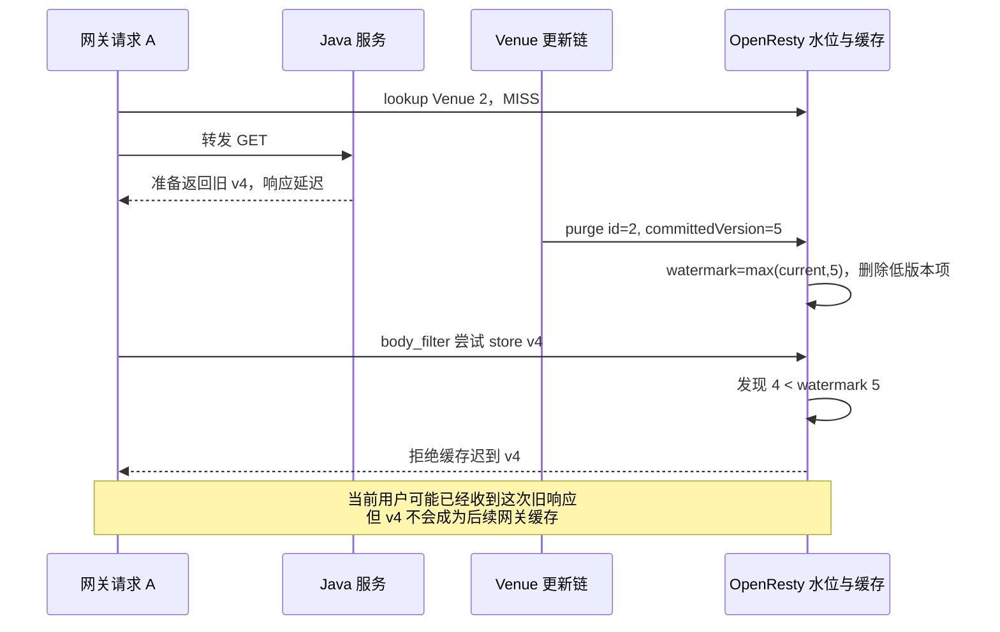

**图解：** 网关版本水位防的是“迟到 HTTP 响应复活”。它不会让已经在途的当前请求自动改成 v5，所以系统仍可能短暂旧读，但后续网关命中不会由这次 v4 污染。

### 11.1 哪些响应才允许进入网关缓存

`nginx.conf` 只缓存无 query string 的精确 `GET /venues/{id}`，并要求：

- 上游状态为 200；
- Java 返回内部头 `X-Gateway-Cacheable: 1` 和合法 `X-Venue-Cache-Version`；
- 没有 `Set-Cookie`，`Cache-Control` 不含 `private/no-store`；
- 内容类型包含 `application/json`；
- 正文不超过 1 MiB。

网关会移除内部 `X-Gateway-Cacheable`，不把信任信号暴露给客户端。当前公开详情读在 `LoginInterceptor` 中与网关语义对齐；若未来响应加入用户私有字段，这套公共正文缓存协议必须重新审视。

网关缓存基础 TTL 是 600 秒并带 ±60 秒抖动。`venue_cache_version` 使用 `safe_set`；字典容量不足时显式失败，而不是靠 LRU 悄悄淘汰版本水位。但共享字典仍是 OpenResty 实例内存，进程重启后不会像数据库那样持久保存，详见第 20 章。

**这一章只需要记住：** Redis 水位保护 Java 对象回填，OpenResty 水位保护 HTTP 正文回填；两个层次都需要版本判断。

---

<a id="ch-12"></a>

## 第 12 章：多网关 Purge 为什么也要可靠任务重试

配置项 `gateway-cache.purge-urls` 可以列出多个显式 OpenResty endpoint，旧的单地址 `purge-url` 会合并并去重。[`VenueCacheInvalidator.purgeGateways()`](./src/main/java/com/citypass/utils/VenueCacheInvalidator.java) 对每个地址调用：

```text
DELETE /internal/cache/venue?id={venueId}&version={committedVersion}
```

其关键行为不是“遇到第一个失败立即停”，而是尝试全部配置地址、收集失败项，最后只要有一个失败就抛异常：

```java
for (String endpoint : endpoints) {
    try {
        restTemplate.exchange(uri, HttpMethod.DELETE, null, Void.class);
    } catch (Exception e) {
        failedEndpoints.add(endpoint);
    }
}
if (!failedEndpoints.isEmpty()) {
    throw new IllegalStateException(
            "OpenResty 场馆缓存驱逐失败: ... endpoints=" + failedEndpoints);
}
```

**这段代码在做什么：** A 成功、B 失败、C 成功时，A 和 C 不因 B 被跳过，但整次 handler 仍失败，任务不能标记 `DONE`。

**为什么可以重试已成功节点：** 网关 `purge()` 用 `max(current, committedVersion)`，相同或更低版本重放不会让水位倒退。

**如果把部分成功当整体成功：** 失败节点可能长期保留旧正文，而 Outbox 已失去重试机会。

**上下游连接：** `VenueCacheInvalidator.evict()` 在 Redis 失效和本机清理后调用它；异常被 `ReliableTaskScheduler` 捕获并转成 `PENDING` 重试或最终 `DEAD`。

当前连接超时为 1 秒、读取超时为 2 秒。任务 `DONE` 能证明这一次执行中：

1. Redis 版本化失效脚本成功；
2. 发布端 JVM 已主动清理本地 Caffeine；
3. 所有**显式配置**的网关 purge HTTP 调用都返回成功。

它不能证明所有在线 JVM 都独立 ACK 了 Pub/Sub，也不能证明动态拓扑中没有漏配的网关。当前实现是静态 endpoint 列表，不是服务发现和逐节点确认协议。

**这一章只需要记住：** 多网关只要一个显式节点失败，可靠任务就继续重试；`DONE` 的证明范围必须说准确。

---

<a id="ch-13"></a>

## 第 13 章：Redis 挂了以后为什么不能所有请求直接查 MySQL

最危险的降级写法看起来很自然：

```java
try {
    return redis();
} catch (Exception e) {
    return mysql();
}
```

当 Redis 整体故障时，原本由 Redis 承担的并发会同时转移到 MySQL。Redis 的保护消失后，数据库连接池和线程池又被占满，缓存故障就可能扩大成应用与数据库的级联故障。

当前读链先查 Caffeine，所以 Redis 故障时已有本地热数据仍能服务。只有 Caffeine MISS 后，`readRedis()` 才可能产生 `UNAVAILABLE`：

```java
RedisFailureGate.Permission permission = redisFailureGate.tryAcquire();
if (permission == RedisFailureGate.Permission.REJECTED) {
    metrics.redisBypassed();
    return new RedisReadResult(RedisReadState.UNAVAILABLE, null);
}
try {
    String json = stringRedisTemplate.opsForValue().get(key);
    redisFailureGate.onSuccess(permission);
    if (StrUtil.isBlank(json)) {
        return new RedisReadResult(RedisReadState.MISS, null);
    }
    return new RedisReadResult(RedisReadState.HIT,
            JSONUtil.toBean(json, RedisData.class));
} catch (RuntimeException e) {
    recordRedisFailure(permission, "cache read", key, e);
    return new RedisReadResult(RedisReadState.UNAVAILABLE, null);
}
```

**这段代码在做什么：** Redis 命令成功但无值时返回 `MISS` 并报告成功；命令异常或 Gate 拒绝访问时返回 `UNAVAILABLE`。

**为什么普通 MISS 也调用 `onSuccess`：** MISS 证明 Redis 服务正常响应。若把它记作 failure，不存在的业务 ID 就会错误打开 Failure Gate。

**如果得到 UNAVAILABLE：** 主入口不再走依赖 Redis 的分布式锁，而是进入 `degradedDbFallback()`，由数据库降级舱壁决定是否允许回源。

**上下游连接：** `readRedis()` 被主读链、冷 MISS 二次检查和异步重建共同使用；异常会影响下一章的 Failure Gate。

这是一种**有界、有损降级**：有容量时查 MySQL，没容量时明确返回 503。它保住的是整体系统生存边界，而不是宣称 Redis 故障无损。

**这一章只需要记住：** Redis 故障时，Caffeine 热数据继续服务；冷请求只能进入受控降级通道。

---

<a id="ch-14"></a>

## 第 14 章：RedisFailureGate——为什么要 CLOSED / OPEN / HALF_OPEN

Failure Gate 可以理解为 Redis 调用前的一扇门。它的作用是：已知 Redis 持续失败时，短时间内少做无意义的网络超时；冷却后再用一个探测请求判断是否恢复。

[`RedisFailureGate`](./src/main/java/com/citypass/utils/RedisFailureGate.java) 有三个状态：

- `CLOSED`：门关闭于“旁路”，正常允许 Redis 调用；连续失败数达到阈值后转为 `OPEN`；
- `OPEN`：暂时拒绝普通 Redis 调用，直接返回 `REJECTED`；
- `HALF_OPEN`：冷却期结束后只放行一个 `PROBE`。探测成功回到 `CLOSED`，失败则重新 `OPEN`。

关键代码如下：

```java
public synchronized Permission tryAcquire() {
    if (state == State.CLOSED) return Permission.NORMAL;
    if (state == State.OPEN && nanoTime.getAsLong() >= reopenAtNanos) {
        state = State.HALF_OPEN;
        return Permission.PROBE;
    }
    return Permission.REJECTED;
}

public synchronized void onFailure(Permission permission) {
    if (permission == Permission.PROBE) {
        open();
    } else if (state == State.CLOSED
            && ++consecutiveFailures >= failureThreshold) {
        open();
    }
}
```

**这段代码在做什么：** `synchronized` 保护 JVM 内的状态变化；到达恢复时间时只有首先进入的方法拿到 `PROBE`，其他请求在半开状态仍被拒绝。

**为什么需要 HALF_OPEN：** OPEN 结束后若瞬间放行全部请求，尚未恢复的 Redis 会立刻再次承受洪峰；单个探测能降低这种风险。

**如果探测成功：** `onSuccess(PROBE)` 清零连续失败并回到 `CLOSED`。普通 Redis HIT 和 MISS 都属于成功响应。

当前默认值来自 `cache.reliability`：连续 3 次失败后 OPEN，持续 3000 ms 后允许探测。它们只是项目默认配置，需要根据生产超时、流量和 Redis 恢复特征调优，不能硬说成通用最佳值。

**这一章只需要记住：** Failure Gate 减少故障期间的 Redis 调用；正常 MISS 不会触发它。

---

<a id="ch-15"></a>

## 第 15 章：数据库降级舱壁——为什么宁可 503，也不能无限查数据库

舱壁隔离（Bulkhead）来自船舱隔板：一个舱进水时，隔板限制故障扩散。在 CityPass 中，Redis 故障不能无限占用 MySQL 连接与应用线程。

[`degradedDbFallback()`](./src/main/java/com/citypass/utils/MultiLevelCacheService.java) 使用每个 JVM 一个非公平 `Semaphore`：

```java
if (!dbFallbackBulkhead.tryAcquire()) {
    metrics.dbFallbackRejected();
    throw new CacheDegradedException(
            "缓存服务暂时不可用，请稍后重试");
}
metrics.dbFallbackAccepted();
try {
    R result = dbFallback.apply(id);
    if (result != null) {
        venueLocalCache.put(cacheKey,
                new LocalEntry(result, versionOf(result)));
    }
    return result;
} finally {
    dbFallbackBulkhead.release();
}
```

**这段代码在做什么：** `tryAcquire()` 不排队。拿到许可的请求可以查询 MySQL，并把非空结果临时放入本 JVM 的 Caffeine；拿不到许可就抛 `CacheDegradedException`，由 `WebExceptionAdvice` 映射为 HTTP 503。

**为什么不等待许可：** 大量请求在应用中排队会占住工作线程并放大尾延迟，客户端也无法快速退避。

**当前边界：** 故障降级查询无法读取 Redis 共享版本水位，却会把数据库结果放进本地 Caffeine。若它与并发更新交错，存在短暂本地旧值窗口；这正是“有损降级”的一部分。

Failure Gate 与 DB Bulkhead 不是同一个东西：前者减少无意义的 Redis 调用，后者限制允许落到 MySQL 的降级并发。

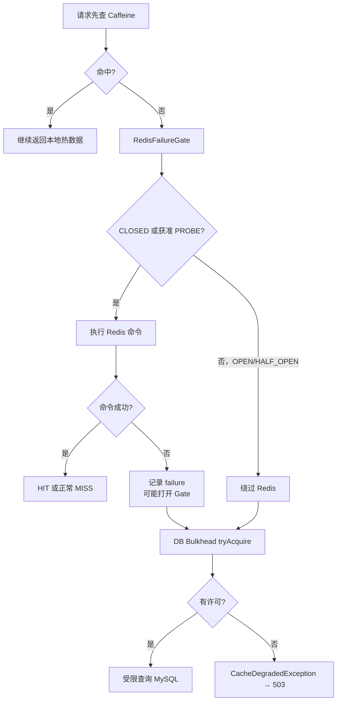

**图解：** Redis outage 先由 Failure Gate 降低超时调用，再由 DB Bulkhead 限制数据库降级并发。两道边界共同避免把缓存故障无界转移到 MySQL。

当前每 JVM 默认 DB 降级并发上限为 8。实例数量增加时，总降级上限也随实例数增加，因此生产还需要结合数据库全局容量、实例规模和入口限流配置。

**这一章只需要记住：** 503 是主动过载保护信号，比让所有请求拖垮数据库更可控。

---

<a id="ch-16"></a>

## 第 16 章：缓存穿透、击穿、雪崩，在当前项目分别怎么处理

到这里再归纳常见术语，会比开篇背定义更容易理解。

| 问题 | 含义 | CityPass 当前处理 |
|---|---|---|
| 缓存穿透 | 查询本来就不存在的数据，每次都可能落到 DB | 同一不存在 ID 用 2 分钟 null marker；大量随机 ID 用 OpenResty 每 IP Venue 读取令牌桶 |
| 缓存击穿 | 一个热点 key 缺失或过期，大量请求同时回源 | 冷 MISS 使用 Redisson Watchdog 锁、二次检查和有限等待；逻辑过期采用 stale-while-revalidate，并做 JVM 内与跨 JVM 去重 |
| 缓存雪崩 | 大量 key 在相近时刻一起失效 | Redis 逻辑 TTL 加最高约 20% 抖动；OpenResty 600 秒 TTL 加 ±60 秒抖动 |
| Redis 整体故障 | 缓存服务不可用，所有 key 都可能受影响 | Failure Gate 降低 Redis 调用，DB Bulkhead 限制降级回源，容量不足返回 503 |

### 16.1 为什么 null marker 挡不住随机 ID

每个全新随机 ID 第一次都没有 null marker，所以仍可能穿透到数据库。OpenResty 的 [`token_bucket.lua`](./src/main/resources/openresty/lua/token_bucket.lua) 对 `venue-read:{客户端 IP}` 做令牌桶限流；默认速率 60 次/秒、突发容量 120，拒绝时返回 429 和 `X-RateLimit-Layer: gateway-venue-read`。

令牌桶允许一定突发，再按速率补充令牌。Lua 使用独立共享字典和 `resty.lock` 保护同一桶的复合更新；获取锁或脚本异常时采用拒绝策略，避免限流基础设施故障时放大扫描。

当前没有 Bloom Filter。原因不是 Bloom Filter 没价值，而是现有实现已用 null marker 处理重复不存在 ID、用网关限流约束随机扫描；引入 Bloom Filter还要解决新增 Venue 同步、误判率、重建和内存成本。若真实流量显示随机 ID 穿透仍是主要瓶颈，再根据数据规模加入更合理。

### 16.2 抖动与 Redis outage 必须区分

TTL 抖动处理的是“大量 key 在相近时刻到期”；它无法修复 Redis 节点整体不可用。Failure Gate 与 DB Bulkhead 处理的是“Redis 调用失败后的流量转移”。面试中把二者混为一谈，会暴露只背过名词而没有理解故障模型。

**这一章只需要记住：** 每个机制只解决特定流量形态，没有一个“缓存三件套”能覆盖所有故障。

---

<a id="ch-17"></a>

## 第 17 章：完整读链总图

下面这张图把 `GET /venues/2` 的所有分支收在一起，可用于面试前一分钟复习。

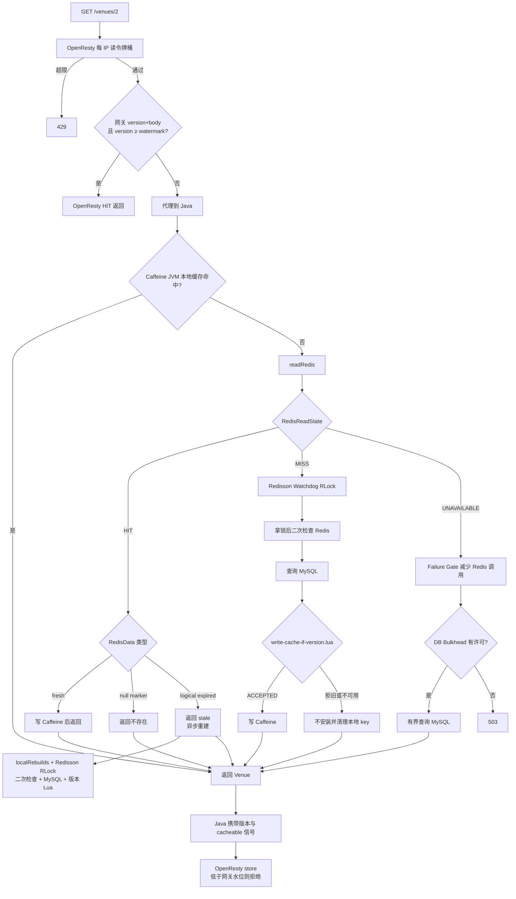

**图解：** OpenResty 先限制随机扫描并校验网关版本；Java 先读 Caffeine，再把 Redis 结果精确分成 HIT、MISS、UNAVAILABLE。正常重建受锁保护且按版本写回，故障回源受 DB Bulkhead 限制。返回到网关时还要再过一次网关版本水位。

### 17.1 当前关键参数速查

| 参数 | 当前默认值 | 作用 |
|---|---:|---|
| Caffeine 最大条目数 | 10,000 | 限制单 JVM 本地缓存规模 |
| Caffeine 写后过期 | 10 分钟 | 本地副本最终自行淘汰 |
| Redis 逻辑 TTL 基数 | 30 分钟 | fresh/stale 分界 |
| Redis 逻辑 TTL 抖动 | 最高约 20% | 分散同时过期 |
| null marker TTL | 2 分钟 | 保护重复不存在 ID |
| 异步重建线程数 | 10 | 限制单 JVM 后台重建并行度 |
| 冷 MISS 等锁 | 20 轮、每轮随机 25～50 ms | 有限等待其他重建者填充 |
| Redis 失败阈值 / OPEN 时长 | 3 次 / 3000 ms | Failure Gate 当前配置 |
| DB 降级并发 | 每 JVM 8 | Bulkhead 当前容量 |
| OpenResty 缓存 TTL | 600 ± 60 秒 | 网关正文缓存与雪崩抖动 |
| Venue 读令牌桶 | 60/s，burst 120 | 每 IP 随机 ID 扫描保护 |

这些值来自 [`CaffeineConfig`](./src/main/java/com/citypass/config/CaffeineConfig.java)、[`RedisConstants`](./src/main/java/com/citypass/utils/RedisConstants.java)、[`CacheReliabilityProperties`](./src/main/java/com/citypass/config/CacheReliabilityProperties.java)、[`application.yaml`](./src/main/resources/application.yaml) 和 [`nginx.conf`](./src/main/resources/openresty/nginx.conf)。

---

<a id="ch-18"></a>

## 第 18 章：完整写链总图

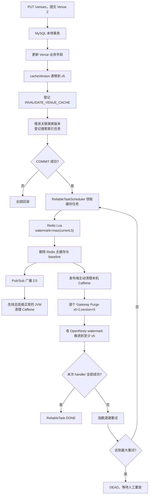

**图解：** MySQL 事务只负责原子保存事实、版本和待办。提交后，ReliableTask 先推进 Redis 水位并删除缓存，再通过 Pub/Sub 清在线 JVM，最后逐个推进显式网关水位。失败可以重试，相同版本或低版本重放不会让水位倒退。

**这一章只需要记住：** 写链不是“改库后立刻同步改完所有缓存”，而是“同事务保存失效意图，再幂等推动各层收敛”。

---

<a id="ch-19"></a>

## 第 19 章：用一个 v4 → v5 的完整故事串全篇

Venue 2 当前在 MySQL、Redis 和各缓存层显示 v4。慢请求 A 已开始读取 v4，但还没有完成响应。随后管理员提交更新：

1. **MySQL 事务阶段**：业务字段更新，`cache_version` 从 4 变为 5；`INVALIDATE_VENUE_CACHE(id=2, version=5)` 与关联搜索任务在同一事务落库；提交后，v5 和失效意图一起可见。
2. **可靠失效阶段**：调度器领取任务。Redis Lua 把 `cache:venue:version:2` 推进到至少 5，删除主缓存和 baseline，并发布 `2:5`。
3. **JVM 本地阶段**：执行任务的 JVM 主动删除本机 Caffeine；在线且连接正常的其他 JVM 收到 Pub/Sub 后删除各自副本。
4. **网关阶段**：所有显式配置的 OpenResty endpoint 接收 `purge(id=2, version=5)`，把各自水位推进到至少 5，并删除低于水位的正文。
5. **慢请求 A 尝试写 Redis**：若 A 的数据库结果仍是 v4，`write-cache-if-version.lua` 看到 `4 < 5`，返回 0。`normalRebuild()` 不会把这个结果安装到 Caffeine，并会清理该 key 的本地副本。
6. **慢请求 A 到达网关**：即使 Java 的 v4 响应已经在途，OpenResty `store()` 也会看到 `4 < 5`，拒绝把正文缓存下来。
7. **后续读请求**：各缓存层 MISS 后读取 MySQL v5；Redis 允许 v5 写入，只有 `WriteState.ACCEPTED` 才正常安装 Caffeine；OpenResty 也允许 v5 写入。

| 机制 | 在这个故事里保护什么 |
|---|---|
| Redisson RLock + Watchdog | 减少同一 key 的并发正常重建者，避免固定 10 秒锁先过期 |
| `cacheVersion` | 标识 v4、v5 的数据代次 |
| Redis 版本水位 | 失效后仍记得至少需要 v5，拒绝 Java 的 v4 回填 |
| ReliableTask / Outbox | 进程崩溃或跨系统暂时失败后，仍保留失效待办 |
| Pub/Sub | 尽快清理在线 JVM 的 Caffeine 副本 |
| Gateway Purge + 网关水位 | 清网关正文并拒绝迟到的 v4 HTTP 响应 |

这套系统仍不等于强一致：A 本次在途请求可能已经读到并返回 v4；Pub/Sub 也不是持久逐实例确认。但两个版本水位能阻止已知低版本继续成为 Redis 或 OpenResty 的新缓存内容，可靠任务则持续推进收敛。

**这一章只需要记住：** 锁减少重复工作，版本拒绝旧结果，Outbox 防止失效意图丢失，广播与 Purge 把各层向 v5 推进。

---

<a id="ch-20"></a>

## 第 20 章：当前实现仍然有哪些边界

面试时主动讲清边界，比把最终一致夸成强一致更可信。

| 边界 | 当前源码的准确结论 |
|---|---|
| Redis `ACCEPTED` 与 Caffeine `put` | 两步不是跨系统原子操作，中间仍可与更新交错 |
| fresh Redis HIT → Caffeine | 直接 `put`，没有 JVM 内版本墓碑再次比较；失效消息若恰好交错，可能出现短暂本地旧值窗口 |
| Pub/Sub | 在线且连接正常的 JVM 可收到并清本地副本；没有离线补发和逐 JVM 持久 ACK |
| 多网关拓扑 | `purge-urls` 是静态显式配置；没有动态服务发现，也不能证明未配置节点被清理 |
| null marker | 读取当前水位后用普通 `SET` 写 2 分钟，没有经过版本 Lua 的原子比较；新增与负缓存写入交错时存在窗口 |
| `POST /venues` | 当前直接 `venueService.save(venue)`，没有进入与 `PUT` 相同的版本化失效/搜索 Outbox 链；新增后曾经存在的 null marker 可能等 TTL 自行消失 |
| Redis 故障降级 | 无法读取共享版本水位，却会把非空 DB 结果放入本机 Caffeine；这是有界、有损降级，不是无损切换 |
| OpenResty 水位持久性 | 存在共享内存字典中，`safe_set` 防容量不足时静默淘汰，但 OpenResty 实例重启后水位不具备数据库式持久性 |
| OpenResty 缓存语义 | 只支持无 query string 的精确 `GET /venues/{id}` 公共响应；带查询参数、私有或不可缓存响应绕过 |
| Canal | 当前默认 `CANAL_ENABLED=false`，可选 profile 用于覆盖绕过应用服务的数据库变更，不应当作主写链默认已启用 |
| 已在途旧响应 | 水位阻止旧值成为新缓存内容，但不能追回已经返回给当前用户的旧响应 |
| 单 JVM Bulkhead | 默认 8 是每个 JVM 的限制；多实例总和不是数据库侧全局配额 |

还有一个重要区分：

- **已实现**：三态 Redis 读取、Redisson Watchdog 主锁、版本 Lua、Outbox 失效、Pub/Sub、本机主动失效、多网关 Purge、网关水位、Failure Gate、DB Bulkhead；
- **已测试**：第 21 章列出的单元与集成场景；
- **设计目标**：降低回源、拒绝已知低版本、推动最终收敛、限制故障扩散；
- **没有承诺**：线性强一致、每个 JVM 都收到广播、动态拓扑中的每个网关都被清理、Redis 故障时无损切换。

**这一章只需要记住：** 版本治理缩小旧值窗口并阻止已知旧写，不能把多存储系统变成一个强一致事务。

---

<a id="ch-21"></a>

## 第 21 章：真实测试是怎样验证这些设计的

### 21.1 Java 单元测试验证了哪些可观察结果

[`MultiLevelCacheServiceTest`](./src/test/java/com/citypass/utils/MultiLevelCacheServiceTest.java) 不只断言“方法不报错”，而是统计数据库调用数和并发结果：

| 测试方法 | 输入与断言 | 证明范围 |
|---|---|---|
| `nullMarkerPreventsSecondDatabaseLookup` | 同一不存在 ID 查询两次，DB 只调用 1 次 | null marker 能挡重复穿透 |
| `twoHundredConcurrentColdMissesPerformOneNormalDatabaseRebuild` | 200 个并发冷 MISS，正常 DB 重建 1 次 | 测试夹具下锁与二次检查减少重复回源 |
| `rebuildLongerThanOldTenSecondLeaseDoesNotAdmitSecondNormalRebuilder` | DB 模拟 10.2 秒，两个请求最终 DB 调用 1 次；验证未使用带固定 lease 的 `tryLock` | 当前主链不会因旧 10 秒固定锁边界放入第二正常重建者 |
| `exhaustedLockWaitUsesNonBlockingBulkhead` | 32 请求、Bulkhead=2，DB 接受 2、拒绝 30 | 等锁耗尽不会无界回源 |
| `redisOutageKeepsCaffeineHitsAndBoundsAllMissFallbacks` | Redis 故障时热 Caffeine 不查 DB；32 个冷请求仍只有 2 个回源 | 本地命中保留，故障降级有界 |
| `halfOpenProbeRestoresNormalRedisPath` | OPEN 冷却后探测 Redis HIT，并回到 CLOSED | 恢复路径存在 |
| `logicalExpiryReturnsStaleAndSchedulesOnlyOneRebuild` | 100 个并发请求都拿到 stale，异步 DB 调用 1 次 | 测试夹具下 SWR 与两层去重生效 |

[`RedisFailureGateTest`](./src/test/java/com/citypass/utils/RedisFailureGateTest.java) 用可控时钟验证 `CLOSED → OPEN → HALF_OPEN → CLOSED`，并单独验证普通 Redis MISS 作为成功上报时不会打开 Gate。

[`VenueControllerTest`](./src/test/java/com/citypass/controller/VenueControllerTest.java) 验证三件事：成功的 Venue v5 才发布网关版本和 cacheable 头；业务失败不发布；降级容量耗尽映射为 HTTP 503。

[`VenueCacheInvalidatorTest`](./src/test/java/com/citypass/utils/VenueCacheInvalidatorTest.java) 验证多个网关都被调用、任一节点失败会使整体 handler 失败，以及旧单地址配置与多地址配置会合并去重。[`ReliableTaskSchedulerGatewayTest`](./src/test/java/com/citypass/task/ReliableTaskSchedulerGatewayTest.java) 进一步验证网关 purge 异常时任务不能 `markDone`，而要进入 `markFailed` 重试。

### 21.2 集成脚本验证了哪些跨组件行为

[`cache-consistency-test.ps1`](./scripts/cache-consistency-test.ps1) 使用两个 Java 实例验证更新后两边 Caffeine 最终刷新、MySQL 与 Redis 水位一致，并直接执行版本 Lua，确认水位 5 时 v4 写入返回 0 且主缓存不存在。

[`gateway-cache-consistency-test.ps1`](./scripts/gateway-cache-consistency-test.ps1) 覆盖：

- OpenResty 首次 MISS 与后续 HIT；
- Venue 更新后版本升级；
- 较低版本 purge 不能让网关水位倒退；
- 人工推进水位后，旧 Java 响应不能进入网关缓存；
- 直连 Java 与经网关的公开详情权限语义一致；
- 极小令牌桶配置下，随机不存在 ID 扫描出现带正确层标识的 429。

### 21.3 当前可复述的验收记录

在提交 `ead3427` 完成时，本项目已记录以下实际验收结果：

- `mvn clean package`：40 个测试，0 failure、0 error，2 个需要外部基础设施的手工测试保持 `@Disabled`；
- 两个真实 Redis/Redisson 客户端的独立 Watchdog 探针：持锁 10.2 秒后锁仍有约 2660 ms TTL，第二客户端持锁期间未进入，释放后可进入；
- `cache-consistency-test.ps1` 与 `gateway-cache-consistency-test.ps1` 均通过；网关随机 ID 场景以 `rate=1、burst=3` 请求 20 个不同 ID，其中 17 个被限流；
- OpenResty `nginx -t`、Docker Compose 配置解析通过；Actuator 可见 11 个缓存可靠性 meter。

必须准确说明：Java 测试中的 Redis outage 是 Mockito/可控夹具注入的确定性异常，不是“真实容器停机演练”。真实 Watchdog 探针验证了续租行为，网关和双 JVM 脚本验证了真实组件链路；它们证明的范围不同。

### 21.4 运行时怎样观察

[`CacheReliabilityMetrics`](./src/main/java/com/citypass/utils/CacheReliabilityMetrics.java) 注册了以下 Micrometer 信号：

```text
cache.caffeine.hit
cache.redis.hit
cache.redis.miss
cache.redis.error
cache.redis.bypassed
cache.rebuild.started
cache.rebuild.lock.busy
cache.db.fallback.accepted
cache.db.fallback.rejected
cache.null.marker.hit
cache.redis.failure.gate.state
```

看单个数值意义有限，更有价值的是组合判断：`redis.error` 与 `redis.bypassed` 同时增长说明 Gate 正在保护；`db.fallback.rejected` 增长说明降级容量不足；`rebuild.started` 远高于冷 key 数量可能提示去重失效；`null.marker.hit` 能观察重复不存在 ID 的保护效果。

**这一章只需要记住：** 测试应验证 DB 调用次数、版本单调性、任务状态和 HTTP 结果，而不只是“接口返回 200”。

---

<a id="ch-22"></a>

## 第 22 章：大厂面试问答

### Q1：为什么要做多级缓存？

**面试短答：** 不同层拦截不同成本的读取：OpenResty 减少 HTTP 转发，Caffeine 减少进程内网络访问，Redis 让多个 JVM 共享缓存，MySQL 保留事实源职责。

**面试官继续追问时怎么展开：** 多一级也多一层一致性成本，因此每层都必须说明缓存对象、命中条件、失效方式和边界，而不是层数越多越好。

### Q2：OpenResty、Caffeine、Redis 各自解决什么？

**面试短答：** OpenResty 缓存公开可复用的 HTTP 正文；Caffeine 缓存单 JVM 的 Venue 对象；Redis 共享数据、版本水位和重建锁。

**面试官继续追问时怎么展开：** OpenResty 与 Caffeine 都是实例本地内存，跨实例依赖外部传播；Redis 是共享层，但它故障时需要 Failure Gate 和 DB Bulkhead 控制影响。

### Q3：Redis MISS 和 Redis ERROR 为什么必须区分？

**面试短答：** MISS 表示 Redis 正常、key 不存在，应进入互斥冷加载；ERROR 表示基础设施不可用，应进入有界降级。把两者混在一起会误熔断或无界回源。

**面试官继续追问时怎么展开：** 当前源码用 `RedisReadState.HIT/MISS/UNAVAILABLE` 显式建模，普通 MISS 会调用 Gate 的成功回调，不增加连续失败计数。

### Q4：什么是逻辑过期？

**面试短答：** 逻辑过期是缓存内容中的 `expireTime` 到期，Redis key 仍存在；CityPass 先返回 stale Venue，再异步重建。

**面试官继续追问时怎么展开：** 这是 stale-while-revalidate，用短暂陈旧换稳定延迟，适合 Venue 资料，不适合直接套在余额或库存扣减上。

### Q5：逻辑过期和物理 TTL 有什么区别？

**面试短答：** 逻辑过期后旧值仍可读；物理 TTL 到期后 key 真正消失并成为 MISS。当前物理 TTL 特意长于逻辑 TTL，为后台刷新保留窗口。

**面试官继续追问时怎么展开：** 当前逻辑 TTL 以 30 分钟为基础并加抖动；物理 TTL 取逻辑 TTL 两倍和“逻辑 TTL 加一小时”中的较大值。

### Q6：为什么 TTL 要增加随机抖动？

**面试短答：** 抖动把大量 key 的到期时刻打散，降低同一时间集中回源造成雪崩的概率。

**面试官继续追问时怎么展开：** Redis 逻辑 TTL 加最高约 20%，OpenResty 600 秒加 ±60 秒；抖动不解决 Redis 整体故障，后者依赖 Gate 与 Bulkhead。

### Q7：什么是缓存穿透？

**面试短答：** 请求的数据本来就不存在，缓存无法保存正常对象，重复请求不断落到数据库。CityPass 对同一缺失 ID 写 2 分钟 null marker。

**面试官继续追问时怎么展开：** null marker 的二次命中直接返回不存在，并有 `cache.null.marker.hit` 指标；新增数据与负缓存的交错仍是当前边界。

### Q8：为什么 null marker 挡不住随机 ID？

**面试短答：** 每个新随机 ID 第一次都没有 null marker，攻击者持续换 ID 仍会制造首次回源。

**面试官继续追问时怎么展开：** 当前在 OpenResty 按客户端 IP 使用独立 Venue 读令牌桶，超限返回 429；这与同一 key 的 null marker 互补。

### Q9：为什么没直接使用 Bloom Filter？

**面试短答：** 当前先用 null marker 和网关限流覆盖已观察到的两类穿透，避免引入 Bloom Filter 的同步、误判、重建和内存成本。

**面试官继续追问时怎么展开：** 若随机不存在 ID 仍是主要瓶颈，可以基于真实数据规模加入；同时必须设计新增 Venue 如何更新过滤器及全量重建流程。

### Q10：什么是缓存击穿？

**面试短答：** 热点 key 缺失或到期时，大量请求同时回源到数据库。CityPass 用冷 MISS 互斥重建和逻辑过期 SWR 降低冲击。

**面试官继续追问时怎么展开：** 冷 MISS 使用 Redisson RLock、二次检查和有限等待；逻辑过期使用 `localRebuilds` 加跨 JVM RLock。

### Q11：为什么冷 MISS 要加锁？

**面试短答：** 没有锁时，同一热点 key 的并发 MISS 会同时查 MySQL并回填。锁让正常重建过程串行化，其他请求等待后复用结果。

**面试官继续追问时怎么展开：** 源码并未承诺所有故障下绝对只有一个 DB 查询；锁异常或等待耗尽会转到受 Bulkhead 限制的降级路线。

### Q12：为什么拿锁后还要二次检查？

**面试短答：** 请求第一次 MISS 到真正拿到锁之间，其他请求可能已经完成回填。二次检查可以避免后来持锁者重复查 DB。

**面试官继续追问时怎么展开：** 二次检查若得到 fresh HIT 就直接写 Caffeine 返回；若 Redis 变成 UNAVAILABLE，则释放锁后进入有界降级。

### Q13：为什么当前 Venue 主链使用 Redisson Watchdog？

**面试短答：** 不显式传 lease time 时，Watchdog 会在持锁客户端存活期间续租，避免固定 10 秒 TTL 比慢 DB 重建更早到期。

**面试官继续追问时怎么展开：** 释放前用 `isHeldByCurrentThread()` 校验当前线程所有权；旧 UUID 字符串锁仍用于其他通用路径，不是 Venue 主链。

### Q14：Watchdog 能不能代替 `cacheVersion`？

**面试短答：** 不能。Watchdog 控制锁何时过期，`cacheVersion` 判断查询结果属于哪一代；持锁者也可能拿着已经过时的 v4。

**面试官继续追问时怎么展开：** v5 更新提交并推进水位后，旧持锁者的 v4 仍必须由版本 Lua 拒绝。

### Q15：`cacheVersion` 是干什么的？

**面试短答：** 它是 Venue 数据的单调代次，每次统一更新链把数据库版本加一，让缓存写入可以判断新旧。

**面试官继续追问时怎么展开：** 字段使用 `FieldStrategy.NEVER` 防止请求对象直接覆盖，服务端通过 `incrementCacheVersion()` 单独递增。

### Q16：version watermark 是什么？

**面试短答：** 版本水位是缓存系统已知的最低可接受版本线；水位 5 时，v4 拒绝，v5 可幂等重放，v6 可写入并推进水位。

**面试官继续追问时怎么展开：** Redis 和 OpenResty 各自维护水位，因为一个保护 Java 对象缓存，一个保护 HTTP 正文缓存。

### Q17：为什么主缓存删除后 version key 不能一起删？

**面试短答：** 主缓存删除后仍可能有旧请求迟到回填；version key 保留“至少已经到 v5”的记忆，才能拒绝 v4。

**面试官继续追问时怎么展开：** 数据 key 回答“存了什么”，版本 key 回答“最低接受什么”，生命周期本来就不同。

### Q18：为什么版本比较和写 Redis 要放在 Lua？

**面试短答：** 分开的 GET、判断、SET 会被并发失效插入；Lua 让比较水位、推进水位和写缓存相对于其他 Redis 命令原子执行。

**面试官继续追问时怎么展开：** 这种原子性只覆盖 Redis 内部脚本，不覆盖后续 Caffeine `put` 或 MySQL 事务。

### Q19：为什么相同版本可以重放？

**面试短答：** 网络超时和可靠任务重试可能重复处理同一代数据；允许 `expected == current` 使操作幂等，又不会降低水位。

**面试官继续追问时怎么展开：** 低版本拒绝，高版本推进，相同版本重放，是版本化缓存与 Outbox 重试能够配合的基础。

### Q20：为什么 update DB 后不能直接 delete Redis？

**面试短答：** 数据库提交后、Redis 删除前进程可能崩溃，而 MySQL 本地事务也不能让 Redis 删除一起回滚。当前把失效意图与业务更新同事务落库。

**面试官继续追问时怎么展开：** 后台再执行版本化失效，失败可重试；方案追求最终收敛，并非把 MySQL 与 Redis 变成强一致分布式事务。

### Q21：为什么使用 ReliableTask / Outbox？

**面试短答：** 它保证 Venue v5 提交时，“必须失效缓存 v5”这一待办也已经持久化；跨系统暂时失败后仍有重试依据。

**面试官继续追问时怎么展开：** 任务用 PENDING/RUNNING/DONE/DEAD、租约、owner、执行版本和指数退避支持多实例领取、宕机接管与人工重放。

### Q22：afterCommit 为什么不能完全替代 Outbox？

**面试短答：** afterCommit 只保证回调在本次提交后触发；提交后进程立刻崩溃或回调执行失败时，若没有持久记录就可能永久漏失效。

**面试官继续追问时怎么展开：** afterCommit 可降低正常路径延迟，但要达到可恢复性仍需要数据库中的可靠意图或等价持久消息方案。

### Q23：Pub/Sub 在这里解决什么？

**面试短答：** 它把一个实例执行的 Venue 失效快速广播给当前在线 JVM，让每个实例清理自己的 Caffeine 副本。

**面试官继续追问时怎么展开：** 发布端还主动清本机缓存，避免依赖自己是否收到回环消息；订阅配置在 `RedisPubSubConfig`。

### Q24：Pub/Sub 为什么不能叫可靠广播协议？

**面试短答：** Redis Pub/Sub 不持久保存离线消息，也没有逐 JVM ACK；断线实例可能漏掉一次通知。

**面试官继续追问时怎么展开：** Caffeine 自身 10 分钟过期和后续访问能帮助收敛，但当前没有为每个 JVM 维护持久消费位点。

### Q25：OpenResty 为什么也需要版本水位？

**面试短答：** Redis 水位只约束 Java 写 Redis，无法阻止已在途的旧 HTTP 响应在 purge 后重新进入网关缓存。

**面试官继续追问时怎么展开：** 网关缓存项携带 version；`lookup` 拒绝低版本项，`store` 拒绝迟到响应，`purge` 单调推进水位。

### Q26：网关旧慢响应为什么可能复活？

**面试短答：** 请求在更新前已经穿透网关并访问 Java，purge 发生后它才返回；若 body filter 不验版本，就会把旧正文重新缓存。

**面试官继续追问时怎么展开：** v4 响应低于 v5 网关水位时，当前 `store()` 返回 `stale version`，不会污染后续命中。

### Q27：多网关 purge 一个失败怎么办？

**面试短答：** handler 会尝试全部显式 endpoint，但只要一个失败就整体抛错，ReliableTask 不能 DONE，而会指数退避重试。

**面试官继续追问时怎么展开：** purge 以 `max(current, committedVersion)` 推进水位，所以对已成功网关重复调用是幂等的；静态列表漏配仍是边界。

### Q28：Redis 整体挂了为什么不能全部直查 DB？

**面试短答：** 原本由缓存承担的流量会瞬间转移到数据库，可能耗尽连接池并引发级联故障。CityPass 只允许有限降级并发。

**面试官继续追问时怎么展开：** Caffeine HIT 继续服务；冷请求经过 Failure Gate 和每 JVM DB Bulkhead，超出容量返回 503。

### Q29：Failure Gate 和 Bulkhead 有什么区别？

**面试短答：** Failure Gate 减少已知故障期间的 Redis 调用；DB Bulkhead 限制真正允许进入 MySQL 的降级并发。

**面试官继续追问时怎么展开：** Gate 用 CLOSED/OPEN/HALF_OPEN 管恢复探测，Bulkhead 用非阻塞 Semaphore 管资源容量，它们保护的组件不同。

### Q30：为什么降级容量满了宁可 503？

**面试短答：** 快速 503 让客户端有机会退避，也保留数据库和应用线程给有限请求；无界排队会放大尾延迟并拖垮整体。

**面试官继续追问时怎么展开：** 当前上限是每 JVM 8，并非数据库全局配额；生产应结合实例数、连接池与入口限流共同设定。

### Q31：当前方案是不是强一致？

**面试短答：** 不是。它允许短暂旧读，通过单调版本、可靠失效和重试阻止已知低版本持续回填，并推动最终收敛。

**面试官继续追问时怎么展开：** Pub/Sub 无持久 ACK、网关水位在内存、Caffeine put 与 Redis 写不原子、在途旧响应无法追回，都说明它不是线性一致系统。

### Q32：当前源码还有哪些边界？

**面试短答：** 主要边界包括 Caffeine 交错窗口、null marker 非版本 Lua 写入、POST 未进入统一版本链、静态网关列表、Pub/Sub 无 ACK、故障降级读无共享水位。

**面试官继续追问时怎么展开：** 优先级可按真实故障与流量决定：先统一新增写链和负缓存版本治理，再考虑 JVM 本地版本墓碑、动态网关发现或更可靠的本地失效消费协议。

### 源码对照索引

| 主题 | 真实文件与入口 |
|---|---|
| HTTP 入口与网关可信响应头 | [`VenueController`](./src/main/java/com/citypass/controller/VenueController.java) |
| 读写业务入口 | [`VenueServiceImpl`](./src/main/java/com/citypass/service/impl/VenueServiceImpl.java) |
| 多级读、重建、Gate、Bulkhead | [`MultiLevelCacheService`](./src/main/java/com/citypass/utils/MultiLevelCacheService.java) |
| Redis Failure Gate | [`RedisFailureGate`](./src/main/java/com/citypass/utils/RedisFailureGate.java) |
| 本地缓存配置 | [`CaffeineConfig`](./src/main/java/com/citypass/config/CaffeineConfig.java) |
| Redis 写入拒旧 | [`write-cache-if-version.lua`](./src/main/resources/write-cache-if-version.lua) |
| Redis 失效与广播 | [`invalidate-venue-cache.lua`](./src/main/resources/invalidate-venue-cache.lua) |
| 失效执行与网关 purge | [`VenueCacheInvalidator`](./src/main/java/com/citypass/utils/VenueCacheInvalidator.java) |
| Pub/Sub 订阅 | [`RedisPubSubConfig`](./src/main/java/com/citypass/config/RedisPubSubConfig.java) |
| ReliableTask 领取与重试 | [`ReliableTaskRepository`](./src/main/java/com/citypass/reliable/ReliableTaskRepository.java)、[`ReliableTaskScheduler`](./src/main/java/com/citypass/task/ReliableTaskScheduler.java) |
| OpenResty 协议 | [`nginx.conf`](./src/main/resources/openresty/nginx.conf)、[`venue_cache.lua`](./src/main/resources/openresty/lua/venue_cache.lua) |
| 网关读限流 | [`token_bucket.lua`](./src/main/resources/openresty/lua/token_bucket.lua) |
| 数据版本 | [`Venue`](./src/main/java/com/citypass/entity/Venue.java)、[`VenueMapper`](./src/main/java/com/citypass/mapper/VenueMapper.java)、[`citypass.sql`](./src/main/resources/db/citypass.sql) |

---

## 复习神器一：一张图看懂完整系统

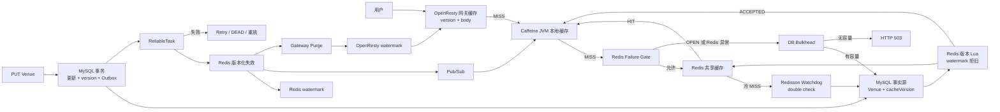

**图解：** 上半部分是读链：网关、本地、共享缓存依次拦截，冷 MISS 用 Watchdog 和二次检查重建，Redis 故障由 Failure Gate 与 DB Bulkhead 限流。下半部分是写链：MySQL 事务保存 v5 和 Outbox，可靠任务推进 Redis 水位、Pub/Sub 清 JVM、Gateway Purge 推进网关水位；失败保留重试路径。

## 复习神器二：一张表完成面试复习

| 看到问题 | 当前项目怎么解决 | 一句话边界 |
|---|---|---|
| 热点冷 MISS | Redisson Watchdog + 拿锁后二次检查 + 有限等待 | 正常情况下减少重复回源，不承诺故障下绝对单执行者 |
| 逻辑过期 | stale-while-revalidate + `localRebuilds` + RLock | 允许短暂旧读 |
| 旧 Redis 回填 | `cacheVersion` + Redis version watermark + Lua | Lua 原子性只覆盖 Redis 内部 |
| Redis 拒旧后本地安装 | 只有 `WriteState.ACCEPTED` 才正常 `put Caffeine` | Redis ACCEPTED 与 Caffeine put 不跨系统原子 |
| 旧网关响应 | HTTP response version + OpenResty watermark | 已返回的在途旧响应无法追回 |
| 提交后漏失效 | ReliableTask / Transactional Outbox 思想 | 推动最终收敛，不是跨系统强一致事务 |
| 在线 JVM 本地旧值 | Redis Pub/Sub + 发布端主动清理 | 无离线补发、无逐 JVM ACK |
| 多网关清理 | 显式 `purge-urls` 全部成功后 handler 才成功 | 静态配置，不是动态发现 |
| Redis outage | Failure Gate + DB Bulkhead | 有界、有损降级，容量满返回 503 |
| 同一不存在 ID | Redis null marker | 当前写入不经过版本 Lua 原子比较 |
| 随机不存在 ID | OpenResty 每 IP token bucket | 入口维度是 IP，需要结合真实网络拓扑评估 |
| TTL 同时过期 | Redis 与 OpenResty TTL jitter | 不解决 Redis 整体不可用 |
| 固定锁租期过早到期 | Redisson RLock 不显式传 lease time，使用 Watchdog | Watchdog 不判断数据新旧 |
| v6 任务先于 v5 | 失效水位取 `max(current, requested)` | 低版本任务可重放但不能让水位倒退 |
| 跨实例缓存收敛 | Redis 水位、Pub/Sub、网关 Purge、各层 TTL | 系统按最终一致设计，不提供线性强一致语义 |
