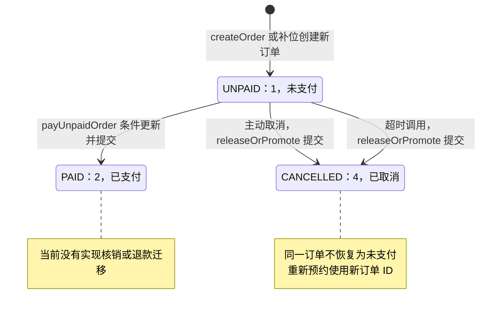
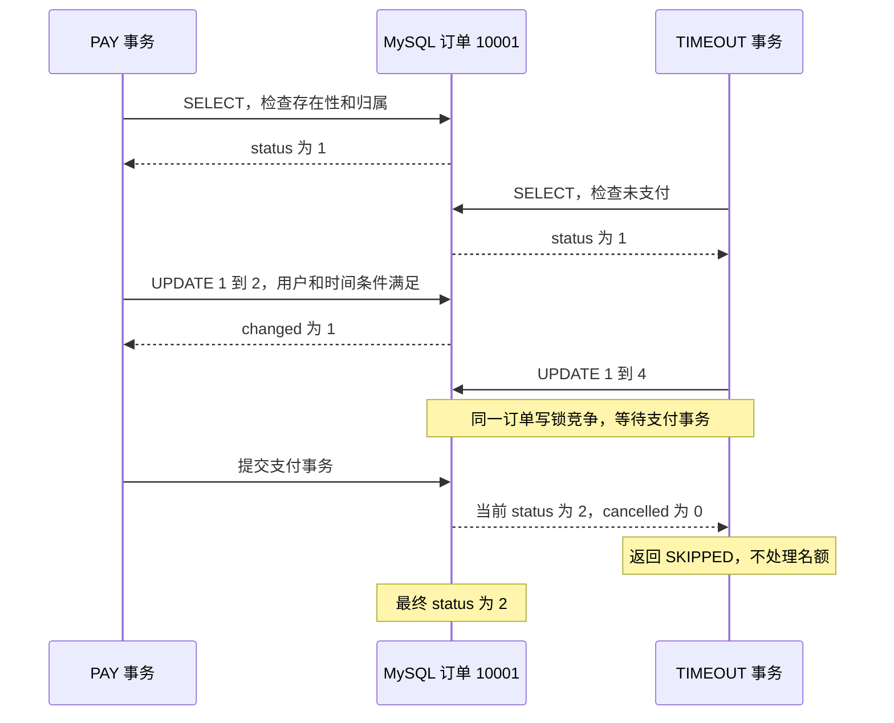
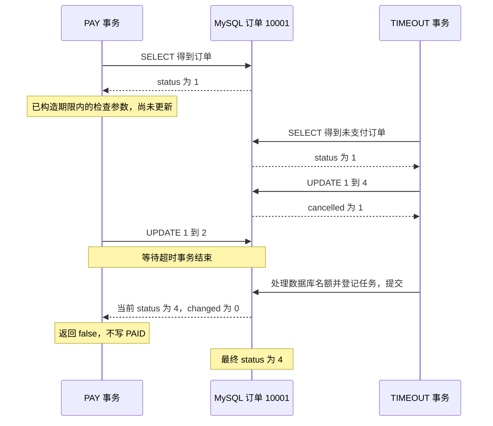
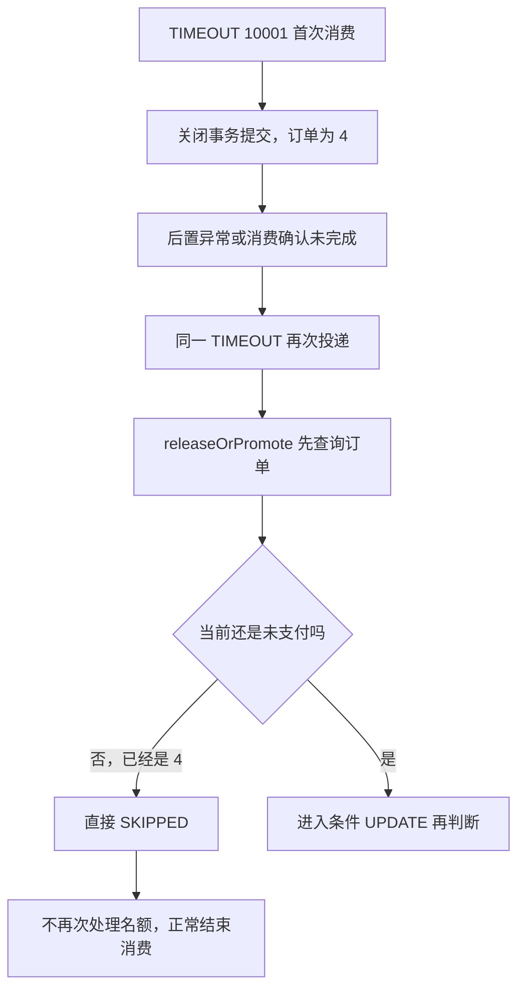
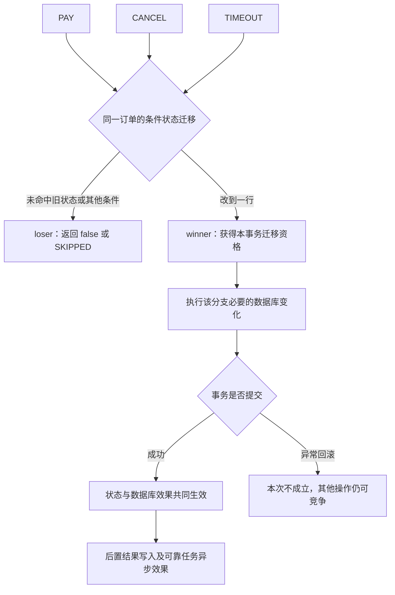
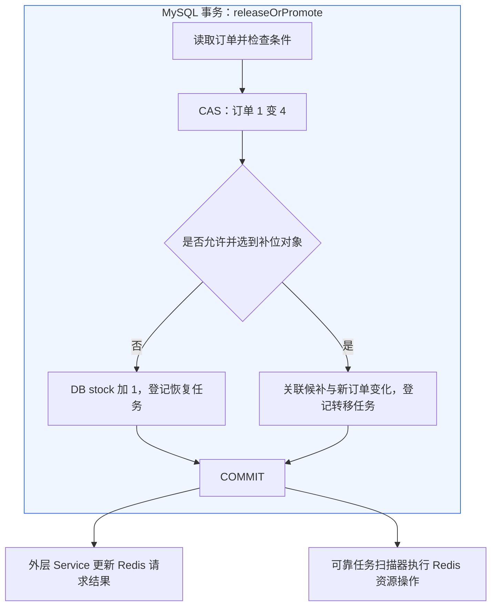
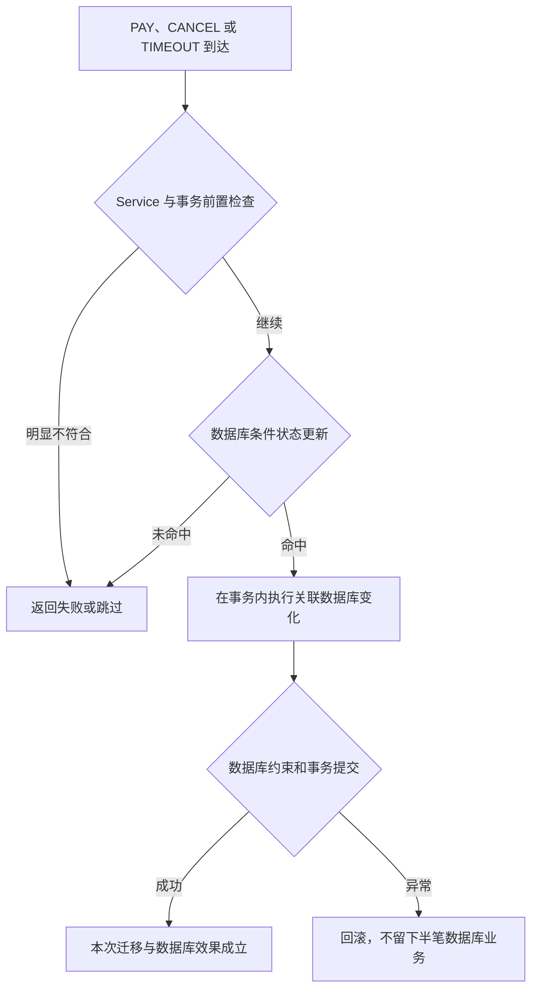
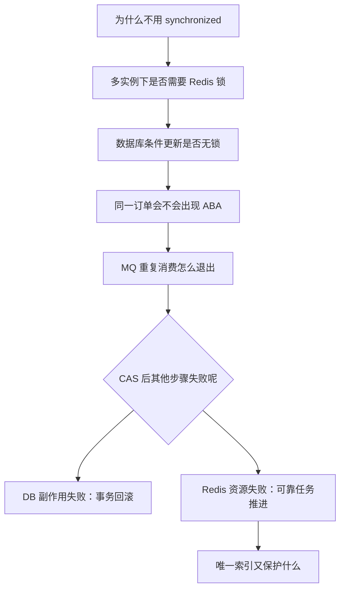

# CityPass 源码学习 02：从支付与超时竞争理解订单状态机、CAS 与幂等

> **状态机与并发控制：围绕预约、支付、取消及超时关闭构建订单生命周期状态机，基于数据库 CAS（Compare-And-Set）实现条件化状态迁移，并结合幂等校验与唯一约束处理 MQ 重复消费及多事件并发竞争，避免重复支付、重复释放与非法状态跳转。**

上一篇：[从一次预约请求理解异步削峰与双层防超卖](./01-async-reservation-and-oversell-protection.md)。上一篇回答“订单怎么创建且不超卖”，本篇从订单创建成功以后继续，回答“多个事件争着修改同一订单时，谁能生效”。

**源码基线**：`citypass-platform-source-2b13dee(1).zip`，版本标识 `2b13deec82b09d7c092c323605f947d3d0ad84ca`。本篇使用相同源码，不根据原型项目或旧注释补写能力。

**相对链接约定**：建议将两篇笔记一起放进 CityPass 仓库的 `docs/` 目录；文中的 `../src/`、`../deploy/` 和 `../scripts/` 源码链接均按这个位置编写。若放在独立学习仓库，需要同时提供对应源码或调整链接。

## 完整目录

<details>
<summary>展开所有章节与小节</summary>

- [0. 故事从订单已经存在开始](#section-1)
- [1. 先认清这张订单究竟有哪些状态](#section-2)
  - [1.1 数字订单状态，与字符串请求状态不是同一套东西](#section-3)
  - [1.2 第一张地图：只画源码已经实现的订单生命周期](#section-4)
- [2. 先看一次错误竞争，再理解为什么需要数据库 CAS](#section-5)
  - [2.1 两个线程都看见 UNPAID，会有什么问题？](#section-6)
  - [2.2 把“我刚才看见什么”改成“数据库现在是否还满足条件”](#section-7)
  - [2.3 “谁赢”不是谁先点击，也不是完全无锁](#section-8)
- [3. 10:08 用户点击支付：顺着源码走一次成功路径](#section-9)
  - [3.1 Controller 和 Service 先做什么？](#section-10)
  - [3.2 事务中先查订单：这一步还没有决定赢家](#section-11)
  - [3.3 支付的真实 CAS：旧状态、用户、期限一起检查](#section-12)
  - [3.4 CAS 成功之后，支付分支还做什么？](#section-13)
  - [3.5 事务提交以后，才更新 Redis 请求结果](#section-14)
- [4. 用户主动取消：只有拿到迁移资格，才能处理名额](#section-15)
  - [4.1 取消入口与支付入口怎样汇合到同一行订单？](#section-16)
  - [4.2 先读状态和归属：快速拒绝不合法请求](#section-17)
  - [4.3 真正争取释放权的是这条条件 UPDATE](#section-18)
  - [4.4 CAS 后面不是固定“库存 +1”，有两个出口](#section-19)
  - [4.5 取消事务提交后，Service 返回什么？](#section-20)
- [5. 系统超时关闭：消息从哪里来，到达后检查了什么？](#section-21)
  - [5.1 订单创建时登记任务，而不是让 HTTP 睡 15 分钟](#section-22)
  - [5.2 谁把任务变成 TIMEOUT 消息？](#section-23)
  - [5.3 到达 TIMEOUT 分支后，和主动取消复用哪个方法？](#section-24)
  - [5.4 还有一条定时扫描路径，也会竞争同一个 CAS](#section-25)
  - [5.5 必须讲出的边界：当前 TIMEOUT 关闭方法没有复核到期](#section-26)
- [6. PAY 与 TIMEOUT 同时来到：数据库怎样决定最后状态？](#section-27)
  - [6.1 Case 1A：支付先迁移并提交，超时退出](#section-28)
  - [6.2 Case 1B：超时先迁移并提交，支付退出](#section-29)
  - [6.3 “第一个事件获胜”有哪些必须保留的前提？](#section-30)
- [7. 再推演五种重复或竞争：看清 loser 在哪一步退出](#section-31)
  - [7.1 Case 2：CANCEL 与 TIMEOUT，都想释放同一个名额](#section-32)
  - [7.2 Case 3：用户连点两次 PAY](#section-33)
  - [7.3 Case 4：TIMEOUT 第一次关闭已提交，但消费确认没有完成](#section-34)
  - [7.4 Case 5：已经 PAID，迟到的 TIMEOUT 来了](#section-35)
  - [7.5 Case 6：取消接口连续调用两次](#section-36)
- [8. 为什么副作用必须放在 CAS 成功之后？](#section-37)
  - [8.1 错误顺序会让 loser 也动到资源](#section-38)
  - [8.2 CAS Winner / Loser 核心图](#section-39)
  - [8.3 “幂等”与“CAS”在这些例子中分别是什么？](#section-40)
- [9. CAS 成功以后还有事务：为什么不能停在“影响行数为 1”？](#section-41)
  - [9.1 释放或补位的真实数据库事务边界](#section-42)
  - [9.2 CAS 后恢复库存失败，会留下 CANCELLED 吗？](#section-43)
  - [9.3 CAS 成功并提交，但 Redis 资源还没释放，怎么办？](#section-44)
  - [9.4 成功事务后的请求状态写失败，不该再取消一遍](#section-45)
  - [9.5 小心“旧取消结果”这个 Java 对象](#section-46)
- [10. 哪些状态跳转允许，哪些会失败？按真实入口列规则](#section-47)
  - [10.1 状态迁移规则表](#section-48)
  - [10.2 “非法状态跳转保护”的范围是什么？](#section-49)
- [11. UNIQUE 为什么与状态机有关，但不能代替 CAS？](#section-50)
- [12. 用完整时间线，把状态和数据变化装进脑子](#section-51)
  - [12.1 时间线 A：10:08 支付，TIMEOUT 晚些到达](#section-52)
  - [12.2 时间线 B：超时关闭成功，用户随后尝试支付](#section-53)
- [13. 现在再理解锁、CAS，以及这条链路的三层保护](#section-54)
  - [13.1 当前哪里用了锁，哪里没有显式锁？](#section-55)
  - [13.2 状态机三层保护：每层都有对应代码](#section-56)
- [14. 源码调用链速查：分别回到支付、取消、超时入口](#section-57)
  - [14.1 支付链路](#section-58)
  - [14.2 主动取消链路](#section-59)
  - [14.3 超时关闭链路](#section-60)
  - [14.4 状态、约束与 Redis 边界的辅助证据](#section-61)
- [15. 八个面试重点：先理解，再准备 30～60 秒口述](#section-62)
  - [🔥 重点 1：为什么订单需要状态机？](#section-63)
  - [🔥 重点 2：数据库 CAS 在项目里是什么意思？](#section-64)
  - [🔥 重点 3：为什么先查询状态还不够？](#section-65)
  - [🔥 重点 4：PAY 和 TIMEOUT 同时发生怎么办？](#section-66)
  - [🔥 重点 5：CANCEL 和 TIMEOUT 为什么不重复释放库存？](#section-67)
  - [🔥 重点 6：MQ 重复消费怎样形成业务幂等？](#section-68)
  - [🔥 重点 7：幂等和 CAS 有什么区别？](#section-69)
  - [🔥 重点 8：为什么副作用只能跟在 CAS winner 后面？](#section-70)
- [16. 常见错误理解：用真实代码纠正容易背错的表述](#section-71)
- [17. 回到简历原句：每一个词都要能指向实现](#section-72)
- [18. 三版面试回答：从简述到深挖](#section-73)
  - [18.1 30 秒版：你的状态机主要解决什么？](#section-74)
  - [18.2 1～2 分钟版：详细讲支付、取消和超时并发](#section-75)
  - [18.3 深挖版：面试官如何顺着这个点追问？](#section-76)
- [19. 源码校验与测试证据：哪些已经确认，哪些没有实测？](#section-77)
  - [19.1 本次逐项核验结果](#section-78)
  - [19.2 仓库测试实际能证明什么？](#section-79)
  - [19.3 合上文档，自己画一次就能检验有没有真正理解](#section-80)

</details>

<a id="section-1"></a>

## 0. 故事从订单已经存在开始

现在时间是 10:00，用户 9527 已成功预约 City Music Festival。我们观察这张订单：

| 字段 | 示例值 | 此刻代表什么 |
| --- | --- | --- |
| `id` | 10001 | 同一订单的稳定身份；示例短 ID，真实为长整数 |
| `user_id` | 9527 | 订单属于这个用户 |
| `activity_pass_id` | 101 | 对应活动通行证 |
| `status` | 1 | 未支付，已经占有名额 |
| `source` | `DIRECT` | 本例是直接预约订单 |
| `offer_expire_time` | 10:15 | 支付资格截止时间 |
| Redis 请求状态 | `RESERVED` | 预约成功，等待支付，不是“已经付款” |

前一篇的 MySQL 创建事务已提交，名额已被占用。本篇所有时间都是教学示例，不是本次运行日志。

此后，用户可能在 10:08 支付，也可能主动取消；系统还安排了超时关闭。更麻烦的是：支付和关闭可能同时处理；客户端可能重复请求；TIMEOUT 消息也可能再次投递。

我们需要保护的不只是一个数字状态。假如系统一边认定支付成功，另一边又把名额给别人，用户看到的订单和实际资源就矛盾了。

> 本篇一直追踪三件事：**订单当前状态、哪次操作有权改变它、该操作能否继续修改资源。**

<a id="section-2"></a>

## 1. 先认清这张订单究竟有哪些状态

<a id="section-3"></a>

### 1.1 数字订单状态，与字符串请求状态不是同一套东西

首先打开 [ReservationOrder.java](../src/main/java/com/citypass/entity/ReservationOrder.java)、[RedisConstants.java](../src/main/java/com/citypass/utils/RedisConstants.java) 和 [citypass.sql](../src/main/resources/db/citypass.sql)。

订单 `status` 是 `Integer`，数据库列是数字。当前 Java 显式提供的三个订单状态常量是：

```java
public static final int ORDER_STATUS_UNPAID = 1;
public static final int ORDER_STATUS_PAID = 2;
public static final int ORDER_STATUS_CANCELLED = 4;
```

实体注释和建表 SQL 还定义了 3、5、6 的业务含义，但仓库没有相应的订单常量或完整迁移实现。下面必须把“有这个值的定义”和“已经实现这个动作”区分开。

| 值 | 真实含义与代码名称 | 当前源码实现的订单出口 | 本篇中的终态判断 |
| --- | --- | --- | --- |
| 1 | 未支付，`ORDER_STATUS_UNPAID` | 支付成功变 2；主动取消或超时关闭变 4 | 不是终态 |
| 2 | 已支付，`ORDER_STATUS_PAID` | 未发现进一步订单状态写入方法 | 对当前 PAY/CANCEL/TIMEOUT 接口是终止状态；不推断完整业务永久终态 |
| 3 | 已核销，实体和 SQL 定义 | 未发现核销入口及该状态迁移实现 | 只有定义，不能画成已实现的下一步 |
| 4 | 已取消，`ORDER_STATUS_CANCELLED` | 没有恢复同一订单为 1 的实现 | 对当前订单生命周期是终止状态；重新预约创建新订单 |
| 5 | 退款中，实体和 SQL 定义 | 未发现退款发起与推进实现 | 只有定义，不能宣称退款状态机已经完成 |
| 6 | 已退款，实体和 SQL 定义 | 未发现进入该状态的实现 | 只有定义，不将其画入本篇已实现链路 |

本篇用 `UNPAID/PAID/CANCELLED` 作图中简称，对应数据库 `1/2/4`，不是额外创建的一组 Enum。

[ReservationStatus.java](../src/main/java/com/citypass/utils/ReservationStatus.java) 中的 `PROCESSING`、`RESERVED`、`WAITLISTED`、`EXPIRED` 等字符串，主要服务于请求结果、候补记录等语义。尤其需要分清：

| 看到的名称 | 实际作用 |
| --- | --- |
| `RESERVED` | 查询把订单 status=1 映射为“预约成功”；不是订单表的字符串值 |
| `PAID` | 请求结果字符串；订单实际存数字 2 |
| `CANCELLED` | 请求结果字符串，也可用于候补状态；订单实际存数字 4 |
| `EXPIRED` | 超时释放时传给候补状态更新的参数；**不是订单新增的第七个状态** |

<a id="section-4"></a>

### 1.2 第一张地图：只画源码已经实现的订单生命周期



这是一套**基于数据库状态字段和条件更新实现的业务状态机**。Service 决定允许什么事件，数据库更新条件决定事件能否生效。没有引入专用 State Machine 框架，也没有实现泛化状态迁移引擎。

**⚠️ 容易讲错**：不能因为 SQL 注释里出现“已核销、退款中、已退款”，就画出 `PAID → USED → REFUNDING → REFUNDED` 并声称已经实现。不能把重复支付画成“再次成功的 PAID 自环”；本版本重复支付返回业务失败。

<a id="section-5"></a>

## 2. 先看一次错误竞争，再理解为什么需要数据库 CAS

<a id="section-6"></a>

### 2.1 两个线程都看见 UNPAID，会有什么问题？

假设我们把代码写成下面这样。**这是反例，不是当前实现**：

```java
ReservationOrder order = orderMapper.selectById(orderId);
if (order.getStatus() == ORDER_STATUS_UNPAID) {
    // 错误示意：后面的 UPDATE 只按 id，不再检查旧状态
    updateStatusById(orderId, targetStatus);
    runBusinessEffect();
}
```

支付线程 A 和超时线程 B 各有自己的 Java 对象。A 把数据库改了，B 手里先前读到的对象不会自动更新。

| 顺序 | 支付 A | 超时 B | 数据库 |
| --- | --- | --- | --- |
| T0 | SELECT 读到 1 | — | 1 |
| T1 | — | SELECT 也读到 1 | 1 |
| T2 | 无条件按 ID 改成 2，返回支付成功 | — | 2 |
| T3 | — | 仍凭旧判断按 ID 改成 4，并释放名额 | 4 |

错误结果：用户刚收到支付成功，名额又被释放或转给候补。

这里的问题叫 TOCTOU（Time-of-Check to Time-of-Use，检查与使用之间的时间差）：**检查旧状态与实际更新不是同一个原子动作，中间状态可能被别人改掉。**

给方法加普通 `@Transactional`，也不等于普通 SELECT 和无条件 UPDATE 就自动具备“旧状态未改变”的保护。事务的原子提交与并发时校验旧值，是两个需要一起考虑的事情。

<a id="section-7"></a>

### 2.2 把“我刚才看见什么”改成“数据库现在是否还满足条件”

本项目的做法是把预期状态写进 UPDATE 条件：

| 操作 | 预期旧状态 expected | 目标状态 target |
| --- | --- | --- |
| PAY | 1，未支付 | 2，已支付 |
| CANCEL | 1，未支付 | 4，已取消 |
| TIMEOUT | 1，未支付 | 4，已取消 |

这可以称为数据库 **CAS（Compare-And-Set，比较并设置）式条件迁移**：在写入时检查当前状态仍等于预期旧状态，满足才修改。它不调用 Java `compareAndSet()`，也没有 version 字段或自旋循环。

用于教学理解的简化 SQL：

```sql
UPDATE tb_reservation_order
SET status = :targetStatus
WHERE id = :orderId AND status = 1;
```

这只是共同语义。真实支付还带用户和截止时间条件，后面按源码完整展开。

> 多个事件都可以尝试，但一个事务把该订单从 `1` 改走并提交后，其他仍要求 `status=1` 的事件就不能再改动它。

<a id="section-8"></a>

### 2.3 “谁赢”不是谁先点击，也不是完全无锁

winner（胜出者）是条件更新成功、并最终完成事务提交的操作；loser（未胜出者）可能在前置检查就退出，也可能 UPDATE 影响 0 行后退出。

成功 UPDATE 后、事务尚未提交时，可以说本事务暂时获得了迁移资格。若后续数据库副作用失败导致回滚，这次迁移没有最终成立，等待中的其他事务仍可能成功。所以不能说“第一条 UPDATE 一旦返回 1，就永久决定结局”。

**数据库 CAS 也不等于无锁。** 本项目没有先对订单执行显式 `SELECT ... FOR UPDATE`，但 InnoDB 执行 UPDATE 本身会获取写锁，竞争方可能等待前一个事务释放锁。业务上的“比较旧状态再更新”和数据库内部的锁实现并不矛盾。参见 [MySQL 官方 UPDATE 锁说明](https://dev.mysql.com/doc/refman/8.0/en/innodb-locks-set.html)。

<a id="section-9"></a>

## 3. 10:08 用户点击支付：顺着源码走一次成功路径

<a id="section-10"></a>

### 3.1 Controller 和 Service 先做什么？

请求是：

```http
PUT /reservations/10001/pay
```

[ReservationController.pay()](../src/main/java/com/citypass/controller/ReservationController.java) 调用 `IReservationService.payOrder(orderId)`，实际进入 [ReservationServiceImpl.payOrder()](../src/main/java/com/citypass/service/impl/ReservationServiceImpl.java)。

Service 先检查订单号和登录用户非空，然后调用：

```java
boolean paid = transactionalService.payUnpaidOrder(
        orderId, UserHolder.getUser().getId());
```

这时还没有改状态、扣款或释放资源。真正修改数据库的是另一个 Spring Bean 中的 [ReservationTransactionalService.payUnpaidOrder()](../src/main/java/com/citypass/service/impl/ReservationTransactionalService.java)。

**范围必须说清**：当前“支付”实现是本地订单支付状态确认，没有看到支付网关调用、真实资金扣款、支付回调验签或外部支付流水事务。因此本篇的“避免重复支付”，具体证明的是**不重复执行本地支付状态迁移和相关数据库更新**，不能扩张为已解决第三方重复扣款问题。

<a id="section-11"></a>

### 3.2 事务中先查订单：这一步还没有决定赢家

`payUnpaidOrder()` 带 `@Transactional(rollbackFor = Exception.class)`。它首先：

```java
ReservationOrder order = orderMapper.selectById(orderId);
if (order == null || !userId.equals(order.getUserId())) {
    return false;
}
```

这里核对存在性和用户归属，并拿到 `source` 供后续判断。它**没有先用 Java if 判断 status 必须未支付**，旧状态条件直接留给后面的 UPDATE。

即使 SELECT 的时候看到 status=1，随后也可能被取消线程改走。最后决定支付能否成功的仍是下一步。

<a id="section-12"></a>

### 3.3 支付的真实 CAS：旧状态、用户、期限一起检查

核心代码：

```java
int changed = orderMapper.update(null,
        new UpdateWrapper<ReservationOrder>()
                .set("status", ORDER_STATUS_PAID)
                .set("pay_time", LocalDateTime.now())
                .eq("id", orderId)
                .eq("user_id", userId)
                .eq("status", ORDER_STATUS_UNPAID)
                .gt("offer_expire_time", LocalDateTime.now()));
if (changed != 1) {
    return false;
}
```

它通过 [ReservationOrderMapper](../src/main/java/com/citypass/mapper/ReservationOrderMapper.java) 继承的 MyBatis-Plus `BaseMapper.update()` 执行，没有一份另写在 XML 中的支付 SQL。

等价语义如下，冒号是教学参数，不是仓库里的 SQL 字符串：

```sql
UPDATE tb_reservation_order
SET status = 2, pay_time = :payTime
WHERE id = :orderId
  AND user_id = :userId
  AND status = 1
  AND offer_expire_time > :checkedAt;
```

| 条件 | 为什么需要 |
| --- | --- |
| `id = orderId` | 竞争的是同一张订单 |
| `user_id = userId` | 实际更新仍限定订单归属 |
| `status = 1` | 已支付、已取消等订单不能再支付 |
| `offer_expire_time > checkedAt` | 本次检查时支付资格仍有效；相等也不通过 |
| `changed == 1` | 本次实际完成了唯一一行的状态迁移 |

`checkedAt` 是构造 Wrapper 时的应用服务器时间 `LocalDateTime.now()`，不是数据库实时计算的提交时间。如果 SQL 后来发生长时间锁等待，这个参数不会随着等待自动刷新。因此源码检查的是**传入时间点的资格**，不能说成“严格保证提交发生在截止时间之前”。多实例时间一致性也是进一步工程问题。

<a id="section-13"></a>

### 3.4 CAS 成功之后，支付分支还做什么？

直接预约 `source=DIRECT`：状态改成 2、记录 `pay_time` 后，不再修改库存，不释放 Redis Claim，也不创建新的 MQ 消息或可靠任务。

若 `source=WAITLIST`，同一事务还会把对应候补记录从 `OFFERED` 改为 `ACCEPTED`，并检查影响行数为 1；不满足就抛异常，让订单支付迁移一并回滚。这是保证订单与关联候补状态一起变化的接口边界，完整候补生命周期留到第三篇。

**💡 为什么这里还要事务？**

对候补来源的订单，只改成已支付、却没有同步更新关联候补状态，会让两张表对同一次业务给出不同结论。所以支付 CAS 不是孤立一条语句，必要的数据库关联变化需要一起提交。

<a id="section-14"></a>

### 3.5 事务提交以后，才更新 Redis 请求结果

事务方法成功返回 `true` 后，外层 `payOrder()` 才执行：

```java
writeRequestStatus(orderId, ReservationStatus.PAID);
return Result.ok("支付成功");
```

实际源码用三元表达式区分成功失败，上面是成功路径的等价摘述。`writeRequestStatus()` 写 `reservation:request:10001=PAID`，TTL 为 5 分钟。

| 数据 | 支付前 | 正常支付后 |
| --- | --- | --- |
| MySQL 订单 status | 1 | 2 |
| MySQL `pay_time` | 未设置 | 本次应用时间 |
| MySQL 库存 | 已被预约占用后的值 | 不变 |
| Redis stock | 已被预约占用后的值 | 不变 |
| Redis holders / claim | 用户仍持有名额 | 不变，不释放 |
| Redis 请求状态 | `RESERVED` 或已过期 | 写 `PAID`，5 分钟 |
| 原来的超时任务 / TIMEOUT | 已登记或已发送 | 支付代码不撤回、不删除它 |

这里“事务后更新”是因为外层在事务方法返回后调用，不是源码实现了 `afterCommit` 回调框架。

若返回 `false`，Service 返回 `Result.fail("订单不存在、资格已过期或状态不允许支付")`，不写 Redis 的 PAID。若数据库已提交而 Redis 写入抛异常，HTTP 可能没有正常返回成功，但数据库不会因此自动退回未支付；查询接口会优先读取 MySQL 事实。

现在最自然的疑问来了：**支付成功以后，那个早就安排好的 TIMEOUT 还在路上，它到达会不会把订单取消？** 要回答这个问题，先看取消和超时到底怎样改状态。

<a id="section-15"></a>

## 4. 用户主动取消：只有拿到迁移资格，才能处理名额

<a id="section-16"></a>

### 4.1 取消入口与支付入口怎样汇合到同一行订单？

取消请求：

```http
PUT /reservations/10001/cancel
```

[ReservationController.cancel()](../src/main/java/com/citypass/controller/ReservationController.java) 调用 `ReservationServiceImpl.cancelOrder()`。Service 检查订单号和登录上下文，然后：

```java
transactionalService.releaseOrPromote(
        orderId, UserHolder.getUser().getId(), ReservationStatus.CANCELLED,
        offerMinutes);
```

`releaseOrPromote()` 同时服务主动取消和系统超时，名称可理解为“释放或补位”。**状态竞争就在这个方法里面**，不是先在外面取消成功再来处理名额。

<a id="section-17"></a>

### 4.2 先读状态和归属：快速拒绝不合法请求

事务开头读取订单：不存在或不是 status=1，返回 `ReleaseAction.SKIPPED`。如果调用传入了 `expectedUserId`，还会核对订单归属，不匹配返回 `DENIED`。

顺序是**先状态，再归属**。因此已支付的非本人订单可能先得到 SKIPPED，而不是 DENIED；不要把返回分类讲成独立的权限错误枚举总会优先出现。

如果查询的是本人未支付订单，接着往下走。但刚刚查到未支付，只是当时的判断，不能阻止另一线程此刻支付。

<a id="section-18"></a>

### 4.3 真正争取释放权的是这条条件 UPDATE

[ReservationTransactionalService.releaseOrPromote()](../src/main/java/com/citypass/service/impl/ReservationTransactionalService.java) 的核心：

```java
int cancelled = orderMapper.update(null,
        new UpdateWrapper<ReservationOrder>()
                .set("status", ORDER_STATUS_CANCELLED)
                .eq("id", orderId)
                .eq("status", ORDER_STATUS_UNPAID));
if (cancelled == 0) {
    return new ReleaseResult(ReleaseAction.SKIPPED, oldOrder, null);
}
```

等价语义：`UPDATE ... SET status=4 WHERE id=:orderId AND status=1`。

这就是本篇最关键的分叉：

- 命中一行，当前事务才可以继续释放名额或补位。
- 影响 0 行，直接 SKIPPED，不能继续库存加一，不能继续选择候补，也不能登记释放任务。

订单主键限定了一行。源码判断是 `cancelled == 0`，不要改写为“代码统一判断 `!=1`”；支付与关联表更新的判断才是 `!=1`。

<a id="section-19"></a>

### 4.4 CAS 后面不是固定“库存 +1”，有两个出口

| `ReleaseAction` | 订单本身 | 后续数据库资源动作 | 事务内登记的 Redis 相关任务 |
| --- | --- | --- | --- |
| `RELEASED` | 本次从 1 改为 4 | 没有可执行的补位，库存加 1；检查改到 1 行 | `RESTORE_REDIS_STOCK` |
| `PROMOTED` | 旧订单从 1 改为 4 | 名额交给候补并建立新订单，库存数量不变 | `TRANSFER_RESERVATION_CLAIM`，另登记新订单超时任务 |
| `SKIPPED` | 本次没改状态 | 不执行释放或补位 | 不登记本次资源任务 |
| `DENIED` | 本次没改状态 | 不执行释放或补位 | 不登记本次资源任务 |

本篇只需记住：**RELEASED 与 PROMOTED 都要先通过同一张旧订单的 CAS 门槛**。具体如何选候补、如何处理 Resource Handoff（名额转交），第三篇再展开。

代码中补位主要取决于活动仍可补位及是否选到候补；虽然注释提到“最大轮次”，当前方法没有相应轮次上限判断，不把它当作本篇已有保护。

<a id="section-20"></a>

### 4.5 取消事务提交后，Service 返回什么？

`cancelOrder()` 对 `DENIED` 返回“无权取消该预约”，对 `SKIPPED` 返回“订单不存在或当前状态不允许取消”。其余两种动作调用 `publishReleaseResult()`，然后返回 `Result.ok(action.name())`，data 为 `RELEASED` 或 `PROMOTED`。

`publishReleaseResult()` 名字里虽然有 publish，**这里并不发送 MQ**。它将旧订单请求状态写为 `CANCELLED`；若发生补位，还将新订单请求状态写为 `RESERVED`，然后记录日志。

真正清理 Redis holder / claim 或回补 Redis stock，由可靠任务扫描器稍后执行，不是这个方法直接做。数据库事务已提交与 Redis 已完成释放，不是同一个时刻。

<a id="section-21"></a>

## 5. 系统超时关闭：消息从哪里来，到达后检查了什么？

<a id="section-22"></a>

### 5.1 订单创建时登记任务，而不是让 HTTP 睡 15 分钟

上一篇已经读到 `createOrder()` 最后调用 `enqueueTimeout(orderId)`。它在创建订单的同一数据库事务里登记：

| 任务字段 | 值 |
| --- | --- |
| 表 | `tb_reliable_task` |
| `task_type` | `ORDER_TIMEOUT` |
| `biz_key` | `order-timeout:10001` |
| `payload` | `10001` |
| 初始状态 | `PENDING` |
| `next_retry_time` | 入库时 `NOW()` |

注意 `next_retry_time` 不是支付截止时间。任务可以在创建事务提交后很快被扫描执行，**15 分钟等待主要发生在 Broker 的延迟投递阶段**。

证据：[ReservationTransactionalService.enqueueTimeout()](../src/main/java/com/citypass/service/impl/ReservationTransactionalService.java)、[ReliableTaskRepository.enqueue()](../src/main/java/com/citypass/reliable/ReliableTaskRepository.java)。

<a id="section-23"></a>

### 5.2 谁把任务变成 TIMEOUT 消息？

[ReliableTaskScheduler.relay()](../src/main/java/com/citypass/task/ReliableTaskScheduler.java) 默认按 1000ms 的 fixedDelay 扫描，每批最多取 100 条可执行任务。`execute()` 识别 `ORDER_TIMEOUT` 后调用：

```java
producer.sendOrderTimeout(Long.valueOf(task.getPayload()));
```

[RocketMQProducer.sendOrderTimeout()](../src/main/java/com/citypass/mq/RocketMQProducer.java) 构造消息，消息体只有订单 ID 的 UTF-8 文本，然后：

```java
message.setDelayTimeLevel(RocketMQConstants.ORDER_TIMEOUT_DELAY_LEVEL);
producer.send(message);
```

| 项目 | 本版本实际值 |
| --- | --- |
| Topic | `citypass-reservation-topic` |
| Tag | `TIMEOUT` |
| Body | `10001`，不是完整订单 JSON |
| 延迟等级 | 15 |
| 仓库 Broker 第 15 档 | `15m` |
| 发送方式 | 普通同步 send 加延迟等级，不是异步回调 |

依据：[RocketMQConstants.java](../src/main/java/com/citypass/utils/RocketMQConstants.java)、[broker.conf](../deploy/rocketmq/broker.conf)。延迟等级模式可对照 [RocketMQ 4.x 官方延迟消息说明](https://rocketmq.apache.org/docs/4.x/producer/04message3/)，但本项目具体第 15 档的时长以自带 Broker 配置为准。

`execute()` 在发送方法正常返回后标记任务 DONE，异常时记录稍后重试。任务重试细节留第四篇；本篇只需知道，同一订单可能因此出现重复 TIMEOUT，消费者不能依赖只收到一次。

<a id="section-24"></a>

### 5.3 到达 TIMEOUT 分支后，和主动取消复用哪个方法？

[OrderMQConsumer.init()](../src/main/java/com/citypass/mq/OrderMQConsumer.java) 中注册的 Lambda 监听器订阅 `CREATE || TIMEOUT`。TIMEOUT 分支：

```java
reservationService.cancelTimeoutOrder(Long.valueOf(body));
```

[ReservationServiceImpl.cancelTimeoutOrder()](../src/main/java/com/citypass/service/impl/ReservationServiceImpl.java) 调用：

```java
transactionalService.releaseOrPromote(
        orderId, null, ReservationStatus.EXPIRED, offerMinutes);
```

与主动取消的区别只有调用语义和参数，订单状态更新都在 `releaseOrPromote()` 中完成：

| 参数 / 效果 | 主动取消 | 系统超时 |
| --- | --- | --- |
| `expectedUserId` | 登录用户 ID | `null`，系统路径不按登录身份限制 |
| `waitlistTerminalStatus` | `CANCELLED` | `EXPIRED` |
| 订单 CAS | 1 → 4 | 1 → 4 |
| 旧订单请求结果 | `CANCELLED` | 同样为 `CANCELLED` |
| 适用时的关联候补状态 | 写 CANCELLED | 写 EXPIRED |

**EXPIRED 参数只在旧订单来源为 WAITLIST 时用于关联候补记录，不会把订单 status 改成字符串 EXPIRED。** 普通直接预约的订单状态本身不区分“用户取消”和“超时取消”。

随后调用 `publishReleaseResult()`。SKIPPED / DENIED 会被它直接忽略。没有其他异常时，监听器最终返回 `CONSUME_SUCCESS`；抛出 Exception 则返回 `RECONSUME_LATER`。

<a id="section-25"></a>

### 5.4 还有一条定时扫描路径，也会竞争同一个 CAS

[ReservationReconcileTask.reconcile()](../src/main/java/com/citypass/task/ReservationReconcileTask.java) 按 60000ms fixedDelay 执行，其中 `closeTimeoutOrders()` 查询：

- 订单 status=1；
- `offer_expire_time <= LocalDateTime.now()`。

然后逐个调用同一个 `cancelTimeoutOrder()`。这里是**扫描阶段确实带到期条件**的补充入口。它与 MQ 同时处理一张订单，也必须经由订单 CAS 防止重复释放。

因此真实机制是：**订单事务登记本地任务 → 扫描器发送 MQ 延迟消息 → 消费者关闭；另有到期订单扫描作为补充入口**。不能只写“有个 Scheduler 每 15 分钟取消一次”。

<a id="section-26"></a>

### 5.5 必须讲出的边界：当前 TIMEOUT 关闭方法没有复核到期

`cancelTimeoutOrder()` 和它调用的 `releaseOrPromote()` 中，**没有 `offer_expire_time <= 当前时间` 的判断或 UPDATE 条件**。其订单条件只有“存在、未支付”，系统调用不检查用户归属。

这意味着迟到 TIMEOUT 不会取消已经支付的订单，但若 TIMEOUT 被错误提前触发，未支付且仍在支付窗口内的订单也可能被关闭。**状态竞争正确，不等于超时时间语义也已完整校验。**

还有两个与此直接相关的配置事实：

1. `reservation.offer-minutes` 可配置，默认 15；Broker 延迟等级固定取第 15 档，由自带配置映射为 15 分钟，两者没有动态绑定。
2. 截止时间在建单时计算，延迟消息在任务被扫描发送后才进入延迟阶段，因此消息实际消费时刻不是精确的建单时刻加 15 分钟。

例如把 offer-minutes 改成 30，仍用 15 分钟 TIMEOUT，就可能提前取消未支付订单；改成 1 分钟时，DB 支付条件先拒绝过期支付，扫描也可能先关闭，MQ 消息则晚些到达。

**进一步可优化方案，而非当前实现**：给超时专用状态迁移补上到期条件，让主动取消仍可在期限内执行；同时对齐延迟调度与实际截止时间。本篇不修改源码，也不把这个条件画成已经存在。

<a id="section-27"></a>

## 6. PAY 与 TIMEOUT 同时来到：数据库怎样决定最后状态？

三条方法已经认识了，现在回到订单 10001。PAY 和 TIMEOUT 不在同一个 HTTP 线程，也不需要在同一个应用实例。它们最终竞争的是 `tb_reservation_order` 的同一行。

<a id="section-28"></a>

### 6.1 Case 1A：支付先迁移并提交，超时退出

两条真实路径：

| 事件 | 实际调用 |
| --- | --- |
| PAY | `ReservationController.pay()` → `ReservationServiceImpl.payOrder()` → `ReservationTransactionalService.payUnpaidOrder()` |
| TIMEOUT | `OrderMQConsumer.init()` 中 TIMEOUT 分支 → `ReservationServiceImpl.cancelTimeoutOrder()` → `ReservationTransactionalService.releaseOrPromote()` |

假设 PAY 构造的检查时间还在支付期限内。两边 SELECT 都读到未支付，支付先完成 UPDATE：



这里 TIMEOUT 的本地 `oldOrder` 即使还保存 status=1，也不能改变数据库判断。条件 UPDATE 在实际写入时检查旧状态，影响 0 行，立刻返回 SKIPPED。

PAY 事务之后由外层 Service 写 PAID；TIMEOUT 的 `publishReleaseResult(SKIPPED)` 直接返回，不写 CANCELLED，不回补库存，也不新建候补订单。

<a id="section-29"></a>

### 6.2 Case 1B：超时先迁移并提交，支付退出

反过来，为了单独观察状态竞争，可以设定 PAY 请求在截止前已取得数据、构造了时间参数，但执行更新被调度延迟；TIMEOUT 在到期时先抢到订单写入。



如果 PAY 本身也是截止后才构造检查时间，它还会被支付期限条件拒绝；不能把这种时间失败全部归因于状态 CAS。两种条件都可能阻止更新。

**🔥 面试重点：CAS 如何解决支付与超时的终态竞争？**

> 两个事件都要求旧状态仍是未支付。先成功迁移并提交的事务把旧状态消耗掉，后一个不再命中条件，不能继续它的数据库副作用。支付失败返回 false，关闭失败返回 SKIPPED；如果先迁移的事务后来回滚，另一个仍可能成功，所以最终结果以事务提交为准。

<a id="section-30"></a>

### 6.3 “第一个事件获胜”有哪些必须保留的前提？

不是“用户先点击支付就一定支付成功”，因为网络、线程调度和锁等待会影响实际写入顺序。也不是“最后一条 UPDATE 覆盖前面的状态”，因为后来的 UPDATE 带旧状态条件。

合法性还取决于用户、期限等条件。没有任何事件满足条件时，也可能没有赢家；发生数据库异常时，不应假装都会正常返回 0 行。所谓“Only One”，准确含义是：**同一订单离开未支付状态的竞争迁移，最多有一个最终提交生效**，不是每轮必然恰好一个成功。

当前方法也没有设计失败自旋。支付失败就返回业务失败，取消失败就 SKIPPED；MQ 路径只有异常才会触发消费者重试，正常 SKIPPED 不要求重试。

<a id="section-31"></a>

## 7. 再推演五种重复或竞争：看清 loser 在哪一步退出

<a id="section-32"></a>

### 7.1 Case 2：CANCEL 与 TIMEOUT，都想释放同一个名额

主动取消和超时最终都进 `releaseOrPromote()`，目标也都是 4。这仍然需要并发保护，因为**状态写成同一个值不代表副作用天然幂等**。

假设没有候补，库存起初为 9：

| 顺序 | CANCEL 线程 A | TIMEOUT 线程 B | 已提交结果 |
| --- | --- | --- | --- |
| T0 | SELECT 读到 1 | SELECT 也读到 1 | status=1，stock=9 |
| T1 | CAS 1→4 成功 | 尝试 CAS，等待 A 的写锁 | A 的修改尚在事务内 |
| T2 | stock+1，登记恢复 Redis 任务，提交 | 等待 | status=4，stock=10 |
| T3 | 返回 RELEASED | 条件不匹配，返回 SKIPPED | stock 仍为 10 |

B 不会再 stock+1，也不会登记第二次释放任务。若存在候补，A 进入一次补位，B 同样不能再为这张旧订单补位。

关键不是重复把 status 设为 4 有没有变化，而是**每次释放资源都必须由本次成功从 1 改为 4 的操作授权**。

<a id="section-33"></a>

### 7.2 Case 3：用户连点两次 PAY

串行重复时，第一次将状态从 1 改为 2 并提交。第二次仍会读取订单并检查归属，然后执行支付 UPDATE；由于条件要求 status=1，`changed=0`，返回 false。

外层结果：第一次 `success=true`，第二次 `success=false`，错误信息是“订单不存在、资格已过期或状态不允许支付”。第二次不会刷新 `pay_time`，不会再次更新关联候补，不会再写 PAID 请求状态。

并发连点也类似：两次都读到 1，最终只有一个支付迁移能提交，另一方条件不匹配。

> **业务效果幂等，不等于响应完全相同。** 当前代码通过条件迁移让本地支付效果最多生效一次，但没有把“已支付”的重复请求转换成“再次返回支付成功”。

这点有实际脚本依据：[smoke-test.ps1](../scripts/smoke-test.ps1) 连续调用两次支付，并明确断言第二次 `success=false`。它验证的是串行重复调用行为，不是 PAY/TIMEOUT 并发压测。

<a id="section-34"></a>

### 7.3 Case 4：TIMEOUT 第一次关闭已提交，但消费确认没有完成

承接第一篇的 At-Least-Once（至少一次投递语义）：同一业务消息可能重复到达，不能假设第一次执行过就永不再来。

第一次 TIMEOUT 正常关闭订单、提交释放或补位后，消费者可能在后置 Redis 请求状态写入时抛异常，或进程在完成消费确认前退出。MQ 之后再次投递 `TIMEOUT 10001`。

**真实的串行重投路径**：



第二次通常在前置状态判断就退出，**并不一定执行一条失败 CAS SQL**。只有重投与首次关闭尚在并发进行、前置查询都看到 1 时，后续 CAS 才承担最后裁决。

如果第一次的数据库事务其实回滚了，那么数据库仍是 1，第二次正常重新关闭不叫重复释放，因为第一次的数据库资源操作没有提交。

<a id="section-35"></a>

### 7.4 Case 5：已经 PAID，迟到的 TIMEOUT 来了

订单已是 2，TIMEOUT 进入 `releaseOrPromote()` 先 SELECT，马上看到不是未支付，返回 SKIPPED。`publishReleaseResult()` 不处理 SKIPPED，监听器没有其他异常就返回成功。

| 检查点 | 当前实际行为 |
| --- | --- |
| 前置查询 | 发现 status=2 |
| 取消 CAS | **不执行**，已经提前退出 |
| DB stock+1 / 候补补位 | 不执行 |
| 恢复 Redis 的新任务 | 不登记 |
| 旧订单请求状态写 CANCELLED | 不执行 |
| 是否要求 MQ 再试 | 正常返回，不要求重试 |

所以无需靠“用户支付后立刻把 Broker 中的消息删掉”保证正确性；本支付链也没有删除消息。**消息到达只提出一个处理请求，当前订单状态决定它还能不能生效。**

但不要把这句话扩大为“消息任何时候来都正确”：提前到达时缺少期限复核，是第 5.5 节已说明的另一类边界。

<a id="section-36"></a>

### 7.5 Case 6：取消接口连续调用两次

第一次成功返回 RELEASED 或 PROMOTED。第二次读到旧订单已经为 4，返回 SKIPPED，外层取消接口返回业务失败，不会再释放。

这与 TIMEOUT 的正常跳过在 API 层表现不同：

| 重复事件 | 业务资源效果 | 调用者看到什么 |
| --- | --- | --- |
| 第二次 PAY | 没有再次支付迁移 | `Result.fail(...)` |
| 第二次 CANCEL | 没有再次释放或补位 | `Result.fail(...)` |
| 第二次 TIMEOUT | 没有再次释放或补位 | 无异常时消费成功，消息结束处理 |

相同业务“不能再执行”，不等于所有接口必须用同一种返回方式。

<a id="section-37"></a>

## 8. 为什么副作用必须放在 CAS 成功之后？

<a id="section-38"></a>

### 8.1 错误顺序会让 loser 也动到资源

副作用（Side Effect）指状态判断之外真正改变业务数据的动作，例如库存加一、生成补位订单、登记 Redis 恢复任务。

如果两个线程先各自 stock+1，再去尝试取消，即便最终只有一个把订单改成 4，失败线程也可能已经增加过库存。除非另有正确事务回滚等保护，否则“状态只有一个赢家”并没有自动阻止资源被改两次。

当前代码让 `cancelled==0` 的线程马上 return，后面的数据库资源变更从控制流上就不可达。这比先做副作用再到处撤销更容易核对正确性。

<a id="section-39"></a>

### 8.2 CAS Winner / Loser 核心图



图中 PAY 成功后并不会释放库存；“执行该分支变化”指各自不同动作：直接支付只确认订单，候补支付还改关联记录，取消/超时才释放或转交名额。

**🔥 面试重点：为什么只有 winner 能执行后续副作用？**

> 因为资格必须来自数据库本次实际成功的状态迁移，而不是 Java 里一份可能过时的查询结果。关闭 UPDATE 影响 0 行就直接 SKIPPED，后面的库存恢复和补位都不会执行；成功者的数据库资源操作又放在同一事务中，后续失败时状态也一起回滚。这样既决定谁可以做，也保证这次数据库业务共同成立。

<a id="section-40"></a>

### 8.3 “幂等”与“CAS”在这些例子中分别是什么？

幂等（Idempotency）描述业务效果：同一操作重复到达，不应再次造成资源变化。CAS 描述条件迁移方法：多个操作只有在预期旧状态仍成立时才能写入。

| 问题 | 业务目标 | 当前用到的机制 |
| --- | --- | --- |
| 重复 PAY | 本地支付迁移不重复 | `status=1` 条件，改到 1 行才继续 |
| 重复 CANCEL / TIMEOUT | 同一旧订单不重复释放 | 前置状态短路 + 关闭 CAS + 事务 |
| PAY 对 CANCEL / TIMEOUT | 不让不同事件同时成功终结同一未支付状态 | 共同竞争 expected status=1 |
| Redis 恢复任务重复执行 | Redis stock 不因正常重试多次加一 | 另有任务业务键和 Redis 幂等标记；不能只靠已结束的订单 CAS |

所以 CAS 可以实现一部分业务幂等，但幂等不只有 CAS；CAS 也不仅处理同一种重复请求，它还处理**不同事件的冲突**。

<a id="section-41"></a>

## 9. CAS 成功以后还有事务：为什么不能停在“影响行数为 1”？

<a id="section-42"></a>

### 9.1 释放或补位的真实数据库事务边界

`releaseOrPromote()` 带 `@Transactional(rollbackFor = Exception.class)`。调用来自外层注入的事务 Service Bean，不是该类自调用绕过代理。



图从正常 CAS 成功路径展开。关联旧候补记录的必要状态变化也在这笔事务里；候补选择细节省略。图中两个事务后的分支没有强制先后关系，扫描器可能很快读到已提交任务，并不等待 HTTP 返回。

<a id="section-43"></a>

### 9.2 CAS 后恢复库存失败，会留下 CANCELLED 吗？

假设无候补，准备回补库存，但库存行不存在，`stockRows != 1`，源码抛出 `IllegalStateException`。在正常 Spring 事务配置下，异常跨出方法，先前订单的 1→4 也一起回滚。

| 数据 | 进入关闭事务前 | 事务中一度执行 | 后续异常回滚后 |
| --- | --- | --- | --- |
| 订单 status | 1 | 改成 4 | 回到 1 的已提交事实 |
| DB 库存 | 原值 | 尝试加 1 | 本次未留下成功提交的变化 |
| 本次资源可靠任务 | 不存在 | 可能尚未登记或尚未提交 | 不会因本次回滚成为已提交新任务 |
| Redis 资源 | 原样 | 此方法不直接修改 | 不受该事务直接改变 |

这里“回到 1”是数据库回滚未提交更新，不是业务实现了一条可供用户调用的 `CANCELLED → UNPAID` 迁移。

候补关联行更新不符合预期、补位新订单 INSERT 抛出唯一冲突、或任务登记抛异常，同样会让本次事务回滚。当前第二篇涉及的支付/释放事务没有像 CREATE 编排那样捕获 `DuplicateKeyException` 并转换成特定重复结果；异常会继续抛出，MQ 路径据此重试，HTTP 路径则走异常返回。

事务异常回滚原理可参照 [Spring 声明式事务回滚说明](https://docs.spring.io/spring-framework/reference/data-access/transaction/declarative/rolling-back.html)。本项目显式使用 `rollbackFor = Exception.class`，不是仅凭一个模糊的“加了事务就一定没问题”。

<a id="section-44"></a>

### 9.3 CAS 成功并提交，但 Redis 资源还没释放，怎么办？

无候补释放时，同一事务已经登记 `RESTORE_REDIS_STOCK` 任务。之后 [ReliableTaskScheduler.execute()](../src/main/java/com/citypass/task/ReliableTaskScheduler.java) 执行 [restore-stock.lua](../src/main/resources/restore-stock.lua)。

这里有两类完全不同的 Redis 写：

| Redis 内容 | 谁来写 | 是否在订单 MySQL 事务里 |
| --- | --- | --- |
| `reservation:request:{orderId}` 的 CANCELLED / PAID | 外层 `ReservationServiceImpl` | 否；用于短期查询结果 |
| stock、holders、claim 的资源状态 | 可靠任务扫描器调用 Lua | 否；用于实际名额数据 |

恢复脚本先查 `reservation:restore:{orderId}` 标记；已存在就跳过。本次首次恢复时，stock Key 必须存在；claim 仍属于旧订单才清理对应 holder 和 claim，随后回补库存并写幂等标记。

特别注意：**claim 归属检查保护的是清理对象，重复加库存主要由恢复标记阻止**；当前脚本并不是“只在 claim 匹配时才加库存”。标记 TTL 为 7 天，因此不能宣称任意多年后的任务重放也永久去重。

补位则使用 `TRANSFER_RESERVATION_CLAIM`，把名额归属转给新订单，库存不加一。这里只交代边界，可靠任务的扫描、重试、对账和完整 Redis 归属算法留第四篇。

> 订单 CAS 限制“谁能登记本次资源变更”；任务与 Lua 处理“已登记的跨存储动作重复执行怎么办”。这两层幂等不互相替代。

<a id="section-45"></a>

### 9.4 成功事务后的请求状态写失败，不该再取消一遍

例如关闭事务已提交、资源任务已登记，但 `publishReleaseResult()` 写 CANCELLED 时 Redis 不可用：MQ 消费返回重试。第二次看到订单已经 4，会 SKIPPED，不再登记资源任务；之前那条已提交任务仍由可靠任务机制推进。

但是 SKIPPED 分支也不会主动重写缺失的 CANCELLED 请求状态。支付后写 PAID 失败再重试 PAY，也不会因为订单已支付而重新走成功写状态分支。

这时应通过 `getReservationResult()` 查询真实结果：它**优先读 MySQL 订单**。不要声称任意后置 Redis 显示状态都会由同一接口重试自动修好。

<a id="section-46"></a>

### 9.5 小心“旧取消结果”这个 Java 对象

`releaseOrPromote()` 读到的 `oldOrder` 是原来的对象，条件 UPDATE 不会自动将这个对象的 `status` 也改成 4。`ReleaseResult` 携带它主要用来取 ID、活动、用户等信息；成功动作由 `ReleaseAction` 表达，数据库已提交状态才是事实。

因此调试时看到返回对象仍带旧 status，不能立刻断定数据库 CAS 没执行。`publishReleaseResult()` 也不是从这个对象的旧 status 推断关闭状态，而是对成功动作显式写 CANCELLED。

<a id="section-47"></a>

## 10. 哪些状态跳转允许，哪些会失败？按真实入口列规则

前提：下面都使用当前公开支付/取消入口或系统 TIMEOUT 入口，不包括人工 SQL、未来核销/退款功能。支付假定登录用户正确；取消是否本人另按权限检查处理。

<a id="section-48"></a>

### 10.1 状态迁移规则表

| 当前订单状态 | 事件 | 实际判断与返回 | 是否发生目标迁移 / 资源动作 |
| --- | --- | --- | --- |
| 1 未支付，期限内 | PAY | 条件命中且事务成功，返回成功 | 1→2，不释放名额 |
| 1 未支付，期限已过或截止时间为空 | PAY | 时间条件不命中，返回 false，API 失败 | 不改状态，不支付 |
| 1 未支付，本人 | CANCEL | CAS 命中且事务成功 | 1→4，释放或补位一次 |
| 1 未支付，非本人 | CANCEL | 前置归属不符，DENIED | 无状态或资源变化 |
| 1 未支付 | TIMEOUT | 当前没有独立到期复核，CAS 可命中 | 1→4，释放或补位；应保留第 5.5 节边界 |
| 2 已支付 | PAY | 归属检查后 UPDATE 不匹配 status=1，返回 false | 不是成功自环；不刷新支付时间 |
| 2 已支付 | CANCEL | 前置非未支付，SKIPPED，API 失败 | 禁止 2→4 |
| 2 已支付 | TIMEOUT | 前置非未支付，SKIPPED，正常消费结束 | 不关闭，不释放 |
| 4 已取消 | PAY | UPDATE 不匹配，返回 false | 禁止 4→2 |
| 4 已取消 | CANCEL | 前置 SKIPPED，API 失败 | 不重复释放 |
| 4 已取消 | TIMEOUT | 前置 SKIPPED，正常消费结束 | 不重复释放 |
| 3 已核销 / 5 退款中 / 6 已退款 | PAY | 不匹配 status=1，返回 false | 不被支付接口改成 2 |
| 3 已核销 / 5 退款中 / 6 已退款 | CANCEL 或 TIMEOUT | 前置非未支付，SKIPPED | 不被关闭接口改成 4 |
| 不存在的订单 | PAY / CANCEL / TIMEOUT | 分别 false 或 SKIPPED | 不创建订单，不释放资源 |

用户提示里的 `USED → CANCELLED`，在本源码里应描述为“数字 3 已核销订单经取消入口会 SKIPPED”，而不是假设存在 `USED` 枚举或 verify 方法。

<a id="section-49"></a>

### 10.2 “非法状态跳转保护”的范围是什么？

保护体现在代码分支与 UPDATE 条件中。数据库表本身没有一个 trigger 自动检查完整状态图，也没有订单状态跃迁专用约束。人为绕过这些方法执行 `UPDATE ... SET status=4 WHERE id=...`，并不会凭“状态机”三个字自动被禁止。

因此简历应解释为：**这些业务入口使用统一的预期状态条件，阻止已支付、已取消等订单通过当前支付/关闭操作发生非法转换**。

<a id="section-50"></a>

## 11. UNIQUE 为什么与状态机有关，但不能代替 CAS？

上一篇已详细解释生成列，本篇只把它和生命周期接起来。真实 SQL：

```sql
active_user_id bigint(20) GENERATED ALWAYS AS (
    CASE WHEN status IN (1,2,3,5) THEN user_id ELSE NULL END
) STORED
```

再对 `(activity_pass_id, active_user_id)` 建 `uk_active_user_pass` 唯一索引，定义见 [citypass.sql](../src/main/resources/db/citypass.sql)。

| 订单状态变化 | 生成列变化 | 数据库业务含义 |
| --- | --- | --- |
| 新订单进入 1 | 生成用户 ID | 开始占用该用户该活动的有效订单唯一组合 |
| 1→2 支付 | 仍是用户 ID | 支付不会释放有效订单资格 |
| 1→4 取消或超时 | 变为 NULL | 不再占用非空唯一组合，历史订单可以保留 |
| 之后重新预约 | 新订单 ID 进入 1 | 新订单重新竞争唯一组合；不是旧订单复活 |

数据库约束和状态一起定义了“有效订单”。但唯一索引**不能单独阻止同一行从已支付被改成已取消**：那不是插入第二张有效订单，可能完全不触碰唯一冲突。保护同一行状态转换，仍靠 CAS 条件。

此外，任务表的 `uk_reliable_task_biz_key` 配合 `INSERT IGNORE` 避免重复插入相同业务键任务，和订单唯一索引也不是同一个约束。单有任务唯一键也不能弥补“先重复加库存、后登记任务”的错误顺序。

取消事务提交后，数据库允许重新预约，不代表 Redis 旧 Claim 已同步清理完毕。当前还需要后续资源任务推进；这个短暂间隔不能由唯一索引消除。

<a id="section-51"></a>

## 12. 用完整时间线，把状态和数据变化装进脑子

<a id="section-52"></a>

### 12.1 时间线 A：10:08 支付，TIMEOUT 晚些到达

下面省略其他候补，只看订单 10001。时间是示意，实际延迟消息可能晚于 10:15。

| 时间 | 事件 | 实际判断 | MySQL status | 名额效果 |
| --- | --- | --- | --- | --- |
| 10:00 | 创建事务提交 | 本文起点 | 1 | 名额已经占用，TIMEOUT 任务已登记 |
| 10:08 | PAY | 本人，未支付，支付参数时间未到期 | 暂未改变 | 尚未释放 |
| 10:08:00.100 | 支付 UPDATE | `changed=1` | 事务内 2 | 仍占名额 |
| 10:08:00.120 | 支付事务提交 | 成功 | 已提交 2 | 不释放，随后写 Redis PAID |
| 10:15 以后 | TIMEOUT | 前置 SELECT 已是 2，直接 SKIPPED | 仍是 2 | 不执行释放 |

这次迟到消息没有实际执行取消 CAS。请把脑中的“TIMEOUT 到点必取消”改成“TIMEOUT 到达后请求关闭，业务代码检查是否仍可关闭”。

<a id="section-53"></a>

### 12.2 时间线 B：超时关闭成功，用户随后尝试支付

假设没有候补，Redis 与 DB 库存此前均为 9：

| 时刻 | 事件 | DB status | DB stock | Redis 资源 | 本次结果 |
| --- | --- | --- | --- | --- | --- |
| T0 | 初始 | 1 | 9 | stock=9，Claim 属于 10001 | 未支付 |
| T1 | TIMEOUT 关闭事务执行 | 事务内 4 | 事务内 10 | 尚未由关闭事务修改 | CAS 命中，登记恢复任务 |
| T2 | 关闭事务提交 | 4 | 10 | 可能仍为 stock=9、旧 Claim | 关闭业务成立 |
| T3 | 可靠任务正常执行 | 4 | 10 | stock=10，清理匹配旧归属，写恢复标记 | Redis 资源推进完成 |
| T4 | PAY 迟到 | 4 | 10 | 不变 | 支付 UPDATE 不匹配，API 失败 |
| T5 | TIMEOUT 重复 | 4 | 10 | 不变 | 前置 SKIPPED，消费结束 |

T3 和用户后续请求的实际先后不固定；表只是挑一个可读顺序。T2 的暂时差异说明数据库关闭成功与 Redis 释放完成需要分开观察，不能把两者画进一个 ACID 跨存储事务。

<a id="section-54"></a>

## 13. 现在再理解锁、CAS，以及这条链路的三层保护

<a id="section-55"></a>

### 13.1 当前哪里用了锁，哪里没有显式锁？

| 位置 | 实际机制 | 解决的问题 |
| --- | --- | --- |
| `createOrderFromMQ()` | Redisson 用户锁 | 第一篇 CREATE 场景，减少同用户预约竞争 |
| `payUnpaidOrder()` | 普通 SELECT + 条件 UPDATE | 当前支付事件是否合法、能否赢得未支付状态 |
| `releaseOrPromote()` 的旧订单处理 | 普通 SELECT + 条件 UPDATE | 当前关闭事件能否拿到旧订单释放权 |
| `ReservationWaitlistMapper.selectNextForUpdate()` | `FOR UPDATE SKIP LOCKED` | 选择候补记录时避免多笔旧订单争用同一候选对象 |
| `ReliableTaskScheduler.relay()` / `ReservationReconcileTask.reconcile()` | 各自的 Redisson 扫描锁 | 降低多实例同时跑同类扫描的竞争 |
| InnoDB 执行 UPDATE | 内部写锁 | 协调同一数据库行的并发修改 |

不能把 CREATE 的用户锁说成“支付、取消、超时三条链共用的订单锁”。候补的 `FOR UPDATE` 也不是本篇旧订单 PAY/TIMEOUT 胜负判断的位置。

显式悲观锁方案可以先锁订单再判断；当前方案把预期状态放进 UPDATE。两种方案都可以有正确实现，选择 CAS 式更新是因为“同一旧状态只能被一个竞争迁移消耗”很适合直接表达成 SQL 条件。**不是 CAS 永远更快，也不是所有线程都无需等待。**

<a id="section-56"></a>

### 13.2 状态机三层保护：每层都有对应代码



第一层判断存在性、身份和可快速识别的非法状态；第二层在真正写入时再次校验旧状态；第三层把资源与关联记录共同提交，并由唯一约束维护对应数据限制。注意第一层在不同操作里不完全相同：支付前置检查不含 Java status 判断，关闭才有。

三层都做了事，但谁也不能代替另一个：查过不代表写时仍合法，CAS 命中不代表后续事务必然提交，事务提交也不代表 Redis 后续动作一定完成。

<a id="section-57"></a>

## 14. 源码调用链速查：分别回到支付、取消、超时入口

以下均为当前版本的真实类名和方法名。相对链接按文档放在仓库 `docs/` 下编写；代码可能继续变化，因此不用容易失真的行号。

<a id="section-58"></a>

### 14.1 支付链路

| 顺序 | 路径与方法 | 负责什么 |
| --- | --- | --- |
| 1 | [src/main/java/com/citypass/controller/ReservationController.java](../src/main/java/com/citypass/controller/ReservationController.java) · `pay()` | 接收 PUT `/reservations/{orderId}/pay` |
| 2 | [src/main/java/com/citypass/service/IReservationService.java](../src/main/java/com/citypass/service/IReservationService.java) · `payOrder()` | 支付业务接口 |
| 3 | [src/main/java/com/citypass/service/impl/ReservationServiceImpl.java](../src/main/java/com/citypass/service/impl/ReservationServiceImpl.java) · `payOrder()` | 登录与参数检查，调用事务，成功后写 PAID |
| 4 | [src/main/java/com/citypass/service/impl/ReservationTransactionalService.java](../src/main/java/com/citypass/service/impl/ReservationTransactionalService.java) · `payUnpaidOrder()` | 读取归属，CAS 1→2，必要时更新关联候补 |
| 5 | [src/main/java/com/citypass/mapper/ReservationOrderMapper.java](../src/main/java/com/citypass/mapper/ReservationOrderMapper.java) · 继承 `selectById()` / `update()` | 实际数据库访问；Wrapper 的条件定义在事务 Service 中 |
| 6 | [src/main/java/com/citypass/service/impl/ReservationServiceImpl.java](../src/main/java/com/citypass/service/impl/ReservationServiceImpl.java) · `writeRequestStatus()` | 事务后更新短期 Redis 结果 |

<a id="section-59"></a>

### 14.2 主动取消链路

| 顺序 | 路径与方法 | 负责什么 |
| --- | --- | --- |
| 1 | [src/main/java/com/citypass/controller/ReservationController.java](../src/main/java/com/citypass/controller/ReservationController.java) · `cancel()` | 接收 PUT `/reservations/{orderId}/cancel` |
| 2 | [src/main/java/com/citypass/service/impl/ReservationServiceImpl.java](../src/main/java/com/citypass/service/impl/ReservationServiceImpl.java) · `cancelOrder()` | 传入登录用户与 CANCELLED 候补终态参数 |
| 3 | [src/main/java/com/citypass/service/impl/ReservationTransactionalService.java](../src/main/java/com/citypass/service/impl/ReservationTransactionalService.java) · `releaseOrPromote()` | 前置检查、CAS 1→4、资源变更及任务登记的事务 |
| 4 | [src/main/java/com/citypass/mapper/ReservationOrderMapper.java](../src/main/java/com/citypass/mapper/ReservationOrderMapper.java) · `update()` | 订单旧状态比较与更新 |
| 5 | [src/main/java/com/citypass/mapper/LimitedPassStockMapper.java](../src/main/java/com/citypass/mapper/LimitedPassStockMapper.java) / [ReservationWaitlistMapper.java](../src/main/java/com/citypass/mapper/ReservationWaitlistMapper.java) | 仅 winner 执行的资源释放或补位数据库分支 |
| 6 | [src/main/java/com/citypass/reliable/ReliableTaskRepository.java](../src/main/java/com/citypass/reliable/ReliableTaskRepository.java) · `enqueue()` | 事务内登记 Redis 后续动作 |
| 7 | [src/main/java/com/citypass/service/impl/ReservationServiceImpl.java](../src/main/java/com/citypass/service/impl/ReservationServiceImpl.java) · `publishReleaseResult()` | 成功事务后写请求状态，非 MQ 发布 |
| 8 | [src/main/java/com/citypass/task/ReliableTaskScheduler.java](../src/main/java/com/citypass/task/ReliableTaskScheduler.java) · `relay()` / `execute()` | 独立扫描并执行 Redis 资源任务 |

<a id="section-60"></a>

### 14.3 超时关闭链路

| 顺序 | 路径与方法 | 负责什么 |
| --- | --- | --- |
| 1 | [src/main/java/com/citypass/service/impl/ReservationTransactionalService.java](../src/main/java/com/citypass/service/impl/ReservationTransactionalService.java) · `createOrder()` / `enqueueTimeout()` | 建单事务登记 ORDER_TIMEOUT |
| 2 | [src/main/java/com/citypass/reliable/ReliableTaskRepository.java](../src/main/java/com/citypass/reliable/ReliableTaskRepository.java) · `enqueue()` | 保存 PENDING 任务 |
| 3 | [src/main/java/com/citypass/task/ReliableTaskScheduler.java](../src/main/java/com/citypass/task/ReliableTaskScheduler.java) · `relay()` / `execute()` | 取出任务，调用发布接口 |
| 4 | [src/main/java/com/citypass/mq/OrderMessagePublisher.java](../src/main/java/com/citypass/mq/OrderMessagePublisher.java) / [RocketMQProducer.java](../src/main/java/com/citypass/mq/RocketMQProducer.java) · `sendOrderTimeout()` | 发送只含订单 ID 的 TIMEOUT 延迟消息 |
| 5 | [src/main/java/com/citypass/utils/RocketMQConstants.java](../src/main/java/com/citypass/utils/RocketMQConstants.java) / [deploy/rocketmq/broker.conf](../deploy/rocketmq/broker.conf) | Topic、Tag、等级 15 与 15m 对齐 |
| 6 | [src/main/java/com/citypass/mq/OrderMQConsumer.java](../src/main/java/com/citypass/mq/OrderMQConsumer.java) · `init()` 中 Lambda 监听器 | TIMEOUT 分流；并不存在单独声明的 `consumeMessage()` 方法 |
| 7 | [src/main/java/com/citypass/service/impl/ReservationServiceImpl.java](../src/main/java/com/citypass/service/impl/ReservationServiceImpl.java) · `cancelTimeoutOrder()` | 以系统参数复用释放事务 |
| 8 | [src/main/java/com/citypass/service/impl/ReservationTransactionalService.java](../src/main/java/com/citypass/service/impl/ReservationTransactionalService.java) · `releaseOrPromote()` | 同一订单 CAS，与取消共用 winner / loser 路径 |
| 补充入口 | [src/main/java/com/citypass/task/ReservationReconcileTask.java](../src/main/java/com/citypass/task/ReservationReconcileTask.java) · `reconcile()` / `closeTimeoutOrders()` | 按未支付且已到期查询，再调用同一超时方法 |

<a id="section-61"></a>

### 14.4 状态、约束与 Redis 边界的辅助证据

| 文件链接 | 用途 |
| --- | --- |
| [src/main/java/com/citypass/entity/ReservationOrder.java](../src/main/java/com/citypass/entity/ReservationOrder.java) | 状态字段、来源、支付截止时间 |
| [src/main/java/com/citypass/entity/ReservationWaitlist.java](../src/main/java/com/citypass/entity/ReservationWaitlist.java) | 确认 EXPIRED 等字符串对应的是另一类记录 |
| [src/main/java/com/citypass/utils/RedisConstants.java](../src/main/java/com/citypass/utils/RedisConstants.java) / [ReservationStatus.java](../src/main/java/com/citypass/utils/ReservationStatus.java) | 区分订单数字状态与请求、候补字符串状态 |
| [src/main/resources/db/citypass.sql](../src/main/resources/db/citypass.sql) | 生成列、有效订单唯一索引、任务业务键唯一索引 |
| [src/main/resources/application.yaml](../src/main/resources/application.yaml) | offer-minutes、扫描间隔、功能开关 |
| [src/main/resources/restore-stock.lua](../src/main/resources/restore-stock.lua) | 恢复标记去重、归属清理、Redis 库存回补 |
| [src/main/resources/transfer-reservation.lua](../src/main/resources/transfer-reservation.lua) | 补位后 Redis 归属转移；本篇不展开算法 |

<a id="section-62"></a>

## 15. 八个面试重点：先理解，再准备 30～60 秒口述

<a id="section-63"></a>

### 🔥 重点 1：为什么订单需要状态机？

**详细理解**：状态不只是前端显示文字，还决定后续动作有没有资格执行。同一张未支付订单可以支付或关闭，已支付订单不能被普通关闭接口重新释放名额。若每个接口任意 SET 状态，彼此不知道对方做过什么，就会造成错误覆盖和资源矛盾。

**面试回答**：

> 我的项目用订单状态字段和条件 UPDATE 实现业务状态机，没有引入专门框架。订单创建是未支付，支付允许迁移到已支付，主动取消和超时允许迁移到已取消。各入口不是任意改状态，而是要求数据库当前仍为未支付，迁移成功才继续本分支业务。这样迟到或重复事件可以被已有状态拒绝，防止已支付订单又被释放名额。

<a id="section-64"></a>

### 🔥 重点 2：数据库 CAS 在项目里是什么意思？

**详细理解**：CAS 的 compare 是 UPDATE 的旧状态条件，set 是目标状态赋值。返回影响行数让应用知道本次是否实际获得迁移资格。它不是 Java 原子类，也不是源码里一个叫 CAS 的组件。

**面试回答**：

> 我把它称为 CAS 式条件迁移，例如支付只有在订单属于当前用户、状态仍是未支付且支付时间条件满足时，才改成已支付。取消和超时同样要求旧状态为未支付，改成已取消。影响行数决定本次是否成功，失败就返回 false 或 SKIPPED。底层仍有 InnoDB 写锁协调，不是无锁算法，也没有版本号自旋。

<a id="section-65"></a>

### 🔥 重点 3：为什么先查询状态还不够？

**详细理解**：SELECT 的结果只是那个时刻读到的事实。两个线程都可以拿到未支付的旧对象，然后先后运行 Java 判断。必须在实际数据库写入那一步重新限定旧状态，否则晚来的更新可能覆盖早来的结果。

**面试回答**：

> 前置查询是为了检查存在性、归属或快速跳过明显非法状态，不能保证后面更新时状态没变。比如关闭查询后另一个线程支付成功，关闭线程手里的对象还是未支付。我的关闭 UPDATE 仍带 status=未支付，所以真正更新时不再匹配，就返回 SKIPPED，不会覆盖支付或继续释放资源。这解决的是检查和使用之间的并发窗口。

<a id="section-66"></a>

### 🔥 重点 4：PAY 和 TIMEOUT 同时发生怎么办？

**详细理解**：它们竞争同一个旧状态，但目标不同。先改成 2 并提交，另一方不能再从 1 改成 4；反过来也一样。支付还有到期条件，不能只记“谁抢得快”。

**面试回答**：

> PAY 和 TIMEOUT 最终都更新同一订单，并要求旧状态仍为未支付。支付事务先迁移提交，超时就会前置跳过或条件更新零行，不释放资源；关闭事务先提交，支付则条件不匹配。最终以事务提交为准，先 UPDATE 但后续回滚不算最终胜出。另外本版本 TIMEOUT 方法缺少到期复核，所以我会把状态竞争保证和超时触发时间的边界分别说明。

<a id="section-67"></a>

### 🔥 重点 5：CANCEL 和 TIMEOUT 为什么不重复释放库存？

**详细理解**：这两个操作的目标都是取消，但资源恢复不能各做一次。`cancelled==0` 后的 return 是关键，它把 loser 挡在库存、候补和任务写入之前。

**面试回答**：

> 主动取消和超时复用 releaseOrPromote，先竞争订单从未支付到已取消。只有条件更新成功的事务才进入后续库存恢复或候补补位；另一方返回 SKIPPED。资源动作与状态迁移在同一数据库事务里，所以成功者后续出错会整体回滚。重复执行已经取消的订单会先被状态查询跳过，避免再次加库存或生成补位订单。

<a id="section-68"></a>

### 🔥 重点 6：MQ 重复消费怎样形成业务幂等？

**详细理解**：区分“第一次只是执行过一些语句”和“第一次事务已经提交”。提交后重投应跳过；回滚后重投应允许重新做。数据库状态保存了这个业务事实，不依赖消费者进程记忆。

**面试回答**：

> TIMEOUT 即使重复到达，第一次关闭提交后订单已经不是未支付，后续消费会 SKIPPED，不再重复释放。若两个消费并发都先读到未支付，则由后面的条件 UPDATE 决定谁继续。如果第一次数据库事务回滚，重试重新关闭是正确恢复，不属于重复生效。至于已登记 Redis 任务的重复执行，还由任务业务键和 Lua 标记处理，不能只靠订单状态 CAS。

<a id="section-69"></a>

### 🔥 重点 7：幂等和 CAS 有什么区别？

**详细理解**：一个描述希望得到的结果，一个描述使用的办法。重复 PAY 和重复 TIMEOUT 是同事件重来；PAY 对 TIMEOUT 是不同事件冲突，两者都可以使用旧状态条件，但不是同一个问题。

**面试回答**：

> 幂等是重复操作不增加新的业务效果，CAS 是当前值符合预期才允许更新的并发控制方式。项目用状态 CAS 实现了重复支付、重复关闭的一部分效果幂等，同时也解决支付、取消、超时这些不同事件之间的竞争。但效果幂等不等于每次返回相同响应：当前第二次支付或取消会返回业务失败，重复 TIMEOUT 则正常跳过并结束消费。

<a id="section-70"></a>

### 🔥 重点 8：为什么副作用只能跟在 CAS winner 后面？

**详细理解**：若根据过时 SELECT 就回补库存，两个线程都觉得有资格释放，即使后面有 CAS 也已经晚了。还要考虑 winner 在处理中失败，不能只留下“已取消”却没有资源处理意图。

**面试回答**：

> 本次实际迁移成功才说明我有资格做后续业务，所以 releaseOrPromote 在更新零行时直接退出，库存和补位代码只能由 winner 到达。状态、资源与任务登记又在同一事务中，共同提交或回滚。事务提交后 Redis 资源动作通过可靠任务推进，CAS 成功不是跨存储动作已经完成的证明。这样我把迁移资格、数据库原子性和跨存储重试分开处理。

<a id="section-71"></a>

## 16. 常见错误理解：用真实代码纠正容易背错的表述

| 错误说法 | 应该怎样理解 |
| --- | --- |
| “CAS 就是数据库加锁。” | CAS 式迁移强调预期状态条件；InnoDB 锁是执行机制，两者不能简单画等号 |
| “CAS 没有锁，大家不用等待。” | UPDATE 仍会竞争写锁，可能等待、超时或异常 |
| “Service 先 if status 就防并发了。” | 查询可能过时，真正写入仍须 expected-state 条件 |
| “Java 里先支付再超时，顺序对了就不冲突。” | 多线程、多实例没有这样的全局执行顺序，需数据库协调 |
| “只有一个 CAS 成功，所以不用事务。” | CAS 后关联数据库操作仍可能失败，需要一起回滚 |
| “第一次改到一行，永远就是赢家。” | 事务回滚时迁移不成立，其他事务还可能成功 |
| “MQ 处理过一次就不会再投。” | 业务必须处理重复到达；不要把消费确认当成唯一防线 |
| “TIMEOUT 重复再取消一次没关系。” | 必须阻止再次库存加一或重复补位，不能只看目标状态相同 |
| “迟到 TIMEOUT 每次都会执行 CAS，失败后退出。” | 若前置查询已是 PAID / CANCELLED，会直接 SKIPPED，不执行 UPDATE |
| “重复支付返回成功，属于幂等成功响应。” | 当前第二次 PAY 返回失败，但没有重复本地业务效果 |
| “订单超时就是 EXPIRED 状态。” | 订单仍是数字 4；EXPIRED 是适用时的关联候补终态参数 |
| “用了生命周期状态机，核销和退款自然也实现了。” | 状态值有定义不等于已有对应迁移入口 |
| “CAS 保护了真实支付网关不会重复扣款。” | 当前仅有本地支付状态更新，没有完整外部支付链 |
| “订单被取消就一定 stock+1。” | 有候补时可能转交名额，数据库库存不变 |
| “publishReleaseResult 会发送取消 MQ。” | 此方法写 Redis 请求结果并记录日志，不发送 MQ |
| “数据库事务一起回滚 Redis Claim。” | Redis 资源由独立可靠任务处理，不在这笔事务里 |
| “TIMEOUT 到达说明代码一定检查过订单已到期。” | MQ 分支进入的关闭方法没有到期复核；定时扫描入口才先筛到期 |
| “Generated Column + UNIQUE 能保证全部状态合法。” | 它约束有效订单组合，不限制同一行任意状态转换 |

<a id="section-72"></a>

## 17. 回到简历原句：每一个词都要能指向实现

| 简历表达 | 对应源码事实 | 面试时要保留的边界 |
| --- | --- | --- |
| 生命周期状态机 | 数字 status=1/2/4，`createOrder()`、`payUnpaidOrder()`、`releaseOrPromote()` | 基于字段与条件更新，没有专门状态机框架；3/5/6 暂只有定义 |
| CAS 条件化状态迁移 | 支付和关闭 UpdateWrapper 的 `.eq("status", ORDER_STATUS_UNPAID)` | 支付另有用户、期限条件；TIMEOUT 关闭没有期限复核 |
| 幂等校验 | 关闭前置状态判断；重复支付被条件拒绝；资源任务有独立去重 | 重复 HTTP 操作不一定返回成功；幂等不是永久、跨系统的 exactly-once 承诺 |
| 唯一约束 | 订单 `uk_active_user_pass`、订单主键；任务业务键唯一索引 | 有效订单去重、任务登记去重，与同一行状态竞争是不同职责 |
| MQ 重复消费 | `OrderMQConsumer` 重试路径配合状态查询与 CAS | 重复 TIMEOUT 可能在 SELECT 后就短路；无异常跳过可以完成消费 |
| 多事件并发竞争 | PAY / CANCEL / TIMEOUT 竞争同一订单的 status=1 | 最多一个迁移最终提交；非谁先点按钮就必然赢 |
| 避免重复支付 | 本地支付迁移及关联记录不重复执行 | 不代表已经实现真实资金扣款幂等 |
| 避免重复释放 | `cancelled==0` 立即 SKIPPED；资源代码只在 CAS 后，且同事务 | 事务外 Redis 资源重试仍要靠任务与脚本保护 |
| 避免非法状态跳转 | 已支付、已取消、已核销等不满足当前入口的 expected state | 是业务入口保护，不是数据库全局状态跃迁 trigger |

用这张表复述简历时，应先讲一条请求，再解释为什么这些机制必要。不要把每个术语读一遍就结束。

<a id="section-73"></a>

## 18. 三版面试回答：从简述到深挖

<a id="section-74"></a>

### 18.1 30 秒版：你的状态机主要解决什么？

> 我的项目主要处理未支付订单收到支付、取消、超时等事件时的状态竞争。支付要求旧状态仍为未支付才改成已支付，取消和超时也要求同一个旧状态才改成已取消，最多一个迁移能提交。关闭更新失败就直接退出，只有成功事务能继续释放或补位，并与资源、任务登记一起提交。重复 TIMEOUT 会被已有状态或 CAS 拒绝，因此不会再次释放同一名额。

<a id="section-75"></a>

### 18.2 1～2 分钟版：详细讲支付、取消和超时并发

> 订单创建成功以后数据库状态是 1，未支付，并记录支付截止时间。我的状态机没有用专门框架，而是由状态字段、Service 规则和数据库条件 UPDATE 组成。
>
> 用户支付进入 payUnpaidOrder，先查订单归属，再用订单 ID、用户 ID、状态等于未支付以及支付期限条件，把状态改成 2，并记录支付时间。影响一行才继续，若是候补订单，还会在同一事务更新关联候补状态。
>
> 主动取消和超时共用 releaseOrPromote，先查状态和必要归属，再竞争从 1 改为 4。影响零行就 SKIPPED，不再触碰库存或候补；成功者才处理释放或补位，并把状态、数据库资源变化和可靠任务一起提交。所以支付先提交时，超时不能再关闭；关闭先提交时，支付也不能再成功。重复关闭串行到达时，通常直接在前置查询处跳过。
>
> TIMEOUT 来自建单事务登记的任务，由扫描器发送 RocketMQ 延迟消息，另有到期订单扫描。支付成功不撤回消息，而是在消费时按当前状态判断是否还应处理。Redis 资源操作在数据库事务外通过可靠任务执行，不能只靠订单 CAS 保证跨存储完成。
>
> 当前实现也有明确边界：重复支付返回业务失败，只保证本地状态不重复；超时方法没有再核对截止时间，因此要把状态竞争正确性和超时调度准确性分开说明。

<a id="section-76"></a>

### 18.3 深挖版：面试官如何顺着这个点追问？



**追问 1：为什么不用 synchronized？**

当前 PAY/CANCEL/TIMEOUT 没有用它来串行化。`synchronized` 只协调同一 JVM 中共享同一监视器的线程，不能自然覆盖多个应用实例以及其他数据库写入者。条件状态更新让所有实例最终在同一行数据库事实处比较旧值。

这不是说单机锁一定没用，而是它不能单独作为这里跨实例状态竞争的最终依据。

**追问 2：为什么不统一加 Redis 分布式锁？**

当前三条状态链没有共同的 Redis 订单锁，数据库条件已经能表达“一张未支付订单只能被一个迁移消耗”。如果额外加锁，需要让各入口都遵守同一锁协议，并处理失效与异常，但最终数据库条件仍值得保留。项目中 CREATE 用户锁、扫描锁解决的是其他竞争，不应混为一谈。

**追问 3：CAS 会不会有 ABA？**

ABA 指状态先从 A 变到 B 又回到 A，旧观察者只比较 A 时看不出中间发生过变化。当前这几条路径没有把**同一个订单 ID** 的 2 或 4 恢复到 1 的业务迁移；重新预约、候补补位都使用相应新订单身份，所以这里不存在已实现的“同一订单离开未支付再回未支付”流程。

事务中改动后回滚也不是已经提交的业务 A→B→A；其他竞争更新受事务锁协调。

若未来新增“重新打开同一订单”或允许外部代码重置状态，便要重新评估 ABA，可考虑 version 或额外迁移代次。这是进一步设计，不是当前已有 version 字段。

**追问 4：MQ 重复消费是不是再查一次就够了？**

串行重投时前置查询可快速跳过；并发重复时两个 SELECT 仍可能看到未支付，所以后面的条件 UPDATE 不能删。前置查询优化常见路径，CAS 处理检查后的竞争窗口，两者配合。

**追问 5：CAS 成功但 Redis 释放失败，会不会把数据库改回未支付？**

数据库事务已提交后，不会因为 Redis 失败自动回滚到未支付。资源任务已经和取消一起提交，之后由独立任务机制重试推进。若失败发生在数据库事务内，比如库存更新异常，才会连同订单状态一起回滚。需要先问清楚异常发生在哪个边界，不能一概说“失败就回滚全部”。

当前任务与 Redis 标记机制也有自己的边界，例如标记 TTL；完整恢复保证要单独验证，不能只凭有任务表就称为跨系统 exactly-once（恰好一次效果）。

**追问 6：有 CAS 为什么还要唯一索引？**

CAS 保护同一订单行从旧状态到新状态的转换；订单唯一索引保护同一活动、同一用户不要同时有两张有效订单，是跨订单行的限制。任务唯一键保护的是相同业务任务不重复登记。这些都是不同不变量，不能相互替代。

**追问 7：你认为当前最值得补的边界是什么？**

本篇最直接的一点是超时关闭的到期复核：当前支付检查截止时间，关闭方法却只查未支付。未来可以把超时专用的到期条件放进数据库条件迁移，并与可配置的支付窗口对齐；主动取消继续允许期限内取消。要明确说这是拟优化项，当前文档没有替源码补上它。

<a id="section-77"></a>

## 19. 源码校验与测试证据：哪些已经确认，哪些没有实测？

<a id="section-78"></a>

### 19.1 本次逐项核验结果

| 核验项 | 结果 |
| --- | --- |
| 真实订单状态 | 显式常量 1/2/4；3/5/6 仅见定义与查询/约束口径，不虚构迁移 |
| 状态层次 | EXPIRED 为适用时的关联候补参数；订单超时仍为 4 |
| PAY 链 | Controller.pay → Service.payOrder → Transactional.payUnpaidOrder |
| CANCEL 链 | Controller.cancel → Service.cancelOrder → Transactional.releaseOrPromote |
| TIMEOUT 来源 | 建单事务任务 → relay → sendOrderTimeout → Consumer；另有到期扫描 |
| Topic / Tag / 延迟 | `citypass-reservation-topic` / `TIMEOUT`；等级 15，自带配置 15m |
| 支付 CAS | ID、用户、status=1、截止时间条件；`changed!=1` 退出 |
| 关闭 CAS | ID、status=1；`cancelled==0` 返回 SKIPPED；没有到期条件 |
| loser 路径 | 既可能前置短路，也可能影响零行；不执行本次资源副作用 |
| 事务范围 | 状态与关联数据库变化、资源任务登记同事务；Redis 在外 |
| 重复调用响应 | 重复 PAY/CANCEL 返回业务失败，重复 TIMEOUT 可正常跳过 |
| UNIQUE | 有效订单组合与任务业务键约束各有职责，不代替状态 CAS |
| 锁 | 不把 CREATE 用户锁和候补行锁误认为 PAY/TIMEOUT 共用锁 |

还有一处影响 TIMEOUT 可靠性的源码事实：`sendOrderTimeout()` 调用同步 `send()` 后**没有检查返回的 SendStatus**，扫描器在它不抛异常时就标记任务 DONE。这和第一篇 CREATE 入口显式检查 `SEND_OK` 不同；因此不能把两条发送链的成功判定写成完全一样。这里仅记录边界，发送可靠性的完整讨论留第四篇。

<a id="section-79"></a>

### 19.2 仓库测试实际能证明什么？

| 证据 | 本篇相关内容 | 不能由它直接证明的事情 |
| --- | --- | --- |
| [ReservationTransactionalServiceTest.java](../src/test/java/com/citypass/service/impl/ReservationTransactionalServiceTest.java) | 无候补释放库存并登记任务、补位库存不变、候补支付更新关联记录 | 使用 mock Mapper 且直接 new Service，不是真实事务代理或 InnoDB 竞争测试 |
| [scripts/smoke-test.ps1](../scripts/smoke-test.ps1) | 串行重复支付被拒绝、取消释放或补位、取消后重新预约 | 脚本没有用并发屏障同时触发 PAY/CANCEL/TIMEOUT，也没有重复注入 TIMEOUT 的完整断言 |
| [CityPassApplicationTests.java](../src/test/java/com/citypass/CityPassApplicationTests.java) | 有线程池与发号相关手工测试，类被 Disabled | 不是订单状态竞争测试，不能因看到线程池就说有并发状态机压测 |

**本次工作完成的是源码静态核验、相对链接与 Markdown / Mermaid 检查，没有启动完整服务做真实扣款、数据库锁竞争或 MQ 故障演练。** 文中的时间线是依据代码和数据库语义进行的教学推演，不是伪装成实测日志。

**格式检查**：26 个不同的相对源码链接均按仓库 `docs/` 位置核实存在；完整目录覆盖 80 个章节和小节。8 张 Mermaid 图均通过 Mermaid 11.17.2 语法解析，代码围栏配对完整。未在真实 GitHub 页面做渲染预览。

<a id="section-80"></a>

### 19.3 合上文档，自己画一次就能检验有没有真正理解

从一个 `status=1` 的订单开始，先画 PAY 指向 2，再画 CANCEL 和 TIMEOUT 指向 4。三条边旁边都写上“数据库当前仍为 1”，支付边再写“本人、支付期限条件”。

接着任选两个事件，让它们先读到同一个旧状态，问自己：谁的事务提交后，另一个为什么不能再命中？后者究竟是前置 SKIPPED，还是 UPDATE 零行？它在哪个 return 停下，为什么触碰不到库存和候补代码？

最后再让同一 TIMEOUT 来一次，解释已经提交与之前回滚的区别。能够把**旧状态比较、loser 退出、事务共同提交、Redis 独立推进**连起来，你就可以从源码回答这条简历，而不必靠背诵 CAS 或幂等的定义。
