# CityPass 源码学习 03：从订单释放到候补接力，理解 Resource Handoff

> v4 已用活动级串行点 + 阻塞队首锁替换候补 `SKIP LOCKED`，并增加 `resourceVersion` 归属校验，请以 [v4 可靠性升级](docs/08-v4可靠性升级.md) 与当前源码为准。

> **候补调度与资源交接：设计 `WAITING → OFFERED → ACCEPTED / EXPIRED` 候补状态机，在订单取消或支付超时后触发候补补位，按候补顺序选择下一用户并在事务内完成状态推进与 Resource Handoff，将释放名额直接转移至候补用户，避免库存回补后二次抢占带来的并发竞争与状态震荡。**

前两篇：[01：异步预约与防超卖](./01-异步预约与防超卖.md) · [02：订单状态机与并发控制](./02-订单状态机与并发控制.md)。第一篇讲如何分配初次预约名额，第二篇讲哪个事件能关闭订单，本篇接着讲：**关闭以后，名额应该给谁，怎样真正交过去。**

源码基线仍为上传的 `citypass-platform-source-2b13dee(1).zip`，版本标识 `2b13deec82b09d7c092c323605f947d3d0ad84ca`。以下以 Java、Lua、SQL 和配置为依据，不照搬旧注释中的公平性或恢复保证。

相对链接按本文件与前两篇一起放在 CityPass 仓库 `docs/` 下编写。若独立存入学习仓库，需要相应调整 `../src/` 等链接。

## 完整目录

<details>
<summary>展开所有章节与小节</summary>

- [0. 用户 B 没抢到名额，故事从这里开始](#section-1)
- [1. 库存不足以后，B 怎样进入 WAITING？](#section-2)
  - [1.1 消费者把售罄请求交给 handleSoldOut](#section-3)
  - [1.2 true 和 false 在源码中分别意味着什么？](#section-4)
  - [1.3 此时 B 拿到了什么，没有拿到什么？](#section-5)
  - [1.4 消息重投会不会给 B 排两次？](#section-6)
- [2. B 的候补记录存在哪里，哪些字段决定后续命运？](#section-7)
  - [2.1 MySQL 表是候补事实来源，不是 Redis List 或 ZSet](#section-8)
  - [2.2 两个唯一约束分别防什么重复？](#section-9)
  - [2.3 候补第几名是计算出来的，不是固定字段](#section-10)
- [3. WAITING、OFFERED 和订单 UNPAID 到底是什么关系？](#section-11)
  - [3.1 一个人会同时有候补记录和订单，二者不矛盾](#section-12)
  - [3.2 完整候补状态图必须补上 CANCELLED](#section-13)
- [4. A 取消了：第二篇的 winner 怎样进入本篇？](#section-14)
  - [4.1 交接发生在 releaseOrPromote 的同一笔事务里面](#section-15)
  - [4.2 从这一行往下读，问题已经变了](#section-16)
- [5. 一个名额释放以后，为什么不直接 stock + 1？](#section-17)
  - [5.1 先回公共池，再抢一次，会重新打开竞争](#section-18)
  - [5.2 Resource Handoff 的含义要落到数据上](#section-19)
  - [5.3 到这里先校正第三条简历的口径](#section-20)
- [6. 精读 releaseOrPromote：沿真实顺序找到下一位](#section-21)
  - [6.1 Step 1：如果旧订单本身来自候补，先结束它的旧候补机会](#section-22)
  - [6.2 Step 2：判断当前活动还能不能补位](#section-23)
  - [6.3 Step 3：真正的下一候补查询长什么样？](#section-24)
  - [6.4 B 为什么排在 C 前面？“顺序”到底保证到哪一步？](#section-25)
  - [6.5 Step 4：找到了 B，先把候补变成 OFFERED](#section-26)
  - [6.6 Step 5：紧接着插入 B 的新订单，不重新抢 stock](#section-27)
  - [6.7 Step 6：登记两个后续动作，再返回 PROMOTED](#section-28)
- [7. 两个订单同时释放，为什么不会都把机会给 B？](#section-29)
  - [7.1 先分清两个层次的竞争](#section-30)
  - [7.2 Case 3：一个可以发生的并发执行过程](#section-31)
  - [7.3 四种机制怎样配合，而不是各自重复保险？](#section-32)
  - [7.4 代价：B 可以被跳过，甚至“没选到”也不等于队列空](#section-33)
- [8. Before / Transaction / After：A 的名额到底怎样变成 B 的机会？](#section-34)
  - [8.1 Case 1：正常补位的完整数据库变化](#section-35)
  - [8.2 为什么先写 OFFERED、后插订单，却不会留下半个机会？](#section-36)
  - [8.3 B 的订单 INSERT 失败时，A 的取消也会回滚](#section-37)
- [9. 没有选到候补，名额才怎样回到库存？](#section-38)
  - [9.1 Case 2：真正没有等待者时恢复公共库存](#section-39)
  - [9.2 分支图必须把“可补位条件”和“可选记录”都画出来](#section-40)
  - [9.3 活动结束但仍有 WAITING，当前也不继续交接](#section-41)
- [10. MySQL 完成交接后，Redis 怎样迁移归属？](#section-42)
  - [10.1 先区分库存数量和名额归属](#section-43)
  - [10.2 五个业务参数把交接双方说清楚](#section-44)
  - [10.3 Lua 的实际执行顺序](#section-45)
  - [10.4 按场景读脚本，避免过度理解“幂等”](#section-46)
  - [10.5 数据库成功、Redis 暂时失败时，哪些事已经发生？](#section-47)
- [11. B 获得 OFFERED 后：支付、退出和超时接力](#section-48)
  - [11.1 OFFERED 已经占位，但还没有完成支付](#section-49)
  - [11.2 B 支付：订单和候补状态一起推进](#section-50)
  - [11.3 B 没支付：同一个释放方法继续把名额交给 C](#section-51)
  - [11.4 B 主动退出，与系统超时不同](#section-52)
  - [11.5 关于截止时间和轮次，源码还有这些边界](#section-53)
- [12. 六种运行情况，把成功路径和边界串起来](#section-54)
  - [12.1 情况一：A 释放，B 正常接力](#section-55)
  - [12.2 情况二：本次没有选到候补](#section-56)
  - [12.3 情况三：两笔不同订单同时释放](#section-57)
  - [12.4 情况四：B 看起来排在前面，却无法完成建单](#section-58)
  - [12.5 情况五：B 获得 offer 后超时](#section-59)
  - [12.6 情况六：数据库已提交，Redis 迁移失败](#section-60)
- [13. 一张图回看完整 Resource Handoff](#section-61)
- [14. 为什么使用 MySQL 候补表，而不是只维护 Redis 队列？](#section-62)
  - [14.1 候补调度与库存扣减解决不同问题](#section-63)
  - [14.2 当前选择的好处是事务协同](#section-64)
- [15. 源码导航：沿入口找到每一次交接](#section-65)
  - [15.1 四条主要调用链](#section-66)
  - [15.2 按职责查文件](#section-67)
- [16. 八个面试重点：先理解，再用自己的话讲](#section-68)
  - [16.1 为什么需要候补？](#section-69)
  - [16.2 为什么不先把库存加 1，让候补再抢？](#section-70)
  - [16.3 Resource Handoff 到底交接了什么？](#section-71)
  - [16.4 为什么补位时库存不变？](#section-72)
  - [16.5 两笔订单同时释放，怎么避免都选中 B？](#section-73)
  - [16.6 为什么还要保护 WAITING → OFFERED？](#section-74)
  - [16.7 为什么候补要持久化到 MySQL？](#section-75)
  - [16.8 获得 offer 的候补也超时了怎么办？](#section-76)
- [17. 常见误解与准确说法](#section-77)
- [18. 简历表述怎样逐项落到代码](#section-78)
- [19. 完整面试讲述与追问路线](#section-79)
  - [19.1 30 秒版本](#section-80)
  - [19.2 1–2 分钟版本](#section-81)
  - [19.3 面试官深挖时，沿这棵问题树回答](#section-82)
- [20. 阅读完成后的自查与校验说明](#section-83)
  - [20.1 用五句话判断自己是否真正理解](#section-84)
  - [20.2 已有测试能支持什么，不能证明什么？](#section-85)
  - [20.3 本文校验记录](#section-86)

</details>

<a id="section-1"></a>

## 0. 用户 B 没抢到名额，故事从这里开始

City Music Festival 的活动通行证 ID 为 101，总名额 100，现在剩余库存为 0。用户 A 已经拿到一张未支付订单，B 和 C 先后来预约，却没有剩余名额。

我们只跟踪其中一份名额，其他 99 份暂不展开。示例 ID 故意缩短，方便观察归属变化，不是程序真实发号的数值或本次运行日志。

| 人物 | userId | 请求号 / 订单号 | 候补记录主键 | 初始情况 |
| --- | --- | --- | --- | --- |
| A | 11 | 10001，已有订单 | 无，本例为直接预约 | 持有名额，订单 status=1 |
| B | 22 | 请求号 20001，尚无订单 | 入队后假设为 701 | 即将进入候补 |
| C | 33 | 请求号 20002，尚无订单 | 入队后假设为 702 | 排在 B 后面 |

这里先分清两种 ID：**B 的候补行主键是 701，业务请求号是 20001；补位成功后，B 的新订单号使用 20001，不使用 701。**

B 发起 `POST /reservations/101?acceptWaitlist=true`。与第一篇一样，入口生成请求号、写 PROCESSING、同步确认 CREATE 消息发送结果，订单业务随后由消费者执行。我们把镜头移到消费者：B 没有已有有效订单或候补，活动校验通过，Lua 尝试占位，却发现 stock=0。

接下来不是一定失败，而是看 B 是否接受候补。

<a id="section-2"></a>

## 1. 库存不足以后，B 怎样进入 WAITING？

<a id="section-3"></a>

### 1.1 消费者把售罄请求交给 handleSoldOut

[ReservationServiceImpl.createOrderFromMQ()](../src/main/java/com/citypass/service/impl/ReservationServiceImpl.java) 中，`reservation-claim.lua` 返回 `1` 时，调用 `handleSoldOut(request)`。

第一篇已解释过 Lua 前面的用户锁、活动校验和数据库查重，本篇不再展开。这里默认 B 是一个正常的新请求，不处于遗留 Claim 异常状态。

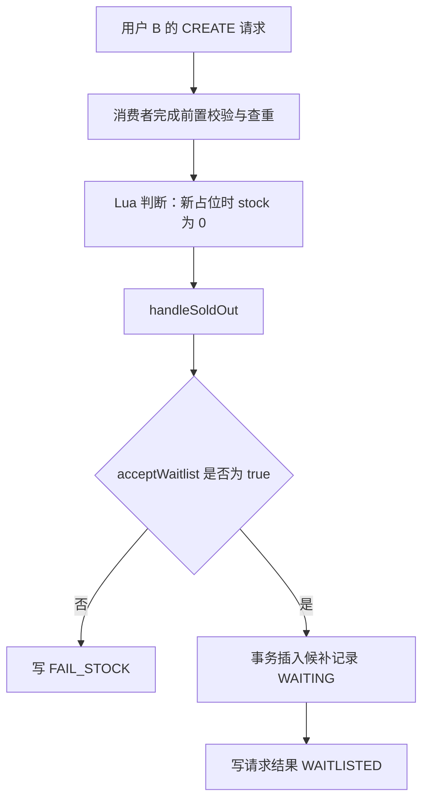

这张图画的是正常售罄分支。候补记录写入失败或冲突时，会走后面的异常处理，不是只要选择 true 就必然插入成功。

<a id="section-4"></a>

### 1.2 true 和 false 在源码中分别意味着什么？

`handleSoldOut()` 的第一段是：

```java
if (!Boolean.TRUE.equals(request.getAcceptWaitlist())) {
    writeRequestStatus(request.getId(), ReservationStatus.FAIL_STOCK);
    return;
}
```

只有明确为 true 才入队；false 或 null 都按不接受处理。HTTP 接口的 `acceptWaitlist` 默认是 true，但消息对象中的 null 不能自行理解为 true。

接受候补时，Service 构造：

```java
ReservationWaitlist waitlist = new ReservationWaitlist()
        .setRequestId(request.getId())
        .setActivityPassId(request.getActivityPassId())
        .setUserId(request.getUserId());
transactionalService.createWaitlist(waitlist);
writeRequestStatus(request.getId(), ReservationStatus.WAITLISTED);
```

真正落库在 [ReservationTransactionalService.createWaitlist()](../src/main/java/com/citypass/service/impl/ReservationTransactionalService.java)：

```java
@Transactional(rollbackFor = Exception.class)
public void createWaitlist(ReservationWaitlist waitlist) throws DuplicateKeyException {
    waitlistMapper.insert(waitlist.setStatus(ReservationStatus.WAITING));
}
```

注意顺序：**先提交 MySQL 的 WAITING 记录，返回后才更新 Redis 的 WAITLISTED 请求结果**。两者不是同一笔跨存储事务。

<a id="section-5"></a>

### 1.3 此时 B 拿到了什么，没有拿到什么？

| 数据 | 入队前 | 正常入队后 |
| --- | --- | --- |
| `tb_reservation_waitlist` | 无 B 的候补记录 | 新行：id=701，request_id=20001，status=WAITING |
| `tb_reservation_order` | 无 B 的订单 | 仍无 B 的订单 |
| MySQL stock | 0 | 0 |
| Redis stock | 0 | 0 |
| Redis holders | 不含用户 22 | 仍不含 22 |
| Redis claim(101,22) | 不存在 | 仍不存在 |
| Redis 请求结果 | PROCESSING | WAITLISTED，TTL 为 5 分钟 |

> **WAITING 只保存等待机会，既没有订单，也没有占用名额。** 不要把“排队成功”当成“预约成功”。

这里 B 的 Lua 返回售罄，尚未写 holder 或 claim。还有另一条入口也会进入 `handleSoldOut()`：Redis 先放行、数据库最终判定 SOLD_OUT。那条路径会先按归属执行 `clearStaleClaim()`，清除本次预占并将 Redis stock 置零，再尝试候补。异常 Redis 数据不能直接套用上表的正常初始条件。

<a id="section-6"></a>

### 1.4 消息重投会不会给 B 排两次？

在活动校验仍通过的前提下，重复 CREATE 通常先被 `findActiveWaitlist()` 找到：同一 requestId 返回已有候补结果，不同 requestId 返回 FAIL_REPEAT。若还是走到 INSERT 并发生唯一冲突，`handleSoldOut()` 会捕获 `DuplicateKeyException`，查已有有效候补：属于同一请求就映射其状态，否则 FAIL_REPEAT。

因此不是根据 MQ 的 msgId 去重，而是结合请求身份、有效候补查询和数据库唯一约束。终态旧请求重放不是一个完整的“原样返回历史结果”接口，不能把所有状态都概括成自动成功续用。

<a id="section-7"></a>

## 2. B 的候补记录存在哪里，哪些字段决定后续命运？

<a id="section-8"></a>

### 2.1 MySQL 表是候补事实来源，不是 Redis List 或 ZSet

实体 [ReservationWaitlist.java](../src/main/java/com/citypass/entity/ReservationWaitlist.java) 映射到 `tb_reservation_waitlist`，表结构见 [citypass.sql](../src/main/resources/db/citypass.sql)。当前没有一个独立的 Waitlist Service 实现整个调度；编排在 `ReservationServiceImpl`，事务在 `ReservationTransactionalService`，选择候选人的 SQL 在 `ReservationWaitlistMapper`。

真正影响本篇的字段如下：

| Java 字段 / 数据库列 | 作用 | B 刚进入 WAITING 时 |
| --- | --- | --- |
| `id` / `id` | 自增候补行主键，后面按它更新选中的行 | 701 |
| `requestId` / `request_id` | 原始预约请求号，**排序依据**，补位后复用为订单号 | 20001 |
| `activityPassId` / `activity_pass_id` | 属于哪个活动通行证的队列 | 101 |
| `userId` / `user_id` | 候补人是谁 | 22 |
| `status` / `status` | 候补生命周期阶段 | WAITING |
| `offeredOrderId` / `offered_order_id` | 已获得机会时关联的新订单 | null |
| `offerExpireTime` / `offer_expire_time` | 已发放机会的支付截止时间 | null |
| `createTime` / `create_time` | 记录创建时间；**不是当前选人排序列** | 创建时写入 |
| SQL 生成列 `active_user_id` | 定义是否占用有效候补唯一组合，实体未手动维护 | 22 |

不要把注释中的“自增主键定义候补顺序”当成实现。真实 Mapper 使用 `request_id` 排序，后面会直接打开 SQL。

<a id="section-9"></a>

### 2.2 两个唯一约束分别防什么重复？

候补表有：

```sql
UNIQUE KEY uk_waitlist_request (request_id),
UNIQUE KEY uk_active_waiter (activity_pass_id, active_user_id)
```

其中生成列定义为：

```sql
active_user_id bigint(20) GENERATED ALWAYS AS (
    CASE WHEN status IN ('WAITING','OFFERED') THEN user_id ELSE NULL END
) STORED
```

第一项限制同一请求号只有一条候补记录；第二项限制同一用户、同一活动最多一条 WAITING 或 OFFERED 记录。ACCEPTED、EXPIRED、CANCELLED 不占用这个非空候补唯一组合。

这不代表 ACCEPTED 后用户能再拿第二张有效订单：那时订单表的有效订单唯一约束仍在保护订单资格。**两张表各自的唯一索引不是一项跨表互斥约束**，关联业务一致性还依赖实际调用与事务。

<a id="section-10"></a>

### 2.3 候补第几名是计算出来的，不是固定字段

[ReservationServiceImpl.waitlistResult()](../src/main/java/com/citypass/service/impl/ReservationServiceImpl.java) 只在 WAITING 时计算 position：

```java
waitlistMapper.countWaitingAhead(
        waitlist.getActivityPassId(), waitlist.getRequestId()) + 1
```

对应 [ReservationWaitlistMapper.countWaitingAhead()](../src/main/java/com/citypass/mapper/ReservationWaitlistMapper.java) 统计同活动、status=WAITING 且 `request_id < 当前请求号` 的行数。

假设 B=20001、C=20002，前面没有其他 WAITING：B 的 position=1，C=2。B 变为 OFFERED 后不再计入 WAITING，C 下一次查询可显示 1。

但 position 是查询时的观察结果，不是持久化 queue_no，也不是“下一秒一定轮到你”的承诺。新入队、状态变化、事务锁定都可能影响实际选择；读取 position 与真正选人不在同一笔事务里。

<a id="section-11"></a>

## 3. WAITING、OFFERED 和订单 UNPAID 到底是什么关系？

<a id="section-12"></a>

### 3.1 一个人会同时有候补记录和订单，二者不矛盾

订单状态回答：**已经分配给你的这份名额，现在是未支付、已支付还是已取消？**

候补状态回答：**你通过候补获取机会的过程，现在是等待、获得限时机会、接受，还是失效或退出？** 因此候补记录不只描述“还没资源”的人，也保存获得资源后的候补历史。

| B 所处阶段 | 候补 status | 订单 | 是否已分配名额 |
| --- | --- | --- | --- |
| 刚入队 | WAITING | 无 | 否 |
| 补位事务提交 | OFFERED | 新订单 20001，status=1 未支付 | 是，限时保留 |
| 支付事务提交 | ACCEPTED | 同一订单 status=2 已支付 | 是 |
| 系统超时关闭事务提交 | EXPIRED | 同一订单 status=4 已取消 | 否，可能转给 C |
| 主动退出或取消 | CANCELLED | WAITING 退出时无订单；OFFERED 取消时旧订单为 4 | 不再持有本次机会 |

`OFFERED` 不是订单表的状态；`EXPIRED` 也不是订单新增的数字状态。

<a id="section-13"></a>

### 3.2 完整候补状态图必须补上 CANCELLED

[ReservationStatus.java](../src/main/java/com/citypass/utils/ReservationStatus.java) 和事务方法共同支持这些路径：

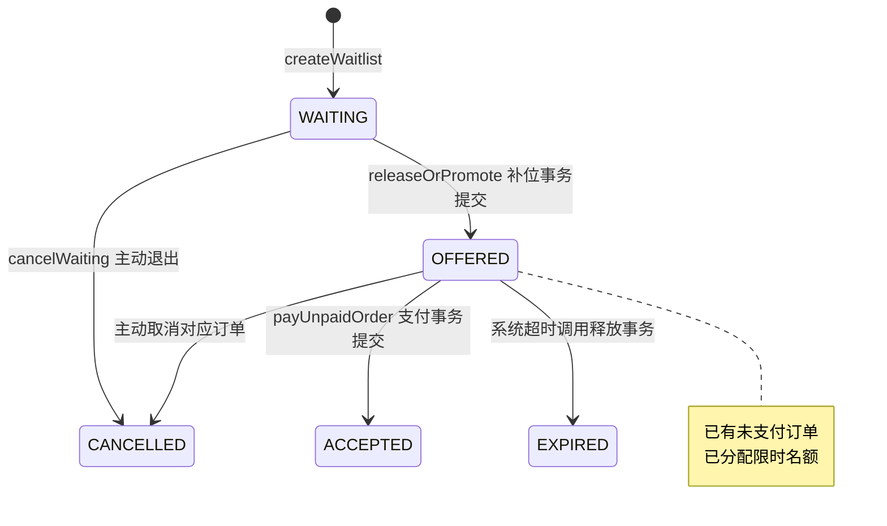

简历中的 `WAITING → OFFERED → ACCEPTED / EXPIRED` 抓住了主干，但不是完整状态集合，还需要在文档里补上主动取消路径。

**OFFERED 是否已经预约成功？** 按项目查询语义，补位订单 status=1 会返回 RESERVED，已经拿到预约资格；但它仍未支付，不是最终接受。不能简单写成“OFFERED 完全没预约成功”，也不能说它已经等同于 ACCEPTED。

B 不会直接 WAITING→ACCEPTED，因为系统分配机会不等于替用户支付。中间的 OFFERED 把资源分配与用户接受拆开，给未及时处理的机会留下继续转交的出口。

<a id="section-14"></a>

## 4. A 取消了：第二篇的 winner 怎样进入本篇？

<a id="section-15"></a>

### 4.1 交接发生在 releaseOrPromote 的同一笔事务里面

主动取消路径：`ReservationController.cancel()` → `ReservationServiceImpl.cancelOrder()` → `ReservationTransactionalService.releaseOrPromote()`。

超时路径：`OrderMQConsumer` 的 TIMEOUT 分支 → `ReservationServiceImpl.cancelTimeoutOrder()` → 同一个 `releaseOrPromote()`。

第二篇已解释，方法先读旧订单和必要归属，再用 `status=1` 条件把 A 订单改成 4。更新 0 行就 SKIPPED，后面本篇的资源调度不会执行。

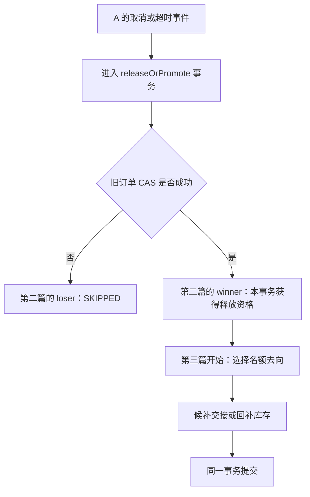

**⚠️ 容易讲错**：不是 CAS 在外面成功提交了，再调用 `releaseOrPromote()`。CAS 就在该方法里；它成功后只是本事务暂时获得迁移资格，后续补位失败仍可能让 A 的取消一起回滚。A 最终失去名额要以整笔事务提交为准。

<a id="section-16"></a>

### 4.2 从这一行往下读，问题已经变了

第二篇问的是“我能不能关闭 A”。现在问的是“如果本次关闭成立，A 原来占用的那一份资源应该归谁”。

我们假定 A 是正常直接预约，CAS 已命中一行，但事务还没提交。B、C 的记录都已在 MySQL 中，status=WAITING。此时最直觉的做法是库存加一，让别人再来抢。

这个做法为什么不是当前补位分支的选择？

<a id="section-17"></a>

## 5. 一个名额释放以后，为什么不直接 stock + 1？

<a id="section-18"></a>

### 5.1 先回公共池，再抢一次，会重新打开竞争

假设取消提交后把名额公开放回可竞争库存，B、C 和新来的 D 都能够重新预约。B 虽然等待更久，却可能被 D 抢走。

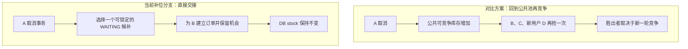

这里对比的是**暴露给新请求的公共资源窗口**。不能说任何库存 `+1/-1` 都必然不正确；如果另有严密事务与调度约束，也可以设计正确系统。当前源码选择更直接表达“把已有分配交给下一候补”的方式。

<a id="section-19"></a>

### 5.2 Resource Handoff 的含义要落到数据上

Resource Handoff（资源交接）在这里是 Ownership Transfer（所有权转移）：原持有人 A 退出，本次资源在数据库事务里重新分配给 B，而不是先公开卖给所有人。

| 观察对象 | 交接前 | 交接事务提交后 |
| --- | --- | --- |
| A 订单 | 未支付，占名额 | 已取消，不再占名额 |
| B 候补 | WAITING，不占名额 | OFFERED，已获得机会 |
| B 订单 | 不存在 | 新建未支付订单，占名额 |
| DB stock | 0 | 仍为 0 |
| 这两位用户占用的总份数 | A 占 1，B 占 0 | A 占 0，B 占 1 |

**不是少扣了一次库存**：B 使用的是 A 刚交出的那一份，已经计入占用总量。如果再对 B 扣数据库 stock，会将同一份资源当成额外新售出一次；在 stock=0 的示例里甚至根本无法补位。

`Resource Handoff` 是架构职责总结，源码没有 `ResourceHandoff` 框架或类。核心事实由旧订单、新候补状态和新订单共同表达，也没有给每一张物理座位单独建立 slot_id；“A 的那一份”是按数量守恒理解的逻辑名额。

<a id="section-20"></a>

### 5.3 到这里先校正第三条简历的口径

| 简历关键词 | 当前可以成立的解释 |
| --- | --- |
| 候补状态机 | MySQL 候补状态 WAITING/OFFERED/ACCEPTED/EXPIRED，加主动 CANCELLED |
| 按候补顺序 | 按 request_id 升序，在满足 WAITING 且可锁定的候选里取一条，不是严格全局 FIFO |
| 事务内状态推进与交接 | 旧订单取消、关联候补变化、新订单与任务登记处于同一 MySQL 事务 |
| 直接转移名额 | 成功补位分支不对 DB stock 执行 +1 或 -1 |
| 避免二次抢占 | 该份资源不经补位分支重新暴露为公共库存，减少额外竞争窗口 |

Redis 归属更新不在这个 MySQL 事务内；不把“事务内 Handoff”说成 Redis 与 MySQL 同时原子提交。下面继续读真正选 B 的代码。

<a id="section-21"></a>

## 6. 精读 releaseOrPromote：沿真实顺序找到下一位

源码位置：[ReservationTransactionalService.releaseOrPromote()](../src/main/java/com/citypass/service/impl/ReservationTransactionalService.java)。下面的步骤从旧订单 CAS 已成功开始，仍处于同一个 `@Transactional(rollbackFor = Exception.class)` 中。

<a id="section-22"></a>

### 6.1 Step 1：如果旧订单本身来自候补，先结束它的旧候补机会

A 是 DIRECT，跳过这一段；以后 B 超时再交给 C 时，就会执行：

```java
if (ReservationStatus.SOURCE_WAITLIST.equals(oldOrder.getSource())) {
    int waitlistChanged = waitlistMapper.update(null,
            new UpdateWrapper<ReservationWaitlist>()
                    .set("status", waitlistTerminalStatus)
                    .eq("request_id", oldOrder.getId())
                    .eq("status", ReservationStatus.OFFERED));
    if (waitlistChanged != 1) {
        throw new IllegalStateException("候补订单与候补状态不一致: " + orderId);
    }
}
```

主动取消传入 `CANCELLED`，系统超时传入 `EXPIRED`。要求旧记录仍是 OFFERED，恰好更新一行，否则异常回滚；不是发现不匹配就忽略并继续发下一份机会。

<a id="section-23"></a>

### 6.2 Step 2：判断当前活动还能不能补位

代码读取 `LimitedPassStock`，判断：

```java
boolean canPromote = pass != null
        && pass.getEndTime() != null
        && pass.getEndTime().isAfter(LocalDateTime.now());
```

它看的是库存记录存在、活动结束时间非空且晚于当前应用时间。这个时刻检查通过，才去找候补。

不能将它扩写成“完整校验候补用户的全部资格”。这里没有重新读 ActivityPass 的 status/type，也没有检查候选人的独立有效期。`currentRound` 被读取用于新订单的 `promotionRound+1`，**没有最大补位轮次判断**；注释提到轮次限制，但当前代码没有实现。

也不能声称所有补位事务都一定在活动结束前提交：结束时间在这里检查，后续事务执行或锁等待仍可能耗时。

<a id="section-24"></a>

### 6.3 Step 3：真正的下一候补查询长什么样？

[ReservationWaitlistMapper.selectNextForUpdate()](../src/main/java/com/citypass/mapper/ReservationWaitlistMapper.java) 的真实 SQL 是：

```sql
SELECT * FROM tb_reservation_waitlist
WHERE activity_pass_id = #{activityPassId} AND status = 'WAITING'
ORDER BY request_id LIMIT 1 FOR UPDATE SKIP LOCKED
```

逐项对应到我们的故事：

| SQL 片段 | 对 B / C 的实际意义 |
| --- | --- |
| `activity_pass_id = ...` | 只处理活动 101 的候补，不跨活动拿人 |
| `status = 'WAITING'` | 已 OFFERED、已接受、已过期或退出的记录不属于本次候选集合 |
| `ORDER BY request_id` | 默认升序，20001 排在 20002 前，不按候补主键 701/702 排 |
| `LIMIT 1` | 一次只选择一个候选，不循环把整个队列都处理掉 |
| `FOR UPDATE` | 这是锁定读取，选中的候补行在本事务中受到行锁保护 |
| `SKIP LOCKED` | 碰到已被其他事务锁定的行，就跳过这些行去找可锁定候选 |

配套普通索引是 `idx_waitlist_pick(activity_pass_id, status, request_id)`，与过滤和排序字段相匹配。实际执行计划和锁范围仍需数据库实测，不能只看索引就宣布永无锁等待。

<a id="section-25"></a>

### 6.4 B 为什么排在 C 前面？“顺序”到底保证到哪一步？

当 B、C 都已经提交为 WAITING，B 的 request_id 更小且没有被其他事务锁住，按这条 SQL，B 会优先被选择。

但“B 一定先于 C 获得并完成机会”不是无条件事实：B 被锁住时，另一个事务可以跳过 B 选 C；B 所在事务也可能最后回滚，而 C 已提交。

FIFO（First In, First Out，先进先出）在这里最多是有条件的近似描述。更准确的口述是：

> **按 request_id 升序选择当前可锁定的 WAITING 记录，用 SKIP LOCKED 支持并行领取；不承诺严格全局 FIFO 或严格完成顺序。**

还有一个容易忽视的来源：requestId 在 HTTP 入口生成，候补却等 MQ 消费后才落库。因此 ID 数字顺序不是候补行事务提交顺序。`RedisIdWorker` 还组合了应用时间和 Redis 自增计数，不能仅凭“注释说单调”就推导出跨实例、任意时钟条件下的全局实时排序保证。

`SKIP LOCKED` 的跳行语义及其适合队列式表、但不能视为完整一致视图的性质，可对照 [MySQL 官方锁定读取说明](https://dev.mysql.com/doc/refman/8.3/en/innodb-locking-reads.html)。

<a id="section-26"></a>

### 6.5 Step 4：找到了 B，先把候补变成 OFFERED

假定查询返回 B 的候补行 id=701。代码先生成 `expiresAt = LocalDateTime.now().plusMinutes(offerMinutes)`，再更新：

```java
int offered = waitlistMapper.update(null,
        new UpdateWrapper<ReservationWaitlist>()
                .set("status", ReservationStatus.OFFERED)
                .set("offered_order_id", candidate.getRequestId())
                .set("offer_expire_time", expiresAt)
                .eq("id", candidate.getId())
                .eq("status", ReservationStatus.WAITING));
if (offered != 1) {
    throw new IllegalStateException("候补记录已被并发修改: " + candidate.getRequestId());
}
```

这里有两个不同 ID：WHERE 用候补行主键 701，offered_order_id 用业务请求号 20001。期望状态仍为 WAITING，避免直接覆盖一个已经不属于待分配集合的记录。

FOR UPDATE 保护选取期间的并发访问；expected-status 条件与影响行数检查确认这次状态推进符合预期。不要因为有锁，就把源码确实存在的 CAS 式状态条件漏掉。

<a id="section-27"></a>

### 6.6 Step 5：紧接着插入 B 的新订单，不重新抢 stock

源码在候补状态更新后构造并插入：

```java
ReservationOrder promoted = new ReservationOrder()
        .setId(candidate.getRequestId())
        .setActivityPassId(candidate.getActivityPassId())
        .setUserId(candidate.getUserId())
        .setStatus(ORDER_STATUS_UNPAID)
        .setSource(ReservationStatus.SOURCE_WAITLIST)
        .setPromotionRound(currentRound + 1)
        .setOfferExpireTime(expiresAt);
orderMapper.insert(promoted);
```

这里没有调用第一篇的 `createOrder()`：后者会尝试扣新的库存，而这里是交接已有名额。也没有重新发布 CREATE 让 B 去竞争 Redis stock。

| B 新订单字段 | 实际值 |
| --- | --- |
| id | 20001，即原候补请求号 |
| userId / activityPassId | 22 / 101 |
| status | 1，未支付 |
| source | WAITLIST |
| promotionRound | 若旧 A 为 0，新 B 为 1 |
| offerExpireTime | 与 B 候补行写入的同一个 expiresAt |

B 的订单是**新插入**的，A 的订单仍保留为取消记录。不是把 A 订单的 user_id 从 11 改成 22。

<a id="section-28"></a>

### 6.7 Step 6：登记两个后续动作，再返回 PROMOTED

新订单插入后，按真实顺序：

1. `enqueueTimeout(promoted.getId())`：登记 B 的 `ORDER_TIMEOUT`，业务键 `order-timeout:20001`。
2. 构造 `ReservationClaimTransfer`，包含活动、旧用户、旧订单、新用户、新订单。
3. 登记 `TRANSFER_RESERVATION_CLAIM`，业务键 `transfer-reservation:10001`。
4. 返回 `ReleaseResult(PROMOTED, oldOrder, promoted)`，事务正常退出并提交。

两项登记都写 `tb_reliable_task`，不是在事务内直接执行 Redis，也不是已经立刻发出 TIMEOUT 消息。

成功 PROMOTED 分支在这里 return，**根本不会走到下面的 `stock = stock + 1`**。这个控制流正是“有候补时库存不增不减”的直接证据。

<a id="section-29"></a>

## 7. 两个订单同时释放，为什么不会都把机会给 B？

<a id="section-30"></a>

### 7.1 先分清两个层次的竞争

现在另一个用户 D 也持有一份名额，A 取消与 D 超时几乎同时发生。A、D 是不同订单，因此各自的订单 CAS 都可能成功。这不是第二篇“同一订单只能一个事件成功”的问题。

新问题是：**两个合法释放者，会不会同时从候补表拿到同一个 B？**

如果只是 `ORDER BY request_id LIMIT 1` 的普通查询，两个线程确实可能都看见 B。排序只决定优先级，不会自动授予独占处理权。

<a id="section-31"></a>

### 7.2 Case 3：一个可以发生的并发执行过程

假设 B、C 都是已提交 WAITING 记录，B 的请求号更小；活动仍可补位，没有其他异常：

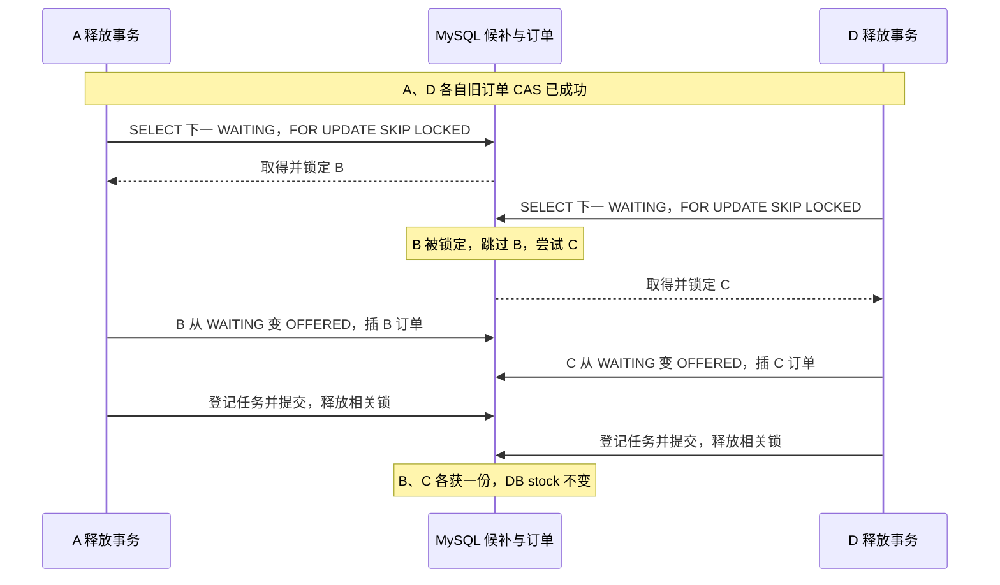

图是符合源码的一种执行顺序，不代表整个方法无锁等待或不可能死锁。`SKIP LOCKED` 处理的是选人查询遇到的行级锁，其他 SQL、唯一索引和事务仍可能发生等待或异常。

如果第二个事务在第一个已经提交后才查询，B 已经是 OFFERED，也会被 `status='WAITING'` 过滤掉，再选 C。

<a id="section-32"></a>

### 7.3 四种机制怎样配合，而不是各自重复保险？

| 机制 | 保护哪个事实 |
| --- | --- |
| 旧订单 status=1 的 CAS | 同一份旧订单资源不被重复释放；A 与 D 各自判断 |
| 候补查询 FOR UPDATE SKIP LOCKED | 并行释放者不同时正常锁定领取同一候补行 |
| WAITING→OFFERED 条件更新、影响行数=1 | 选到的候补确实完成本次合法状态推进 |
| 同事务与订单唯一约束 | 状态、订单、任务共同成立；同请求订单主键和同用户有效订单约束兜底 |

> **避免重复补位，不是因为 B“在列表最前面”，而是选择、锁定、状态推进和建单连在同一笔数据库事务中。**

<a id="section-33"></a>

### 7.4 代价：B 可以被跳过，甚至“没选到”也不等于队列空

设只有 B 一条 WAITING，恰好被其他事务锁住。当前 `SKIP LOCKED` 查询可能返回 null，即使数据库里确实存在 B。源码把这种返回与真正空队列一样处理，走回补库存分支。

如果另一个事务后来回滚，B 又留在 WAITING，而本次资源可能已回公共库存。这说明当前设计不能承诺“只要存在任何 WAITING，就绝不回公共库存，也绝不会有新用户插入竞争”。

这是吞吐取舍与实现分支共同造成的边界，不应该隐藏为“严格公平调度”。正常选到候补时的直接交接仍然成立，但公平性是有限的。

<a id="section-34"></a>

## 8. Before / Transaction / After：A 的名额到底怎样变成 B 的机会？

<a id="section-35"></a>

### 8.1 Case 1：正常补位的完整数据库变化

| 数据 | 事务前 | 本次事务内操作 | 成功提交后 |
| --- | --- | --- | --- |
| A 订单 10001 | status=1，DIRECT | 条件更新为 4 | A 取消，不再占有效名额 |
| B 候补行 701 | WAITING，request_id=20001 | 更新为 OFFERED，写订单关联与 expiresAt | B 获得限时机会 |
| B 订单 20001 | 不存在 | INSERT status=1，source=WAITLIST，round=1 | B 成为新的名额持有人 |
| C 候补行 702 | WAITING | 不操作 | 继续 WAITING |
| DB stock | 0 | **没有对该库存执行增减** | 0 |
| B 超时任务 | 不存在 | 登记 ORDER_TIMEOUT | 后续可投递 |
| A→B Redis 转移任务 | 不存在 | 登记 TRANSFER_RESERVATION_CLAIM | 后续可执行 |

本例 A 是 DIRECT，因此没有 A 的候补记录需要结束。B 以后再交给 C，事务还会更新 B 原来的候补状态。

<a id="section-36"></a>

### 8.2 为什么先写 OFFERED、后插订单，却不会留下半个机会？

在 Java 执行顺序上确实先更新 B 的候补，再 INSERT B 订单；但这些 SQL 在同一个事务内，不能把两个中间步骤当成两次独立业务提交。

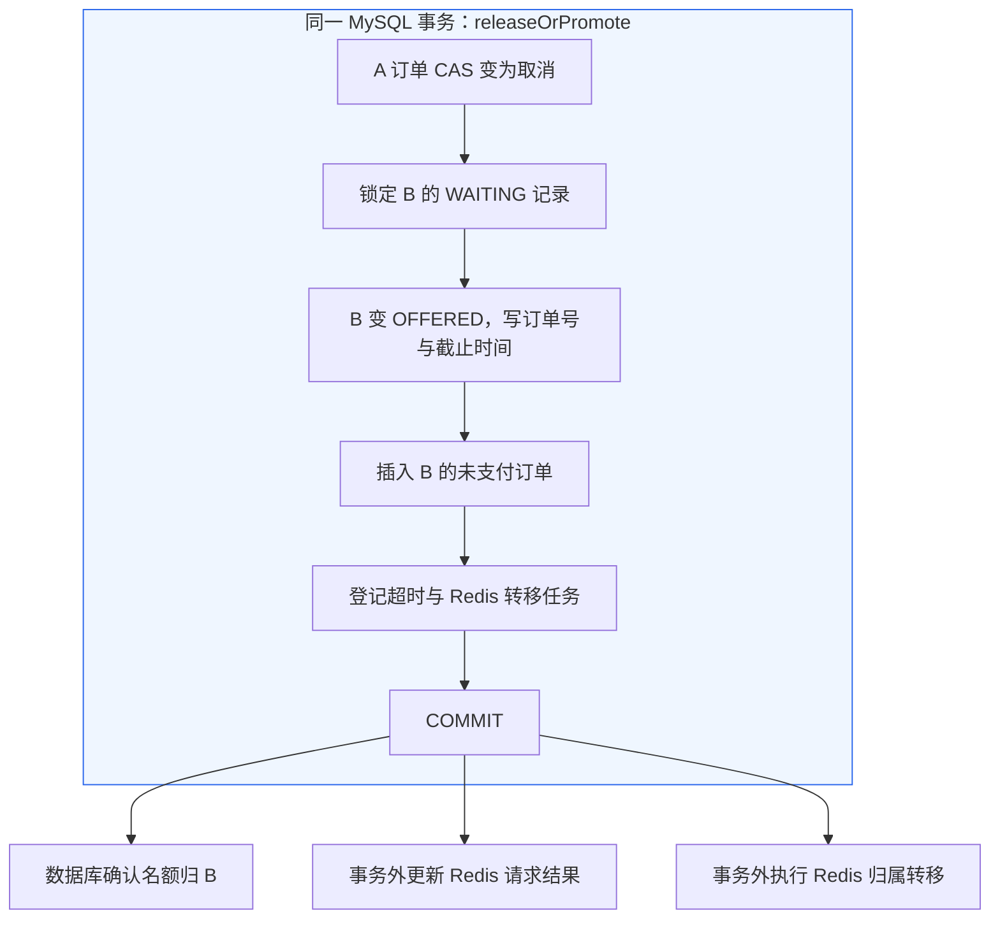

**事务前后保持的关系**：成功补位不能只留下 OFFERED 而没有订单，也不能成功插出补位订单却仍让同一候补保持 WAITING。

这里说的是本事务共同提交的业务事实，不是承诺任意客户端分多次 SELECT 都能跨时刻得到完全一致快照，也不是全系统所有写入都自动遵守它。

<a id="section-37"></a>

### 8.3 B 的订单 INSERT 失败时，A 的取消也会回滚

假设 B 因已有有效订单而撞 UNIQUE，或者订单主键冲突，`orderMapper.insert(promoted)` 抛出 `DuplicateKeyException`。

在 `releaseOrPromote()` 中没有 catch 后跳到下一人的逻辑。异常跨出 Spring 事务，A 的本次取消与 B 的 OFFERED 更新一起回滚：

| 原本担心的半状态 | 当前事务语义下的结果 |
| --- | --- |
| A 已取消，但名额没人接 | A 本次取消尚未成功提交，会回滚 |
| B 已 OFFERED，却没有订单 | 本次 OFFERED 更新回滚，恢复此前已提交的 WAITING |
| 任务写了一半 | 本次未提交新任务也回滚 |

如果后面可靠任务登记抛异常，同样不能保留部分数据库交接。Repository 的 `enqueue()` 实际用 `INSERT IGNORE`，已有同业务键可被忽略，不等于每次都强制新增一行；本节“异常回滚”针对真正抛出的异常。

**💡 为什么这样设计？**

A 放弃这份资源、B 获得机会、新订单与后续处理意图，要么作为一件数据库业务成立，要么不成立。否则“谁拥有这一份”就无法只从已提交记录中解释清楚。

<a id="section-38"></a>

## 9. 没有选到候补，名额才怎样回到库存？

<a id="section-39"></a>

### 9.1 Case 2：真正没有等待者时恢复公共库存

如果活动可补位但查不到候选，或者当前活动条件不允许补位，代码走到方法末尾：

```java
int stockRows = stockMapper.update(null,
        new UpdateWrapper<LimitedPassStock>()
                .setSql("stock = stock + 1")
                .eq("activity_pass_id", oldOrder.getActivityPassId()));
if (stockRows != 1) {
    throw new IllegalStateException("活动通行证不存在，无法恢复库存: " + oldOrder.getActivityPassId());
}
```

接着登记 `RESTORE_REDIS_STOCK`，业务键 `restore-redis-stock:10001`，返回 RELEASED。这仍和旧订单取消处于同一数据库事务中。

正常成功后，A 的订单为 4，DB stock 从 0 变 1；后续 Redis 恢复任务将 Redis stock 加 1，并在归属匹配时清理 A 的 holder / claim。Lua 恢复标记防止正常任务重试重复回补，详细重试机制留第四篇。

<a id="section-40"></a>

### 9.2 分支图必须把“可补位条件”和“可选记录”都画出来

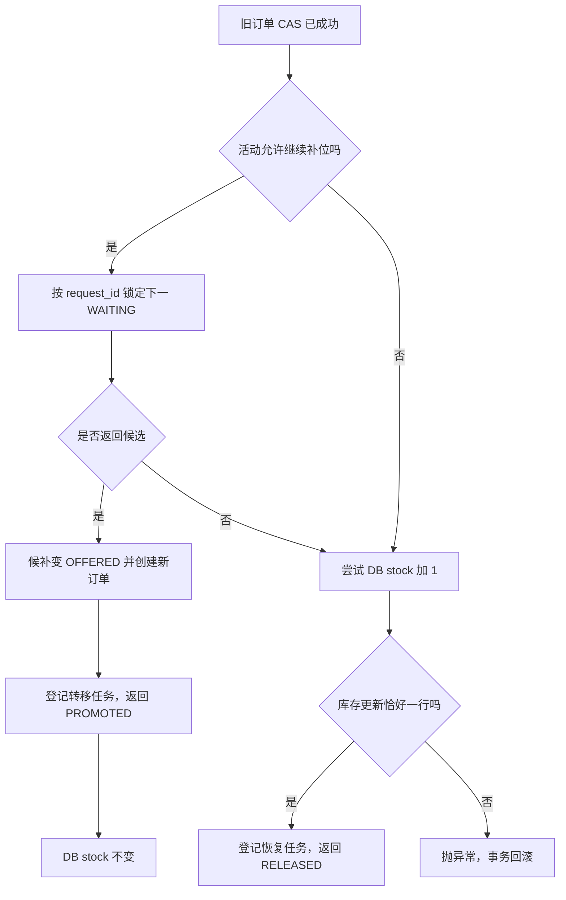

“否”不只有队列为空：也可能是当前候选全被锁住。若 pass 记录不存在，虽然进入恢复分支，库存更新也会是 0 行并抛异常，不能描述成必定恢复成功。

<a id="section-41"></a>

### 9.3 活动结束但仍有 WAITING，当前也不继续交接

`canPromote` 不通过时直接跳过选人，尝试恢复库存。剩余 WAITING 不会因为这一次释放自动批量改成 EXPIRED，源码也没有在这个方法里遍历清理整条候补队列。

活动库存账面回补不代表重新开放预约：新请求仍要经过活动时间校验。

因此准确归纳是：

> **在活动允许补位且本次锁定查询选到候选时，优先直接交接；否则尝试恢复公共库存。**

“有候补必交接、无候补才回库存”是帮助理解正常场景的简述，不能当成覆盖所有并发与结束条件的源码规则。

<a id="section-42"></a>

## 10. MySQL 完成交接后，Redis 怎样迁移归属？

<a id="section-43"></a>

### 10.1 先区分库存数量和名额归属

A 取消并把名额交给 B 后，MySQL 中 A 的订单已取消，B 已有待支付订单。Redis 还需要把“谁正在持有名额”从 A 改成 B。

这两件事不是同一条 SQL，也不在同一个本地数据库事务里。事务中写入 `TRANSFER_RESERVATION_CLAIM` 任务，后续任务执行器调用 [transfer-reservation.lua](../src/main/resources/transfer-reservation.lua)。

| Redis 数据 | 交接前的正常情况 | 交接后的目标 |
|---|---|---|
| `reservation:stock:{passId}` | 0 | 仍为 0 |
| `reservation:holders:{passId}` | 包含 A | 移除 A，加入 B |
| `reservation:claim:{passId}:{A}` | A 的旧订单号 | 删除匹配旧订单的 claim |
| `reservation:claim:{passId}:{B}` | 尚未持有 | B 的新订单号，也就是 B 的候补 requestId |
| `reservation:transfer:{oldOrderId}` | 不存在 | 写入幂等标记 |

表中的 `{...}` 是参数占位说明，实际字符串拼接不额外添加这些花括号。

<a id="section-44"></a>

### 10.2 五个业务参数把交接双方说清楚

`ReservationClaimTransfer` 携带：

```text
activityPassId
oldUserId
oldOrderId
newUserId
newOrderId
```

执行器另外提供幂等标记的有效期。脚本参数依次是：标记 TTL、活动 ID、旧用户 ID、旧订单 ID、新用户 ID、新订单 ID。

在我们的故事里，这表示：同一活动下，把 A 的订单 `10001` 对应的 Redis 归属转给 B 的订单 `20001`。脚本并不去查询 MySQL 候补表，也不再从队列里选 B。

<a id="section-45"></a>

### 10.3 Lua 的实际执行顺序

关键代码如下，省略了键名构造：

```lua
if redis.call('exists', KEYS[1]) == 1 then
    return 0
end

if redis.call('get', oldClaimKey) == oldOrderId then
    redis.call('srem', holderKey, oldUserId)
    redis.call('del', oldClaimKey)
end

redis.call('sadd', holderKey, newUserId)
redis.call('set', newClaimKey, newOrderId)
redis.call('set', KEYS[1], '1', 'EX', ARGV[1])
return 1
```

逐句理解：

1. 如果这笔旧订单的交接已经执行过，直接返回 `0`。
2. 只有 A 当前的 claim 仍然等于旧订单号，才移除 A 的 holder 和 claim。这样可以避免把 A 后来获得的另一个订单归属直接删掉。
3. 把 B 加入 holder 集合，并把 B 的 claim 设置为新订单号。
4. 写入交接幂等标记，正常首次执行返回 `1`。

**这个脚本没有任何库存加减命令。** 它迁移的是持有人和订单归属；数据库交接成功后仍然只有一个已占用名额。

<a id="section-46"></a>

### 10.4 按场景读脚本，避免过度理解“幂等”

| 场景 | 源码实际行为 | 应当怎样理解 |
|---|---|---|
| A 的 claim 正好是旧订单，B 尚无 claim | 删除 A，添加 B，写标记，返回 1 | 正常交接 |
| 同一交接任务重复执行，标记仍在 | 直接返回 0 | 在标记有效期间抑制重复执行 |
| A 的 claim 不存在或已不是旧订单 | 不删除 A 的数据，但仍添加 B、设置 B 的 claim | 旧归属不匹配并不会让整个交接失败 |
| B 已有另一个 claim | `SET` 会覆盖目标 claim | 没有校验目标订单版本或目标用户当前数据库状态 |
| Redis 执行抛出错误 | Java 任务执行失败，进入失败处理 | 不能当成成功交接 |

调用方为标记配置了 **7 天 TTL**。因此准确说法是“带有效期的任务幂等标记”，不是无限期去重。

Lua 保证脚本执行期间其他 Redis 命令不会穿插到中间；它并不提供数据库那样的错误自动回滚。脚本中途出现运行错误时，不能假定前面已执行的写入全部撤销。参见 [Redis 脚本执行说明](https://redis.io/docs/latest/develop/programmability/eval-intro/) 与 [Redis 对回滚的解释](https://redis.io/blog/you-dont-need-transaction-rollbacks-in-redis/)。

<a id="section-47"></a>

### 10.5 数据库成功、Redis 暂时失败时，哪些事已经发生？

此时可能出现：A 的取消、B 的 OFFERED、B 的新订单和任务记录已经提交，但 Redis 仍暂时保留旧归属。

数据库提交后，`publishReleaseResult` 还会更新请求结果缓存：旧请求写 `CANCELLED`，新请求写 `RESERVED`。**这个方法名不表示向用户发送短信、邮件或推送，也不是在这里发送候补建单 MQ。**

查询预约结果时，服务先按 requestId 找订单，再找候补记录，最后才使用 Redis 请求状态。因此 B 的新订单一旦存在，通常进入订单结果分支；不能保证响应还带有候补分支的 `waitlistStatus` 或 `position`。

本篇只记住边界：数据库事务保证业务状态和任务记录一起提交；任务执行器负责之后尝试迁移 Redis 归属。任务失败、重试和最终修复的完整机制留到第四篇。

还有一个不能夸大的地方：**同一任务幂等，不等于多次交接任务天然有序。** 从源码推断，若 A→B 的任务延后，而 B→C 先执行，迟到的 A→B 仍可能重新设置 B 的 claim；当前脚本没有目标版本校验。这里是代码可推导的风险，未宣称已复现，也不能声称现有机制对任意乱序都保证归属正确。

<a id="section-48"></a>

## 11. B 获得 OFFERED 后：支付、退出和超时接力

<a id="section-49"></a>

### 11.1 OFFERED 已经占位，但还没有完成支付

B 原本只有 WAITING 记录；补位事务提交后，同时拥有：

- 候补记录：`OFFERED`；
- 新订单：`status = 1`，即待支付；
- 同一个 `offerExpireTime`：候补表和订单表各存一份；
- `source = WAITLIST`，`promotionRound = oldRound + 1`。

因此不能把 OFFERED 解释为“仅仅收到通知，还没有占名额”。名额已经给 B 留住，B 需要在有效时间内完成当前项目实现的支付确认。

<a id="section-50"></a>

### 11.2 B 支付：订单和候补状态一起推进

`payOrder` 调用 `payUnpaidOrder`，后者在数据库事务中：

1. 读取并确认订单属于当前用户。
2. 条件更新订单为已支付：同时要求订单仍为 `status = 1`，且 `offer_expire_time > 当前应用时间`。
3. 如果订单来源为 WAITLIST，条件更新对应候补记录：`OFFERED → ACCEPTED`。
4. 候补状态更新不是 1 行就抛异常，回滚本次订单支付更新。

成功后，服务将请求结果缓存写成 `PAID`。这里是本项目的本地支付状态推进，不是已经集成第三方支付网关、扣款或支付回调。

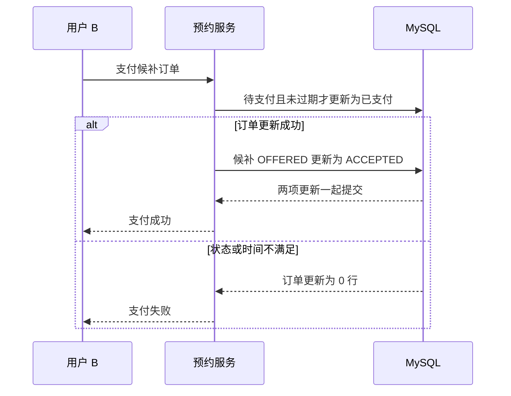

上图展示正常候补状态匹配的支付路径；若候补更新失败，实际事务会回滚，不能走“提交成功”分支。

<a id="section-51"></a>

### 11.3 B 没支付：同一个释放方法继续把名额交给 C

超时处理调用 `cancelTimeoutOrder(B订单号)`，再进入 `releaseOrPromote`，传入候补终态 `EXPIRED`。

这一次的旧订单来自 WAITLIST，所以事务既要取消 B 的待支付订单，又要把 B 的候补记录 `OFFERED → EXPIRED`。随后重新查询当前活动下一名可锁定的 WAITING 用户。选中 C 时：

| 数据 | B 获得补位后 | B 超时、C 接力提交后 |
|---|---|---|
| B 候补 | OFFERED | EXPIRED |
| B 订单 | 待支付 | 已取消，status 4 |
| C 候补 | WAITING | OFFERED |
| C 订单 | 无 | 新建待支付订单 |
| C 的轮次 | 无 | 在 B 订单轮次上加 1 |
| 公共库存 | 0 | 仍为 0 |

Redis 归属迁移任务相应变成 B→C。C 的订单仍直接使用 C 自己的候补 requestId，不沿用 B 的订单号。

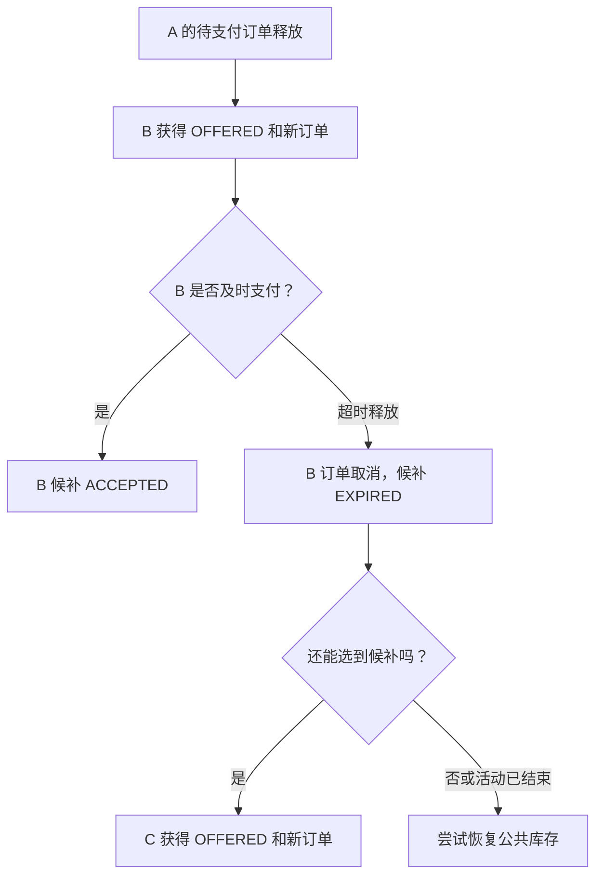

<a id="section-52"></a>

### 11.4 B 主动退出，与系统超时不同

`cancelWaitlist` 根据当前候补状态分流：

| 当前状态 | 操作 | 资源变化 |
|---|---|---|
| WAITING | `cancelWaiting` 条件更新为 CANCELLED | 没有占位，不需要释放库存 |
| OFFERED | 转调 `cancelOrder(offeredOrderId)` | 取消已分配的订单，继续补位或恢复库存 |
| 其他状态 | 返回当前状态不允许退出 | 不执行上述退出流程 |

主动取消 OFFERED 订单时，候补终态是 `CANCELLED`；系统超时释放时才是 `EXPIRED`。

如果读取时还是 WAITING，执行取消前已被提升为 OFFERED，`cancelWaiting` 的条件更新会得到 0 行。当前代码返回“候补状态已变化，请刷新后重试”，不会自动再切到取消新订单的路径。

<a id="section-53"></a>

### 11.5 关于截止时间和轮次，源码还有这些边界

`offerMinutes` 默认 15 分钟，每次补位都按当前时间重新计算期限。订单和候补记录使用同一个期限值；它并没有被裁剪到活动结束时间。

实际补位资格检查只要求活动库存记录存在、结束时间非空且仍晚于检查时的当前时间。不能据此说新 offer 必然在活动结束前到期，也不能说方法重验了活动全部业务属性。

`promotionRound` 记录接力次数，但当前方法没有实现最大轮次限制。注释提及上限不等于代码已经执行上限判断。

超时扫描器会寻找已到期的待支付订单，扫描默认间隔为 60 秒；另有延迟消息触发超时处理。**`releaseOrPromote` 本身不重新验证截止时间**，它依赖调用入口触发时机。默认 offer 时长与默认延迟配置相配，不代表修改 `offerMinutes` 后延迟消息会自动跟着改变。

最后，WAITING 没有因为“排队超过 15 分钟”就自动过期。本项目的 offer 期限针对获得名额后的订单；当前这套逻辑没有为所有 WAITING 记录实现统一的自动到期清理。

<a id="section-54"></a>

## 12. 六种运行情况，把成功路径和边界串起来

<a id="section-55"></a>

### 12.1 情况一：A 释放，B 正常接力

A 的待支付订单成功取消；活动仍允许补位；SQL 选中 B；B 从 WAITING 推进到 OFFERED，并创建新订单。数据库库存不变，事务写入超时任务和归属迁移任务。后续 Lua 把 Redis 归属从 A 迁给 B。

这是简历里 Resource Handoff 的核心成功路径。

<a id="section-56"></a>

### 12.2 情况二：本次没有选到候补

当前没有 WAITING，或者候选都被其他事务锁定，选人查询可能返回空。活动已结束时则不执行选人查询。

释放方法走库存恢复分支：MySQL 库存加 1，写入 Redis 库存恢复任务；若库存更新失败则回滚。这里用的是恢复库存脚本，不是归属迁移脚本。

<a id="section-57"></a>

### 12.3 情况三：两笔不同订单同时释放

两笔旧订单分别经过自身的取消条件更新。第一笔释放事务锁定 B；第二笔查询跳过已锁定的 B，可以选择 C。

正常成功提交时，不会让 B 同时拿到这两次补位。不过它也意味着 C 可能先于 B 提交，不能宣称严格 FIFO；如果第二次查询看不到可锁定候选，还可能回到库存恢复分支。

<a id="section-58"></a>

### 12.4 情况四：B 看起来排在前面，却无法完成建单

要把不同原因拆开：

| B 的实际情况 | 当前实现怎样处理 |
|---|---|
| 查询前已经不是 WAITING | SQL 条件不匹配，不再作为本次候选 |
| B 的候补行被另一事务锁定 | `SKIP LOCKED` 跳过，可继续选其他行 |
| 成功选到 B，但推进 OFFERED 不是 1 行 | 抛异常，回滚 |
| B 已有同活动有效订单，插入新订单违反唯一约束 | 插入失败，整个释放事务回滚 |
| 新订单 ID 冲突等其他插入错误 | 同样回滚，不自动改选下一人 |

**“跳过锁定行”不等于“遇到任何无效候选都跳过”。** 该方法没有“建单失败后继续选 C”的循环，也没有预先查询 B 是否已有有效订单的兜底分支。

数据库唯一约束保护了“不为同一用户创建重复有效订单”，但坏候选可能反复影响队首推进。将它隔离、修复或按明确规则终止后再选下一人，属于后续改进，不能算作当前已完成能力。

<a id="section-59"></a>

### 12.5 情况五：B 获得 offer 后超时

超时入口再次使用同一个释放事务：B 订单取消，B 候补 EXPIRED；有可选 C 则创建 C 的订单，否则尝试恢复库存。没有额外的“把 B 重新放回 WAITING”逻辑。

如果 B 支付与超时取消竞争，仍通过订单状态条件更新决定哪一条路径能成功。候补状态与对应订单状态在同一数据库事务中推进；详细并发原理见第二篇。

<a id="section-60"></a>

### 12.6 情况六：数据库已提交，Redis 迁移失败

B 在数据库中已经获得名额，不会因为 Redis 任务暂时失败而自动回滚成 WAITING。任务记录仍是后续恢复的依据。

需要分别观察业务数据库状态、Redis 归属与任务执行状态。现有任务执行器提供失败处理和后续尝试，但不能把“有重试”当作所有错误、乱序和数据异常都已解决的证明。

<a id="section-61"></a>

## 13. 一张图回看完整 Resource Handoff

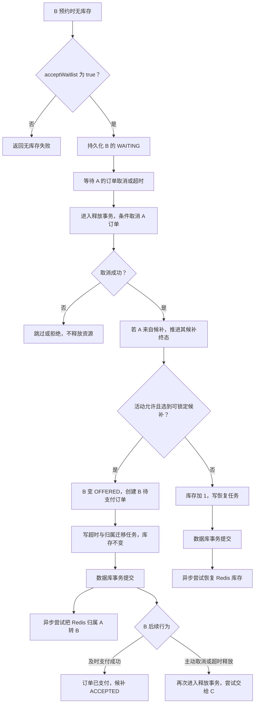

这是成功与正常分支的总览。事务中任一步发生需要抛出的错误时，数据库修改及任务写入一起回滚；图里的异步 Redis 路径不在本地事务之内。B 的支付也不以 Redis 迁移任务已经完成为前置条件。

把整条链记成一句话：

> **排队时只记意愿；有名额释放时才在数据库事务中分配给候选，再异步迁移 Redis 归属；获得名额的人如果仍未完成支付，就再次进入同一释放流程。**

<a id="section-62"></a>

## 14. 为什么使用 MySQL 候补表，而不是只维护 Redis 队列？

<a id="section-63"></a>

### 14.1 候补调度与库存扣减解决不同问题

| 机制 | 核心问题 | 本项目的实现重点 |
|---|---|---|
| 库存控制 | 还能分配多少名额？ | 条件扣减、释放时恢复或交接 |
| 候补调度 | 释放的名额下一次给谁？ | 持久化 WAITING，按 requestId 选可锁定候选 |
| 候补状态机 | 这个人处于等待、获配还是终态？ | WAITING、OFFERED、ACCEPTED、EXPIRED、CANCELLED |
| 资源归属 | 当前哪个用户、哪个订单持有名额？ | MySQL 新旧订单与 Redis holder/claim |

只有一个“库存为 0”的数字，无法知道 B、C 的先后关系，也无法表达 B 已获配但未支付。所以候补不是简单多一个库存重试按钮。

<a id="section-64"></a>

### 14.2 当前选择的好处是事务协同

候补记录、新旧订单、库存和可靠任务都在 MySQL 里。这样可以用一个本地事务实现“取消 A、分配 B、建立 B 的订单、记录后续工作”。同时，索引和行锁帮助候选选择，唯一约束限制同一用户的有效候补与有效订单。

Redis List 和 ZSet 也能用来设计候补队列，但以下仅是方案比较，并非本项目已有实现：

| 可选方案 | 可以怎样使用 | 需要额外处理什么 |
|---|---|---|
| Redis List | 以列表顺序排队 | 退出、状态查询、取出后建单失败的恢复，以及与 MySQL 的一致性 |
| Redis ZSet | 使用分值表达排序规则 | 分值与公平性定义、原子领取、状态持久化，以及与 MySQL 的一致性 |
| 本项目 MySQL 表 | 按状态和 requestId 查询并锁定候选 | 锁竞争、非严格 FIFO、坏候选回滚与队列清理等边界 |

不能得出“MySQL 永远优于 Redis”或“Redis 无法持久化”的结论。这里选择 MySQL 的直接价值，是把候补状态推进与订单创建放进同一个已有的业务数据库事务。

<a id="section-65"></a>

## 15. 源码导航：沿入口找到每一次交接

<a id="section-66"></a>

### 15.1 四条主要调用链

**候补入队：**

```text
ReservationServiceImpl.reserve
→ 创建预约请求并发送消息
→ ReservationServiceImpl.createOrderFromMQ
→ 库存不足分支 handleSoldOut
→ ReservationTransactionalService.createWaitlist
→ tb_reservation_waitlist 插入 WAITING
```

`handleSoldOut` 既可能由 Redis 判断售罄触发，也可能在数据库扣减发现售罄、清理旧 claim 后触发。

**主动取消后补位：**

```text
ReservationServiceImpl.cancelOrder
→ releaseOrPromote(orderId, 当前用户, CANCELLED, offerMinutes)
→ 取消旧订单
→ selectNextForUpdate
→ 推进候补、创建新订单、写任务
→ 事务提交
→ publishReleaseResult 更新请求结果缓存
```

**订单超时后补位：**

```text
超时消息消费或超时扫描
→ ReservationServiceImpl.cancelTimeoutOrder
→ releaseOrPromote(orderId, null, EXPIRED, offerMinutes)
→ 取消旧订单并补位或恢复库存
```

**已获配的候补再次超时接力：**

```text
B 的候补订单超时
→ cancelTimeoutOrder(B订单号)
→ releaseOrPromote
→ B 订单取消，B 候补 OFFERED → EXPIRED
→ 选择 C，C 候补 WAITING → OFFERED
→ 创建 C 订单并写 B→C 归属迁移任务
```

<a id="section-67"></a>

### 15.2 按职责查文件

| 想核实什么 | 源码文件 | 重点 |
|---|---|---|
| 候补入口、结果查询、取消和支付入口 | [ReservationServiceImpl.java](../src/main/java/com/citypass/service/impl/ReservationServiceImpl.java) | `handleSoldOut`、`cancelWaitlist`、`cancelOrder`、`cancelTimeoutOrder`、`payOrder`、`publishReleaseResult` |
| 事务内的完整交接 | [ReservationTransactionalService.java](../src/main/java/com/citypass/service/impl/ReservationTransactionalService.java) | `createWaitlist`、`releaseOrPromote`、`payUnpaidOrder`、`cancelWaiting` |
| 选人与排位 SQL | [ReservationWaitlistMapper.java](../src/main/java/com/citypass/mapper/ReservationWaitlistMapper.java) | `selectNextForUpdate`、`countWaitingAhead` |
| 候补字段 | [ReservationWaitlist.java](../src/main/java/com/citypass/entity/ReservationWaitlist.java) | 主键、requestId、状态、获配订单和期限 |
| 订单字段 | [ReservationOrder.java](../src/main/java/com/citypass/entity/ReservationOrder.java) | status、source、promotionRound、offerExpireTime |
| 交接任务载荷 | [ReservationClaimTransfer.java](../src/main/java/com/citypass/reliable/ReservationClaimTransfer.java) | 五个业务字段 |
| Redis 归属迁移 | [transfer-reservation.lua](../src/main/resources/transfer-reservation.lua) | 旧 claim 比对、新归属写入、幂等标记 |
| Redis 公共库存恢复 | [restore-stock.lua](../src/main/resources/restore-stock.lua) | 与交接脚本比较 |
| 后续任务执行 | [ReliableTaskScheduler.java](../src/main/java/com/citypass/task/ReliableTaskScheduler.java) | TRANSFER_RESERVATION_CLAIM 分支 |

补充入口与结构核查：

| 文件 | 阅读位置 |
|---|---|
| [ReservationController.java](../src/main/java/com/citypass/controller/ReservationController.java) | HTTP 预约参数及取消入口 |
| [OrderMQConsumer.java](../src/main/java/com/citypass/mq/OrderMQConsumer.java) | CREATE 与 TIMEOUT 消息分支 |
| [ReservationReconcileTask.java](../src/main/java/com/citypass/task/ReservationReconcileTask.java) | 已过期待支付订单的扫描与取消调用 |
| [RedisIdWorker.java](../src/main/java/com/citypass/utils/RedisIdWorker.java) | requestId 的时间部分与递增部分 |
| [migration-v3-waitlist.sql](../deploy/mysql/migration-v3-waitlist.sql) | 候补表、有效用户生成列和索引 |
| [application.yaml](../src/main/resources/application.yaml) | 默认 offer 时长与任务配置 |
| [ReservationTransactionalServiceTest.java](../src/test/java/com/citypass/service/impl/ReservationTransactionalServiceTest.java) | 正常补位、库存恢复和支付状态关联测试 |

路径以本仓库为准，相对链接已按仓库 `docs/` 位置核实。

<a id="section-68"></a>

## 16. 八个面试重点：先理解，再用自己的话讲

<a id="section-69"></a>

### 16.1 为什么需要候补？

**初学者理解：** 售罄时仍可能有人取消或超时。如果只能重新抢，B 要不断刷新，还可能输给后来的人。候补把预约意愿留下，在资源释放时主动选择接替者。

**30–60 秒回答：**

> 我们的预约名额可能因取消和未支付超时重新释放，因此增加了持久化候补。用户选择接受候补且库存不足时，创建 WAITING 记录，此时不占名额。释放发生后，服务从 WAITING 中选择候选，创建待支付订单并进入 OFFERED。这样用户不必反复重新提交，也能把等待意愿和后续分配过程关联起来。当前按 requestId 选择可锁定候选，并不承诺严格 FIFO。

<a id="section-70"></a>

### 16.2 为什么不先把库存加 1，让候补再抢？

**初学者理解：** 给公共池加 1，意味着所有新请求都有机会拿走它；候补身份本身并没有让 B 获得这份资源。

**30–60 秒回答：**

> 如果先回补公共库存，再让候补走一次抢购，就会重新引入库存竞争：新用户可能抢先拿走，也多一次释放和扣减的状态变化。我们在旧订单释放事务里选定候补并直接建单，名额从旧订单转给新订单，交接分支不增加公共库存。如果活动不允许补位或本次没选到候选，才走库存恢复分支。这样把候补分配与公开库存竞争分开。

<a id="section-71"></a>

### 16.3 Resource Handoff 到底交接了什么？

**初学者理解：** 是把“这一个已占用名额由谁持有”换掉；不是复制名额，也不是把 A 的订单所有者改成 B。

**30–60 秒回答：**

> Resource Handoff 指释放名额的直接归属交接。数据库里，我们取消 A 的旧订单，将 B 的候补推进到 OFFERED，再以 B 的 requestId 创建新的待支付订单。旧订单保留历史，新订单明确属于 B。Redis 侧通过任务和 Lua 移除匹配 A 旧订单的归属，再设置 B 的 holder 和 claim。它是一个逻辑名额的连续分配，源码没有单独的 slot_id 实体。

<a id="section-72"></a>

### 16.4 为什么补位时库存不变？

**初学者理解：** A 占用的一个名额变成 B 占用，总占用数没有变化，可公开分配数也没有变化。

**30–60 秒回答：**

> 成功补位前，A 占一个名额；事务提交后，A 取消、B 占一个名额，总占用不变。源码在创建候补订单和写入任务后直接返回 PROMOTED，不经过下面的库存加 1 分支，也不再调用普通预约的库存扣减。Redis 的迁移脚本同样只修改 holder 和 claim，没有库存命令。因此这是一次归属替换，不是重新释放再争抢。

<a id="section-73"></a>

### 16.5 两笔订单同时释放，怎么避免都选中 B？

**初学者理解：** 第一笔事务把 B 的候补行锁住；另一笔查询跳过这行，去找别的可选行。

**30–60 秒回答：**

> 候补查询在事务内执行，按 requestId 排序，使用 LIMIT 1 FOR UPDATE SKIP LOCKED。第一笔释放选中 B 并锁住该行，第二笔释放可以跳过 B 选择 C。之后还会用 WAITING 条件推进状态，数据库唯一约束也限制重复有效订单。这里的代价是非严格 FIFO：被锁定的前序候选可能被跳过，甚至全部候选被锁时查询为空，所以不能夸大成绝对公平队列。

<a id="section-74"></a>

### 16.6 为什么还要保护 WAITING → OFFERED？

**初学者理解：** 拿到候补行之后也应检查“它是否仍处于允许分配的状态”，而不是无条件覆盖。

**30–60 秒回答：**

> 我们更新候补时同时限定主键和 status=WAITING，且要求恰好影响一行。这样状态推进有明确前置条件，不能把已取消或已获配状态直接覆盖掉。它与行锁、有效候补唯一约束共同保护不同层次的问题。如果更新失败或后续插单失败，事务会回滚旧订单取消和本次候补推进。当前实现会抛错回滚，并不会失败后自动寻找下一候选。

<a id="section-75"></a>

### 16.7 为什么候补要持久化到 MySQL？

**初学者理解：** 排队不是一个瞬间动作，需要能查询、退出、获配和追踪结果，还要与订单状态一致。

**30–60 秒回答：**

> MySQL 候补表保存用户、活动、requestId、状态和获配期限，便于查询与状态追踪。更直接的原因是订单也在 MySQL，所以旧订单取消、候补获配、新订单创建以及后续任务写入可以放在一个本地事务里。数据库还提供索引、行锁和唯一约束。Redis 队列也能设计，但需要额外解决取出候选后数据库建单失败的恢复，以及两个存储之间的一致性。

<a id="section-76"></a>

### 16.8 获得 offer 的候补也超时了怎么办？

**初学者理解：** B 接过名额却没完成支付，就像 A 一样释放；轮到 C 继续接力。

**30–60 秒回答：**

> B 的候补订单有 offerExpireTime，超时入口会再次调用 releaseOrPromote。在事务里取消 B 的待支付订单，把对应候补从 OFFERED 更新成 EXPIRED；如果活动仍允许且能选中 C，就推进 C 并创建新订单，同时写 B 到 C 的归属迁移任务，否则恢复库存。轮次会加一，但当前代码没有最大轮次判断；WAITING 本身也不是到 offer 时长后就自动过期。

<a id="section-77"></a>

## 17. 常见误解与准确说法

| 容易说错 | 更准确的理解 |
|---|---|
| 接受候补就是马上获得名额 | 入队是 WAITING，不占名额；OFFERED 才获配 |
| WAITLISTED 是候补表状态 | WAITLISTED 是结果状态，表中等待状态为 WAITING |
| OFFERED 只是发通知 | 已经创建待支付订单并占位，源码未实现用户消息通知 |
| 候补状态与订单状态是一套枚举 | 是两套状态，在事务中建立对应关系 |
| 候补按自增 id 严格 FIFO | SQL 按 request_id 排序；SKIP LOCKED 和异步可见性限制严格公平性 |
| B 不可用就一定自动找 C | 锁定行可跳过；建单约束失败则回滚，没有重选循环 |
| 有 WAITING 就绝不恢复库存 | 活动结束或本次无可锁定候选也可能走恢复分支 |
| 交接就是把 A 的订单改成 B 的 | 保留并取消旧订单，为 B 创建独立新订单 |
| 补位要再抢 Redis 库存 | 补位在释放事务中直接建单，不走普通预约抢占链 |
| 一个事务保证 MySQL 和 Redis 一起提交 | 本地事务覆盖数据库写入；Redis 迁移在后续任务执行 |
| Lua 出错会自动撤销前面的命令 | 脚本隔离执行不等于错误自动回滚 |
| 幂等标记解决了所有乱序 | 标记限制同一交接重复，不能替代跨交接版本与顺序控制 |
| promotionRound 已限制最大接力次数 | 当前只记录并递增，没有上限条件 |
| 所有 WAITING 都会自动到期变 EXPIRED | 当前 EXPIRED 用于已获配候补的超时释放，没有通用 WAITING 过期清理 |
| payOrder 已完成真实渠道扣款 | 当前实现为本地订单与候补状态推进 |

<a id="section-78"></a>

## 18. 简历表述怎样逐项落到代码

| 简历关键词 | 本项目可展示的代码证据 | 面试时补充的边界 |
|---|---|---|
| 设计候补状态机 | createWaitlist、releaseOrPromote、payUnpaidOrder、cancelWaiting | 主链之外还有 CANCELLED |
| 取消或支付超时触发补位 | cancelOrder、cancelTimeoutOrder 都调用 releaseOrPromote | 旧订单必须成功从待支付取消 |
| 按候补顺序选择 | selectNextForUpdate 按 request_id 排序 | 选择的是当前可锁定 WAITING，不是严格 FIFO |
| 事务内状态推进 | 旧订单取消、旧候补终态、新候补 OFFERED、新订单与任务写入 | Redis 执行不在该事务内 |
| Resource Handoff | 成功补位分支不回补、不再扣减库存 | 无可选候补等情况仍走恢复分支 |
| 将名额直接转给候补用户 | B 新订单加 transfer-reservation.lua 的 holder/claim 迁移 | 不是修改旧订单用户；Redis 侧异步执行 |
| 减少二次竞争与状态震荡 | 交接分支避免公共库存先加再减 | 这是机制上的效果，没有提供性能压测提升百分比 |

开篇简历原句可以保留，但被追问“顺序”“事务”“一致性”时，要能把上面的边界说清楚。不要把改进设想、注释中的愿景和已执行代码混为一谈。

<a id="section-79"></a>

## 19. 完整面试讲述与追问路线

<a id="section-80"></a>

### 19.1 30 秒版本

> 我在预约系统里实现了候补与名额交接。库存不足且用户接受候补时，先保存 WAITING，不占库存。原订单取消或超时后，在同一个数据库事务里选择可锁定候补，将其推进到 OFFERED，并创建待支付订单。成功补位不回补公共库存，而是把名额直接交给候补；Redis 归属通过后续 Lua 任务迁移。候补支付后变 ACCEPTED，超时则释放并继续补位。排序使用 requestId 加 SKIP LOCKED，因此不承诺严格 FIFO。

<a id="section-81"></a>

### 19.2 1–2 分钟版本

> 这个功能处理的是售罄以后仍然会释放名额的问题。如果取消时先把库存加回公共池，再让等待的人重新抢，就会重新产生竞争，后来请求也可能抢走名额。
>
> 我的实现先把候补意愿持久化。用户接受候补且库存不足时创建 WAITING 记录，这一步不建订单、不占名额。释放发生后，releaseOrPromote 在一个数据库事务内先条件取消旧订单，成功后再用按 requestId 排序的 FOR UPDATE SKIP LOCKED 查询选择候选。选中后条件推进到 OFFERED，以候选 requestId 创建待支付订单，并写超时任务和归属迁移任务。
>
> 成功补位分支的库存不变，因为旧用户占用变成新用户占用，没有把名额放回公共池。Redis 侧用 Lua 比对旧 claim、清理旧归属、写入新 holder 和 claim，再记录交接幂等标记。它是异步完成的，不能说数据库和 Redis 处于一个原子事务。
>
> 候补支付时，订单已支付和候补 ACCEPTED 一起提交；候补超时则再次进入释放流程，标记 EXPIRED 并尝试交给下一位。当前实现也有明确边界：SKIP LOCKED 不保证严格 FIFO，候选建单失败会回滚而不会自动重选，轮次没有最大值，跨交接任务乱序也不能只靠幂等标记解决。

<a id="section-82"></a>

### 19.3 面试官深挖时，沿这棵问题树回答

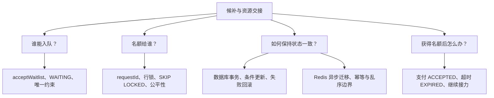

继续被追问时，可以用这些问题检查自己：

1. B 的候补表主键与 requestId 为什么不是一回事？新订单用哪一个？
2. 两笔释放同时发生，锁保护的是旧订单还是候补？各自解决什么？
3. 查询为空为什么不能直接断言整条队列无人等待？
4. 新订单插入失败，A 的取消是否已经永久生效？为什么？
5. `oldClaim != oldOrderId` 时 Lua 会停止吗？新 claim 是否还会写？
6. B 已支付后再收到取消任务，会不会继续释放同一个名额？
7. offerMinutes 改动后，哪些超时触发配置需要一起核对？
8. 如果活动结束但队列仍有 WAITING，当前代码怎样处理？

回答不需要背长篇术语，先说实际分支，再指出条件与事务边界。

<a id="section-83"></a>

## 20. 阅读完成后的自查与校验说明

<a id="section-84"></a>

### 20.1 用五句话判断自己是否真正理解

- 我能区分“排队等待”和“已分配待支付”，并解释为什么 WAITING 不占库存。
- 我能从 A 取消讲到 B 新订单提交，指出成功交接分支没有库存加减。
- 我能解释两笔释放怎样选择不同候选，以及为什么这不是严格 FIFO。
- 我能讲清 MySQL 事务、提交后的请求缓存更新、异步 Redis 归属迁移三个边界。
- 我能沿同一个释放方法继续讲 B 超时、C 接力，并指出坏候选回滚等实际限制。

<a id="section-85"></a>

### 20.2 已有测试能支持什么，不能证明什么？

仓库的 `ReservationTransactionalServiceTest` 包含“没有候补时恢复库存”“选中第一候补时转移名额且不修改库存”“候补支付时推进 ACCEPTED”等测试。正常补位测试会验证新订单沿用候补 requestId、轮次增加，并写入超时与迁移任务。

这些测试使用 mock 并直接构造服务对象，不能单凭它们证明真实 Spring 事务回滚、MySQL 行锁竞争或 Redis 脚本执行效果。

仓库冒烟流程还覆盖 A 获配、B/C 排队、A 取消后 B 补位、C 排位变化、B 支付和 C 退出等场景。它不等于已经覆盖“两笔真实并发释放”或“B 超时后 C 接力”的所有异常情况。

本篇工作是基于所提供源码编写与校验文档，**没有在本次文档任务中启动完整应用、重跑上述业务测试或执行真实并发压测**。

<a id="section-86"></a>

### 20.3 本文校验记录

**格式检查**：18 个不同的相对源码链接均按仓库 `docs/` 位置核实存在；完整目录覆盖 86 个章节和小节；11 张 Mermaid 图均通过 Mermaid 11.17.2 语法解析。代码围栏与目录锚点已检查。此检查不等于 GitHub 页面实际渲染验收，也不等于业务运行测试。

正文中的实现事实以本次上传源码为准；MySQL、Redis 官方链接仅解释底层锁和脚本语义。本文未把建议改进标记为已实现，也未用注释替代代码行为。

第三篇到这里完成。第四篇可以继续沿本篇已经写入数据库的可靠任务，解释任务发布、重试和异常恢复；本篇的 Resource Handoff 主流程不依赖读完第四篇才能理解。
