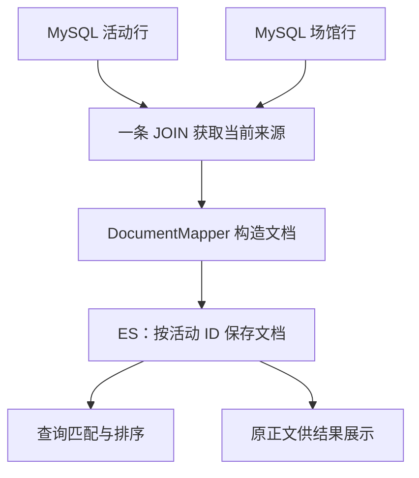
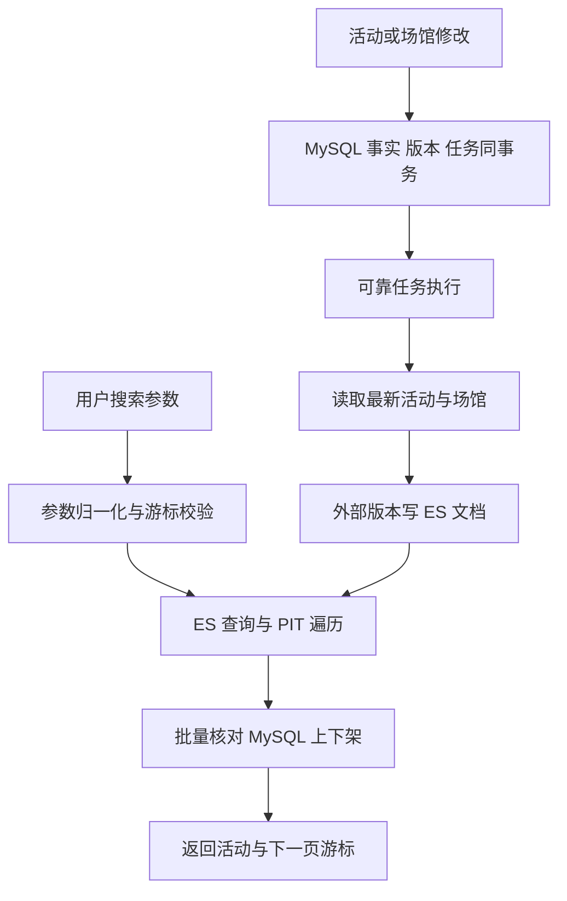
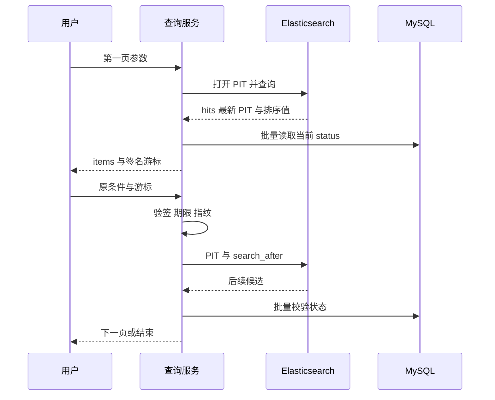
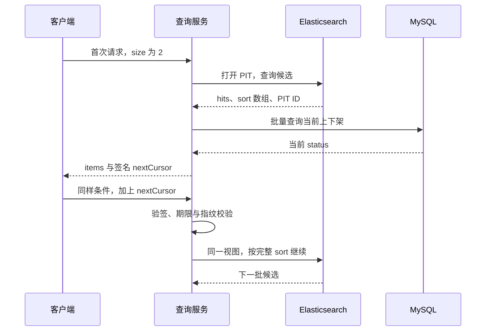
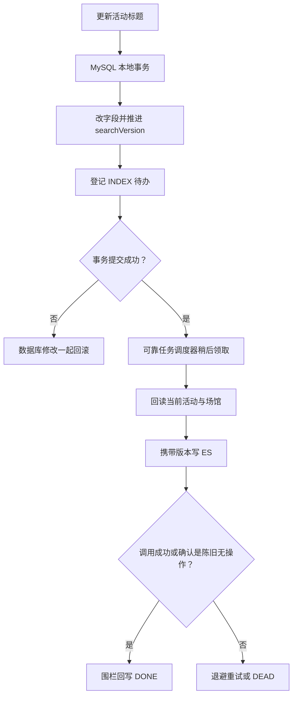
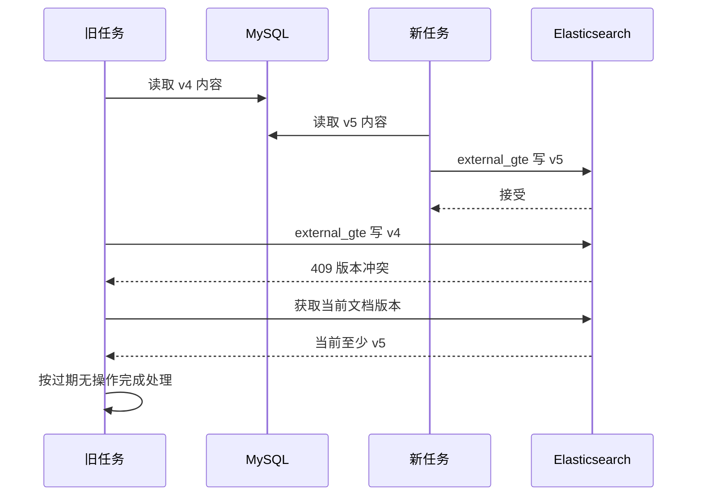
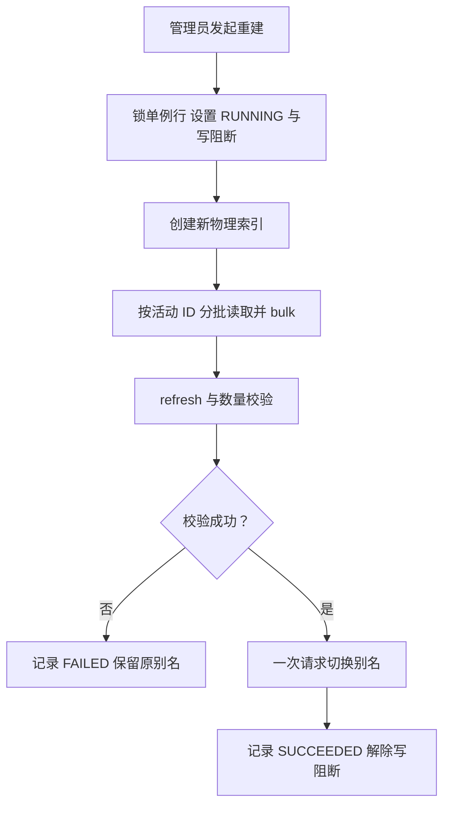
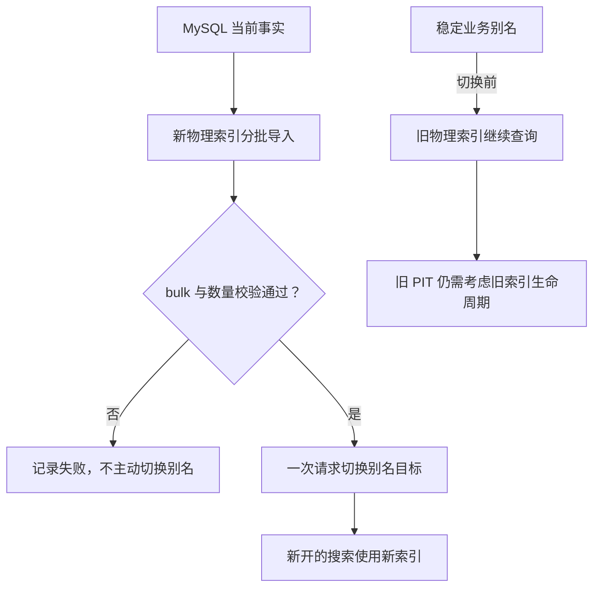

# CityPass 学习文档三：全文检索与索引治理

> **对应简历点**：基于 Elasticsearch 实现中文多字段检索及时间、分类、价格和距离组合过滤，通过 PIT 与 search_after 实现稳定游标分页，并以签名游标绑定查询条件；以 MySQL 为事实源，通过可靠任务与单调索引版本处理重复、乱序更新、活动下架及场馆信息联动，支持校验后切换别名的全量索引重建与故障恢复。
>
> **标题校正**：简历第三条编辑稿误写成了“多级缓存一致性”，其内容实际是全文检索。本篇按“全文检索与索引治理”独立编写。
>
> **源码基线**：GitHub main，`7b51ffafcea428e2877db0541709d130828236e7`，包含新搜索模块。不是根据上一轮实施 Prompt 推测能力。项目固定 Elasticsearch 服务端与 High Level REST Client 为 **7.17.29**，镜像安装 **analysis-smartcn**，Java 8 / Spring Boot 2.3 的现有框架未整体升级。这里描述源码选择，不将旧版本推荐为新项目默认选型。
>
> **验证口径**：本篇核对了查询、签名、索引写入、业务事务、重建、配置、迁移及测试源码；未重新运行 Docker 搜索验收。仓库原搜索文档记录的小样本结果与本次重新实测严格区分。教学 ID、版本和时间用于解释，不代表生产数据。

**阅读目录**

- [1. 从用户问题开始：找到活动，与抢到名额是两件事](#section-1)
- [2. 先补基础：文档、索引、倒排、Mapping、Analyzer](#section-2)
- [3. 总体结构：查询链与索引写链分开看](#section-3)
- [4. 数据建模：先把五组含义分开](#section-4)
- [5. Mapping 与中文分词：字段为什么不能全部存成字符串](#section-5)
- [6. 查询入口：参数如何变成确定条件](#section-6)
- [7. 关键词相关性与硬过滤怎样组合](#section-7)
- [8. 为什么需要 PIT 与 search_after 两个机制](#section-8)
- [9. 签名游标：防篡改、绑定条件，但不加密](#section-9)
- [10. 快照内上架、现实中下架：为什么还要查 MySQL](#section-10)
- [11. 增量写链：活动字段、版本和待办同事务](#section-11)
- [12. searchVersion：读取最新为什么还不能防乱序](#section-12)
- [13. 软下架与场馆联动](#section-13)
- [14. 开关关闭、ES 故障与“任务已完成”的边界](#section-14)
- [15. 全量重建：先解释为什么它不是简单导入](#section-15)
- [16. 重建失败：必须区分切换前、切换后和进程消失](#section-16)
- [17. 接口、启动和部署学习路径](#section-17)
- [18. 已有测试、真实证据与仍需补的验证](#section-18)
- [19. 故障场景速查](#section-19)
- [20. 面试官追问与详细回答](#section-20)
- [21. 学习路线与三分钟讲述提纲](#section-21)
- [附录：源码与原学习材料导航](#section-22)

**零基础增强阅读导航**

本轮补充按“概念 → 数据样例 → 代码 → 并发反例 → 验证 → 连续追问”衔接，保留原文。建议先读下面的新增讲解，再回看原有源码精读。

- [第 1 章 · 入门路线：先知道自己在解决什么，再读实现](#learn-search-1)
- [第 2 章 · 基础补课 A：一条活动数据怎样变成可以搜索的文档](#learn-search-2)
- [第 2 章 · 基础补课 B：正向记录、倒排索引、分词与匹配](#learn-search-3)
- [第 2 章 · 基础补课 C：分片、副本、Lucene、refresh——只学本项目需要的部分](#learn-search-4)
- [第 5 章 · 基础补课：字段类型为什么会影响搜不搜得到、能不能排序](#learn-search-5)
- [第 7 章 · 动手推演：四个活动怎样经过关键词、过滤和排序](#learn-search-6)
- [第 7 章 · 从 Java Builder 看懂等价 DSL：不是让前端传任意 JSON](#learn-search-7)
- [第 8 章 · 分页补课：用五条活动理解 offset、search_after 和 PIT](#learn-search-8)
- [第 9 章 · 游标补课：一串看不懂的 cursor 到底包了什么](#learn-search-9)
- [第 10 章 · 最容易答错的分页例子：被下架过滤以后，游标该放在哪里](#learn-search-10)
- [第 11 章 · 从零理解索引同步：为什么不能在改完 MySQL 后直接写 ES 就结束](#learn-search-11)
- [第 12 章 · 用时序证明版本价值：读最新、幂等键、任务围栏为什么都不能代替它](#learn-search-12)
- [第 13 章 · 软下架、场馆联动与索引漂移：分别解决哪一种变化](#learn-search-13)
- [第 14 章 · 把“写成功了但搜不到”分成四层诊断](#learn-search-14)
- [第 15 章 · 重建补课：物理索引、别名与维护窗口到底是什么](#learn-search-15)
- [第 16 章 · 故障演练：同样叫“重建失败”，恢复动作可能完全不同](#learn-search-16)
- [第 17 章 · 零基础实践：用五个可观察结果建立信心](#learn-search-17)
- [第 18 章 · 如何把“能运行”提高到“能拿出面试证据”](#learn-search-18)
- [第 20 章 · 进阶练习：面试官连续追问时，怎样把回答讲完整](#learn-search-19)
- [第 21 章 · 分阶段学习与自测：从看懂到能独立推演](#learn-search-20)

**源码精读导航（本次增强）**

本次保留原有链路讲解、图表与面试问答，并在相应章节补入真实源码。阅读顺序建议是：先看本章业务解释，再读带“教学”注释的代码，最后用失败边界检查自己是否理解。代码以本篇固定提交为准，不是新设计或待实现方案。

- [第 4 章 · isComplete：可被检索与文档存在是两个判断](#code-3-1)
- [第 5 章 · Mapping 的 text helper：分词器同时用于建索引与查询](#code-3-2)
- [第 7 章 · buildQuery：相关性、硬过滤、排序与分页一次组装](#code-3-3)
- [第 8 章 · doSearch 的入口：第一页建 PIT，下一页复用快照](#code-3-4)
- [第 9 章 · encode 与 decode：签名防篡改，Base64 不保密](#code-3-5)
- [第 9 章 · fingerprint：为什么换排序或页大小会被拒绝](#code-3-6)
- [第 10 章 · 扫描循环：下架校验后补取，游标记录最后扫描项](#code-3-7)
- [第 11 章 · updateSearchMetadata：业务修改与索引意图一起提交](#code-3-8)
- [第 11 章 · INDEX handler：旧任务也重新读取当前数据库文档](#code-3-9)
- [第 12 章 · indexDocument：用 external_gte 防迟到快照覆盖新版本](#code-3-10)
- [第 13 章 · updateStatus：下架同样推进版本和待办](#code-3-11)
- [第 13 章 · 场馆联动：一个场馆改名，为关联活动逐一登记版本任务](#code-3-12)
- [第 15 章 · assertWritesAllowed：读门禁也要锁行](#code-3-13)
- [第 15 章 · rebuild：扫描、逐批检查、数量校验，再切别名](#code-3-14)
- [第 15 章 · bulkIndex：HTTP 请求成功，也可能有文档失败](#code-3-15)
- [第 16 章 · deleteInactiveIndex：别名安全检查不覆盖旧 PIT](#code-3-16)

> **阅读约定**：完整方法保留事务注解；方法内节选会明确说明省略范围，不能单独复制成可运行类。所有新增行内注释均以“教学”标识，原代码中的英文／中文注释保留，但过时的原注释会在解释中指出。数值、订单号与时序例子均为教学推演，不是新增实测结果。

<a id="section-1"></a>

## 1. 从用户问题开始：找到活动，与抢到名额是两件事

<a id="learn-search-1"></a>

### 入门路线：先知道自己在解决什么，再读实现

本次增强按“没有学过 ES”的起点补课。你可以先沿新增导航读一遍，再阅读原有源码精读，最后练习面试问答。原有章节、16 处源码精读和 25 道面试题全部保留。新增样例是教学数据；本次仍基于本篇固定源码提交，不声称已实测新版本或新的容器结果。

不要一上来记住十几个类。先把目标分成三个问题：

| 问题 | 用户能感知的表现 | 代码必须做的事 |
|---|---|---|
| 怎么找到活动？ | 输入关键词、时间和预算，返回合适活动 | 建模、分词、过滤、评分、排序 |
| 下一页能不能接着看？ | 不总看到上一页内容，条件不被偷偷换掉 | 稳定视图、排序位置、签名游标、过期处理 |
| 数据变了怎么跟上？ | 改名后能搜新名，下架后不能被旧任务复活 | 本地事务、可靠任务、版本约束、索引重建 |

**Elasticsearch（简称 ES）是一个独立运行的搜索服务。** Java 应用通过客户端发送 HTTP 请求，它不是 Spring Boot 内存中的一个 Map。当前项目把 MySQL 中的活动和场馆数据整理成适合查询的 ES 文档，前端仍调用 CityPass 的搜索接口，不直接获得 ES 管理能力。

同一个“城市音乐节”有三种动作：搜索是找到活动 ID；预约是竞争名额并建单；搜索索引同步是把活动的新介绍传播到查询副本。这三件事不会共享一笔跨系统事务，也不以 ES 文档是否命中来判断是否预约成功。

**读完的验收目标**：不看文档，能画查询、更新、重建三条链；能用两条线程解释乱序覆盖；能解释分页位置、索引视图、实时上下架分别由谁负责。面试能力还需要自己运行实验并复述，文档本身不能替代实践。


用户输入“城市音乐节”，希望找到标题或介绍相关的活动，还希望限制价格、时间、类型和距离。预约模块接收到 activityPassId 才开始处理名额；搜索模块负责帮助用户获得这个 ID。

搜索成功不意味着有库存，也不意味着用户有资格预约。它只返回在当前查询视图中匹配且通过当前上下架检查的活动。真正提交预约时，原交易链重新检查窗口、库存和用户限制。

本篇维护三个不同的正确性目标：

1. **查询语义正确**：硬条件不能被相关性高分绕过，时间、价格和距离边界定义清楚。
2. **遍历语义正确**：同一次搜索翻页尽量使用稳定索引视图，不因换条件或数据刷新随意重复。
3. **投影更新正确**：搜索文档可以重建，旧任务不能覆盖新一代文档，业务下架不能被低版本复活。

用户能理解的例子：

> “城市音乐节”出现在活动标题里通常比只在报名规则里出现更相关；但即使得分最高，价格超过预算也必须被过滤。标题相关性是排序偏好，预算是硬条件。

这让搜索形成独立主线。它不会重新扣 Redis 库存，也没有另一套 PAY/CANCEL 状态机。

<a id="section-2"></a>

## 2. 先补基础：文档、索引、倒排、Mapping、Analyzer

<a id="learn-search-2"></a>

### 基础补课 A：一条活动数据怎样变成可以搜索的文档

假设 MySQL 中有活动 101，关联场馆 9：

| 表 | 关键内容 |
|---|---|
| `tb_activity_pass` | ID=101，标题=城市音乐节，价格=9900 分，分类=MUSIC，场馆 ID=9，search_version=4 |
| `tb_venue` | ID=9，名称=滨江艺术中心，地址与经纬度 |

来源仓储把两表 JOIN 后，映射成一份搜索文档。下面 JSON 只展示部分真实字段，数值是假设值，时间使用 epoch millis，不是让你直接插入生产索引：

```json
{
  "activityId": 101,
  "venueId": 9,
  "title": "城市音乐节",
  "description": "周末户外音乐演出",
  "activityCategory": "MUSIC",
  "priceCents": 9900,
  "eventStartTime": 2000000000000,
  "eventEndTime": 2000007200000,
  "venueName": "滨江艺术中心",
  "location": {"lat": 30.25, "lon": 120.15},
  "status": 1,
  "searchable": true,
  "searchVersion": 4
}
```

ES `_id` 同时使用字符串 `"101"`。`_id` 是 ES 文档身份，`activityId` 是正文中的业务字段；值相同但用途不同。更新同一个 `_id` 是更新这一活动的搜索副本，不是追加一份新的活动。

这里的 Index 有两个常见含义：名词指一组文档及其检索结构；动词“index document”指把文档写入并建立相应结构。它与 MySQL 中某个 B+Tree 索引不是同一粒度。类比数据库表可以帮助入门，但不能据此推导出 ES 具备 MySQL 的关系约束或跨行事务。



为什么把场馆名称复制进去？用户搜索“滨江艺术中心音乐节”时，ES 需要同时知道活动和场馆文本；距离过滤也需要位置。代价是场馆改名以后，所有冗余该名字的活动文档都要同步。这种“写入时多做维护，读取时少做跨系统拼接”的选择，就是本项目索引治理存在的原因。


### 2.1 从表与行类比到搜索文档

MySQL 用活动、场馆等多张表组织事实；搜索可以将一次查询经常一起使用的字段拼成一份文档。当前一个 `tb_activity_pass` 对应一个 ES 文档，ES `_id` 使用 activityId。

这是查询冗余，不是把 MySQL 删除。MySQL 负责业务修改与事务；ES 负责相关性、组合过滤和搜索视图。

| 术语 | 入门解释 | 当前项目例子 |
|---|---|---|
| Document | 一份可检索的 JSON 记录 | 一个活动及其场馆展示字段 |
| Index | 一组文档及其索引结构 | `citypass-activity-search-v...` |
| Mapping | 字段类型和如何建立索引的约定 | title 为 text，价格为 long |
| Analyzer | 将文本转为可检索词元的规则 | smartcn |
| Inverted index | 根据词找到含它的文档 | “音乐节”对应活动 A、B |
| Alias | 业务使用的逻辑名称 | `citypass-activity-search` |
| Refresh | 使已索引变更进入新的可搜索视图 | 全量重建计数前显式 refresh |
| PIT | 在一定保留时间内使用稳定索引视图 | 多页搜索共享视图 |

### 2.2 倒排索引为什么与 LIKE 不一样

假设 A 标题是“城市音乐节限定专场”，B 介绍是“包含城市音乐节主题分享”，C 标题是“城市夜跑挑战赛”。分析器可能把查询拆成“城市”“音乐节”。根据词元查文档，再结合字段、相关性评分，A/B/C 的匹配和排序会与连续子串 LIKE 不同。

当前 `multi_match` 未配置精确短语匹配或必须全部词命中。不能因为用户输入“城市音乐节”就承诺只返回包含完整连续短语的文档；包含“城市”的活动可能参与召回。

全文检索不等于自然语言理解，也不是向量语义搜索。当前没有 LLM、Embedding、RAG 或个性化推荐。


<a id="learn-search-3"></a>

### 基础补课 B：正向记录、倒排索引、分词与匹配

用一份刻意简化的手工词元表演示。**下面的切词是教学假设，不是 SmartCN 的真实输出**；真实词元要用 `_analyze` 检查。

| 活动 | 原始标题 | 假定词元 |
|---|---|---|
| 101 | 城市音乐节 | 城市、音乐节 |
| 102 | 城市夜跑 | 城市、夜跑 |
| 103 | 周末音乐节 | 周末、音乐节 |

正向看是“101 包含哪些词”；倒过来就是：

| 词元 | 含有它的文档 ID |
|---|---|
| 城市 | 101、102 |
| 音乐节 | 101、103 |
| 夜跑 | 102 |
| 周末 | 103 |

用户搜索“城市音乐节”，先用查询分析器得到词元，再查对应候选集合。若规则允许命中任意一个词，101、102、103 都可能参与；若要求两个词都命中，这个简化例子才只剩 101。若要求有顺序和位置关系的短语匹配，又是另一种约束。

因此要把三个问题分开：**切出什么词、哪些文档算匹配、匹配文档如何排序**。分词器不独自决定最终结果，`match`／`multi_match` 的操作符、短语要求、字段权重和过滤条件都会改变结果。

当前 `buildQuery` 使用 `multi_match`，没有显式设置 AND、短语类型或最低词元命中比例。不要对用户承诺“只返回完整包含输入句子的活动”。多字段查询默认的 `best_fields` 更偏重最佳匹配字段；也不能直接把多个字段分数理解成简单相加。[ES 7.17 multi_match 官方说明](https://www.elastic.co/guide/en/elasticsearch/reference/7.17/query-dsl-multi-match-query.html)

与 `LIKE '%城市音乐节%'` 比较时，应先比较语义：LIKE 示例寻找连续子串，全文检索围绕词元和评分。MySQL 也有 FULLTEXT 能力，因此正确回答不是“MySQL 完全不能全文检索”，而是本项目选择 ES 来集中实现多字段相关性、地理过滤、分页视图和索引运维。是否值得承担额外组件成本，要结合实际需求，不能只比较技术名字。


<a id="learn-search-4"></a>

### 基础补课 C：分片、副本、Lucene、refresh——只学本项目需要的部分

先建立一个有限的理解：ES 提供分布式搜索服务，底层使用 Lucene 的检索能力；一个索引可以分成多个主分片，副本则复制对应主分片的数据。分片用于分担数据与处理，副本可参与读与故障恢复。**本项目 `createPhysicalIndex` 显式使用 1 个主分片、0 个副本**，不要把 ES 的通用集群能力说成已经部署并验证的 CityPass 高可用架构。[官方分片与副本说明](https://www.elastic.co/guide/en/elasticsearch/reference/7.17/scalability.html)

索引数量、文档数量、分片数量是三件事：一次重建可以产生一个新物理索引，里面有许多活动文档，当前仍只配置一个主分片。多建物理索引不是“给每个活动建一个分片”。

再分清四个时刻：

| 时刻 | 代表什么 | 不代表什么 |
|---|---|---|
| MySQL 事务提交 | 活动新事实与 INDEX 待办已保存 | ES 已更新 |
| ES 写入返回成功 | 该次索引操作被接受 | 所有搜索视图立刻看到新内容 |
| refresh 后新搜索可见 | 新搜索视图能看到相应变更 | 已打开的旧 PIT 会跟着变化 |
| 用户重新开启搜索 | 使用新的一轮搜索视图与条件时间 | 获得跨 MySQL、ES 的全局事务快照 |

ES 的近实时搜索与 refresh 有关。refresh 使变更进入可搜索视图，不是“再发一遍 MySQL 数据”，也不等于把所有缓存删掉。[ES 7.17 近实时搜索说明](https://www.elastic.co/guide/en/elasticsearch/reference/7.17/near-real-time.html)

本项目增量写入没有逐条强制 refresh；全量重建在计数验证之前显式 refresh，避免刚 bulk 完就按尚未可见的数据计数。它没有实现自己的 Lucene segment 管理、分片路由算法或 ES 节点故障恢复系统。知道这些底层名词用于解释边界即可，不必把分布式存储内核作为当前简历的实现成果。

<a id="section-3"></a>

## 3. 总体结构：查询链与索引写链分开看



| 类 | 职责 | 阅读时抓住的方法 |
|---|---|---|
| `ActivitySearchController` | 搜索和提前关闭游标入口 | search、closeCursor |
| `ActivitySearchRequestValidator` | 参数归一化与校验 | validate |
| `ActivitySearchService` | PIT、查询 DSL、补取、响应 | doSearch、buildQuery |
| `ActivitySearchCursorCodec` | 指纹和 HMAC 签名 | fingerprint、encode、decode |
| `ActivitySearchSourceRepository` | MySQL 联表来源、状态及版本修改 | findById、findBatchAfter、bumpVenueDocuments |
| `ActivitySearchDocumentMapper` | 构造稳定搜索文档 | from |
| `ActivitySearchOutboxService` | 登记索引任务 | enqueue |
| `ActivitySearchIndexTaskHandler` | 回读事实并执行索引工作 | execute |
| `ActivitySearchIndexService` | Mapping、索引写入、别名等 ES 操作 | indexDocument、bulkIndex、switchAlias |
| `ActivitySearchRebuildService` | 维护窗口全量重建 | rebuild |
| `SearchRebuildStateRepository` | 维护状态与写入门禁 | assertWritesAllowed、begin |

这些是同一应用中的职责划分，不是十个独立微服务。接口只接受定义好的参数，不提供客户端任意 DSL 执行入口。

源码：[查询服务](https://github.com/SyH-101/citypass-platform/blob/7b51ffafcea428e2877db0541709d130828236e7/src/main/java/com/citypass/search/ActivitySearchService.java#L39)、[索引服务](https://github.com/SyH-101/citypass-platform/blob/7b51ffafcea428e2877db0541709d130828236e7/src/main/java/com/citypass/search/ActivitySearchIndexService.java#L38)。

<a id="section-4"></a>

## 4. 数据建模：先把五组含义分开

| 业务含义 | MySQL 字段 | ES 字段 | 不能混淆为 |
|---|---|---|---|
| 预约窗口 | limited stock 的 begin_time/end_time | 不进入当前搜索时间过滤 | 活动实际举办时间 |
| 实际举办时间 | event_start_time/event_end_time | eventStartTime/eventEndTime | 支付资格截止时间 |
| 票券类型 | type | passType | 活动兴趣分类 |
| 活动分类 | activity_category | activityCategory | 普通券/限量券类型 |
| 价格 | pay_value，单位分 | priceCents，long | 元或另一个抵扣金额字段 |
| 上下架 | status | status、searchable | 库存有无 |

当前模型没有独立场次表，因此不是“一个活动下若干场次分别索引”。将来若场次价格、时间、库存不同，需要先调整事实模型，本篇不虚构当前能力。

### 4.1 新字段与老数据兼容

迁移新增 description、activity_category、tags、event_start_time、event_end_time、search_version（默认 1）和重建状态表。时间约束允许两端同时为空，或者两端存在且结束晚于开始。

旧活动不强行补假时间。创建活动完全不提供搜索元数据时兼容原业务；一旦提供相关搜索元数据，就要求合法分类和完整举办时间。

`ActivitySearchDocumentMapper.isComplete()` 当前判定：status=1、标题非空、分类非空、起止时间存在且结束晚于开始。完整则 searchable=true；否则 searchable=false。

注意完整性条件没有检查坐标、场馆一定存在或价格完整；这不是“所有数据都完整”的通用校验。没有位置的文档不能期待满足地理查询，非法地理数据可能在 ES 写入时失败。

### 4.2 不完整活动为什么仍写一份文档

全量重建会遍历所有活动，包含 searchable=false 的软文档。这使同一 ID 仍保留索引版本，而不是一不可搜索就抹掉版本记忆。

因此 ES `_count` 可等于 MySQL 活动总数，但用户搜索返回数远小于它。**文档存在、可搜索、匹配查询、仍上架是四个不同判断。**

### 4.3 哪些 Venue 字段被冗余

通过一条 LEFT JOIN SQL 读取活动和场馆，获得 venueName、area、address、longitude、latitude。单条联表查询比先读活动、再独立读场馆更容易获得同一数据库语句视图下对应的内容和版本，也避免对单文档做多次查询。

正常应用写 Venue 时同步推进关联活动 search_version，构成“内容变化与版本一起提交”的前提。绕过该写入协议的直接 SQL 不自动获得这一保证。

源码：[迁移](https://github.com/SyH-101/citypass-platform/blob/7b51ffafcea428e2877db0541709d130828236e7/deploy/mysql/migration-v5-activity-search.sql#L1)、[来源仓储](https://github.com/SyH-101/citypass-platform/blob/7b51ffafcea428e2877db0541709d130828236e7/src/main/java/com/citypass/search/ActivitySearchSourceRepository.java#L19)、[文档映射](https://github.com/SyH-101/citypass-platform/blob/7b51ffafcea428e2877db0541709d130828236e7/src/main/java/com/citypass/search/ActivitySearchDocumentMapper.java#L11)。


<a id="code-3-1"></a>

### 源码精读 1：isComplete：可被检索与文档存在是两个判断

**源码位置**：[ActivitySearchDocumentMapper.java · isComplete](https://github.com/SyH-101/citypass-platform/blob/7b51ffafcea428e2877db0541709d130828236e7/src/main/java/com/citypass/search/ActivitySearchDocumentMapper.java#L39-L46)。完整方法；仅追加标有“教学”的中文注释，未改动原有语句。节选依赖的变量和外围事务请结合本章上下文阅读。

**这个方法／片段实现什么？** 决定映射文档的 searchable 字段。映射器仍会生成不可检索文档，用其版本阻挡迟到旧更新。

```java
private boolean isComplete(ActivitySearchSource source) {
    return Integer.valueOf(1).equals(source.getStatus()) // 教学：业务上架是可检索的必要条件
            && notBlank(source.getTitle()) // 教学：基础检索字段不完整就不对用户展示
            && notBlank(source.getActivityCategory())
            && source.getEventStartTime() != null
            && source.getEventEndTime() != null
            && source.getEventEndTime().isAfter(source.getEventStartTime()); // 教学：要求有效活动时间区间，结束晚于开始
}
```

**沿代码往下看**

1. 状态必须为上架。
2. 标题和分类必须非空，活动起止时间必须完整且合法。
3. 满足条件返回 true，否则写 searchable=false，而不是直接抛弃文档。
4. 活动是否已经结束由查询中的 eventEndTime 过滤负责，这里没有依赖当前时刻。

**失败与边界**：这里没有检查实时库存，也没有要求坐标一定存在。能检索到活动不承诺有名额；没有坐标的文档在距离查询中的行为属于 ES 字段查询语义。

<a id="section-5"></a>

## 5. Mapping 与中文分词：字段为什么不能全部存成字符串

| 字段 | 当前映射 | 原因 |
|---|---|---|
| title、subTitle、description、rules | text，smartcn | 全文匹配 |
| tags、venueName、area、address | text，smartcn | 中文词元索引；并非全部进入默认关键词查询 |
| activityCategory | keyword | 精确分类过滤 |
| activityId、venueId、priceCents、searchVersion | long | 数值、版本与排序 |
| eventStartTime、eventEndTime | date | 时间范围、排序 |
| passType、status | integer | 枚举数值 |
| searchable | boolean | 必须满足的过滤 |
| location | geo_point | 地理距离过滤与排序 |

Mapping 使用 `dynamic=strict`，未知字段不会被悄悄推断成任意新类型。代价是发送字段与 Mapping 不一致会失败，应用变更需要同步考虑索引映射。

日期由 JVM 系统时区的 LocalDateTime 转 epoch millis；返回时再转回 LocalDateTime。Docker 为应用设置 Asia/Shanghai，跨环境学习或测试要保持时区一致。它没有实现每用户独立时区策略。

tags 由半角/全角逗号拆分、trim、去空、去重、最多 20 项，输出数组。它是文本标签，不等于分类精确枚举。

### 5.1 SmartCN 是真实部署依赖

`deploy/elasticsearch/Dockerfile` 从固定 ES 镜像构建并安装 analysis-smartcn；Mapping 的 analyzer/search_analyzer 都配置 smartcn。仅在 Java 中写分析器名字，而服务端没装插件，会使建索引失败。

当前选择是现有项目兼容实现，不是中文搜索万能方案。没有搜索联想、自动纠错、拼音搜索或人工同义词管理，不能把这些常见搜索能力顺带写进简历。

源码：[ES 镜像](https://github.com/SyH-101/citypass-platform/blob/7b51ffafcea428e2877db0541709d130828236e7/deploy/elasticsearch/Dockerfile#L1)、[ES 配置](https://github.com/SyH-101/citypass-platform/blob/7b51ffafcea428e2877db0541709d130828236e7/src/main/java/com/citypass/config/ElasticsearchConfig.java#L14)、[POM](https://github.com/SyH-101/citypass-platform/blob/7b51ffafcea428e2877db0541709d130828236e7/pom.xml#L1)。


<a id="code-3-2"></a>

### 源码精读 2：Mapping 的 text helper：分词器同时用于建索引与查询

**源码位置**：[ActivitySearchIndexService.java · text](https://github.com/SyH-101/citypass-platform/blob/7b51ffafcea428e2877db0541709d130828236e7/src/main/java/com/citypass/search/ActivitySearchIndexService.java#L185-L188)。完整方法；仅追加标有“教学”的中文注释，未改动原有语句。节选依赖的变量和外围事务请结合本章上下文阅读。

**这个方法／片段实现什么？** 被 Mapping 构造方法用于 title、description、tags、venueName 等文本字段，声明这些字段不是精确匹配的 keyword。

```java
private void text(XContentBuilder builder, String name) throws IOException {
    builder.startObject(name).field("type", "text").field("analyzer", "smartcn") // 教学：索引时把文本切成可检索的词项
            .field("search_analyzer", "smartcn").endObject(); // 教学：查询关键词使用同一分析器
}
```

**沿代码往下看**

1. name 决定当前字段的名字。
2. type=text 启用全文索引语义。
3. analyzer 与 search_analyzer 均指定 smartcn，部署 ES 时需要对应插件。

**失败与边界**：这是当前实际分析器选择，不是项目自研中文分词。代码没有同义词库、自定义词典或学习排序模型；中文检索有效不等于已经完成搜索质量体系。


<a id="learn-search-5"></a>

### 基础补课：字段类型为什么会影响搜不搜得到、能不能排序

Mapping 是“字段怎样存储并参与检索”的约定，不是 Java DTO 的另一份类名。Java 中都可以是 String 的标题和分类，在 ES 里却应该有不同语义。[ES 7.17 Mapping](https://www.elastic.co/guide/en/elasticsearch/reference/7.17/mapping.html)

| 用户需求 | 类型与操作 | 若选错类型会怎样 |
|---|---|---|
| 标题中找音乐节 | `text` + 分词查询 | 当成整串精确值可能难以匹配其中的词 |
| 分类必须为 MUSIC | `keyword` + `term` | 当成自由文本会把精确枚举与分词语义混在一起 |
| 价格不超过 100 元 | `long`，存 10000 分，`range` | 字符串大小不等于数值大小；元分混用会差 100 倍 |
| 举办时间升序 | `date` | 格式、时区、单位不统一会错位 |
| 附近 3 公里 | `geo_point` | 不能用普通字符串直接获得正确距离过滤 |

`match` 类查询会按字段分析规则处理输入；`term` 是匹配索引中的精确词项，不能默认它会替你把一句中文切词。当前分类归一化成大写后用 term，是为了让用户输入 `music` 与数据库规范值 `MUSIC` 对齐。tags 虽然是字符串数组，当前映射仍为 text，不代表项目已经做了精确标签分面筛选。

还有三个位置经常被混淆：

- `_source`：文档正文，用于取回展示字段；本项目 `toItem` 从 hit 的 source map 读标题等。
- 倒排结构：适合由词找候选文档。
- `doc_values`：面向从文档取字段值的列式结构，常用于排序和聚合；不是 Caffeine 一类应用缓存。数值、日期、keyword 等支持它，而普通 text 不默认拥有这种能力。[ES 7.17 doc_values](https://www.elastic.co/guide/en/elasticsearch/reference/7.17/doc-values.html)

并非所有字段的检索都只靠倒排索引。ES 为不同字段使用适合的数据结构，文本全文查询、数值范围、地理查询和排序的访问方式不同；例如数值和地理字段可使用 BKD 树。这也解释了为什么 priceCents、location 必须按数值和地理类型建模，而不是全部保存为 text。[官方字段检索结构说明](https://www.elastic.co/guide/en/elasticsearch/reference/7.17/documents-indices.html)

`dynamic=strict` 的意思是文档出现 Mapping 未声明字段时拒绝，不是“校验所有必填业务字段齐全”。缺少字段不因此自动报业务校验错误；当前业务完整性由 Java 校验和 `isComplete` 负责。

如果未来改分词规则，已有文档的历史词元不会因为 Java 改了一个字符串就全部重算。需要考虑新索引、重新导入和别名切换，这就是 Mapping 与重建章节之间的联系。能否原地修改某项映射要查该项规则，不能统称所有 Mapping 变更都可在线更新。

<a id="section-6"></a>

## 6. 查询入口：参数如何变成确定条件

接口：`GET /search/activities`，公开读取；新增管理操作使用独立 token，活动写接口沿用现有登录要求。

| 参数 | 行为/默认值 | 校验 |
|---|---|---|
| keyword | trim，空白变 null | 最长 100 |
| category | trim 后转大写 | 最长 32 |
| eventFrom/eventTo | ISO 本地日期时间 | 两者同时有值时 from≤to |
| minPriceCents/maxPriceCents | 分 | 非负，最小≤最大 |
| longitude/latitude | 可选坐标 | 同时提供，经度 ±180、纬度 ±90 |
| radiusMeters | 可选半径 | 有坐标，1～50000 默认上限 |
| sort | RELEVANCE、EVENT_TIME、DISTANCE | 距离排序要求坐标 |
| size | 默认 20 | 1～50 默认上限 |
| cursor | 可选服务端游标 | 后续签名、期限与条件检查 |

无关键词时默认 EVENT_TIME；有关键词默认 RELEVANCE；显式 RELEVANCE 但无关键词也归一化为 EVENT_TIME。只有坐标而没给半径，不自动附加半径过滤；DISTANCE 排序可以只有坐标而不限半径。

当前数字校验主要通过大小比较，未额外检查 Double 的 NaN/Infinity 等非有限值。文档不能把它描述为已经穷尽所有异常输入。

源码：[请求 DTO](https://github.com/SyH-101/citypass-platform/blob/7b51ffafcea428e2877db0541709d130828236e7/src/main/java/com/citypass/dto/ActivitySearchRequest.java#L9)、[参数校验](https://github.com/SyH-101/citypass-platform/blob/7b51ffafcea428e2877db0541709d130828236e7/src/main/java/com/citypass/search/ActivitySearchRequestValidator.java#L10)。

<a id="section-7"></a>

## 7. 关键词相关性与硬过滤怎样组合

### 7.1 多字段相关性

关键词进入 `multi_match`，当前权重：

| 字段 | boost |
|---|---:|
| title | 4.0 |
| subTitle | 2.0 |
| tags | 2.0 |
| venueName | 1.5 |
| description | 1.0 |
| rules | 0.3 |

标题反映主题，规则有较多通用文本，因此给予不同权重。这是人工设定的可解释初始方案，不是在线训练的排序模型。boost 是影响评分的因素，不保证任何标题命中在所有数据下绝对排第一。

虽然 area/address 建了 text 映射并返回，它们没有进入当前 buildQuery 的 multi_match 字段列表。不能因为有索引字段就宣称默认关键词能搜索地址和商圈。

### 7.2 硬过滤

所有查询必须满足 searchable=true，以及 `eventEndTime >= 首次查询采样时间`。关键词高分不能绕过它们。

时间范围采用闭区间相交：活动结束不早于查询起点，活动开始不晚于查询终点。例如查询 15:00—17:00，活动 14:00—15:00 与活动 17:00—18:00 都在边界相交。它不是“活动必须完全包含在用户时间内”。

只有 from 就检查活动结束≥from；只有 to 就检查活动开始≤to。还要同时满足首查时间的“尚未结束”过滤，所以查历史时间区间不会自然变成历史活动检索。

价格、分类、地理半径进入 filter。分类是精确 keyword 匹配；地理过滤使用 ES geo_point，不调用原来 Redis GEO 场馆查询链。

### 7.3 排序规则

| 排序方式 | 实际顺序 |
|---|---|
| RELEVANCE | `_score DESC → eventStartTime ASC → activityId ASC` |
| EVENT_TIME | `eventStartTime ASC → activityId ASC` |
| DISTANCE | `距离 ASC → eventStartTime ASC → activityId ASC` |

activityId 是业务层稳定次序。PIT 还可能返回自己的隐式排序值，代码将 ES 返回的整组 sortValues 保存并传回，不凭空只取两个字段。

DISTANCE 模式从首个排序值获得 distanceMeters；其他模式即使提供坐标，也没有单独计算展示距离。

### 7.4 一个请求从参数走到结果

```http
GET /search/activities?keyword=城市音乐节&category=MUSIC&minPriceCents=500&maxPriceCents=1500&longitude=120.1915&latitude=30.2362&radiusMeters=2000&sort=DISTANCE&size=10
```

服务先归一化参数并验证，再冻结首查时间，打开 PIT，构造 bool 查询。关键词影响匹配和相关性，但这里显式按距离排，相关性不是第一排序键。ES 返回候选后，服务批量查 MySQL 当前 status，过滤下架项，再产生响应。

HTTP 示例中的中文在实际 URL 工具中应编码；文档表示用于阅读，不是要求手工拼接未转义 URL。


<a id="code-3-3"></a>

### 源码精读 3：buildQuery：相关性、硬过滤、排序与分页一次组装

**源码位置**：[ActivitySearchService.java · buildQuery](https://github.com/SyH-101/citypass-platform/blob/7b51ffafcea428e2877db0541709d130828236e7/src/main/java/com/citypass/search/ActivitySearchService.java#L78-L129)。完整方法；仅追加标有“教学”的中文注释，未改动原有语句。节选依赖的变量和外围事务请结合本章上下文阅读。

**这个方法／片段实现什么？** 把规范化请求翻译成 ES 查询对象。入参还包含第一页冻结时间、PIT ID 和上次扫描位置，输出 SearchSourceBuilder，真正网络调用在 doSearch。

```java
SearchSourceBuilder buildQuery(NormalizedActivitySearchRequest request, long snapshotEpochMillis,
                               List<Object> searchAfter, String pitId) {
    BoolQueryBuilder query = QueryBuilders.boolQuery()
            .filter(QueryBuilders.termQuery("searchable", true)) // 教学：先排除软下架和元数据不完整文档
            .filter(QueryBuilders.rangeQuery("eventEndTime").gte(snapshotEpochMillis));
    if (request.getKeyword() != null) {
        query.must(QueryBuilders.multiMatchQuery(request.getKeyword())
                .field("title", 4.0f) // 教学：标题对相关性评分贡献更高，不保证永远排第一
                .field("subTitle", 2.0f)
                .field("tags", 2.0f)
                .field("venueName", 1.5f)
                .field("description", 1.0f)
                .field("rules", 0.3f));
    } else {
        query.must(QueryBuilders.matchAllQuery());
    }
    if (request.getCategory() != null) {
        query.filter(QueryBuilders.termQuery("activityCategory", request.getCategory()));
    }
    // Event intervals intersect the requested closed interval: eventEnd >= from AND eventStart <= to.
    if (request.getEventFrom() != null) {
        query.filter(QueryBuilders.rangeQuery("eventEndTime").gte(toMillis(request.getEventFrom()))); // 教学：闭区间相交条件之一：活动结束不早于查询起点
    }
    if (request.getEventTo() != null) {
        query.filter(QueryBuilders.rangeQuery("eventStartTime").lte(toMillis(request.getEventTo()))); // 教学：闭区间相交条件之二：活动开始不晚于查询终点
    }
    if (request.getMinPriceCents() != null) {
        query.filter(QueryBuilders.rangeQuery("priceCents").gte(request.getMinPriceCents()));
    }
    if (request.getMaxPriceCents() != null) {
        query.filter(QueryBuilders.rangeQuery("priceCents").lte(request.getMaxPriceCents()));
    }
    if (request.getRadiusMeters() != null) {
        query.filter(QueryBuilders.geoDistanceQuery("location")
                .point(request.getLatitude(), request.getLongitude())
                .distance(request.getRadiusMeters(), DistanceUnit.METERS));
    }

    int fetchSize = Math.min(properties.getMaxPageSize() + 1, request.getSize() + 1); // 教学：多取一个候选，用于判断是否还有后续扫描内容
    SearchSourceBuilder source = new SearchSourceBuilder().query(query).size(fetchSize).trackTotalHits(false)
            .pointInTimeBuilder(new PointInTimeBuilder(pitId)
                    .setKeepAlive(TimeValue.timeValueSeconds(properties.getPitKeepAliveSeconds())));
    if (request.getSort() == ActivitySearchSort.RELEVANCE) {
        source.sort(SortBuilders.scoreSort().order(SortOrder.DESC));
    } else if (request.getSort() == ActivitySearchSort.DISTANCE) {
        source.sort(SortBuilders.geoDistanceSort("location", new GeoPoint(request.getLatitude(), request.getLongitude()))
                .unit(DistanceUnit.METERS).order(SortOrder.ASC));
    }
    source.sort("eventStartTime", SortOrder.ASC).sort("activityId", SortOrder.ASC); // 教学：业务排序后再用唯一活动 ID 打破同值平局
    if (searchAfter != null && !searchAfter.isEmpty()) source.searchAfter(searchAfter.toArray()); // 教学：传完整 sort 数组，不能只传活动 ID
    return source;
}
```

**沿代码往下看**

1. bool.filter 放 searchable、活动时间、分类、价格与距离等必须满足的条件；这些条件不负责相关性加分。
2. 有关键词时 must 使用 multi_match，并按字段设权重；无关键词用 match_all。
3. 时间语义是“活动区间与查询闭区间相交”，不是只限制活动开始时间落在查询范围。
4. size+1 用于向前观察，trackTotalHits(false) 不追求精确总数。PIT 固定视图，search_after 指定从哪个排序元组之后继续。
5. 相关性／距离排序之后追加 eventStartTime、activityId；返回的完整 sort 数组还应保留 ES 产生的 PIT 排序值。

**失败与边界**：权重 4、2、1.5 是当前配置，不代表做过统计学习得到最优参数。首查时间冻结让翻页条件稳定，但实时下架要由后面的 MySQL 复核另行处理。


<a id="learn-search-6"></a>

### 动手推演：四个活动怎样经过关键词、过滤和排序

假设要搜索“音乐节”，分类 MUSIC，最高价格 10000 分，半径 3000 米，时间范围与活动举办时间相交。先假设分词后候选已确定，地理距离也是教学值：

| ID | 命中位置 | 分类 | 价格 | 距离 | 最终是否有资格参与排序 |
|---|---|---|---:|---:|---|
| 101 | 标题 | MUSIC | 9900 | 1200 米 | 是 |
| 102 | 介绍 | MUSIC | 6900 | 2300 米 | 是 |
| 103 | 标题多次命中 | MUSIC | 19900 | 800 米 | 否，超过预算 |
| 104 | 标题 | SPORT | 5000 | 700 米 | 否，分类不符 |

**高分不能补偿硬条件不符。** 第 103 条再相关也不能绕过预算。逻辑上先理解为筛合格候选，再比较相关性；ES 内部实际执行会做优化，不代表代码必须先拉全量数据到 Java 再手动过滤。

当前关键条件放在 `bool.filter`，关键词放在 `bool.must`。must 是必须满足的查询部分，也可参与评分；filter 是必须满足但不用于相关性加分的条件。不要背成“must 只加分、不影响能否返回”。[ES 7.17 bool 查询](https://www.elastic.co/guide/en/elasticsearch/reference/7.17/query-dsl-bool-query.html)

`_score` 可以理解为该查询下的相关性评分，**不是概率，不是 0～1 的置信度，也不是跨不同查询可直接比较的统一质量分**。当前项目没有自定义 similarity，ES 默认 BM25 会考虑词项区分度、出现频率的饱和效应以及字段长度等因素；标题 boost=4 是额外偏好，不是保证所有标题命中永远胜过所有介绍命中。[ES 7.17 BM25 说明](https://www.elastic.co/guide/en/elasticsearch/reference/7.17/index-modules-similarity.html)

例如“音乐”在很多文档里都有，区分度可能不如一个很少出现的专有活动名；在一段超长介绍中反复写同一个词，也不意味着分数可以线性无限增长。面试时能说出这些直觉即可，项目没有手写 BM25，也没有证明当前 boost 已最优。

时间过滤用一个具体例子记住：用户范围 19:00～21:00，活动 A 是 18:00～20:00，活动 B 是 21:00～22:00，活动 C 是 22:00～23:00。当前闭区间相交语义接受 A 和 B，排除 C。它不要求活动完整落在用户范围之内。

距离方面：给坐标不等于自动过滤半径；只有传 radiusMeters 才添加半径过滤。DISTANCE 排序要求有坐标，可以不传半径，此时表达“按远近排”，不表达“只看附近 3 公里”。两者是独立选择。


<a id="learn-search-7"></a>

### 从 Java Builder 看懂等价 DSL：不是让前端传任意 JSON

下面是根据 `buildQuery` 生成语义整理的**教学 DSL**，不是抓包结果；PIT ID 是占位符，时间和坐标为教学值。size=3 对应业务请求 size=2 时多取一个候选。原章节已有真实 Java 代码，可逐项对照。

```json
{
  "size": 3,
  "track_total_hits": false,
  "pit": {"id": "替换为有效PIT_ID", "keep_alive": "60s"},
  "query": {
    "bool": {
      "must": [{"multi_match": {
        "query": "音乐节",
        "fields": ["title^4", "subTitle^2", "tags^2", "venueName^1.5", "description", "rules^0.3"]
      }}],
      "filter": [
        {"term": {"searchable": true}},
        {"term": {"activityCategory": "MUSIC"}},
        {"range": {"eventEndTime": {"gte": 1999990000000}}},
        {"range": {"priceCents": {"lte": 10000}}},
        {"geo_distance": {"distance": "3000m", "location": {"lat": 30.25, "lon": 120.15}}}
      ]
    }
  },
  "sort": [{"_score": "desc"}, {"eventStartTime": "asc"}, {"activityId": "asc"}]
}
```

| Java 中的调用 | DSL 中的位置 | 回答的问题 |
|---|---|---|
| `multiMatchQuery(...).field(...)` | `multi_match` 与带 boost 的字段 | 在哪里搜，哪些字段更重要？ |
| `termQuery` | `term` | 是否满足精确值？ |
| `rangeQuery(...).gte/lte` | `range` | 是否满足数值／时间范围？ |
| `geoDistanceQuery` | `geo_distance` | 是否在用户半径内？ |
| `pointInTimeBuilder` | `pit` | 使用哪份稳定搜索视图？ |
| `sort` | `sort` | 同一批候选按什么顺序返回？ |
| `searchAfter` | 续页的 `search_after` | 从哪个完整排序位置继续？ |

本项目前端发送 keyword、category、size 等受限参数，服务端 validator 规范化后再构造 Builder。它不开放让客户端提交任意 DSL 的入口。这样可以约束查询范围和复杂度；但目前仍没有完整的逐用户查询配额和成本治理系统，不能把 DTO 校验说成已经解决所有搜索滥用问题。

<a id="section-8"></a>

## 8. 为什么需要 PIT 与 search_after 两个机制

### 8.1 深分页和变化视图是不同问题

`from/size` 通过偏移取页，页很深时需处理更多前置结果。`search_after` 表达“从上次最后一条的排序值之后继续”，适合顺序遍历，但不能直接跳到任意第 N 页。

如果两次查询之间索引刷新、分数或排序字段变化，即使使用 search_after，结果位置仍可能移动。PIT 用于保持同一索引搜索视图，search_after 用于在这个视图中继续定位；二者职责不同。[Elasticsearch 7.17 分页说明](https://www.elastic.co/guide/en/elasticsearch/reference/7.17/paginate-search-results.html)

当前没有提供精确总页数，`trackTotalHits(false)` 不跟踪精确总命中，API 主要返回 items、nextCursor、hasMore。

### 8.2 首次搜索执行步骤

1. 检查模块启用与客户端存在；
2. normalize/validate；
3. 保存 `snapshotEpochMillis=System.currentTimeMillis()`；
4. 对业务 alias 打开 PIT；
5. 设置固定过滤、排序、size+1 和 PIT keep-alive；
6. 执行搜索并接收最新 PIT ID；
7. 批量校验当前 MySQL status；
8. 需要下一页则签发游标，否则尽力关闭 PIT。

### 8.3 下一页执行步骤

1. 用户再次发送相同查询条件和 cursor；
2. 解码、验签；
3. 应用检查游标期限；
4. 使用游标里的首查时间重新计算指纹；
5. 条件、排序或 size 不匹配则拒绝；
6. 带 PIT 与上次 sortValues 继续查询；
7. 保存 ES 返回的最新 PIT ID 并更新游标期限。



### 8.4 为什么首查时间也要冻结

假设第一页查询时 14:59:59，一项活动 15:00 结束。第二页时若把过滤条件中的“现在”改成 15:00:01，即使 PIT 没变，查询条件本身也变化了。当前将首查时间写入游标并用于全部页面，保持索引筛选条件稳定。

代价是晚些翻页仍可能看到按首查时刻尚未结束、现实中刚结束的活动。MySQL 回源只检查 status，并没有重新检查举办时间或实时库存。


<a id="code-3-4"></a>

### 源码精读 4：doSearch 的入口：第一页建 PIT，下一页复用快照

**源码位置**：[ActivitySearchService.java · doSearch](https://github.com/SyH-101/citypass-platform/blob/7b51ffafcea428e2877db0541709d130828236e7/src/main/java/com/citypass/search/ActivitySearchService.java#L139-L155)。方法内连续节选；仅追加标有“教学”的中文注释，未改动原有语句。节选依赖的变量和外围事务请结合本章上下文阅读。

**这个方法／片段实现什么？** 摘录 doSearch 的首次请求／续页分支，末尾省略分支闭括号与后续搜索。上方已检查模块开关并由 validator 规范化参数。

```java
if (request.getCursor() == null) {
    snapshotEpochMillis = System.currentTimeMillis(); // 教学：只在第一页取当前时间，后续页面复用
    pitId = openPit(); // 教学：PIT 对应本次分页会话的索引视图
    openedHere = true;
} else {
    previousCursor = cursorCodec.decode(request.getCursor()); // 教学：先验证签名和必要字段
    if (previousCursor.getExpiresAtEpochMillis() <= System.currentTimeMillis()) { // 教学：应用层先判断游标有效期
        closePitQuietly(previousCursor.getPitId());
        throw new SearchCursorExpiredException("搜索游标已过期，请从第一页重新搜索");
    }
    snapshotEpochMillis = previousCursor.getSnapshotEpochMillis();
    String expected = cursorCodec.fingerprint(request, snapshotEpochMillis); // 教学：确认本次查询条件仍属于原分页会话
    if (!Objects.equals(expected, previousCursor.getQueryFingerprint())) {
        throw new IllegalArgumentException("搜索条件、排序或页大小与游标不匹配");
    }
    pitId = previousCursor.getPitId();
    searchAfter = previousCursor.getSortValues(); // 教学：恢复完整扫描位置，而非页码偏移
```

**沿代码往下看**

1. 无 cursor 时冻结当前毫秒时间并通过别名打开 PIT。
2. 有 cursor 时验签、校验过期，过期就尽力关闭 PIT 并要求从第一页开始。
3. 使用游标内冻结时间计算本次条件指纹，页大小或排序改变也会导致不匹配。
4. 校验通过以后复用旧 PIT 与 sortValues，继续同一轮搜索。

**失败与边界**：不能拿旧 cursor 更换关键词或页大小；客户端需要重新开始。PIT 续页使用响应中最新 PIT ID，不能只永远沿用第一次返回的 ID。


<a id="learn-search-8"></a>

### 分页补课：用五条活动理解 offset、search_after 和 PIT

假设按举办时间、活动 ID 升序，一轮查询的候选顺序是 A、B、C、D、E，每页两条。

**传统页码分页**：第一页取 offset=0 的 A、B；第二页取 offset=2 的两条。如果两次请求间插入 X，新的顺序变成 X、A、B、C、D、E，那么 offset=2 得到 B、C，B 重复出现。深分页还会增加维护前面大量排序候选的负担；这不是说 offset 在任何小数据场景都不能用。[ES 7.17 分页说明](https://www.elastic.co/guide/en/elasticsearch/reference/7.17/paginate-search-results.html)

**search_after**：记录 B 的排序值，下次从这个值之后继续，减少按页偏移的问题。但如果 B 之后的记录排序字段被改动，单独的游标位置仍不能冻结整个候选集合。

**PIT**：为这轮翻页保留索引视图。新开的查询可以看到 X，但使用旧 PIT 的下一页继续在原来 A～E 的视图里看 C、D。PIT 不会给 MySQL 活动表加锁，也不是把所有活动 JSON 复制到 Java 内存。

| 要固定的东西 | 当前代码用什么保存 | 少了会有什么问题 |
|---|---|---|
| 搜索索引视图 | PIT ID | 索引刷新改变多页结果 |
| 页面扫描位置 | 全部 sortValues | 不知道准确从哪里继续 |
| 隐式当前时刻 | snapshotEpochMillis | 即使 PIT 不变，“未结束”活动集合也会随时间改变 |
| 显式查询条件 | queryFingerprint | 拿音乐类游标去翻体育类结果 |
| 载荷可信性 | HMAC 签名 | 客户端任意篡改位置、PIT 或期限 |

用时间排序举例，B 的业务排序值可理解为 `[开始时刻, 活动ID]`。使用 PIT 时 ES 还会带内部 tie-breaker，因此代码保存 `hit.getSortValues()` 返回的整个数组。不要手工只存 activityId，也不要把原值转成随意拼接的字符串再做比较。[官方分页排序约定](https://www.elastic.co/guide/en/elasticsearch/reference/7.17/paginate-search-results.html)



代价要一起说：不能仅凭“第 100 页”直接计算游标；客户端通常顺序向前翻。PIT 需要保留相关搜索资源，使用更长期限不是免费。它保留历史视图，也意味着内容不会每页自动变成最新。[ES 7.17 PIT 资源与生命周期](https://www.elastic.co/guide/en/elasticsearch/reference/7.17/point-in-time-api.html)

<a id="section-9"></a>

## 9. 签名游标：防篡改、绑定条件，但不加密

`ActivitySearchCursor` 包含：

| 字段 | 作用 |
|---|---|
| pitId | 对应 ES 快照视图 |
| sortValues | 最后一条已扫描候选的排序值 |
| snapshotEpochMillis | 固定首查过滤时刻 |
| expiresAtEpochMillis | 应用层游标期限 |
| queryFingerprint | 绑定查询条件、排序和页大小 |

编码结构：`Base64URL(JSON payload) + '.' + Base64URL(HMAC-SHA256(payload))`。

指纹用 SHA-256 对规范化关键词、分类、时间、价格、坐标、半径、排序、size 和首查时间计算摘要。HMAC 则使用服务端密钥保护整个载荷。前者比较请求是否相同，后者防止用户任意修改载荷。

签名不是加密，Base64 也不是加密。用户可能解码看见字段，但没有密钥不应能有效修改它们。当前未把游标绑定具体登录用户；搜索是公开接口，所以不能把签名说成用户权限控制。

默认 cursorSecret 为空，最少要求 16 个字符；多实例必须共享匹配的配置，否则 A 签发、B 验签会失败。切换密钥会影响已有游标，当前没有多密钥平滑轮换协议。

指纹以换行分隔字符串拼接，不是完整结构化规范序列化；输入长度有部分限制，但没有专门的总游标大小限制和全部分隔字符规范。这是可继续收紧的协议边界，不宜称为完整安全凭证系统。

### 9.1 PIT 何时关闭

无下一页时主动关闭最新 PIT；客户端可调用 `DELETE /search/activities/cursor?cursor=...`。显式关闭失败被忽略，最终依赖 keep-alive。默认 60 秒，每次继续查询延长保留时间，不是从首查起最多只能使用 60 秒。

错误路径也有一些尽力清理，但并非保证每个异常都关闭最新 PIT；连接失败或后续页面异常时资源可能依赖 TTL 回收。ES PIT 丢失错误当前通过异常文本识别，不是完备的所有错误码分类。

源码：[游标 Codec](https://github.com/SyH-101/citypass-platform/blob/7b51ffafcea428e2877db0541709d130828236e7/src/main/java/com/citypass/search/ActivitySearchCursorCodec.java#L14)、[游标字段](https://github.com/SyH-101/citypass-platform/blob/7b51ffafcea428e2877db0541709d130828236e7/src/main/java/com/citypass/search/ActivitySearchCursor.java#L8)。


<a id="code-3-5"></a>

### 源码精读 5：encode 与 decode：签名防篡改，Base64 不保密

**源码位置**：[ActivitySearchCursorCodec.java · decode](https://github.com/SyH-101/citypass-platform/blob/7b51ffafcea428e2877db0541709d130828236e7/src/main/java/com/citypass/search/ActivitySearchCursorCodec.java#L28-L46)。完整方法；仅追加标有“教学”的中文注释，未改动原有语句。节选依赖的变量和外围事务请结合本章上下文阅读。

**这个方法／片段实现什么？** 把客户端传回的字符串转换为可信格式的游标对象。签名算法在 sign 中采用 HmacSHA256，encode 对 payload 与签名分别 Base64URL 编码后拼接。

```java
public ActivitySearchCursor decode(String encoded) {
    requireSecret();
    try {
        String[] parts = encoded.split("\\.", -1); // 教学：游标由 payload.signature 两部分构成
        if (parts.length != 2) throw new IllegalArgumentException();
        byte[] payload = Base64.getUrlDecoder().decode(parts[0]); // 教学：Base64URL 可逆，用户可以读出内容
        byte[] signature = Base64.getUrlDecoder().decode(parts[1]);
        if (!MessageDigest.isEqual(signature, sign(payload))) throw new IllegalArgumentException(); // 教学：用签名比较校验 payload 是否被改过
        ActivitySearchCursor cursor = JSONUtil.toBean(new String(payload, StandardCharsets.UTF_8), ActivitySearchCursor.class); // 教学：验签通过后解析 PIT、排序位置与有效期等字段
        if (cursor == null || cursor.getPitId() == null || cursor.getQueryFingerprint() == null
                || cursor.getSnapshotEpochMillis() == null || cursor.getExpiresAtEpochMillis() == null
                || cursor.getSortValues() == null) {
            throw new IllegalArgumentException();
        }
        return cursor;
    } catch (Exception e) {
        throw new IllegalArgumentException("搜索游标格式错误或已被篡改"); // 教学：把格式、签名和字段错误统一转成参数异常
    }
}
```

**沿代码往下看**

1. requireSecret 确认服务已配置至少 16 字符的密钥。
2. 要求恰好两段，分别解码内容与签名。
3. 用同一密钥重新计算 sign(payload)，比较成功后才能信任解析内容未被客户端修改。
4. 再检查 PIT、指纹、快照时刻、过期时刻、排序数组是否存在；时效和条件匹配在 doSearch 校验。

**失败与边界**：此方法不做用户授权，也没有加密 PIT 内容。多实例要使用一致密钥；签名校验成功仅表示内容未被篡改，不表示当前仍未过期。


<a id="code-3-6"></a>

### 源码精读 6：fingerprint：为什么换排序或页大小会被拒绝

**源码位置**：[ActivitySearchCursorCodec.java · fingerprint](https://github.com/SyH-101/citypass-platform/blob/7b51ffafcea428e2877db0541709d130828236e7/src/main/java/com/citypass/search/ActivitySearchCursorCodec.java#L48-L61)。完整方法；仅追加标有“教学”的中文注释，未改动原有语句。节选依赖的变量和外围事务请结合本章上下文阅读。

**这个方法／片段实现什么？** 输入规范化请求与冻结时间，输出条件摘要；摘要写进受签名保护的游标，下次请求用同样规则重算比较。

```java
public String fingerprint(NormalizedActivitySearchRequest request, long snapshotEpochMillis) {
    String canonical = string(request.getKeyword()) + "\n" + string(request.getCategory()) + "\n" // 教学：按固定字段顺序拼接规范化查询
            + string(request.getEventFrom()) + "\n" + string(request.getEventTo()) + "\n"
            + string(request.getMinPriceCents()) + "\n" + string(request.getMaxPriceCents()) + "\n"
            + string(request.getLongitude()) + "\n" + string(request.getLatitude()) + "\n"
            + string(request.getRadiusMeters()) + "\n" + request.getSort() + "\n" + request.getSize() + "\n" // 教学：排序与页大小也是分页会话的一部分
            + snapshotEpochMillis; // 教学：把第一页冻结时刻一起绑定
    try {
        byte[] digest = MessageDigest.getInstance("SHA-256").digest(canonical.getBytes(StandardCharsets.UTF_8)); // 教学：摘要只识别条件，安全认证仍由外层 HMAC 负责
        return Base64.getUrlEncoder().withoutPadding().encodeToString(digest);
    } catch (Exception e) {
        throw new IllegalStateException("无法生成搜索查询指纹", e);
    }
}
```

**沿代码往下看**

1. 关键词、分类、时间、价格、位置和半径确定候选集合。
2. sort 和 size 决定扫描／返回方式，不能随意在中途切换。
3. snapshotEpochMillis 保证隐式“现在”也是同一时刻。
4. SHA-256 结果经过 Base64URL 便于放入游标。

**失败与边界**：不要把 SHA-256 摘要和 HMAC 签名混为一谈。当前使用换行拼接约定，不是任意复杂查询对象的通用规范化编码框架，也未绑定用户身份。


<a id="learn-search-9"></a>

### 游标补课：一串看不懂的 cursor 到底包了什么

把客户端看到的 cursor 解开后，逻辑上可以理解成如下对象。以下为结构示意，字符串、时刻和 sort 值均是假设，不可拿它直接请求接口：

```json
{
  "pitId": "某次搜索视图的标识",
  "sortValues": [2000000000000, 102, 17],
  "snapshotEpochMillis": 1999990000000,
  "expiresAtEpochMillis": 1999990060000,
  "queryFingerprint": "规范化查询条件的摘要"
}
```

源码的三步分别是：

1. 把对象转成 UTF-8 JSON 字节 `payload`。
2. 计算 `HMAC-SHA256(secret, payload)` 得到签名。
3. 分别 Base64URL 编码 payload 与签名，用一个点连接。

Base64URL 是便于 URL 传输的编码，可以解码；HMAC 才依赖服务端秘密。攻击者能读到 payload，不表示能修改它并生成正确签名。SHA-256 查询指纹则只负责给条件生成摘要，不具备隐藏密钥的认证作用。

用“换页大小”推演一次：第一页 size=2，服务端指纹包含 2。客户端续页时改成 size=20，服务端规范化后重算指纹，不再等于游标内原指纹，立即拒绝。这个校验发生在继续发 ES 查询之前。

多实例 A 和 B 必须使用一致的 cursor secret，否则 A 发出的游标到 B 会验签失败。当前没有密钥版本轮换兼容机制，也没有用户 ID 绑定；因此一个合法游标不能充当登录 token 或管理员凭证。

期限分两层：游标里有应用计算的过期时刻，ES PIT 自己也有保留时间。应用认为未过期，ES 仍可能因上下文丢失、索引被删除等原因不能续页。反过来应用游标到期时，代码会要求重新搜索，而不是强行延长旧会话。异常提示与关闭 PIT 是资源管理的一部分，不能只关注签名算法名字。

<a id="section-10"></a>

## 10. 快照内上架、现实中下架：为什么还要查 MySQL

PIT 保存旧索引视图。如果活动在第一页之后下架，即使 ES 最新索引已经更新，旧 PIT 仍可能包含原上架文档。为避免继续向用户推荐，代码对每批 hits 的活动 ID 执行一次 MySQL IN 查询，只保留当前 status=1 的结果。

这不是“一次搜索对每个活动查一次数据库”。每批只查一次状态映射，消除逐条 N+1；完整标题、时间、价格等仍来自 PIT 中的文档，不全部回源。

但是数据库检查之后立刻发生下架仍可能与响应竞争。它是缩小 stale 展示窗口，不是跨 MySQL/ES 的强一致读。数据库不可用时当前搜索也可能失败，因此 ES 可用不等于整个搜索 API 一定可用。

### 10.1 过滤以后为什么可能不足一页

每批 ES 通常取 size+1 条，若被下架过滤，服务继续从最后扫描位置补取。默认最多三批，控制 ES 和 DB 工作量，不无限循环填满页面。

教学例子：size=2，索引次序为 A、B、C、D、E；B、C、D 已下架。首批扫描 A/B/C，只留下 A；下一批从 C 后继续得到 D/E，只留下 E，返回 A/E。下架项虽没返回，游标也必须越过它们，否则下次会反复扫描同一批旧候选。

当前更新的是 **lastScanned**，不是“最后一条返回给用户的活动”。当页填满时停止处理本批剩余候选，使这些未消费候选在下一页仍可获取。

达到补取上限时，可以返回少于 size，甚至 items 为空但 hasMore=true。hasMore 表示按已扫描结果判断仍值得继续，并不保证下一页必有合法活动。接口使用方必须理解这一点。


<a id="code-3-7"></a>

### 源码精读 7：扫描循环：下架校验后补取，游标记录最后扫描项

**源码位置**：[ActivitySearchService.java · doSearch](https://github.com/SyH-101/citypass-platform/blob/7b51ffafcea428e2877db0541709d130828236e7/src/main/java/com/citypass/search/ActivitySearchService.java#L164-L193)。方法内连续节选；仅追加标有“教学”的中文注释，未改动原有语句。节选依赖的变量和外围事务请结合本章上下文阅读。

**这个方法／片段实现什么？** PIT 内可能仍保留刚下架活动。代码保留快照排序稳定性，同时用当前 MySQL status 拒绝这类结果，并有限补取。

```java
while (results.size() < request.getSize() && batches++ < Math.max(1, properties.getMaxSupplementBatches())) { // 教学：补取有上限，避免下架比例高时无限扫描
    SearchRequest esRequest = new SearchRequest();
    esRequest.source(buildQuery(request, snapshotEpochMillis, lastScanned, latestPitId));
    SearchResponse response = indexService.client().search(esRequest, RequestOptions.DEFAULT);
    if (response.pointInTimeId() != null) latestPitId = response.pointInTimeId(); // 教学：ES 返回新 PIT ID 时及时替换
    SearchHit[] hits = response.getHits().getHits();
    if (hits.length == 0) {
        hasMore = false;
        break;
    }
    List<Long> ids = java.util.Arrays.stream(hits)
            .map(hit -> number(hit.getSourceAsMap().get("activityId")).longValue()).collect(Collectors.toList());
    Map<Long, Integer> currentStatuses = sourceRepository.findCurrentStatuses(ids); // 教学：一批 ID 用一次数据库查询复核上下架
    int consumed = 0;
    for (SearchHit hit : hits) {
        consumed++;
        lastScanned = java.util.Arrays.asList(hit.getSortValues()); // 教学：即使该条下架被过滤，也必须推进扫描位置
        Long id = number(hit.getSourceAsMap().get("activityId")).longValue();
        if (Integer.valueOf(1).equals(currentStatuses.get(id))) results.add(toItem(hit, request)); // 教学：只有 MySQL 仍上架才放入最终结果
        if (results.size() == request.getSize()) {
            hasMore = consumed < hits.length || hits.length == request.getSize() + 1; // 教学：hasMore 描述还有候选可继续扫描，不承诺下一页满页
            break;
        }
    }
    if (results.size() == request.getSize()) break;
    if (hits.length < request.getSize() + 1) {
        hasMore = false;
        break;
    }
    hasMore = true;
```

**沿代码往下看**

1. 用当前 lastScanned 请求 ES，取出 hits。
2. 收集本批所有 activityId，批量读取 MySQL 状态，避免每条结果一次查询。
3. 遍历每个 hit 时先更新 lastScanned，再决定是否加入 results。
4. 例如 A 下架、B 上架，扫描过 A 就必须越过 A，否则后续页面可能重复扫描它。
5. 达到页大小就停；不足页但仍有候选时再取一批，最多达到配置上限。

**失败与边界**：最后省略循环闭括号，后续根据 hasMore 关闭 PIT 或编码 next cursor。这里只复核 status，没有实时重新读取标题、价格和活动时间；可能返回不足一页甚至空页但仍有 cursor。


<a id="learn-search-10"></a>

### 最容易答错的分页例子：被下架过滤以后，游标该放在哪里

假设 size=2，ES 每批取 3 条，PIT 顺序为 A、B、C、D、E。实际数据库状态如下：A 已下架，B 上架，C 已下架，D 上架，E 上架。

| 扫描步骤 | 当前 hit | MySQL 状态 | results | lastScanned |
|---|---|---|---|---|
| 第一批第 1 条 | A | 下架 | 空 | A 的 sort |
| 第一批第 2 条 | B | 上架 | B | B 的 sort |
| 第一批第 3 条 | C | 下架 | B | C 的 sort |
| 第二批第 1 条 | D | 上架 | B、D | D 的 sort |

第一批结束还没凑满，下一次 ES 查询必须从 C 后面继续。最终给客户端第一页 B、D，下一页游标记录 D；第二批已经取回来但尚未扫描的 E 仍留给下一页。**不是简单地每次都把 ES 返回数组的最后一项写进游标**，否则可能把尚未返回的 E 跳过去。

再考虑更极端的情况：连续三批全被 MySQL 下架过滤，达到默认补取上限。代码可以返回 `items=[]`、`hasMore=true` 和新游标。这里 hasMore 的意思接近“还有候选位置值得继续扫描”，不是“下一页一定有可展示的记录”。前端不能只看到空数组就认定搜索彻底结束，也不应该在后台无限自动翻页。

为何每批查一次 MySQL，而不是每个 hit 查一次？size=20 时逐条查会产生约 20 次数据库往返；当前使用一条 `WHERE id IN (...)` 批量取 status，减少往返。但既然接口仍依赖 MySQL，MySQL 故障就不能简单承诺“ES 正常所以查询完全正常”。

最后一层边界：查 status 的时刻到返回响应的时刻之间，仍可能又有人下架。当前做的是缩小异步展示窗口，不是加锁直到用户点击。搜索内容取 PIT、上下架取当前 MySQL，是一个有意组合的读视图；标题、价格、举办时间并没有逐字段都实时回源。点击预约后仍须在交易入口重新校验资格。

<a id="section-11"></a>

## 11. 增量写链：活动字段、版本和待办同事务

### 11.1 覆盖的写入口

| 入口 | 数据库事务内变化 |
|---|---|
| POST /passes | 创建普通活动，searchVersion=1，登记 INDEX |
| POST /passes/limited | 活动、库存基准、INIT 任务、INDEX 任务 |
| PUT /passes/{id}/search-metadata | 搜索字段替换、search_version+1、INDEX |
| PUT /passes/{id}/status | 状态有变化才 version+1、INDEX |
| PUT /venues | Venue 与 cacheVersion、缓存任务、关联活动 searchVersion 和 INDEX |

这些写入都先检查搜索重建维护状态。搜索元数据 PUT 修改标题、副标题、介绍、分类、标签、实际举办时间，不修改 payValue、限量库存和预约窗口。它是完整元数据更新，不是每个 null 都表示“保持原值”的 PATCH。

重新设置相同上架状态返回业务成功，但不递增版本和登记新 INDEX。元数据更新则直接 version+1，即使调用者提交同样内容。

### 11.2 任务 payload 为什么不保存完整旧文档

payload 为 `activityId + requestedVersion`，biz_key 为 `index-activity-search:{id}:{version}`。执行时：

1. 解析并校验 payload；
2. 一条联表 SQL 回读 MySQL 当前活动与场馆；
3. 活动不存在则失败，不悄悄当作删除成功；
4. DB 版本低于任务请求版本则失败；
5. 生成当前文档，带当前 searchVersion 写入 alias。

因此任务 v4 被执行时，DB 已是 v6，可以直接投影 v6。它是最新状态同步，不保证每一个中间版本都曾对搜索用户可见，也不是历史变更事件回放系统。

### 11.3 Outbox 提供什么保证

业务字段、版本递增与任务 INSERT 同一 MySQL 事务，避免“修改成功却没有同步意图”。ES 调用在事务外，ES 暂时不可用不会直接回滚已提交活动修改。

任务仍可能重复、超时、进入 DEAD。Outbox 保存恢复依据，不等于同步写 ES，也不能保证某个固定毫秒内一定收敛。

源码：[活动写服务](https://github.com/SyH-101/citypass-platform/blob/7b51ffafcea428e2877db0541709d130828236e7/src/main/java/com/citypass/service/impl/ActivityPassServiceImpl.java#L33)、[Outbox 服务](https://github.com/SyH-101/citypass-platform/blob/7b51ffafcea428e2877db0541709d130828236e7/src/main/java/com/citypass/search/ActivitySearchOutboxService.java#L10)、[任务 Handler](https://github.com/SyH-101/citypass-platform/blob/7b51ffafcea428e2877db0541709d130828236e7/src/main/java/com/citypass/search/ActivitySearchIndexTaskHandler.java#L7)。


<a id="code-3-8"></a>

### 源码精读 8：updateSearchMetadata：业务修改与索引意图一起提交

**源码位置**：[ActivityPassServiceImpl.java · updateSearchMetadata](https://github.com/SyH-101/citypass-platform/blob/7b51ffafcea428e2877db0541709d130828236e7/src/main/java/com/citypass/service/impl/ActivityPassServiceImpl.java#L97-L109)。完整方法；仅追加标有“教学”的中文注释，未改动原有语句。节选依赖的变量和外围事务请结合本章上下文阅读。

**这个方法／片段实现什么？** 这是索引增量写链的业务入口；返回成功说明 MySQL 写事务完成，ES 不要求此时已经可查询到新文档。

```java
@Override
@Transactional(rollbackFor = Exception.class) // 教学：元数据、版本和 Outbox 共用本地事务
public Result updateSearchMetadata(Long id, ActivitySearchMetadataRequest request) {
    if (id == null) throw new IllegalArgumentException("活动 ID 不能为空");
    validateSearchMetadata(request, true); // 教学：先要求完整、合法的可检索活动元数据
    searchRebuildStateRepository.assertWritesAllowed(); // 教学：维护重建期间阻止受治理入口修改快照来源
    if (activitySearchSourceRepository.updateMetadata(id, request) != 1) { // 教学：底层 SQL 同时令 search_version 加一
        return Result.fail("活动不存在");
    }
    Long version = activitySearchSourceRepository.findVersion(id);
    activitySearchOutboxService.enqueue(id, version); // 教学：任务保存活动 ID 与本次提交版本
    return Result.ok();
}
```

**沿代码往下看**

1. 校验 ID 与完整元数据。
2. 通过重建门禁，执行包含版本自增的 UPDATE。
3. 查询新版本，调用 OutboxService 写 INDEX_ACTIVITY_SEARCH 待办。
4. 任务入库失败抛异常时，元数据与版本一起回滚；ES 故障则发生在后续异步执行，不会撤销此笔已提交事务。

**失败与边界**：当前 updateMetadata 是搜索元数据的一组更新语义，不要假设它是任意字段 PATCH。也不要宣称原始 SQL 旁路修改被自动捕获，只有受治理入口会登记相应任务。


<a id="code-3-9"></a>

### 源码精读 9：INDEX handler：旧任务也重新读取当前数据库文档

**源码位置**：[ActivitySearchIndexTaskHandler.java · execute](https://github.com/SyH-101/citypass-platform/blob/7b51ffafcea428e2877db0541709d130828236e7/src/main/java/com/citypass/search/ActivitySearchIndexTaskHandler.java#L24-L35)。完整方法；仅追加标有“教学”的中文注释，未改动原有语句。节选依赖的变量和外围事务请结合本章上下文阅读。

**这个方法／片段实现什么？** 可靠任务调度器的 INDEX 分支调用此方法。任务版本表达“至少需要推进到哪次变更”，执行时可以直接传播数据库中更高的新版本。

```java
public void execute(String payload) throws Exception {
    ActivitySearchIndexTask task = JSONUtil.toBean(payload, ActivitySearchIndexTask.class); // 教学：payload 是活动 ID 和 requestedVersion，不是完整旧文档
    if (task == null || task.getActivityId() == null || task.getRequestedVersion() == null) {
        throw new IllegalArgumentException("活动搜索索引任务载荷无效");
    }
    ActivitySearchSource source = sourceRepository.findById(task.getActivityId()); // 教学：读取活动与关联场馆的当前事实
    if (source == null) throw new IllegalStateException("活动不存在，无法创建软下架搜索文档: " + task.getActivityId());
    if (source.getSearchVersion() < task.getRequestedVersion()) { // 教学：数据库版本落后任务意味着异常，不能静默 DONE
        throw new IllegalStateException("数据库搜索版本落后于任务版本");
    }
    indexService.indexToAlias(documentMapper.from(source)); // 教学：映射当前事实并写入正在服务的别名
}
```

**沿代码往下看**

1. 检查任务 ID 与版本存在。
2. 读取最新源数据；任务 v4 到执行时数据库已是 v6，就生成 v6 文档。
3. 数据库找不到活动或版本小于请求版本时抛错，保留失败信号。
4. 把最新源数据经 DocumentMapper 转成文档，交给版本化索引写入。

**失败与边界**：重新读最新只能减少过时数据来源，不能阻止读完后停顿导致的迟到写。还需要 ES 端比较外部版本。硬删除源行会触发失败，当前设计依赖软下架。


<a id="learn-search-11"></a>

### 从零理解索引同步：为什么不能在改完 MySQL 后直接写 ES 就结束

先看一个不可靠的顺序：① MySQL 改标题并提交；② Java 写 ES。若进程在两步之间退出，标题已经改了，但没有任何持久记录表明还欠着一次 ES 更新。反过来先写 ES 再写 MySQL，则可能展示一份最终回滚的业务变化。

本项目保存两类信息：MySQL 活动行记录“现在是什么”，可靠任务记录“还需要把这个事实传播出去”。业务事务一次提交标题、新 searchVersion、INDEX 待办。它不把 ES 放进 MySQL 本地事务，而是把“传播意图不丢”做成可恢复的数据库事实。



**注意当前搜索任务不绕一圈 RocketMQ。** `ReliableTaskScheduler` 的 INDEX_ACTIVITY_SEARCH 分支直接调用 `ActivitySearchIndexTaskHandler.execute` 写 ES；预约 CREATE／TIMEOUT 任务才调用 MQ 发布器。项目用了 RocketMQ，不代表所有异步任务都通过 MQ。[调度器实际分支](https://github.com/SyH-101/citypass-platform/blob/7b51ffafcea428e2877db0541709d130828236e7/src/main/java/com/citypass/task/ReliableTaskScheduler.java)

假设改名得到版本 5，任务 payload 只包含活动 ID=101 与 requestedVersion=5。任务延迟执行时，数据库可能已经改到版本 7。handler 直接读取最新事实并写版本 7，通常不需要先让 ES 依次展示 5、6、7。这适合“让查询投影追上当前状态”，不适合必须完整重放每个业务事件的流水账需求。

### 同一任务为什么会再次执行？

ES 已成功写入，但进程在数据库标 DONE 之前崩溃，任务会在租约到期或重试后再次执行。可靠待办的含义不是“外部调用只发生一次”，而是“没有成功推进的工作仍可被发现”。项目用稳定文档 ID、searchVersion 与 external_gte，使允许发生的重复调用不会变成重复活动或低版本覆盖。

### 三种异常不要混为一谈

| 状态 | 意思 | 优先处理 |
|---|---|---|
| PENDING 到期任务积压 | 尚未及时领取／重试等待 | 看开关、执行器、队列年龄和下游延迟 |
| RUNNING 且租约过期 | 执行线程可能丢失或很慢 | 允许重新领取，同时依赖副作用幂等 |
| DEAD | 达到重试上限，停止自动重试 | 先查 last_error 与根因，再受控重放 |

一条任务 DONE 只说明该次任务处理达到当前执行器定义的成功条件；并不承诺 refresh 已发生、不承诺所有旧 PIT 更新、更不承诺前端屏幕已刷新。

<a id="section-12"></a>

## 12. searchVersion：读取最新为什么还不能防乱序

考虑两个执行线程：A 先读 v4 后停顿；B 读 v5 并先写 ES；A 最后写 v4。如果只按 arrival time 覆盖，最后执行的旧线程会把索引倒退。每次“读当前数据库”无法消除读取和写入之间的时间差。

当前 `IndexRequest` 使用文档 `_id=activityId`、`version=searchVersion`、`versionType=EXTERNAL_GTE`。外部版本由数据库控制：小于当前 ES 版本的写入冲突，相等版本允许再次写入，大版本推进。[_version 与外部版本规则](https://www.elastic.co/guide/en/elasticsearch/reference/7.17/docs-index_.html)



### 12.1 同版本为什么能重放

相等版本允许覆盖的前提是：同一版本必须对应相同业务事实与确定映射。外部版本机制并不检查“内容是否相等”。如果直接 SQL 改字段不增版本，或映射变化导致相同版本生成不同内容，就不能把 EXTERNAL_GTE 当成万能幂等。

当前正常业务写入口会推进版本；DocumentMapper 不依赖实时 now 来生成 searchable，而是检查状态和元数据完整性，避免同版本只因墙上时间变化生成不同布尔值。“已结束”在查询过滤中处理。

### 12.2 409 不能全部吞掉

`indexDocument()` 只在异常是 CONFLICT，并且 GET 当前文档版本不低于待写版本时，才视作过期无操作；其余错误抛给可靠任务重试。GET 失败也不能擅自假定旧写已无害。

`bulkIndex()` 则检查每个失败项，存在失败就使重建失败；它不使用单文档索引的同一套 409 忽略逻辑。HTTP 请求整体返回不等于 bulk 每项成功。

### 12.3 四种版本不要混背

| 版本 | 管哪个对象 | 由谁验证 |
|---|---|---|
| task.version | worker 对任务记录的所有权 | MySQL 回写条件 |
| resourceVersion | 预约名额归属代次 | Redis 资源 Lua |
| cacheVersion | Venue 查询缓存代次 | Redis 缓存版本 Lua |
| searchVersion | 一个活动搜索文档代次 | ES external_gte |

它们不是全局统一时钟，也不相互比较数值大小。


<a id="code-3-10"></a>

### 源码精读 10：indexDocument：用 external_gte 防迟到快照覆盖新版本

**源码位置**：[ActivitySearchIndexService.java · indexDocument](https://github.com/SyH-101/citypass-platform/blob/7b51ffafcea428e2877db0541709d130828236e7/src/main/java/com/citypass/search/ActivitySearchIndexService.java#L71-L85)。完整方法；仅追加标有“教学”的中文注释，未改动原有语句。节选依赖的变量和外围事务请结合本章上下文阅读。

**这个方法／片段实现什么？** 输入目标索引／别名和带 searchVersion 的文档，向 ES 发版本约束写入。

```java
public void indexDocument(String target, ActivitySearchDocument document) throws IOException {
    IndexRequest request = new IndexRequest(target)
            .id(String.valueOf(document.getActivityId())) // 教学：相同活动始终覆盖同一个 ES 文档 ID
            .source(JSONUtil.toJsonStr(source(document)), XContentType.JSON)
            .version(document.getSearchVersion()) // 教学：使用 MySQL 的领域版本，不使用任务领取 version
            .versionType(VersionType.EXTERNAL_GTE); // 教学：允许相等重放，拒绝更小版本
    try {
        client().index(request, RequestOptions.DEFAULT);
    } catch (ElasticsearchStatusException e) {
        if (e.status() != RestStatus.CONFLICT || currentVersion(target, document.getActivityId()) < document.getSearchVersion()) { // 教学：只有确认是版本已领先的冲突才可忽略
            throw e;
        }
        // An older snapshot lost to a newer external version. This is a successful stale no-op.
    }
}
```

**沿代码往下看**

1. 指定稳定文档 ID，避免每次重试新增一份记录。
2. 指定外部版本 v：ES 当前版本大于 v 就拒绝；相等或更大可写入。
3. 例如 A 读取 v4 后暂停，B 写 v5 成功；A 再写 v4 得到冲突，不会倒退。
4. 捕获冲突后查询当前版本，确认已达到本次版本才把迟到写视为无须再推进；其他失败仍抛出。

**失败与边界**：同版本允许覆盖，前提是同版本映射内容稳定。写成功／任务 DONE 不保证 refresh 已完成，也不保证旧 PIT 可见新文档。批量写分支的失败处理比这里更严格。


<a id="learn-search-12"></a>

### 用时序证明版本价值：读最新、幂等键、任务围栏为什么都不能代替它

活动 101 初始是 v4。两个执行线程的顺序可以是：

| 时刻 | 线程 A | 线程 B | ES 文档 |
|---|---|---|---|
| T1 | 读 MySQL v4，随后暂停 | 未执行 | v3 |
| T2 | 仍暂停 | 新业务事务提交 v5 | v3 |
| T3 | 仍暂停 | 读 v5，写 ES 成功 | v5 |
| T4 | 恢复，带 v4 写 ES | 已完成 | 没有版本比较就可能退回 v4 |

“每次都读取最新”只约束 T1 和 T3 的读取瞬间，不能消除 T4。索引服务因此把领域版本放进 ES 请求的 `.version(...)`，使用 EXTERNAL_GTE。

| incoming 版本 | ES 已有版本 | 版本规则结果 | 当前单条写路径 |
|---:|---:|---|---|
| 4 | 5 | 拒绝旧写，冲突 | 若查实 ES 版本已不低于 incoming，可视为陈旧无操作 |
| 5 | 5 | 允许重放 | 要求同版本内容语义一致 |
| 6 | 5 | 允许推进 | ES 变为 v6 |

这是版本条件允许的结果；网络错误、字段映射错误、别名不存在等仍可能让写入失败。外部版本规则不能绕过这些错误。[ES 7.17 Index API 外部版本](https://www.elastic.co/guide/en/elasticsearch/reference/7.17/docs-index_.html)

**不要把 `_source.searchVersion` 与 ES 的 `_version` 混为一谈。** 前者是 JSON 正文中的业务字段；后者是本次外部版本写实际用来比较的元数据。只把 `"searchVersion":5` 写进 JSON，却不设置请求版本约束，ES 不会自动替你拿该字段做条件写入。本项目两处都设置，是因为正文表达与写入约束各有用途。

| 机制 | 保护对象 | 不能替代什么 |
|---|---|---|
| `biz_key=activityId:version` | 同一变更的任务登记去重 | 不阻止已存在的两次外部调用乱序完成 |
| 任务 owner／version | 任务行由哪轮领取者完成回写 | 不直接约束 ES 文档版本 |
| `searchVersion` | 某个活动文档的内容世代 | 不提供工作者租约与任务调度 |
| `cacheVersion` | 场馆缓存内容及水位 | 不等于活动搜索版本 |

如果有人绕过入口改 MySQL 标题却不加 searchVersion，两个内容可能都叫 v5。external_gte 允许相等版本，无法知道哪个内容才是真正新值。所以“版本必须与被索引内容一起变化”是协议前提，不是一个 Long 字段存在就自动成立。

版本适用范围也要说清楚：101 的 v8 与 102 的 v3 不需要互相比较，它不是全站所有活动共享的全局时钟。数据库用 `search_version=search_version+1` 在活动行上推进，内容变化和任务登记通过本地事务绑定。

<a id="section-13"></a>

## 13. 软下架与场馆联动

### 13.1 为什么下架不直接删除 ES 文档

当前下架更新 MySQL status=2、search_version+1，再投影 `searchable=false` 的完整文档。它保留更高版本，使迟到的旧上架写入因版本低被拒绝。

物理删除后如何保留长时间旧写的拒绝依据，是另一种协议问题。当前选择软文档避免业务下架路径依赖物理删除。管理接口删除物理索引也不是删除一个下架活动。

软下架不等于退款、撤销已有订单或取消所有候补。当前 status 修改不会自动完成这些交易动作；查询与新预约校验也可能与写入发生竞争，不能宣称一次下架原子终止所有在途业务。

### 13.2 场馆改名为什么要改活动版本

搜索文档里冗余 venueName、area、address、location。如果只改 Venue 缓存而不改活动搜索文档，关键词和距离仍会用旧数据。

当前 Venue PUT 在同一事务中，批量为 `venue_id` 对应活动 `search_version+1`，再读取活动 ID 和版本，逐条插 INDEX 任务。正常协议下，活动版本与关联 Venue 内容变化一起提交，Handler 的一条 JOIN 读取组合事实。

这一做法很清楚，但一个场馆关联 1000 个活动就可能同步登记 1000 个任务，扩大事务持锁与写入量。当前没有批次扇出调度、独立高吞吐 CDC 或全局事件压缩系统。

源码：[Venue 写链](https://github.com/SyH-101/citypass-platform/blob/7b51ffafcea428e2877db0541709d130828236e7/src/main/java/com/citypass/service/impl/VenueServiceImpl.java#L41)、[版本联动 SQL](https://github.com/SyH-101/citypass-platform/blob/7b51ffafcea428e2877db0541709d130828236e7/src/main/java/com/citypass/search/ActivitySearchSourceRepository.java#L19)。


<a id="code-3-11"></a>

### 源码精读 11：updateStatus：下架同样推进版本和待办

**源码位置**：[ActivityPassServiceImpl.java · updateStatus](https://github.com/SyH-101/citypass-platform/blob/7b51ffafcea428e2877db0541709d130828236e7/src/main/java/com/citypass/service/impl/ActivityPassServiceImpl.java#L111-L123)。完整方法；仅追加标有“教学”的中文注释，未改动原有语句。节选依赖的变量和外围事务请结合本章上下文阅读。

**这个方法／片段实现什么？** 将活动的可见状态变化纳入同一索引治理链；下架后 handler 仍生成带较新版本、searchable=false 的文档。

```java
@Override
@Transactional(rollbackFor = Exception.class)
public Result updateStatus(Long id, Integer status) {
    if (id == null || status == null || status != 1 && status != 2) { // 教学：入口只接受上架和下架两个状态
        throw new IllegalArgumentException("活动状态只支持 1（上架）或 2（下架）");
    }
    searchRebuildStateRepository.assertWritesAllowed();
    int changed = activitySearchSourceRepository.updateStatus(id, status); // 教学：底层只在状态确实变化时更新并推进版本
    Long version = activitySearchSourceRepository.findVersion(id);
    if (version == null) return Result.fail("活动不存在");
    if (changed == 1) activitySearchOutboxService.enqueue(id, version); // 教学：重复同状态请求不再制造新一轮索引变更
    return Result.ok();
}
```

**沿代码往下看**

1. 校验状态与重建门禁。
2. 条件 SQL 只修改与目标状态不同的记录。
3. 活动不存在返回失败；真实变化则登记对应版本任务。
4. 旧上架任务迟到时，要么重读到当前下架事实，要么被 ES 外部版本拦住。

**失败与边界**：下架不是物理删除 ES 文档。这样能保留版本屏障；搜索响应仍通过 MySQL 状态复核来覆盖异步传播和旧 PIT 窗口。


<a id="code-3-12"></a>

### 源码精读 12：场馆联动：一个场馆改名，为关联活动逐一登记版本任务

**源码位置**：[ActivitySearchOutboxService.java · bumpVenueDocumentsAndEnqueue](https://github.com/SyH-101/citypass-platform/blob/7b51ffafcea428e2877db0541709d130828236e7/src/main/java/com/citypass/search/ActivitySearchOutboxService.java#L27-L32)。完整方法；仅追加标有“教学”的中文注释，未改动原有语句。节选依赖的变量和外围事务请结合本章上下文阅读。

**这个方法／片段实现什么？** 该方法被 Venue.update 的事务调用。搜索文档冗余场馆名称、地址与坐标，所以修改场馆不是只更新 Venue 自己的缓存。

```java
public void bumpVenueDocumentsAndEnqueue(Long venueId) {
    List<ActivitySearchVersion> versions = sourceRepository.bumpVenueDocuments(venueId); // 教学：底层批量推进关联活动的 search_version
    for (ActivitySearchVersion version : versions) { // 教学：按每个活动自己的新版本产生索引待办
        enqueue(version.getActivityId(), version.getSearchVersion()); // 教学：不把场馆版本当作活动版本使用
    }
}
```

**沿代码往下看**

1. 在数据库中让所有关联活动的 searchVersion 前进。
2. 读取这些活动 ID 和对应版本。
3. 为每一份文档登记独立 INDEX 任务，handler 后续重新 JOIN 读取场馆新字段。

**失败与边界**：这里是同步数据库扇出、异步 ES 更新；关联活动极多会增加场馆更新事务的工作量。当前没有独立的大规模扇出分页平台，不应把这个循环说成无限扩展的消息广播。


<a id="learn-search-13"></a>

### 软下架、场馆联动与索引漂移：分别解决哪一种变化

活动下架后可以仍然保留 ES 文档，例如 ID=101、status=2、searchable=false、版本=6。查询过滤 searchable=true，因此正常新搜索不展示它；同时保留 v6 作为旧 v5 上架快照的版本屏障。这叫“软下架文档”，不是把原来高版本忘掉再删空。

直接删除并非在所有时刻都完全没有版本保护，但删除后版本记忆存在生命周期与重建等复杂条件。当前项目选择保留软文档，避免把拒绝迟到旧状态依赖于短暂删除记录。硬删除 MySQL 行不是这套 handler 的正常路径：找不到 source 会抛异常，而不是自动推断该写一份什么样的删除文档。

场馆联动可以画成一个数字例子：场馆 9 关联活动 101、102。改场馆名称时，101 的版本可以从 4→5，102 从 8→9；各自写 INDEX 待办。它们不要求都改成同一个数值。索引 handler 联表读最新场馆字段，版本各按自己活动行携带。

### “有恢复任务”不等于“已经有全量漂移巡检平台”

假设所有已知待办都 DONE，但有人手工修改 ES 文档、绕过应用改 MySQL，或者某个历史入口漏登任务。当前可靠任务不会凭空发现这个缺口。全量重建可以把事实重新投影过去，但它是一个被触发的恢复工具，不等同于持续按字段校验的 drift detection。

当前源码已有：版本化增量同步、重试／DEAD、受控重建和查询时上下架复核。尚不能宣称已有：定期全字段比对、自动生成修复工单、自动重建并回滚的完整平台。面试被问“怎么证明 ES 一直没漂移”，应先说明这些已实现的覆盖范围，再把抽样版本比对、内容校验等作为后续方案。

<a id="section-14"></a>

## 14. 开关关闭、ES 故障与“任务已完成”的边界

`search.enabled=false` 时不创建 ES 客户端。可靠任务领取 SQL 排除 INDEX_ACTIVITY_SEARCH，不把它们误标 DONE；已存在的待执行搜索工作保留，其他任务继续运行。若原先已有 RUNNING 搜索任务，关闭期间也不会被搜索过滤后的领取器接管，重新启用后再按租约状态处理。

业务写仍登记搜索任务，所以长期关闭会积累任务。重新启用后若没有 alias，先重建；否则 Handler 因 alias 未初始化而失败重试。关闭搜索不意味着可以省略数据库 v5 迁移，因为业务写仍调用重建门禁和新字段。

ES 服务暂时不可用但模块仍启用时：搜索返回暂不可用，索引任务失败退避，达到默认上限 DEAD；MySQL 正常业务写可继续提交其事实与任务。恢复后，PENDING 可继续处理，DEAD 需要定位原因后显式重放。

当前索引成功不强制每次 refresh，所以任务 DONE 不保证下一毫秒搜索已可见；更不保证已经打开的旧 PIT 看到新文档。要区分 ES 索引写入成功、新查询视图可见和既有快照内容。

共享 Scheduler 没有为搜索任务建立独立线程池或优先级。搜索积压和慢 I/O 可能消耗其他任务的处理时间，不能宣称搜索故障对预约后台吞吐绝对零影响。

`WebExceptionAdvice` 主要返回 `Result.fail(...)`，没有显式配置对应 HTTP 400/503 状态；客户端不能只检查 HTTP 200 就判断业务成功。PIT 过期异常继承 IllegalArgumentException，返回业务错误；不能在文档中虚构专门 HTTP 410。


<a id="learn-search-14"></a>

### 把“写成功了但搜不到”分成四层诊断

不要上来就重建整个索引，先判断失败在哪一层：

1. **事实层**：MySQL 中是否真有这个活动？status、标题、分类、举办时间是否使它 searchable？eventEndTime 是否已早于本次搜索冻结时间？
2. **传播层**：对应 INDEX 任务是 PENDING、RUNNING、DEAD 还是 DONE？模块开关是否关闭、alias 是否初始化、ES 是否可达？
3. **索引层**：当前 alias 指向哪里？按 `_id` 查看 `_source` 与 `_version`，是不是新版本？映射或单项写入是否失败？
4. **视图与查询层**：是否尚未 refresh、仍拿旧 PIT、分类或价格筛错、分词结果与预期不一致，或 MySQL 状态复核把候选剔除了？

例如任务 DONE、ES 按 ID 能读到新标题，但旧游标查询仍显示旧标题，不足以判定同步失败；旧 PIT 本来就可能保留旧内容。再发无 cursor 的新搜索、结合 refresh 状态观察，才能定位。

ES 失效时，搜索服务会报告不可用，并非自动降级为功能等价的 SQL LIKE；业务更新可以先提交事实与待办，等待 ES 恢复后重试传播。保留主业务可写与让搜索始终可用是两个不同目标。当前统一 Result 错误包装也没有保证用 HTTP 503 表达不可用，测试需同时看正文 `success` 和错误信息。

<a id="section-15"></a>

## 15. 全量重建：先解释为什么它不是简单导入

全量重建用于首次初始化、映射调整或丢失后重建。如果一边扫描活动、一边允许相同字段随意更新，再直接切换别名，新索引可能缺少扫描后发生的变化。

本项目选择维护窗口：相关业务写先经过单例门禁，重建时暂停这些写入，分批读取稳定事实，校验后切换。读查询可继续用旧 alias，但首次建索引时没有旧 alias 可供读取。



### 15.1 门禁为什么需要 FOR UPDATE

`assertWritesAllowed()` 对 `tb_search_rebuild_state id=1` 执行 SELECT FOR UPDATE，正常调用处位于业务事务中，锁持有到该事务结束。重建 begin 也锁同一行。

因此先开始的正常写持有门禁时，重建必须等它提交；重建设置 write_blocked=1 提交后，新写取得门禁会看到阻断并失败。这里不是靠 Java 进程内 boolean 协调多实例。

代价也很具体：即使不重建，活动创建、元数据修改、上下架、Venue PUT 都先竞争这同一行，相互串行一部分乃至整个事务。它不是每场馆一把独立门禁，也没有做到正常写零额外竞争。

协议只覆盖调用该方法的入口，不能阻止 DBA 直接 SQL、未接入门禁的未来写路径或任意外部程序写库。

### 15.2 重建服务逐步做什么

- 生成 `alias-v时间-随机后缀` 物理索引名；
- begin 状态事务，设置 RUNNING、write_blocked=1；
- 读取当前 alias 目标并记录；
- 创建新 Mapping，默认 1 分片、0 副本；
- 统计 MySQL 活动总数；
- 用 `WHERE id>afterId ORDER BY id LIMIT batchSize` 批量扫描；
- DocumentMapper 映射、bulk 写，逐项检测失败，累计进度；
- 显式 refresh 新索引；
- 比较 sourceCount、indexedCount、ES count；
- 一个 aliases 请求移除旧指向、增加新指向；
- 标记 SUCCEEDED、解除写阻断。

默认批次 200，代码限制实际批次 1～1000。按主键继续读取不会随着页数增长反复跳过大量已扫描行；当前读取仍以活动 ID 为粒度，不是一次加载全表。

### 15.3 与在途索引任务怎样共存

重建不停止所有 INDEX worker，不先把所有任务排空。维护窗口阻断相关事实变化，新索引 bulk 使用数据库版本；在途较旧快照若最终写到新别名，低版本会被拒绝。先写到旧索引的操作则不改变新索引中的事实快照。

这个推理依赖：所有影响文档的业务写遵守门禁和版本协议，文档映射确定，alias 不被外部并发管理，重建源数据未被直接 SQL 绕过修改。它不是任意版本升级、任意多写者场景的零停机一致性证明。

源码：[重建服务](https://github.com/SyH-101/citypass-platform/blob/7b51ffafcea428e2877db0541709d130828236e7/src/main/java/com/citypass/search/ActivitySearchRebuildService.java#L16)、[门禁与状态](https://github.com/SyH-101/citypass-platform/blob/7b51ffafcea428e2877db0541709d130828236e7/src/main/java/com/citypass/search/SearchRebuildStateRepository.java#L12)。


<a id="code-3-13"></a>

### 源码精读 13：assertWritesAllowed：读门禁也要锁行

**源码位置**：[SearchRebuildStateRepository.java · assertWritesAllowed](https://github.com/SyH-101/citypass-platform/blob/7b51ffafcea428e2877db0541709d130828236e7/src/main/java/com/citypass/search/SearchRebuildStateRepository.java#L20-L26)。完整方法；仅追加标有“教学”的中文注释，未改动原有语句。节选依赖的变量和外围事务请结合本章上下文阅读。

**这个方法／片段实现什么？** 防止业务入口检查“未重建”后尚未提交，重建线程就开始扫描并漏掉这一笔写入。

```java
public void assertWritesAllowed() {
    Boolean blocked = jdbcTemplate.queryForObject(
            "SELECT write_blocked FROM tb_search_rebuild_state WHERE id=1 FOR UPDATE", Boolean.class); // 教学：锁住 singleton 行直到调用者业务事务提交
    if (Boolean.TRUE.equals(blocked)) { // 教学：维护状态已打开就拒绝此次相关写入
        throw new IllegalArgumentException("活动搜索索引正在重建，活动及场馆搜索字段暂不可修改");
    }
}
```

**沿代码往下看**

1. 普通业务写事务先锁 id=1 门禁行。
2. 若未阻塞，继续修改搜索源字段并登记 Outbox；提交后释放锁。
3. 重建 begin 也锁同一行，因此必须等待已经通过门禁的写事务提交。
4. begin 将 write_blocked=1 提交以后，后来的受治理写事务看见阻塞并拒绝。

**失败与边界**：正确性依赖在外层业务事务中调用并持有锁。单例门禁也会串行化正常的相关写事务，这是降低重建复杂度所付出的吞吐代价；不能包装成无停写在线重建。


<a id="code-3-14"></a>

### 源码精读 14：rebuild：扫描、逐批检查、数量校验，再切别名

**源码位置**：[ActivitySearchRebuildService.java · rebuild](https://github.com/SyH-101/citypass-platform/blob/7b51ffafcea428e2877db0541709d130828236e7/src/main/java/com/citypass/search/ActivitySearchRebuildService.java#L40-L80)。完整方法；仅追加标有“教学”的中文注释，未改动原有语句。节选依赖的变量和外围事务请结合本章上下文阅读。

**这个方法／片段实现什么？** 提供一个可理解、可验证的维护窗口重建流程：新索引不校验通过就不能接管查询。

```java
public SearchRebuildState rebuild() {
    if (!indexService.isEnabled()) throw new SearchModuleUnavailableException("活动搜索模块未启用");
    long sourceCount = 0L;
    long indexedCount = 0L;
    boolean started = false;
    String target = indexService.alias() + "-v" + LocalDateTime.now().format(DateTimeFormatter.ofPattern("yyyyMMddHHmmss"))
            + "-" + UUID.randomUUID().toString().substring(0, 8);
    try {
        stateRepository.begin(target, null); // 教学：短事务打开写门禁，持久化 RUNNING
        started = true;
        Set<String> oldTargets = indexService.aliasTargets();
        stateRepository.previousIndex(oldTargets.isEmpty() ? null : String.join(",", oldTargets));
        indexService.createPhysicalIndex(target); // 教学：新建独立物理索引，旧别名继续服务查询
        sourceCount = sourceRepository.countAll();
        long afterId = 0L;
        int batchSize = Math.max(1, Math.min(1000, properties.getRebuildBatchSize()));
        while (true) {
            List<ActivitySearchSource> sources = sourceRepository.findBatchAfter(afterId, batchSize); // 教学：按递增主键扫描，避免数据库 OFFSET 深分页
            if (sources.isEmpty()) break;
            indexService.bulkIndex(target, sources.stream().map(documentMapper::from).collect(Collectors.toList()));
            indexedCount += sources.size(); // 教学：只有 bulk 返回成功后才累计已提交数量
            afterId = sources.get(sources.size() - 1).getActivityId();
            stateRepository.progress(sourceCount, indexedCount);
        }
        indexService.refresh(target); // 教学：使刚写入的文档对数量查询可见
        long actualCount = indexService.count(target);
        if (indexedCount != sourceCount || actualCount != sourceCount) { // 教学：MySQL 总数、提交数与 ES 数量必须一致
            throw new IllegalStateException("重建数量校验失败: mysql=" + sourceCount + ", submitted="
                    + indexedCount + ", elasticsearch=" + actualCount);
        }
        indexService.switchAlias(target, oldTargets); // 教学：验证成功才切换当前查询入口
        stateRepository.succeed(sourceCount, indexedCount); // 教学：ES 切换之后再回写 MySQL 状态，存在跨系统失败窗口
        completed.increment();
        return stateRepository.get();
    } catch (Exception e) {
        if (started) stateRepository.fail(e.getMessage(), sourceCount, indexedCount);
        failed.increment();
        if (e instanceof SearchModuleUnavailableException) throw (SearchModuleUnavailableException) e;
        throw new SearchRebuildException("活动搜索索引重建失败: " + e.getMessage(), e);
    }
}
```

**沿代码往下看**

1. 为新物理索引生成带时间与随机后缀的名字，打开持久化写门禁。
2. 记录旧别名目标，创建 Mapping，读取源总数。
3. 按 activityId keyset 分批读取、映射、bulk 写入并记录进度。
4. refresh 后校验 sourceCount、indexedCount、actualCount 三者相等。
5. 一次别名请求切到新索引，再写 SUCCEEDED 并解除门禁。
6. 捕获异常后写 FAILED 并抛出重建异常，供管理入口观察。

**失败与边界**：不是 MySQL 与 ES 的分布式事务。别名切换成功但 succeed 失败时，状态可能 FAILED 而新索引已经服务；进程硬崩溃也可能留下 RUNNING/write_blocked=1，需要人工核对恢复。


<a id="code-3-15"></a>

### 源码精读 15：bulkIndex：HTTP 请求成功，也可能有文档失败

**源码位置**：[ActivitySearchIndexService.java · bulkIndex](https://github.com/SyH-101/citypass-platform/blob/7b51ffafcea428e2877db0541709d130828236e7/src/main/java/com/citypass/search/ActivitySearchIndexService.java#L87-L106)。完整方法；仅追加标有“教学”的中文注释，未改动原有语句。节选依赖的变量和外围事务请结合本章上下文阅读。

**这个方法／片段实现什么？** 以批量请求降低写入开销，同时保留逐文档错误判定。重建服务只有此方法无异常返回后才增加 indexedCount。

```java
public void bulkIndex(String target, List<ActivitySearchDocument> documents) throws IOException {
    if (documents.isEmpty()) return;
    BulkRequest request = new BulkRequest();
    for (ActivitySearchDocument document : documents) { // 教学：每条仍使用独立活动 ID 与外部版本
        request.add(new IndexRequest(target)
                .id(String.valueOf(document.getActivityId()))
                .source(JSONUtil.toJsonStr(source(document)), XContentType.JSON)
                .version(document.getSearchVersion())
                .versionType(VersionType.EXTERNAL_GTE));
    }
    BulkResponse response = client().bulk(request, RequestOptions.DEFAULT);
    if (response.hasFailures()) { // 教学：bulk 整体返回不代表每一项都成功
        List<String> failures = new ArrayList<>();
        for (BulkItemResponse item : response.getItems()) {
            if (item.isFailed()) failures.add(item.getId() + ":" + item.getFailureMessage()); // 教学：逐项收集真实失败原因
            if (failures.size() >= 3) break; // 教学：只截取前三个错误便于诊断，并非只检查前三条
        }
        throw new IllegalStateException("活动索引批量写入存在失败项: " + String.join(";", failures)); // 教学：任一失败都阻止重建继续切别名
    }
}
```

**沿代码往下看**

1. 空批次直接返回。
2. 为每个文档设置 ID、JSON 与 external_gte 版本，加入 BulkRequest。
3. 调用完成后检查 hasFailures，而不是只看连接／HTTP 是否成功。
4. 有失败就提取错误并抛异常，使外层重建走失败分支。

**失败与边界**：部分成功的文档仍留在新物理索引，不会被 Java 异常自动撤销。该 bulk 分支不像单条写那样验证并忽略陈旧版本 409；面试要分别描述两条路径。


<a id="learn-search-15"></a>

### 重建补课：物理索引、别名与维护窗口到底是什么

把 alias 想成应用一直使用的稳定入口名称，而物理索引是这个入口现在指向的实际数据集合：

| 名称 | 示例 | 用途 |
|---|---|---|
| 业务别名 | `citypass-activity-search` | 查询和正常增量写的稳定目标 |
| 旧物理索引 | `citypass-activity-search-v...-old` | 原来服务的数据集合，名称仅示意 |
| 新物理索引 | `citypass-activity-search-v...-new` | 本次重建的新数据集合，名称仅示意 |

新建空索引不意味着用户立即查它。当前代码先创建、导入、验证，成功后才把 alias 从旧目标切到新目标。ES 的 aliases 请求可以把 remove 与 add 放在一次切换中；它的原子边界在 ES 内，不包括 MySQL 的重建状态表。[ES 7.17 Aliases API](https://www.elastic.co/guide/en/elasticsearch/reference/7.17/indices-aliases.html)



为什么要写门禁？假设重建扫描过活动 101 的 v4 后，101 被改成 v5；增量任务可能只把 v5 写到旧 alias。新索引若仍是 v4，重建切换就会让用户重新看到旧状态。仅仅“新索引写入也带版本”不能创造一条根本没送到新索引的 v5 变更。

当前源码选择维护窗口：受保护的活动和场馆写入先锁单例门禁行；重建 begin 也锁这行。重建开始后阻止这些相关写入，让分批扫描来源保持在协议控制下。它没有实现双写、CDC 水位追平或无停写重建。

### 门禁不是把一个数据库事务开着扫完整个索引

`begin` 在短事务里锁状态行、设置 RUNNING 和 write_blocked=1 后提交。后续扫描依赖这个**已持久化标记**，不是一直持有最初那把数据库锁。业务写入口再去锁行读取标记，发现 true 就拒绝。

| 先后顺序 | 发生什么 | 为什么不会轻易漏过这笔受保护写入 |
|---|---|---|
| 业务事务先拿门禁锁 | 修改字段、版本、任务后提交 | begin 等它提交，再建立维护窗口 |
| begin 先提交 write_blocked=1 | 后来的业务事务读取到阻断 | 业务入口拒绝修改，不进入正常写流程 |
| 原始 SQL 绕开业务门禁 | 可以继续修改数据库 | 不受协议保护，不能保证本次快照完整性 |

全局门禁的代价是正常相关写事务也竞争单例行，而且重建时这些写入不可用。读取旧索引通常仍可进行；“读可以继续”不能改说成“所有业务零停机”。

### 为什么数据库扫描也用主键游标？

`findBatchAfter(afterId, limit)` 使用 `WHERE p.id > ? ORDER BY p.id LIMIT ?`。上一批最后活动 ID=500，下一批从大于 500 的位置继续，而不是数据库 OFFSET 跳过前面几万行。这个主键游标是重建读取 MySQL 的方式；用户搜索的 `search_after` 是 ES 排序元组游标，两者不是同一个变量，也不共享 PIT。

### 校验到底证明了什么？

当前检查 bulk 是否有失败项，再比较 MySQL 总数、已提交文档数、refresh 后 ES 数量。因为每个活动都应有一份文档，包含 searchable=false 的软文档，所以预期是总活动数相等，不是“能搜索到的上架活动数相等”。

数量一致是必要证据，但不证明每个标题、坐标、分词词元都对。未来可增加抽样字段校验和查询验收；当前不能把计数相等包装成全字段一致性证明。

<a id="section-16"></a>

## 16. 重建失败：必须区分切换前、切换后和进程消失

### 16.1 切换前失败

创建索引、bulk 或数量检查失败时，catch 记录 FAILED 并解除写阻断，不执行后续切换，原 alias 保留。失败的新物理索引不会自动删掉，可以检查错误后重建。

数量校验只证明文档数匹配，不能单独证明每条内容、分词和版本完全正确。单分片零副本也只是当前本地部署设置，不是生产高可用配置。

### 16.2 切换已发生但状态回写失败

ES alias 切换与 MySQL succeed 不是同一个事务。若 alias 已切换，随后 MySQL 记录失败，最终状态可能 FAILED，但 alias 已经指向新索引；网络超时也可能使客户端不知道切换是否生效。

**不能把任何 FAILED 都解释为“旧 alias 一定没变”。** 修复时需要同时查询实际 alias、新索引数量和重建状态，不能仅凭单例状态盲目清理目标索引。

### 16.3 进程宕机留下 RUNNING

重建接口是同步长请求，状态表没有 owner、lease、心跳和 fencing。进程在设置阻断后被杀死，catch 不会执行，可能留下 RUNNING + write_blocked=1，后续写入持续被拒，新重建也因 RUNNING 被拒。

因此当前“故障恢复”覆盖常规异常记录、失败后重试重建及保留旧索引等能力，不包含自动接管中断重建。人工恢复应先确认旧进程确已停止、alias 实际指向和索引完整性，再进行受控状态恢复；本文不提供可被误用于线上盲目解锁的自动 SQL。

### 16.4 旧索引清理与 PIT

删除接口只允许名称以本模块 alias-v 开头，且不能是当前 alias 目标。但没有查询是否仍有旧 PIT、在途请求或重建使用它。

切换 alias 不等于旧 PIT 迁移到新索引。立即删除旧物理索引可能使旧分页失败。应等待已发 PIT 的使用期及相关请求结束后再人工清理；当前没有自动“无人引用”证明机制。

本段是依据实际代码补充的边界，旧文档只讲正常重建失败时不能覆盖全部情况。


<a id="code-3-16"></a>

### 源码精读 16：deleteInactiveIndex：别名安全检查不覆盖旧 PIT

**源码位置**：[ActivitySearchIndexService.java · deleteInactiveIndex](https://github.com/SyH-101/citypass-platform/blob/7b51ffafcea428e2877db0541709d130828236e7/src/main/java/com/citypass/search/ActivitySearchIndexService.java#L144-L150)。完整方法；仅追加标有“教学”的中文注释，未改动原有语句。节选依赖的变量和外围事务请结合本章上下文阅读。

**这个方法／片段实现什么？** 展示旧索引清理的真实保护范围，也解释为什么切别名后不能立刻假设旧索引没有读者。

```java
public void deleteInactiveIndex(String index) throws IOException {
    if (index == null || !index.startsWith(properties.getAlias() + "-v")) { // 教学：限制删除范围属于本模块的物理索引命名空间
        throw new IllegalArgumentException("只能清理活动搜索模块创建的物理索引");
    }
    if (aliasTargets().contains(index)) throw new IllegalArgumentException("不能删除当前别名指向的索引"); // 教学：当前正在由别名服务的索引不能删除
    client().indices().delete(new DeleteIndexRequest(index), RequestOptions.DEFAULT); // 教学：通过两个检查后直接请求删除
}
```

**沿代码往下看**

1. 索引名必须带本模块别名前缀与 -v。
2. 当前别名目标一律拒绝删除。
3. 其他符合条件的物理索引发起删除。

**失败与边界**：没有查询旧 PIT 引用、没有自动等待 PIT 生命周期。应用新查询已走新索引时，旧分页会话仍可能依赖旧索引；清理时间需要额外治理，当前源码未自动完成。


<a id="learn-search-16"></a>

### 故障演练：同样叫“重建失败”，恢复动作可能完全不同

以下用 `oldIndex`、`newIndex` 表示实际物理索引；这些是推演名称，不是应直接复制执行的命令。

| 故障点 | 可能的实际状态 | 先确认什么 | 当前能力范围 |
|---|---|---|---|
| 新索引 bulk 中某条失败 | oldIndex 仍由 alias 服务；newIndex 可能已有部分数据 | bulk 错误、alias、目标索引计数 | 普通异常进入 FAILED，阻止正常后续切换 |
| 数量不一致 | 不应继续切 alias | 来源是否绕过门禁变化，是否部分导入 | 抛错并记录失败 |
| 别名请求超时 | 切换可能已生效，也可能未生效 | 读取实际 alias 目标 | 不能仅凭客户端超时断言没切换 |
| alias 已换，MySQL succeed 失败 | 用户可能已查 newIndex，但状态不是 SUCCEEDED | alias、状态、目标完整性一起看 | 没有跨 ES/MySQL 原子提交或自动回滚 |
| 进程在维护窗口被强杀 | RUNNING、write_blocked=1 可能残留 | 是否仍有活动重建者、实际 alias、扫描完成度 | 没有重建租约接管，需要受控人工恢复 |
| 清掉旧索引 | 新查询可能正常，旧 PIT 翻页失败 | 是否仍有旧会话或在途请求 | 当前删除入口未自动检查 PIT 引用 |

**面试时不要说“catch 能处理宕机”。** 普通抛异常会进入 catch，进程直接消失不会执行 Java catch/finally。可靠任务表有 lease，并不能自动传给另一张没有 lease 的重建状态表。

人工恢复时，应先查清事实再决定清理、重新重建或解除门禁；不要只看到 RUNNING 就盲目写 `write_blocked=0`，也不要看到 FAILED 就删除 newIndex。本文不提供一个无条件“解锁并删索引”的通用命令，因为这些不同状态要求不同判断。

如果面试官要求改进方案，可以提出：重建记录加入 owner／lease／阶段信息；恢复时核对 ES alias 的真实目标；对切换结果不确定的情况做幂等确认；旧索引清理考虑 PIT 保留策略。它们是未来设计，不是当前源码已做完的能力。

<a id="section-17"></a>

## 17. 接口、启动和部署学习路径

| 方法与路径 | 用途 | 权限/限制 |
|---|---|---|
| GET /search/activities | 搜索 | 当前公开入口，固定 DTO 参数 |
| DELETE /search/activities/cursor | 提前关闭 PIT | 需要有效签名游标，不等于登录用户鉴权 |
| PUT /passes/{id}/search-metadata | 编辑搜索元数据 | 当前沿用登录要求，非完整商家角色授权 |
| PUT /passes/{id}/status?status=1或2 | 上下架 | 当前沿用登录要求 |
| POST /internal/activity-search/rebuild | 同步重建 | X-Admin-Token |
| GET /internal/activity-search/rebuild | 当前重建状态 | X-Admin-Token |
| DELETE /internal/activity-search/indices/{index} | 清理非当前物理索引 | X-Admin-Token 与名称/alias 检查 |

管理员 token 复用 reliable-task.admin-token，空配置时禁止管理操作，比较使用 MessageDigest.isEqual。它不是 RBAC、操作审计或审批工作流。对外部署还需要适合环境的访问控制，本篇不将 localhost 示例当成生产方案。

### 17.1 已有库与新库

新环境使用仓库更新后的初始化 SQL。已有库需按迁移顺序完成到 v4，再执行 v5 搜索迁移；新增列的 ALTER 不是可任意重复执行的无条件幂等操作，应检查已执行版本，不能反复套用。

学习环境开启示例：

```powershell
$env:SEARCH_ENABLED = 'true'
$env:SEARCH_CURSOR_SECRET = '<替换为至少16字符的随机密钥>'
$env:RELIABLE_TASK_ADMIN_TOKEN = '<替换为管理令牌>'
docker compose --profile search up -d --build

Invoke-RestMethod -Method Post `
  -Uri 'http://localhost:8081/internal/activity-search/rebuild' `
  -Headers @{'X-Admin-Token'=$env:RELIABLE_TASK_ADMIN_TOKEN}
```

尖括号是占位，不能直接作为真实密钥。先确认当前目录与测试端口，使用隔离学习数据；仓库专项脚本包含停 ES、建触发器和改测试数据，不应指向生产库。

### 17.2 默认参数与实际含义

| 配置 | 默认 | 含义 |
|---|---:|---|
| enabled | false | 模块开关 |
| alias | citypass-activity-search | 业务索引名 |
| connectTimeoutMs | 1000 | 建连等待 |
| socketTimeoutMs | 3000 | Socket 响应读取等待 |
| requestTimeoutMs | 3000 | 客户端连接池连接请求等待，不是端到端查询总 deadline |
| pitKeepAliveSeconds | 60 | PIT 保留/续期与应用游标期限 |
| maxPageSize | 50 | 单页上限 |
| maxRadiusMeters | 50000 | 半径上限 |
| maxSupplementBatches | 3 | 状态过滤后有限补取 |
| rebuildBatchSize | 200 | 重建批次 |

默认最大补取意味着单个接口可能发出多次 ES 请求和多次 MySQL 状态读取；不能用单次 socket timeout 推断 API 最大耗时。配置类本身也不是每个参数都经过完整 Bean Validation。

源码：[配置属性](https://github.com/SyH-101/citypass-platform/blob/7b51ffafcea428e2877db0541709d130828236e7/src/main/java/com/citypass/config/ActivitySearchProperties.java#L10)、[Compose](https://github.com/SyH-101/citypass-platform/blob/7b51ffafcea428e2877db0541709d130828236e7/docker-compose.yml#L1)、[管理接口](https://github.com/SyH-101/citypass-platform/blob/7b51ffafcea428e2877db0541709d130828236e7/src/main/java/com/citypass/controller/ActivitySearchAdminController.java#L19)。


<a id="learn-search-17"></a>

### 零基础实践：用五个可观察结果建立信心

先完成原章的部署、v5 迁移和第一次重建，再做以下实验。本节示例针对本地隔离学习环境，**本次未运行，不提供虚构的通过结果**。价格单位是分；使用未来举办时间的有效测试活动，避免因为活动已结束误判索引失效。

#### 实验一：先看分词，不急着猜搜索结果

如果本机按仓库将 ES 暴露在 9200，可执行：

```powershell
$analyzeBody = @{ analyzer = 'smartcn'; text = '城市音乐节' } | ConvertTo-Json
$analyzed = Invoke-RestMethod -Method Post -Uri 'http://localhost:9200/_analyze' `
  -ContentType 'application/json; charset=utf-8' -Body ([System.Text.Encoding]::UTF8.GetBytes($analyzeBody))
$analyzed.tokens | Select-Object token, start_offset, end_offset, position
```

先观察真实 token，再解释为什么“城市夜跑”可能被“城市音乐节”召回。返回词元数大于 1 只证明这个样例完成了切分，不等于中文搜索质量已经很好。若端口未映射或不是当前部署地址，先核对 Compose，不要据此判断分析器代码错误。

#### 实验二：第一页和下一页一定保持条件一致

当前查询入口公开，以下用 PowerShell 构造编码后的中文关键词。测试数据要有足够候选，且在游标期限内执行续页：

```powershell
$keyword = [uri]::EscapeDataString('音乐节')
$baseQuery = "http://localhost:8081/search/activities?keyword=$keyword&category=MUSIC&size=2"
$page1 = Invoke-RestMethod -Uri $baseQuery
$page1 | ConvertTo-Json -Depth 10

if ($page1.success -and $page1.data.hasMore -and $page1.data.nextCursor) {
    $cursor = [uri]::EscapeDataString($page1.data.nextCursor)
    $page2 = Invoke-RestMethod -Uri ($baseQuery + '&cursor=' + $cursor)
    $page2 | ConvertTo-Json -Depth 10
}
```

观察 `items[].activityId` 是否重复、nextCursor 是否变化，以及是否保持 size=2。再用同一游标把 size 改为 3，预期应收到条件不匹配错误。修改 cursor 中的字符，预期格式或签名校验失败。不要把 HTTP 200 单独当成业务通过，检查 `success` 与 errorMsg。

不继续翻页时，用最后拿到的有效游标调用 `DELETE /search/activities/cursor?cursor=...` 尽力关闭 PIT。无需为了演示一直持有大量分页会话。

#### 实验三：验证硬条件真的能排除高相关活动

准备两条标题都高度匹配音乐节的活动，一条价格低于上限、一条高于上限；其他条件保持一样。查询后高价活动必须被排除，不是仅排到后面。再分别测试时间边界、分类不同、距离边界。每次只变一个条件，这样失败时能定位到具体语义。

预期结论应是“这些夹具验证了价格／时间／分类过滤规则”，不能泛化成“搜索质量达到某个百分比”。

#### 实验四：观察业务更新、任务与索引版本的关系

通过项目受治理的元数据接口更新一条测试活动，随后观察：

```sql
-- 只读排查示例；101 替换为实际测试活动 ID。
SELECT id, title, status, search_version
FROM tb_activity_pass WHERE id = 101;

SELECT id, task_type, biz_key, status, retry_count, version, last_error
FROM tb_reliable_task
WHERE task_type = 'INDEX_ACTIVITY_SEARCH'
ORDER BY id DESC LIMIT 20;
```

应看见领域 `search_version` 推进以及对应任务；任务表的 `version` 是领取围栏，不要求等于领域版本。再查 ES 的同 ID 文档：

```powershell
$activityId = 101
Invoke-RestMethod -Uri "http://localhost:9200/citypass-activity-search/_doc/$activityId" |
  ConvertTo-Json -Depth 10
```

比较 `_version`、`_source.searchVersion` 和标题。先观察再发无 cursor 的新查询。旧 PIT 结果与新查询不一致时，先按视图解释，不急于把它判为同步异常。

#### 实验五：让现成验收脚本成为证据，而不是仅仅读一遍脚本

仓库 `scripts/activity-search-test.ps1` 已有受控夹具，包含分页、下架、版本拒写、业务回滚和 ES 故障等检查。运行前完整读它的环境与副作用：它会创建数据、改测试记录、创建触发器及停启 ES，使用独立测试环境；Compose project 名并不会自动清掉历史 volume。

记录：源码提交、命令、日期、环境、夹具数量、通过断言与失败日志。脚本通过以后，只声称它实际覆盖的场景。比如直接构造低版本 ES 请求得到冲突，不等于已经暂停真实 worker、制造端到端乱序并验证所有恢复窗口。

<a id="section-18"></a>

## 18. 已有测试、真实证据与仍需补的验证

### 18.1 单元测试

当前新增五类搜索单元测试：参数校验、游标 Codec、DocumentMapper、QueryBuilder、RebuildService。它们检查纯逻辑、DSL 和 mock 下“bulk 失败不切换”等分支，不代替真实 ES 的分析器、PIT、外部版本和数据库事务验证。

源码：[搜索单元测试目录](https://github.com/SyH-101/citypass-platform/tree/7b51ffafcea428e2877db0541709d130828236e7/src/test/java/com/citypass/search)。

### 18.2 真实依赖脚本逐项看

`activity-search-test.ps1` 使用六个活动夹具，结果写到 `target/search-quality-result.json`。本次没有生成该报告，也没有读取到本次执行结果，以下为脚本断言范围：

| 脚本行为 | 验证目标 | 不能扩大为 |
|---|---|---|
| 调用 _analyze | SmartCN 可用、产生多个词元 | 全部中文场景都分词准确 |
| 标题与正文样例 | 特定样本标题命中排首，正文命中被召回 | 排序权重经大规模训练或任意样本标题必优先 |
| MUSIC/价格/时间/距离组合 | 既定夹具匹配数量 | 复杂地理边界已全覆盖 |
| 相同举办时间翻页 | 六样例遍历不重复且数量匹配 | 任意并发变化与异常全覆盖 |
| 游标等待过期、篡改 | 明确业务失败 | 完整安全审计 |
| PIT 下架后回源过滤 | 不返回指定下架活动 | 三批补取上限与所有空页语义均实测 |
| 直接 ES 写低版本 | 确定性 409，不复活软下架 | 已暂停真实 Java worker 验证所有乱序调度 |
| 更新 Venue | 关联文档展示场馆信息最终变化 | 大规模扇出容量验证 |
| ES 停机期间修改 | MySQL 提交、任务保留、恢复后搜索更新 | 长期 DEAD、重建宕机自动恢复 |
| 任务 INSERT 触发器报错 | 业务字段、版本、任务数量回滚 | 所有事务异常类别均覆盖 |
| 非法纬度引起 bulk 失败 | 切换前失败保留旧 alias，清理后再建 | 切换后数据库失败仍保留旧 alias |
| 直接设置维护标记 | 相关接口拒绝写入 | 实际并发 begin 与长写事务竞争的完整验证 |

同一脚本反复运行会添加新测试活动，固定预期六条的断言依赖干净的隔离数据环境。设置 Compose project 名并不自动删除已有 volume，不能宣称脚本在任意脏库上都可无条件重复通过。

### 18.3 搜索质量如何理解

仓库原文记录“城市音乐节”标题样例排在正文样例之前，“量子潜水艇”无结果，同时指出“城市”词元可能召回夜跑。这是有限人工样本，不是已建立大规模搜索 Benchmark。

后续可以建立独立标注集：每个查询列出应命中的活动及相关性等级，记录 Top-K 命中和排序质量，再讨论字段权重。当前没有完整 Recall@K、NDCG 或延迟压测报告，不在简历中编造数值。

LIKE 对比只提供连续子串与全文词元匹配的语义参照。脚本没有证明搜索在所有数据规模下一定更快，也没有证明搜索结果更多就一定更好。

### 18.4 指标与排查

已有 query.latency、query.failures、索引 ready/dead、rebuild.completed/failed 和重建状态表。它们不是完整监控告警平台。

排查顺序：先看 MySQL 元数据、status、search_version；再看 INDEX 任务 PENDING/RUNNING/DEAD；再通过 ES GET 看 `_version` 和 `_source`；再考虑 refresh 或旧 PIT；最后看接口 MySQL 状态过滤。重建问题额外查实际 alias，不能只看状态表。

源码：[专项验收脚本](https://github.com/SyH-101/citypass-platform/blob/7b51ffafcea428e2877db0541709d130828236e7/scripts/activity-search-test.ps1#L1)、[搜索指标](https://github.com/SyH-101/citypass-platform/blob/7b51ffafcea428e2877db0541709d130828236e7/src/main/java/com/citypass/search/ActivitySearchMetrics.java#L13)。


<a id="learn-search-18"></a>

### 如何把“能运行”提高到“能拿出面试证据”

下面是建议补做的验证矩阵，不是声称本次已新增自动化测试。已有脚本覆盖范围仍以原章表格为准。

| 验证目标 | 操作或夹具 | 关键断言 | 不能偷换成 |
|---|---|---|---|
| 查询语义 | 高相关但价格超限、时间刚好相交 | 越界项排除、边界符合产品定义 | 所有搜索质量都已最优 |
| 排序稳定 | 多个活动相同举办时间，逐页收集 ID | 同会话没有无故重复／丢失 | 新查询与旧查询完全相同 |
| 游标绑定 | 改关键词、排序、size 或签名 | 拒绝续页，错误语义明确 | 已完成身份鉴权 |
| 传播原子意图 | 让任务 INSERT 失败 | 业务字段与领域版本也回滚 | MySQL 与 ES 在同一事务 |
| 乱序保护 | v5 已写，再写 v4 | ES 保持 v5 | 相同版本不同内容也被拒绝 |
| 外部副作用重投 | 写 ES 成功后不完成任务，再重试 | 不多出文档、版本不倒退 | 外部 API 恰好执行一次 |
| 下架后分页 | 第一页后下架后续候选 | 后续状态复核排除它 | status 查询后绝不再发生变化 |
| 重建校验 | 注入 bulk 单项失败 | 不进入正常别名切换步骤 | 所有失败都能自动回滚 |
| 宕机恢复边界 | 在隔离环境中断重建进程 | 记录残留门禁、人工恢复判断 | 当前已有自动接管 |

性能与质量是两份证据。性能记录 P50/P95、吞吐、错误率、CPU、ES/DB 开销和数据规模；质量记录查询集合、人工相关性标签、Top-K 结果。不能用一条查询快，证明所有查询快；也不能用命中结果多，证明搜索质量好。

如果要开始一个小规模质量集，可以人工选择 20～30 个实际活动查询作为**后续计划**，覆盖精确活动名、场馆名、宽泛类别词和无结果词，再按一致标准标相关／不相关。`Precision@K=前 K 条相关数/K`；`Recall@K=前 K 条命中的相关数/已知相关总数`，后者必须先有可信的相关集合。需要区分相关等级和次序时再考虑 NDCG，别先报一个没有标注依据的分数。

排查时还可以按字段反问：是 query DSL 错、文档模型错、分析器错、同步未追上，还是评判标准不明确？这比“再加一个缓存／再调大 ES 内存”更有诊断价值。

<a id="section-19"></a>

## 19. 故障场景速查

| 现象 | 优先判断 | 当前恢复机制/限制 |
|---|---|---|
| MySQL 有活动但搜索不到 | searchable 所需元数据、结束时间、status | 补完整元数据并等待索引，不伪造举办时间 |
| INDEX 一直失败 | 模块、alias、SmartCN、payload、源数据 | 先重建初始化或修复根因，再重试 |
| 任务 DONE 但刚更新查不到 | refresh、是否在旧 PIT | 新查询视图与旧快照不同 |
| 索引标题恢复成旧值 | 版本写入协议是否被绕过 | 正常低版本写被拒，同版本不同内容未被保护 |
| MySQL 下架但 PIT 仍有旧文档 | 回源状态过滤是否执行 | 当前过滤缩小窗口，不做强一致 |
| 返回不足一页却 hasMore | 下架过滤与补取上限 | 按游标继续，不擅自重置第一页 |
| 重建 FAILED | 是切换前还是切换后失败 | 同时查 alias 和状态 |
| 重启后一直 RUNNING/禁止写 | 重建进程中断 | 当前没有租约自动接管，需要受控人工恢复 |
| 删除旧索引后游标失效 | 旧 PIT 是否仍引用旧索引 | 清理需考虑保留窗口，当前没有自动引用校验 |

<a id="section-20"></a>

## 20. 面试官追问与详细回答

### Q1：为什么新增全文检索，不继续用 MySQL LIKE 或 Redis GEO？

**回答：** 用户需要按中文关键词在标题、介绍和场馆名称中寻找相关活动，同时满足时间、价格、类型和距离条件。LIKE 的连续子串与全文词元匹配、字段权重是不同语义，Redis GEO 只解决地理候选，不提供这套文本相关性。ES 在本项目承担专门查询索引，MySQL 保留事务事实。是否值得引入还要看需求和运维成本，不能单纯声称 ES 一定比 DB 快。

### Q2：一个搜索文档对应什么？为什么冗余场馆信息？

**回答：** 当前一个活动通行证对应一个文档，ID 就是 activityId。查询需要活动文本、时间、价格和场馆位置，所以在文档中冗余 Venue 名称、地址、经纬度，使检索在索引内完成组合判断。代价是场馆变更要更新关联活动文档，当前通过同事务推进活动 searchVersion 并登记任务处理。项目没有独立场次表，不能把索引粒度说成场次。

### Q3：text 和 keyword 怎样选择？

**回答：** title、description 等需要分词和相关性，使用 text；activityCategory 需要精确过滤，使用 keyword；价格和时间要范围与排序，使用 long/date。字段类型由查询语义决定，而不是 Java 都是 String 就在 ES 里全设字符串。当前 dynamic strict 还会拒绝未知字段，避免随意映射，但要同步维护代码与索引定义。

### Q4：中文分析器装在哪里？能解决所有中文问题吗？

**回答：** SmartCN 插件安装在 ES 容器中，Mapping 明确指定索引和查询分析器。Java 客户端只是发请求，不会替服务端安装插件。脚本真实调用 _analyze 检查可用性，但小样本词元正确不证明所有专有名词、歧义词都准确。当前没有拼音、联想和自定义同义词系统，我不会把这些能力附带宣称已实现。

### Q5：为什么分类和价格不参与相关性评分？

**回答：** 它们是硬约束，用户预算超出就应排除，而不是降一点分还能返回。关键词匹配用于决定内容相关程度，进入查询条件；分类、时间、价格、半径进入 filter。这样需求和 DSL 对应清楚，也便于测试“高相关但越界”的活动必须被排除。

### Q6：title 权重 4 是怎么来的？

**回答：** 标题一般是活动主题的浓缩，介绍补充信息，规则有更多通用词，所以设置了可解释的初始权重。当前只有少量人工样例检查标题命中排首，并没有线上点击训练或大规模调参证据。boost 不意味着绝对优先，实际排名仍受查询和文档特征影响；进一步优化应建立独立标注集再比较。

### Q7：时间筛选是什么语义？

**回答：** 当前采用闭区间相交，活动结束≥查询开始，活动开始≤查询结束，所以边界刚好接触也算匹配。同时所有页面以首查时间过滤已经结束的活动。这里用的是新增的活动实际举办时间，不是预约开放窗口，也不是订单支付截止。如果产品要求用户能完整参加，应该调整为另一套包含语义，不能只改文案。

### Q8：search_after 为什么还需要 PIT？

**回答：** search_after 负责从上次排序位置之后继续，但索引刷新后文档位置仍可能变化。PIT 保留搜索视图，使后续页面在同一视图中遍历。代码还固定首查时刻，因为即便 PIT 不变，动态 now 条件也会改变结果。代价是 PIT 占用资源并有过期时间，适合顺序翻页，不等于任意跳页和实时最新结果。

### Q9：同一举办时间如何避免顺序不稳定？

**回答：** 排序最后增加 activityId，避免只用时间时大量并列文档没有业务层明确次序。继续查询保存 ES 返回的全部 sortValues，包含 PIT 可能附加的排序信息，不能自作主张截断。对应脚本有同时间活动分页测试，但更大数据和多分片仍需单独验证。

### Q10：游标签名和查询指纹分别干什么？

**回答：** 查询指纹将归一化条件、排序、页大小和首查时间绑定，防止用户拿上一种查询的游标继续另一种查询。HMAC 使用服务端秘密验证整个载荷，防止随意修改 PIT、期限或排序值。Base64 只是编码，不提供保密性；当前也没有用户绑定，所以签名不等于权限控制。多实例需要使用一致密钥，轮换会影响旧游标。

### Q11：PIT 中的活动下架了怎么办？

**回答：** PIT 保留旧索引视图，不能仅依赖索引更新让旧页面消失。当前每批 hits 回源一次 MySQL status，只保留当前上架项；完整内容仍取 PIT。它缩小展示旧状态窗口，但检查后仍可能发生新下架，不能提供跨系统强一致，也不检查实时库存。最终预约由交易链重新校验。

### Q12：下架过滤导致页面不满，你怎么处理？

**回答：** 服务按最后已扫描项继续有限补取，默认最多三批，避免不断扫描造成单次请求无限放大。游标要越过被过滤项，否则会反复看到同一批候选。达到上限可以不足一页甚至空页但仍有下一游标，hasMore 不保证下一页一定有有效活动。前端需要按这个契约处理，不应把空 items 自动当成所有结果结束。

### Q13：任务执行时读最新数据库，为什么还要版本？

**回答：** 读到最新只是读取瞬间的事实。旧线程先读 v4 后停顿，新线程读 v5 先写 ES，旧线程再写仍可能倒退。当前请求带数据库 searchVersion，ES external_gte 拒绝低版本，所以版本约束的是最终写入先后。它和任务 owner/version 的执行所有权是不同层次。

### Q14：external_gte 为什么允许相等？有没有风险？

**回答：** 相等允许相同版本任务重放，不因为重复尝试就失败。前提是一个版本对应确定内容，正常业务修改会推进 searchVersion，映射也应稳定。如果绕过应用修改不增版本，相同版本可能写不同内容，ES 不会自动检测这种业务错误。不能用外部版本掩盖事实源版本协议缺失。

### Q15：为什么下架用软文档？

**回答：** 下架时把状态改为 2、searchable=false 并携带更高版本，文档虽然不返回但仍保留拒绝旧写的版本依据。旧上架快照以较低版本回写会冲突，不能复活。它不自动取消已有预约，也不代表物理删除索引；交易域的退款、取消属于另一条业务链。

### Q16：场馆改名怎么同步到活动文档？

**回答：** Venue PUT 在同一个 MySQL 事务里改场馆、推进缓存版本和任务，同时为关联活动递增搜索版本并逐条登记 INDEX。Handler 用一条活动与 Venue JOIN 读取当前内容和活动版本再写 ES。这样正常入口里的场馆变化不会成为“同版本不同搜索内容”。代价是关联活动多时同步写放大，当前没有隐藏的异步分批扇出平台。

### Q17：如何保证业务修改和索引任务一起存在？

**回答：** 它们在同一个 MySQL 事务中提交，任务写入失败会让业务字段和版本回滚。ES 操作在后续任务里执行，服务不可用时任务保留并退避。专项脚本通过触发器让任务 INSERT 失败检查回滚，这比只 mock enqueue 更接近真实事务。事务一致提交的是事实与意图，不是事实与 ES 文档。

### Q18：任务 DONE 后为什么搜索可能还是旧的？

**回答：** 单文档索引操作没有强制每次 refresh，写入确认和新查询可见存在差异；已有 PIT 还刻意保持旧视图。DONE 只说明该 Handler 返回并成功围栏回写任务状态，不说明所有搜索会话都更新。排查要看 ES _version、当前 alias、新搜索和旧游标，而不是一看到旧值就判定任务没有执行。

### Q19：全量重建期间怎样避免漏更新？

**回答：** 当前采用维护窗口，相关写入和重建 begin 都锁单例状态行。先开始的写事务提交后重建才能置阻断；之后新的相关写会被拒绝。重建按主键分批读取、bulk、refresh、计数校验，再切 alias。这个协议只覆盖受门禁保护的入口，正常写也受单例锁串行影响，不是零停机双写方案。

### Q20：为什么不能只扫描完就切别名？

**回答：** 必须确认 bulk 没有单项失败，并检查提交数量和实际索引数量，否则可能把不完整索引暴露给用户。当前在切换前做这些校验，但数量相同不证明字段内容全对，需要查询样例等额外验证。一次别名切换是 ES 内的切换操作，不把 MySQL 重建状态和 ES 一起纳入事务。

### Q21：重建 FAILED 是否说明旧索引一定还在服务？

**回答：** 只能对切换前失败这样说。如果 alias 已切换而 MySQL succeed 回写失败，状态可能 FAILED 但用户已访问新索引；请求超时也可能让切换结果未知。因此排查要同时检查实际 alias、目标索引和状态记录，不能只根据 FAILED 删除目标或重复解锁。这是跨系统提交边界，当前没有自动回滚协议。

### Q22：重建进程宕机后能自动恢复吗？

**回答：** 当前不能自动接管。重建状态没有 lease/owner/fencing，进程消失可能留下 RUNNING 和写阻断，新的 begin 又会拒绝启动。普通异常能记录 FAILED 并解除阻断，但强制宕机不会执行 catch。面试时应说明需要受控人工恢复，不能因为其他 ReliableTask 有租约就认为重建也自动具备同样能力。

### Q23：切换别名后能马上删除旧索引吗？

**回答：** 不能仅凭别名已切就判断安全。旧 PIT 可能仍引用原物理索引，删除会使用户翻页失败。当前清理接口只校验索引名称和是否是当前 alias 目标，没有检查全部 PIT 和在途引用。实际操作应保留窗口并确认使用结束，未来才能考虑更完整的引用与清理治理。

### Q24：这个搜索模块有哪些真实工程边界？

**回答：** 固定旧版客户端是兼容当前 Java 栈的选择；索引为单分片零副本；重建同步且正常写受全局门禁影响；没有重建宕机接管；PIT 和当前 MySQL 状态组合不是强一致；质量验证只有六个活动夹具和少量人工查询。它仍有独立价值，因为查询建模、版本化同步、分页协议和重建都形成了源码闭环，但我不会把范围外的生产能力写进简历。

### Q25：对 Agent 应用开发面试，这部分怎么讲？

**回答：** 我能解释结构化过滤与相关性排序的不同，理解检索视图、版本化投影和可复现评测，这些有助于设计 Agent 使用的检索工具。但当前是 ES 文本检索，没有向量 RAG，也没有 LLM 的答案评估。将来作为工具接入时，可以让模型生成受限参数，由服务端继续校验范围和权限，而不是把任意 DSL 交给模型执行。


<a id="learn-search-19"></a>

### 进阶练习：面试官连续追问时，怎样把回答讲完整

原有 Q1～Q25 是第一层回答。下面每组把“设计选择→为什么→反例→当前边界”连起来，你应先自己回答，再对照参考。项目事实与通用知识要分开；提到新增方案时明确说“可以改进为”，而不是“我已经做了”。

#### 深挖 1：你为什么引入 ES？是不是只是为了多一个中间件？

**第一问：MySQL 不能搜吗？** MySQL 可以做 LIKE，也有全文检索能力。我的需求是活动标题、介绍、场馆名称的中文多字段搜索，并组合分类、时间、价格与地理条件。当前选择 ES 是把这组查询语义和可重建的搜索投影集中实现，并不是认为数据库完全不会搜索。

**追问：数据量很小，值得吗？** 单从小样本性能不能证明必要；若只是几百条数据和简单筛选，数据库方案可能更省事。这个项目的学习和展示价值还包括索引建模、稳定分页和版本化同步。但我不能把练习规模说成已经有海量数据需求，也不会伪造性能收益。

**继续追问：引入了什么成本？** 多了一份最终一致的副本、插件和 Mapping 维护、同步失败重试、索引资源和重建操作。用这些成本换查询表达能力；事实仍留在 MySQL，使搜索副本可以从事实重建。

#### 深挖 2：全文检索不就是把字符串拆开再 LIKE 吗？

**先解释结构。** 分析器把文本变成词元，检索结构把词元关联到包含它的文档；查询再按匹配规则形成候选并评分。不能只把“切词”看作全文检索的全部。

**追问：输入城市音乐节，为什么可能出现城市夜跑？** 当前 multi_match 没要求全部词命中或完整短语；如果分析后有公共词“城市”，夜跑文档可能参与召回。先用 `_analyze` 验证真实词元，再看 DSL，而不是猜 SmartCN 一定切出某两个词。

**追问：要提高精度怎么改？** 可以评估 AND、最低命中比例、短语加权、停用词或领域词处理，但每一种都可能牺牲召回。应该用相关性标注样本比较，而不是直接把所有条件改严格然后宣布效果更好。这些调优不属于当前已实现的验证结论。

#### 深挖 3：标题 boost=4，标题命中一定第一吗？

**回答。** 不一定。boost 是对相关性表达偏好的一个因素，结果还受词项区分度、匹配程度、字段长度及多字段组合方式影响。当前未自定义 similarity，默认 BM25 也不是把命中次数简单乘 4。

**追问：为什么是 4，不是 40？** 当前是可解释的初始选择，标题更集中表达主题，规则文本更通用，所以给不同权重。已有小样例能检查基本预期，但不足以证明最佳。若要调整，先固定查询与人工标签，再比较排序质量，不能凭单个好看例子调参。

**追问：分数 8 是否比另一查询的分数 4 好一倍？** 不能这样解释。分数服务于当前查询下的相对排序，不是跨查询通用的置信度刻度。

#### 深挖 4：有 search_after，为什么还要 PIT？

**回答。** search_after 记录排序位置，PIT 保留搜索视图，两者处理不同变化。我可以用 A、B、C 的分页例子说明：位置之后的文档若改排序值，单独的位置无法冻结候选；PIT 避免因索引刷新让同轮翻页视图变化。

**追问：有 PIT，为什么还保存 snapshotEpochMillis？** 视图固定不代表查询条件固定。如果每页都用实时 now 排除结束活动，条件自己会变，所以代码把首查时刻写入游标并复用。

**追问：用 PIT 是不是强一致？** 不是。PIT 不包住 MySQL；当前还实时复核 MySQL status，最终是稳定内容视图加有限当前状态检查。它既不是全局最新，也不是跨系统同一事务快照。

**追问：代价呢？** 顺序翻页、历史视图与资源保留。当前 PIT 默认 60 秒，需要续页使用最新 PIT ID、完成后尽力关闭；不能无限调大时长来规避前端会话管理。

#### 深挖 5：你说不会重复或漏页，能保证到什么范围？

**先收窄承诺。** 当前目标是在查询条件不变、PIT 有效、完整排序元组正确传递的同一会话中稳定扫描候选。业务端当前状态过滤可能让页面变短；后来新上架的活动不承诺加入已经打开的旧 PIT。

**追问：最后一条取谁？** 取最后实际扫描处理的 hit，而不是最后被返回的活动，也不是这批 ES hits 无条件取末尾。如果还有未扫描的候选就提前凑满一页，游标不能越过那些候选。原例 A 下架、B 上架、C 下架、D 上架，第一页返回 B、D 时位置为 D。

**追问：为什么 empty 还能 hasMore？** 达到补取上限但仍有潜在候选时，可以这样返回。限制补取是为了约束一次请求的负担，前端按游标契约继续或让用户主动加载，不应无限自旋。

#### 深挖 6：搜索都放 ES 了，为什么还依赖 MySQL？

**回答。** ES 更新是异步的，PIT 更会保留旧上架文档，所以返回前批量查当前 MySQL status，尽量避免继续展示已下架活动。完整内容仍取 ES，没有对每条活动做全字段回源。

**追问：是不是有 N+1 查询？** 当前每批用 ID 集合做一次 IN 查询，而不是每个 hit 单独查一次。最多补几批，数据库查询次数也与批数有关；这仍有成本，不能说搜索完全不碰数据库。

**追问：查完状态又下架怎么办？** 仍可能发生，所以这里不是强一致的可用性承诺。真正预约要再次在交易链检查状态与资源，不能因为搜索时上架就跳过业务检查。MySQL 不可用时当前状态复核也受影响，不存在完全无数据库的等价降级。

#### 深挖 7：Outbox 怎么保证最终一定同步？

**回答。** 更准确地说，它保证已提交业务修改具有可持久发现的传播意图，后续在执行器和依赖恢复等条件满足时继续推进。字段、searchVersion 与待办同事务提交，消除了“业务提交后进程立即退出而没有任务记录”的窗口。

**追问：一直失败呢？** 有有限重试和 DEAD；达到上限后要修根因并显式重放，不是无限自动保证成功。模块关闭时搜索任务暂不领取，也不会假装完成。

**追问：ES 成功后任务回写失败呢？** 会重投。相同文档 ID 不新增重复活动，external_gte 允许同版本重放且拒绝低版本，任务 owner/version 再保护 DONE 回写。这里是至少一次尝试加可重复安全的结果推进，不是外部系统调用恰好一次。

#### 深挖 8：为什么不用任务 version 作为 ES version？

**回答。** 任务 version 随领取、接管等运行时动作变化，表达执行轮次；searchVersion 随活动可索引内容变化，表达文档世代。一个业务版本可能重试多轮，两个不同业务版本也可能各第一次领取，因此任务 version 不适合比较文档新旧。

**追问：为什么 external_gte 不是 external？** 允许相同版本再次安装，方便重试；代价是要求同版本内容一致。更严格的 external 也能设计，但要明确如何把相等冲突识别为幂等成功，不是只改一个枚举就结束。

**追问：只保存 JSON 里的 searchVersion 不够吗？** 不够，必须把它作为写请求的版本条件，让 ES 在接受写入时判断。先在 Java GET 版本、再普通 PUT 中间仍有竞争窗口。

#### 深挖 9：场馆改名为何要增加所有关联活动的版本？

**回答。** 搜索文档冗余场馆名字等字段。若场馆名变化、活动 searchVersion 不变，新旧 JOIN 结果会携带同一个版本而内容不同；external_gte 无法识别谁新。当前 Venue 更新同事务推进相关活动版本并登记各自待办，使内容变化有对应文档版本。

**追问：一场馆有十万活动会怎样？** 当前会增加更新事务、行锁和任务登记的负担，不能把一次循环说成大规模扇出平台。未来可设计分批传播或更细粒度投影协议，但要同时解决如何给内容版本提供可靠依据，不能简单移到异步就宣称一致性问题消失。

#### 深挖 10：重建时有增量写入，你如何不漏？

**回答。** 当前选择维护窗口。相关业务写和 begin 都锁单例状态行；先进入的写事务提交后，begin 才把 write_blocked 置为 1；后续受保护入口拒绝写入。不是靠“新索引也有版本”来发现未送达的新内容。

**追问：为什么不用零停写双写？** 双写需要处理新索引创建前后的增量边界、失败补偿、旧任务路由和切换确认，成本更高。这个项目在有限规模下选择易验证的维护协议，但如实承担相关写入暂停与全局门禁竞争代价。

**追问：直接 SQL 修改怎么办？** 绕过门禁不受当前保证覆盖，不能默认由 Canal 自动补齐搜索索引。当前缓存的 Canal 链路不等于已实现搜索 CDC 同步。

#### 深挖 11：别名切换原子，为什么还会出现失败状态与实际结果不一致？

**回答。** 一次 aliases 操作在 ES 内切换目标，但状态表在 MySQL。ES 切成功后 Java 可能在写 SUCCEEDED 时失败，或者客户端超时却不知道服务端是否已完成。两个存储没有共用事务，所以管理状态不是判断实际路由的唯一依据。

**追问：恢复第一步是什么？** 查真实 alias 指向、目标索引完整性、重建状态与是否还有执行者，再决定后续操作。不能看到 FAILED 就删除新索引，也不能看到 RUNNING 就直接解锁。

**追问：旧索引怎么清？** 当前接口阻止删正在被 alias 指向的索引，但未检查旧 PIT 引用；要考虑已有分页会话和资源保留。自动、安全、完整的清理治理是后续方案。

#### 深挖 12：这和 Agent/RAG 有什么关系？你做过向量检索吗？

**回答。** 当前是 ES 词法全文检索与结构化筛选，没有实现向量检索、Embedding 或 RAG。可迁移的能力是把用户需求转换为受限查询参数、定义检索视图与分页契约、治理派生数据版本，以及用标注样本验证检索质量。

**追问：让 Agent 使用它会怎么接？** 可以把 keyword、category、价格、时间、位置等暴露为有类型和范围限制的工具参数，继续由服务端 validator 校验；返回活动 ID 和必要字段，不让模型直接任意管理索引或构造无限成本 DSL。涉及预约等写操作则交给独立的身份、确认与幂等流程。此处是接入设想，不是 CityPass 当前已经有 Agent 编排。

<a id="section-21"></a>

## 21. 学习路线与三分钟讲述提纲

**第一遍：只理解用户路径。** 搜什么、过滤什么、怎样排序、怎样下一页、为什么下架还查 DB。

**第二遍：只理解更新路径。** 业务字段变化 → 版本增加 → 同事务任务 → 回读事实 → 外部版本写 ES。用 v4/v5 乱序例子讲到能画出时序。

**第三遍：理解运维路径。** 什么情况下重建、门禁锁谁、如何分批、为什么 refresh、计数能证明什么、切别名后哪些事务仍可能失败。

**第四遍：用脚本检验口述。** 每说“已经保证”，都指出对应条件、代码和断言；找不到的能力改成“设计目标”或“当前边界”。

三分钟回答可以按这段组织：

> 我把 MySQL 活动与场馆事实投影成按活动 ID 的 ES 文档，区分预约窗口和实际举办时间，使用 SmartCN 多字段匹配并结合分类、时间、价格和地理过滤。查询用 PIT 固定索引视图、search_after 定位下一页，签名游标绑定条件与首查时间；返回前批量校验 MySQL 上下架，并有限补取。
>
> 写入侧在业务事务中推进 searchVersion 并登记可靠任务，任务回读当前事实，ES external_gte 拒绝旧版本覆盖。下架保留高版本软文档，Venue 修改会推进关联活动版本。重建选择维护窗口，通过状态行协调相关写入，分批 bulk、refresh 和数量校验后切 alias。
>
> 我会明确它是最终一致的查询投影：任务完成不代表旧 PIT 立即变化，状态回源也不保证实时库存。重建有维护窗口且没有宕机自动接管，旧索引清理还要考虑 PIT。已有脚本覆盖分词、过滤、分页、外部版本、业务回滚和 ES 故障等受控场景，但不等于生产性能与全部故障验证。

本篇独立成立：关注的是“怎么找到活动、怎么维护查询投影”，不重新讲库存分配，也不把 ES 索引当作普通 Caffeine 缓存。


<a id="learn-search-20"></a>

### 分阶段学习与自测：从看懂到能独立推演

| 阶段 | 先读哪些内容 | 必须独立完成的输出 |
|---|---|---|
| 第一阶段：建立模型 | 第 1～5 章及基础补课 | 画一条 MySQL 活动如何变成 ES 文档；手写一张倒排表示意 |
| 第二阶段：理解查询 | 第 6～10 章 | 解释 must/filter、三个排序、PIT 与游标；手算下架补取例子 |
| 第三阶段：理解同步 | 第 11～14 章 | 画 v4/v5 两线程乱序；指出业务事务提交和 ES 调用的边界 |
| 第四阶段：理解治理 | 第 15～16 章 | 解释维护门禁、bulk 单项失败、alias 切换后的不确定状态 |
| 第五阶段：形成证据 | 第 17～20 章 | 自己运行可控实验，写下实际结果，口述连续追问答案 |

每次读源码先回答四句：**谁调用它？输入是什么？它修改了哪个系统里的什么状态？这一步失败后谁接着处理？** 如果只记住类名却说不出这四句，应回到链路样例，而不是继续背更多名词。

以下为开放式自测，不是选择题。建议遮住参考答案，先用两分钟说出自己的推演：

1. ES 文档存在但搜索不到，请按事实、传播、索引、查询四层分别给出一个原因。
2. 业务 size=2，ES 返回 A、B、C；A/B 都有效，游标应该停在 B 还是 C？为什么？
3. A 已读到 v4，B 先写入 v5；删掉 `.versionType(EXTERNAL_GTE)` 后哪里会错？
4. ES `_version=5`，正文却被某个旁路写改成另一内容，当前同版本重放能否检测？
5. 旧 PIT 上的活动被下架，MySQL status 校验能解决什么、不能解决什么？
6. 重建 begin 不是长事务，为什么后续业务仍被阻止写？
7. 任务 DONE、重建 SUCCEEDED、新搜索可见、旧 PIT 可见分别代表什么？
8. 去掉场馆更新时的活动版本推进，会破坏哪个前提？

参考检查点：第一题不能只归因于“ES 慢”；第二题是 B，不能跳过未返回的 C；第三题会发生低版本迟到覆盖；第四题版本协议检测不了同版本语义冲突；第五题缩小展示旧状态窗口，不锁住后续世界；第六题依赖持久化 write_blocked 标记；第七题必须区分任务运行、运维状态与搜索视图；第八题破坏同版本对应稳定内容。

**建议的面试组织方式**：先 30 秒说业务需求和事实源，再 1 分钟说查询／分页，接着 1 分钟说版本化同步，最后选择一个自己真实验证过的故障场景展开。被追问时用具体时序回答，不要一次堆出所有 ES 名词。

当前简历可稳妥表达的核心是：全文检索与组合过滤、受约束的稳定游标分页、基于事实源和版本的索引传播、维护窗口中的校验与切换。高可用集群、零停写重建、搜索质量大规模提升、重建宕机自动接管以及向量 RAG，都不能从当前源码自动推导出来。

<a id="section-22"></a>

## 附录：源码与原学习材料导航

下列链接固定到本次审查提交，后续 main 更新不会悄悄改变本文证据。源码中的类型、方法和 SQL 可通过浏览器页内搜索定位。

| 源码文件 | 路径 |
|---|---|
| [ActivitySearchService.java](https://github.com/SyH-101/citypass-platform/blob/7b51ffafcea428e2877db0541709d130828236e7/src/main/java/com/citypass/search/ActivitySearchService.java) | `src/main/java/com/citypass/search/ActivitySearchService.java` |
| [ActivitySearchIndexService.java](https://github.com/SyH-101/citypass-platform/blob/7b51ffafcea428e2877db0541709d130828236e7/src/main/java/com/citypass/search/ActivitySearchIndexService.java) | `src/main/java/com/citypass/search/ActivitySearchIndexService.java` |
| [migration-v5-activity-search.sql](https://github.com/SyH-101/citypass-platform/blob/7b51ffafcea428e2877db0541709d130828236e7/deploy/mysql/migration-v5-activity-search.sql) | `deploy/mysql/migration-v5-activity-search.sql` |
| [ActivitySearchSourceRepository.java](https://github.com/SyH-101/citypass-platform/blob/7b51ffafcea428e2877db0541709d130828236e7/src/main/java/com/citypass/search/ActivitySearchSourceRepository.java) | `src/main/java/com/citypass/search/ActivitySearchSourceRepository.java` |
| [ActivitySearchDocumentMapper.java](https://github.com/SyH-101/citypass-platform/blob/7b51ffafcea428e2877db0541709d130828236e7/src/main/java/com/citypass/search/ActivitySearchDocumentMapper.java) | `src/main/java/com/citypass/search/ActivitySearchDocumentMapper.java` |
| [Dockerfile](https://github.com/SyH-101/citypass-platform/blob/7b51ffafcea428e2877db0541709d130828236e7/deploy/elasticsearch/Dockerfile) | `deploy/elasticsearch/Dockerfile` |
| [ElasticsearchConfig.java](https://github.com/SyH-101/citypass-platform/blob/7b51ffafcea428e2877db0541709d130828236e7/src/main/java/com/citypass/config/ElasticsearchConfig.java) | `src/main/java/com/citypass/config/ElasticsearchConfig.java` |
| [pom.xml](https://github.com/SyH-101/citypass-platform/blob/7b51ffafcea428e2877db0541709d130828236e7/pom.xml) | `pom.xml` |
| [ActivitySearchRequest.java](https://github.com/SyH-101/citypass-platform/blob/7b51ffafcea428e2877db0541709d130828236e7/src/main/java/com/citypass/dto/ActivitySearchRequest.java) | `src/main/java/com/citypass/dto/ActivitySearchRequest.java` |
| [ActivitySearchRequestValidator.java](https://github.com/SyH-101/citypass-platform/blob/7b51ffafcea428e2877db0541709d130828236e7/src/main/java/com/citypass/search/ActivitySearchRequestValidator.java) | `src/main/java/com/citypass/search/ActivitySearchRequestValidator.java` |
| [ActivitySearchCursorCodec.java](https://github.com/SyH-101/citypass-platform/blob/7b51ffafcea428e2877db0541709d130828236e7/src/main/java/com/citypass/search/ActivitySearchCursorCodec.java) | `src/main/java/com/citypass/search/ActivitySearchCursorCodec.java` |
| [ActivitySearchCursor.java](https://github.com/SyH-101/citypass-platform/blob/7b51ffafcea428e2877db0541709d130828236e7/src/main/java/com/citypass/search/ActivitySearchCursor.java) | `src/main/java/com/citypass/search/ActivitySearchCursor.java` |
| [ActivityPassServiceImpl.java](https://github.com/SyH-101/citypass-platform/blob/7b51ffafcea428e2877db0541709d130828236e7/src/main/java/com/citypass/service/impl/ActivityPassServiceImpl.java) | `src/main/java/com/citypass/service/impl/ActivityPassServiceImpl.java` |
| [ActivitySearchOutboxService.java](https://github.com/SyH-101/citypass-platform/blob/7b51ffafcea428e2877db0541709d130828236e7/src/main/java/com/citypass/search/ActivitySearchOutboxService.java) | `src/main/java/com/citypass/search/ActivitySearchOutboxService.java` |
| [ActivitySearchIndexTaskHandler.java](https://github.com/SyH-101/citypass-platform/blob/7b51ffafcea428e2877db0541709d130828236e7/src/main/java/com/citypass/search/ActivitySearchIndexTaskHandler.java) | `src/main/java/com/citypass/search/ActivitySearchIndexTaskHandler.java` |
| [VenueServiceImpl.java](https://github.com/SyH-101/citypass-platform/blob/7b51ffafcea428e2877db0541709d130828236e7/src/main/java/com/citypass/service/impl/VenueServiceImpl.java) | `src/main/java/com/citypass/service/impl/VenueServiceImpl.java` |
| [ActivitySearchRebuildService.java](https://github.com/SyH-101/citypass-platform/blob/7b51ffafcea428e2877db0541709d130828236e7/src/main/java/com/citypass/search/ActivitySearchRebuildService.java) | `src/main/java/com/citypass/search/ActivitySearchRebuildService.java` |
| [SearchRebuildStateRepository.java](https://github.com/SyH-101/citypass-platform/blob/7b51ffafcea428e2877db0541709d130828236e7/src/main/java/com/citypass/search/SearchRebuildStateRepository.java) | `src/main/java/com/citypass/search/SearchRebuildStateRepository.java` |
| [ActivitySearchProperties.java](https://github.com/SyH-101/citypass-platform/blob/7b51ffafcea428e2877db0541709d130828236e7/src/main/java/com/citypass/config/ActivitySearchProperties.java) | `src/main/java/com/citypass/config/ActivitySearchProperties.java` |
| [docker-compose.yml](https://github.com/SyH-101/citypass-platform/blob/7b51ffafcea428e2877db0541709d130828236e7/docker-compose.yml) | `docker-compose.yml` |
| [ActivitySearchAdminController.java](https://github.com/SyH-101/citypass-platform/blob/7b51ffafcea428e2877db0541709d130828236e7/src/main/java/com/citypass/controller/ActivitySearchAdminController.java) | `src/main/java/com/citypass/controller/ActivitySearchAdminController.java` |
| [search](https://github.com/SyH-101/citypass-platform/tree/7b51ffafcea428e2877db0541709d130828236e7/src/test/java/com/citypass/search) | `src/test/java/com/citypass/search` |
| [activity-search-test.ps1](https://github.com/SyH-101/citypass-platform/blob/7b51ffafcea428e2877db0541709d130828236e7/scripts/activity-search-test.ps1) | `scripts/activity-search-test.ps1` |
| [ActivitySearchMetrics.java](https://github.com/SyH-101/citypass-platform/blob/7b51ffafcea428e2877db0541709d130828236e7/src/main/java/com/citypass/search/ActivitySearchMetrics.java) | `src/main/java/com/citypass/search/ActivitySearchMetrics.java` |

**参考与重组的仓库学习材料：**

- [09-活动全文检索与索引治理.md](https://github.com/SyH-101/citypass-platform/blob/7b51ffafcea428e2877db0541709d130828236e7/docs/09-活动全文检索与索引治理.md)

本文重新组织为独立主线；保留必要的基础解释，纠正与当前执行代码冲突的旧注释或旧文档表述，不把原文档中的历史验收记录当成本次实测。
