# CityPass 学习文档三：全文检索与索引治理

> **源码审计基线**：`main`，`0c68e3b51404b86fc8d19ef9d85023a7864022a7`。本次已重新核对当前搜索源码、数据库结构、配置、单元测试和 `activity-search-test.ps1`。搜索模块核心实现从旧文档基线 `7b51ffafcea428e2877db0541709d130828236e7` 到当前 HEAD 没有变化；本文仍以当前 HEAD 为准。
>
> **验证口径**：本次只重构 Markdown，没有重新执行 Docker 集成脚本。第 25 章会区分“测试源码覆盖”“旧文档记录”和“本次实际校验”，不把小样本功能验收写成性能结论。

本文只保留一条学习主线。贯穿案例是 Activity 101：标题“城市音乐节”，Venue 为“滨江艺术中心”，初始 `searchVersion=4`，后续更新为 v5。你会沿着它理解三条链路：搜索查询、增量索引同步、全量索引重建。

## 阅读目录

1. [为什么引入 Elasticsearch](#ch-01)
2. [ES 五个基础概念](#ch-02)
3. [Activity 如何变成 ES Document](#ch-03)
4. [一次搜索请求怎样执行](#ch-04)
5. [全文检索、过滤和排序](#ch-05)
6. [中文分词、SmartCN 与 multi_match](#ch-06)
7. [Mapping 决定哪些能力](#ch-07)
8. [from/size、search_after 与 PIT](#ch-08)
9. [签名游标](#ch-09)
10. [ES 候选为什么还要查 MySQL](#ch-10)
11. [MySQL 更新与 Transactional Outbox](#ch-11)
12. [searchVersion](#ch-12)
13. [external_gte 拒绝乱序写](#ch-13)
14. [活动软下架](#ch-14)
15. [Venue 联动](#ch-15)
16. [全量索引重建与业务 Alias](#ch-16)
17. [重建期间的写入门禁](#ch-17)
18. [bulk、refresh、校验与 Alias 切换](#ch-18)
19. [切换前失败与切换后失败](#ch-19)
20. [PIT 与旧物理 Index 删除](#ch-20)
21. [必要的 ES 底层知识](#ch-21)
22. [三条完整总链路](#ch-22)
23. [Activity 101 串起全篇](#ch-23)
24. [当前实现边界](#ch-24)
25. [测试和验证证明什么](#ch-25)
26. [大厂面试问答](#ch-26)

---

<a id="ch-01"></a>

## 第 1 章：为什么 CityPass 要引入 Elasticsearch

用户输入“城市音乐节”时，可能同时提出这些要求：只看 `MUSIC` 分类、举办时间与自己的行程相交、价格不超过 100 元、距离 2 公里以内，并按相关性或距离排序。

MySQL 可以做 `LIKE`，也支持 FULLTEXT，因此不能简单说“MySQL 不能全文检索”。CityPass 选择 Elasticsearch，是因为当前查询同时需要：

- 中文多字段全文检索和相关性评分；
- 分类、时间、价格等结构化过滤；
- 地理距离过滤与排序；
- 深分页时保存位置，并在一轮翻页中固定 Elasticsearch 的搜索视图；
- 把搜索数据建成可丢弃、可重建的查询副本。

Elasticsearch 是面向搜索的分布式文档引擎。本文后续简称 ES。它在 CityPass 中不是最终业务依据：

- **MySQL 事实源**保存活动、场馆、状态和版本；
- **Elasticsearch 搜索投影**保存为搜索而冗余整理的 Activity 文档；
- 搜索接口负责“找到候选 `activityId`”，真正预约仍要进入预约主链重新校验资格、库存和状态。

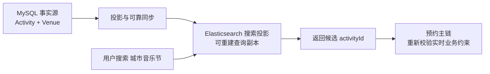

**这张图最需要看懂什么：** ES 帮用户找到活动，却不决定用户能否预约。搜索投影可以从 MySQL 重建，不能反过来成为库存或交易事实源。

ES 搜索投影也不等于普通 Redis Cache。两者都是派生副本，但 ES 文档有 Mapping、倒排索引、相关性评分、分页视图和独立的全量重建治理，使用语义不同。

**这一章只需要记住：** 引入 ES 是为了组合搜索能力和可治理的查询投影，不是因为 MySQL 完全不能查文本。

---

<a id="ch-02"></a>

## 第 2 章：ES 零基础——只学当前项目需要的五个概念


### 关于ES基础概念的补充

在 CityPass 中，可以把 Elasticsearch 理解成：**把 MySQL 中的活动事实整理成适合搜索的文档，再通过专门的检索结构快速找到相关活动。**

### 1. Document：一条可搜索的数据

Document 就是一份可以被 ES 搜索的 JSON 数据，可以先类比成 MySQL 中的一行记录。

例如 CityPass 中的一条活动搜索文档可能包含：

```json
{
  "activityId": 101,
  "title": "城市音乐节",
  "priceCents": 9900,
  "venueName": "滨江艺术中心"
}
```

当前项目中，一个 Activity Document 还会冗余部分 Venue 信息，方便直接按场馆名称、位置等条件搜索。

### 2. Index：很多 Document 的集合

Index 可以先类比成“装很多搜索文档的集合”。

```text
Index
├─ Activity 101
├─ Activity 102
├─ Activity 103
└─ ...
```

入门时可以暂时把它类比成 MySQL 的表，但 ES 的 Index 还包含对应的搜索结构，和 MySQL 中的普通二级索引不是同一个概念。

### 3. Mapping：规定每个字段是什么类型

Mapping 类似 MySQL 的表结构，用来告诉 ES：

```text
title            → text
activityCategory → keyword
priceCents       → long
location         → geo_point
```

不同类型决定了字段以后适合做什么：

- `text`：适合全文检索；
- `keyword`：适合精确匹配；
- 数字类型：适合范围过滤和排序；
- `geo_point`：适合距离查询。

### 4. Analyzer：把文本处理成可搜索的词

Analyzer 可以理解成“文本分析器 / 分词器”。

例如为了理解，可以假设：

```text
城市音乐节
↓
城市
音乐节
```

ES 会基于这些词元建立检索结构。查询时，用户输入的关键词也会经过 Analyzer。

CityPass 当前使用 SmartCN 做中文文本分析。具体怎么切词不能只靠猜，真实结果应通过 ES 的分析接口验证。

### 5. 倒排索引：从“词”快速找到 Document

假设有三条活动：

```text
101：城市音乐节
102：城市夜跑
103：周末音乐节
```

ES 会建立类似这样的结构：

```text
城市   → 101、102
音乐节 → 101、103
夜跑   → 102
周末   → 103
```

这样用户搜索“音乐节”时，ES 不需要把所有 Document 一条条扫描，而是可以直接定位到相关文档。

### 一条链记住这五个概念

```text
MySQL Activity
↓
整理成 Document
↓
放进 Index
↓
Mapping 决定字段如何处理
↓
Analyzer 处理文本
↓
建立倒排索引
↓
用户以后可以快速全文检索
```

> 可以简单记忆：**Document 是数据，Index 是集合，Mapping 定规则，Analyzer 负责分词，倒排索引负责根据词快速找到文档。**


### 2.1 ES Document

ES Document 是一条 JSON 搜索记录。Activity 101 在 ES 中不只保存活动表字段，还冗余关联 Venue 的名称、区域、地址和坐标：

```json
{
  "activityId": 101,
  "venueId": 2,
  "title": "城市音乐节",
  "description": "青年乐队与独立音乐现场",
  "activityCategory": "MUSIC",
  "eventStartTime": 4059649200000,
  "eventEndTime": 4059660000000,
  "priceCents": 8000,
  "status": 1,
  "searchable": true,
  "searchVersion": 4,
  "venueName": "滨江艺术中心",
  "location": {"lat": 30.2362, "lon": 120.1915}
}
```

这样查询时不必先从 ES 找 Activity ID，再逐条 JOIN Venue。代价是 Venue 改名或移动后，所有关联 Activity 文档也要更新；第 15 章会展开这种写放大。

### 2.2 物理 Index

物理 Index 是一组 ES Document 及其搜索结构。可以先把它类比成 MySQL 表来入门，但两者并不相同：MySQL 表围绕事务行存储设计；ES 物理 Index 还包含倒排索引、字段 Mapping、分片和段等搜索结构。

CityPass 用带时间和随机后缀的物理 Index 承载一次全量重建，例如：

```text
citypass-activity-search-v20260920103000-a1b2c3d4
```

### 2.3 Mapping

Mapping 是字段结构规则：字段是什么类型、能否分词、怎样过滤、怎样排序。标题需要全文检索，价格需要范围比较，坐标需要距离计算，所以它们不能都当普通字符串。

### 2.4 Analyzer

Analyzer 是文本分析器。文本写入和查询时会经过字符处理、分词等步骤，形成可检索的词元。CityPass 的全文字段使用 SmartCN；它是 ES 的中文分析插件，不是 Java 工具包。

### 2.5 倒排索引

倒排索引从“文档包含哪些词”反转成“某个词出现在哪些文档”。下面只是教学切词，不代表 SmartCN 的真实输出；真实结果必须调用 `_analyze` 验证。

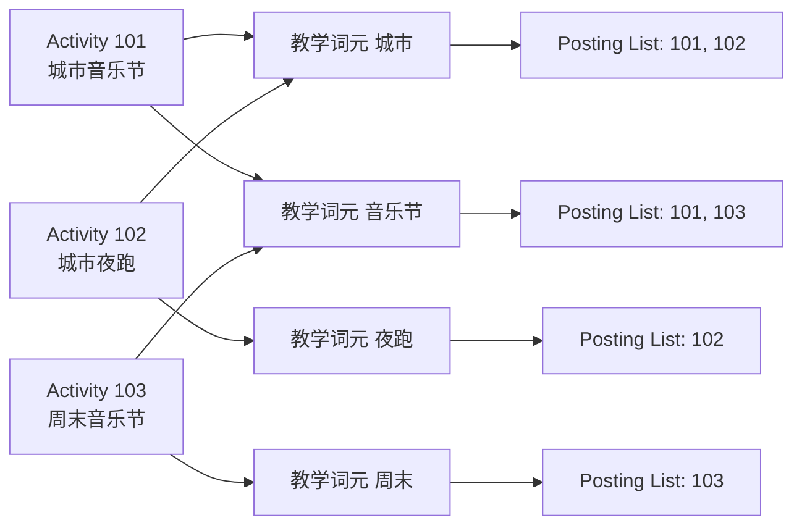

**这张图最需要看懂什么：** 查询“音乐节”时，系统可以直接找到对应 posting list，而不是逐条扫描所有标题做子串比较。真实评分还会考虑词频、文档频率和字段权重。

**这一章只需要记住：** Document 是搜索记录，物理 Index 容纳文档，Mapping 规定字段能力，Analyzer 产生词元，倒排索引从词元找到文档。

---

<a id="ch-03"></a>

## 第 3 章：一条 Activity 是怎样变成 ES Document 的

Activity 101 的搜索文档来自 `tb_activity_pass` 与 `tb_venue` 的一次 LEFT JOIN。[`ActivitySearchSourceRepository`](./src/main/java/com/citypass/search/ActivitySearchSourceRepository.java) 把两张表读取成 `ActivitySearchSource`：

```java
private static final String SOURCE_COLUMNS =
        "p.id activity_id,p.venue_id,p.title,p.sub_title,p.description,p.rules," +
        "p.activity_category,p.tags,p.event_start_time,p.event_end_time," +
        "p.pay_value price_cents,p.type pass_type,p.status,p.search_version," +
        "v.name venue_name,v.area,v.address,v.x longitude,v.y latitude ";

public ActivitySearchSource findById(Long id) {
    List<ActivitySearchSource> rows = jdbcTemplate.query(
            "SELECT " + SOURCE_COLUMNS +
            "FROM tb_activity_pass p LEFT JOIN tb_venue v ON v.id=p.venue_id " +
            "WHERE p.id=?", new Object[]{id}, SOURCE_MAPPER);
    return rows.isEmpty() ? null : rows.get(0);
}
```

**这段代码做什么：** 用一条 SQL 取齐活动事实和搜索需要的场馆字段。

**为什么这样设计：** 同一条 SQL 的结果形成一份语句级一致的文档来源，避免先查 Activity、过一会儿再查 Venue 导致一次构建内部字段来自不同时点。

**如果没有 JOIN：** 查询响应要二次查表，或者索引任务要自行拼接多次读取，复杂度和不一致窗口都会增加。

**上下游：** 上游是 ReliableTask handler 或全量重建扫描；下游是 `ActivitySearchDocumentMapper.from()`。

[`ActivitySearchDocumentMapper`](./src/main/java/com/citypass/search/ActivitySearchDocumentMapper.java) 负责格式转换和可搜索性判断：

```java
document.setEventStartTime(toMillis(source.getEventStartTime()));
document.setEventEndTime(toMillis(source.getEventEndTime()));
document.setTags(splitTags(source.getTags()));
document.setSearchable(isComplete(source));

private boolean isComplete(ActivitySearchSource source) {
    return Integer.valueOf(1).equals(source.getStatus())
            && notBlank(source.getTitle())
            && notBlank(source.getActivityCategory())
            && source.getEventStartTime() != null
            && source.getEventEndTime() != null
            && source.getEventEndTime().isAfter(source.getEventStartTime());
}
```

**这段代码做什么：** 日期转 epoch millis，中文或英文逗号标签拆成最多 20 个去重项，并根据状态和必要字段计算 `searchable`。

**为什么文档仍然存在：** 不完整或下架活动会写成 `searchable=false` 的高版本文档，而不是消失。这保留了版本墓碑，避免旧的可搜索文档迟到复活。

**如果只索引完整活动：** 下架任务若简单删除，较低版本上架任务可能之后重新创建文档。

**上下游：** 上游是 `ActivitySearchSource`；下游是 `indexToAlias()` 或 `bulkIndex()`。

[`ActivitySearchDocument`](./src/main/java/com/citypass/search/ActivitySearchDocument.java) 的真实字段包括：

```text
activityId, venueId, title, subTitle, description, rules,
activityCategory, tags, eventStartTime, eventEndTime, priceCents,
passType, status, searchable, searchVersion,
venueName, area, address, longitude, latitude
```

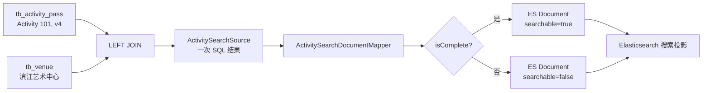

**这张图最需要看懂什么：** ES Document 是 Activity 与 Venue 的反规范化投影。搜索读取更直接，但写入侧必须治理冗余字段、版本与联动更新。

**这一章只需要记住：** 搜索快的一部分代价，是在写入侧维护冗余、可重建的文档投影。

---

<a id="ch-04"></a>

## 第 4 章：一次真实搜索请求到底怎样执行

真实接口是：

```http
GET /search/activities?keyword=城市音乐节&category=MUSIC&maxPriceCents=10000&size=10
```

[`ActivitySearchController.search()`](./src/main/java/com/citypass/controller/ActivitySearchController.java) 只接收业务参数对象，不允许前端直接提交任意 ES DSL：

```java
@GetMapping
public Result search(@ModelAttribute ActivitySearchRequest request) {
    return Result.ok(searchService.search(request));
}
```

`ActivitySearchRequest` 支持关键词、分类、举办时间、价格、经纬度、半径、排序、页大小和签名游标。[`ActivitySearchRequestValidator.validate()`](./src/main/java/com/citypass/search/ActivitySearchRequestValidator.java) 把它们规范化：

```java
normalized.setKeyword(trim(request.getKeyword()));
normalized.setCategory(category == null ? null : category.toUpperCase(Locale.ROOT));
normalized.setSize(request.getSize() == null ? 20 : request.getSize());
...
if (normalized.getSize() <= 0
        || normalized.getSize() > properties.getMaxPageSize()) {
    throw new IllegalArgumentException("页大小范围为 1-" + properties.getMaxPageSize());
}
ActivitySearchSort sort = parseSort(request.getSort());
if (sort == null) {
    sort = normalized.getKeyword() == null
            ? ActivitySearchSort.EVENT_TIME
            : ActivitySearchSort.RELEVANCE;
}
```

**这段代码做什么：** 清理空白、统一分类大小写、验证时间/价格/坐标/半径/页大小，并选择确定的默认排序。

**为什么需要 Validator：** 查询资源必须受控。当前页大小最多 50、距离半径最多 50,000 米；没有坐标时不能要求距离排序。

**如果前端直传 DSL：** 用户可以构造高成本查询、访问未授权字段或破坏稳定排序约束。

**上下游：** Controller 绑定原始参数；Validator 输出 `NormalizedActivitySearchRequest` 给 `ActivitySearchService`。

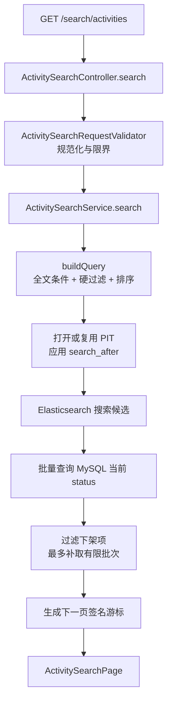

**这张图最需要看懂什么：** ES 返回候选后链路还没结束；服务会用 MySQL 当前状态复核，再根据最后实际扫描位置生成下一页游标。

**这一章只需要记住：** 搜索接口接收受控业务参数，服务端负责构造 DSL、管理分页视图、复核状态和签发游标。

---

<a id="ch-05"></a>

## 第 5 章：关键词检索、硬过滤和排序到底有什么区别

假设两条候选活动：

- A：标题命中“音乐节”，相关性很高，价格 200 元；
- B：介绍命中“音乐节”，相关性较低，价格 80 元。

用户要求 `keyword=音乐节&maxPriceCents=10000`。A 即使分数更高，也没有资格进入结果；B 通过价格过滤后才能参与排序。

- **全文检索**回答“谁与关键词更相关”；
- **filter** 回答“谁有资格进入候选集”，通常不参与相关性评分；
- **sort** 决定合格候选最终以什么顺序返回。

[`ActivitySearchService.buildQuery()`](./src/main/java/com/citypass/search/ActivitySearchService.java) 先建立硬条件：

```java
BoolQueryBuilder query = QueryBuilders.boolQuery()
        .filter(QueryBuilders.termQuery("searchable", true))
        .filter(QueryBuilders.rangeQuery("eventEndTime").gte(snapshotEpochMillis));

if (request.getKeyword() != null) {
    query.must(QueryBuilders.multiMatchQuery(request.getKeyword())
            .field("title", 4.0f)
            .field("subTitle", 2.0f)
            .field("tags", 2.0f)
            .field("venueName", 1.5f)
            .field("description", 1.0f)
            .field("rules", 0.3f));
} else {
    query.must(QueryBuilders.matchAllQuery());
}
```

随后按需增加：

```java
query.filter(QueryBuilders.termQuery("activityCategory", request.getCategory()));
query.filter(QueryBuilders.rangeQuery("priceCents").lte(request.getMaxPriceCents()));
query.filter(QueryBuilders.geoDistanceQuery("location")
        .point(request.getLatitude(), request.getLongitude())
        .distance(request.getRadiusMeters(), DistanceUnit.METERS));
```

**这段代码做什么：** `multi_match` 在六个文本字段召回并评分；`searchable`、未结束、分类、相交时间、价格和距离进入 filter。

**为什么时间条件是相交语义：** 请求区间与活动区间相交需要 `eventEnd >= from` 且 `eventStart <= to`，不是简单要求活动完全落在请求区间内。

**如果把价格放进全文评分：** 超预算活动仍可能因高分进入结果；如果把所有文本做精确 filter，又会失去分词与相关性排序。

**上下游：** Validator 提供合法参数；构建出的 `SearchSourceBuilder` 交给 ES Client 执行。

排序规则为：

```text
RELEVANCE: _score DESC, eventStartTime ASC, activityId ASC
EVENT_TIME: eventStartTime ASC, activityId ASC
DISTANCE: geo distance ASC, eventStartTime ASC, activityId ASC
```

`activityId` 是唯一 tie-breaker，避免两条活动主排序值相同时顺序不确定。

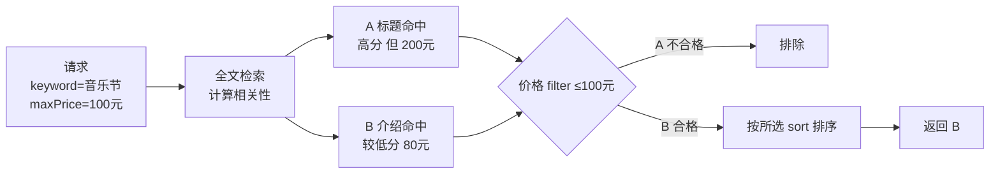

**这张图最需要看懂什么：** 相关性分数不能让候选绕过业务硬条件；只有通过 filter 的文档才进入最终排序。

**这一章只需要记住：** relevance 决定相关程度，filter 决定资格，sort 决定结果次序。

---

<a id="ch-06"></a>

## 第 6 章：中文分词、SmartCN 与 `multi_match`

文本写入 ES 时，Analyzer 把“城市音乐节”转成词元并写入倒排索引；查询时，同一搜索分析器也把用户输入转成词元，再从倒排索引召回候选。写入分析和查询分析必须相互兼容，否则会出现“索引里是一种词，查询产生另一种词”的问题。

CityPass 的 [`deploy/elasticsearch/Dockerfile`](./deploy/elasticsearch/Dockerfile) 固定 ES 7.17.29 并安装 SmartCN：

```dockerfile
FROM docker.elastic.co/elasticsearch/elasticsearch:7.17.29
RUN bin/elasticsearch-plugin install --batch analysis-smartcn
```

SmartCN 是一个中文分词插件。它提供适合一般中文文本的分析能力，但词典效果不应靠想象。调试“城市音乐节”时应执行：

```http
POST /citypass-activity-search/_analyze
Content-Type: application/json

{"analyzer":"smartcn","text":"城市音乐节"}
```

当前 Mapping 对 `title、subTitle、description、rules、tags、venueName、area、address` 同时配置 `analyzer=smartcn` 与 `search_analyzer=smartcn`。

`multi_match` 把同一个查询词应用于多个字段。当前代码没有显式设置 `type`、`operator` 或 phrase，因此使用 ES 7.17 的默认 `best_fields` 行为和默认 OR 语义；它不是“完整连续短语必须命中”。字段权重为：

| 字段 | boost |
|---|---:|
| `title` | 4.0 |
| `subTitle` | 2.0 |
| `tags` | 2.0 |
| `venueName` | 1.5 |
| `description` | 1.0 |
| `rules` | 0.3 |

ES 默认相关性使用 BM25。入门时可以把它理解为：同时考虑词在本文档出现情况、词在所有文档中的稀有程度和字段长度，再结合字段 boost 得到分数。当前项目没有自定义 similarity。

常见错误认知：

- 分词器只决定怎样产生词元，不单独决定最终排序；
- 全文检索不是把所有字段拼起来做 `%LIKE%`；
- `title^4` 只是影响评分，不能保证标题命中永远第一；
- 当前查询没有 phrase 约束，不能宣称“城市音乐节”必须连续匹配。

**这一章只需要记住：** SmartCN 决定文本怎样被分析，`multi_match` 决定在哪些字段召回，BM25 和 boost 共同影响相关性。

---

<a id="ch-07"></a>

## 第 7 章：Mapping 为什么决定能不能搜、过滤和排序

[`ActivitySearchIndexService.mapping()`](./src/main/java/com/citypass/search/ActivitySearchIndexService.java) 使用 `dynamic: strict`：未声明字段不能悄悄进入文档。

```java
builder.startObject().field("dynamic", "strict").startObject("properties");
keyword(builder, "activityId", "long");
text(builder, "title");
keyword(builder, "activityCategory", "keyword");
keyword(builder, "eventStartTime", "date");
keyword(builder, "priceCents", "long");
keyword(builder, "searchable", "boolean");
keyword(builder, "searchVersion", "long");
keyword(builder, "location", "geo_point");
```

这里名为 `keyword()` 的 Java helper 只是“写入给定 ES type”，并不意味着所有调用都创建 `keyword` 字段。真实类型如下：

| 字段组 | ES 类型 | 当前用途 |
|---|---|---|
| `title、description、tags、venueName...` | `text` + SmartCN | 全文检索和评分 |
| `activityCategory` | `keyword` | 精确分类过滤 |
| `activityId、venueId、priceCents、searchVersion` | `long` | 唯一标识、范围、版本 |
| `passType、status` | `integer` | 精确状态/类型值 |
| `eventStartTime、eventEndTime` | `date` | 时间范围与排序；源码传 epoch millis |
| `location` | `geo_point` | 距离过滤与排序 |
| `searchable` | `boolean` | 排除下架或不完整文档 |

全文字段由 helper 配置：

```java
private void text(XContentBuilder builder, String name) throws IOException {
    builder.startObject(name)
            .field("type", "text")
            .field("analyzer", "smartcn")
            .field("search_analyzer", "smartcn")
            .endObject();
}
```

**这段代码做什么：** 固定写入和查询分析器，确保这些字段建立倒排索引并按中文词元查询。

**为什么不能全用 `text`：** 对价格分词没有意义，分类需要精确相等，坐标需要空间计算。反过来，若标题用 `keyword`，只能做整值精确匹配，无法获得当前中文全文召回。

**如果没有 strict Mapping：** 拼错字段或类型漂移可能被动态 Mapping 接受，错误直到查询或重建时才暴露。

**上下游：** `createPhysicalIndex()` 创建 Mapping；`source(document)` 必须只写这些声明字段；`buildQuery()` 按字段类型选择 match、term、range 或 geo 查询。

**这一章只需要记住：** Mapping 是搜索契约，字段类型直接限定可用的查询和排序方式。

---

<a id="ch-08"></a>

## 第 8 章：分页为什么不能只用 `from + size`

### 8.1 先理解普通 `from + size`

结果为 A、B、C、D、E，`size=2` 时：第一页 `from=0` 取 A、B；第二页 `from=2` 取 C、D。页数越深，ES 越需要收集并排序前面的结果；同时第一页和第二页之间若索引变化，offset 位置会移动，可能重复或漏读。

### 8.2 `search_after` 保存位置

`search_after` 不说“跳过前 10,000 条”，而是把上一页最后实际扫描文档的排序值交回 ES，表示从这个位置之后继续。


**这张图最需要看懂什么：** `search_after` 保存的是排序位置，所以排序必须确定且可重复。CityPass 最后追加唯一 `activityId ASC` 作为 tie-breaker。

### 8.3 PIT 固定同一轮 ES 搜索视图

仅有位置还不够。第一页之后若新活动插入、旧活动修改排序字段，下一页面对的集合已经变化。PIT（Point In Time）是 ES 为一段时间保留的搜索视图。它固定的是这一轮 ES 搜索所见的索引视图，不是 MySQL 全局事务快照，也不提供跨 MySQL 与 ES 的强一致。

当前第一页调用 `openPointInTime(alias)`，默认 keep-alive 为 60 秒；后续查询把 PIT ID 放入 `PointInTimeBuilder` 并续期。代码仍额外冻结首次搜索时间 `snapshotEpochMillis`，让“活动尚未结束”的过滤基准在翻页期间不漂移。

### 8.4 两者为什么一起用

- `search_after` 保存“读到哪里”；
- PIT 保存“在哪个 ES 视图中继续读”。

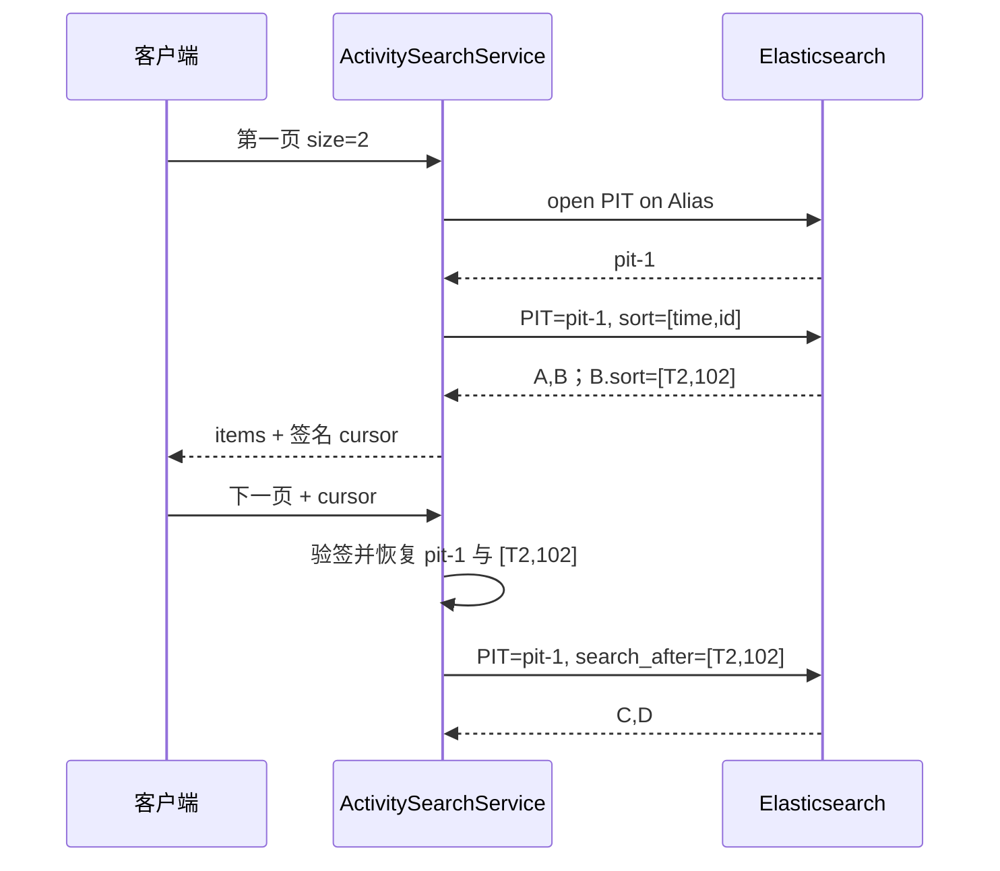

**这张图最需要看懂什么：** PIT 让两页基于同一 ES 视图，`search_after` 让第二页从 B 的确定排序位置继续。两者解决的问题不同。

[`buildQuery()`](./src/main/java/com/citypass/search/ActivitySearchService.java) 的分页部分是：

```java
int fetchSize = Math.min(
        properties.getMaxPageSize() + 1,
        request.getSize() + 1);
SearchSourceBuilder source = new SearchSourceBuilder()
        .query(query)
        .size(fetchSize)
        .trackTotalHits(false)
        .pointInTimeBuilder(new PointInTimeBuilder(pitId)
                .setKeepAlive(TimeValue.timeValueSeconds(
                        properties.getPitKeepAliveSeconds())));
source.sort("eventStartTime", SortOrder.ASC)
      .sort("activityId", SortOrder.ASC);
if (searchAfter != null && !searchAfter.isEmpty()) {
    source.searchAfter(searchAfter.toArray());
}
```

多取 1 条用于判断是否可能还有下一页，`trackTotalHits(false)` 避免为了返回页数据计算精确总数。

**这一章只需要记住：** `search_after` 保存位置，PIT 保存 ES 视图，唯一 tie-breaker 保证同值结果有稳定次序。

---

<a id="ch-09"></a>

## 第 9 章：签名 Cursor 到底是什么

下一页需要携带 PIT ID、上一页排序位置、首次搜索时间、过期时间和查询条件指纹。如果让前端分别提交这些裸参数，用户可以替换 PIT、改排序位置或换查询条件继续翻页。

签名游标把分页状态打包，并使用服务端密钥生成 HMAC-SHA256 签名。签名用于检测篡改；Base64URL 只是把二进制变成 URL 友好文本，**不是加密**，客户端仍可能解码看到内容。

[`ActivitySearchCursor`](./src/main/java/com/citypass/search/ActivitySearchCursor.java) 保存：

```text
pitId
sortValues
queryFingerprint
snapshotEpochMillis
expiresAtEpochMillis
```

[`ActivitySearchCursorCodec.encode()/decode()`](./src/main/java/com/citypass/search/ActivitySearchCursorCodec.java) 的关键步骤是：

```java
byte[] payload = JSONUtil.toJsonStr(cursor).getBytes(UTF_8);
return base64(payload) + "." + base64(sign(payload));

if (!MessageDigest.isEqual(signature, sign(payload))) {
    throw new IllegalArgumentException();
}
```

**这段代码做什么：** 编码时对原始 payload 签名；解码时重新计算并使用常量时间比较，再校验必须字段。

**为什么密钥至少 16 个字符：** 空或过短密钥会让签名保护失去意义；配置不合法时模块明确不可用。

**如果只 Base64：** 用户修改排序位置或 PIT ID 后重新编码即可绕过约束。

**上下游：** `doSearch()` 生成/读取 `ActivitySearchCursor`；客户端只传一个 `cursor` 字符串。

查询指纹是规范化条件、排序、页大小和首次搜索时间的 SHA-256 摘要：

```java
String canonical = keyword + "\n" + category + "\n" + eventFrom + ...
        + sort + "\n" + size + "\n" + snapshotEpochMillis;
```

它把游标绑定到原查询。用户不能拿“音乐节、10 条、相关性排序”的游标改成“夜跑、50 条、距离排序”继续翻页。

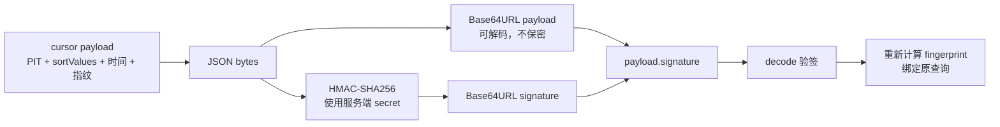

**这张图最需要看懂什么：** HMAC 防篡改，fingerprint 防换条件续页，Base64 只编码。三者职责不同。

PIT 在无下一页、显式 `DELETE /search/activities/cursor` 或首次查询异常时会尽力关闭；显式关闭失败也依赖有限 keep-alive 最终释放。

**这一章只需要记住：** 签名游标是由服务端签发的分页状态，不是保密令牌。

---

<a id="ch-10"></a>

## 第 10 章：为什么 ES 搜到以后，还要查 MySQL 状态

PIT 固定 ES 视图。若 PIT 打开时 Activity 101 上架，随后管理员把它下架，旧 PIT 仍可能召回旧文档。业务返回前，CityPass 批量查询 MySQL 当前 `status`，只保留状态 1。

[`ActivitySearchService.doSearch()`](./src/main/java/com/citypass/search/ActivitySearchService.java) 的扫描核心如下：

```java
List<Long> ids = Arrays.stream(hits)
        .map(hit -> number(hit.getSourceAsMap().get("activityId")).longValue())
        .collect(Collectors.toList());
Map<Long, Integer> currentStatuses = sourceRepository.findCurrentStatuses(ids);

for (SearchHit hit : hits) {
    lastScanned = Arrays.asList(hit.getSortValues());
    Long id = number(hit.getSourceAsMap().get("activityId")).longValue();
    if (Integer.valueOf(1).equals(currentStatuses.get(id))) {
        results.add(toItem(hit, request));
    }
    if (results.size() == request.getSize()) break;
}
```

**这段代码做什么：** 一批 ES hits 只发一次 `WHERE id IN (...)` 查询；无论该 hit 最后是否返回，`lastScanned` 都推进到最后实际检查的位置。

**为什么要补取：** 一批 11 条中若 5 条已下架，过滤后可能不足请求的 10 条。服务最多继续扫描 `maxSupplementBatches`，当前默认 3 批。

**为什么游标不能只记最后返回项：** 被过滤 hit 也已经扫描过；若游标退回它之前，下一页会重复检查甚至重复返回。也不能直接记整批最后 hit，因为当前页可能在批次中间已经凑满，后面未消费 hit 会被跳过。

**上下游：** 上游是 ES PIT hits；下游是 `ActivitySearchItem` 与下一页 cursor。

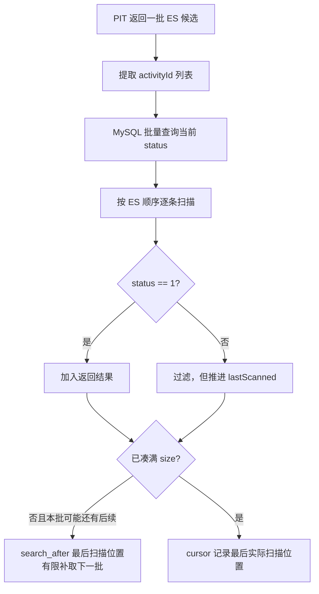

**这张图最需要看懂什么：** PIT 提供稳定 ES 候选视图，MySQL 提供有限的实时状态复核。两者组合也不是跨系统事务快照，复核后到用户真正预约之间仍可能再次下架或售罄。

**这一章只需要记住：** ES 管候选与排序，MySQL 在返回前校验当前上架状态，预约主链还要再次校验实时业务条件。

---

<a id="ch-11"></a>

## 第 11 章：为什么 MySQL 更新后不能直接更新 ES 就结束

直觉方案是先提交 MySQL，再调用 ES：

```text
update MySQL → COMMIT → update Elasticsearch
```

如果进程在 COMMIT 后崩溃，MySQL 已是新标题，ES 仍是旧标题。反过来，ES 写成功而任务状态回写失败也会导致重复执行。外部副作用天然需要面对遗漏与重复。

事务发件箱思想（Transactional Outbox）是：把业务事实变化和“必须更新搜索投影”的待办写进同一个 MySQL 本地事务。CityPass 复用 `tb_reliable_task` 作为 ReliableTask 表。

[`ActivityPassServiceImpl.updateSearchMetadata()`](./src/main/java/com/citypass/service/impl/ActivityPassServiceImpl.java) 的真实链路是：

```java
@Transactional(rollbackFor = Exception.class)
public Result updateSearchMetadata(Long id, ActivitySearchMetadataRequest request) {
    validateSearchMetadata(request, true);
    searchRebuildStateRepository.assertWritesAllowed();
    if (activitySearchSourceRepository.updateMetadata(id, request) != 1) {
        return Result.fail("活动不存在");
    }
    Long version = activitySearchSourceRepository.findVersion(id);
    activitySearchOutboxService.enqueue(id, version);
    return Result.ok();
}
```

对应 SQL 同时更新字段并递增版本：

```sql
UPDATE tb_activity_pass
SET title=?, sub_title=?, description=?, activity_category=?, tags=?,
    event_start_time=?, event_end_time=?, search_version=search_version+1
WHERE id=?
```

**这段代码做什么：** 在一个 MySQL 事务中检查重建门禁、更新搜索字段、递增 `searchVersion` 并登记 `INDEX_ACTIVITY_SEARCH` 任务。

**为什么同事务：** 业务更新若回滚，任务也回滚；业务更新若提交，任务就有持久重试依据。

**如果只用提交后回调：** COMMIT 后、回调执行前崩溃仍可能永久漏掉索引更新。

**上下游：** 上游是活动搜索字段更新接口；下游是 `ReliableTaskScheduler`。

ReliableTask payload 只保存 `activityId` 与 `requestedVersion`，不保存完整旧文档。[`ActivitySearchIndexTaskHandler.execute()`](./src/main/java/com/citypass/search/ActivitySearchIndexTaskHandler.java) 执行时重新读当前 MySQL + Venue：

```java
ActivitySearchSource source = sourceRepository.findById(task.getActivityId());
if (source.getSearchVersion() < task.getRequestedVersion()) {
    throw new IllegalStateException("数据库搜索版本落后于任务版本");
}
indexService.indexToAlias(documentMapper.from(source));
```

这样重复或积压任务会尽量投影当前事实，而不是反复写 payload 中的旧快照。`requestedVersion` 仍用于发现数据库版本异常倒退。

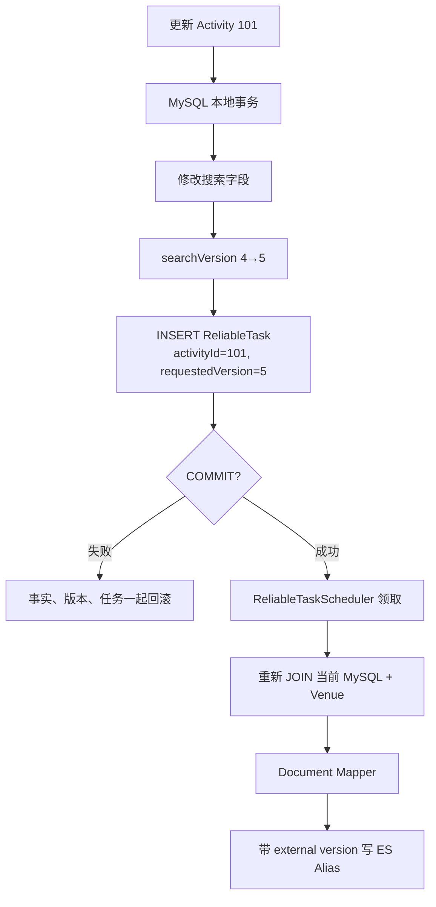

**这张图最需要看懂什么：** Outbox 不让 MySQL 与 ES处于同一个分布式事务；它保证提交后的索引意图可恢复，再通过幂等和版本控制承受重复执行。

当 `search.enabled=false` 时，调度器不会领取搜索任务，任务保持待处理；ES 暂时失败时任务按 ReliableTask 的租约、指数退避和最大重试规则重试，最终可能进入 `DEAD`，不会无限自动尝试。

**这一章只需要记住：** MySQL 事务保存事实、版本和待办，ES 更新由提交后的可靠任务异步完成。

---

<a id="ch-12"></a>

## 第 12 章：`searchVersion` 为什么存在

`searchVersion` 是搜索事实的单调代次。Activity 新建时为 1；搜索字段、状态或冗余 Venue 字段变化时递增。

即使任务执行时重新读最新 MySQL，仍可能乱序：

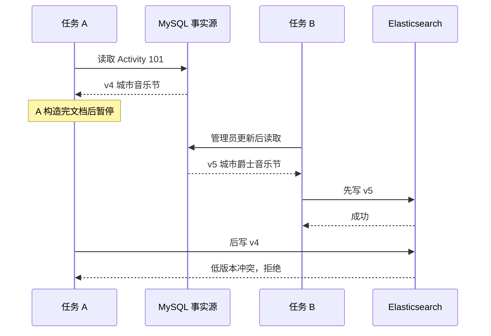

**这张图最需要看懂什么：** “执行时读最新”只能减少旧 payload，不能消除读取后到写入前的暂停。写入目标仍必须比较数据代次。

它与第 02 篇缓存版本治理可以类比：

| 多级缓存 | 全文检索 |
|---|---|
| `cacheVersion` | `searchVersion` |
| Redis version watermark | ES external version |
| 旧缓存迟到回填 | 旧搜索文档迟到写入 |
| 缓存失效 ReliableTask | 索引同步 ReliableTask |

类比只帮助理解，两者并不相同：Redis 水位是单独 key；ES external version 附着在每个文档版本元数据上。缓存链主要删除并重建，搜索链写入完整投影文档。

`tb_activity_pass.search_version` 默认为 1。版本来自 MySQL 事实行，不使用任务表的领取版本，也不使用本机时间戳。

**这一章只需要记住：** `searchVersion` 标识业务事实属于哪一代，专门防止完成顺序与提交顺序不同。

---

<a id="ch-13"></a>

## 第 13 章：`external_gte` 为什么能阻止旧任务覆盖新文档

ES external version 是由外部事实源提供的版本，而不是使用 ES 自己的内部递增逻辑。CityPass 把 `searchVersion` 放入 [`ActivitySearchIndexService.indexDocument()`](./src/main/java/com/citypass/search/ActivitySearchIndexService.java)：

```java
IndexRequest request = new IndexRequest(target)
        .id(String.valueOf(document.getActivityId()))
        .source(JSONUtil.toJsonStr(source(document)), XContentType.JSON)
        .version(document.getSearchVersion())
        .versionType(VersionType.EXTERNAL_GTE);
```

`external_gte` 表示允许外部版本 **greater than or equal**：

- ES 当前 v5，传入 v4：拒绝；
- ES 当前 v5，传入 v5：允许幂等重放；
- ES 当前 v5，传入 v6：允许覆盖并推进版本。

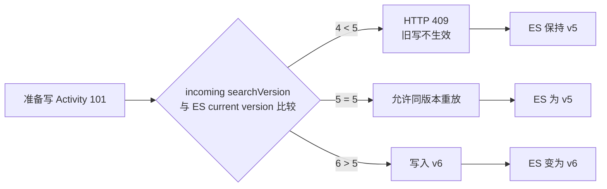

**这张图最需要看懂什么：** external version 把最终生效顺序从“谁最后到 ES”改成“谁的数据版本更高”。

源码只把可确认的旧写冲突当成成功 no-op：

```java
} catch (ElasticsearchStatusException e) {
    if (e.status() != RestStatus.CONFLICT
            || currentVersion(target, document.getActivityId())
               < document.getSearchVersion()) {
        throw e;
    }
    // 当前 ES 版本已经不低于本次版本，旧写无需重试
}
```

**为什么不能吞掉所有 409：** 只有确认 ES 当前版本不低于本次版本，才说明结果已被同代或更新代覆盖。其他冲突应继续报错。

**为什么允许相同版本：** 任务可能在 ES 写成功后、`markDone` 前崩溃，租约到期后会重放。同版本写入让这种至少一次执行能够收敛。

**重要前提：** 同一 `searchVersion` 必须对应确定内容。若有人绕过应用直接 SQL 修改搜索字段却不递增版本，就可能出现“同版本、不同内容”，此时 `external_gte` 允许后来内容覆盖，破坏代次语义。

**这一章只需要记住：** Outbox 解决待办不丢，external version 解决任务乱序，两者缺一不可。

---

<a id="ch-14"></a>

## 第 14 章：活动下架为什么不是简单 DELETE ES 文档

Activity 101 从上架状态 1 变成下架状态 2 时，[`updateStatus()`](./src/main/java/com/citypass/service/impl/ActivityPassServiceImpl.java) 同样经过写入门禁、递增 `searchVersion` 并登记任务：

```java
int changed = activitySearchSourceRepository.updateStatus(id, status);
Long version = activitySearchSourceRepository.findVersion(id);
if (changed == 1) activitySearchOutboxService.enqueue(id, version);
```

Document Mapper 会生成 `status=2、searchable=false、searchVersion=5` 的文档。查询固定过滤 `searchable=true`，因此它不再被召回。

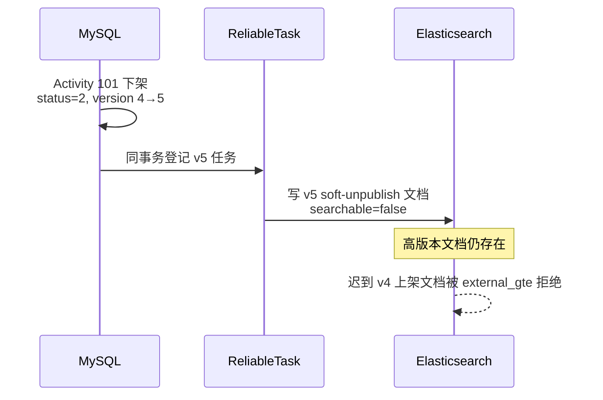

**这张图最需要看懂什么：** v5 不可搜索文档像版本墓碑，既让查询排除活动，又保留“至少到 v5”的版本事实。简单 DELETE 后，ES 中没有版本可比较，迟到 v4 可能重新创建文档。

搜索下架只改变搜索可见性。它不等于取消已存在预约、退款或回收名额，交易域有独立状态机。

**这一章只需要记住：** 下架写入高版本不可搜索文档，以防旧上架任务复活搜索结果。

---

<a id="ch-15"></a>

## 第 15 章：Venue 改名为什么会影响 Activity 搜索文档

Activity Document 冗余了 `venueName、area、address、location`。Venue 2 从“滨江艺术中心”改名后，所有关联 Activity 的投影内容都变化；如果只更新 `tb_venue`，搜索仍会显示旧场馆名。

[`VenueServiceImpl.update()`](./src/main/java/com/citypass/service/impl/VenueServiceImpl.java) 在同一 MySQL 事务末尾调用：

```java
activitySearchOutboxService.bumpVenueDocumentsAndEnqueue(id);
```

[`ActivitySearchOutboxService`](./src/main/java/com/citypass/search/ActivitySearchOutboxService.java) 的实现是：

```java
public void bumpVenueDocumentsAndEnqueue(Long venueId) {
    List<ActivitySearchVersion> versions =
            sourceRepository.bumpVenueDocuments(venueId);
    for (ActivitySearchVersion version : versions) {
        enqueue(version.getActivityId(), version.getSearchVersion());
    }
}
```

Repository 先统一递增关联行，再查询新版本：

```sql
UPDATE tb_activity_pass
SET search_version=search_version+1
WHERE venue_id=?;

SELECT id, search_version
FROM tb_activity_pass
WHERE venue_id=? ORDER BY id;
```

**这段代码做什么：** Venue 更新事务把所有关联 Activity 推进一代，并为每一条登记独立索引任务。

**为什么内容变了必须增版本：** 若 Venue 名称变化而 Activity 仍标 v4，external_gte 无法区分“旧场馆名 v4”和“新场馆名 v4”，相同版本不同内容会破坏幂等前提。

**如果只登记任务不推进版本：** 迟到的同版本任务可能覆盖更新后的冗余字段。

**上下游：** 上游是 Venue 更新事务；下游是多个 `INDEX_ACTIVITY_SEARCH` ReliableTask。

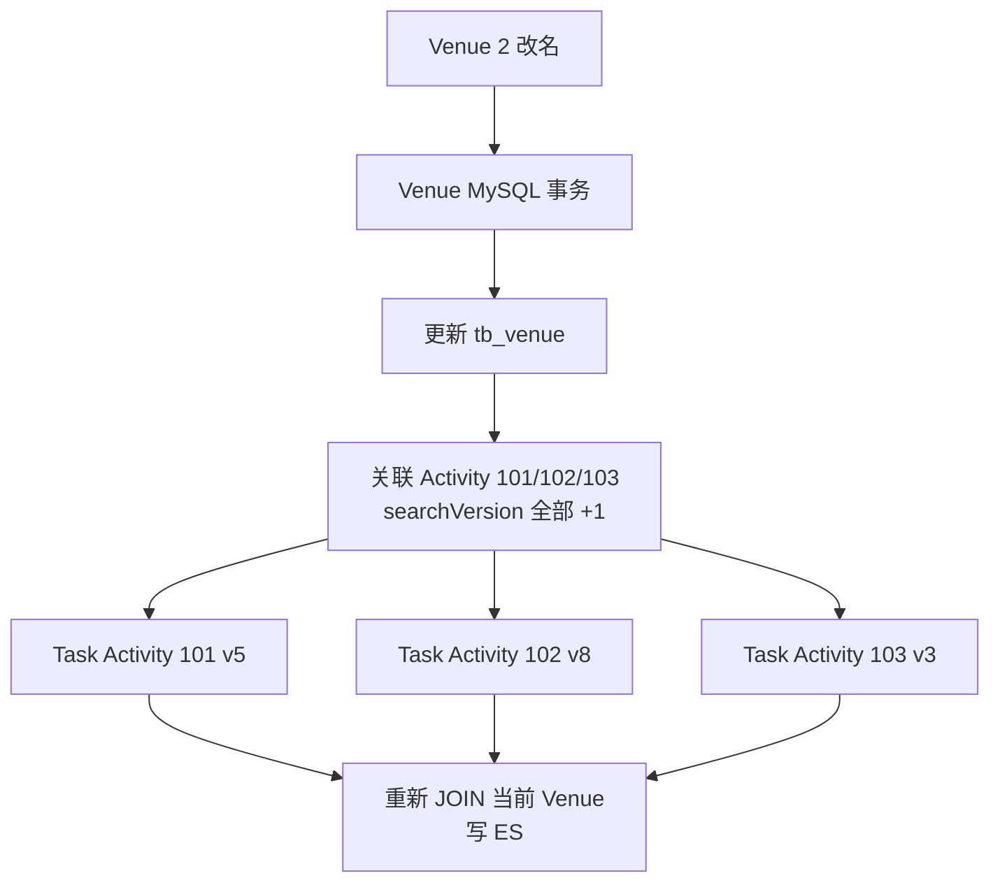

**这张图最需要看懂什么：** 搜索读取端少做 JOIN 的代价是写入扇出。一个 Venue 关联很多 Activity 时，版本更新和任务插入数量线性增长；当前实现没有宣称适合无界大扇出。

**这一章只需要记住：** 任何会改变搜索文档内容的事实都必须推进同一文档的 `searchVersion`。

---

<a id="ch-16"></a>

## 第 16 章：全量索引重建为什么不是删掉 ES 再导入

物理 Index 保存真实文档和搜索结构；业务 Alias 是一个稳定名字，指向当前对外服务的物理 Index。应用始终查询和增量写 `citypass-activity-search`，不需要知道后面的版本化物理名字。

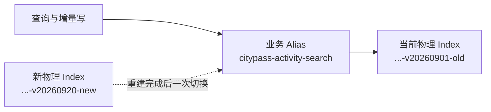

**这张图最需要看懂什么：** Alias 是稳定入口，物理 Index 是可替换实现。创建新 Index 不会自动上线，只有 Alias 指向它以后业务流量才会使用。

若先清空线上 Index 再重建，构建期间查询会缺数据，失败时也没有完整旧版本可继续服务。当前 [`ActivitySearchRebuildService.rebuild()`](./src/main/java/com/citypass/search/ActivitySearchRebuildService.java) 采用旁路构建：

1. 进入维护窗口并记录目标物理 Index；
2. 读取当前 Alias 目标；
3. 创建带 Mapping 的新物理 Index；
4. 按 Activity 主键分批扫描 MySQL；
5. bulk 写入新 Index；
6. refresh 后校验数量；
7. 一次 Alias 更新移除旧目标并添加新目标；
8. 更新 MySQL 重建状态并恢复写入。

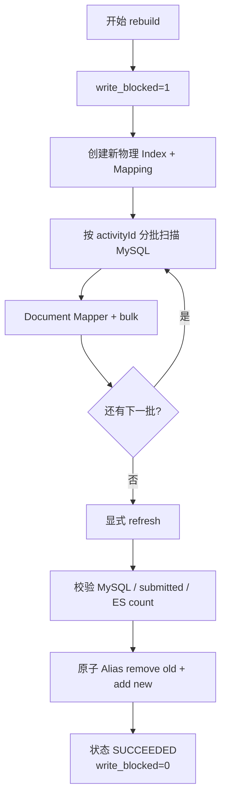

**这张图最需要看懂什么：** 新 Index 在校验与切换前不承接业务 Alias 流量；失败时旧 Alias 通常仍能继续查询。重建是同步执行的维护操作，不是后台分布式作业平台。

**这一章只需要记住：** 旁路创建新物理 Index，验证后切业务 Alias，才能保留失败前的可用旧投影。

---

<a id="ch-17"></a>

## 第 17 章：全量重建期间为什么要写入门禁

重建按主键批量扫描 MySQL。如果扫描 Activity 101 后，它又被更新到 v5，而新 Index 没有稳定接收这次增量，就可能把旧内容上线。

当前项目选择“维护窗口 + `write_blocked`”；重建期间相关业务写会被拒绝，也没有实现新旧索引双写。`tb_search_rebuild_state` 是单例协调行。

[`SearchRebuildStateRepository.assertWritesAllowed()`](./src/main/java/com/citypass/search/SearchRebuildStateRepository.java) 在 Activity 和 Venue 相关写事务中执行：

```java
Boolean blocked = jdbcTemplate.queryForObject(
        "SELECT write_blocked " +
        "FROM tb_search_rebuild_state WHERE id=1 FOR UPDATE",
        Boolean.class);
if (Boolean.TRUE.equals(blocked)) {
    throw new IllegalArgumentException(
            "活动搜索索引正在重建，活动及场馆搜索字段暂不可修改");
}
```

`begin()` 自己在短事务里锁同一行并设置 `RUNNING、write_blocked=1`：

```java
@Transactional
public void begin(String targetIndex, String previousIndex) {
    SearchRebuildState state = getForUpdate();
    if (state != null && "RUNNING".equals(state.getStatus())) {
        throw new IllegalStateException("已有活动搜索索引重建正在运行");
    }
    jdbcTemplate.update("UPDATE tb_search_rebuild_state " +
            "SET status='RUNNING',write_blocked=1,target_index=?,... WHERE id=1",
            targetIndex);
}
```

**这段代码做什么：** 业务写与 rebuild begin 竞争同一行锁。已进入的业务写先提交后，begin 才能设门禁；begin 成功后，新的相关业务写读到 blocked 并拒绝。

**为什么不用一个超长数据库事务包住整个扫描：** 大事务会长期持锁、增长 undo 和事务资源；当前只用短事务建立维护状态，重建本体在事务外执行。

**如果写入口绕过门禁：** 直接 SQL 或未接入 `assertWritesAllowed()` 的代码可能在扫描期间改变事实，新 Index 可能遗漏变化。

**上下游：** Activity 新增、搜索字段更新、上下架和 Venue 更新都调用门禁；重建成功或捕获到异常时解除。

代价也很明确：维护期间相关业务写会失败；单例状态行是协调点；当前重建没有 owner、lease 或 fencing token，进程崩溃后的恢复要人工判断。

**这一章只需要记住：** 当前方案用维护窗口换取可解释的重建一致性，不应包装成在线双写或无停顿重建。

---

<a id="ch-18"></a>

## 第 18 章：bulk、refresh、校验和 Alias 切换

### 18.1 bulk 不等于“一次请求整体成功”

bulk 把多条写入合并成一个 HTTP 请求，减少逐条网络往返。但 HTTP 请求成功只说明 ES 接收并返回了 bulk 响应，内部某些 item 仍可能失败。

[`ActivitySearchIndexService.bulkIndex()`](./src/main/java/com/citypass/search/ActivitySearchIndexService.java) 明确检查：

```java
BulkResponse response = client().bulk(request, RequestOptions.DEFAULT);
if (response.hasFailures()) {
    List<String> failures = new ArrayList<>();
    for (BulkItemResponse item : response.getItems()) {
        if (item.isFailed()) {
            failures.add(item.getId() + ":" + item.getFailureMessage());
        }
        if (failures.size() >= 3) break;
    }
    throw new IllegalStateException(
            "活动索引批量写入存在失败项: " + String.join(";", failures));
}
```

**这段代码做什么：** 只要响应包含失败 item，重建就失败，错误中最多保留前三条样例。

**如果只看 HTTP 状态：** 新 Index 可能少文档或含 Mapping 错误，却继续被 Alias 切换上线。

### 18.2 refresh 让新写入对搜索可见

ES 默认是近实时搜索：写入成功后，文档通常要等 refresh 才能被搜索与 count 看见。重建完成后显式 `refresh(target)`，再进行 count 校验。

### 18.3 三个数量相等能证明什么

源码比较：

```text
sourceCount：重建前 MySQL COUNT(*)
indexedCount：代码提交给 bulk 的行数
actualCount：refresh 后 ES _count
```

三者相等能发现明显少写、多写或批次遍历问题，但不能证明每个字段内容完全正确，也不能证明分词和排序质量正确。更严格校验可以抽样比对内容、做 checksum 或按字段验证。

### 18.4 Alias 切换

`switchAlias()` 把“移除所有旧目标”和“添加新目标”放进一个 `updateAliases` 请求。ES 对这次 Alias 更新原子应用，查询不会看到“先移除后添加”之间的空窗。

原子 Alias 更新只覆盖 ES 内部元数据，不覆盖随后写 MySQL 重建状态的动作；第 19 章会讨论这个跨系统边界。

**这一章只需要记住：** bulk 必须检查 item，refresh 后才能可靠 count，数量校验有限，Alias 原子性只在 ES 内部成立。

---

<a id="ch-19"></a>

## 第 19 章：重建失败为什么要区分切换前和切换后

### 19.1 Alias 切换前失败

如果创建新 Index、bulk、refresh 或数量校验失败，`switchAlias()` 尚未执行。旧 Alias 仍指向旧物理 Index，catch 分支把状态写为 `FAILED` 并解除门禁。失败的新 Index 不会自动删除，可在检查后通过受保护运维接口清理。

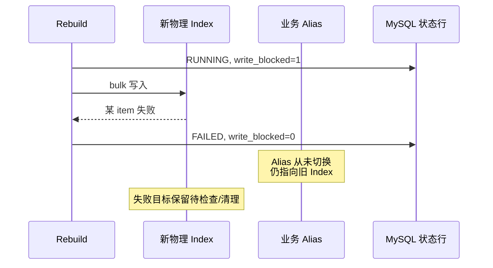

**这张图最需要看懂什么：** 切换前失败时，旧投影通常仍服务；清理对象是未上线的新 Index，不能误删 Alias 当前目标。

### 19.2 Alias 已切换、状态回写失败

如果 ES 已成功把 Alias 切到新 Index，随后 `stateRepository.succeed()` 因 MySQL 故障失败，catch 可能把状态写成 `FAILED`；若状态库也不可写，甚至可能继续显示 `RUNNING`。用户实际上已经使用新 Index。

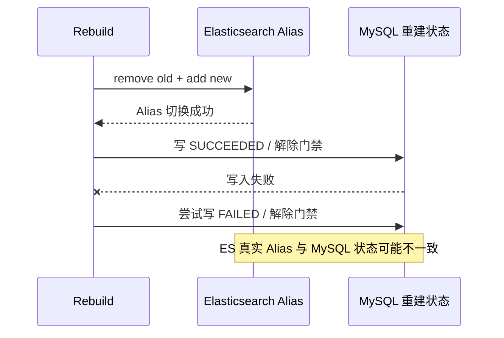

**这张图最需要看懂什么：** ES Alias 更新与 MySQL 状态更新之间没有跨系统事务。看到 `FAILED` 不能直接断定新 Index 没上线。

恢复前必须同时检查：实际 Alias 指向、`target_index`、状态行、是否仍有执行者，以及门禁值。当前没有自动协调程序完成这项判断。

### 19.3 进程在重建中崩溃

`begin()` 已提交 `RUNNING、write_blocked=1` 后若 JVM 崩溃，catch 不会执行。当前状态表没有 owner、lease、heartbeat 或 fencing；新的 rebuild 看到 RUNNING 会拒绝开始，相关业务写也可能持续被阻止。需要运维确认实际进度和 Alias 后人工恢复。

**这一章只需要记住：** 恢复动作取决于 Alias 是否已经切换，不能只看 MySQL 状态字段。

---

<a id="ch-20"></a>

## 第 20 章：PIT 和旧物理 Index 删除的关系

Alias 切到新 Index 后，新搜索会打开新目标的 PIT；切换前已经打开的旧 PIT 仍可能引用旧物理 Index。于是：

```text
Alias 不再指向旧 Index
并不等于
旧 Index 立即没有读取者
```

[`deleteInactiveIndex()`](./src/main/java/com/citypass/search/ActivitySearchIndexService.java) 当前只做两项保护：

```java
if (index == null || !index.startsWith(alias + "-v")) {
    throw new IllegalArgumentException("只能清理活动搜索模块创建的物理索引");
}
if (aliasTargets().contains(index)) {
    throw new IllegalArgumentException("不能删除当前别名指向的索引");
}
client().indices().delete(new DeleteIndexRequest(index), RequestOptions.DEFAULT);
```

**这段代码做什么：** 限制命名空间，并阻止删除当前 Alias 目标。

**当前缺口：** 它没有跟踪活跃 PIT。删除旧 Index 可能让旧 cursor 提前失效。更稳妥的运维策略应等待超过最大 PIT 生命周期和安全余量，或显式统计/管理旧 PIT，再清理。

PIT 的默认 keep-alive 是 60 秒，客户端每次翻页会续期；签名游标自己的 `expiresAt` 同样按当前 keep-alive 延长。网络延迟和在途请求仍要求清理策略保留余量。

**这一章只需要记住：** Alias 生命周期和 PIT 生命周期不同，旧 Index 清理需要单独治理。

---

<a id="ch-21"></a>

## 第 21 章：必要的 ES 底层知识补充

这些概念放到现在学习，是因为你已经看见它们解决的实际问题。

### 21.1 Lucene 与 segment

ES 底层使用 Lucene。每个分片包含多个不可变 segment；新写入先进入内部缓冲，refresh 后形成可搜索 segment。因此 ES 是近实时搜索，而不是每次写入返回后立刻对所有搜索可见。

### 21.2 refresh

refresh 让近期写入进入可搜索视图，不等同于把数据永久刷到磁盘，也不等同于全量重建完成。当前增量写依赖 ES 正常 refresh 周期；全量重建在 count 校验前显式 refresh。

### 21.3 shard

Shard 是物理 Index 的水平分片。当前创建配置是 **1 个 primary shard**。这适合项目演示与小规模功能验证，但没有大数据量容量测试，不能据此推导线上容量上限。

### 21.4 replica

Replica 是 primary shard 的副本，可承担读取并在节点故障时参与恢复。当前配置是 **0 replica**，Docker Compose 也是单节点。因此当前 CityPass 没有通过 ES 多副本实现节点级高可用。

### 21.5 当前真实版本

- Elasticsearch 服务端：7.17.29；
- Java Client：`elasticsearch-rest-high-level-client` 7.17.29；
- ES 镜像额外安装 `analysis-smartcn`；
- 搜索默认关闭，需要 `SEARCH_ENABLED=true`；
- 当前 High Level REST Client 已是旧一代客户端选择，本文描述现有源码，不把它推荐为新项目默认技术栈。

**这一章只需要记住：** 当前部署是单节点、1 primary、0 replica 的功能型环境；refresh 提供近实时可见性，不是事务提交。

---

<a id="ch-22"></a>

## 第 22 章：三条完整总链路

### 22.1 完整查询链

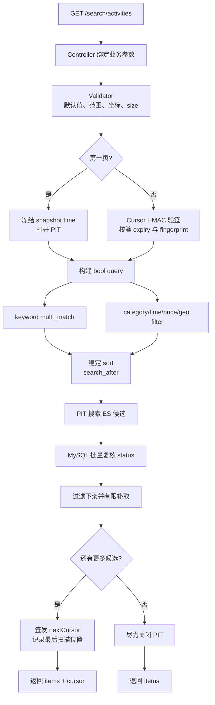

**这张图最需要看懂什么：** 查询链同时维护相关性、硬过滤、稳定 ES 视图、翻页位置和 MySQL 当前状态；cursor 是这些分页状态的防篡改载体。

### 22.2 完整增量索引同步链

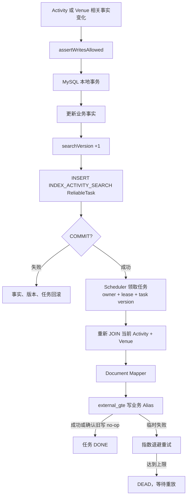

**这张图最需要看懂什么：** MySQL 事务保证事实与待办同生共死；任务至少一次执行；`searchVersion + external_gte` 决定乱序结果是否能生效。

### 22.3 完整全量重建链

```mermaid
flowchart TD
    A["POST /internal/activity-search/rebuild"] --> B["管理员 token 校验"]
    B --> C["begin 锁状态行<br/>RUNNING + write_blocked"]
    C --> D["记录旧 Alias 目标"]
    D --> E["创建新物理 Index<br/>1 shard / 0 replica / strict Mapping"]
    E --> F["MySQL 主键游标分批扫描"]
    F --> G["Mapper + bulk<br/>检查每个 item"]
    G --> H{"扫描完成?"}
    H -->|"否"| F
    H -->|"是"| I["refresh"]
    I --> J["三方 count 校验"]
    J --> K["原子切换业务 Alias"]
    K --> L["SUCCEEDED + write_blocked=0"]
    G -->|"切换前失败"| M["旧 Alias 继续服务<br/>FAILED + 解门禁"]
    K -->|"切换后状态写失败"| N["先核对真实 Alias<br/>不能按状态盲目回滚"]
```

**这张图最需要看懂什么：** 门禁保护扫描窗口，旁路 Index 保护旧服务，bulk/refresh/count 保护切换前质量；ES 切换与 MySQL 状态仍存在跨系统失败边界。

---

<a id="ch-23"></a>

## 第 23 章：用 Activity 101 的故事串全篇

1. **形成投影**：MySQL 中 Activity 101 标题为“城市音乐节”、Venue 2 为“滨江艺术中心”、`searchVersion=4`。Repository 用一条 JOIN 读取，Mapper 生成带场馆冗余字段的 ES Document。
2. **建立检索结构**：标题、介绍、标签和场馆名经过 SmartCN 分析，词元进入倒排索引；结构化字段按 Mapping 保存。
3. **执行搜索**：用户搜“城市音乐节”，`multi_match` 在六个字段召回，标题 boost 为 4；价格、时间、分类和距离决定候选资格，排序再决定次序。
4. **翻第一页**：服务记录首次时间并打开 PIT，用确定排序取一页，多取一条判断后续；ES 候选还要批量查询 MySQL status。
5. **翻下一页**：签名 cursor 恢复同一 PIT 与最后扫描排序值，fingerprint 阻止换条件续页。
6. **管理员改标题**：MySQL 事务把标题改为“城市爵士音乐节”，`searchVersion` 从 4 变 5，并登记索引 ReliableTask。
7. **任务同步**：Scheduler 领取后重新 JOIN 最新事实，构造 v5 Document，用 `external_gte` 写业务 Alias。
8. **旧任务迟到**：此前暂停的 v4 写入后来到达，ES 因 `4 < 5` 返回版本冲突；v5 保留。
9. **活动下架**：状态与版本同事务更新，ES 收到更高版本 `searchable=false` 文档。旧上架任务无法复活。
10. **Venue 改名**：Venue 2 更新时，关联 Activity 版本全部递增并分别登记任务，Activity 101 的冗余 `venueName` 收敛到新值。
11. **需要重建**：运维进入维护窗口，阻止相关写；从 MySQL 分批生成新物理 Index，检查 bulk item、refresh 和数量后切 Alias。
12. **清旧 Index**：Alias 切换后仍要考虑旧 PIT，不能仅凭“非当前 Alias 目标”就立即删除。

把整篇压缩成一句话：**查询链把用户意图变成受控搜索并复核当前状态；增量链把业务提交变成带版本的可靠投影；重建链在维护窗口从事实源替换整个投影。**

---

<a id="ch-24"></a>

## 第 24 章：当前实现还有哪些边界

| 主题 | 当前源码的准确结论 |
|---|---|
| ES / Java Client | 服务端与 High Level REST Client 都是 7.17.29；这是现有兼容选择，不是新项目默认推荐 |
| SmartCN | Docker 镜像安装 `analysis-smartcn`；换成未安装插件的 ES 节点会导致 Mapping/分析失败 |
| shard / replica | 1 primary、0 replica、单节点；没有 ES 多副本节点级容错 |
| PIT keep-alive | 默认 60 秒，请求续页会续期；超时或上下文丢失要求从第一页重新搜索 |
| PIT 范围 | 固定 ES 搜索视图，不覆盖 MySQL 状态，也不是跨系统事务快照 |
| cursor | HMAC-SHA256 防篡改，Base64URL 不保密；密钥至少 16 字符 |
| 稳定排序 | 所有模式最后都有 `eventStartTime ASC, activityId ASC`；唯一 ID 作为 tie-breaker |
| 状态复核 | 只批量复核 MySQL `status==1`；复核后到真正预约仍有状态和库存竞争 |
| 补取 | 最多默认 3 批，避免无限扫描；过滤很多时可能返回不足一页但仍给后续 cursor |
| ReliableTask | 有限重试、租约、owner 与任务执行版本；达到上限进入 DEAD，需要显式重放 |
| `external_gte` | 相等版本可重放的前提是同一 `searchVersion` 对应确定文档内容 |
| Venue 扇出 | 一个 Venue 更新会同步递增所有关联 Activity 版本并逐条插任务，成本随关联数增长 |
| rebuild 调用 | 由管理接口同步执行，请求持续时间受数据量和 ES 速度影响，没有异步 job handle |
| rebuild 协调 | 状态表没有 owner、lease、heartbeat、fencing；进程崩溃不会自动接管 |
| 崩溃后的 RUNNING | 可能持续门禁写入并拒绝新 rebuild，需要核对 Alias 和目标 Index 后人工恢复 |
| 切换后状态失败 | Alias 可能已指向新 Index，而 MySQL 显示 FAILED/RUNNING；两个系统没有共同事务 |
| 旧 PIT 清理 | 删除接口只检查命名和当前 Alias，不检测活跃 PIT；过早删除会让旧 cursor 失效 |
| 重建校验 | 数量相等只能证明行数维度，不能证明字段内容、分词或相关性质量完全正确 |
| 容量与性能证据 | 当前只有小样本功能/故障脚本，没有真实大数据量吞吐、延迟和重建时长报告 |
| 语义检索 | 当前只有 SmartCN + BM25 文本检索，没有向量字段、Embedding、ANN 或 RAG |
| 绕过应用写 DB | 直接 SQL 若不推进 `searchVersion`、不登记任务、绕过门禁，会破坏投影同步与重建假设 |
| search.enabled | 默认 `false`；关闭时搜索任务保留待处理，查询接口返回模块不可用 |
| Alias 初始化 | 增量写前必须先通过全量重建建立 Alias，否则 `indexToAlias()` 拒绝写入 |

准确的项目定位是：**已实现可恢复的最终一致搜索投影和受控维护窗口重建；没有提供线性强一致、单次执行语义、无维护窗口重建或多节点 ES 可用性。**

---

<a id="ch-25"></a>

## 第 25 章：测试和验证到底证明了什么

本次文档重构没有重新运行 Docker 或 Maven，因此以下 Java 项目写“测试源码覆盖”，PowerShell 项目写“验收脚本覆盖”。它们只有在实际执行并保留环境与结果时，才能表述为本轮实测。

### 25.1 单元测试源码覆盖

| 测试 | 构造场景 | 验证的设计 | 不能证明 |
|---|---|---|---|
| `ActivitySearchRequestValidatorTest` | 默认请求、非法坐标、半径、时间、价格、size | 默认排序和参数限界 | 不能证明 ES 实际执行正确 |
| `ActivitySearchQueryBuilderTest` | 关键词、分类、时间、价格、相关性排序 | DSL 含字段 boost、filter、稳定 tie-breaker | 只检查 JSON 片段，不证明真实分词与排名 |
| `ActivitySearchCursorCodecTest` | cursor round-trip、篡改、size/时间变化 | HMAC 拒篡改，fingerprint 绑定条件 | 不能证明真实 PIT 生命周期 |
| `ActivitySearchDocumentMapperTest` | 完整活动、下架、缺时间、中文/英文标签分隔 | `searchable` 规则和标签规范化 | 不覆盖真实 Mapping 写入 |
| `ActivitySearchRebuildServiceTest` | bulk 抛出 IOException | 切换前失败不调用 `switchAlias`，状态进入 fail | 不覆盖 Alias 已切换后的跨系统故障 |

### 25.2 `activity-search-test.ps1` 验收脚本覆盖

[`scripts/activity-search-test.ps1`](./scripts/activity-search-test.ps1) 会启动真实 MySQL、Redis、RocketMQ、ES 7.17.29、应用和 OpenResty，并覆盖：

| 场景 | 脚本怎样构造 | 主要断言 |
|---|---|---|
| SmartCN | 调 `_analyze` 分析“城市音乐节” | 至少产生两个 token，证明插件与 analyzer 可用 |
| 关键词与权重 | 标题命中和介绍命中两条 fixture | 标题命中排在第一，介绍命中可召回；只是该小样本结论 |
| 组合过滤 | 分类、相交时间、价格、距离与距离排序 | 返回两条预期 fixture |
| 稳定分页 | 相同活动时间、`size=2` 遍历 | 所有 fixture 不重复且不丢失 |
| PIT 过期 | keep-alive=3 秒后等待 5 秒 | 返回清晰 cursor 错误 |
| cursor 篡改 | 修改签名字符串一个字符 | 请求失败 |
| MySQL status 复核 | 打开分页后下架下一候选 | 旧 PIT 不返回当前已下架活动 |
| soft unpublish | 等待 ES 文档更新 | `searchable=false` 且 ES version 至少推进 |
| external version | 直接向 ES 写低一版本 | HTTP 409，未复活下架文档 |
| 业务事务回滚 | MySQL trigger 强制 Outbox INSERT 失败 | 标题、版本和任务数量均未提交 |
| Venue 联动 | 更新 Venue 2 名称 | 关联搜索结果最终显示新名称 |
| 门禁 | 手工设置 `write_blocked=1` | 搜索字段写入被拒绝 |
| bulk failure | 写入非法纬度后 rebuild | 状态 FAILED，旧 Alias 不变；修复后可重建和清理失败 Index |
| ES outage | 停 ES 后提交 MySQL 更新，再恢复 | 业务提交成功，任务保留，恢复后搜索收敛 |
| 数量 | 重建后比较 DB 行数与 ES count | 小样本总文档数相同 |

脚本最后明确说明结果是“小样本功能与故障验收，不是生产性能压测”。它没有覆盖：大数据量深分页延迟、长时间重建、节点级故障转移、切换后 MySQL 状态写失败、JVM 崩溃遗留 RUNNING、旧 PIT 与旧 Index 删除竞态。

### 25.3 运行时指标

当前 Micrometer 指标包括：

```text
citypass.search.query.latency
citypass.search.query.failures
citypass.search.index.tasks.ready
citypass.search.index.tasks.dead
citypass.search.rebuild.completed
citypass.search.rebuild.failed
```

它们能观察查询延迟分布、失败、任务积压和重建结果。`ready` 持续上升可能表示 ES 不可用或消费者停滞；`dead` 非零需要排查并决定是否重放。指标本身不证明搜索质量，需要结合无结果率、点击/转化、人工标注集合和相关性评估。

**这一章只需要记住：** 测试证明范围必须和构造场景一致；功能脚本不能替代容量与性能证据。

---

<a id="ch-26"></a>

## 第 26 章：大厂面试问答

### Q1：为什么用 Elasticsearch？

**30 秒面试短答：** CityPass 需要中文多字段相关性、结构化与地理过滤、稳定深分页，以及可重建搜索投影。ES 负责找到候选活动，MySQL 仍是业务事实源。

**继续追问时如何展开：** 说明 `multi_match`、bool filter、geo、PIT 与 Alias 各解决一个具体问题，并主动补充 ES 不决定预约库存。

### Q2：MySQL LIKE 不行吗？

**30 秒面试短答：** LIKE 可以满足简单子串查询，MySQL 也有 FULLTEXT；这里选择 ES 是因为要组合中文分词、跨字段评分、距离和稳定分页，而不是断言 MySQL 不能检索。

**继续追问时如何展开：** 数据规模和需求简单时应先用 MySQL；引入 ES 会增加投影同步、版本和重建成本。

### Q3：Document、Index、Mapping 分别是什么？

**30 秒面试短答：** Document 是一条 JSON 搜索记录；物理 Index 容纳一组文档及搜索结构；Mapping 规定字段类型和分析规则。

**继续追问时如何展开：** 用 Activity 101 文档、版本化物理 Index 和 strict Mapping 举例，避免把 Index 简化成完全等同 MySQL 表。

### Q4：什么是倒排索引？

**30 秒面试短答：** 它建立“词元 → 文档列表”的结构，让查询从词定位候选文档，而不是逐条扫描全文。

**继续追问时如何展开：** 真实系统还记录词频、位置等信息用于评分和短语能力；示例切词必须通过 `_analyze` 验证。

### Q5：Analyzer 是什么？

**30 秒面试短答：** Analyzer 把文本经过字符处理、分词和 token filter 变成词元，写入和查询阶段都可能使用。

**继续追问时如何展开：** 当前全文字段的 analyzer 与 search_analyzer 都是 SmartCN，保持索引词元与查询词元兼容。

### Q6：SmartCN 做什么？

**30 秒面试短答：** SmartCN 是 ES 中文分析插件，用于当前文本字段的中文分词，不是 Java 本地工具。

**继续追问时如何展开：** Dockerfile 显式安装插件；实际词元与领域词效果应用 `_analyze` 和搜索质量样本验证。

### Q7：`text` 和 `keyword` 有什么区别？

**30 秒面试短答：** `text` 会分析，适合全文召回；`keyword` 保存整值，适合分类精确过滤、聚合和排序。

**继续追问时如何展开：** 当前 `title` 是 text，`activityCategory` 是 keyword；价格、日期和地理位置使用各自专用类型。

### Q8：`multi_match` 是什么？

**30 秒面试短答：** 它让一个关键词同时在多个文本字段查询。当前标题、简介、标签、场馆名等字段有不同 boost。

**继续追问时如何展开：** 当前未显式设置 phrase 或 AND，使用默认 best_fields 与 OR 语义，不能把它描述成完整短语匹配。

### Q9：query 和 filter 有什么区别？

**30 秒面试短答：** 全文 query 参与相关性评分；filter 判断分类、价格、时间、距离等硬资格，通常不贡献分数。

**继续追问时如何展开：** 高相关但超预算的活动必须先被 filter 排除，再谈排序。

### Q10：`boost=4` 是否代表一定第一？

**30 秒面试短答：** 不代表。boost 只放大该字段对 BM25 分数的贡献，最终还受词频、稀有度、字段长度、多字段命中和过滤影响。

**继续追问时如何展开：** 当前小样本脚本只证明特定 fixture 中标题命中第一，不能外推所有查询。

**常见错误回答：** “标题命中必然排第一。”

### Q11：BM25 大概解决什么？

**30 秒面试短答：** BM25 是默认相关性模型，用词频、逆文档频率和字段长度等因素估计文档与查询的相关程度。

**继续追问时如何展开：** 当前没有自定义 similarity；搜索质量仍需用真实查询和标注结果评估。

### Q12：为什么还要价格、时间和距离过滤？

**30 秒面试短答：** 相关性只回答“像不像用户想找的内容”，结构化 filter 才回答“是否满足预算、档期和位置约束”。

**继续追问时如何展开：** 时间使用区间相交语义，距离既可 filter 也可作为 DISTANCE 主排序。

### Q13：`from + size` 有什么问题？

**30 秒面试短答：** 深页需要收集和跳过大量前序结果，成本随 offset 增长；索引变化还会移动 offset，造成重复或漏读。

**继续追问时如何展开：** 小页数后台管理仍可接受 offset；当前用户搜索采用 search_after。

### Q14：`search_after` 是什么？

**30 秒面试短答：** 它携带上一页最后扫描文档的排序值，让 ES 从该确定位置之后继续，而不是跳过 N 条。

**继续追问时如何展开：** 必须有完整稳定排序；当前最后加入唯一 `activityId` 作为 tie-breaker。

### Q15：为什么 `search_after` 还需要 PIT？

**30 秒面试短答：** search_after 保存位置，PIT 保存同一轮 ES 搜索视图。只有位置而视图变化，下一页仍可能重复或漏读。

**继续追问时如何展开：** 当前还冻结首次查询时间，使“未结束活动”过滤基准在翻页中不漂移。

### Q16：PIT 是不是强一致？

**30 秒面试短答：** 不是。PIT 只固定 ES 搜索视图，不冻结 MySQL，也不能把搜索和预约变成一个事务。

**继续追问时如何展开：** 当前用 MySQL status 复核补充业务实时性；预约时还要再次校验库存和状态。

**常见错误回答：** “PIT 是 MySQL 和 ES 的全局快照。”

### Q17：cursor 为什么要签名？

**30 秒面试短答：** cursor 包含 PIT 和排序位置等服务端状态，HMAC 签名防止客户端篡改。

**继续追问时如何展开：** 查询 fingerprint 还绑定关键词、filter、sort、size 和首次时间，阻止换条件续页。

### Q18：Base64 是不是加密？

**30 秒面试短答：** 不是。Base64URL 只是编码，任何人都能解码；完整性来自 HMAC-SHA256。

**继续追问时如何展开：** cursor 不应放需要保密的数据；签名 secret 默认空，启用时至少 16 个字符。

### Q19：为什么 ES 搜到后还查 MySQL status？

**30 秒面试短答：** 旧 PIT 仍可能包含刚下架的活动；返回前批量查询 MySQL 当前 status，可以过滤这类候选。

**继续追问时如何展开：** 只复核状态，不形成跨系统快照；复核后到预约之间仍有竞争。

### Q20：为什么被过滤后还要补取？

**30 秒面试短答：** 一批 ES hits 可能有多条当前已下架，过滤后不足一页；服务从最后扫描位置继续取有限批次。

**继续追问时如何展开：** 默认最多 3 批，限制最坏查询成本，因此不保证每次都填满一页。

### Q21：游标为什么记录最后扫描项？

**30 秒面试短答：** 被 MySQL 过滤的 hit 也已经消费；游标若停在最后返回项会重复扫描，若直接跳到整批末尾又可能跳过尚未消费的 hit。

**继续追问时如何展开：** 当前逐 hit 更新 `lastScanned`，在凑满 size 时恰好停在最后实际处理项。

### Q22：为什么 MySQL 更新后不直接更新 ES？

**30 秒面试短答：** MySQL COMMIT 后进程可能在 ES 写入前崩溃，而且外部写成功后状态回写也可能失败。直接双写没有共同事务。

**继续追问时如何展开：** 当前把业务事实、`searchVersion` 与索引 ReliableTask 同事务提交，后台重试投影。

### Q23：Outbox 解决什么？

**30 秒面试短答：** 它保证业务提交时索引更新意图也已持久化，从而让提交后的跨系统失败有重试依据。

**继续追问时如何展开：** Outbox 不消除重复执行，也不让 ES 与 MySQL 同时原子提交；重复由幂等键和 external version 处理。

### Q24：`searchVersion` 是什么？

**30 秒面试短答：** 它是 Activity 搜索事实的单调代次。任何改变 ES Document 内容的应用写都应递增版本。

**继续追问时如何展开：** 活动搜索字段、上下架和冗余 Venue 字段变化都会推进版本；版本来自 MySQL，不是任务领取次数。

### Q25：任务读取最新 DB，为什么还需要 `searchVersion`？

**30 秒面试短答：** 任务读取 v4 后可能暂停，另一个任务先读取并写入 v5，前者随后仍会带旧快照到 ES。

**继续追问时如何展开：** “读最新”缩短旧窗口，external version 才在写入点裁决结果能否生效。

### Q26：`external_gte` 怎么防乱序？

**30 秒面试短答：** ES 把 `searchVersion` 当外部版本，低于当前版本的写入拒绝，相同或更高版本允许。

**继续追问时如何展开：** 当前只在确认 ES current version 已不低于本次版本时，把 409 当成成功的 stale no-op。

### Q27：为什么允许相同版本重放？

**30 秒面试短答：** ES 已写成功但任务尚未 DONE 时进程可能崩溃，租约后任务会重放；允许相同版本可让它幂等收敛。

**继续追问时如何展开：** 前提是同一版本内容确定；绕过应用改内容不加版本会破坏这个前提。

### Q28：活动下架为什么保留软文档？

**30 秒面试短答：** 更高版本的 `searchable=false` 文档保留版本墓碑，让迟到的低版本上架文档无法重新创建可搜索结果。

**继续追问时如何展开：** 查询 filter 排除它；搜索下架不负责取消订单或退款。

### Q29：Venue 改名为什么要推进关联 Activity 版本？

**30 秒面试短答：** Activity 文档冗余 Venue 名称和坐标；内容变化却版本不变，会形成同版本不同内容，破坏 external_gte 的幂等语义。

**继续追问时如何展开：** 当前批量递增关联 Activity 版本并逐条登记任务，代价是关联数量带来的写放大。

### Q30：为什么需要全量重建？

**30 秒面试短答：** Mapping、分析器或投影规则变化时，旧文档不能只靠后续增量完整修复；漂移恢复也需要从事实源重新投影。

**继续追问时如何展开：** 当前从 MySQL 全表按主键游标扫描，构建新物理 Index，校验后切 Alias。

### Q31：Alias 是什么？

**30 秒面试短答：** 业务 Alias 是指向物理 Index 的稳定名字，查询和增量写使用 Alias，重建可以替换底层物理目标。

**继续追问时如何展开：** 当前 `updateAliases` 一次请求移除旧目标并添加新目标，ES 内部原子应用。

### Q32：为什么不能直接删旧 Index 后重建？

**30 秒面试短答：** 重建期间查询会缺数据，失败时也没有完整旧投影可继续服务。旁路新建保留旧 Alias 作为回退基础。

**继续追问时如何展开：** 新 Index 必须在 bulk、refresh 和校验通过后才切换上线。

### Q33：为什么重建期间阻止写？

**30 秒面试短答：** 扫描期间继续修改 Activity/Venue，若新 Index 没稳定接收增量，就可能漏掉更新。

**继续追问时如何展开：** 当前用状态行 `FOR UPDATE` 建维护窗口，不是在线双写；直接 SQL 仍能绕过门禁。

### Q34：bulk HTTP 成功是不是所有文档都成功？

**30 秒面试短答：** 不是。bulk 响应可能包含失败 item，必须检查 `hasFailures()` 和每个 item 的结果。

**继续追问时如何展开：** 当前发现任一失败就终止重建，并记录最多三条失败样例。

### Q35：refresh 是什么？

**30 秒面试短答：** refresh 让近期写入进入可搜索 segment，使搜索和 count 可见；它不是业务事务提交。

**继续追问时如何展开：** 当前重建在 count 前显式 refresh，增量写依赖 ES 的正常近实时 refresh。

### Q36：Alias 切换是原子的吗？

**30 秒面试短答：** remove old 与 add new 放在同一个 ES Alias 请求中，ES 对该元数据更新原子应用。

**继续追问时如何展开：** 原子范围仅在 ES 内部，不包含 MySQL 重建状态和门禁恢复。

**常见错误回答：** “Alias 原子，所以整个重建跨系统原子。”

### Q37：Alias 原子为什么仍有跨系统失败？

**30 秒面试短答：** Alias 已切换后，写 MySQL `SUCCEEDED` 可能失败；ES 和 MySQL 没有共同事务。

**继续追问时如何展开：** 恢复时必须先查真实 Alias，再结合 target、状态与执行者判断，不能只信状态行。

### Q38：FAILED 状态是否一定代表新 Index 没上线？

**30 秒面试短答：** 不一定。切换后状态回写失败时，Alias 可能已经使用新 Index，而数据库随后记录 FAILED 或仍是 RUNNING。

**继续追问时如何展开：** 这也是为什么不能看到 FAILED 就自动删除 target Index。

### Q39：旧 PIT 为什么影响旧 Index 删除？

**30 秒面试短答：** 切换前打开的 PIT 仍可能引用旧物理 Index；过早删除会让尚未完成的 cursor 失败。

**继续追问时如何展开：** 当前删除接口不追踪 PIT，只检查命名和当前 Alias，运维需要等待最大生命周期与余量。

### Q40：当前搜索模块是不是强一致？

**30 秒面试短答：** 不是。它用 Outbox、重试和 external version 推动最终收敛，并在查询返回前复核 status，但仍存在同步延迟和跨系统窗口。

**继续追问时如何展开：** PIT 不覆盖 MySQL、状态复核后仍有竞争、Alias 与状态无共同事务，都说明一致性边界。

**常见错误回答：** “有版本号和 Outbox，所以 MySQL 与 ES 已经同步提交。”

### Q41：当前搜索模块最大工程边界有哪些？

**30 秒面试短答：** 单节点 0 replica、重建同步且有维护窗口、无 rebuild lease/owner、Venue 扇出、静态数量校验、旧 PIT 清理未自动协调。

**继续追问时如何展开：** 再补充默认关闭、死信需重放、直接 SQL 绕过版本与门禁，以及缺少真实规模性能证据。

### Q42：如果让 Agent 使用这个搜索模块会怎么接？

**30 秒面试短答：** 把搜索接口包装成结构化工具，Agent 只提交 keyword/filter/sort/size/cursor，返回候选 Activity 和可继续翻页的 cursor；预约必须调用独立交易工具。

**继续追问时如何展开：** 工具 schema 应限制半径、页大小和排序枚举，保留来源与失败语义；Agent 不能生成任意 DSL，也不能把搜索命中当预约成功。

### Q43：当前有没有向量检索或 RAG？

**30 秒面试短答：** 没有。当前是 SmartCN、倒排索引和 BM25 的关键词检索，没有向量字段、Embedding、ANN 检索或基于检索结果生成答案的 RAG 链。

**继续追问时如何展开：** 若未来加入语义召回，应明确 embedding 生成、版本同步、混合排序、离线评估和成本，而不是把现有全文检索改名为 RAG。

**常见错误回答：** “用了 ES 搜索，所以已经是 RAG。”

### 源码对照索引

| 学习主题 | 真实源码 |
|---|---|
| 查询入口与参数 | [`ActivitySearchController`](./src/main/java/com/citypass/controller/ActivitySearchController.java)、[`ActivitySearchRequestValidator`](./src/main/java/com/citypass/search/ActivitySearchRequestValidator.java) |
| 查询、PIT、补取 | [`ActivitySearchService`](./src/main/java/com/citypass/search/ActivitySearchService.java) |
| cursor | [`ActivitySearchCursorCodec`](./src/main/java/com/citypass/search/ActivitySearchCursorCodec.java) |
| MySQL JOIN 与版本更新 | [`ActivitySearchSourceRepository`](./src/main/java/com/citypass/search/ActivitySearchSourceRepository.java) |
| 文档映射 | [`ActivitySearchDocumentMapper`](./src/main/java/com/citypass/search/ActivitySearchDocumentMapper.java) |
| Mapping、external version、Alias | [`ActivitySearchIndexService`](./src/main/java/com/citypass/search/ActivitySearchIndexService.java) |
| Outbox 与任务处理 | [`ActivitySearchOutboxService`](./src/main/java/com/citypass/search/ActivitySearchOutboxService.java)、[`ActivitySearchIndexTaskHandler`](./src/main/java/com/citypass/search/ActivitySearchIndexTaskHandler.java) |
| 业务事务 | [`ActivityPassServiceImpl`](./src/main/java/com/citypass/service/impl/ActivityPassServiceImpl.java)、[`VenueServiceImpl`](./src/main/java/com/citypass/service/impl/VenueServiceImpl.java) |
| 全量重建 | [`ActivitySearchRebuildService`](./src/main/java/com/citypass/search/ActivitySearchRebuildService.java)、[`SearchRebuildStateRepository`](./src/main/java/com/citypass/search/SearchRebuildStateRepository.java) |
| 配置与依赖 | [`ActivitySearchProperties`](./src/main/java/com/citypass/config/ActivitySearchProperties.java)、[`pom.xml`](./pom.xml)、[`Dockerfile`](./deploy/elasticsearch/Dockerfile) |
| 集成验收脚本 | [`activity-search-test.ps1`](./scripts/activity-search-test.ps1) |

---

## 复习神器一：一张图看懂搜索查询

```mermaid
flowchart LR
    REQ["受控搜索请求"] --> KEY["keyword<br/>multi_match + BM25"]
    REQ --> FIL["filter<br/>分类/时间/价格/距离"]
    KEY --> SORT["sort<br/>相关性/时间/距离 + ID"]
    FIL --> SORT
    SORT --> VIEW["PIT 固定 ES 视图"]
    VIEW --> POS["search_after 保存位置"]
    POS --> CHECK["MySQL status check"]
    CHECK --> CUR["签名 cursor<br/>HMAC + fingerprint"]
    CUR --> OUT["稳定续页的候选活动"]
```

**这张图最需要看懂什么：** keyword、filter、sort 决定候选与顺序；PIT 和 search_after 管翻页；签名 cursor 传递状态；MySQL status check 补充当前业务可见性。

## 复习神器二：一张图看懂索引更新

```mermaid
flowchart LR
    FACT["MySQL 事实变化"] --> TX["同一 transaction"]
    TX --> VER["searchVersion +1"]
    TX --> TASK["ReliableTask"]
    TASK --> READ["读取当前 Activity + Venue"]
    READ --> DOC["构造 ES Document"]
    DOC --> EXT["external_gte"]
    EXT -->|"低版本"| REJECT["拒绝旧写"]
    EXT -->|"同版/新版"| ES["Elasticsearch 搜索投影"]
```

**这张图最需要看懂什么：** Transactional Outbox 保护待办，`searchVersion` 标识代次，external version 在 ES 写入点防乱序。

## 复习神器三：一张图看懂全量重建

```mermaid
flowchart LR
    BLOCK["write_blocked<br/>维护窗口"] --> NEW["new physical Index"]
    NEW --> BULK["MySQL keyset scan + bulk"]
    BULK --> REF["refresh"]
    REF --> VAL["count validate"]
    VAL --> ALIAS["Alias switch"]
    ALIAS --> UNBLOCK["恢复写入"]
    BULK -. "切换前失败" .-> OLD["旧 Alias 继续服务"]
    ALIAS -. "状态回写失败" .-> AUDIT["先核对真实 Alias"]
```

**这张图最需要看懂什么：** 重建用维护窗口与旁路 Index 控制增量冲突，切换前失败保留旧服务，切换后故障必须以真实 Alias 为准恢复。

## 面试速查表

| 问题 | 当前项目方案 | 关键边界 |
|---|---|---|
| 中文全文检索 | SmartCN + `multi_match` + BM25 | 无 phrase/AND 显式约束 |
| 分类/价格/时间 | bool filter | 时间采用区间相交语义 |
| 地理距离 | geo distance filter / sort | 坐标和半径受 Validator 限制 |
| 深分页 | `search_after` | 依赖确定排序和唯一 ID |
| 翻页视图变化 | PIT | 只固定 ES 视图 |
| 前端篡改游标 | HMAC 签名 + query fingerprint | Base64 不保密 |
| ES 与 MySQL 状态延迟 | 返回前批量复核 status | 复核后仍可能变化 |
| 业务提交后漏索引 | ReliableTask / Transactional Outbox | 最终收敛，不是共同事务 |
| 旧任务覆盖新文档 | `searchVersion + external_gte` | 同版本内容必须确定 |
| 下架被旧任务复活 | 高版本 soft unpublish | 搜索下架不处理交易 |
| Venue 冗余字段变化 | 关联 Activity 版本递增并逐条入队 | 存在扇出成本 |
| 全量重建 | 新物理 Index + bulk + Alias | 同步维护操作 |
| 重建期间增量冲突 | `write_blocked` 维护窗口 | 相关业务写暂时被拒绝 |
| bulk 部分失败 | 检查每个 BulkItem | HTTP 成功不足以证明全成功 |
| Alias 切换后状态失败 | 以实际 Alias + 状态联合恢复 | 无跨 ES/MySQL 事务 |
| 旧物理 Index 清理 | 禁止删除当前 Alias 目标 | 当前未追踪活跃 PIT |
| ES 节点故障 | 任务重试与 DEAD 重放 | 1 shard / 0 replica，无节点级副本容错 |
| 语义检索 | 当前未实现 | 无向量、Embedding、ANN、RAG |
