# CityPass 学习文档三：活动笔记发布与文件管理

> **对应简历点**：实现活动笔记草稿、版本编辑和软删除，通过私有对象存储直传、独立 final 封存与真实图片检查管理附件；用持久尝试记录、延迟回收与补扫处理跨存储失败，发布同事务登记 Feed 事件，按版本与分批进度恢复异步传播。
>
> **阅读依据**：当前仓库代码与 2026-10-05 本地验收。代码节选增加中文教学注释，省略范围会在片段前说明。没有真实云端与生产容量证据的部分会明确标注。

这篇文档对应 CityPass 当前的 `com.citypass.story` 与 `com.citypass.storage` 实现。先跟着一位用户发布一次笔记，再阅读每一步为什么需要这样设计。运行证据与复现命令集中在 [验收记录](docs/10-活动笔记与文件验收.md)。

## 阅读路线

1. [从一次周末演出笔记开始](#story-section-1)
2. [这几张表各自保存什么](#story-section-2)
3. [状态怎样变化](#story-section-3)
4. [真实接口与调用顺序](#story-section-4)
5. [默认限制与事实来源](#story-section-5)
6. [为什么要把 staging 和 final 分开](#story-section-6)
7. [MySQL 事务能保护哪些步骤](#story-section-7)
8. [保存、发布与删除的并发规则](#story-section-8)
9. [信息流为何需要事件版本与恢复进度](#story-section-9)
10. [公开查询、互动与游标过滤](#story-section-10)
11. [清理如何避开合法使用的图片](#story-section-11)
12. [私有存储、签名地址和浏览器 CORS](#story-section-12)
13. [新环境启动与已有库升级](#story-section-13)
14. [真实验收与故障定位](#story-section-14)
15. [已实现范围与后续扩展](#story-section-15)
16. [面试官会怎样追问发布与文件管理](#story-section-16)

<a id="story-section-1"></a>

## 1. 从一次周末演出笔记开始

小林预约了一场周末演出，想写下体验并分享现场照片。他先登录，创建标题和正文；选择照片后，浏览器直接把图片 PUT 到私有 MinIO；后端确认图片真实存在、格式和尺寸合法，再封存到只有后端能写的地址。小林保存图片顺序、发布笔记，订阅者随后在信息流看到它。之后删除图片或整篇笔记，页面立即隐藏相应内容，后台等待安全期后回收文件。


<details>
<summary>查看流程图源码</summary>

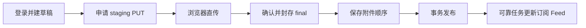

</details>

这张图要看懂两个分界：上传完成还没有得到可发布附件；MySQL 发布完成以后，信息流更新仍是一个可重试的后台步骤。

本模块处理的是内容与文件。第一篇解决有限名额怎样分配和交接，第二篇解决场馆查询副本怎样失效，第三篇解决笔记状态、图片归属以及数据库和对象存储之间怎样收尾。三者共用登录与可靠任务，但分别维护各自的事实。

### 1.1 学完这一点，要能独立回答什么

先抓住四件事：草稿只有作者能看；上传成功还要经过确认；发布与 Feed 允许有短暂延迟；删除既要马上隐藏内容，也要最终回收文件。重要代码集中在第 6、8、9、11 章，第一次读可以先看图，第二次逐行看代码。

| 遇到的新概念 | 先用熟悉的事情理解 | 本项目怎样使用 |
| --- | --- | --- |
| 对象存储与对象键 | 文件柜与文件编号；键通常带目录形状，但不是本地磁盘路径 | MinIO/OSS 存图片字节，MySQL 存归属和状态 |
| 签名 URL | 限时、限定文件和操作的授权凭条 | 浏览器获得某个 staging 键的 PUT 权限 |
| staging / final | 临时上传区 / 已确认采用区 | 用户写临时区，服务端检查后采用独立 final |
| 软删除 | 账本上标记作废，暂时保留记录 | DELETED 停止展示，为恢复和清理保留依据 |
| 乐观版本 | 保存前检查自己手里的版本是否仍最新 | 旧页面编辑返回 409，避免覆盖新内容 |
| 租约与 attempt | 某次处理在限定时间内持有资格 | 旧确认失去资格后不能采用候选文件 |
| Outbox 与投影 | 和业务同时记待办；随后维护查询用的副本 | 发布写可靠任务，Feed ZSET 是可重建的候选索引 |

这些名字服务于同一条业务链。面试时先说“用户上传后还可能覆盖临时文件”，再说采用独立 final 的设计，解释会比直接罗列存储术语更清楚。

### 1.2 从页面看这条链

下面是本次浏览器实际登录、直传、确认并发布后的页面。图片来自私有 MinIO 的短期读取地址；验证码是已消费的本地测试值，Token 在页面中隐藏。

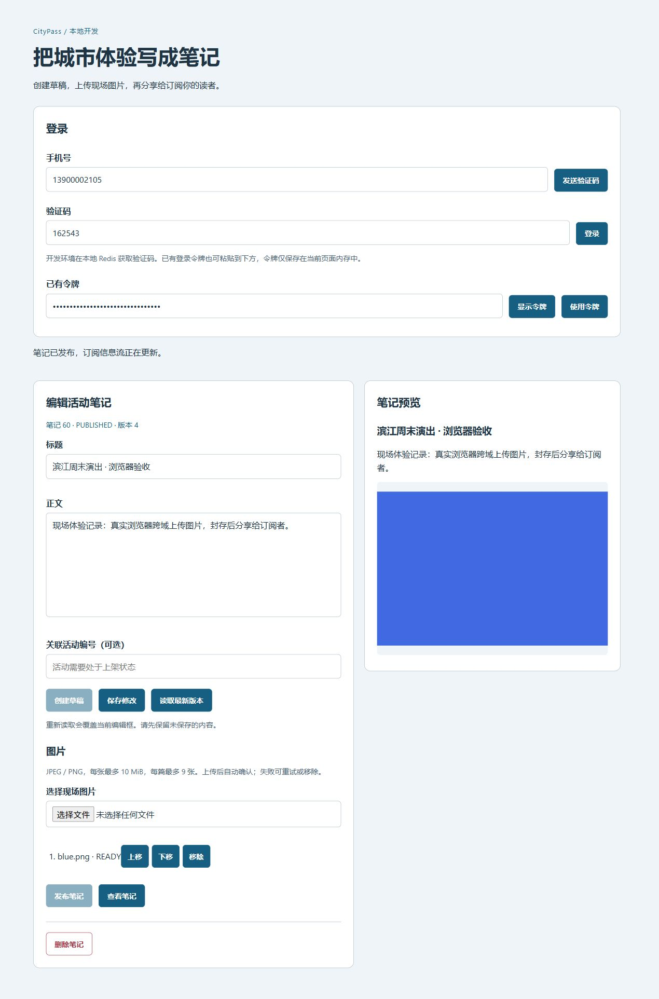

页面左侧编辑草稿，附件列表反映确认状态，右侧显示发布结果。你可以用第 4 章的接口表对照这些按钮：每次点击改变哪个数据库事实、是否访问存储、失败后还能重试哪一步。

<a id="story-section-2"></a>

## 2. 这几张表各自保存什么

| 表 | 保存什么 | 为什么需要 |
| --- | --- | --- |
| `tb_story` | 作者、标题、正文、活动关联、状态、版本、发布时间、草稿到期时间 | 决定笔记是否可见，以及一次修改是否基于最新内容 |
| `tb_story_attachment` | 用户与笔记归属、staging/final 键、实际格式/大小/尺寸、上传到期、确认租约、删除状态 | 决定谁能操作图片、哪份最终文件被采用 |
| `tb_story_attachment_ref` | 笔记与附件关系、`position`、`active` | 表达当前是否引用，以及图片顺序 |
| `tb_story_file_object` | 每个 staging 或封存尝试的对象键、尝试号、安全期、删除时间、清理任务指针 | 对象复制前登记，追踪失败副本与迟到写入 |
| `tb_story_feed_progress` | 事件键与最后处理的订阅记录 ID | 分批推送，重启后继续 |
| `tb_reliable_task` | 任务类型、唯一业务键、状态、租约、重试次数和错误 | 沿用预约/缓存的持久化任务底座 |

`附件 READY` 表示已经验证过一个最终文件。`active=1` 表示当前笔记引用它。这是两个维度：一张已确认但尚未绑定的图片可以是 READY，同时没有有效引用。到期扫描会回收这样的图片；有有效引用的 READY 最终文件受到保护。

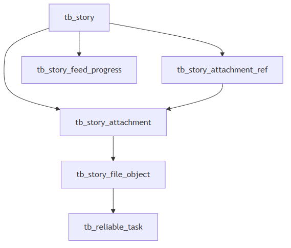

<details>
<summary>查看流程图源码</summary>

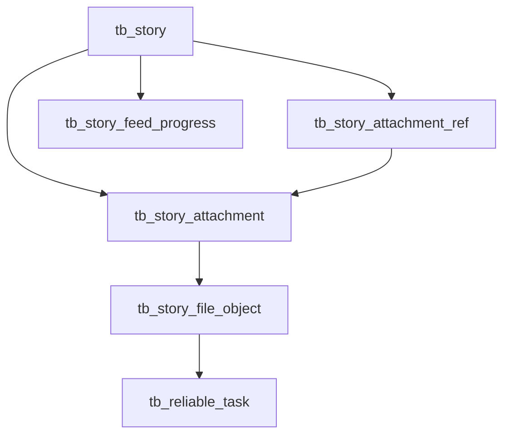

</details>

数据库约束包括作者与 `client_key` 的唯一键、staging/final 对象键唯一键、封存尝试唯一键、一个附件只能属于一个笔记的唯一键、状态 CHECK 和相关外键。附件归属仍需要服务端验证，外键不能代替权限判断。建表定义见 [v6 迁移](deploy/mysql/migration-v6-story-files.sql)。

<a id="story-section-3"></a>

## 3. 状态怎样变化

笔记只有三种状态：

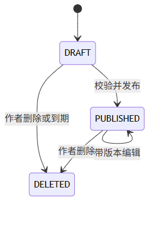

<details>
<summary>查看流程图源码</summary>

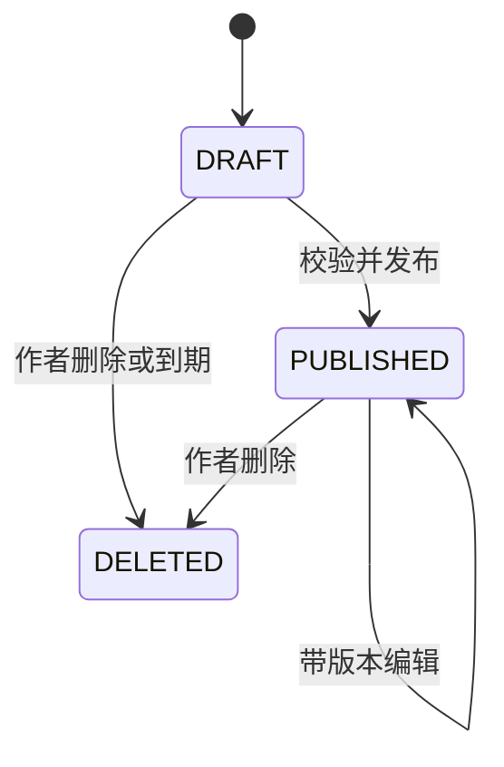

</details>

删除保留数据库事实，公开读和作者读均不再返回内容。当前没有恢复接口。草稿默认 24 小时到期；保存不会自动延长这个期限。已发布笔记修改保留原发布时间，不作为新发布重新置顶。

附件状态是 `PENDING → READY → DELETING → DELETED`，PENDING 也可以直接进入 DELETING。READY 只由确认成功产生。DELETING 是已经领取回收的状态，确认与重新关联都会拒绝它。

对象记录的 `TRACKED / DELETED` 描述存储删除是否得到数据库确认。DELETED 行继续保留并补扫，因此它表达“完成过一次删除”，不能证明未来绝不会有迟到 PUT 或 COPY 再写入这个键。

可靠任务沿用 `PENDING / RUNNING / DONE / DEAD`。一个对象用 `cleanup_task_id` 指向当前清理任务；存在未完成任务或 DEAD 时，补扫不会再创建另一份任务。DEAD 通过已有管理入口显式重放。

<a id="story-section-4"></a>

## 4. 真实接口与调用顺序

写操作复用 Redis Token，放在 `authorization` 请求头。服务端通过 `UserHolder` 取当前用户，忽略客户端作者和路径。除公开读取已发布内容外，写操作与附件管理必须登录。

| 方法与路径 | 输入或用途 | 成功结果与重试 |
| --- | --- | --- |
| `POST /stories/drafts` | `Idempotency-Key`；标题、正文、可选 `activityPassId` | 返回 id/version/status；同作者同 key 返回原草稿 |
| `POST /stories` | 同上，旧入口统一到草稿流程 | 不再直接发布或接受本地文件路径 |
| `PUT /stories/{id}` | `version,title,content,activityPassId,attachmentIds` | 整体保存；旧版本返回 409 |
| `POST /stories/{id}/attachments` | 申请该笔记的上传会话 | 附件 ID、固定 PUT URL、到期时间、大小上限 |
| `POST /stories/attachments/{id}/confirm` | 无对象键参数 | READY 附件实际元数据；重复确认返回同一结果 |
| `GET /stories/{id}/attachments` | 作者管理附件 | 不输出对象键、凭证或租约 |
| `DELETE /stories/attachments/{id}` | 移除草稿附件 | 重复调用可结束；递增笔记版本 |
| `POST /stories/{id}/publish?version=...` | 发布当前草稿 | 已发布重试返回现有状态；编辑走 PUT |
| `DELETE /stories/{id}?version=...` | 删除当前笔记 | 已删除重试返回 DELETED |
| `GET /stories/{id}` | 已发布公开；草稿仅作者 | 内容、状态、版本、附件短期读取地址 |
| `GET /stories/{storyId}/attachments/{id}/url` | 先查当前笔记可见性和有效关联 | 短期 GET 地址 |
| `GET /stories/{id}/legacy-images/{position}` | 受归属与路径边界约束的历史本地图片 | 图片字节，`no-store` |
| `GET /stories/hot`、`/stories/of/user?id=...` | 热榜、作者公开主页 | 只返回 PUBLISHED |
| `GET /stories/of/me` | 作者自己的笔记 | 已发布及未过期草稿 |
| `GET /stories/of/subscriptions?lastId=...&offset=...` | 已登录订阅者 Feed | list/minTime/offset |

创建幂等键需为 8–64 位字母、数字、下划线或横线。同 key 的重试不会把新正文应用到旧草稿，也不会复活已删除内容；要创建另一篇笔记需使用新 key。编辑请求整体替换标题和正文；`attachmentIds` 省略时保留现有关系，空数组表示全部移除。活动字段省略或 null 会清空关联。

草稿删除单个附件不要求版本，因此成功后应重新读取笔记版本。已发布笔记必须通过带版本的 PUT 调整附件关系，单附件 DELETE 会明确返回冲突。

接口定义见 [StoryWriteController](src/main/java/com/citypass/story/StoryWriteController.java)、[StoryController](src/main/java/com/citypass/controller/StoryController.java)。业务错误使用 HTTP 400/401/404/409/422/429/503；部分原有接口仍采用 `Result.success=false`，客户端应同时检查 HTTP 与业务结果。

<a id="story-section-5"></a>

## 5. 默认限制与事实来源

| 限制 | 默认值 | 配置 |
| --- | --- | --- |
| 新图片格式 | JPEG/PNG 的实际内容 | `ImageInspector` 固定允许列表 |
| 图片大小 | 10 MiB | `STORY_FILE_MAX_BYTES` |
| 像素总量 | 20,000,000 | `STORY_FILE_MAX_PIXELS` |
| 单边尺寸 | 10,000 | `STORY_FILE_MAX_DIMENSION` |
| 每篇图片 | 9 | `STORY_FILE_MAX_IMAGES` |
| 每用户 PENDING 附件、草稿 | 各 20 | `STORY_FILE_PENDING_QUOTA` |
| 上传 / 读取 URL | 300 / 120 秒 | `STORY_FILE_UPLOAD_SECONDS / READ_SECONDS` |
| 草稿有效期 | 24 小时 | `STORY_FILE_DRAFT_HOURS` |
| 清理宽限 | 120 秒 | `STORY_FILE_CLEANUP_GRACE_SECONDS` |
| 确认租约 | 60 秒 | `STORY_FILE_CONFIRMATION_LEASE_SECONDS` |
| 每 JVM 图片 I/O 并发 | 4 | `STORY_FILE_IO_CONCURRENCY` |
| 墓碑补扫间隔 | 3600 秒 | `STORY_FILE_TOMBSTONE_RESCAN_SECONDS` |
| 扫描 / Feed 批次 | 100 / 200 | `story-files.sweep-batch / feed-batch` 配置属性 |
| 标题 / 正文 | 255 / 2048 字符 | 当前校验常量 |

Java 按字符串长度校验正文，不能把它宣传成完整的 Unicode 字形计数。图片资源限制先检查实际对象大小，再有界读取、识别格式、读取尺寸，最后真正解码；不会把扩展名、Content-Type 或 ETag 当作可信的图片内容证明。

短期 PUT 允许用户上传超过上限的对象；大小上限由后端确认时执行。该对象不会变成 READY，也不会进入笔记引用，之后会被回收。当前没有把 PUT 大小上限变成存储层的上传策略限制。调试页提示使用默认限制，修改部署限制时应同步提示。

实现位置：[StoryFileProperties](src/main/java/com/citypass/config/StoryFileProperties.java)、[ImageInspector](src/main/java/com/citypass/story/ImageInspector.java)、[配置](src/main/resources/application.yaml)。

### 5.1 先登记，再授权上传

下面是 `StoryFileService.requestUpload` 中申请会话的连续节选。外层短事务已经锁定用户与笔记，并检查本人、状态和额度，代码保留原语句，仅增加教学注释：

```java
String staging="stories/staging/"+user+"/"+UUID.randomUUID();
LocalDateTime deadline=LocalDateTime.now().plusSeconds(p.getUploadSeconds());
// 教学：随机键由后端产生，客户端不能传入他人的对象键。
long id=t.insert("INSERT INTO tb_story_attachment(user_id,story_id,staging_key,expires_at,upload_url_expires_at) VALUES(?,?,?,?,?)",
        user,storyId,staging,deadline,deadline);
// 教学：即使后面生成 URL 失败或 HTTP 响应丢失，这个对象也有持久登记。
t.db.update("INSERT INTO tb_story_file_object(attachment_id,object_key,kind,cleanup_after) VALUES(?,?,'STAGING',?)",
        id,staging,deadline.plusSeconds(p.getCleanupGraceSeconds()));
return t.attachment(id,false);
```

签名发生在这段事务提交之后，并使用数据库到期时间的剩余秒数。假设申请接口内部花了 5 秒，不能再签一个完整 300 秒的地址，否则清理所依据的最晚到期时间会比实际授权短 5 秒。

额度检查也需要并发保护。两次申请如果都先数到 19，再各插入一条，就会超出 20；当前先锁同一用户记录，使该用户的配额检查与登记串行。配额按 PENDING 与 DRAFT 状态统计，到期扫描尚未运行时也可能暂时占着额度。

<a id="story-section-6"></a>

## 6. 为什么要把 staging 和 final 分开

签名 PUT 通常在有效期内可重复使用。同一个浏览器上传地址如果直接指向已发布图片，小林就能用旧地址重新上传另一张图片，绕过后端确认改变公开内容。

当前协议给浏览器 staging 的写权限；后端确认时生成新的随机 final 键，复制过去，再对最终对象做真实内容校验。浏览器没有 final 的 PUT 地址。笔记引用的是被验证并采用的 final，重用 staging PUT 只会修改临时对象。

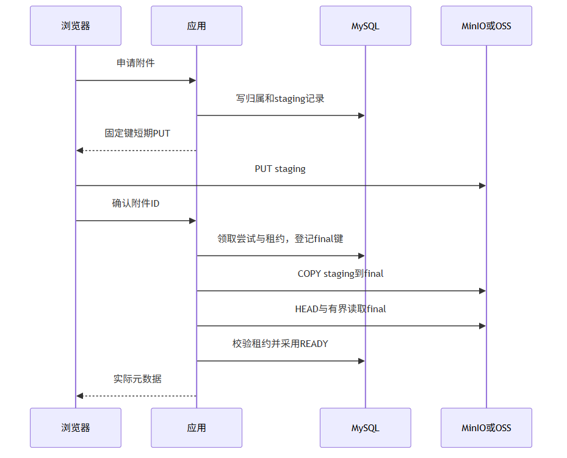

<details>
<summary>查看流程图源码</summary>

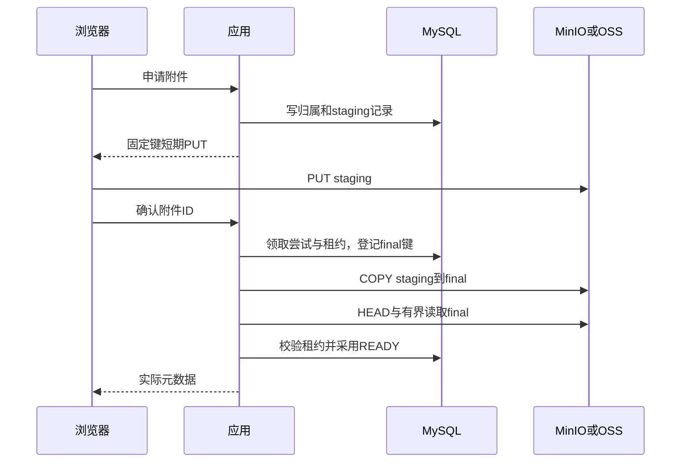

</details>

确认全过程有两段短数据库事务，中间的 COPY、HEAD、读取和解码不持有数据库行锁。每个外部副本都在 I/O 前登记，进程中途退出时仍知道它属于谁、是否被采用、何时可清理。

核心检查摘自 [StoryFileService.confirmWithPermit](src/main/java/com/citypass/story/StoryFileService.java)：

```java
if (!"PENDING".equals(a.get("state"))
        || !attempt.equals(a.get("current_attempt"))
        || !time(a, "confirm_lease_until").isAfter(LocalDateTime.now())) {
    throw StoryProblem.conflict("确认租约已失效，请重试");
}
```

三项一起保证当前尝试仍有采用资格。并发请求可以得到 READY 或 409，最终只能有一个 `final_key` 被数据库采用。租约过期后的旧尝试不能回来覆盖新尝试；它即使迟到复制成功，副本也在对象登记表内，之后可以补扫。

### 6.1 确认时真正读取的是哪份字节

下面是确认方法中的连续节选；此时第一个短事务已提交候选键与 attempt，数据库行锁已经释放：

```java
long stagingSize=storage.size((String)claim.get("staging_key"));
if(stagingSize<=0 || stagingSize>p.getMaxBytes())
    throw new StoryProblem(422,"上传对象实际大小超过限制或为空");
storage.copy((String)claim.get("staging_key"),target);
// 教学：检查复制后的 final，防止只检查临时对象后就盲目采用。
long finalSize=storage.size(target);
ImageInspector.Info info;
try(InputStream input=storage.open(target)) {
    info=inspector.inspect(input,finalSize); // 教学：有界读取、识别格式、检查尺寸、实际解码
}
```

PNG 和 JPEG 是压缩文件，字节只有几百 KiB，也可能声明巨大尺寸；把它完整解码成像素后会消耗远多于压缩文件大小的内存。因此同时限制对象字节、单边尺寸和像素总量，确认还用每 JVM 默认 4 个许可限制并行处理。许可满时快速返回 503，防止所有请求一起解码。

### 6.2 两个确认请求交错时发生什么

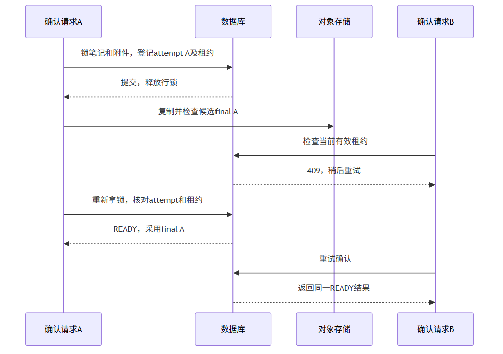

<details>
<summary>查看流程图源码</summary>

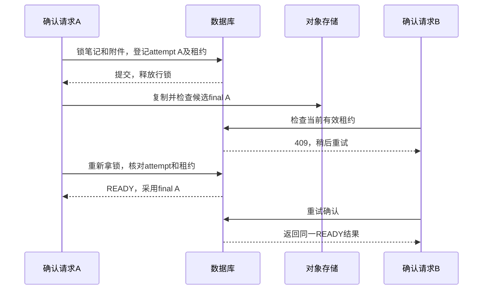

</details>

如果 A 的租约过期，B 可以开启新 attempt。A 即使后来复制完成，采用时也会因 attempt 或租约不匹配而失败。保留每次尝试记录的意义正在这里：我们允许外部工作重复，但不会失去追踪未采用副本的能力。

<a id="story-section-7"></a>

## 7. MySQL 事务能保护哪些步骤

MySQL 回滚只能撤销同一事务中的表修改。它无法撤销已经提交给 MinIO/OSS 的 COPY 或 DELETE。把网络 I/O 放进 `@Transactional` 也不会改变这个事实，只会延长数据库锁持有时间。

| 失败窗口 | 留下什么 | 收尾路径 |
| --- | --- | --- |
| 申请附件后签名失败或响应丢失 | PENDING 与 staging 登记 | 作者移除或到期回收 |
| 上传完成但从未确认 | staging 文件与 PENDING | 到期领取 DELETING，等待 URL 到期与宽限 |
| final COPY 成功，READY 提交失败 | 登记过的未采用 final | 新尝试重试确认；旧副本到期清理 |
| READY 已提交，HTTP 响应丢失 | 已采用最终文件 | 再次确认返回 READY |
| 发布时 Outbox 插入失败 | 同事务内的状态修改 | 整个数据库事务回滚，仍为 DRAFT |
| Feed ZADD 成功，进度回写失败 | Redis 已有笔记，DB 旧进度 | 重投同成员与版本，重复处理无计数增长 |
| DELETE 成功，删除确认回写失败 | 存储不存在，数据库仍 TRACKED | 重试删除不存在对象，再写 DELETED |
| 删除后在途 PUT/COPY 才结束 | 文件重新出现，墓碑仍保留 | 定期重新删除已登记键 |

确认失败会释放当前尝试的租约；若数据库整体不可用，释放也可能失败，租约到期仍提供恢复边界。上传确认遇到不存在对象或存储故障返回 503；图片内容不合法返回 422。没有自动声称对象存储已回滚。

<a id="story-section-8"></a>

## 8. 保存、发布与删除的并发规则

`StoryDraftService` 的编辑、发布和删除先锁笔记行，随后按附件编号锁附件。清理也采用相同顺序，避免一边锁附件再等笔记、另一边锁笔记再等附件。

编辑先比较请求版本，再在同一事务中调整引用、推进版本：

```sql
UPDATE tb_story
SET title=?, content=?, activity_pass_id=?, version=version+1
WHERE id=? AND version=? AND status<>'DELETED';
```

两次基于同一个版本的编辑只有一次成功，另一次返回 409。失败事务不会留下半套新正文与旧图片关系。已发布编辑校验非空标题和正文；不支持未经归属验证的新历史文件路径。

发布先检查标题、正文、活动有效性和所有有效引用都 READY，然后同事务改变状态、记录发布时间并写 `STORY_FEED`。稳定业务键为 `story-feed:{storyId}:{version}`，任务表唯一键阻止重复插入。已发布状态下重复 publish 是确认现有发布，不再推进版本或重复建事件。

删除同事务改变笔记状态、关闭全部有效引用、退休附件、写 Feed 事件。第二次 delete 确认原删除，版本参数不会导致重复副作用。

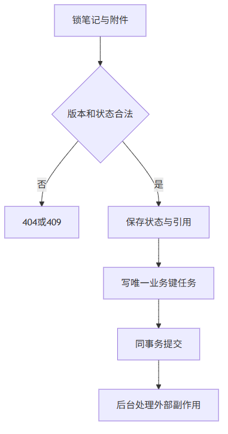

<details>
<summary>查看流程图源码</summary>

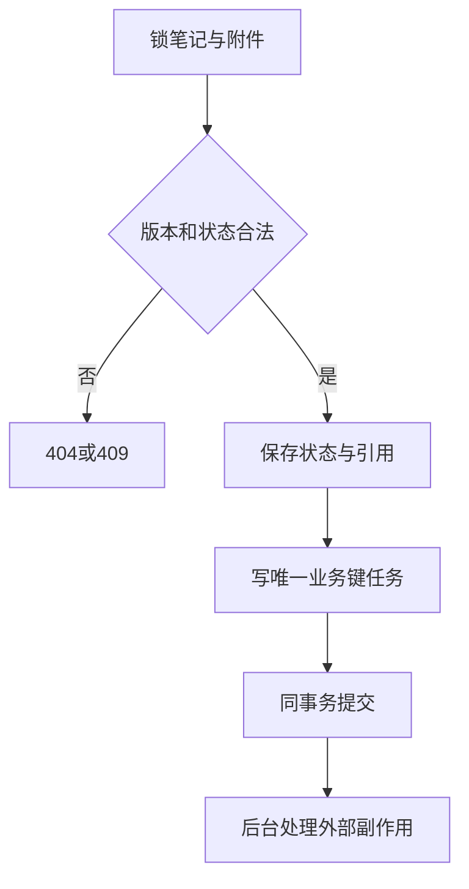

</details>

代码位置：[StoryDraftService](src/main/java/com/citypass/story/StoryDraftService.java)、[StoryTransactions](src/main/java/com/citypass/story/StoryTransactions.java)。

### 8.1 两个页面保存同一版本

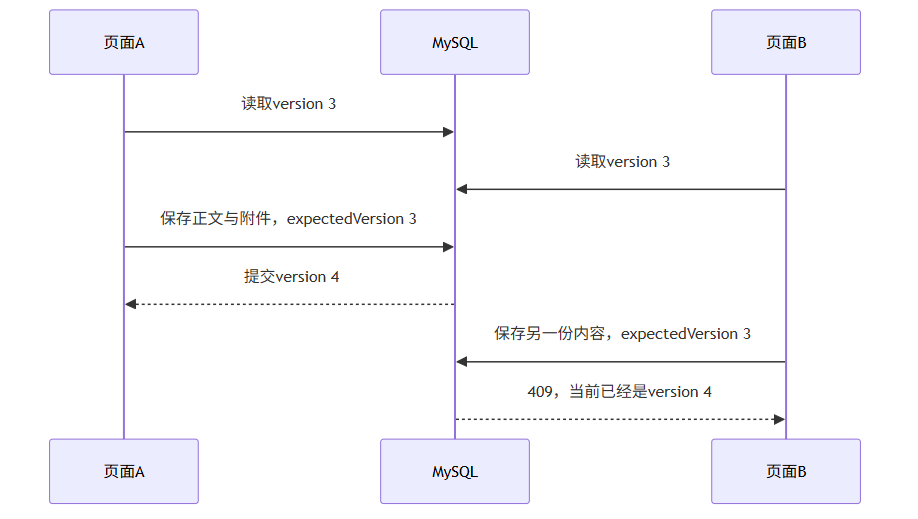

<details>
<summary>查看流程图源码</summary>

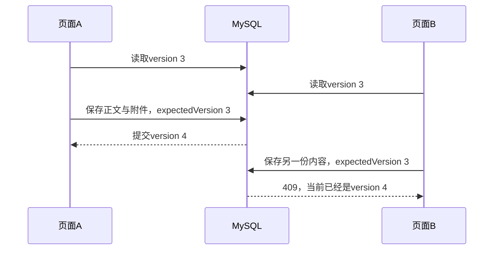

</details>

页面 B 应先保留自己的未保存内容，再读取最新版本决定如何合并。自动用 version 4 再覆盖一遍，只是绕开冲突提示，会重新造成丢失更新。项目提供整体版本控制，没有自动合并算法。

### 8.2 发布为什么能可靠留下 Feed 待办

下面摘自 `StoryDraftService.publish` 的事务末尾；之前已经锁笔记、检查版本、内容、活动与引用，片段省略外围 `inTransaction`：

```java
long version=expectedVersion+1;
if(t.db.update("UPDATE tb_story SET status='PUBLISHED',version=?,publish_time=NOW(3),draft_expires_at=NULL WHERE id=? AND status='DRAFT' AND version=?",
        version,id,expectedVersion)!=1) {
    throw StoryProblem.conflict("发布状态冲突");
}
t.queueFeed(id,version); // 教学：仍在同一事务内；待办写失败，发布状态也回滚。
return result(id,version,"PUBLISHED");
```

`queueFeed` 内部使用 `story-feed:{id}:{version}` 作为唯一业务键。发布后的重复 publish 直接返回当前状态；已发布内容的修改用编辑接口产生新版本。这样重复确认发布不会重复产生新事件，而合法编辑有自己的事件身份。

<a id="story-section-9"></a>

## 9. 信息流为何需要事件版本与恢复进度

发布时只写 MySQL 事件，后台 [StoryFeedHandler](src/main/java/com/citypass/story/StoryFeedHandler.java) 按订阅记录 ID 每次读取 200 人，处理后推进 `last_subscription_id`。重启可能重复一个批次，但不会一次把所有订阅者加载进内存。

每批读取笔记当前状态和版本；[story-feed.lua](src/main/resources/story-feed.lua) 在每位用户的版本 Hash 上保存最高版本。迟到旧版本不能覆盖新版本。PUBLISHED 用 ZADD，DELETED 用 ZREM；同一个笔记 ID 的重复 ZADD 只更新同一个成员。

删除提交后即便旧事件一度留下 Feed ID，查询也只输出数据库中的 PUBLISHED 笔记。因此信息流投影收敛之前不会重新泄露已删除正文。

当前订阅目标取执行时的订阅表，没有冻结“发布那一刻的全部订阅者快照”，也没有订阅后历史回填。每事件保存进度、每用户保留版本水位，当前没有这些记录的归档策略。共享任务执行器没有各模块独立线程池，大量订阅者可能延迟其他任务；不能据此宣称生产级吞吐量。

### 9.1 持久进度和幂等分别解决什么

假设作者有 450 位订阅者：一批 200 人，第二批 200 人，第三批 50 人。第一次处理完前 200 人后应用重启，数据库进度可以让新执行器从后面继续；如果第一批 Redis 写完、进度还没提交就重启，第一批仍会再处理。

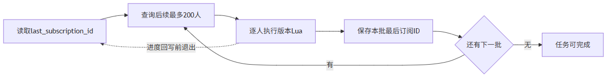

<details>
<summary>查看流程图源码</summary>

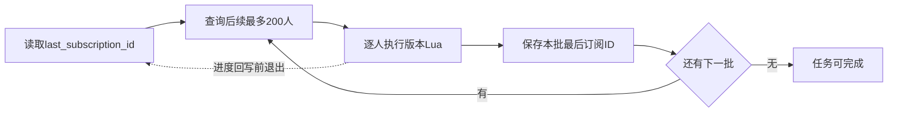

</details>

下面是当前 `story-feed.lua` 的完整脚本，仅增加中文注释。`KEYS[1]` 是用户 Feed，`KEYS[2]` 是用户已处理版本表；参数依次是笔记 ID、版本、当前状态和发布时间分值：

```lua
-- 教学：先读取这位用户对这篇笔记已经处理到的最高版本。
local current = tonumber(redis.call('HGET', KEYS[2], ARGV[1]) or '-1')
local version = tonumber(ARGV[2])
if version < current then return 0 end -- 教学：迟到的旧事件不能倒退状态。
redis.call('HSET', KEYS[2], ARGV[1], version)
if ARGV[3] == 'PUBLISHED' then
    redis.call('ZADD', KEYS[1], ARGV[4], ARGV[1]) -- 同一ID只有一个成员。
else
    redis.call('ZREM', KEYS[1], ARGV[1])
end
return 1
```

比较版本与修改 Feed 必须在一次 Lua 中完成。如果在 Java 中先 GET，再根据结果 ZADD，删除版本可能夹在两步之间生效，旧请求就会把笔记加回来。Lua 保护一次 Redis 内操作；跨用户整批处理并不是一个原子事务。

<a id="story-section-10"></a>

## 10. 公开查询、互动与游标过滤

详情允许 PUBLISHED 或作者自己的有效草稿；热榜与公开作者页只查询 PUBLISHED；本人列表可以查看有效草稿。点赞、点赞用户列表和评论入口同样检查发布状态。评论新增/删除锁笔记后处理计数。所有笔记读设置 `private, no-store`，避免草稿被共享 HTTP 缓存误存。

Feed 存在草稿或已删除 ID 时，游标必须根据实际扫描的 Redis 项前进，而不能只数返回的有效笔记。同分值时累加 offset，遇到更小分值时把 offset 重新记为 1。一次最多扫描 20 批，可能返回不足两条甚至空 list，但 `minTime/offset` 仍可推进到后面的有效内容。

实现见 [StoryServiceImpl.queryStoriesOfSubscriptions](src/main/java/com/citypass/service/impl/StoryServiceImpl.java)。实际验收包含同一分值下的无效 ID 和三篇有效笔记，跨页没有丢失或重复。该游标不提供 Redis 数据集在并发增删时的快照保证。

<a id="story-section-11"></a>

## 11. 清理如何避开合法使用的图片

清理先在数据库锁下确认未引用且到期，推进 DELETING。关联和确认会拒绝 DELETING，因此“检查无引用后、外部删除前”不会出现重新绑定。

安全时间至少覆盖：上传 URL 最晚到期加宽限、当前确认租约加宽限，以及从退休时间开始的读取有效期/宽限。采用的 READY final 不论其原始尝试清理时间是否已到，都不能删除。


<details>
<summary>查看流程图源码</summary>

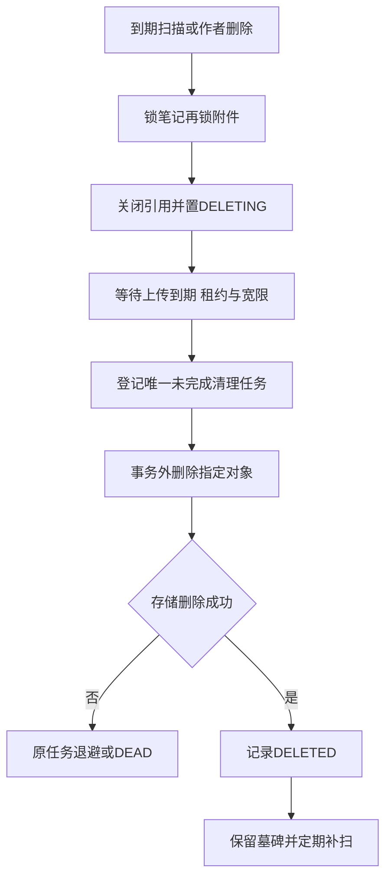

</details>

删除任务只接收服务端对象记录 ID，执行前重新读取数据库校验，不接受客户端 bucket/key。不存在对象按删除成功处理。对象记录更新成功后，如果附件的全部登记对象都已删除，附件由 DELETING 推进 DELETED。

补扫只能在上一清理任务 DONE 后建立新轮次；PENDING/RUNNING/DEAD 保留原任务与退避，避免故障期间不断建任务挤占预约与缓存。补扫按最久未调度对象排序，避免旧墓碑永远挤在批次前面。

代码位置：[StoryFileCleanup](src/main/java/com/citypass/story/StoryFileCleanup.java)、[ReliableTaskRepository](src/main/java/com/citypass/reliable/ReliableTaskRepository.java)、[ReliableTaskScheduler](src/main/java/com/citypass/task/ReliableTaskScheduler.java)。默认 12 次失败后进入 DEAD，当前退避公式实际最长 256 秒。设置管理 Token 后可调用 `POST /internal/reliable-tasks/{id}/replay`，请求头名称以 [管理控制器](src/main/java/com/citypass/controller/ReliableTaskAdminController.java) 为准。

### 11.1 删除前再次判断哪份对象受保护

下面是 `StoryFileCleanup.canDelete` 的完整方法，仅增加教学注释。它由遵守笔记、附件锁顺序的短事务调用：

```java
boolean canDelete(Map<String,Object> o,Map<String,Object> a) {
    if(time(o,"cleanup_after").isAfter(LocalDateTime.now())) return false;
    // 教学：已采用的READY最终文件受到保护，候选最初登记的安全期到期也不能删。
    if("READY".equals(a.get("state")) && o.get("object_key").equals(a.get("final_key"))) return false;
    // 教学：当前仍持有确认资格的候选也不能删。
    if("FINAL".equals(o.get("kind")) && "PENDING".equals(a.get("state"))
            && Objects.equals(o.get("attempt_id"),a.get("current_attempt")) && a.get("confirm_lease_until")!=null
            && time(a,"confirm_lease_until").isAfter(LocalDateTime.now())) return false;
    return true;
}
```

无引用的 READY 附件先被到期扫描或移除操作退休，进入 DELETING；仍被有效引用的合法附件不会走这条退休路径。判断使用数据库归属记录，清理任务不能靠客户端提交的键去删除文件。

### 11.2 怎样避免故障期间越扫任务越多

下面是补扫事务里的连续节选；上文已锁对象记录并检查安全时间：

```java
if(o.get("cleanup_task_id")!=null) {
    List<String> statuses=t.db.queryForList(
            "SELECT status FROM tb_reliable_task WHERE id=?",String.class,o.get("cleanup_task_id"));
    // 教学：沿用未完成或死信任务，不用新任务绕过它的退避与人工处理。
    if(!statuses.isEmpty() && !"DONE".equals(statuses.get(0))) return null;
}
```

通过这个判断后还检查补扫间隔，再插入新任务，并在同一事务保存它的 ID。多实例扫描需要对象行锁，否则双方仍可能同时看到“没有待办”而各建一条。这里只限制每个对象的未完成任务数，历史完成记录和墓碑仍会增长，归档是后续工作。

### 11.3 一个时间例子

假设 12:00:00 签发 300 秒 PUT，12:01:00 开始 60 秒确认，12:01:10 作者删除。读取 URL 和清理宽限均为 120 秒，那么要比较三条下限：删除时刻加 120 秒、PUT 到期加 120 秒、确认租约到期加 120 秒。最晚的是 12:07:00，所以此时不能在 12:03:10 就物理删除。

这是默认值的教学推演。实际验收使用更短 TTL 来缩短等待，默认部署不会沿用验收的 3 秒读取地址和 5 秒补扫间隔。第一次删除后仍保留墓碑，以处理已经开始、稍后才结束的写入。

<a id="story-section-12"></a>

## 12. 私有存储、签名地址和浏览器 CORS

[ObjectStorage](src/main/java/com/citypass/storage/ObjectStorage.java) 只暴露签发 PUT/GET、实际大小、读取、复制、删除。MinIO 与 OSS 都使用真实 SDK；默认本地 MinIO，OSS 使用 V4 签名并需要真实环境凭证。

容器内应用调用 `http://minio:9000`，浏览器使用 `http://localhost:9000`，隔离验收使用 19000。签名器直接使用浏览器 endpoint，签名后不能改 host、端口、路径或方法。PUT 的权限只覆盖那个随机 staging 键，不授予列举 bucket、写 final 或删除其他对象的能力。

bucket 默认私有。浏览器跨域 PUT 要匹配 `STORY_CORS_ORIGINS`，控制台可访问不代表图片 PUT 的 CORS 正确。OSS 部署需要在 bucket 配置相同来源的 GET/PUT CORS；配置 `OBJECT_STORAGE_PROVIDER=oss`、实际 endpoint/public endpoint、region、bucket、环境凭证。Compose 的本地示例凭证不能用于云端。

签发 GET 前查数据库权限，但已经发出的 GET 地址在到期前可能继续使用。数据库删除会立即停止新的签发，无法即时撤销所有已有签名。不要把短期签名 URL 发到日志、Git、错误信息或长期前端存储。

适配器：[MinioObjectStorage](src/main/java/com/citypass/storage/MinioObjectStorage.java)、[OssObjectStorage](src/main/java/com/citypass/storage/OssObjectStorage.java)。OSS 构建和本地签名测试可以执行，云端 COPY/DELETE/CORS 在没有账号时仍应写明未联调。

<a id="story-section-13"></a>

## 13. 新环境启动与已有库升级

普通开发环境需要 Docker Desktop Linux AMD64 容器及 JDK 8；Wrapper 为 Maven 3.9.11。仓库根目录执行：

```powershell
Copy-Item .env.example .env
powershell -NoProfile -ExecutionPolicy Bypass -File .\scripts\prepare-minio.ps1
.\mvnw.cmd clean test package
docker compose build minio
$env:APP_DOCKERFILE='Dockerfile.runtime'
docker compose up -d --build
docker compose ps
```

已有 `.env` 时保留并按 `.env.example` 补齐字段。没有本机 JDK/Maven时也可使用默认多阶段 Dockerfile 在 Java 8 容器构建，先准备 MinIO 二进制，再 `docker compose build minio`、`docker compose up -d --build`。MinIO 镜像由固定官方 Release 二进制及 SHA-256 构建；初始化容器复用该镜像建立私有 bucket。

打开 `http://localhost:8080/debug/story-files`，申请验证码后在本地取码：

```powershell
docker compose exec -T redis redis-cli GET login:code:你的测试手机号
```

输入验证码登录即可创建、上传、确认、排序、保存、发布和预览。调试页 Token 只存在页面内存；公开部署关闭 `STORY_DEBUG_PAGE_ENABLED`。页内错误会保留编辑内容；读取最新版本会覆盖当前编辑框，应先保留未保存文本。

新 MySQL 空卷自动导入初始化 SQL、Canal 用户和 v6。初始化 SQL 包含建表重建语句，只可用于空环境。已有库按尚未执行的版本依次应用：v2 → v3 → v4 → v5 → v6；新安装无需补跑历史迁移。

已有 v5 库升级：停止所有旧 JVM，执行 v6，再启动新版本：

```powershell
docker compose stop app
powershell -NoProfile -ExecutionPolicy Bypass -File .\scripts\apply-story-migration.ps1 -Project citypass
docker compose up -d --build app openresty
```

脚本检测 v6 已有字段时拒绝重复 ALTER；DDL 失败需要检查部分完成状态。历史笔记回填 PUBLISHED、version=1、publish_time=create_time；本地图片继续保留原目录/卷。历史读接口只接受数据库记录中的合法旧图片路径，并检查真实路径在上传目录内。

旧 `POST /upload/story` 与按文件名 DELETE 均返回 410；新上传走附件协议。历史图片不会被直接当作可信对象键，当前也不会自动删除旧本地文件。新存储、MySQL、Redis、MQ、历史图片均使用持久卷，常规命令不删除卷。

<a id="story-section-14"></a>

## 14. 真实验收与故障定位

为避免短 TTL 和存储停机影响普通开发数据，使用独立 `citypassfiles` 项目。先构建 jar，然后在同一个 PowerShell 会话执行：

```powershell
. .\scripts\story-acceptance-env.ps1
docker compose -p citypassfiles build minio
docker compose -p citypassfiles up -d --build
powershell -NoProfile -ExecutionPolicy Bypass -File .\scripts\story-files-test.ps1 -Faults
powershell -NoProfile -ExecutionPolicy Bypass -File .\scripts\smoke-test.ps1 -Project citypassfiles -BaseUrl http://localhost:18080
powershell -NoProfile -ExecutionPolicy Bypass -File .\scripts\reliability-test.ps1 -Project citypassfiles -BaseUrl http://localhost:18081
powershell -NoProfile -ExecutionPolicy Bypass -File .\scripts\cache-consistency-test.ps1 -Project citypassfiles -PrimaryUrl http://localhost:18081 -SecondaryUrl http://localhost:18082 -SecondaryPort 18082
powershell -NoProfile -ExecutionPolicy Bypass -File .\scripts\gateway-cache-consistency-test.ps1 -Project citypassfiles -GatewayUrl http://localhost:18080 -JavaUrl http://localhost:18081 -SkipBuild
```

文件脚本真实检查数据库及存储对象；`-Faults` 只允许独立项目，使用仅针对本次数据的触发器注入失败，并停止/恢复该项目的 MinIO、重启应用。不清空共享表或删除卷。结果保存在被 Git 忽略的 `data/story-file-it/results.json`，可分享的脱敏记录见 docs。浏览器实际直传需要在 `http://localhost:18080/debug/story-files` 验证，脚本 HTTP PUT 不能替代 CORS 证据。

| 现象 | 先查什么 |
| --- | --- |
| 图片 PUT 网络失败 | 页面 origin、MinIO public endpoint、CORS、URL 是否过期 |
| 确认 503 | staging 是否存在、存储可达、数据库是否提交失败；重试后检查状态 |
| 确认 422 | 实际字节、PNG/JPEG 内容、尺寸与像素限制 |
| 编辑 409 | 是否另一请求推进版本；先保留输入，再读取最新版本 |
| Feed 暂未出现 | STORY_FEED 任务状态、错误、订阅关系、恢复进度 |
| 对象迟迟没删 | 有效引用、安全期、cleanup_task_id 对应任务、DEAD/重试 |
| 所有模块任务都延迟 | 到期任务积压、数据库/存储延迟；共享 Relay 没有业务优先级 |
| 历史图片 404 | 原图片卷是否挂载、路径是否符合规则、笔记是否可见 |

查询清理状态的示例：

```sql
SELECT a.id,a.state,o.kind,o.state,o.cleanup_after,
       t.status,t.retry_count,t.last_error
FROM tb_story_attachment a
JOIN tb_story_file_object o ON o.attachment_id=a.id
LEFT JOIN tb_reliable_task t ON t.id=o.cleanup_task_id
WHERE a.id=?;
```

### 14.1 三轮复习练习

第一轮不看代码，画出创建、上传、确认、保存、发布和删除，并在每条箭头旁写“访问 MySQL / 存储 / Redis”。第二轮找出四个检查：本人归属、最新版本、当前 attempt、有效引用。第三轮选一个故障窗口，说清楚留下什么记录、谁继续、重复执行为什么安全。

最后用两分钟介绍：这点解决作者内容与私有图片的生命周期，难点在可重用上传权限、数据库和存储不能一起回滚，以及发布和 Feed 的异步传播；实现用独立 final、短事务再校验、持久对象登记和版本化可靠任务，验收覆盖了相应并发与故障窗口。

<a id="story-section-15"></a>

## 15. 已实现范围与后续扩展

本地 MinIO、真实图片封存、状态权限、编辑冲突、可靠 Feed、失败副本回收和删除重试都有代码与验收。OSS 有完整适配器和签名测试，真实云端联调状态以验收记录为准。

当前边界包括：没有视频、审核、缩略图或跨用户去重；历史本地文件不自动回收；永久对象墓碑、任务历史及 Feed 水位尚无归档；共享 Relay 没有业务线程池隔离；确认在有限租约内同步执行，大文件或慢存储可能需要重试；管理员直接改存储对象能绕过应用协议；已经签发的读取链接有撤权延迟；没有生产 QPS 或延迟数据。

新安装完全不需要 Elasticsearch。Java 搜索代码、SDK 依赖、控制器、配置、Compose 服务及专用脚本已退役。历史 v5 保留用于旧库迁移链；v6 只完成确认属于搜索的 INDEX_ACTIVITY_SEARCH 任务，保留有业务意义的活动分类、描述、位置和举办时间。旧库可以留着搜索历史表/字段，不会被新代码读取，也不会在启动时破坏性删除。

复习时按三个问题阅读：笔记什么时候公开；哪份文件可以引用；每个外部副作用失败以后由谁继续。能用真实字段和代码回答它们，就能把第三个亮点讲清楚。

---

<a id="story-section-16"></a>

## 16. 面试官会怎样追问发布与文件管理

这 20 道题既追问本项目的取舍，也延伸到数据库、网络、权限和大规模信息流。每题先给结论，再解释场景或边界；可以按你的理解换一种表达，但应保留事实依据。

### Q1. 为什么让浏览器直传存储，而不把文件先传给 Java 服务？

**参考回答：** 浏览器直传让图片字节不经过应用服务器，减少应用带宽与长连接占用。服务端仍负责身份、配额、对象键和短期授权，上传完成后再验证并绑定业务，所以业务管理权仍在应用端。

代价是多了 CORS、过期地址、上传后确认与遗留对象清理。小规模项目用应用中转也可以更简单；当前选择直传是为了完整实现这条边界清楚的文件生命周期，没有以压测证明吞吐提升。

### Q2. 客户端说它传的是 JPEG，为什么不能直接标 READY？

**参考回答：** 文件名、Content-Type 和客户端声明都可以伪造。当前对 final 对象做实际大小检查、格式识别、尺寸读取和解码成功检查，通过后才采用；限制在有界读取与解码之前逐层执行。

这能挡住伪图片、超限文件和明显异常尺寸，但不等于已经完成恶意软件扫描或内容审核。若业务需要去除图片元数据、重新编码或审查内容，应加入单独处理阶段并重新定义 READY 的含义。

### Q3. 已经验证 staging，为什么还复制到 final？

**参考回答：** 上传 URL 在到期前仍可写 staging，如果业务一直引用它，用户可在检查后覆盖字节。final 使用另一个随机键，只由服务端复制、验证和采用，没有向客户端签发写入权限。

因此业务读取只指向已检查的 final。复制多占一次存储操作，却把客户端可写的位置与发布引用的位置分开；必须检查复制后的对象，单查 staging 的元信息无法保证最终采用的字节符合规则。

### Q4. 如果 HEAD 后立刻覆盖 staging，复制到了另一张图，会怎样？

**参考回答：** 当前允许 staging 在授权窗口中变化，所以不能把第一次 HEAD 的结果当最终依据。复制完成后重新检查 final 的真实大小、格式、尺寸和解码，采用的是通过这轮检查的 final。

若业务必须保证采用的恰好是用户最初声明的那一份字节，还要加入校验和、对象版本或带条件的复制协议。当前防止非法字节被采用，但没有承诺用户声明的文件名或预先提交的哈希与 final 完全一致。

### Q5. 两次确认同时到来，为什么不会产生两个有效 final？

**参考回答：** 短事务锁附件行，只允许当前确认 attempt 持有有效租约。外部复制完成后，第二个事务重新检查 attempt、租约、附件和笔记状态，只有仍合法的结果可以写 READY；重复确认 READY 返回已有结果。

复制可能发生多次，特别是旧租约过期但旧线程仍在运行时，所以目标是只采用一个结果，而非承诺只复制一次。每个 attempt 的候选键都预先登记，未采用候选会进入持久清理流程。

### Q6. 为什么不能一直开着数据库事务完成复制和解码？

**参考回答：** 存储和解码耗时不可控，事务持锁等待它们会占用连接，并阻塞编辑、删除或其他确认。当前分为登记尝试、事务外 I/O、重新校验后采用三段，每段数据库事务保持较短。

代价是中途状态可能变化，因此第二个事务不能只看复制成功，还要再次检查当前所有权、状态与租约。把长事务拆开必须补上这些判断和失败清理，不能只删除事务注解。

### Q7. 数据库回滚了，存储已经复制成功，该怎么恢复？

**参考回答：** 候选 final 键在复制前已经提交到对象记录中，即使 READY 回写失败，仍能追踪这个外部对象。重试可以重新确认；没有被采用的候选按安全时间进入删除待办。

这属于用持久记录协调跨系统步骤。数据库回滚不会自动回滚对象存储；如果候选键只存在内存里，进程退出后就难以发现这份孤儿文件。

### Q8. 图片本身已经 READY，为什么保存时还检查它属于谁和哪篇笔记？

**参考回答：** READY 只代表字节检查通过，不能代表任何人都有使用权限。绑定时同时检查附件归属、所属笔记和状态，避免猜到 ID 后引用他人的私有对象，或把另一篇笔记的图片跨篇挪用。

数据库查询以当前登录用户为依据，客户端 userId 和 objectKey 都不能作为授权证明。下载 URL、编辑、删除和公开查询也要遵循同一可见性规则，否则写入保护再严仍可能从读取接口泄露。

### Q9. 手机和电脑同时编辑，怎么避免后保存的覆盖先保存的？

**参考回答：** 保存请求带上读取时的 version，服务端只在 version 相同且状态允许时更新，并把 version 加一。第二个客户端拿着旧版本会得到 409，需要重新获取和合并，而不是静默覆盖。

这是整篇笔记层面的乐观并发控制，尚未实现多人协作文档的逐字符合并。标题、正文和附件引用在同一事务更新，避免出现正文保存了但图片列表属于另一轮编辑的组合。

### Q10. 乐观版本号为什么还不能替代数据库行锁？

**参考回答：** 版本号能发现旧编辑，但文件绑定、清理、删除和确认之间涉及多条记录的共同条件。当前在短事务里按笔记、附件的固定顺序拿锁，再检查状态与版本，让这些相关决定有明确先后。

只做最后一条 version UPDATE，前面读到的附件可能已经被回收。还要考虑索引、死锁回滚和事务隔离；版本条件与锁各保护一部分，并非选一个就能覆盖所有并发窗口。

### Q11. 清理程序刚判断图片没被引用，用户又绑定了它，怎么办？

**参考回答：** 回收与绑定使用一致的笔记、附件锁顺序，并在持锁后重新检查引用。清理决定撤销附件资格后，绑定会看到新的状态而失败；若绑定先提交，清理看到引用就不能按无引用回收。

物理 DELETE 在事务外执行，删除前还会防止误删已采用的 READY final。并发正确性依赖“判断和资格变化同事务”，单凭周期扫描时的一次 SELECT 不够。

### Q12. 上传地址到期了，就能保证 staging 永远不会出现吗？

**参考回答：** 到期限制新请求的授权，不一定意味着较早开始的上传已经结束。当前撤销业务资格后等待上传地址、确认租约等安全窗口，并保留对象墓碑，定期再次检查和删除晚出现的对象。

补扫时间与频率需要结合存储行为及成本设置。验收通过重新放回同一键来模拟晚出现，验证能够再次删除；这不等于完成了所有网络和多段上传边界的压力实验。

### Q13. 存储长时间不可用，每次扫描都创建任务，会不会拖垮整个任务表？

**参考回答：** 会，所以对象记录持有 cleanup_task_id，扫描和登记在行锁下确认当前任务状态。已有 PENDING、RUNNING 或 DEAD 时不再新建同对象任务，继续依靠已有重试或人工处理。

DONE 后仍保留墓碑，到了补扫时间才能开启下一轮。这样既支持晚出现对象再次删除，又避免故障时不断叠加待办；还应监控任务积压年龄与 DEAD，不能只统计任务总数。

### Q14. 删除笔记后，别人手上的图片链接能否立即失效？

**参考回答：** 当前数据库立即变为 DELETED，查询和新签发地址立即拒绝；已经发出的短期 GET URL 可能在到期前仍可读，物理删除也要等安全窗口。默认读取 URL 为 120 秒，这是需要明确的可见边界。

如果要求立即撤销每次访问，需要通过应用或受控下载网关实时鉴权，或者设计可撤销的访问协议。短期签名适合减少应用传输负担，但不能当作逐次访问授权的完全替代。

### Q15. 发布成功了，粉丝马上刷不到，算失败吗？

**参考回答：** 当前发布成功表示笔记及 Feed 待办已经在同一 MySQL 事务提交。Feed 是异步投影，后台按订阅者分批更新，短时间刷不到属于允许的可见延迟，应在接口和产品体验里说明。

要观察发布到 Feed 的延迟分布、任务积压和失败率。不能为了让接口同步等全部粉丝写完而持有数据库事务，粉丝规模越大这种做法越容易拖慢发布。

### Q16. 旧发布事件晚到，会不会复活已经删除的笔记？

**参考回答：** 处理器分批时重新读取笔记当前状态，并给每个用户的 Feed 记录保存已处理的最高事件版本。Redis Lua 在同一次执行里比较版本并做 ZADD 或 ZREM，低版本不能覆盖高版本。

公开查询仍过滤数据库里的非 PUBLISHED 状态，即使清理投影暂时没完成也不直接展示已删内容。版本记录与数据丢失、长期重放的边界还要一起考虑，不能只靠消息到达顺序。

### Q17. 发布写到一半应用重启，前半部分粉丝会不会收到两条？

**参考回答：** 任务记录批处理进度；一批完成而进度回写失败时，重试可能重新处理该批。Feed ZSET 以 storyId 为成员，版本比较允许安全重放，不因重复事件插入多个成员。

进度保证恢复时少做重复工作，幂等保证重复仍然正确，两者用途不同。当前按订阅表 ID 遍历，发布期间新增订阅是否回补历史内容仍需要单独产品规则。

### Q18. 如果一个作者有千万粉丝，这种写扩散还能用吗？

**参考回答：** 发布时给每个粉丝写入 Feed 的成本与粉丝数成正比，千万粉丝会放大写入量和延迟。当前 200 人一批可限制每轮工作并恢复进度，但没有解决总量问题，也没有完成千万级容量验证。

可以按作者规模做混合方案：普通作者继续写扩散，大作者在读 Feed 时合并近期笔记，再配合分片、限流与缓存。选择要同时考虑活跃粉丝比例、读写频率、分页稳定性和删除传播。

### Q19. Redis 游标拿到很多已删笔记，为什么不能直接返回一个空页？

**参考回答：** ZSET 只是候选索引，真实状态仍在 MySQL。过滤无效项后应继续有界扫描来补足页面，并按实际扫描结果推进 score/offset，尤其要处理相同 score，否则会反复读同一批无效成员。

当前最多扫描 20 轮，页面大小为 2，所以结果可能短页；这是避免无界循环的容量保护。更大规模下可清理陈旧成员、改进索引和游标协议，但不能用展示项数代替扫描项数计算下一页。

### Q20. 怎样证明删除不会误伤，上传不会失控？

**参考回答：** 本次实测包含真实签名 PUT、并发确认、伪图片与超限拒绝、复制后回写失败、清理与绑定竞争、已删可见性、链接到期、存储故障重试以及删除成功后回写失败。浏览器还验证了跨端口上传和图片展示。

这些证据针对本地私有 MinIO；OSS 适配实现和 Java 8 构建通过，但没有云账号时无法声称真实 OSS 验收成功。安全限制不等于抗攻击容量保证，生产前还需补充负载、监控、内容审核和云权限配置验证。
