# CityPass 源码学习 04：从 MySQL 提交后 Redis 失败，理解最终一致性与多级缓存治理

> **最终一致性与缓存治理：基于本地可靠任务表实现类 Transactional Outbox，使用任务级租约、执行版本、重试与 DEAD 隔离处理外部副作用；结合 Reconciliation 修复部分业务漂移，并以缓存失效 Outbox、版本水位和 Redis Pub/Sub 治理 OpenResty + Caffeine + Redis 多级缓存。**

本篇接续 [01：异步预约与防超卖](./01-异步预约与防超卖.md)、[02：订单状态机与并发控制](./02-订单状态机与并发控制.md)、[03：候补调度与资源交接](./03-候补调度与资源交接.md)。前三篇决定数据库中的业务事实，本篇解释这些事实如何传播到 Redis，以及普通查询缓存怎样失效。

源码基线：Git 提交 `bb089e4258f6c0eee13e778644b657aacf95ceff`（v4 可靠性升级）。本文按实际 Java、SQL、Lua、配置和部署文件写作，注释与执行逻辑冲突时以执行逻辑为准。相对源码链接按文档放在仓库 `docs/` 下设计。

先说明结论的范围：项目实现了任务租约、版本围栏、最大重试、部分对账和版本化缓存失效机制，但**不能由此推导出任意故障下都必然自动收敛**。下面会在每条故事线中解释当前条件和缺口，改进设想单独标注。

## 完整目录

<details>
<summary>展开所有章节与小节</summary>

- [0. 两个已经提交成功、却还没有结束的故事](#section-1)
  - [0.1 场景 A：A 的订单已取消，Redis 还认为名额被占用](#section-2)
  - [0.2 场景 B：场馆名称已更新，用户看到的还是旧名称](#section-3)
  - [0.3 先给简历术语做一次源码校准](#section-4)
- [1. MySQL 已经提交成功，但 Redis 更新失败怎么办？](#section-5)
  - [1.1 先理解问题为什么存在](#section-6)
  - [1.2 为什么不能直接把 Redis 放进 @Transactional？](#section-7)
- [2. 先把“还要做什么”与业务事实一起保存](#section-8)
  - [2.1 ReliableTask 解决的第一个问题是意图不丢](#section-9)
  - [2.2 业务事实、副作用意图和投影分别是什么？](#section-10)
  - [2.3 为什么称为“类 Transactional Outbox”？](#section-11)
  - [2.4 为什么任务不能在 COMMIT 后再插入？](#section-12)
- [3. ReliableTask 表中到底保存了什么？](#section-13)
  - [3.1 SQL 表与 Java 执行对象各保存什么？](#section-14)
  - [3.2 INSERT IGNORE 与业务键是什么关系？](#section-15)
  - [3.3 六种真实 task_type 与 payload](#section-16)
- [4. 沿源码走完可靠任务的创建](#section-17)
  - [4.1 从取消入口走到本地事务](#section-18)
  - [4.2 CREATE、补位、发布活动与 Venue 更新都沿用同一思想](#section-19)
- [5. Scheduler 怎样扫描、执行和重试？](#section-20)
  - [5.1 一次 tick 实际做什么？](#section-21)
  - [5.2 PENDING、RUNNING、DONE 与 DEAD 状态机](#section-22)
  - [5.3 退避、最大次数与人工重放](#section-23)
- [6. 多实例与重复执行：任务表为什么还不够？](#section-24)
  - [6.1 短事务怎样逐条领取任务？](#section-25)
  - [6.2 即使状态回写有围栏，副作用仍可能执行两次](#section-26)
- [7. 精读 Redis 副作用：一次脚本维护哪些状态？](#section-27)
  - [7.1 restore-stock.lua：精确恢复当前那一代资源](#section-28)
  - [7.2 transfer-reservation.lua：换 owner，不增减库存](#section-29)
  - [7.3 init-reservation-stock.lua：初始化也有边界](#section-30)
  - [7.4 Lua 的原子执行与持久幂等不是一回事](#section-31)
  - [7.5 ORDER_TIMEOUT 的 DONE 表示什么？](#section-32)
- [8. 两个必须会推演的任务失败窗口](#section-33)
  - [8.1 Case 1：第一次 Redis 执行失败，恢复后成功](#section-34)
  - [8.2 Case 2：Redis 成功，但标 DONE 前宕机](#section-35)
  - [8.3 当前重试机制还没有哪些能力？](#section-36)
- [9. 如果没有一条明确的失败任务，谁发现不一致？](#section-37)
  - [9.1 Retry 与 Reconciliation 的分工](#section-38)
  - [9.2 当前对账顺序、频率与锁](#section-39)
  - [9.3 第一阶段：补上漏掉的超时关闭](#section-40)
  - [9.4 第二阶段：关闭活动结束后的 WAITING](#section-41)
  - [9.5 第三阶段：按订单账本重算结束活动库存](#section-42)
  - [9.6 对账不是“任意漂移都会恢复”的证明](#section-43)
- [10. 第一条主线的最终一致性闭环](#section-44)
- [11. 第二条主线：先跟踪一次 Venue 查询](#section-45)
  - [11.1 请求在哪一层进入 Java？](#section-46)
  - [11.2 L1、L2 的编号为什么看起来冲突？](#section-47)
- [12. 从全 miss 到命中：每层回填了什么？](#section-48)
  - [12.1 第一次查询：数据库有该 Venue](#section-49)
  - [12.2 实际 TTL：不要照抄注释的“±20%”](#section-50)
  - [12.3 查不到数据为什么缓存 null marker？](#section-51)
  - [12.4 网关回填还有哪些条件？](#section-52)
- [13. 热点过期时，如何避免所有请求同时查库？](#section-53)
  - [13.1 冷 miss：互斥锁与双重检查](#section-54)
  - [13.2 逻辑过期：旧值先返回，新值异步加载](#section-55)
  - [13.3 逻辑过期、物理过期、随机 TTL 与版本分别做什么？](#section-56)
  - [13.4 CacheClient 哪些能力没有被 Venue 主链直接使用？](#section-57)
- [14. 管理员修改 Venue 后，失效意图怎样可靠落库？](#section-58)
  - [14.1 真实写入口是 PUT /venues](#section-59)
  - [14.2 为什么不在事务提交前直接删缓存？](#section-60)
  - [14.3 INVALIDATE_VENUE_CACHE 的真实执行链](#section-61)
  - [14.4 版本水位怎样阻止旧重建覆盖？](#section-62)
- [15. 失效 Outbox 为什么仍然不是强一致？](#section-63)
  - [15.1 COMMIT 与任务执行之间是可恢复窗口](#section-64)
  - [15.2 旧回填会被全部阻止吗？](#section-65)
  - [15.3 Pub/Sub 广播与多网关边界](#section-66)
- [16. Canal + RocketMQ 是怎样补充缓存失效的？](#section-67)
  - [16.1 它来自数据库变更日志，不来自应用任务](#section-68)
  - [16.2 消费者具体识别什么？](#section-69)
  - [16.3 默认是否启用？本地与 Compose 要分开](#section-70)
  - [16.4 Canal 消费一次，怎样通知所有在线 JVM？](#section-71)
- [17. 六种缓存故障窗口，逐个推演怎样恢复](#section-72)
  - [17.1 Case 1：更新提交成功，失效任务正常完成](#section-73)
  - [17.2 Case 2：更新事务回滚](#section-74)
  - [17.3 Case 3：COMMIT 成功，执行失效前进程宕机](#section-75)
  - [17.4 Case 4：一个 worker 消费，多个 JVM 怎样清理？](#section-76)
  - [17.5 Case 5：旧异步重建跨过更新提交](#section-77)
  - [17.6 Case 6：网关驱逐失败](#section-78)
- [18. 业务 Redis 与普通读缓存，使用两套收敛思路](#section-79)
- [19. 整个第四篇的总架构图](#section-80)
- [20. 源码调用链速查](#section-81)
  - [20.1 可靠任务创建链](#section-82)
  - [20.2 可靠任务执行链](#section-83)
  - [20.3 对账链](#section-84)
  - [20.4 Venue 读取与写入链](#section-85)
  - [20.5 文件导航表](#section-86)
- [21. 九个面试重点：理解后再回答](#section-87)
  - [21.1 为什么不能依赖一个普通 @Transactional 管 MySQL 和 Redis？](#section-88)
  - [21.2 为什么任务必须与业务数据同事务写入？](#section-89)
  - [21.3 为什么叫“类 Outbox”，不能直接包装成完整标准实现？](#section-90)
  - [21.4 Retry 和 Reconciliation 有什么区别？](#section-91)
  - [21.5 Redis 成功，但任务还没标 DONE 就宕机怎么办？](#section-92)
  - [21.6 为什么最终一致性仍然要求幂等和业务版本？](#section-93)
  - [21.7 为什么缓存失效意图要与 Venue 更新同事务？](#section-94)
  - [21.8 失效 Outbox 与版本水位是否已经保证强一致？](#section-95)
  - [21.9 多级缓存最大的复杂度是什么？](#section-96)
- [22. 常见错误理解与纠正](#section-97)
- [23. 简历里的每一句，怎样落回源码？](#section-98)
- [24. 三版完整面试回答与追问路线](#section-99)
  - [24.1 30 秒：MySQL 成功、Redis 失败怎么办？](#section-100)
  - [24.2 1～2 分钟：项目最终一致性怎样做？](#section-101)
  - [24.3 2～3 分钟：ReliableTask、多级缓存与一致性治理](#section-102)
  - [24.4 深挖追问树](#section-103)
- [25. 当前边界与进一步优化方案分开记录](#section-104)
- [26. 源码校验、测试证据与学习自查](#section-105)
  - [26.1 本篇检查了哪些实现？](#section-106)
  - [26.2 已有测试与本次验证不能混为一谈](#section-107)
  - [26.3 文档格式校验](#section-108)
  - [26.4 能否从头回答这两个问题？](#section-109)

</details>

<a id="section-1"></a>

## 0. 两个已经提交成功、却还没有结束的故事

<a id="section-2"></a>

### 0.1 场景 A：A 的订单已取消，Redis 还认为名额被占用

沿第三篇的释放流程，假设没有可选候补，本次走公共库存恢复分支。示例订单号为 10001，活动 ID 为 101，用户 A 的 ID 为 11。

| 时刻 | MySQL | Redis |
|---|---|---|
| 取消前 | A 待支付，库存 0 | 库存 0，holder/claim 指向 A 的旧订单 |
| 释放事务提交后 | A 已取消，库存 1，恢复任务 PENDING | 可能仍为旧状态 |
| Redis 故障期间 | 已提交事实保持有效 | 无法完成归属清理与库存回补 |

问题是：**数据库已经 COMMIT，Redis 失败后还能让这笔已提交事务简单 rollback 吗？** 不能。接下来必须有人记得“还有一次 Redis 恢复没有做完”，并能在恢复服务后继续处理。

<a id="section-3"></a>

### 0.2 场景 B：场馆名称已更新，用户看到的还是旧名称

管理员通过项目的 Venue 更新接口，把场馆 1 的名称由“旧名称”改成“新名称”。MySQL 更新成功，但入口 OpenResty、某个 Java 实例的 Caffeine、共享 Redis 中仍可能存在旧值。

用户读取 `GET /venues/1`，只要前面某一层返回旧值，请求甚至不会到数据库。

这里要问：**为什么不能在事务提交前随便删缓存？提交后删除，又是否等于所有用户立刻读到新值？**

这两类 Redis 数据不要混为一谈：前者参与预约占位与资源归属，后者是可重新查询的场馆数据副本。

<a id="section-4"></a>

### 0.3 先给简历术语做一次源码校准

| 术语 | 本项目实际对应 | 使用时的限制 |
|---|---|---|
| 类 Transactional Outbox | 同一本地 MySQL 事务保存业务修改和 `tb_reliable_task` 执行意图 | 任务既执行 Redis 操作，也发送超时消息，不是完整的领域事件发布平台 |
| Retry + Lease | `ReliableTaskScheduler` 逐条领取到期任务，写 RUNNING、owner、lease 与执行版本 | 租约过期允许接管；外部副作用仍必须幂等 |
| DEAD 与人工重放 | 默认第 12 次失败进入 DEAD，运维接口显式 replay | 需要配置管理 token；有指标但没有自动告警平台 |
| Reconciliation，对账 | `ReservationReconcileTask` 扫描超时订单、到期 WAITING 与结束活动库存差异 | 扫描和修复范围有限，不重建全部 holder/claim |
| 缓存失效 Outbox | Venue 更新、cache_version 递增、INVALIDATE 任务同事务提交 | 保证失效意图不因提交后宕机而丢失，不等于立即生效 |
| Versioned Invalidation | Lua 推进版本水位、删缓存并发布 Pub/Sub；回填脚本比较版本 | 在线 JVM 可广播驱逐；网关、多实例确认和个别冷 miss 仍有边界 |

<a id="section-5"></a>

## 1. MySQL 已经提交成功，但 Redis 更新失败怎么办？

<a id="section-6"></a>

### 1.1 先理解问题为什么存在

如果采用“数据库提交后立即调用 Redis”的朴素写法，执行顺序可能是：数据库把 A 取消并恢复库存，提交成功；Java 再尝试 Redis 库存加 1，却遇到连接错误。

这时抛出 Java 异常只能说明后续代码没有正常完成，不能撤销此前已经生效的 COMMIT。即使接口返回失败，数据库中的 A 也可能确实已经取消。

因此，接口是否报错、MySQL 是否提交、Redis 是否已同步，是三个需要分别判断的问题。

<a id="section-7"></a>

### 1.2 为什么不能直接把 Redis 放进 @Transactional？

下面只是用来解释边界的伪代码，不是项目的实际释放实现：

```java
@Transactional
public void cancel() {
    updateMySQL();
    updateRedis();
}
```

`@Transactional` 管理的是所选事务管理器负责的资源。当前项目使用本地数据库事务，普通 `StringRedisTemplate` 操作并不会因此变成与 MySQL 原子提交的同一事务；源码没有配置把二者协调成分布式原子提交的机制。Spring Data Redis 默认也不让 RedisTemplate 自动参与受管 Spring 事务，见 [官方事务说明](https://docs.spring.io/spring-data/redis/reference/redis/transactions.html)。

这里尤其不能背成“Redis 抛异常时 MySQL 一定不回滚”：

| 故障时机 | MySQL 可能怎样处理 | 仍然存在的问题 |
|---|---|---|
| MySQL 尚未提交，Redis 抛出满足回滚规则的异常并传播到事务代理 | 本地 MySQL 事务可以回滚 | 这只是异常触发数据库回滚，不是跨资源原子性 |
| Redis 已写成功，后续数据库提交失败 | MySQL 未提交 | 普通 Redis 写入不会跟随数据库自动撤销 |
| MySQL 已提交，之后 Redis 写失败 | MySQL 事实已生效 | 无法回滚已经提交的事务，需要后续恢复 |
| Redis 返回超时，但服务端可能已执行 | 结果不确定 | 贸然重做非幂等加法可能重复生效 |

🔥 **面试重点：能因异常回滚一笔未提交的数据库事务，不等于 MySQL 与 Redis 能一起成功、一起失败。**

<a id="section-8"></a>

## 2. 先把“还要做什么”与业务事实一起保存

<a id="section-9"></a>

### 2.1 ReliableTask 解决的第一个问题是意图不丢

CityPass 没有在释放事务里直接同步执行 Redis 回补。它在同一 MySQL 事务里写订单、库存，以及一条可靠任务。

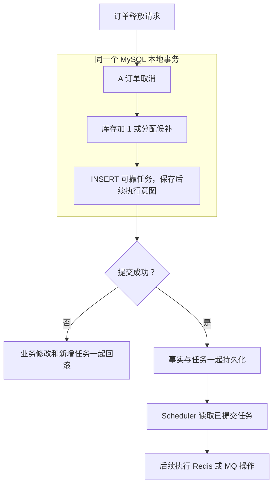

图中的原子边界停在 MySQL。本地提交成功表示任务意图被持久保存，**不表示 Redis 已经改好**。

<a id="section-10"></a>

### 2.2 业务事实、副作用意图和投影分别是什么？

| 概念 | 初学者解释 | 场景 A 中的例子 |
|---|---|---|
| Source of Truth，事实来源 | 判断业务结果时依赖的持久账本 | 订单状态；库存重算还依赖 initial_stock 与有效订单 |
| Side Effect，副作用 | 主业务确定后，对外部系统产生的修改或发送动作 | Redis 回补、归属迁移、发送超时消息 |
| Pending Side Effect Intent，待执行副作用意图 | 把“还要执行什么”写成记录 | RESTORE_REDIS_STOCK 及其订单参数 |
| Projection，投影 | 为访问或竞争控制维护的派生状态 | Redis stock、holder、claim |

“补偿”在这里主要是继续把已确定事实向外同步，而不是把所有数据库业务反向撤销。

<a id="section-11"></a>

### 2.3 为什么称为“类 Transactional Outbox”？

项目借鉴的核心是：**业务事实和后续必须执行的操作意图一起在本地数据库提交，再由后台执行器处理外部动作。**

传统 Outbox 常保存等待发送到消息总线的事件。本项目任务表包含 Redis 初始化、回补、归属迁移，以及发送 MQ 超时消息，形态更接近本地可靠任务表。所以简历写“类 Transactional Outbox / 本地消息表思想”是准确的；不应补写不存在的领域事件版本、CDC 自动发布、全局顺序或 exactly-once 保证。

<a id="section-12"></a>

### 2.4 为什么任务不能在 COMMIT 后再插入？

错误设计中，数据库取消先提交，接着才创建任务。如果两步之间进程宕机，A 已取消，但没有持久记录说明 Redis 还需要恢复。这叫“副作用意图丢失”：重试器连要重试什么都不知道。

同事务可以关闭这个正常创建路径上的间隙：任务 INSERT 异常向外传播时，业务修改也回滚；正常提交时，业务与新任务一起落库。前提是调用经过 Spring 事务代理，业务 Mapper 和 JdbcTemplate 使用当前配置的同一数据源事务。

`enqueue()` 自身没有单独的 `@Transactional`，不影响它加入调用者已有事务；如果未来在无事务方法里调用，就不能自动获得“与业务同事务”的性质。

<a id="section-13"></a>

## 3. ReliableTask 表中到底保存了什么？

<a id="section-14"></a>

### 3.1 SQL 表与 Java 执行对象各保存什么？

见 [ReliableTask.java](../src/main/java/com/citypass/reliable/ReliableTask.java)、[ReliableTaskRepository.java](../src/main/java/com/citypass/reliable/ReliableTaskRepository.java) 与 [citypass.sql](../src/main/resources/db/citypass.sql)。Repository 直接使用 JdbcTemplate。

| SQL 字段 | 实际作用 | Java ReliableTask 是否映射 |
|---|---|---|
| `id` | 自增任务 ID，也是扫描顺序和状态更新依据 | 是 |
| `task_type` | 任务分发类型 | 是，taskType |
| `biz_key` | 业务幂等键，唯一索引限制重复任务记录 | 否 |
| `payload` | 执行参数，varchar(2048) | 是 |
| `status` | PENDING、RUNNING、DONE、DEAD | 否 |
| `retry_count`、`max_retry` | 已失败次数和隔离阈值 | 都映射 |
| `next_retry_time` | PENDING 何时可领取，也用于定时任务 | 否 |
| `locked_by`、`lease_until` | 当前执行者和租约截止时间 | 都映射 |
| `version` | 每次领取递增，围栏化完成/失败回写 | 是 |
| `last_error` | 最近错误，最多保存 500 字符 | 否 |
| `create_time`、`update_time` | 创建与更新时间 | 否 |

Java 对象承载执行器领取后需要的字段；状态和时间条件直接参与 Repository SQL。不能因为实体没有 status，就说表里没有状态机。

<a id="section-15"></a>

### 3.2 INSERT IGNORE 与业务键是什么关系？

关键 SQL：

```sql
INSERT IGNORE INTO tb_reliable_task
    (task_type,biz_key,payload,status,retry_count,max_retry,next_retry_time,version)
VALUES (?, ?, ?, 'PENDING', 0, ?, ?, 0)
```

唯一索引是 `uk_reliable_task_biz_key(biz_key)`，不是 `(task_type, biz_key)` 联合键。调用方用不同前缀区分任务类型。扫描索引覆盖 status、nextRetryTime 与 leaseUntil。

同一业务键重复入队时，INSERT IGNORE 不再创建第二条记录；它也不会把原 DONE/DEAD 任务重新改成 PENDING，不会更新旧 payload。当前方法没有检查影响行数，也没有核验重复键对应的载荷是否相同。

💡 **任务表唯一键解决“重复留几张工作单”，任务执行版本解决“过期 worker 能否回写状态”，Lua 幂等解决“同一工作单重复执行会怎样”。三者职责不同。**

<a id="section-16"></a>

### 3.3 六种真实 task_type 与 payload

| task_type | 创建处与 biz_key | payload | 执行内容 |
|---|---|---|---|
| `CREATE_RESERVATION` | HTTP 接受请求，`create-reservation:{requestId}` | ReservationOrder 请求 JSON | 发送 MQ CREATE，要求 Broker 返回 SEND_OK |
| `ORDER_TIMEOUT` | createOrder 或补位，`order-timeout:{订单号}` | 订单号字符串 | 到 offerExpireTime 才可领取，发送 MQ TIMEOUT 并校验 SEND_OK |
| `RESTORE_REDIS_STOCK` | releaseOrPromote 恢复分支，`restore-redis-stock:{旧订单号}` | 含 resourceVersion 的旧订单 JSON | 执行 restore-stock.lua |
| `TRANSFER_RESERVATION_CLAIM` | releaseOrPromote 补位分支，`transfer-reservation:{旧订单号}` | 活动、旧用户/订单/版本、新用户/订单/版本七个字段 | 执行 transfer-reservation.lua |
| `INIT_RESERVATION_STOCK` | addLimitedPassStock，`init-reservation-stock:{活动号}` | LimitedPassStock JSON，含 initialStock | 执行 init-reservation-stock.lua |
| `INVALIDATE_VENUE_CACHE` | Venue 更新，`invalidate-venue-cache:{id}:{version}` | venueId 与 cacheVersion | 版本化删除缓存、Pub/Sub 广播并驱逐网关 |

花括号表示参数占位，不是键中额外的字面字符。ORDER_TIMEOUT 使用 `enqueueAt` 写真实截止时间；其他普通任务默认立即具备领取资格。

<a id="section-17"></a>

## 4. 沿源码走完可靠任务的创建

<a id="section-18"></a>

### 4.1 从取消入口走到本地事务

[ReservationServiceImpl.cancelOrder](../src/main/java/com/citypass/service/impl/ReservationServiceImpl.java) 调用 [ReservationTransactionalService.cancelAndPromote](../src/main/java/com/citypass/service/impl/ReservationTransactionalService.java)；超时入口调用 `expireAndPromote`。二者都由独立 Spring Bean 的 `@Transactional(rollbackFor = Exception.class)` 方法承接。

沿“本次无候补、恢复公共库存”的实际分支观察：

| 顺序 | 方法内发生的事 | 尚未提交时的数据变化 |
|---|---|---|
| 1 | 读取旧订单并锁活动库存行，条件关闭待支付订单 | A 订单变为 status=4 |
| 2 | 同事务推进 A 的请求事实；若来自候补，再推进候补终态 | 请求为 CANCELLED/EXPIRED，旧 OFFERED 退出 |
| 3 | 活动不能补位，或清理无效候选后没有 WAITING | 进入库存恢复分支 |
| 4 | 更新 `stock = stock + 1`，要求影响 1 行 | DB stock 增加 1 |
| 5 | enqueue RESTORE_REDIS_STOCK | INSERT 新 PENDING 任务 |
| 6 | 返回 RELEASED，事务代理提交 | 业务事实与任务一起生效 |

核心片段：

```java
reliableTaskRepository.enqueue(
        ReliableTaskRepository.RESTORE_REDIS_STOCK,
        "restore-redis-stock:" + orderId,
        JSONUtil.toJsonStr(oldOrder));
return new ReleaseResult(ReleaseAction.RELEASED, oldOrder, null);
```

事务内没有直接执行 Redis 恢复脚本。提交后写 Redis 请求状态只是查询投影；即使投影失败，MySQL 请求事实和可靠任务仍然存在。

<a id="section-19"></a>

### 4.2 CREATE、补位、发布活动与 Venue 更新都沿用同一思想

HTTP 预约入口先由 `acceptRequest` 同事务写 PROCESSING 请求事实与 CREATE_RESERVATION，避免“Redis 写了 PROCESSING、进程却在发 MQ 前退出”。后台拿到 Broker 的 SEND_OK 才把 CREATE 任务标为 DONE。

普通建单在同一事务创建订单、把请求事实推进为 RESERVED，并用 `enqueueAt` 把 ORDER_TIMEOUT 的 `next_retry_time` 直接设为 offerExpireTime。补位事务还会写归属迁移任务；活动发布会写 INIT_RESERVATION_STOCK。

Venue 更新也已纳入任务表：更新数据库、递增 cacheVersion、写 INVALIDATE_VENUE_CACHE 同事务提交。它不再依赖提交后内存回调保存失效意图。

<a id="section-20"></a>

## 5. Scheduler 怎样扫描、执行和重试？

<a id="section-21"></a>

### 5.1 一次 tick 实际做什么？

[ReliableTaskScheduler.relay](../src/main/java/com/citypass/task/ReliableTaskScheduler.java) 默认以 `fixedDelay=1000ms` 调度。每轮最多处理 batchSize=50，但每次只调用 `claimReady(1, instanceId, leaseSeconds)` 领取即将执行的一条，执行完成后才领取下一条，避免批尾任务还在内存排队时 30 秒租约已经过期。

领取发生在 Repository 的短事务中：

```sql
SELECT id,task_type,payload,retry_count,max_retry,version
FROM tb_reliable_task
WHERE (status='PENDING' AND next_retry_time<=NOW())
   OR (status='RUNNING' AND lease_until<=NOW())
ORDER BY id
LIMIT ?
FOR UPDATE SKIP LOCKED
```

候选行随后以旧 version 为条件更新为 RUNNING，写入当前实例 UUID、leaseUntil，并将 version 加一。这里的任务彼此独立，所以 SKIP LOCKED 用来提高多实例领取并行度；第三篇业务候补队首使用的是阻塞锁，两种场景不要混淆。

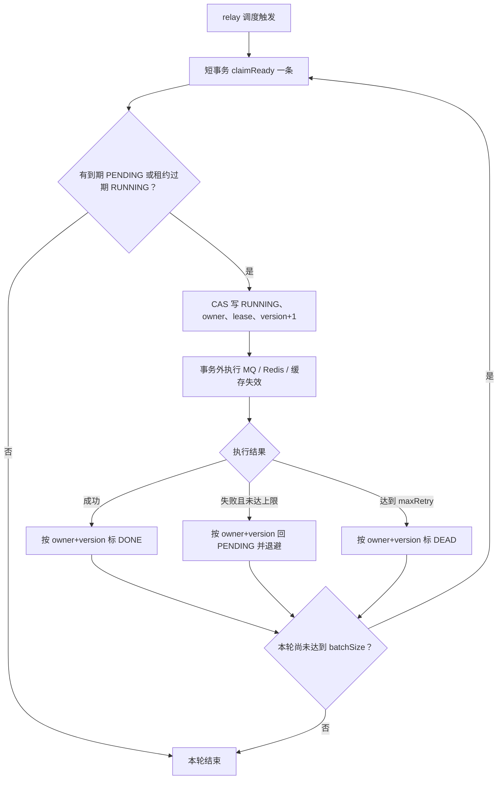

<a id="section-22"></a>

### 5.2 PENDING、RUNNING、DONE 与 DEAD 状态机

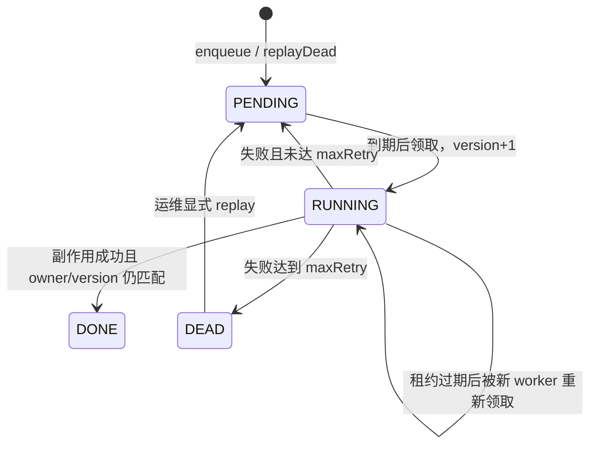

`markDone` 与 `markFailed` 都要求同时命中 `id + status=RUNNING + lockedBy + version`。旧 worker 即使晚返回，也不能覆盖后来领取者的任务状态；Repository 将这种结果识别为 LOST_LEASE。

版本围栏只保护任务表回写。旧 worker 在租约过期后仍可能完成外部副作用，因此 MQ/Redis/缓存处理仍要允许至少一次重放，不能把 version 说成外部系统的 exactly-once。

<a id="section-23"></a>

### 5.3 退避、最大次数与人工重放

失败次数先加一，再计算：

```java
int nextRetryCount = task.getRetryCount() + 1;
int delaySeconds = Math.min(300, 1 << Math.min(nextRetryCount, 8));
```

| 此前 retry_count | 本次失败后的计数 | 后续动作 |
|---|---|---|
| 0 | 1 | PENDING，2 秒后可重试 |
| 1 | 2 | PENDING，4 秒后可重试 |
| 2 | 3 | PENDING，8 秒后可重试 |
| 6 | 7 | PENDING，128 秒后可重试 |
| 7 及以上且未达上限 | 再加 1 | PENDING，256 秒后可重试 |
| 默认第 12 次失败 | 12 | DEAD，不再被正常扫描 |

虽然外层 cap 写 300，位移最多得到 256，所以当前公式的实际重试延迟上限是 256 秒。没有随机抖动。

配置 `RELIABLE_TASK_ADMIN_TOKEN` 后，可以读取 `/internal/reliable-tasks/stats`，或对 DEAD 任务调用 `POST /internal/reliable-tasks/{id}/replay`。重放将其重置为 PENDING、retryCount=0 并增加 version；token 为空时接口不可用。Micrometer 还记录 ready、dead、最老 ready 等 Gauge，以及完成、重试、死信 Counter。

<a id="section-24"></a>

## 6. 多实例与重复执行：任务表为什么还不够？

<a id="section-25"></a>

### 6.1 短事务怎样逐条领取任务？

多个应用实例使用各自 UUID 作为 owner。`FOR UPDATE SKIP LOCKED` 让实例跳过其他领取事务正在锁定的任务行；领取事务只负责改 RUNNING 后马上提交，外部 Redis/MQ/HTTP 调用不占数据库行锁。

30 秒租约用于 worker 宕机后的接管。若任务执行时间超过租约而代码没有续租，另一实例也可能重新领取；当前 Scheduler 逐条领取减少了“批内等待导致过期”，却没有消除长外部调用导致的重叠执行。

<a id="section-26"></a>

### 6.2 即使状态回写有围栏，副作用仍可能执行两次

最经典的窗口是：Redis 已执行成功，Java 还没来得及标 DONE 就宕机。任务留在 RUNNING；租约到期后，新实例以更高 version 领取并再次执行。

| 机制 | 解决的问题 | 不能单独解决什么 |
|---|---|---|
| bizKey 唯一约束 | 同一业务意图不重复建任务行 | 同一行不重复执行 |
| 行锁 + SKIP LOCKED | 正常领取期间避免多个事务拿到同一版本 | 租约过期后的必要重放 |
| owner + version 围栏 | 过期 worker 不能覆盖新 worker 的任务状态 | 已经发生的外部副作用 |
| leaseUntil | worker 宕机后任务可被接管 | 长调用期间自动续租 |
| DONE | 正常完成后不再被扫描 | 副作用成功、DONE 未写的窗口 |
| Lua 永久 marker / 业务版本 | 抑制 Redis 重放或拒绝旧交接 | Redis 整体数据丢失、非 Redis 外部系统语义 |

🔥 **可靠性要求任务能被接管，正确性要求重复执行不会多加库存或覆盖新一代归属。**

<a id="section-27"></a>

## 7. 精读 Redis 副作用：一次脚本维护哪些状态？

<a id="section-28"></a>

### 7.1 restore-stock.lua：精确恢复当前那一代资源

[restore-stock.lua](../src/main/resources/restore-stock.lua) 接收 stock 键与永久 marker `reservation:restore:{orderId}`，参数是 activityPassId、userId、orderId、resourceVersion。

脚本先检查 marker 与库存键，再要求旧 claim 精确等于 `orderId:resourceVersion`；只有 v3 遗留的 version=0 允许兼容纯 orderId。匹配后才删除 holder/claim、库存加一并写永久 marker。

| 场景 | 返回 | 执行器怎样处理 |
|---|---|---|
| 首次正常执行且 claim 匹配 | 1 | 标 DONE |
| 同一订单重复执行，marker 已存在 | 0，不再加库存 | 同样可标 DONE |
| 库存键不存在 | -1 | 抛异常，进入重试或 DEAD |
| claim 不匹配 | -2，不加库存也不删归属 | 抛异常，等待正确前置状态或人工处理 |

永久 marker 修复了旧实现“七天后迟到重放可能再次加库存”的问题；代价是活动归档时需要按生命周期清理相关 Redis 键。

<a id="section-29"></a>

### 7.2 transfer-reservation.lua：换 owner，不增减库存

[transfer-reservation.lua](../src/main/resources/transfer-reservation.lua) 使用永久 marker `reservation:transfer:{oldOrderId}`，接收七个参数：

```text
activityPassId, oldUserId, oldOrderId, oldVersion,
newUserId, newOrderId, newVersion
```

它要求旧 claim 等于 `oldOrderId:oldVersion`，且不允许用目标 `newOrderId:newVersion` 覆盖新用户已有的其他 claim。通过后才删除旧归属并写新归属；库存数字不变。旧归属不匹配返回 -1，新用户已有其他归属返回 -2，执行器都会重试。

连续 A→B、B→C 依靠 0→1→2 的 resourceVersion 建立前置顺序：B→C 先到时看不到 `B订单:1`，不能越过 A→B；迟到 A→B 也不能覆盖 C 的归属。任务可能暂时重试，但不能再说“任意乱序没有版本保护”。

<a id="section-30"></a>

### 7.3 init-reservation-stock.lua：初始化也有边界

[init-reservation-stock.lua](../src/main/resources/init-reservation-stock.lua) 先检查永久 marker `reservation:stock:init:{passId}`。标记存在返回 0；不存在才 SET initialStock 并写 marker。

它防止初始化任务重放覆盖已经扣减的库存。但库存单独丢失、marker 仍在时，重放不会重建库存；marker 单独丢失时，重放可能以初始量覆盖现状。初始化任务不是任意时刻的库存恢复器。

<a id="section-31"></a>

### 7.4 Lua 的原子执行与持久幂等不是一回事

Lua 在 Redis 内按一次脚本原子执行，避免命令被其他客户端穿插；运行时错误仍不提供数据库式自动回滚。永久 marker 消除了正常 TTL 过期，但 Redis 数据整体丢失、错误键类型、执行结果未知和运维清理仍要单独考虑。

资源版本解决不同交接任务的前置顺序，marker 解决同一任务重放。两者不能互相替代。

<a id="section-32"></a>

### 7.5 ORDER_TIMEOUT 的 DONE 表示什么？

[RocketMQProducer.sendOrderTimeout](../src/main/java/com/citypass/mq/RocketMQProducer.java) 发送 TIMEOUT 消息；Scheduler 与 CREATE 一样，通过 `requireSendOk` 明确要求 SendResult 的 SendStatus 为 SEND_OK。不是“调用未抛异常就算成功”。

任务 DONE 表示 Broker 已确认发送，不表示消费者已经关闭订单。消费失败仍由 MQ 重投；每分钟超时扫描也会复用带 `offer_expire_time<=NOW()` 条件的关单流程兜底。

<a id="section-33"></a>

## 8. 两个必须会推演的任务失败窗口

<a id="section-34"></a>

### 8.1 Case 1：第一次 Redis 执行失败，恢复后成功

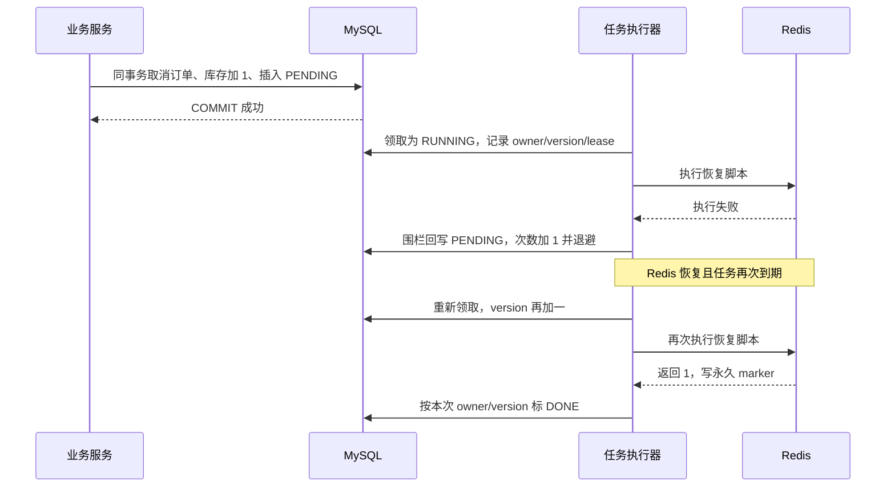

在依赖恢复、参数正确、脚本正常执行且无持续冲突写入等条件下，数据库与 Redis 最终收敛。延迟期间已经提交的订单取消不会被撤销。

<a id="section-35"></a>

### 8.2 Case 2：Redis 成功，但标 DONE 前宕机

| 时刻 | Redis | 任务表 |
|---|---|---|
| T0 | stock=0，没有恢复 marker | PENDING |
| T1 | worker 领取 | RUNNING，version=1，有 lease |
| T2 | Lua 完成，stock=1，marker 存在 | 仍为 RUNNING |
| T3 | worker 宕机，未标 DONE | 等待 leaseUntil |
| T4 | 新 worker 回收并执行 | RUNNING，version=2 |
| T5 | Lua 发现 marker，返回 0 | 新 worker 按 version=2 标 DONE |

若旧 worker 后来恢复并尝试以 version=1 写 DONE/FAILED，SQL 影响 0 行，不会覆盖 version=2 的状态。Redis 重放安全仍依赖永久 marker 与相关 Redis 事实存在。

<a id="section-36"></a>

### 8.3 当前重试机制还没有哪些能力？

当前已经有最大失败隔离、任务级租约、执行版本、显式 DEAD 重放和 Micrometer 指标。仍需准确说明：

- lease 没有自动续期，单次外部调用超过 30 秒可能重叠；
- 退避没有随机抖动，大面积故障恢复时可能同时重试；
- 指标与运维接口不等于已经接入告警、值班和审批流程；
- payload 没有独立 schemaVersion，代码升级时需兼容在途旧任务；
- Redis 全量丢失或长期 DEAD 需要基于业务事实重建或人工处置。

<a id="section-37"></a>

## 9. 如果没有一条明确的失败任务，谁发现不一致？

<a id="section-38"></a>

### 9.1 Retry 与 Reconciliation 的分工

任务表回答“哪项已登记工作还没有完成”；历史 bug、人工修改或 Redis 数据丢失不一定留下待执行任务。对账重新查看业务事实和派生状态，主动寻找它实际覆盖的差异。

| 机制 | 出发点 | 本项目数据来源 | 主要动作 |
|---|---|---|---|
| Retry | 已知有待执行任务 | tb_reliable_task | 领取、重做 MQ/Redis/缓存操作，失败隔离 |
| Reconciliation | 未必已有异常任务 | 订单、候补、初始库存、Redis stock | 关闭超时订单、关闭到期 WAITING、重算结束活动库存 |

<a id="section-39"></a>

### 9.2 当前对账顺序、频率与锁

[ReservationReconcileTask.reconcile](../src/main/java/com/citypass/task/ReservationReconcileTask.java) 默认开启，fixedDelay 为 60 秒，使用独立 Redisson 锁 `lock:reservation:reconcile`。

拿到锁后按顺序调用：`closeTimeoutOrders()`、`expireFinishedWaiters()`、`reconcileFinishedStocks()`。外层只有一组 try/catch，前一阶段抛出的未捕获异常可能让后续阶段本轮不执行。

<a id="section-40"></a>

### 9.3 第一阶段：补上漏掉的超时关闭

`closeTimeoutOrders()` 查询 status=1 且 offerExpireTime≤当前应用时间的订单，逐笔调用 `cancelTimeoutOrder`。它不直接强制加库存，而是复用到期复合 CAS：仍未支付且 `offer_expire_time<=本次事务的 now` 才关闭，再补位或恢复库存并写任务。

扫描数不等于关闭数；与支付、MQ 消费并发时，CAS 会让输掉竞争的一方跳过。释放事务自身报错时，“扫描到”也不代表修复完成。

<a id="section-41"></a>

### 9.4 第二阶段：关闭活动结束后的 WAITING

候补入队时，waitExpireTime 被设置为活动 endTime。`expireFinishedWaiters()` 每轮最多查询 500 条 `status=WAITING AND wait_expire_time<=now`，逐条调用事务方法 `expireWaiting(requestId)`。

`expireWaiting` 以 WAITING 为条件更新候补为 EXPIRED，并同步将 MySQL 请求事实从 WAITLISTED 推进为 EXPIRED。与补位并发时，只有条件更新获胜的一方生效；它不创建订单、不发送 CREATE，也不再存在旧文档所说的“已结束活动补发后又被消费者拒绝”链路。

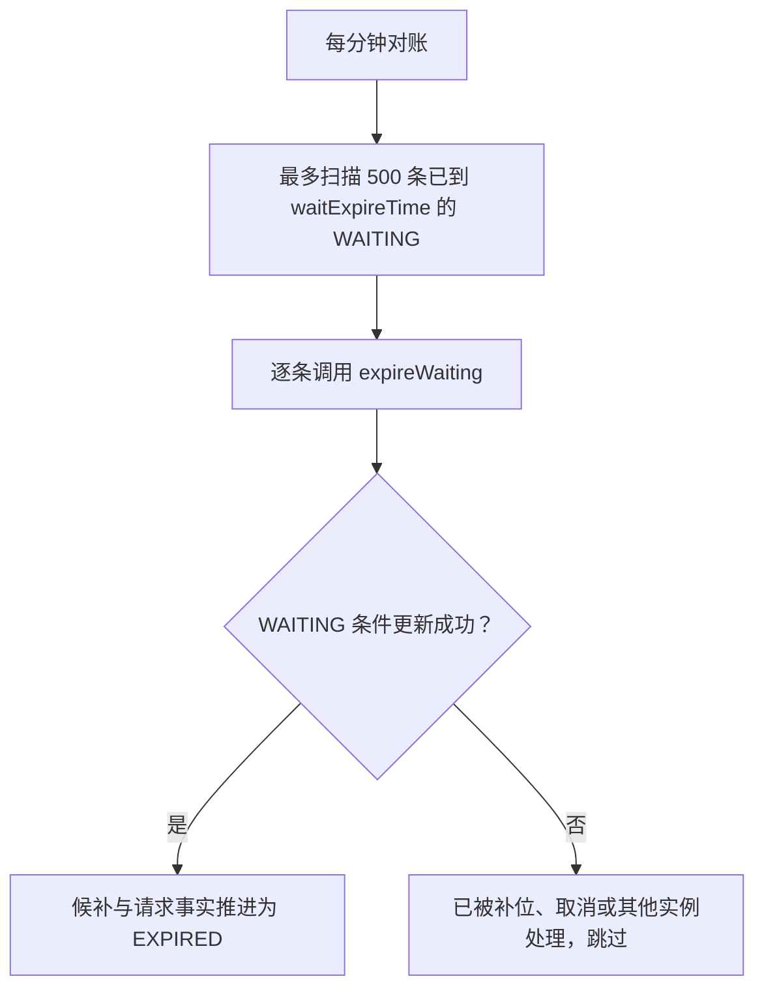

<a id="section-42"></a>

### 9.5 第三阶段：按订单账本重算结束活动库存

`reconcileFinishedStocks()` 只处理结束超过 2 分钟的活动。有效订单状态按代码为 1、2、3、5。

```text
expected = max(0, initial_stock - 有效订单数量)
```

initialStock 缺失或≤0 时跳过。DB stock 与 Redis stock 都等于 expected 就不写；否则先 SET Redis stock，再更新 MySQL stock。这两次写不是跨资源原子事务，第一次成功、第二次失败时仍可能暂时不一致，后续扫描再尝试收敛。

它只重算数量，不重建 holders/claim，也不自动改变可靠任务状态。

<a id="section-43"></a>

### 9.6 对账不是“任意漂移都会恢复”的证明

| 异常 | 当前可做的事 | 剩余限制 |
|---|---|---|
| 待支付订单过期，TIMEOUT 未正常生效 | 扫描后重走条件释放 | 释放自身异常仍可能阻断 |
| WAITING 已到活动结束 | 条件推进候补与请求事实为 EXPIRED | 单轮最多 500 条，依赖后续轮次 |
| 已结束超过 2 分钟的库存数字不一致 | 按 initialStock 与有效订单重写 | 依赖基准有效；Redis/DB 不是原子双写 |
| holders/claim 错乱，但库存数字正确 | 没有完整归属重建 | 数量相同不代表 owner 正确 |
| 活动进行中，初始化 marker 在但 stock 丢失 | restore/init 可能无法重建 | 当前库存重算只处理结束活动 |

CREATE 请求已经有 MySQL 请求事实与 CREATE_RESERVATION 任务，所以正常入口不再依赖 holder 差集发现丢消息；但对账仍没有全量重建全部业务 Redis。

<a id="section-44"></a>

## 10. 第一条主线的最终一致性闭环

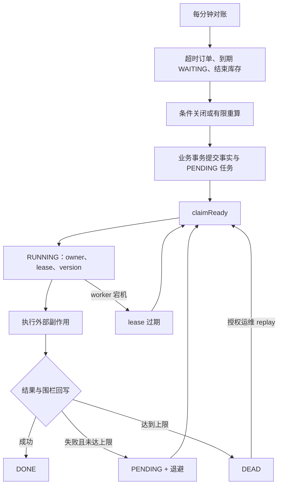

准确的总结是：本地事务保留业务事实与后续意图；租约让其他实例接管中断任务；执行版本阻止旧 worker 覆盖状态；幂等脚本承受副作用重放；DEAD 与指标把永久错误暴露给运维；对账再修复当前明确覆盖的漂移。

是否收敛仍取决于依赖恢复、幂等前置事实、人工处理 DEAD 和没有持续冲突写入。项目没有给任意故障下的收敛时间上限。

<a id="section-45"></a>

## 11. 第二条主线：先跟踪一次 Venue 查询

<a id="section-46"></a>

### 11.1 请求在哪一层进入 Java？

经仓库 OpenResty 部署访问 `GET /venues/1` 时，入口先检查网关共享字典。未命中才进入 [VenueController.queryVenueById](../src/main/java/com/citypass/controller/VenueController.java)，再调用 [VenueServiceImpl.queryById](../src/main/java/com/citypass/service/impl/VenueServiceImpl.java)。

Service 调用 [MultiLevelCacheService.queryWithMultiLevel](../src/main/java/com/citypass/utils/MultiLevelCacheService.java)，提供 `cache:venue:`、场馆 ID、Venue 类型、`this::getById` 与 30 分钟基准 TTL。

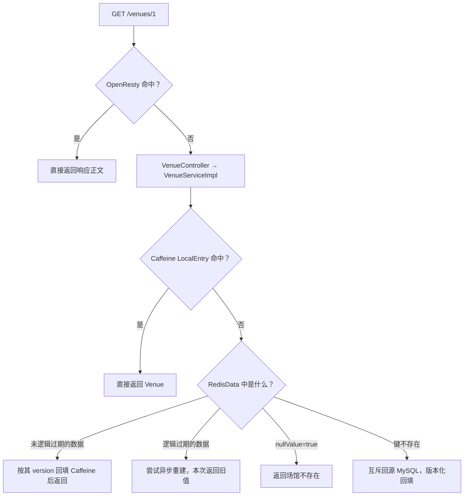

直接访问 Java 的 8081 端口时，链路从 Controller 开始，绕过网关。

<a id="section-47"></a>

### 11.2 L1、L2 的编号为什么看起来冲突？

网关配置自称 OpenResty L1；Java 注释把 Caffeine 称为 L1、Redis 称为 L2、MySQL 称为 L3。本文优先使用名字，完整外部读路径是：**OpenResty → Caffeine → Redis → MySQL**。

| 位置 | 缓存什么 | 存在的直接价值 | 作用范围 |
|---|---|---|---|
| OpenResty | `/venues/{id}` 的 HTTP 响应正文 | 命中时不进入 Java | 当前网关实例共享字典 |
| Caffeine | LocalEntry(data, version) | 命中时不访问 Redis | 当前 JVM |
| Redis | RedisData(data, expireTime, version, nullValue) | 多应用实例共享，减少查库 | 当前 Redis 数据空间 |
| MySQL | Venue 事实与 cacheVersion | miss、重建和版本判断的来源 | 数据库 |

LocalEntry 虽保存 version，读取时并不会再访问 Redis 水位做逐次校验；跨实例新鲜度主要依赖 Pub/Sub 主动驱逐与本地 TTL。

<a id="section-48"></a>

## 12. 从全 miss 到命中：每层回填了什么？

<a id="section-49"></a>

### 12.1 第一次查询：数据库有该 Venue

OpenResty、Caffeine 与 Redis 都 miss 后，Java 获取 `lock:venue:{id}`，再检查一次 Redis；仍不存在才 `getById`。数据库返回的 Venue 带 cacheVersion。

回填不再是普通 SET。`write-cache-if-version.lua` 比较数据库行 version 与 `cache:venue:version:{id}` 水位：只有 expectedVersion≥currentVersion 才写 RedisData 与物理 TTL。冷加载方法随后把查询结果装入当前 JVM 的 LocalEntry；响应经过 OpenResty body filter 后，网关按完整正文缓存。

<a id="section-50"></a>

### 12.2 实际 TTL：不要照抄注释的“±20%”

| 位置 | 实际过期策略 |
|---|---|
| OpenResty | 600 + math.random(-60,60) 秒，即 540～660 秒 |
| Caffeine | expireAfterWrite 10 分钟，maximumSize 10000 |
| Redis 正常数据逻辑过期 | baseSec + floor(baseSec×0.2×随机数)，只增加 |
| Redis 正常数据物理过期 | max(逻辑 TTL×2, 逻辑 TTL+3600) 秒 |
| Redis 冷 miss 查不到数据 | RedisData(nullValue=true)，固定 2 分钟 |
| Redis 异步重建查不到数据 | 不写 null marker，驱逐当前本地项 |

当前 baseSec=1800，逻辑期限为 1800～2159 秒，约 30～36 分钟；物理期限为 5400～5759 秒，约 90～96 分钟。

Caffeine 的 10 分钟从 LocalEntry 写入时计算，不直接继承 Redis expireTime。因此本地对象可能在 Redis 逻辑期限到来后继续命中一段时间。

<a id="section-51"></a>

### 12.3 查不到数据为什么缓存 null marker？

不存在的 ID 若每次查库会形成缓存穿透。当前代码用带 `nullValue=true`、version 与 expireTime 的 RedisData JSON 表示已查证不存在；空白字符串会被 `readRedis` 当作 miss，不再是负缓存格式。

Caffeine 不缓存 null。Java 的业务失败通常仍是 HTTP 200，而 OpenResty 只检查 HTTP 状态、正文和大小，不解析 success，所以网关仍可能缓存“场馆不存在”的响应 540～660 秒。

当前 null marker 用普通 Redis SET，没有经过版本比较；`POST /venues` 又直接 save，没有递增版本或写失效任务。虽然自增 ID 的常规创建路径较少复用已查询的不存在 ID，这仍是不能扩写成“所有创建与负缓存竞态都已解决”的边界。

<a id="section-52"></a>

### 12.4 网关回填还有哪些条件？

见 [nginx.conf](../src/main/resources/openresty/nginx.conf)：场馆路径以 URI 为键；HTTP 200 时累计响应片段，结束且正文≤1 MiB 才写共享字典。命中时设置 `X-Cache-Hit: OpenResty-L1`。

它不理解 Venue cacheVersion，也不检查 Redis 逻辑期限。如果 Java 本次允许返回逻辑过期旧值，网关仍可能把该响应重新保存。网关需要依赖后续 purge 或自身 TTL 收敛。

<a id="section-53"></a>

## 13. 热点过期时，如何避免所有请求同时查库？

<a id="section-54"></a>

### 13.1 冷 miss：互斥锁与双重检查

`queryWithMutexLock` 对 `lock:venue:{id}` 使用 SETNX，值是 UUID token，固定 10 秒过期。获得锁后再次读 Redis，避免前一请求已完成重建而自己仍查库。

未拿到锁时，每次等待 25～50ms 并检查缓存，最多 20 次；耗尽或线程中断后降级直接查库。因此它减少并发回源，但不是“永远只有一个数据库查询”。

[unlock.lua](../src/main/resources/unlock.lua) 比较 token 后删除，避免旧请求释放新持有者的锁。当前没有续期；回源超过 10 秒时仍可能出现多个重建者。

<a id="section-55"></a>

### 13.2 逻辑过期：旧值先返回，新值异步加载

RedisData 仍在但 expireTime 已到时，主分支调用 `rebuildAsync`。只有拿到同一场馆锁的请求会提交到 10 线程池；当前请求不等待，直接返回旧 Venue。

后台从 MySQL 读出数据后，将其 cacheVersion 交给版本化写入脚本。若失效水位已经更高，Lua 返回 0，异步分支不会把旧值写入 Caffeine，反而清除本地项；只有 Redis 写入被接受才更新 LocalEntry。

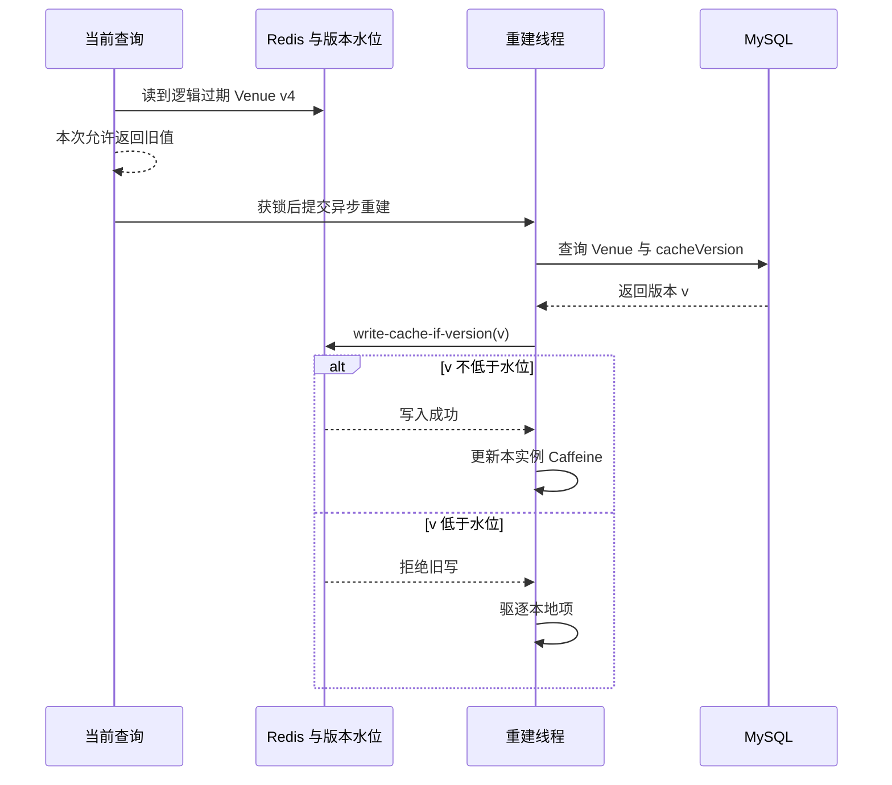

<a id="section-56"></a>

### 13.3 逻辑过期、物理过期、随机 TTL 与版本分别做什么？

逻辑期限决定何时刷新并允许一次旧读；物理期限让 Redis 键最终消失；随机增量分散到期；版本水位阻止较旧数据库快照重新覆盖 Redis。

它们仍不等于永久可用或强一致。Redis 访问异常没有统一 catch 后自动直查数据库的降级链；冷 miss 的版本化写返回 false 时，当前代码仍返回已读结果，外层也仍会放入 Caffeine，这个分支没有异步重建那样的本地写入条件。因此准确表述应是“保护 Redis 回填，并完整保护异步重建的本地回填”，不能泛化为全部路径。

<a id="section-57"></a>

### 13.4 CacheClient 哪些能力没有被 Venue 主链直接使用？

[CacheClient](../src/main/java/com/citypass/utils/CacheClient.java) 保留穿透、互斥和逻辑过期工具；Venue 主查询使用 MultiLevelCacheService。

`/venues/benchmark/redis/{id}` 使用独立前缀 `cache:venue:baseline:` 写普通 Venue JSON，主链使用 `cache:venue:` 的 RedisData。v4 已隔离二者键空间；版本化失效 Lua 会同时删除主缓存与基线缓存，避免更新后压测基线长期保留旧值。

<a id="section-58"></a>

## 14. 管理员修改 Venue 后，失效意图怎样可靠落库？

<a id="section-59"></a>

### 14.1 真实写入口是 PUT /venues

`VenueController.updateVenue` 调用带 `@Transactional` 的 `VenueServiceImpl.update`。方法依次执行：

1. `updateById` 更新业务字段；
2. `incrementCacheVersion(id)` 原子执行 cache_version=cache_version+1；
3. 重新读取 Venue，取得已提交候选版本；
4. enqueue `INVALIDATE_VENUE_CACHE`，bizKey 包含 id 与 version。

四步共用一个 MySQL 事务。任一步抛异常，Venue 变化、版本递增和任务记录一起回滚；成功提交后，即使应用立刻宕机，PENDING 任务仍保留。

<a id="section-60"></a>

### 14.2 为什么不在事务提交前直接删缓存？

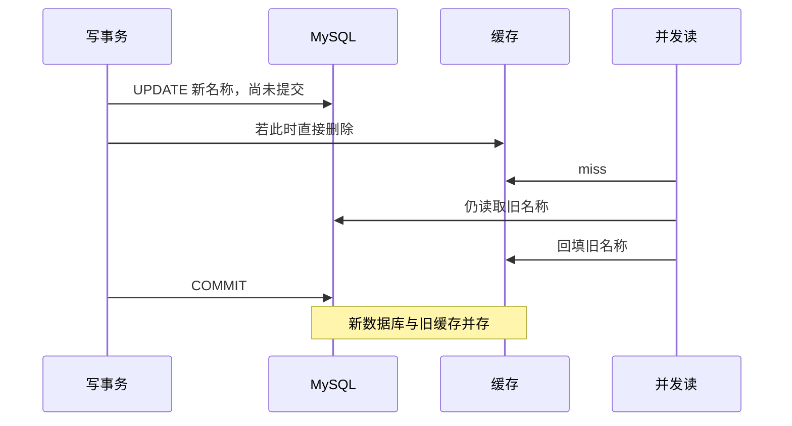

当前实现不在业务事务中直接碰 Redis，而是把失效意图一起提交。这样既避免提前删除制造的明显竞态，也避免 COMMIT 与 afterCommit 内存回调之间宕机后无任务可查。

<a id="section-61"></a>

### 14.3 INVALIDATE_VENUE_CACHE 的真实执行链

Scheduler 解析 `VenueCacheInvalidation(venueId, cacheVersion)`，调用 [VenueCacheInvalidator.evict](../src/main/java/com/citypass/utils/VenueCacheInvalidator.java)。第一步在 Redis 执行 [invalidate-venue-cache.lua](../src/main/resources/invalidate-venue-cache.lua)：

```text
推进 cache:venue:version:{id} 水位
→ 删除 cache:venue:{id}
→ 删除 cache:venue:baseline:{id}
→ PUBLISH cache:venue:invalidate "{id}:{version}"
```

所有在线应用实例都通过 [RedisPubSubConfig](../src/main/java/com/citypass/config/RedisPubSubConfig.java) 订阅频道并清除自己的 Caffeine 项。发布任务的实例还会主动清本地项，避免依赖消息回环。最后若配置 purgeUrl，则向 OpenResty 发 HTTP DELETE。

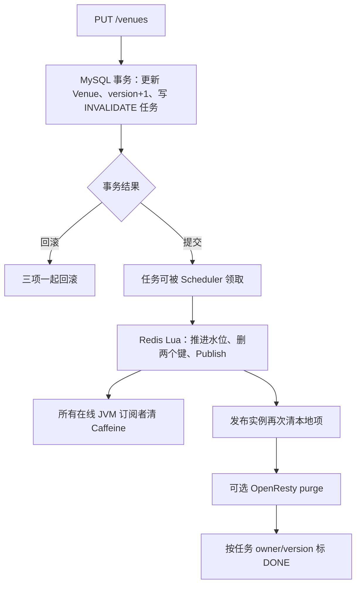

Redis Lua 返回空或网关 purge 失败都会抛异常，让任务进入退避重试或最终 DEAD。再次执行同一 cacheVersion 会保留较高水位、重复删除并重新 Publish，符合幂等重试需要。

<a id="section-62"></a>

### 14.4 版本水位怎样阻止旧重建覆盖？

失效脚本取 `max(当前水位, 已提交版本)`，不会被迟到的低版本失效任务倒退。Canal 或删除事件拿不到已提交行版本时传 -1，脚本就在当前 Redis 水位上加一。

[write-cache-if-version.lua](../src/main/resources/write-cache-if-version.lua) 只接受 expectedVersion≥currentVersion 的回填。假设旧查询拿到 v4，随后写事务提交 v5 并将水位推进到 5，那么旧查询尝试写 v4 时返回 0，不能把 Redis 主缓存恢复为旧值。

这解决的是缓存代际顺序，不是让所有当前请求都等待最新值：在失效任务执行前仍可能短暂读旧，逻辑过期分支本来就允许当前请求返回旧数据。

<a id="section-63"></a>

## 15. 失效 Outbox 为什么仍然不是强一致？

<a id="section-64"></a>

### 15.1 COMMIT 与任务执行之间是可恢复窗口

数据库提交后到 Scheduler 执行前，缓存仍可能旧。与旧 afterCommit 方案相比，这个窗口有持久 PENDING 记录；进程退出后，其他实例可以领取。它把“可能永久漏删”改成“可重试的暂时不一致”。

如果 Redis/网关长期不可用、任务达到 maxRetry 进入 DEAD 且无人处理，旧缓存仍可能等 TTL 才收敛。因此 Outbox 提供恢复依据，不提供同步强一致或固定完成时限。

<a id="section-65"></a>

### 15.2 旧回填会被全部阻止吗？

不能一概而论：

| 路径 | version 水位的效果 | 本地 Caffeine 行为 |
|---|---|---|
| 逻辑过期异步重建 | Redis 拒绝低版本写入 | 只有 Redis 写成功才 put；拒绝时 invalidate |
| 正常 Redis 命中 | 该 RedisData 已带被接受的 version | 写 LocalEntry |
| 冷 miss 回源 | Redis 同样拒绝低版本写入 | 当前方法忽略 false，外层仍可能 put 本次查询结果 |
| null marker | 当前使用普通 SET | 不写 Caffeine，但未经过写入版本 Lua |

所以“旧版本无法覆盖 Redis”成立；“所有路径都不可能把旧对象留在任一 JVM”仍不成立。冷 miss 分支和负缓存创建边界是后续可继续收紧的实现点。

<a id="section-66"></a>

### 15.3 Pub/Sub 广播与多网关边界

Redis Pub/Sub 会把一次失效消息发给当时在线且连接正常的所有 JVM 订阅者，不要求 RocketMQ 把同一 Canal 消息分别投递给每个应用实例。离线实例重启后 Caffeine 是空的；但网络分区中仍运行的实例可能漏消息，Pub/Sub 没有持久确认，需要本地 TTL 兜底。

OpenResty purgeUrl 仍是一个配置地址。它可以指向负载均衡入口，但源码没有枚举全部网关、收集每个实例确认的协议；网关字典也不理解 cacheVersion。

<a id="section-67"></a>

## 16. Canal + RocketMQ 是怎样补充缓存失效的？

<a id="section-68"></a>

### 16.1 它来自数据库变更日志，不来自应用任务

仓库保留可选链路：MySQL binlog 由 Canal 读取，以 flat JSON 发到 RocketMQ；Java 消费变化事件，再调用同一个版本化 invalidator。

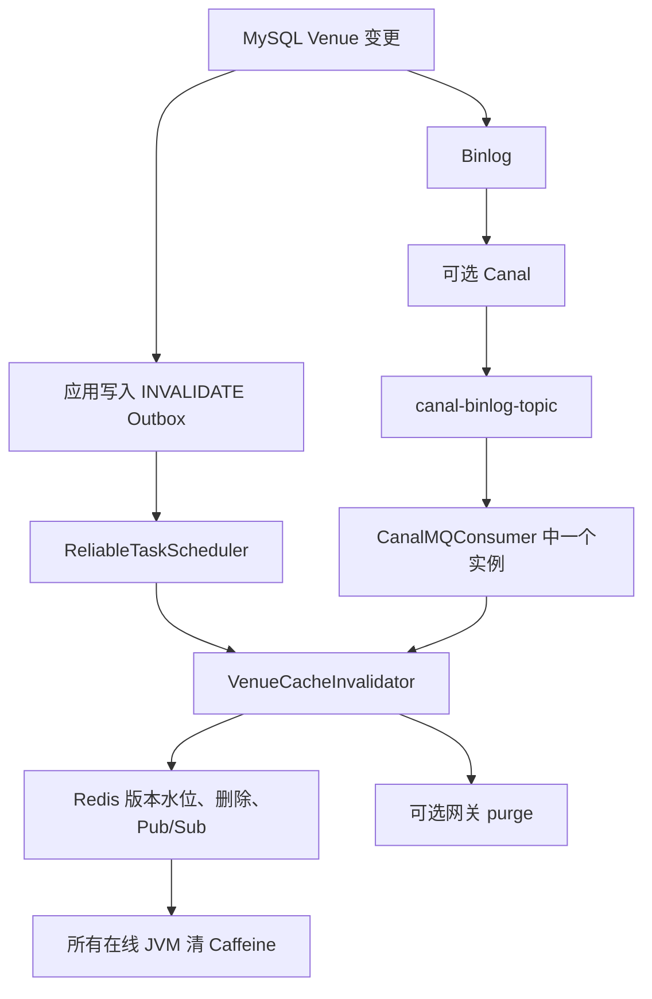

应用 Outbox 覆盖正常 PUT；Canal 还能观察绕过应用的数据库修改。两条通道可能重复触发，但失效脚本用单调版本水位并允许重复删除。

<a id="section-69"></a>

### 16.2 消费者具体识别什么？

[CanalMQConsumer](../src/main/java/com/citypass/mq/CanalMQConsumer.java) 仅在 `canal.enabled=true` 时创建，订阅 `canal-binlog-topic`，消费者组为 `canal-cache-consumer-group`。

它目前只注册 `tb_venue` handler，遍历 flat JSON data，读取 id 与 cache_version 后调用 `evict(id, version)`。处理含网关 purge 在内的任一步抛异常，消费者返回 RECONSUME_LATER；正常才返回 CONSUME_SUCCESS。

<a id="section-70"></a>

### 16.3 默认是否启用？本地与 Compose 要分开

| 配置 | application.yaml 默认 | docker-compose.yml 提供的行为 |
|---|---|---|
| reliable-task.enabled | true | 未覆盖则沿用 |
| reliable-task.batch-size / lease-seconds / max-retry | 50 / 30 / 12 | 未覆盖则沿用 |
| reservation.reconcile.enabled | true | 未覆盖则沿用 |
| rocketmq.enabled | false | app 环境变量设为 true |
| gateway-cache.purge-url | 空字符串 | app 指向 `http://openresty/internal/cache/venue` |
| canal.enabled | false | app 的 CANAL_ENABLED 默认仍为 false |
| Canal 服务 | 应用配置不负责启动 | 可选 `canal` profile |

仅启动 Canal 容器不等于 Java 消费者已启用；还要保证 binlog、topic、连接与应用开关正确。

<a id="section-71"></a>

### 16.4 Canal 消费一次，怎样通知所有在线 JVM？

RocketMQ 同组实例以集群方式分担 Canal 消息，一个实例消费后调用 invalidator。Redis Lua 随后 Publish，所有在线应用订阅者清自己的 Caffeine。因此 MQ 无需切成广播消费来完成当前 JVM fan-out。

| 方式 | 触发源 | 可靠性角色 | 当前边界 |
|---|---|---|---|
| INVALIDATE Outbox | 应用 PUT 事务 | 失效意图持久化、可租约接管和重试 | 异步窗口；可能 DEAD |
| Canal + MQ | 数据库 binlog | 覆盖绕过应用的写入 | 默认关闭，依赖外部链路 |
| Redis Pub/Sub | 任一 invalidator 执行 | 在线 JVM 的本地缓存广播 | 非持久、无逐实例确认 |
| TTL / 重建 | 后续读取与到期 | 漏消息或网关残留的兜底 | 允许暂时读旧 |

<a id="section-72"></a>

## 17. 六种缓存故障窗口，逐个推演怎样恢复

<a id="section-73"></a>

### 17.1 Case 1：更新提交成功，失效任务正常完成

MySQL 已是新名称和新 cacheVersion，INVALIDATE 任务也已提交。Scheduler 领取后，Lua 推进水位、删除主/基线 Redis 键并广播；在线 JVM 清本地缓存，发布实例再主动清理，最后驱逐配置的网关。下一次 miss 回源新版本。

<a id="section-74"></a>

### 17.2 Case 2：更新事务回滚

Venue 业务字段、cacheVersion 递增和任务 INSERT 属于同一事务。任一步异常导致整体回滚，不会留下“数据库还是旧值却执行新版本失效任务”的正常路径。

<a id="section-75"></a>

### 17.3 Case 3：COMMIT 成功，执行失效前进程宕机

缓存暂时保留旧值，但 PENDING 已在 MySQL。原实例退出不影响其他 Scheduler 领取；若宕机发生在领取后，leaseUntil 到期后也可接管。最终仍受基础设施恢复、最大重试和 DEAD 运维处理约束。

<a id="section-76"></a>

### 17.4 Case 4：一个 worker 消费，多个 JVM 怎样清理？

处理任务的 worker 在 Redis 内 Publish `{id}:{version}`。所有在线 JVM 的 listener 清同一个 Caffeine key，测试脚本也用两个真实应用实例验证更新后两边读到新名称。

Pub/Sub 不保存离线消息；重启实例的本地缓存为空，但网络异常中持续运行且漏收消息的实例可能继续命中旧 LocalEntry，直到 10 分钟 TTL 或下一次广播。

<a id="section-77"></a>

### 17.5 Case 5：旧异步重建跨过更新提交

旧线程先读到 Venue v4；写事务随后提交 v5，失效 Lua 把水位设为 5；旧线程最后尝试 `write-cache-if-version(4)`，Redis 返回 0。异步分支不会写 Caffeine，并清理本地项，所以旧异步重建不能复活共享缓存。

这一结论应限定在异步分支。冷 miss 回源路径目前没有把 write=false 传回外层控制本地 put，仍有前节所述边界。

<a id="section-78"></a>

### 17.6 Case 6：网关驱逐失败

Redis 水位、删除和 Pub/Sub 已在 Lua 中完成，随后 HTTP purge 失败会抛异常。可靠任务不会标 DONE，而是退避；重试时 Lua 用同一版本再次删除并广播，再尝试网关。

若连续失败达到 maxRetry，任务进入 DEAD；此时 Java 与 Redis 可能已新，网关仍可旧到自身 TTL。任务状态表达的是整个 handler 是否完成，不是每个子步骤的独立状态。

<a id="section-79"></a>

## 18. 业务 Redis 与普通读缓存，使用两套收敛思路

| Redis 角色 | 键或数据 | 为什么不能只说“删掉就行”？ | 当前主要策略 |
|---|---|---|---|
| 预约业务投影与竞争状态 | reservation:stock、holders、claim | 数量与归属影响名额控制 | 可靠任务、永久 marker、resourceVersion、有限对账 |
| Venue 普通读缓存 | cache:venue、baseline、version | 可回源，但有多级副本和在途回填 | 失效 Outbox、版本水位、Pub/Sub、TTL、可选 Canal |
| 请求结果查询投影 | reservation:request Redis 键 | Redis 不是请求结果真相 | 查询先读 MySQL 请求事实，再兼容旧 Redis 投影 |

不能因为项目有可靠任务，就把每个 Redis SET/DELETE 都说成已持久补偿；也不能因为 Venue 可删后回源，就删除预约 claim 并期待普通查询自动重建业务归属。

<a id="section-80"></a>

## 19. 整个第四篇的总架构图

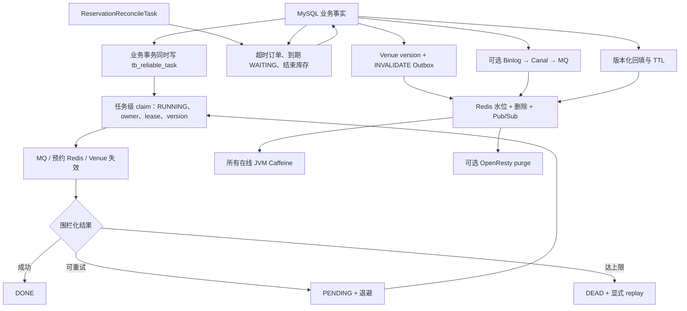

预约与 Venue 都把关键外部意图持久化到任务表，但副作用语义不同：预约 Lua 维护数量和资源归属，Venue 失效删除可重建副本并广播。任务租约保证可接管，执行版本保护任务表状态；外部正确性仍分别依赖幂等 marker、resourceVersion 或 cacheVersion 水位。

<a id="section-81"></a>

## 20. 源码调用链速查

<a id="section-82"></a>

### 20.1 可靠任务创建链

**预约请求：** `ReservationServiceImpl.reserve` → `ReservationTransactionalService.acceptRequest` → PROCESSING 请求事实 + CREATE_RESERVATION → 同事务提交。

**订单与超时：** `createOrder` → 条件扣库存、插订单、请求 RESERVED → `enqueueTimeout(orderId, offerExpireTime)` → 同事务提交。

**订单释放：** `cancelAndPromote / expireAndPromote` → 锁活动行并关闭旧订单 → 恢复库存或补位 → RESTORE / TRANSFER / ORDER_TIMEOUT → 同事务提交。

**活动发布：** `ActivityPassServiceImpl.addLimitedPassStock` → 保存活动与库存基准 → INIT_RESERVATION_STOCK → 同事务提交。

**Venue 更新：** `VenueServiceImpl.update` → 更新字段、cacheVersion+1 → INVALIDATE_VENUE_CACHE → 同事务提交。

<a id="section-83"></a>

### 20.2 可靠任务执行链

`ReliableTaskScheduler.relay` → 循环 `claimReady(1)` → 短事务 `FOR UPDATE SKIP LOCKED` → RUNNING + owner + lease + version → 事务外按六种类型执行 → `markDone`；异常时 `markFailed` 围栏回写 PENDING 或 DEAD。

CREATE 与 TIMEOUT 都要求 RocketMQ 返回 SEND_OK；Redis 脚本负码抛错；Venue 网关 purge 失败也抛错。任务丢失租约时，旧 worker 的状态更新影响 0 行。

<a id="section-84"></a>

### 20.3 对账链

`ReservationReconcileTask.reconcile` → 独立对账锁 → `closeTimeoutOrders` → `expireFinishedWaiters` → `reconcileFinishedStocks`。

三阶段分别复用条件超时关单、关闭已到活动截止时间的 WAITING、按 initialStock 与有效订单数重算结束活动库存。当前已没有 holder 差集补发 CREATE 阶段。

<a id="section-85"></a>

### 20.4 Venue 读取与写入链

**读：** OpenResty → `VenueController.queryVenueById` → `VenueServiceImpl.queryById` → `MultiLevelCacheService` → Caffeine / RedisData / MySQL → `write-cache-if-version.lua`。

**应用写：** `PUT /venues` → MySQL 更新 + cacheVersion 递增 + INVALIDATE Outbox → Scheduler → `invalidate-venue-cache.lua` → Redis Pub/Sub → 在线 JVM 本地驱逐 → 可选网关 DELETE。

**日志补充：** Canal flatMessage → RocketMQ → `CanalMQConsumer` → 同一个版本化 invalidator → Redis Pub/Sub fan-out。

<a id="section-86"></a>

### 20.5 文件导航表

| 职责 | 真实路径 | 阅读重点 |
|---|---|---|
| 任务对象 | [ReliableTask.java](../src/main/java/com/citypass/reliable/ReliableTask.java) | retry、maxRetry、owner、lease、version |
| 任务 SQL | [ReliableTaskRepository.java](../src/main/java/com/citypass/reliable/ReliableTaskRepository.java) | enqueueAt、claimReady、围栏回写、replayDead、统计 |
| 任务表 DDL | [citypass.sql](../src/main/resources/db/citypass.sql) | 四状态、租约、版本、唯一键与扫描索引 |
| 执行器 | [ReliableTaskScheduler.java](../src/main/java/com/citypass/task/ReliableTaskScheduler.java) | 逐条领取、六类分发、SEND_OK |
| 运维入口 | [ReliableTaskAdminController.java](../src/main/java/com/citypass/controller/ReliableTaskAdminController.java) | token、stats、DEAD replay |
| 可观测性 | [ReliableTaskMetrics.java](../src/main/java/com/citypass/reliable/ReliableTaskMetrics.java) | ready/dead/age Gauge 与结果 Counter |
| 预约事务 | [ReservationTransactionalService.java](../src/main/java/com/citypass/service/impl/ReservationTransactionalService.java) | 请求事实、订单、候补与任务的事务边界 |
| 对账 | [ReservationReconcileTask.java](../src/main/java/com/citypass/task/ReservationReconcileTask.java) | 超时订单、到期 WAITING、结束库存 |
| 库存恢复 | [restore-stock.lua](../src/main/resources/restore-stock.lua) | 永久 marker 与 claim version |
| 归属交接 | [transfer-reservation.lua](../src/main/resources/transfer-reservation.lua) | 七参数、旧版本与目标归属校验 |
| Venue 服务 | [VenueServiceImpl.java](../src/main/java/com/citypass/service/impl/VenueServiceImpl.java) | cacheVersion 递增与失效任务 |
| 多级缓存 | [MultiLevelCacheService.java](../src/main/java/com/citypass/utils/MultiLevelCacheService.java) | LocalEntry、RedisData、互斥、版本回填 |
| 失效入口 | [VenueCacheInvalidator.java](../src/main/java/com/citypass/utils/VenueCacheInvalidator.java) | Lua、发布端本地驱逐、网关异常 |
| 失效脚本 | [invalidate-venue-cache.lua](../src/main/resources/invalidate-venue-cache.lua) | 水位、双键删除、Publish |
| 回填脚本 | [write-cache-if-version.lua](../src/main/resources/write-cache-if-version.lua) | expectedVersion 与当前水位 |
| Pub/Sub 配置 | [RedisPubSubConfig.java](../src/main/java/com/citypass/config/RedisPubSubConfig.java) | 每个 JVM 的 listener |
| Canal 消费 | [CanalMQConsumer.java](../src/main/java/com/citypass/mq/CanalMQConsumer.java) | cache_version 与 RECONSUME_LATER |
| 网关 | [nginx.conf](../src/main/resources/openresty/nginx.conf) | 响应缓存、TTL、内部 purge |
| 验证脚本 | [reliability-test.ps1](../scripts/reliability-test.ps1)、[cache-consistency-test.ps1](../scripts/cache-consistency-test.ps1) | 故障恢复、双 JVM 与旧版本拒写 |

`POST /venues` 仍直接调用 save，没有接入 cacheVersion 递增与 INVALIDATE 任务；列表和 GEO 查询也不属于单 Venue 缓存键的完整治理范围。面试时不要说成“所有 Venue 写路径和全部列表缓存都已统一处理”。

<a id="section-87"></a>

## 21. 九个面试重点：理解后再回答

<a id="section-88"></a>

### 21.1 为什么不能依赖一个普通 @Transactional 管 MySQL 和 Redis？

**先理解：** 本地事务只能原子管理对应数据库资源。Redis 已成功后数据库回滚，或 MySQL 已提交后 Redis 失败，都无法靠一个注解同时撤销。

**30～60 秒回答：**

> 当前项目的 @Transactional 管理 MySQL，普通 Redis 与 MQ 不自动加入同一原子事务。因此我先在 MySQL 事务中提交业务事实和可靠任务，再在事务外执行副作用。任务可重试，Lua 负责幂等或版本校验，对账修复明确覆盖的漂移。这样接受暂时不一致，但保留收敛依据。

<a id="section-89"></a>

### 21.2 为什么任务必须与业务数据同事务写入？

**先理解：** 业务先提交、任务后插入，中间宕机会丢掉“还有什么没做”的证据。

**30～60 秒回答：**

> 例如取消订单时，旧订单关闭、请求事实、库存恢复与 RESTORE_REDIS_STOCK 一起提交；Venue 更新时，业务字段、cacheVersion 与 INVALIDATE 任务一起提交。若任务 INSERT 失败，业务也回滚；成功提交后，即使进程立刻退出，其他实例仍能读取任务。它保存的是恢复意图，并不表示外部副作用已经完成。

<a id="section-90"></a>

### 21.3 为什么叫“类 Outbox”，不能直接包装成完整标准实现？

**先理解：** 核心相似点是业务事实与待执行意图同库同事务，差异在于任务不仅发布领域事件，还直接驱动 Redis Lua、缓存失效与 MQ。

**30～60 秒回答：**

> 我称它为类 Transactional Outbox 或本地可靠任务表。CREATE、TIMEOUT、库存恢复、归属迁移、初始化和 Venue 失效都通过一张表调度。项目实现了领取、租约、重试和 DEAD，但没有通用事件 schema、订阅者治理或全局顺序平台，所以不会宣称是完整事件总线。

<a id="section-91"></a>

### 21.4 Retry 和 Reconciliation 有什么区别？

**先理解：** Retry 从一条已登记任务出发；对账重新比较事实，寻找未必已经登记的异常。

**30～60 秒回答：**

> ReliableTaskScheduler 重做已知任务。ReservationReconcileTask 每分钟扫描到期未支付订单、活动结束后的 WAITING，以及结束超过两分钟的库存差异。前者解决“工作单还没完成”，后者解决“业务账本与派生状态可能漂移”。当前对账不全量重建 holders/claim，所以我会说明覆盖范围。

<a id="section-92"></a>

### 21.5 Redis 成功，但任务还没标 DONE 就宕机怎么办？

**先理解：** 任务仍是 RUNNING，租约到期后会由新 worker 领取；新版本阻止旧 worker 回写，但副作用仍会重做。

**30～60 秒回答：**

> 新 worker 在 leaseUntil 后以更高 version 接管并再次执行。restore-stock.lua 的永久 marker 让重放返回 0，不重复加库存；新 worker 再按自己的 owner/version 标 DONE。若旧 worker 迟到，它的状态更新会因版本不匹配失败。租约和围栏保护任务状态，Lua marker 保护外部副作用，两层缺一不可。

<a id="section-93"></a>

### 21.6 为什么最终一致性仍然要求幂等和业务版本？

**先理解：** 同任务重放与不同任务乱序是两个问题。marker 记住“这项工作做过”，resourceVersion/cacheVersion 表达“当前是哪一代”。

**30～60 秒回答：**

> 至少一次重试会产生重复执行，所以恢复和交接脚本使用永久 marker。连续 A→B→C 还需要 resourceVersion 验证旧 claim 与新 claim，避免迟到任务覆盖新归属；缓存用 cacheVersion 水位拒绝旧回填。任务表 version 只围栏状态回写，不能替代业务版本。

<a id="section-94"></a>

### 21.7 为什么缓存失效意图要与 Venue 更新同事务？

**先理解：** 提交后回调仍可能在 COMMIT 与执行之间随进程一起丢失。持久任务才能被别的实例恢复。

**30～60 秒回答：**

> Venue 更新在一个 MySQL 事务中更新数据、递增 cacheVersion 并写 INVALIDATE_VENUE_CACHE。这样避免提交前直接删缓存导致并发旧读回填，也避免数据库已提交但 afterCommit 回调尚未执行就宕机时永久漏删。提交后由可靠任务异步失效，所以正常路径会有短暂不一致窗口。

<a id="section-95"></a>

### 21.8 失效 Outbox 与版本水位是否已经保证强一致？

**先理解：** Outbox 保证意图可恢复，版本水位约束旧 Redis 写入；两者都没有让读请求与数据库事务同步等待。

**30～60 秒回答：**

> 没有。任务执行前用户仍可能命中旧缓存，逻辑过期也允许本次返回旧值；Pub/Sub 没有逐实例持久确认，网关不理解版本。版本 Lua 能拒绝旧 Redis 回填，异步重建也不会写旧 Caffeine，但冷 miss 的本地回填还有边界。项目实现的是可解释的最终一致性，不是所有层同步强一致。

<a id="section-96"></a>

### 21.9 多级缓存最大的复杂度是什么？

**先理解：** OpenResty、每个 JVM 和 Redis 都能独立保存副本，旧读取还可能在失效后回填。

**30～60 秒回答：**

> 难点是失效传播与旧写顺序。项目用失效 Outbox 保证事件可重试，用 Redis Lua 单调推进 cacheVersion 水位并删主/基线键，再用 Pub/Sub 清在线 JVM，最后 purge 网关；回填也比较版本。还要承认 Pub/Sub、多个网关、冷 miss 与新增 Venue 路径的边界，而不是只列出三层缓存名称。

<a id="section-97"></a>

## 22. 常见错误理解与纠正

| 容易讲错的说法 | 对照源码后的准确理解 |
|---|---|
| @Transactional 让 MySQL 与普通 Redis 原子提交 | 只管理对应本地事务资源 |
| ReliableTask 就是完整事件平台 | 它是同事务保存并执行六类副作用的本地任务表 |
| 任务只在 PENDING 与 DONE 之间变化 | 还有 RUNNING、DEAD、租约回收与人工 replay |
| 首次失败后等 1 秒 | 代码先加次数，首次延迟为 2 秒 |
| 最大退避一定是 300 秒 | 当前位移上限使实际为 256 秒 |
| 全局 Redisson 锁串行 relay | 当前任务级 `FOR UPDATE SKIP LOCKED`，多实例可并行 |
| owner/version 已实现外部 exactly-once | 它只阻止过期 worker 覆盖任务表状态 |
| restore 的永久 marker 解决所有库存问题 | 它处理同任务重放，Redis 整体丢失仍需重建 |
| transfer 只比较旧订单号 | 当前精确比较 orderId:resourceVersion，并保护目标 claim |
| TIMEOUT send 未抛错就算成功 | CREATE 和 TIMEOUT 都要求 Broker SEND_OK |
| 对账还在找 holder 缺单并补 CREATE | 当前第二阶段关闭已到期 WAITING |
| Redis 负缓存是空字符串 | 当前是 RedisData(nullValue=true) |
| 基线与主查询仍共享键格式 | 已使用 `cache:venue:baseline:` 隔离 |
| Venue 更新依赖 afterCommit 回调 | 当前同事务写 INVALIDATE Outbox |
| 一个 Canal 消费者只能清一个 JVM | invalidator 会 Redis Publish，所有在线 JVM 订阅清理 |
| Pub/Sub 等于全实例可靠确认 | 它非持久、无逐实例 ack |
| 版本水位杜绝任何旧对象进入 Caffeine | 异步分支已保护；冷 miss 本地 put 仍有边界 |
| 网关失败只记日志 | invalidator 抛异常，可靠任务会重试并可能 DEAD |
| 所有 Venue 写入都触发失效任务 | PUT 已覆盖，POST save 仍未接入 |

<a id="section-98"></a>

## 23. 简历里的每一句，怎样落回源码？

| 简历表述 | 对应实现 | 面试时带上的边界 |
|---|---|---|
| 类 Transactional Outbox | 请求、订单、库存、Venue 与对应任务同事务 | 六类工作，不包装成通用事件平台 |
| 多实例可靠任务 | RUNNING、owner、leaseUntil、version、SKIP LOCKED | 无租约续期，副作用仍要幂等 |
| 指数退避与 DEAD | 2～256 秒、默认 12 次、token replay | 指标已接入，完整告警和值班流程未实现 |
| Redis 幂等与顺序保护 | 永久 marker、resourceVersion、claim 精确匹配 | Redis 数据整体丢失仍需恢复策略 |
| Retry + Reconciliation | 重试已知任务；扫描超时订单、WAITING、结束库存 | 对账不全量重建归属 |
| OpenResty + Caffeine + Redis | 网关正文、LocalEntry、RedisData | 各层 TTL 与实例范围不同 |
| 持久化缓存失效 | Venue cacheVersion 与 INVALIDATE 任务同事务 | 异步最终一致，不承诺读后立即可见 |
| 多 JVM 失效广播 | Redis Lua Publish + 每实例 listener | 在线广播、没有逐实例确认 |
| 版本化防旧写 | 失效水位 + write-cache-if-version.lua | Redis/异步回填成立，冷 miss 本地路径待收紧 |

推荐简历主句可以写：

> 基于本地可靠任务表实现类 Transactional Outbox，引入任务级租约、执行版本、指数退避、DEAD 与显式重放；以永久幂等标记和资源版本治理预约副作用重放，并通过 Venue 失效 Outbox、缓存版本水位及 Redis Pub/Sub 协调 OpenResty、Caffeine、Redis 多级缓存。

这句话信息密度高，面试时应能分别落到领取 SQL、状态围栏、Lua 参数、cacheVersion 和双 JVM 验证，避免只背名词。

<a id="section-99"></a>

## 24. 三版完整面试回答与追问路线

<a id="section-100"></a>

### 24.1 30 秒：MySQL 成功、Redis 失败怎么办？

> 我在业务事务里同时保存 MySQL 事实和可靠任务，提交后由 Scheduler 逐条领取。任务有 owner、30 秒 lease 和 version，失败按 2 到 256 秒退避，默认第 12 次进入 DEAD；宕机后可接管，旧 worker 不能覆盖状态。外部 Redis 脚本再用永久 marker 与业务版本承受重放，对账补充检查超时订单、到期候补和结束库存。

<a id="section-101"></a>

### 24.2 1～2 分钟：项目最终一致性怎样做？

> MySQL、Redis 和 MQ 不能由普通本地事务一起原子提交。我先保证订单、请求、候补、库存或 Venue 更新与相应任务在 MySQL 同事务落库，再异步执行 CREATE、TIMEOUT、库存恢复、归属迁移、库存初始化或缓存失效。
>
> 多实例通过任务级行锁与 SKIP LOCKED 领取独立任务，写 RUNNING、owner、lease 和 version。成功或失败回写都带 owner/version 条件；进程退出后租约过期可由其他实例接管。失败会退避，达到 maxRetry 进入 DEAD，可通过带 token 的运维接口重放，并有 ready、dead、最老积压等指标。
>
> 任务可能在副作用成功、DONE 未写时重放，所以 Redis 脚本使用永久 marker。资源交接还用 resourceVersion 确保 A→B→C 的顺序。每分钟对账再关闭漏掉的超时订单和到期 WAITING，并重算结束活动库存。它不重建全部 holder/claim，因此我把它描述为有明确范围的最终一致性。

<a id="section-102"></a>

### 24.3 2～3 分钟：ReliableTask、多级缓存与一致性治理

> 预约 Redis 保存竞争库存与资源归属，Venue Redis 保存可回源的查询副本，两者恢复语义不同。预约侧通过同事务任务、租约接管、围栏回写、永久 marker 和 resourceVersion 处理重试；Venue 侧通过失效 Outbox 和 cacheVersion 控制缓存代际。
>
> Venue PUT 在事务中更新业务字段、递增 cacheVersion 并写 INVALIDATE 任务。执行时，Redis Lua 先把 version 水位单调推进，删除主缓存和独立压测基线，再 Publish id:version。所有在线 JVM listener 清本地 Caffeine，发布实例也主动清理，最后按配置 purge OpenResty。Canal 可从 binlog 触发同一条失效链，覆盖绕过应用的写入。
>
> 回填时，write-cache-if-version.lua 拒绝低于水位的数据库快照；逻辑过期异步重建只有写 Redis 成功才写本地缓存。真实双 JVM 测试验证了一次更新能让两个实例看到新值，也验证 Lua 拒绝旧版本写入。
>
> 这仍是最终一致：失效任务执行前可能读旧，Pub/Sub 没有逐实例 ack，多个网关的清理取决于 purge 地址；冷 miss 本地 put 和 POST 新增 Venue 也还有边界。我会把已实现的可靠链路与这些剩余限制一起说明。

<a id="section-103"></a>

### 24.4 深挖追问树

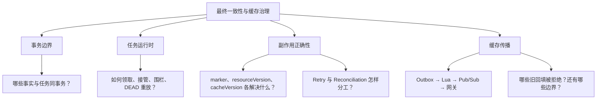

若被问“为什么不用分布式事务”，可以回答当前取舍：本地事务保存事实和恢复意图，避免把外部系统可用性放进主事务原子提交；代价是允许暂时不一致，并承担幂等、租约、观测、人工恢复和对账成本。

<a id="section-104"></a>

## 25. 当前边界与进一步优化方案分开记录

| 当前源码边界 | 可继续优化的方向，尚未实现 |
|---|---|
| 任务 lease 固定 30 秒且不续期 | 对长任务续租，或按 taskType 设置租约并限制外部超时 |
| 退避没有 jitter | 为大面积恢复加入随机抖动，减轻同一时刻重试 |
| DEAD 有统计与 replay，但没有任务列表和完整告警 | 增加分页审计、告警阈值、重放记录与权限治理 |
| payload 没有 schemaVersion | 为在途任务设计载荷版本兼容与迁移 |
| 永久 marker 长期保留 | 结合活动归档制定可证明安全的清理策略 |
| 对账只重算数量，不重建 holder/claim | 定义权威归属账本和在途任务协调规则 |
| 冷 miss 即使版本写被拒绝仍可能 put 本地 | 让写入结果传回外层，拒绝时不返回/不缓存旧快照 |
| null marker 未走版本脚本，POST save 未写失效任务 | 统一新增/更新写路径与负缓存版本协议 |
| Redis Pub/Sub 没有逐 JVM 持久确认 | 按一致性要求增加可观察的消费位点或拉取版本校验 |
| purgeUrl 不枚举多网关，网关不理解版本 | 由网关集群统一 purge，或把版本带入缓存键/响应 |
| 一个 INVALIDATE handler 同时负责 Redis 与网关 | 若需细粒度运维，可拆分可观测子任务或记录阶段结果 |

这些是从当前源码得出的下一步，不是简历中可以直接声称已经完成的能力。

<a id="section-105"></a>

## 26. 源码校验、测试证据与学习自查

<a id="section-106"></a>

### 26.1 本篇检查了哪些实现？

可靠任务部分重新核查了 DDL、Java 映射、六种 taskType、全部 enqueue/enqueueAt、领取 SQL、逐条调度、owner/lease/version 围栏、退避/DEAD/replay、Micrometer、SEND_OK、三个预约 Lua 与对账三阶段。

缓存部分核查了 Venue cacheVersion 事务、失效任务、两个版本 Lua、Redis Pub/Sub listener、多 JVM Caffeine 范围、网关 purge、Canal、独立基线键、RedisData/LocalEntry、冷 miss、逻辑过期和负缓存。

<a id="section-107"></a>

### 26.2 已有测试与本次验证不能混为一谈

2026-09-09 曾在干净 Docker volume 上实际通过 `mvn clean test`、[smoke-test.ps1](../scripts/smoke-test.ps1)、[reliability-test.ps1](../scripts/reliability-test.ps1) 与 [cache-consistency-test.ps1](../scripts/cache-consistency-test.ps1)。

可靠性脚本覆盖：100 个并发用户争抢 10 份库存、连续两次释放补位两人、锁住业务队首时后续候选不跳号、Broker 故障后的 CREATE 恢复、支付/超时竞争只产生一个终态，以及恢复 Lua 首次/重放返回 1/0。

缓存脚本真实启动第二个应用实例，验证两个 JVM 预热后，PUT 更新能让两边最终读到新名称、MySQL 与 Redis 版本水位一致；还直接验证 expectedVersion=4 不能覆盖水位 5。它没有故障注入每个边界，例如网络分区漏收 Pub/Sub、冷 miss 旧本地回填、长期 DEAD 或多网关确认。

<a id="section-108"></a>

### 26.3 文档格式校验

**格式检查**：30 个不同的相对文件目标均按仓库 `docs/` 位置核实存在；完整目录覆盖 109 个章节和小节，目录锚点与代码围栏已检查；13 张 Mermaid 图均通过 Mermaid CLI 11.17.0 语法解析。

<a id="section-109"></a>

### 26.4 能否从头回答这两个问题？

**问题一：A 已取消，Redis 却没改，怎么办？**

应能按顺序说出：MySQL 事实与任务同事务；Scheduler 逐条领取并写 owner/lease/version；失败退避或 DEAD；租约过期接管；围栏阻止旧 worker 回写；Lua marker/resourceVersion 保护重放；对账补充检查，并说明无法自动重建全部归属。

**问题二：Venue 已更新，用户还看到旧值，怎么办？**

应能先定位旧值在哪一层，再解释：更新、cacheVersion 与 INVALIDATE 同事务；失效 Lua 推进版本水位、删两个 Redis 键并 Publish；在线 JVM 清 Caffeine；网关另行 purge；旧 Redis/异步回填受版本限制；最后指出任务执行窗口、Pub/Sub、冷 miss、POST 新增和多网关边界。

至此，四篇完成了“请求事实与初次分配 → 并发事件决定订单终态 → 释放后候补接力 → 持久任务推动外部状态和多级缓存收敛”的学习主线。
