# CityPass 源码学习 04：从 MySQL 提交后 Redis 失败，理解最终一致性与多级缓存治理

> **最终一致性与缓存治理：基于本地可靠任务表实现类 Transactional Outbox 补偿机制，结合 Retry + Reconciliation 处理 MySQL/Redis 跨存储一致性；构建 OpenResty + Caffeine + Redis 多级缓存，并通过 After-Commit Invalidation 保证缓存更新时序。**

本篇接续 [01：异步预约与防超卖](./01-async-reservation-and-oversell-protection.md)、[02：订单状态机与并发控制](./02-订单状态机与并发控制.md)、[03：候补调度与资源交接](./03-候补调度与资源交接.md)。前三篇决定数据库中的业务事实，本篇解释这些事实如何传播到 Redis，以及普通查询缓存怎样失效。

源码基线：上传的 `citypass-platform-source-2b13dee(1).zip`，版本标识 `2b13deec82b09d7c092c323605f947d3d0ad84ca`。本文按实际 Java、SQL、Lua、配置和部署文件写作，注释与执行逻辑冲突时以执行逻辑为准。相对源码链接按文档放在仓库 `docs/` 下设计。

先说明结论的范围：项目实现了明确的重试、部分对账和缓存失效机制，但**不能由此推导出任意故障下都必然自动收敛**。下面会在每条故事线中解释当前条件和缺口，改进设想单独标注。

## 完整目录

<details>
<summary>展开所有章节与小节</summary>

- [0. 两个已经提交成功、却还没有结束的故事](#section-1)
  - [0.1 场景 A：A 的订单已取消，Redis 还认为名额被占用](#section-2)
  - [0.2 场景 B：场馆名称已更新，用户看到的还是旧名称](#section-3)
  - [0.3 先给简历术语做一次源码校准](#section-4)
- [1. MySQL 已经提交成功，但 Redis 更新失败怎么办？](#section-5)
  - [1.1 先理解问题为什么存在](#section-6)
  - [1.2 为什么不能直接把 Redis 放进 @Transactional？](#section-7)
- [2. 先把“还要做什么”与业务事实一起保存](#section-8)
  - [2.1 ReliableTask 解决的第一个问题是意图不丢](#section-9)
  - [2.2 业务事实、副作用意图和投影分别是什么？](#section-10)
  - [2.3 为什么称为“类 Transactional Outbox”？](#section-11)
  - [2.4 为什么任务不能在 COMMIT 后再插入？](#section-12)
- [3. ReliableTask 表中到底保存了什么？](#section-13)
  - [3.1 SQL 表比 Java 对象保存得更多](#section-14)
  - [3.2 INSERT IGNORE 与业务键是什么关系？](#section-15)
  - [3.3 四种真实 task_type 与 payload](#section-16)
- [4. 沿源码走完一次恢复任务的创建](#section-17)
  - [4.1 从取消入口走到本地事务](#section-18)
  - [4.2 补位与发布活动也沿用同一思想](#section-19)
- [5. Scheduler 怎样扫描、执行和重试？](#section-20)
  - [5.1 一次 tick 实际做什么？](#section-21)
  - [5.2 真正的状态机只有 PENDING 与 DONE](#section-22)
  - [5.3 退避到底是多久？](#section-23)
- [6. 多实例与重复执行：任务表为什么还不够？](#section-24)
  - [6.1 当前用的是整批分布式锁，不是任务级 CAS claim](#section-25)
  - [6.2 即使绝不并发，也可能顺序执行两次](#section-26)
- [7. 精读 Redis 副作用：一次脚本维护哪些状态？](#section-27)
  - [7.1 restore-stock.lua：恢复数量并清理旧归属](#section-28)
  - [7.2 transfer-reservation.lua：换 owner，不增减库存](#section-29)
  - [7.3 init-reservation-stock.lua：初始化也有边界](#section-30)
  - [7.4 Lua 的原子执行与持久幂等不是一回事](#section-31)
  - [7.5 ORDER_TIMEOUT 的 DONE 只表示完成发送调用](#section-32)
- [8. 两个必须会推演的任务失败窗口](#section-33)
  - [8.1 Case 1：第一次 Redis 执行失败，恢复后成功](#section-34)
  - [8.2 Case 2：Redis 成功，但标 DONE 前宕机](#section-35)
  - [8.3 当前重试机制还没有哪些能力？](#section-36)
- [9. 如果没有一条明确的失败任务，谁发现不一致？](#section-37)
  - [9.1 Retry 与 Reconciliation 的分工](#section-38)
  - [9.2 当前对账顺序、频率与锁](#section-39)
  - [9.3 第一阶段：补上漏掉的超时关闭](#section-40)
  - [9.4 第二阶段：找缺单候选，但补发不等于补成](#section-41)
  - [9.5 第三阶段：按订单账本重算结束活动库存](#section-42)
  - [9.6 对账不是“任意漂移都会恢复”的证明](#section-43)
- [10. 第一条主线的最终一致性闭环](#section-44)
- [11. 第二条主线：先跟踪一次 Venue 查询](#section-45)
  - [11.1 请求在哪一层进入 Java？](#section-46)
  - [11.2 L1、L2 的编号为什么看起来冲突？](#section-47)
- [12. 从全 miss 到命中：每层回填了什么？](#section-48)
  - [12.1 第一次查询：数据库有该 Venue](#section-49)
  - [12.2 实际 TTL：不要照抄注释的“±20%”](#section-50)
  - [12.3 查不到数据为什么缓存空字符串？](#section-51)
  - [12.4 网关回填还有哪些条件？](#section-52)
- [13. 热点过期时，如何避免所有请求同时查库？](#section-53)
  - [13.1 冷 miss：互斥锁与双重检查](#section-54)
  - [13.2 逻辑过期：旧值先返回，新值异步加载](#section-55)
  - [13.3 逻辑过期、物理过期与随机 TTL 分别做什么？](#section-56)
  - [13.4 CacheClient 哪些能力没有被 Venue 主链直接使用？](#section-57)
- [14. 管理员修改 Venue 后，缓存怎样失效？](#section-58)
  - [14.1 真实写入口是 PUT /venues](#section-59)
  - [14.2 如果先删缓存、再提交，会发生什么？](#section-60)
  - [14.3 evictAfterCommit 的真实实现](#section-61)
  - [14.4 失效顺序与异常行为必须一起看](#section-62)
- [15. After-Commit 为什么仍然不是强一致？](#section-63)
  - [15.1 COMMIT 与回调之间仍有进程故障窗口](#section-64)
  - [15.2 读旧值后延迟回填，也可能跨过提交后删除](#section-65)
  - [15.3 多实例与多网关不是一份本地内存](#section-66)
- [16. Canal + RocketMQ 是怎样补充缓存失效的？](#section-67)
  - [16.1 它来自数据库变更日志，不来自应用回调](#section-68)
  - [16.2 消费者具体识别什么？](#section-69)
  - [16.3 默认是否启用？本地与 Compose 要分开](#section-70)
  - [16.4 Canal 也没有保证每个 JVM 都收到一次驱逐](#section-71)
- [17. 五种缓存故障，逐个推演怎样恢复](#section-72)
  - [17.1 Case 1：更新提交成功，驱逐也正常完成](#section-73)
  - [17.2 Case 2：更新事务回滚](#section-74)
  - [17.3 Case 3：COMMIT 成功，缓存删除前进程宕机](#section-75)
  - [17.4 Case 4：只删 Redis，Caffeine 仍旧](#section-76)
  - [17.5 Case 5：Caffeine 清掉了，Redis delete 失败](#section-77)
  - [17.6 再补一例：网关驱逐失败与应用报错不是同一回事](#section-78)
- [18. 业务 Redis 与普通读缓存，使用两套收敛思路](#section-79)
- [19. 整个第四篇的总架构图](#section-80)
- [20. 源码调用链速查](#section-81)
  - [20.1 可靠任务创建链](#section-82)
  - [20.2 可靠任务执行链](#section-83)
  - [20.3 对账链](#section-84)
  - [20.4 Venue 读取与写入链](#section-85)
  - [20.5 文件导航表](#section-86)
- [21. 九个面试重点：理解后再回答](#section-87)
  - [21.1 为什么不能依赖一个普通 @Transactional 管 MySQL 和 Redis？](#section-88)
  - [21.2 为什么任务必须与业务数据同事务写入？](#section-89)
  - [21.3 为什么叫“类 Outbox”，不能直接包装成完整标准实现？](#section-90)
  - [21.4 Retry 和 Reconciliation 有什么区别？](#section-91)
  - [21.5 Redis 成功，但任务还没标 DONE 就宕机怎么办？](#section-92)
  - [21.6 为什么最终一致性仍然要求幂等？](#section-93)
  - [21.7 为什么缓存失效应当放在 After Commit？](#section-94)
  - [21.8 After-Commit 是否已经保证数据库与缓存强一致？](#section-95)
  - [21.9 多级缓存最大的复杂度是什么？](#section-96)
- [22. 常见错误理解与纠正](#section-97)
- [23. 简历里的每一句，怎样落回源码？](#section-98)
- [24. 三版完整面试回答与追问路线](#section-99)
  - [24.1 30 秒：MySQL 成功、Redis 失败怎么办？](#section-100)
  - [24.2 1～2 分钟：项目最终一致性怎样做？](#section-101)
  - [24.3 2～3 分钟：ReliableTask、多级缓存与一致性治理](#section-102)
  - [24.4 深挖追问树](#section-103)
- [25. 当前边界与进一步优化方案分开记录](#section-104)
- [26. 源码校验、测试证据与学习自查](#section-105)
  - [26.1 本篇检查了哪些实现？](#section-106)
  - [26.2 已有测试与本次验证不能混为一谈](#section-107)
  - [26.3 文档格式校验](#section-108)
  - [26.4 能否从头回答这两个问题？](#section-109)

</details>

<a id="section-1"></a>

## 0. 两个已经提交成功、却还没有结束的故事

<a id="section-2"></a>

### 0.1 场景 A：A 的订单已取消，Redis 还认为名额被占用

沿第三篇的释放流程，假设没有可选候补，本次走公共库存恢复分支。示例订单号为 10001，活动 ID 为 101，用户 A 的 ID 为 11。

| 时刻 | MySQL | Redis |
|---|---|---|
| 取消前 | A 待支付，库存 0 | 库存 0，holder/claim 指向 A 的旧订单 |
| 释放事务提交后 | A 已取消，库存 1，恢复任务 PENDING | 可能仍为旧状态 |
| Redis 故障期间 | 已提交事实保持有效 | 无法完成归属清理与库存回补 |

问题是：**数据库已经 COMMIT，Redis 失败后还能让这笔已提交事务简单 rollback 吗？** 不能。接下来必须有人记得“还有一次 Redis 恢复没有做完”，并能在恢复服务后继续处理。

<a id="section-3"></a>

### 0.2 场景 B：场馆名称已更新，用户看到的还是旧名称

管理员通过项目的 Venue 更新接口，把场馆 1 的名称由“旧名称”改成“新名称”。MySQL 更新成功，但入口 OpenResty、某个 Java 实例的 Caffeine、共享 Redis 中仍可能存在旧值。

用户读取 `GET /venues/1`，只要前面某一层返回旧值，请求甚至不会到数据库。

这里要问：**为什么不能在事务提交前随便删缓存？提交后删除，又是否等于所有用户立刻读到新值？**

这两类 Redis 数据不要混为一谈：前者参与预约占位与资源归属，后者是可重新查询的场馆数据副本。

<a id="section-4"></a>

### 0.3 先给简历术语做一次源码校准

| 术语 | 本项目实际对应 | 使用时的限制 |
|---|---|---|
| 类 Transactional Outbox | 同一本地 MySQL 事务保存业务修改和 `tb_reliable_task` 执行意图 | 任务既执行 Redis 操作，也发送超时消息，不是完整的领域事件发布平台 |
| Retry，重试 | `ReliableTaskScheduler` 再执行到期 PENDING 任务 | 无最大次数；失败不变成 FAILED；依赖基础设施恢复 |
| Reconciliation，对账 | `ReservationReconcileTask` 扫描超时订单、缺单候选、结束活动库存差异 | 扫描和修复范围有限，补单链仍有结束时间校验缺口 |
| After-Commit Invalidation，提交后失效 | `VenueCacheInvalidator` 注册 `afterCommit()` 后调用驱逐 | 保证驱逐安排在提交后，不保证驱逐必达或跨实例强一致 |

<a id="section-5"></a>

## 1. MySQL 已经提交成功，但 Redis 更新失败怎么办？

<a id="section-6"></a>

### 1.1 先理解问题为什么存在

如果采用“数据库提交后立即调用 Redis”的朴素写法，执行顺序可能是：数据库把 A 取消并恢复库存，提交成功；Java 再尝试 Redis 库存加 1，却遇到连接错误。

这时抛出 Java 异常只能说明后续代码没有正常完成，不能撤销此前已经生效的 COMMIT。即使接口返回失败，数据库中的 A 也可能确实已经取消。

因此，接口是否报错、MySQL 是否提交、Redis 是否已同步，是三个需要分别判断的问题。

<a id="section-7"></a>

### 1.2 为什么不能直接把 Redis 放进 @Transactional？

下面只是用来解释边界的伪代码，不是项目的实际释放实现：

```java
@Transactional
public void cancel() {
    updateMySQL();
    updateRedis();
}
```

`@Transactional` 管理的是所选事务管理器负责的资源。当前项目使用本地数据库事务，普通 `StringRedisTemplate` 操作并不会因此变成与 MySQL 原子提交的同一事务；源码没有配置把二者协调成分布式原子提交的机制。Spring Data Redis 默认也不让 RedisTemplate 自动参与受管 Spring 事务，见 [官方事务说明](https://docs.spring.io/spring-data/redis/reference/redis/transactions.html)。

这里尤其不能背成“Redis 抛异常时 MySQL 一定不回滚”：

| 故障时机 | MySQL 可能怎样处理 | 仍然存在的问题 |
|---|---|---|
| MySQL 尚未提交，Redis 抛出满足回滚规则的异常并传播到事务代理 | 本地 MySQL 事务可以回滚 | 这只是异常触发数据库回滚，不是跨资源原子性 |
| Redis 已写成功，后续数据库提交失败 | MySQL 未提交 | 普通 Redis 写入不会跟随数据库自动撤销 |
| MySQL 已提交，之后 Redis 写失败 | MySQL 事实已生效 | 无法回滚已经提交的事务，需要后续恢复 |
| Redis 返回超时，但服务端可能已执行 | 结果不确定 | 贸然重做非幂等加法可能重复生效 |

🔥 **面试重点：能因异常回滚一笔未提交的数据库事务，不等于 MySQL 与 Redis 能一起成功、一起失败。**

<a id="section-8"></a>

## 2. 先把“还要做什么”与业务事实一起保存

<a id="section-9"></a>

### 2.1 ReliableTask 解决的第一个问题是意图不丢

CityPass 没有在释放事务里直接同步执行 Redis 回补。它在同一 MySQL 事务里写订单、库存，以及一条可靠任务。

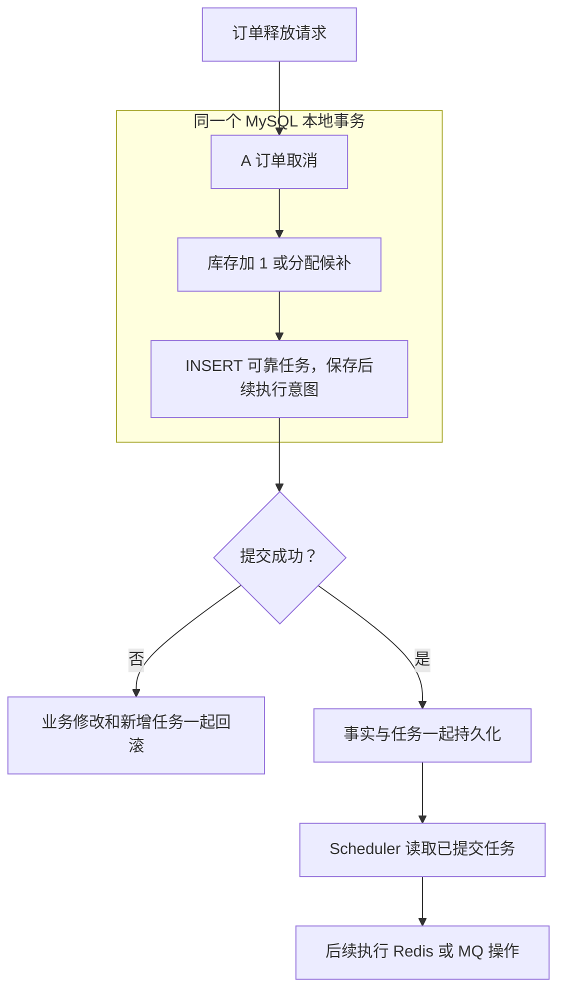

图中的原子边界停在 MySQL。本地提交成功表示任务意图被持久保存，**不表示 Redis 已经改好**。

<a id="section-10"></a>

### 2.2 业务事实、副作用意图和投影分别是什么？

| 概念 | 初学者解释 | 场景 A 中的例子 |
|---|---|---|
| Source of Truth，事实来源 | 判断业务结果时依赖的持久账本 | 订单状态；库存重算还依赖 initial_stock 与有效订单 |
| Side Effect，副作用 | 主业务确定后，对外部系统产生的修改或发送动作 | Redis 回补、归属迁移、发送超时消息 |
| Pending Side Effect Intent，待执行副作用意图 | 把“还要执行什么”写成记录 | RESTORE_REDIS_STOCK 及其订单参数 |
| Projection，投影 | 为访问或竞争控制维护的派生状态 | Redis stock、holder、claim |

“补偿”在这里主要是继续把已确定事实向外同步，而不是把所有数据库业务反向撤销。

<a id="section-11"></a>

### 2.3 为什么称为“类 Transactional Outbox”？

项目借鉴的核心是：**业务事实和后续必须执行的操作意图一起在本地数据库提交，再由后台执行器处理外部动作。**

传统 Outbox 常保存等待发送到消息总线的事件。本项目任务表包含 Redis 初始化、回补、归属迁移，以及发送 MQ 超时消息，形态更接近本地可靠任务表。所以简历写“类 Transactional Outbox / 本地消息表思想”是准确的；不应补写不存在的领域事件版本、CDC 自动发布、全局顺序或 exactly-once 保证。

<a id="section-12"></a>

### 2.4 为什么任务不能在 COMMIT 后再插入？

错误设计中，数据库取消先提交，接着才创建任务。如果两步之间进程宕机，A 已取消，但没有持久记录说明 Redis 还需要恢复。这叫“副作用意图丢失”：重试器连要重试什么都不知道。

同事务可以关闭这个正常创建路径上的间隙：任务 INSERT 异常向外传播时，业务修改也回滚；正常提交时，业务与新任务一起落库。前提是调用经过 Spring 事务代理，业务 Mapper 和 JdbcTemplate 使用当前配置的同一数据源事务。

`enqueue()` 自身没有单独的 `@Transactional`，不影响它加入调用者已有事务；如果未来在无事务方法里调用，就不能自动获得“与业务同事务”的性质。

<a id="section-13"></a>

## 3. ReliableTask 表中到底保存了什么？

<a id="section-14"></a>

### 3.1 SQL 表比 Java 对象保存得更多

见 [ReliableTask.java](../src/main/java/com/citypass/reliable/ReliableTask.java)、[ReliableTaskRepository.java](../src/main/java/com/citypass/reliable/ReliableTaskRepository.java) 与 [citypass.sql](../src/main/resources/db/citypass.sql)。当前没有独立的 ReliableTaskService 或 MyBatis ReliableTaskMapper；Repository 直接使用 JdbcTemplate。

| SQL 字段 | 实际作用 | Java ReliableTask 是否映射 |
|---|---|---|
| `id` | 自增任务 ID，扫描排序和更新依据 | 是 |
| `task_type` | 任务分发类型 | 是，taskType |
| `biz_key` | 业务幂等键，唯一索引限制重复任务记录 | 否 |
| `payload` | 执行参数，varchar(2048) | 是 |
| `status` | 当前读写的是 PENDING、DONE | 否 |
| `retry_count` | 失败时累加的计数，初始 0 | 是，retryCount |
| `next_retry_time` | 允许再次执行的时间 | 否 |
| `last_error` | 最近错误，最多保存 500 字符 | 否 |
| `create_time`、`update_time` | 创建与更新时间 | 否 |

Java 对象只承载当前执行器需要的四个字段，不能因为它没有 status，就说表里没有任务状态。

仅有 `success=0/1` 无法表达做什么、参数是什么、何时再试和最近为什么失败。状态本身可以简单，但任务恢复需要这些额外上下文。

<a id="section-15"></a>

### 3.2 INSERT IGNORE 与业务键是什么关系？

关键 SQL：

```sql
INSERT IGNORE INTO tb_reliable_task
    (task_type, biz_key, payload, status, retry_count, next_retry_time)
VALUES (?, ?, ?, 'PENDING', 0, NOW())
```

唯一索引是 `uk_reliable_task_biz_key(biz_key)`，不是 `(task_type, biz_key)` 联合键。调用方用不同前缀区分任务类型。扫描索引是 `(status, next_retry_time)`。

同一业务键重复入队时，INSERT IGNORE 不再创建第二条记录；它也不会把原 DONE 任务重新改成 PENDING，不会更新旧 payload。当前方法没有检查影响行数，也没有核验重复键对应的载荷是否相同。

💡 **任务表去重解决“重复留几张工作单”，Lua 幂等解决“同一工作单重复执行会怎样”，这不是同一件事。**

<a id="section-16"></a>

### 3.3 四种真实 task_type 与 payload

| task_type | 创建处与 biz_key | payload | 执行内容 |
|---|---|---|---|
| `ORDER_TIMEOUT` | createOrder 或补位，`order-timeout:{订单号}` | 订单号字符串 | 发送 MQ TIMEOUT 延迟消息 |
| `RESTORE_REDIS_STOCK` | releaseOrPromote 恢复分支，`restore-redis-stock:{旧订单号}` | 旧 ReservationOrder 的 JSON | 执行 restore-stock.lua |
| `TRANSFER_RESERVATION_CLAIM` | releaseOrPromote 补位分支，`transfer-reservation:{旧订单号}` | 活动、旧用户/订单、新用户/订单五个字段 | 执行 transfer-reservation.lua |
| `INIT_RESERVATION_STOCK` | addLimitedPassStock，`init-reservation-stock:{活动号}` | LimitedPassStock JSON，含 initialStock | 执行 init-reservation-stock.lua |

花括号表示参数占位，不是键中额外的字面字符。任务恢复分支不会把旧订单 JSON 内的 status 当作当前权威状态；其中主要取订单、活动和用户 ID。

<a id="section-17"></a>

## 4. 沿源码走完一次恢复任务的创建

<a id="section-18"></a>

### 4.1 从取消入口走到本地事务

[ReservationServiceImpl.cancelOrder](../src/main/java/com/citypass/service/impl/ReservationServiceImpl.java) 调用独立 Bean 的 [ReservationTransactionalService.releaseOrPromote](../src/main/java/com/citypass/service/impl/ReservationTransactionalService.java)。后者标注 `@Transactional(rollbackFor = Exception.class)`。

我们沿“本次不补位、恢复公共库存”的实际分支观察：

| 顺序 | 方法内发生的事 | 尚未提交时的数据变化 |
|---|---|---|
| 1 | 查旧订单、校验用户，条件取消待支付订单 | A 订单变为 status=4 |
| 2 | 若旧订单来自候补，推进对应候补终态 | 对应 OFFERED 退出 |
| 3 | 活动不允许补位或未选到候选 | 进入库存恢复分支 |
| 4 | 按活动 ID 更新 `stock = stock + 1`，要求影响 1 行 | DB stock 从 0 变 1 |
| 5 | enqueue RESTORE_REDIS_STOCK | INSERT 新 PENDING 任务 |
| 6 | 返回 RELEASED，事务代理完成提交 | 业务与任务一起生效 |

核心片段：

```java
reliableTaskRepository.enqueue(
        ReliableTaskRepository.RESTORE_REDIS_STOCK,
        "restore-redis-stock:" + orderId,
        JSONUtil.toJsonStr(oldOrder));
return new ReleaseResult(ReleaseAction.RELEASED, oldOrder, null);
```

这里没有调用 Redis 恢复脚本。Redis 副作用由后续执行器完成。服务提交后更新请求结果缓存，即使这一步失败，也不能说事务中的可靠任务随之消失。

<a id="section-19"></a>

### 4.2 补位与发布活动也沿用同一思想

第三篇的成功补位分支在同一事务中创建候补订单，并写两条任务：新订单的 ORDER_TIMEOUT、旧归属到新归属的 TRANSFER_RESERVATION_CLAIM。该分支不增加公共库存。

[ActivityPassServiceImpl.addLimitedPassStock](../src/main/java/com/citypass/service/impl/ActivityPassServiceImpl.java) 在 `@Transactional` 中保存活动通行证、初始库存记录，再写 INIT_RESERVATION_STOCK。它把 initialStock 保存下来，既用于初始化任务，也为后面的库存重算提供基准。

普通预约创建的 `createOrder` 同样在建单事务内调用 `enqueueTimeout`。这些才是本项目“业务与任务同事务”的具体依据，不是仅凭表名带 reliable 就成立。

<a id="section-20"></a>

## 5. Scheduler 怎样扫描、执行和重试？

<a id="section-21"></a>

### 5.1 一次 tick 实际做什么？

[ReliableTaskScheduler.relay](../src/main/java/com/citypass/task/ReliableTaskScheduler.java) 默认开启，以 `fixedDelay=1000ms` 调度。fixedDelay 是上一次执行结束后再等待相应时间，不是保证每个整秒开始一次。

它先尝试获得 Redisson 锁 `lock:reliable-task:relay`。拿不到直接返回；拿到后执行：

```sql
SELECT id, task_type, payload, retry_count
FROM tb_reliable_task
WHERE status = 'PENDING' AND next_retry_time <= NOW()
ORDER BY id
LIMIT ?
```

调用 `findReady(100)`，每批最多 100 条，在一个 for 循环中逐条执行。没有把任务逐条更新为 RUNNING，也没有 `SELECT ... FOR UPDATE` 领取或任务 lease 字段。

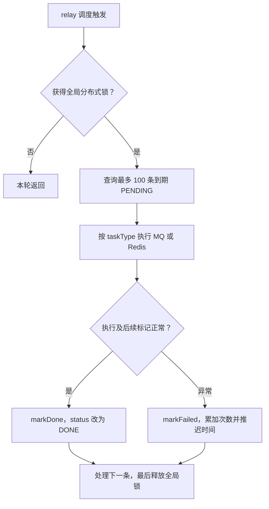

如果 markFailed 本身也因数据库异常失败，异常会传播到 relay 外层，本批后续任务可能暂时不执行；下一次扫描再尝试。Redis 锁服务故障还可能使本轮连数据库扫描都无法开始。

<a id="section-22"></a>

### 5.2 真正的状态机只有 PENDING 与 DONE

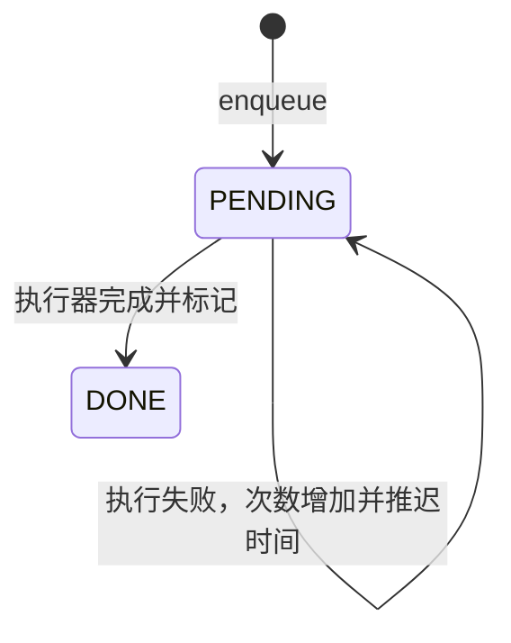

`markFailed` 名字中虽然有 Failed，但 SQL **没有设置 status='FAILED'**。当前没有 RUNNING、DEAD、最大次数后的终态，也没有死信任务转移逻辑。

成功更新只按 id 设置 DONE；失败更新只按 id 增加计数、更新时间、错误，二者都没有 status/owner/version 条件。markDone 也不清空历史 retry_count 或 last_error，所以 DONE 记录中保留旧错误并不表示当前仍失败。

<a id="section-23"></a>

### 5.3 退避到底是多久？

真实代码：

```java
int delaySeconds = Math.min(300, 1 << Math.min(retryCount, 8));
LocalDateTime next = LocalDateTime.now().plusSeconds(delaySeconds);
```

执行器传入扫描时读到的旧 retryCount，数据库随后执行 `retry_count = retry_count + 1`。

| 此前 retry_count | 本次失败后的计数 | 下一次允许尝试前的延迟 |
|---|---|---|
| 0 | 1 | 1 秒 |
| 1 | 2 | 2 秒 |
| 2 | 3 | 4 秒 |
| 3 | 4 | 8 秒 |
| 7 | 8 | 128 秒 |
| 8 及以上 | 继续累加 | 256 秒 |

⚠️ 外层虽然写了 300，内层左移最多得到 256，因此**实际延迟上限是 256 秒，不是 300 秒**。没有随机抖动，没有最大重试次数。

这是“最早可以再执行的时间”，不是承诺届时必然执行；扫描间隔、其他任务、锁竞争和基础设施状态都会影响实际时间。

<a id="section-24"></a>

## 6. 多实例与重复执行：任务表为什么还不够？

<a id="section-25"></a>

### 6.1 当前用的是整批分布式锁，不是任务级 CAS claim

实例 A 和 B 都运行 relay 时，通过同一个 Redisson 锁协调批处理。正常锁有效期间，A 持锁扫描执行，B 的 tryLock 返回 false，就不会同时处理同一批任务。

这减少了并发执行，却也让批次串行，吞吐依赖单次执行耗时。代码没有显式传入固定 leaseTime，也没有任务级 owner、leaseUntil 或 fencing token，不能套用另一类可靠运行时的租约设计来讲解它。

如果锁失效、连接故障或进程停顿等使旧执行者与新执行者重叠，数据库 markDone/markFailed 没有版本条件阻止旧执行者写状态。这个边界不能靠“用了分布式锁”一笔带过。

<a id="section-26"></a>

### 6.2 即使绝不并发，也可能顺序执行两次

最经典的窗口是：Redis 已执行成功，Java 还没来得及标记 DONE 就宕机。数据库仍然是 PENDING；重启后任务再次被选中。

所以可靠任务提供的是持久记录和再次尝试的能力，整体具有“至少一次尝试”的设计倾向，不是每个副作用恰好执行一次。永久故障、错误判断成功、人工删除任务等情况还会限制交付保证。

| 机制 | 解决的问题 | 不能单独解决什么 |
|---|---|---|
| biz_key 唯一约束 | 同一业务意图不重复建任务行 | 同一行不重复执行 |
| relay 全局锁 | 正常情况下避免多实例同时跑批 | 成功后宕机引起的重放 |
| status=DONE | 正常完成后不再被 PENDING 扫描选中 | 副作用成功、标记未完成的窗口 |
| Redis 幂等标记 | 有效期内抑制同一副作用的重复执行 | 标记丢失、过期、跨任务乱序 |

🔥 **可靠性要求还能重试，正确性要求重复尝试不会多加一份库存。**

<a id="section-27"></a>

## 7. 精读 Redis 副作用：一次脚本维护哪些状态？

<a id="section-28"></a>

### 7.1 restore-stock.lua：恢复数量并清理旧归属

[restore-stock.lua](../src/main/resources/restore-stock.lua) 接收库存键与幂等标记键，标记为 `reservation:restore:{orderId}`，TTL 由 Java 传入 7 天。

关键行为：

```lua
if redis.call('exists', KEYS[2]) == 1 then
    return 0
end
if redis.call('exists', KEYS[1]) == 0 then
    return -1
end
-- 仅当 claim 仍匹配旧订单时，删除该用户的 holder 和 claim
redis.call('incrby', KEYS[1], 1)
redis.call('set', KEYS[2], '1', 'EX', ARGV[1])
return 1
```

| 场景 | 修改与返回 | 执行器怎样处理 |
|---|---|---|
| 首次正常执行，旧 claim 匹配 | 删除旧 holder/claim，stock 加 1，写标记，返回 1 | 标 DONE |
| 同一订单重复执行，标记存在 | 不再加库存，返回 0 | 同样可标 DONE |
| 库存键不存在且无标记 | 返回 -1，不执行回补 | 抛异常并记录重试 |
| 旧 claim 已不存在或不匹配 | 不删旧归属；仍执行库存加 1 并写标记 | 正常返回 1 |

最后一行尤其重要：**claim 比对保护的是不要误删后来归属，不是库存加法的幂等开关。库存去重主要依赖恢复标记。**

如果标记存在但库存键后来丢失，脚本会先返回 0，执行器仍可标 DONE；它不是“每次顺便验证库存已完整恢复”的对账脚本。

<a id="section-29"></a>

### 7.2 transfer-reservation.lua：换 owner，不增减库存

[transfer-reservation.lua](../src/main/resources/transfer-reservation.lua) 使用 `reservation:transfer:{oldOrderId}` 标记，TTL 同样为 7 天。

首次执行：检查标记；旧 claim 匹配才删除旧用户归属；把新用户加入 holder，并无条件 SET 新 claim；最后写标记并返回 1。已有标记返回 0。脚本没有库存加减命令，Java 只把返回 null 视为异常返回，Redis 执行抛错也进入失败处理。

当前代码没有校验新 claim 对应订单是否仍有效，也没有对连续 A→B、B→C 交接附加版本判断。某个旧任务退避时，新任务已经到期可以先执行；迟到的 A→B 可能重新写入 B 的归属。这是源码可推导的顺序风险，不是本次已复现的故障。

因此“同一任务重复安全”不能扩展成“所有交接任意乱序都安全”。

<a id="section-30"></a>

### 7.3 init-reservation-stock.lua：初始化也有边界

[init-reservation-stock.lua](../src/main/resources/init-reservation-stock.lua) 先检查永久标记 `reservation:stock:init:{passId}`。标记存在返回 0；不存在则 SET 初始库存，再 SET 标记，返回 1。

它正常情况下避免初始化任务重放覆盖已经扣减的库存。但库存单独丢失、初始化标记还在时，重放不会重建库存；标记单独丢失时，重放又可能用初始量覆盖现状。初始化任务不是任意时刻的库存恢复器。

<a id="section-31"></a>

### 7.4 Lua 的原子执行与持久幂等不是一回事

Lua 在 Redis 内执行期间避免其他命令穿插这些步骤，但运行错误不提供数据库式自动回滚。还要考虑标记过期、Redis 数据丢失和脚本执行结果未知。

例如 stock 加 1 成功而后续写标记失败，再次执行就存在重复加法风险。正常有效键类型和服务健康是成功路径的前提，不能把脚本注释中的“安全重试”理解为无条件证明。参见 [Redis 脚本语义](https://redis.io/docs/latest/develop/programmability/eval-intro/) 和 [Redis 回滚说明](https://redis.io/blog/you-dont-need-transaction-rollbacks-in-redis/)。

<a id="section-32"></a>

### 7.5 ORDER_TIMEOUT 的 DONE 只表示完成发送调用

[RocketMQProducer.sendOrderTimeout](../src/main/java/com/citypass/mq/RocketMQProducer.java) 创建延迟消息并调用 `producer.send(message)`。执行器随后标 DONE；它没有等消费者真的关闭订单。

此方法也没有检查返回 SendResult 的 SendStatus，与预约 CREATE 入口显式检查 SEND_OK 不同。发送调用未抛错，不应被扩展解释为“订单最终一定已超时关闭”。对账的超时扫描正是另一个兜底入口。

当本地配置关闭 RocketMQ 时，[DisabledOrderMessagePublisher](../src/main/java/com/citypass/mq/DisabledOrderMessagePublisher.java) 会抛出明确异常。已有 ORDER_TIMEOUT 任务不会凭空成功，只会在调度开启时继续失败尝试。

<a id="section-33"></a>

## 8. 两个必须会推演的任务失败窗口

<a id="section-34"></a>

### 8.1 Case 1：第一次 Redis 执行失败，恢复后成功

以下以任务已经被执行器选中、执行 Lua 时失败为例。若 Redis 连分布式锁都不可用，本轮可能尚未选到任务，retry_count 也不会因此自动增长。

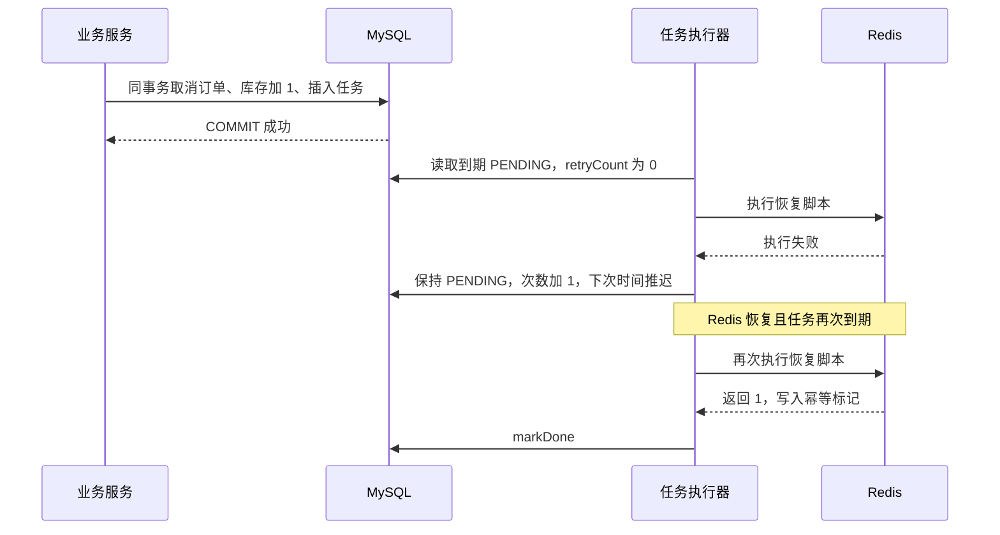

在依赖恢复、参数正确、脚本正常执行且无冲突写入等条件下，最终 DB stock=1、Redis stock=1，任务 DONE。延迟期间 A 的数据库取消不会被撤销。

<a id="section-35"></a>

### 8.2 Case 2：Redis 成功，但标 DONE 前宕机

| 时刻 | Redis | 任务表 |
|---|---|---|
| T0 | stock=0，没有恢复标记 | PENDING |
| T1 | Lua 正常完成，stock=1，恢复标记存在 | 仍为 PENDING |
| T2 | Java 进程宕机 | 没来得及 DONE |
| T3 | 重启后重新执行同一任务 | 仍可被选中 |
| T4 | Lua 发现标记，返回 0，不再加 1 | 执行器标 DONE |

这是幂等标记的直接价值。其安全结论要求标记仍保留、Redis 没丢失相关事实；若宕机超过标记有效期或发生部分数据丢失，不能照搬该推演。

<a id="section-36"></a>

### 8.3 当前重试机制还没有哪些能力？

📌 **当前实现边界：** 没有最大重试后的人工隔离状态、任务级领取租约、执行版本、跨任务顺序保证、通用 payload 版本迁移或自动修复所有坏参数。源码有错误日志和 last_error，但不能把它们写成已经接入完整告警平台。

进一步优化可以考虑失败分级、可观察的积压告警、人工重放入口、任务版本或业务顺序约束。它们是后续工作，不是本篇源码已经完成的能力。

<a id="section-37"></a>

## 9. 如果没有一条明确的失败任务，谁发现不一致？

<a id="section-38"></a>

### 9.1 Retry 与 Reconciliation 的分工

任务表很适合回答“这次恢复还没完成”；但历史 bug、人工修改、Redis 数据丢失等异常，不一定留下对应的 PENDING。

对账不从某张失败任务单出发，而是重新查看业务事实和派生状态，主动寻找差异。

| 机制 | 出发点 | 本项目数据来源 | 主要动作 |
|---|---|---|---|
| Retry | 已知有待执行任务 | tb_reliable_task | 重新执行 MQ/Redis 操作 |
| Reconciliation | 未必已经登记异常 | 订单、初始库存、Redis holder/claim/stock | 扫描过期订单、寻找缺单候选、重算结束活动库存 |

🔥 **Retry 解决“我知道这件事没做完”，Reconciliation 解决“我可能还不知道哪里发生了漂移”。** 但对账只能发现它实际检查的范围，不能替所有未扫描数据兜底。

<a id="section-39"></a>

### 9.2 当前对账顺序、频率与锁

[ReservationReconcileTask.reconcile](../src/main/java/com/citypass/task/ReservationReconcileTask.java) 默认开启，fixedDelay 为 60 秒，锁为 `lock:reservation:reconcile`。

拿到锁后按顺序调用：`closeTimeoutOrders()`、`supplementMissingOrders()`、`reconcileFinishedStocks()`。它与 relay 使用不同锁；对账、可靠任务、普通预约之间没有一个统一总锁。

外层只有一组 try/catch。前面某阶段抛出的未捕获异常可能使后续阶段本轮不执行，所以不能说“每分钟三项必定全部做完”。

<a id="section-40"></a>

### 9.3 第一阶段：补上漏掉的超时关闭

`closeTimeoutOrders()` 查询 status=1 且 offerExpireTime≤当前应用时间的订单，然后逐笔调用 `cancelTimeoutOrder`。

它不直接强行把库存加 1，而是复用前三篇的条件释放流程：仍待支付的订单才能成功关闭，再补位或恢复库存并写任务。已被支付或关闭的订单会跳过。

这能在超时消息未正常生效时主动找到过期订单。但扫描条数不是实际关闭条数；候补异常导致释放事务失败时，也不能把“扫描到了”当作“修复完成了”。

<a id="section-41"></a>

### 9.4 第二阶段：找缺单候选，但补发不等于补成

`supplementMissingOrders()` 只选择 **endTime<now 的已结束活动**。它读取 Redis holders，再查询该活动订单中的 userId 集合，计算差集。

这里有四个真实细节：

1. 订单查询没有按有效状态过滤，任何状态的历史订单都会把该用户视为“已经存在订单”。
2. 差异按用户计算，不是逐个 requestId/orderId 比较，无法精确区分同一用户的不同请求历史。
3. 优先复用 Redis claim 中的订单号；claim 不存在才 `redisIdWorker.nextId("order")`。注释“重新发号”不是每次都成立。
4. 它直接补发 CREATE，不是先创建 ReliableTask。发送抛异常时记录日志，下一轮再尝试。

**重新核查后的关键缺口仍然存在：** 被补单器选择的活动已经结束；CREATE 消费者进入 `createOrderFromMQ` 后，先执行 `validateActivityWindow`，结束就写 FAIL_ENDED 并返回。因此正常时间关系下，这条补发路径会被结束校验挡住，不能证明订单最终补齐。

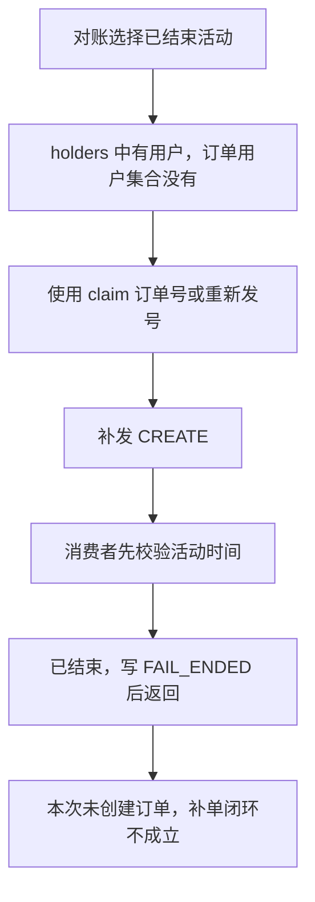

此外，当前异步预约是在消费者里做 Redis claim。**入口 CREATE 尚未被消费者执行就丢失时，Redis 本来没有 holder，差集扫描也发现不了该请求。** 它能看见的是“已有 Redis 占位证据但缺少相应订单”的一部分异常，不是所有 CREATE 丢失。

📌 进一步优化需要明确已发生预约意图的持久证据与恢复规则，再设计独立恢复入口；不能简单关掉活动结束校验，否则正常的新请求也可能被错误放行。

<a id="section-42"></a>

### 9.5 第三阶段：按订单账本重算结束活动库存

`reconcileFinishedStocks()` 只处理结束超过 2 分钟的活动。实际有效订单状态是 **1、2、3、5**，不是注释简写的“未支付+已支付”。

```text
expected = max(0, initial_stock - 有效订单数量)
```

当 initialStock 为 null 或≤0 时跳过，避免缺少基准时盲目覆盖。DB stock 与 Redis stock 都等于 expected 则不写；否则实际顺序是：**先 SET Redis stock，再更新 MySQL stock**。

这两次写不在一个跨资源事务内。第一次写成功、第二次失败时仍可能暂时不一致，后续符合条件的扫描有机会再次覆盖修正。

它会恢复数量，但不会重建整套 holders/claim，不会把所有 WAITING 清成终态，也不把业务任务自动标 DONE。没有活跃期间全量库存重算，更没有全量 Venue 缓存对账。

<a id="section-43"></a>

### 9.6 对账不是“任意漂移都会恢复”的证明

| 异常 | 当前可做的事 | 剩余限制 |
|---|---|---|
| 待支付订单过期，但延迟消息未生效 | 扫描后重走条件释放 | 释放自身异常仍可阻断 |
| Redis holder 存在但没有该用户订单 | 发现差集并补发 CREATE | 已结束校验会挡住补单；按用户比对不够精细 |
| 入口 CREATE 未消费且没有 holder | 没有该差集证据 | 当前此扫描无法发现 |
| 已结束超过 2 分钟的库存数字不一致 | 按 initialStock 与有效订单重写 | 依赖基准有效；不是原子双写 |
| holders/claim 错乱，但库存数字正确 | 没有完整归属重建 | 数量相同不代表 owner 正确 |
| 活动仍进行中，初始化 marker 在但 stock 丢失 | restore 可能反复失败，init 可能直接跳过 | 结束后的库存重算才可能覆盖相应数字 |

还有一种交错：对账先 SET 为正确 expected，迟到的库存恢复任务再加 1，数字可再次偏大；后续对账可能再修正，但不同锁不保证二者不会相互覆盖。本文将它作为源码推导的边界，未宣称进行过实际故障注入。

<a id="section-44"></a>

## 10. 第一条主线的最终一致性闭环

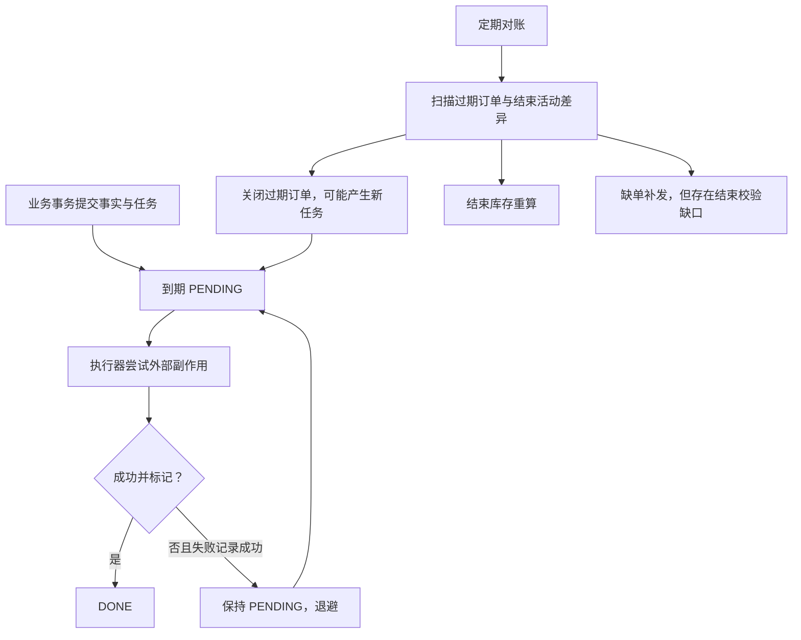

准确的总结是：本地事务保留已覆盖路径的事实和意图；重试持续尝试已知任务；对账主动发现并修复部分遗漏与数字漂移。是否收敛，还取决于基础设施恢复、幂等条件、正确恢复规则和没有持续冲突写入。

**最终一致性不是“允许数据一直错”，而是允许暂时不一致，并为可恢复异常设计明确收敛路径。当前源码没有给任意故障下的收敛时间上限。**

<a id="section-45"></a>

## 11. 第二条主线：先跟踪一次 Venue 查询

<a id="section-46"></a>

### 11.1 请求在哪一层进入 Java？

经仓库 OpenResty 部署访问 `GET /venues/1` 时，入口先检查网关共享字典。如果未命中，才进入 [VenueController.queryVenueById](../src/main/java/com/citypass/controller/VenueController.java)，再调用 [VenueServiceImpl.queryById](../src/main/java/com/citypass/service/impl/VenueServiceImpl.java)。

Service 调用 [MultiLevelCacheService.queryWithMultiLevel](../src/main/java/com/citypass/utils/MultiLevelCacheService.java)，提供 `cache:venue:`、场馆 ID、类型 Venue、回源函数 `this::getById`、30 分钟基准 TTL。

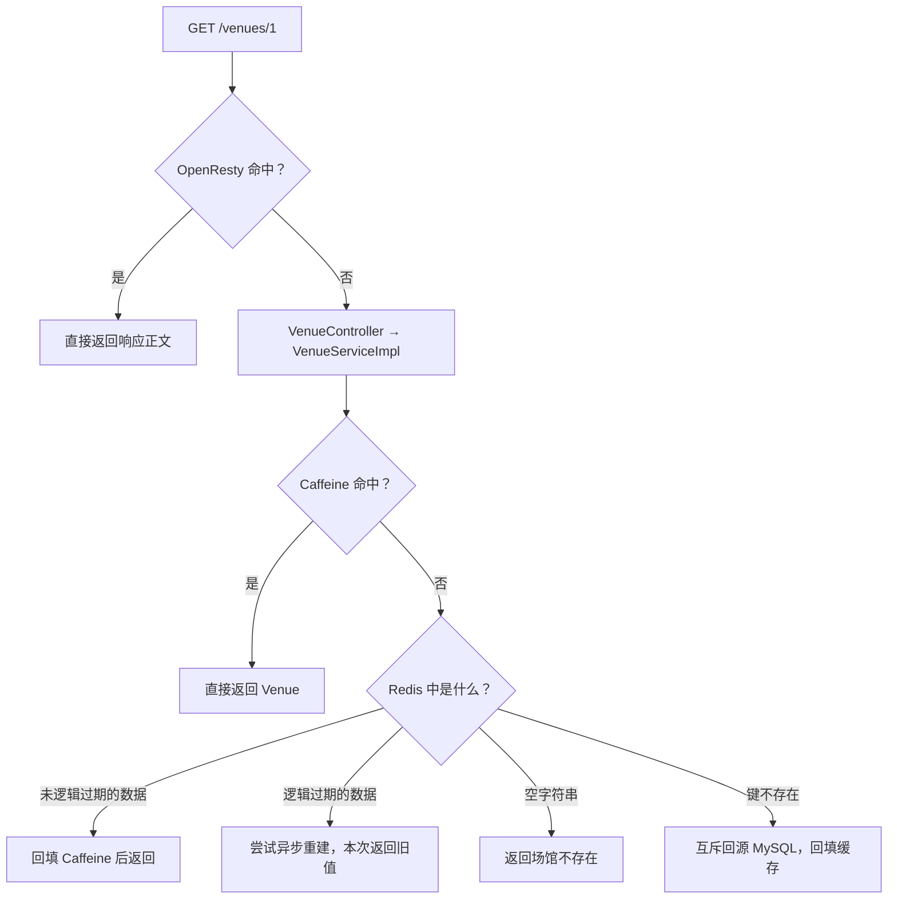

直接访问 Java 的 8081 端口时，链路从 Controller 开始，绕过网关。OpenResty 不是 Java Service 内部再调用的一层，也不是数据库之后的缓存。

<a id="section-47"></a>

### 11.2 L1、L2 的编号为什么看起来冲突？

网关配置自称 OpenResty L1；Java 注释和日志把 Caffeine 称为 L1、Redis 称为 L2、MySQL 称为第三层回源。它们是不同观察范围的编号。

本文优先使用名字，完整外部读路径是：**OpenResty → Java 中的 Caffeine → Redis → MySQL**。其中 MySQL 是回源数据库，不把它包装成第四份缓存。

| 位置 | 缓存什么 | 存在的直接价值 | 作用范围 |
|---|---|---|---|
| OpenResty | `/venues/{id}` 对应的 HTTP 响应正文 | 命中时不进入 Java | 当前网关实例的共享字典，worker 间共享 |
| Caffeine | Venue 对象 | 命中时不访问 Redis | 当前 JVM |
| Redis | 含 data 和 expireTime 的 JSON 包装 | 多应用实例共享，减少查库 | 连接的 Redis 数据空间 |
| MySQL | 场馆持久记录 | 缓存 miss 或重建时提供业务数据 | 数据库 |

无需背“必然纳秒、毫秒”的性能数字；没有本次实测就不把缓存层级等同于固定耗时。

<a id="section-48"></a>

## 12. 从全 miss 到命中：每层回填了什么？

<a id="section-49"></a>

### 12.1 第一次查询：数据库有该 Venue

OpenResty 没有响应，Caffeine 没有对象，Redis 键也不存在。Java 获取场馆互斥锁，再检查一次 Redis；仍不存在才 `getById`。

查询有结果后，先写 Redis 的 `RedisData(data, expireTime)`，再由外层把 Venue 放入本地缓存，返回 `Result.ok`。响应经过 OpenResty 的 body filter 时，被缓存为完整响应正文。

下一次外部请求若命中网关，会直接返回；绕过网关的请求若命中 Caffeine，也不再访问 Redis。

<a id="section-50"></a>

### 12.2 实际 TTL：不要照抄注释的“±20%”

| 位置 | 实际过期策略 |
|---|---|
| OpenResty | 600 + math.random(-60,60) 秒，即 540～660 秒 |
| Caffeine | expireAfterWrite 10 分钟，maximumSize 10000 |
| Redis 正常数据逻辑过期 | baseSec + floor(baseSec×0.2×随机数)，随机增量为正 |
| Redis 正常数据物理过期 | max(逻辑 TTL×2, 逻辑 TTL+3600) 秒 |
| Redis 冷 miss 查不到数据 | 空字符串，2、3 或 4 分钟随机 TTL |
| Redis 异步重建查不到数据 | 空字符串，固定 2 分钟，同时清本地缓存 |

当前基准 baseSec=1800，逻辑期限为 1800～2159 秒，约 30～36 分钟；对应物理期限为 5400～5759 秒，约 90～96 分钟。注释说“±20%”，代码只有增加，没有减少。

Caffeine 的 10 分钟从该对象写入本地缓存时计算，不是直接继承 Redis expireTime。因此本地对象可能在 Redis 逻辑期限到来后继续命中一段时间。

<a id="section-51"></a>

### 12.3 查不到数据为什么缓存空字符串？

不存在的场馆如果每次都查库，大量无效 ID 会持续访问 MySQL。Redis 用 `""` 表示已查证不存在；`json == null` 才表示缓存键缺失。

Caffeine 没有缓存 null。Java 返回业务失败的 Result 通常仍是 HTTP 200，而 OpenResty 只检查 HTTP 状态、正文存在和大小，不解析 `success`。因此网关也可能缓存“场馆不存在”的业务失败正文达 540～660 秒，不能说网关只缓存业务成功数据。

<a id="section-52"></a>

### 12.4 网关回填还有哪些条件？

见 [nginx.conf](../src/main/resources/openresty/nginx.conf)：场馆路径以 URI 为键；HTTP 200 时累计响应片段，结束且正文≤1 MiB 才写共享字典。命中时设置 `X-Cache-Hit: OpenResty-L1`。

它不检查响应内的业务版本或 Redis 逻辑期限。如果 Java 返回逻辑过期旧 Venue，网关仍可能把该响应作为新缓存保存。这意味着 Java 的“本次允许读旧”可能被网关继续放大，不能把上层 TTL 简单当成所有数据的更新时间。

<a id="section-53"></a>

## 13. 热点过期时，如何避免所有请求同时查库？

<a id="section-54"></a>

### 13.1 冷 miss：互斥锁与双重检查

`queryWithMutexLock` 使用 `lock:venue:{id}`，SETNX 写 UUID token，10 秒过期。获取成功后再次读 Redis，避免前一请求已经完成重建而自己仍重复查库。

未拿到锁时，每次等待 25～50ms 并检查缓存，最多尝试 20 次。耗尽或线程中断后降级直接查库；因此它减少并发回源，但不是“永远只有一个数据库查询”。

锁由 [unlock.lua](../src/main/resources/unlock.lua) 比较 token 后删除，避免旧请求直接释放新持有者的锁。锁固定 10 秒且没有这段自定义锁的续期逻辑；回源超过锁期时仍可能出现并发重建。token 保护解锁，不自动阻止过期持有者继续写缓存。

<a id="section-55"></a>

### 13.2 逻辑过期：旧值先返回，新值异步加载

Redis 键还在，但包装里的 expireTime 已到，主分支调用 `rebuildAsync`。拿到同一场馆锁才提交到 10 线程重建池；其他请求不等待重建，当前仍返回旧 Venue。

后台查到新值时写 Redis 并更新本实例 Caffeine；查不到时写 2 分钟空值并驱逐本地对象。主逻辑过期分支明确不把旧值重新放回 Caffeine。

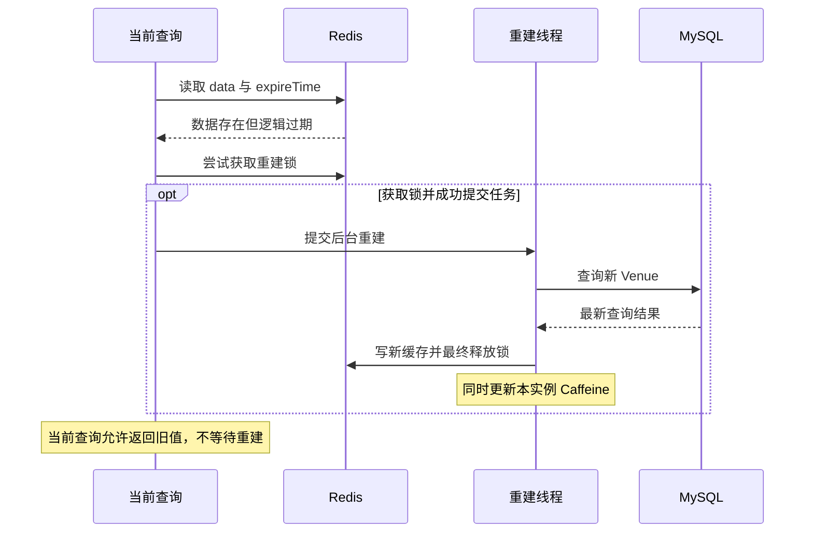

<a id="section-56"></a>

### 13.3 逻辑过期、物理过期与随机 TTL 分别做什么？

逻辑期限决定何时开始刷新，可在有旧值时平滑回源；物理期限让键最终从 Redis 过期，提供异常情况下重新走 miss 的机会；随机 TTL 分散不同键集中到期的时刻。

它们不是永久服务新鲜数据的证明。Redis 访问抛异常没有统一 catch 后自动直查数据库的降级链；异步重建失败也不会创建 ReliableTask。冷 miss 内二次读取缓存的分支没有再次检查逻辑期限，因此“绝不把任何过期值放入 Caffeine”只能用于明确的主逻辑过期分支，不能无限扩大。

<a id="section-57"></a>

### 13.4 CacheClient 哪些能力没有被 Venue 主链直接使用？

[CacheClient](../src/main/java/com/citypass/utils/CacheClient.java) 保留 `queryWithPassThrough`、`queryWithMutex`、`queryWithLogicalExpire` 等工具方法。核心 Venue 查询使用的是 MultiLevelCacheService 自己的互斥与逻辑过期实现。

`/venues/benchmark/redis/{id}` 才调用 CacheClient 的穿透查询作为对照路径。还要注意：该基线使用相同 `cache:venue:` 前缀，但写普通 Venue JSON；主链期待 RedisData 包装。两种路径混用同一个键空间存在数据格式冲突，不能不清理或隔离数据就把它们当作完全独立的压测对照。

这一点属于源码推导的边界，不是本次执行了压测得到的结论。

<a id="section-58"></a>

## 14. 管理员修改 Venue 后，缓存怎样失效？

<a id="section-59"></a>

### 14.1 真实写入口是 PUT /venues

`VenueController.updateVenue` 调用 `VenueServiceImpl.update(Venue)`，后者有 `@Transactional`。它先检查 id，执行 updateById；更新失败直接返回失败，不注册失效回调。成功后调用 `venueCacheInvalidator.evictAfterCommit(id)`。

源码中 `evictAfterCommit` 的调用发生在事务方法返回前，但**此时只是注册回调**；真正执行 `evict` 发生在提交成功之后。不要把“注册回调的时刻”和“删除缓存的时刻”写反。

<a id="section-60"></a>

### 14.2 如果先删缓存、再提交，会发生什么？

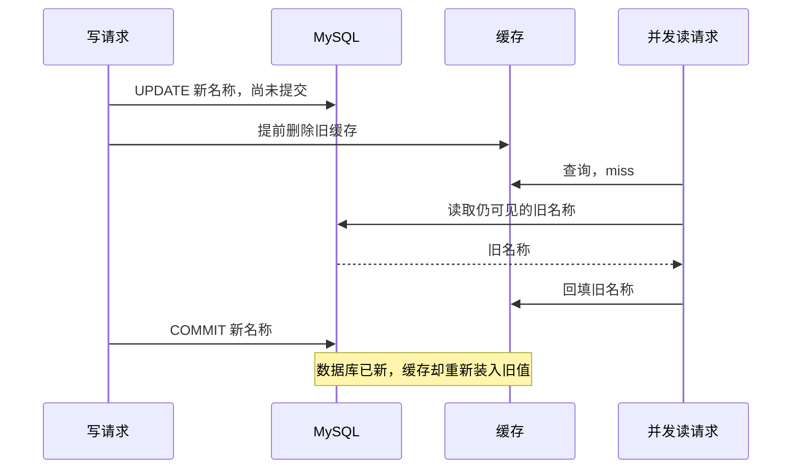

过早删除给并发查询创造了“查旧库、填旧缓存”的窗口，旧值可能继续存活一个 TTL。绑定提交后删除，能避免这个由提前失效直接制造的窗口。

<a id="section-61"></a>

### 14.3 evictAfterCommit 的真实实现

[VenueCacheInvalidator](../src/main/java/com/citypass/utils/VenueCacheInvalidator.java) 的关键代码：

```java
if (TransactionSynchronizationManager.isActualTransactionActive()) {
    TransactionSynchronizationManager.registerSynchronization(new TransactionSynchronization() {
        @Override
        public void afterCommit() {
            evict(venueId);
        }
    });
    return;
}
evict(venueId);
```

有实际事务就注册 afterCommit；无事务时直接 evict。数据库回滚不会调用该 afterCommit。这里没有创建后台线程：回调本身同步执行驱逐，通常仍处于提交调用链中。

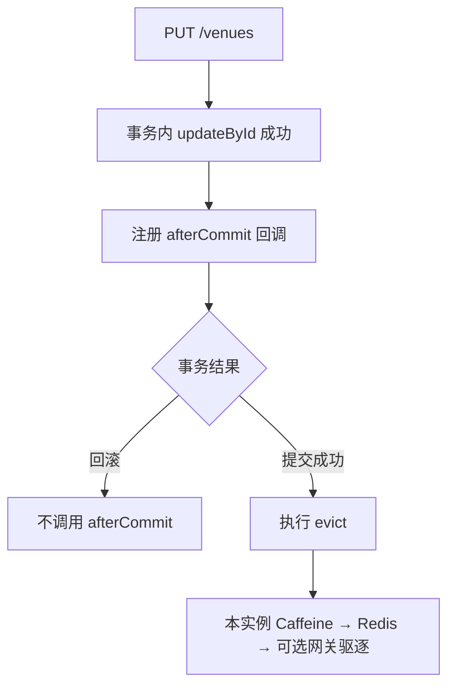

<a id="section-62"></a>

### 14.4 失效顺序与异常行为必须一起看

真实顺序：

1. `MultiLevelCacheService.evict`：先 `venueLocalCache.invalidate(key)`。
2. 紧接着 `stringRedisTemplate.delete(key)`。
3. 返回 VenueCacheInvalidator；若 purgeUrl 非空，发送 HTTP DELETE 到 `purgeUrl?id=...`。
4. 网关 `/internal/cache/venue` 检查 DELETE 方法与数字 id，删除 `/venues/{id}` 对应共享字典项，返回 204。

| 出错位置 | 代码怎样处理 | 后续影响 |
|---|---|---|
| Redis delete 抛异常 | 不在网关调用的 try/catch 内，向外传播 | 后续网关 purge 不执行；数据库已提交 |
| purgeUrl 为空 | 直接返回 | 不主动清网关，依赖其其他失效途径 |
| 网关 HTTP 请求失败 | 捕获并记录 warn | 不向调用者抛出该网关错误，也不创建可靠重试任务 |

Spring afterCommit 抛出的运行时异常可以传播到提交调用者，但此前数据库已提交，不会因此撤销。参见 [TransactionSynchronization.afterCommit 官方说明](https://docs.spring.io/spring-framework/docs/current/javadoc-api/org/springframework/transaction/support/TransactionSynchronization.html#afterCommit())。

统一 invalidator 让入口复用同一顺序，却不等于所有层都独立捕获失败、保证每层必删。

<a id="section-63"></a>

## 15. After-Commit 为什么仍然不是强一致？

<a id="section-64"></a>

### 15.1 COMMIT 与回调之间仍有进程故障窗口

数据库提交后，进程可能在删除缓存前宕机。回调只在内存中注册，不是持久任务记录；重启后没有一个 Venue 失效 ReliableTask 等待恢复。

当前收敛来源主要是：正常后续失效、各层过期与重新查询，以及配置启用后可用的 Canal 变化通道。预约的 ReservationReconcileTask 不负责 Venue 缓存。

<a id="section-65"></a>

### 15.2 读旧值后延迟回填，也可能跨过提交后删除

即使删除按正确时机执行，也可能存在：旧读已经从数据库拿到旧值但尚未回填；写事务提交并删除缓存；旧读随后才把旧值写回。

异步重建与失效之间同样没有业务版本校验。因此 afterCommit 改善的是写后删除时序，不能排除所有在途读写交错。

<a id="section-66"></a>

### 15.3 多实例与多网关不是一份本地内存

一个应用实例调用 invalidate，只清自己的 Caffeine。其他实例的旧对象不会因为共享 Redis 删除就自动消失。网关 purge 配置也是一个 URL；源码没有遍历全部网关实例并等待确认的机制。

即使本实例已清缓存，另一个实例仍可能返回旧 Venue，经网关再次回填成旧响应。10 分钟本地 TTL、约 10 分钟网关 TTL 和 Redis 期限起算点不同，不能直接承诺“提交后最多 10 分钟全系统绝对最新”。

📌 **当前实现边界：没有所有本地副本的可靠广播确认，也没有阻止旧回填的版本协议。** 多级缓存的复杂性正来自每一级都能独立保留或重新传播旧值。

<a id="section-67"></a>

## 16. Canal + RocketMQ 是怎样补充缓存失效的？

<a id="section-68"></a>

### 16.1 它来自数据库变更日志，不来自应用回调

仓库提供可选链路：MySQL binlog（数据库变更日志）由 Canal 读取，以 flat JSON 发到 RocketMQ；Java 消费变化事件，再调用同一个 invalidator。

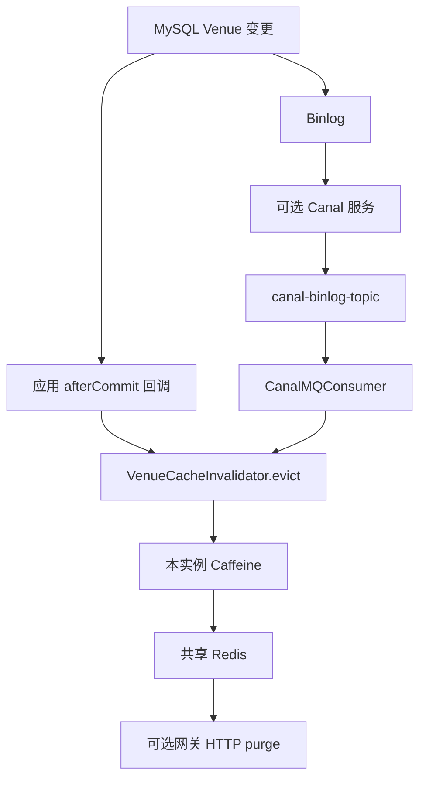

这条通道与应用是否走了 update 方法解耦，也可以观察数据库直接修改；它不把主事务和所有缓存组成一个原子提交。

<a id="section-69"></a>

### 16.2 消费者具体识别什么？

[CanalMQConsumer](../src/main/java/com/citypass/mq/CanalMQConsumer.java) 仅在 `canal.enabled=true` 时创建。它订阅 `canal-binlog-topic`，消费者组为 `canal-cache-consumer-group`。

`handleBinlogEvent` 按 flat JSON 的 table 分发，目前只注册 `tb_venue`；遍历 data 行，取 id 后调用 `venueCacheInvalidator.evict(id)`。它没有实现所有业务表缓存联动，也没有专门为不同事件 type 编写独立分支。

处理抛异常时返回 RECONSUME_LATER；正常返回 CONSUME_SUCCESS。但网关 purge 失败已在 invalidator 内被捕获，消费者未必知道该层失败，因此不会仅因该网关失败要求 MQ 重投。

<a id="section-70"></a>

### 16.3 默认是否启用？本地与 Compose 要分开

| 配置 | application.yaml 默认 | docker-compose.yml 提供的行为 |
|---|---|---|
| reliable-task.enabled | true | 未覆盖则沿用 |
| reservation.reconcile.enabled | true | 未覆盖则沿用 |
| rocketmq.enabled | false | app 环境变量设为 true |
| gateway-cache.purge-url | 空字符串 | app 指向 `http://openresty/internal/cache/venue` |
| canal.enabled | false | app 的 CANAL_ENABLED 默认仍为 false |
| Canal 服务 | 应用配置不负责启动服务 | 放在可选 `canal` profile 中 |
| OpenResty | 直接 Java 启动不自动创建网关 | Compose 提供服务及配置挂载 |

启用 Canal 服务 profile 与启用应用 Canal 消费者是两件事。仅启动 Canal 容器，不代表 Java 中的条件 Bean 已启用；还要保证消费者配置、binlog、消息系统和连接都正确。仓库 Compose 提供了 Canal 到 `citypass.tb_venue` 的过滤、flatMessage 和 topic 配置，但本篇没有启动容器验证现场连接。

<a id="section-71"></a>

### 16.4 Canal 也没有保证每个 JVM 都收到一次驱逐

消费者没有设置广播模式；RocketMQ Push Consumer 默认使用集群消费，同组实例分担消息，而不是每条消息都送达每个实例，见 [RocketMQ Push Consumer 官方说明](https://rocketmq.apache.org/docs/4.x/consumer/02push/)。

因此可以删除共享 Redis，以及处理消息那个实例的 Caffeine，却不能由此保证所有实例本地缓存都被主动清除。多实例 Caffeine 仍需要 TTL 或额外的失效传播设计。

| 方式 | 触发源 | 优点 | 当前边界 |
|---|---|---|---|
| After-Commit | 应用更新事务 | 提交后直接执行，路径短 | 进程故障会漏执行；无持久 Venue 失效任务 |
| Canal + MQ | 数据库变更日志 | 与应用写代码解耦，补充变化传播 | 默认关闭，有延迟；本地缓存并非全实例广播 |
| TTL / 逻辑重建 | 到期与后续读取 | 不依赖每次删除都成功 | 允许读旧；各层可重新传播旧值，无统一截止保证 |

<a id="section-72"></a>

## 17. 五种缓存故障，逐个推演怎样恢复

<a id="section-73"></a>

### 17.1 Case 1：更新提交成功，驱逐也正常完成

MySQL 已是新名称；afterCommit 清本实例 Caffeine、共享 Redis，再向配置的网关发 DELETE。下一次请求在这些层 miss 后重新查库，回填新值。

这是单应用、单网关且没有旧请求延迟回填时的正常路径。多实例下“全部缓存已清空”需要额外限定，不能把一次本地 invalidate 当成集群广播。

<a id="section-74"></a>

### 17.2 Case 2：更新事务回滚

注册了回调但提交最终失败或发生回滚时，afterCommit 不执行。旧数据库值没有被本次写修改成功，因此旧缓存仍然对应原事实，无需因为这次失败更新而无意义删除。

如果 updateById 本来就返回 false，代码还没有走到回调注册。不能把接口返回失败一概说成“先删过缓存再失败”。

<a id="section-75"></a>

### 17.3 Case 3：COMMIT 成功，缓存删除前进程宕机

MySQL 已新，原缓存仍旧，回调不会在重启后自动恢复。当前没有 CACHE_INVALIDATE 可靠任务类型。

若 Canal 通道已配置并健康，数据库变更事件可能补充驱逐；否则主要依赖相应缓存过期、请求触发逻辑重建或未来写入再次失效。TTL 提供恢复机会，但存在多层旧值回填，不能声称精确统一时限。

这与场景 A 的差别是：预约副作用有本地任务表保存意图，Venue 回调目前没有同等持久记录。

<a id="section-76"></a>

### 17.4 Case 4：只删 Redis，Caffeine 仍旧

请求命中 Caffeine 时不会读 Redis，所以 Redis 已删除也没用。下一次本地过期、该实例收到失效调用或重新启动，才有机会查共享层和数据库。

这解释了为什么项目使用统一 invalidator 同时处理 Java 两级缓存及可选网关。但当前只能清调用实例的本地缓存，统一入口与全实例传播仍是两件事。

<a id="section-77"></a>

### 17.5 Case 5：Caffeine 清掉了，Redis delete 失败

真实顺序下，本地已清，但 Redis 仍有旧数据；异常向外传播，网关 purge 尚未调用。请求甚至可能先命中旧网关；绕过网关的请求，则可能从 Redis 再把旧值装回 Caffeine。

若旧 Redis 数据还没逻辑过期，这次会重新写入本地；逻辑过期时主分支尝试异步刷新并返回旧值。后续 Canal 正常驱逐、TTL 与重建可以提供恢复途径，但没有一个专门的 Venue ReliableTask 立即接管本次失败。

<a id="section-78"></a>

### 17.6 再补一例：网关驱逐失败与应用报错不是同一回事

如果 Caffeine、Redis 删除正常，最后 HTTP purge 失败，该错误被捕获记录。应用更新仍可能正常返回，网关却继续提供旧响应直到过期或下次成功驱逐。

反之，Redis delete 的异常没有在该层捕获，调用方可能收到错误，但 MySQL 已经提交。判断更新是否生效应看数据库事实，不能仅依赖一次 HTTP 请求的表面结果。

<a id="section-79"></a>

## 18. 业务 Redis 与普通读缓存，使用两套收敛思路

| Redis 角色 | 键或数据 | 为什么不能只说“删掉就行”？ | 当前主要策略 |
|---|---|---|---|
| 预约业务投影与竞争状态 | reservation:stock、holders、claim | 数量与归属影响名额控制；丢失后需要按业务账本和规则恢复 | 本地任务、Lua 幂等、Retry、有限范围对账 |
| Venue 普通读缓存 | cache:venue:{id} | 可以删后查库，但多级副本和并发回填会残留旧值 | afterCommit、统一驱逐、TTL/逻辑重建、可选 Canal |
| 请求结果临时状态 | 预约请求状态与用户归属缓存 | 并非所有此类写入都进任务表 | 相关服务直接写入，结果查询优先查数据库事实 |

不能因为项目有可靠任务，就把每个 Redis SET/DELETE 都说成已持久补偿；也不能因为 Venue 可以 cache-aside（未命中查库并回填），就直接删除预约库存与 claim 并期待普通读请求自动恢复全部业务状态。

<a id="section-80"></a>

## 19. 整个第四篇的总架构图

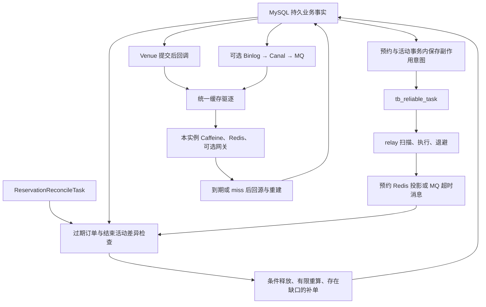

图中两条路线共用数据库事实，但恢复机制并不相同。左侧预约任务意图持久化；右侧 Venue afterCommit 回调只在内存里，另由缓存过期和可选日志通道补充。

前者不能保证任意任务乱序正确，后者不能保证每个 JVM 都立即失效。图表示当前机制的职责，不表示所有异常已形成完美闭环。

<a id="section-81"></a>

## 20. 源码调用链速查

<a id="section-82"></a>

### 20.1 可靠任务创建链

**订单释放恢复：** `ReservationServiceImpl.cancelOrder / cancelTimeoutOrder` → `ReservationTransactionalService.releaseOrPromote` → 更新订单及库存或候补 → `ReliableTaskRepository.enqueue` → 本地事务提交。

**初始建单：** `ReservationTransactionalService.createOrder` → 插入订单 → `enqueueTimeout` → enqueue ORDER_TIMEOUT → 同事务提交。

**活动发布：** `ActivityPassServiceImpl.addLimitedPassStock` → 保存活动与库存基准 → enqueue INIT_RESERVATION_STOCK → 同事务提交。

<a id="section-83"></a>

### 20.2 可靠任务执行链

`ReliableTaskScheduler.relay` → Redisson 全局锁 → `findReady(100)` → 私有 `execute` 按类型分发 → Redis Lua / `OrderMessagePublisher.sendOrderTimeout` → `markDone`，异常时 `markFailed` 保持 PENDING 并退避。

没有虚构的 task.claim()、RUNNING 更新或逐条行锁领取。

<a id="section-84"></a>

### 20.3 对账链

`ReservationReconcileTask.reconcile` → 独立对账锁 → `closeTimeoutOrders` → `supplementMissingOrders` → `reconcileFinishedStocks`。

三阶段分别复用条件关单、补发 CREATE、比较并重写库存。补发链会再次进入消费者活动时间校验，必须与源码一起理解。

<a id="section-85"></a>

### 20.4 Venue 读取与写入链

**读：** OpenResty 场馆路径检查共享字典 → miss 才代理 Java → `VenueController.queryVenueById` → `VenueServiceImpl.queryById` → `MultiLevelCacheService.queryWithMultiLevel` → Caffeine / Redis / 数据库回源。

**写：** `PUT /venues` → `VenueController.updateVenue` → `VenueServiceImpl.update` 的数据库事务 → `evictAfterCommit` 注册回调 → COMMIT → `afterCommit` 调用 evict → Caffeine → Redis → 可选网关 HTTP DELETE。

**日志补充：** Canal flatMessage → RocketMQ `canal-binlog-topic` → `CanalMQConsumer.handleBinlogEvent` → `evictVenue` → 相同 evict。

<a id="section-86"></a>

### 20.5 文件导航表

| 职责 | 真实路径 | 阅读重点 |
|---|---|---|
| 任务对象 | [ReliableTask.java](../src/main/java/com/citypass/reliable/ReliableTask.java) | 四个运行时字段 |
| 任务 SQL | [ReliableTaskRepository.java](../src/main/java/com/citypass/reliable/ReliableTaskRepository.java) | enqueue、findReady、markDone、markFailed |
| 任务表 DDL | [citypass.sql](../src/main/resources/db/citypass.sql) | tb_reliable_task 全字段、唯一索引、扫描索引 |
| 释放与建单事务 | [ReservationTransactionalService.java](../src/main/java/com/citypass/service/impl/ReservationTransactionalService.java) | createOrder、releaseOrPromote、enqueueTimeout |
| 预约编排与时间校验 | [ReservationServiceImpl.java](../src/main/java/com/citypass/service/impl/ReservationServiceImpl.java) | createOrderFromMQ、validateActivityWindow、cancelTimeoutOrder |
| 初始化任务 | [ActivityPassServiceImpl.java](../src/main/java/com/citypass/service/impl/ActivityPassServiceImpl.java) | addLimitedPassStock |
| 执行器 | [ReliableTaskScheduler.java](../src/main/java/com/citypass/task/ReliableTaskScheduler.java) | 全局锁、扫描、类型分发 |
| 对账 | [ReservationReconcileTask.java](../src/main/java/com/citypass/task/ReservationReconcileTask.java) | 三阶段的选择范围与修复顺序 |
| 库存恢复脚本 | [restore-stock.lua](../src/main/resources/restore-stock.lua) | 0 / -1 / 1 与 marker |
| 归属交接脚本 | [transfer-reservation.lua](../src/main/resources/transfer-reservation.lua) | 旧 claim 比对与新 claim 写入 |
| 初始化脚本 | [init-reservation-stock.lua](../src/main/resources/init-reservation-stock.lua) | 永久初始化 marker |
| MQ 发送 | [RocketMQProducer.java](../src/main/java/com/citypass/mq/RocketMQProducer.java) | sendOrderTimeout 的发送与返回处理 |
| Venue 接口 | [VenueController.java](../src/main/java/com/citypass/controller/VenueController.java) | GET /venues/{id}、PUT /venues |
| Venue 读写服务 | [VenueServiceImpl.java](../src/main/java/com/citypass/service/impl/VenueServiceImpl.java) | queryById、update、基线接口 |
| Java 多级缓存 | [MultiLevelCacheService.java](../src/main/java/com/citypass/utils/MultiLevelCacheService.java) | miss、逻辑过期、互斥、回填、evict |
| 本地缓存配置 | [CaffeineConfig.java](../src/main/java/com/citypass/config/CaffeineConfig.java) | 10000 条、写后 10 分钟 |
| 缓存常量 | [RedisConstants.java](../src/main/java/com/citypass/utils/RedisConstants.java) | cache:venue、TTL、lock:venue |
| 旧缓存工具 | [CacheClient.java](../src/main/java/com/citypass/utils/CacheClient.java) | 基线查询与保留能力 |
| 提交后驱逐 | [VenueCacheInvalidator.java](../src/main/java/com/citypass/utils/VenueCacheInvalidator.java) | 注册回调、同步驱逐、HTTP 错误捕获边界 |
| 网关 | [nginx.conf](../src/main/resources/openresty/nginx.conf) | 查询缓存、TTL、内部驱逐地址 |
| Canal 消费 | [CanalMQConsumer.java](../src/main/java/com/citypass/mq/CanalMQConsumer.java) | 条件启用、table 分发、消费结果 |
| 默认开关 | [application.yaml](../src/main/resources/application.yaml) | MQ、Canal、任务、对账、网关地址 |
| 部署差异 | [docker-compose.yml](../docker-compose.yml) | app 环境变量、OpenResty、可选 Canal profile |

新增 Venue 的 `saveVenue` 直接调用 save，并未沿用 update 中的 afterCommit 路径；类型/名称列表和 GEO 查询也不是本文单个 Venue 缓存失效的完整覆盖对象。因此不能说“所有 Venue 写操作、全部列表缓存都已经统一治理”。

<a id="section-87"></a>

## 21. 九个面试重点：理解后再回答

<a id="section-88"></a>

### 21.1 为什么不能依赖一个普通 @Transactional 管 MySQL 和 Redis？

**先理解：** 注解不是跨资源魔法。它能让受管的数据库事务根据异常决定提交或回滚，却不能撤销已成功的普通 Redis 写入，也不能撤销已经完成的 MySQL COMMIT。要同时观察“哪个资源成功了”和“异常发生时是否已经提交”。

**30～60 秒回答：**

> 当前项目的 @Transactional 管理本地 MySQL 事务，普通 Redis 操作不自动成为与它原子提交的同一资源。如果 Redis 在提交前抛异常，数据库可能按回滚规则回滚，但 Redis 已写成功后数据库提交失败，或者数据库提交后 Redis 失败，仍然会不一致。因此我们把业务事实与后续任务一起写进 MySQL，再异步执行外部副作用，通过幂等重试和部分对账恢复，而不是把两个系统简单当成一笔事务。

<a id="section-89"></a>

### 21.2 为什么任务必须与业务数据同事务写入？

**先理解：** 若业务先提交，任务后插入，中间宕机会让系统丢掉“Redis 还没改”的证据。后台再勤快也查不到不存在的任务。任务和业务同事务，才能在正常路径上避免这个间隙。

**30～60 秒回答：**

> 以订单取消为例，releaseOrPromote 在同一个数据库事务里取消订单、恢复库存并插入 RESTORE_REDIS_STOCK。如果任务插入异常，业务更新也回滚；正常提交则事实和后续执行意图一起留下。假如提交后才建任务，进程在中间宕机就会出现业务成功但副作用意图丢失，重试器不知道还要恢复 Redis。所以同事务的价值首先是保存恢复依据，而不是让 Redis 当场成功。

<a id="section-90"></a>

### 21.3 为什么叫“类 Outbox”，不能直接包装成完整标准实现？

**先理解：** 项目保存的是带参数的本地工作单，部分工作是 Redis 写入，部分是 MQ 发送。它具备 Outbox 的核心事务思想，但没有因此自动具备一整套领域事件发布治理能力。

**30～60 秒回答：**

> 我使用“类 Transactional Outbox”，因为业务修改与后续意图确实在同一 MySQL 事务提交，再由后台读取执行。不过表里的任务不只是待发领域事件，还包括 Redis 初始化、库存恢复和归属迁移，所以它更准确地叫本地可靠任务表。我们借鉴了 Outbox 防止业务成功后执行意图丢失的思想，没有声称实现了全局事件顺序、CDC 发布平台或 exactly-once。

<a id="section-91"></a>

### 21.4 Retry 和 Reconciliation 有什么区别？

**先理解：** Retry 有一张明确的待办单；对账则重新查账，看看有没有未登记的问题。不能让只读任务表的执行器承担发现任意数据漂移的职责。

**30～60 秒回答：**

> Retry 由 ReliableTaskScheduler 扫描到期 PENDING 任务，重新执行已知未完成的操作。Reconciliation 由 ReservationReconcileTask 重新检查事实，扫描过期订单、Redis holder 与订单用户差异，以及结束活动的库存数量。前者解决已知任务没做完，后者寻找遗漏和漂移。不过当前补单会遇到活动结束校验，归属也没有全量重建，所以我会明确它是有限范围对账，不能说所有异常都能自动修复。

<a id="section-92"></a>

### 21.5 Redis 成功，但任务还没标 DONE 就宕机怎么办？

**先理解：** 任务表不会知道 Redis 已成功，重启后只能再次尝试。只有副作用内部记得“这份工作已经做过”，才能避免把库存多加一次。

**30～60 秒回答：**

> 任务仍然 PENDING，恢复后会重新执行。restore-stock.lua 用订单号对应的恢复标记去重，首次完成时库存加一并写标记；重放发现标记就返回零，不再加库存，执行器随后标 DONE。这个设计处理了副作用成功但完成标记未写的常见窗口。不过标记只有七天，并依赖 Redis 数据保留，所以我不会把它说成无限期、任意故障下的恰好一次执行。

<a id="section-93"></a>

### 21.6 为什么最终一致性仍然要求幂等？

**先理解：** 为了不漏执行，系统必须容忍再次尝试；但重复加库存会制造新的错误。重试解决“要继续做”，幂等解决“再做也不多产生效果”。

**30～60 秒回答：**

> 最终一致性依赖重试，而超时或宕机时常常无法判断上一次副作用是否实际成功，所以重复执行不可避免。只靠任务 DONE 不够，因为 Redis 成功与 DONE 之间仍有窗口。项目通过 Lua 和业务标记限制重复恢复、重复迁移，但任务幂等与多次不同任务的执行顺序要分开；连续资源交接乱序时，现有脚本没有版本校验，仍存在需要进一步处理的边界。

<a id="section-94"></a>

### 21.7 为什么缓存失效应当放在 After Commit？

**先理解：** 提前删缓存后，并发读可能在事务尚未提交时查出旧数据，重新回填。等提交成功再删，能够避免这个由提前删除制造的明显竞态；回滚时也无需执行这次驱逐。

**30～60 秒回答：**

> Venue 更新方法在事务中更新数据库并注册 afterCommit，提交成功后才调用统一 invalidator。这样避免先删缓存、并发请求读到未提交前的旧数据库值又回填的窗口。如果事务回滚，afterCommit 不执行。当前失效顺序是本实例 Caffeine、共享 Redis、可选 OpenResty HTTP purge。这里注册发生在事务内，真正驱逐发生在提交后，两者要区分。

<a id="section-95"></a>

### 21.8 After-Commit 是否已经保证数据库与缓存强一致？

**先理解：** 回调只是在正确时间运行的代码，不是持久工作单。提交后进程仍能宕机，驱逐也能失败；旧读与异步重建还可能在驱逐之后回填旧值。

**30～60 秒回答：**

> 不保证。afterCommit 改善提交和失效的顺序，但数据库提交与缓存删除不是原子操作；中间宕机或删除失败，缓存仍可能旧。项目依靠 TTL、逻辑过期重建以及可选 Canal 通道补充收敛，但 Canal 默认关闭，而且同组集群消费不能确保每个 JVM 都清本地缓存。因此我把它描述为提交后失效与最终一致治理，不承诺所有用户立即读到新值。

<a id="section-96"></a>

### 21.9 多级缓存最大的复杂度是什么？

**先理解：** 一个旧值可能留在网关、某个 JVM 或 Redis。删了一层不代表其他层知道，旧值还可能从一层回填另一层。所以难点不仅是 miss 时查哪里，还包括怎么传播失效和控制旧回填。

**30～60 秒回答：**

> 多级缓存减少了请求进入应用和访问 Redis、数据库的次数，但增加了失效传播和局部旧值问题。项目完整读路径是 OpenResty、Caffeine、Redis、MySQL，写后统一按顺序驱逐。需要注意 Caffeine 是实例本地的，网关也有独立字典，Redis 的逻辑过期旧值还能被网关缓存。因此关键是说明每层范围、TTL、失效方式和失败后的恢复途径，而不是只强调多放几份缓存就更快。

<a id="section-97"></a>

## 22. 常见错误理解与纠正

| 容易讲错的说法 | 对照源码后的准确理解 |
|---|---|
| @Transactional 让 MySQL 与普通 Redis 原子提交 | 只管理对应事务资源，不自动形成跨资源原子事务 |
| Redis 异常一定不会让 MySQL 回滚 | 未提交时异常可能触发本地回滚，已提交后不能再撤销 |
| ReliableTask 就是完整标准 Outbox | 借鉴同事务保存副作用意图，包含 Redis 与 MQ 工作 |
| 任务失败后变 FAILED | status 仍是 PENDING，更新次数、时间和错误 |
| 最大退避 300 秒 | 实际表达式最大得到 256 秒 |
| 任务逐条 CAS 领取，使用 lease | 实际是整批 Redisson 锁，没有逐条 RUNNING/owner/lease |
| 有 DONE 和锁就不需要幂等 | 成功后宕机仍会重放 |
| restore 用 claim 判断是否应该加库存 | claim 控制旧归属删除，marker 才抑制重复加库存 |
| Lua 可以像数据库一样自动回滚所有错误写入 | 原子隔离执行不提供错误自动回滚 |
| Retry 就是对账 | 一个重做任务，一个重新比较事实 |
| 对账补发 CREATE 就表示订单补好了 | 已结束活动会被消费者时间校验拒绝 |
| 对账重算也自动修好所有 claim | 当前主要重写库存数字，不完整重建归属 |
| 主查询只用了旧 CacheClient | 当前主链使用 MultiLevelCacheService |
| Redis TTL 随机 ±20% | 实际只增加 0～20% 随机量 |
| 逻辑过期就是没有物理 TTL | 当前同时设置物理期限 |
| OpenResty L1 与 Java L1 是同一层 | 是不同范围的编号，分别是网关与本地缓存 |
| COMMIT 后删缓存就强一致 | 仍有进程故障、删除失败和旧请求回填窗口 |
| Canal 默认运行，广播删除所有 JVM 缓存 | 默认关闭，消费者未配置广播模式 |
| Redis 删除失败也会继续清网关 | 当前异常向外传播，后续网关步骤不会执行 |
| 所有 Redis 副作用都有可靠任务 | Venue 驱逐及部分请求状态写入并未进入该任务表 |

<a id="section-98"></a>

## 23. 简历里的每一句，怎样落回源码？

| 简历表述 | 对应实现 | 面试时必须带上的边界 |
|---|---|---|
| 本地可靠任务表 | tb_reliable_task，ReliableTask，JdbcTemplate Repository | Java 对象是部分字段映射，表中保存状态与重试元数据 |
| 类 Transactional Outbox 补偿 | createOrder、releaseOrPromote、addLimitedPassStock 在业务事务内 enqueue | 记录后续副作用，不等于完整事件发布平台 |
| Retry | relay、findReady、execute、markFailed | PENDING 重试，1～256 秒退避，无最大次数 |
| Reconciliation | reconcile 的三阶段 | 能扫描和修复部分异常；补单结束校验仍有缺口 |
| 处理 MySQL/Redis 跨存储一致性 | DB 取消及库存恢复提交，之后执行 restore-stock.lua | 恢复标记有效期、库存缺失、跨任务交错限制保证 |
| OpenResty + Caffeine + Redis | 网关字典、JVM Cache、RedisData | 部署与实例范围不同；不虚构命中率和性能提升 |
| After-Commit Invalidation | evictAfterCommit 注册 TransactionSynchronization.afterCommit | 提交后按 Caffeine→Redis→可选网关驱逐；非持久任务，非强一致 |

这条简历可以保留。解释“保证缓存更新时序”时，应限定为**把正常更新路径的失效安排在事务提交之后**，不能扩展成“保证所有缓存更新必达、同时生效”。

<a id="section-99"></a>

## 24. 三版完整面试回答与追问路线

<a id="section-100"></a>

### 24.1 30 秒：MySQL 成功、Redis 失败怎么办？

> 我们不尝试回滚已经提交的 MySQL，而是在业务事务里同时保存可靠任务。例如取消订单恢复数据库库存时，插入 Redis 库存恢复任务；提交后由 Scheduler 执行，失败保留 PENDING 并退避重试。Lua 使用业务标记避免正常重放重复加库存，对账再扫描过期订单和部分库存漂移。这样保存了恢复依据，但具体保证仍受标记、任务顺序和对账范围限制。

<a id="section-101"></a>

### 24.2 1～2 分钟：项目最终一致性怎样做？

> 前三部分确定了订单和候补的数据库状态，但 Redis 不属于本地 MySQL 事务，所以数据库成功后仍可能发生 Redis 更新失败。
>
> 我的处理方式是在同一数据库事务里写业务事实和可靠任务。例如订单取消、库存加一，与 RESTORE_REDIS_STOCK 一起提交；候补接力则写归属迁移任务。后台 relay 使用一个 Redisson 分布式锁协调批次，扫描最多一百条到期 PENDING，按类型执行 Redis Lua 或发送超时消息。成功标 DONE，失败保持 PENDING、增加次数并按一秒到二百五十六秒退避。
>
> 任务可能在 Redis 成功、标 DONE 前宕机，所以任务表不够，还需要脚本幂等。库存恢复以订单号记录七天标记，重放返回零而不再加库存。
>
> 除了重试，我们还定期对账：扫描过期待支付订单、寻找部分缺单候选、对结束超过两分钟的活动按初始库存和有效订单重算。不过补发 CREATE 仍会碰到活动结束校验，归属也没有全量恢复，所以这是明确范围的恢复机制，不能包装成所有故障下都自动闭环。

<a id="section-102"></a>

### 24.3 2～3 分钟：ReliableTask、多级缓存与一致性治理

> 我把项目里的 Redis 分成两种角色来设计。一种是预约库存和名额归属，参与高并发竞争控制；另一种是 Venue 普通查询缓存。两者的恢复策略不同。
>
> 对预约业务，先保证 MySQL 的订单、库存、候补状态正确提交，同时在本地可靠任务表保存后续执行意图。这借鉴了 Transactional Outbox，但任务既有 Redis 恢复、初始化和归属迁移，也有 MQ 超时消息发送，所以我称为类 Outbox。后台执行器扫描到期 PENDING，分布式锁协调批次，失败记录错误与下一次时间继续重试。
>
> 可靠任务不能防止全部重复执行，例如 Redis 成功后 Java 来不及标 DONE 就宕机，恢复后还会重放。因此恢复脚本用业务标记去重，避免库存多加一次。对账则与 Retry 分工，重新检查过期订单和结束活动的差异。源码复盘也发现一些边界，例如补单入口被活动结束校验挡住，以及连续交接任务乱序没有版本保护。
>
> 对 Venue 查询，经网关时先读 OpenResty，再到 Java 的 Caffeine、共享 Redis，最后回源 MySQL。主链支持空值缓存、互斥冷加载、逻辑过期异步重建和随机期限；Redis 还设置物理 TTL。更新时，事务内注册 afterCommit，提交成功后先清当前 JVM 的 Caffeine，再删 Redis，最后按配置调用网关 HTTP purge。
>
> 这样避免提前删缓存后并发读把旧数据库值重新装入的问题，但它不是强一致。提交后宕机、Redis 删除失败、其他 JVM 的旧缓存或在途回填仍可能产生旧值。项目以 TTL、重建和可选 Canal 的 binlog 失效通道补充治理；Canal 默认关闭，而且集群消费不保证每个 JVM 都收到通知。所以我会把已实现机制、部署条件和剩余边界都说明，而不会声称多级缓存永远实时同步。

<a id="section-103"></a>

### 24.4 深挖追问树

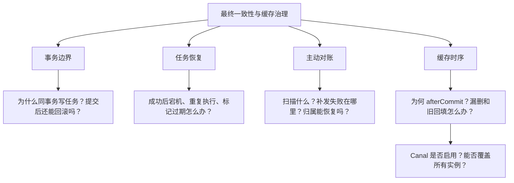

如果被问“为什么不用分布式事务”，可以先回答当前设计选择：采用本地事务加后续恢复，避免把每次外部服务可用性都耦合进主业务原子提交；代价是必须承担重复执行、异常观测、补偿正确性和暂时不一致。不要把它描述成项目曾完整实现并压测比较过某种分布式事务方案。

<a id="section-104"></a>

## 25. 当前边界与进一步优化方案分开记录

| 当前源码边界 | 进一步优化方案，尚未实现 |
|---|---|
| 全局锁批次串行，任务状态更新无执行者条件 | 结合规模设计任务级领取、租约与版本条件，保留副作用幂等 |
| 无最大失败隔离，坏参数可长期重试 | 失败分类、积压告警、可审计人工处理与重放 |
| 七天标记及跨任务顺序不足 | 按业务生命周期设计去重保存和归属版本检查 |
| 补单只从 holder 找线索且结束校验阻断 | 持久预约意图、单独恢复规则、避免正常入口绕过校验 |
| 只修结束库存数字，归属未完整校验 | 明确库存与 owner 重建规则，并协调在途任务 |
| Venue 提交后失效意图未持久化 | 按需求将关键失效纳入持久记录或可靠日志传播 |
| Redis 删除失败会中断后续层驱逐 | 对每层结果独立记录并设计重试，防止局部失败被遗漏 |
| 多 JVM 和多网关无法保证全覆盖 | 设计可观测的广播或版本化缓存策略，处理失效丢失 |
| 在途旧读/异步重建可写回旧值 | 结合版本或代际校验约束缓存回填 |
| 网关会缓存业务失败及逻辑过期旧响应 | 明确可缓存响应、缓存控制与新鲜度传播规则 |
| 基线和主链共享键却使用不同 JSON 结构 | 隔离基线键空间与测试数据格式 |

这些是从源码边界得出的优化方向，不是本次对源码作出的改动。本篇没有修改业务实现。

<a id="section-105"></a>

## 26. 源码校验、测试证据与学习自查

<a id="section-106"></a>

### 26.1 本篇检查了哪些实现？

重新核查了任务 DDL 与 Java 字段差异、四种 task_type、全部 enqueue 调用处与事务标注、扫描 SQL、全局锁、状态更新、退避表达式、三个副作用 Lua、超时消息发送，以及对账三阶段选择条件和 CREATE 消费者活动校验。

缓存部分核查了 Controller 真实 HTTP 映射、Venue 主查询和基线区别、Caffeine 配置、Redis 逻辑/物理 TTL、空值、互斥与异步重建、提交后回调、每层驱逐顺序、异常捕获范围、网关正文缓存与 purge、Canal 消费代码、application 默认值和 Compose 覆盖。

<a id="section-107"></a>

### 26.2 已有测试与本次验证不能混为一谈

[ReservationTransactionalServiceTest](../src/test/java/com/citypass/service/impl/ReservationTransactionalServiceTest.java) 验证了正常释放与补位的任务入队、库存是否更新等逻辑。它使用 mock 并直接构造服务，不等于启动真实 Spring 事务验证数据库回滚。

[scripts/smoke-test.ps1](../scripts/smoke-test.ps1) 覆盖公开 Venue 读取与预约正常流程等；不能把它视为 afterCommit 宕机、Canal 广播、多实例缓存失效、任务成功后标记前崩溃等故障测试。

当前测试目录未发现专门覆盖 ReliableTaskScheduler、ReservationReconcileTask、VenueCacheInvalidator 和 MultiLevelCacheService 上述恢复边界的测试类。本篇没有启动完整应用、运行真实 MQ/Redis 故障注入或声称重新通过全量测试。

<a id="section-108"></a>

### 26.3 文档格式校验

**格式检查**：27 个不同的相对源码链接已按仓库 `docs/` 位置核实存在，前三篇文档链接已核对；完整目录覆盖 109 个章节和小节，目录锚点与代码围栏已检查。13 张 Mermaid 图均通过 Mermaid 11.17.2 语法解析。

官方链接只用于解释 Spring、Redis、RocketMQ 的基础语义；项目具体行为以此次源码为准。语法解析通过不等于已在 GitHub 页面实际渲染验收。

<a id="section-109"></a>

### 26.4 能否从头回答这两个问题？

**问题一：A 已取消，Redis 却没改，怎么办？**

应能按顺序说出：已提交数据库不能简单撤销；普通 @Transactional 不覆盖跨资源原子性；本地任务与事实同事务保存恢复意图；执行器扫描 PENDING、按类型执行、失败退避；幂等处理成功后重放；对账补充发现部分异常，并明确补单和归属修复边界。

**问题二：Venue 已更新，用户还看到旧值，怎么办？**

应能先定位旧值在哪一层，再解释：事务内注册 afterCommit、提交后按真实顺序驱逐；Redis 删除失败与网关失败处理不同；本地缓存只覆盖当前实例；TTL、逻辑重建和可选 Canal 提供恢复途径，但回调不持久化，旧回填与跨实例传播仍有边界。

至此，四篇完成了“初次分配名额 → 并发事件决定订单状态 → 释放后候补接力 → 数据库事实向外部状态传播”的学习主线。CityPass 的设计核心是先可靠保存业务事实，再通过持久任务、重试、有限对账与提交后失效推动其他状态收敛；理解它，也包括能指出哪些异常还没有完整恢复路径。
