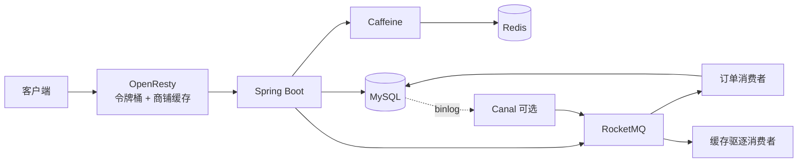

# HMDP-Pro

黑马点评高并发链路增强版，适合作为 Java 后端面试项目学习。项目保留课程原有的登录、店铺、博客、关注、签到等功能，重点完善秒杀、消息可靠性、多级缓存、限流、缓存失效和安全边界。

这是一套可以运行和解释的工程方案，不把“用了 Redis/MQ”当作结果。每个关键组件都对应一个具体故障：重复下单、库存超卖、消息丢失、支付与关单竞争、缓存击穿、脏缓存、恶意高频请求或越权访问。

## 系统结构



秒杀提供两种可切换模式：

- **A 模式**：入口执行 Lua 预扣库存和一人一单，再用 RocketMQ 事务消息决定创建消息是否提交。适合希望入口快速知道“已受理/无资格”的场景。
- **B 模式**：入口只写排队状态并发送普通消息，消费者再执行 Redis claim。适合把更大的洪峰移到 MQ 堆积层。

两种模式最终都经过同一个数据库事务：条件扣 DB 库存、插入订单、写入延迟关单任务同时提交。接口返回订单号表示请求已受理，订单是否落库以结果查询为准。

## 这版修复了什么

- 将 DB 扣库存、订单插入和关单任务放进真实的 Spring 事务，避免扣了库存却没有订单。
- 增加 `tb_reliable_task` 本地可靠任务表。延迟关单、Redis 库存初始化和关单后的 Redis 回补失败时会重试。
- Redis claim 记录 `orderId` 归属；回滚脚本只能撤销自己的预扣，避免失败消息破坏另一笔成功订单。
- RocketMQ 事务标记过期后可通过 claim 归属回查，避免已预扣却误判回滚。
- 支付和异步结果查询校验当前用户，封住水平越权。
- 支付、关单都使用 `WHERE status=1` 的条件更新，竞争时只有一个终态成功。
- 修复缓存互斥锁非持有者解锁、递归重试、过期值重新写回 Caffeine、逻辑缓存永久存在等问题。
- 店铺更新在事务提交后驱逐 Caffeine、Redis 和可选的 OpenResty 缓存。
- 修复 OpenResty 响应分块缓存和令牌桶时间推进公式；结果轮询不再占用秒杀限流额度。
- Canal 消费者改为显式开关；RocketMQ 关闭时普通读功能仍能启动。
- 完成登出、一次性验证码、上传类型校验、上传路径配置和目录穿越防护；写接口至少要求登录。

详细原因和失败场景见 [docs/02-秒杀一致性深挖.md](docs/02-秒杀一致性深挖.md) 与 [docs/03-缓存限流与安全.md](docs/03-缓存限流与安全.md)。

## 一键运行

需要 Docker Desktop，并确保 Linux Engine 已启动：

```bash
docker compose up -d --build
docker compose ps
```

服务入口：

- OpenResty 网关：`http://localhost:8080`
- Spring Boot 直连：`http://localhost:8081`
- MySQL：`localhost:3307`，开发账号 `root/123456`（可用 `MYSQL_HOST_PORT` 覆盖）
- Redis：`localhost:6379`
- RocketMQ NameServer：`localhost:9876`

首次构建若 Maven 镜像下载较慢，可以先使用本机 Maven，再构建轻量运行镜像：

```powershell
mvn -DskipTests package
$env:APP_DOCKERFILE='Dockerfile.runtime'
docker compose up -d --build
```

切换 B 模式：

```powershell
$env:SECKILL_MODE='B'
docker compose up -d --force-recreate app
docker compose restart openresty
```

启用 Canal：

```powershell
$env:CANAL_ENABLED='true'
docker compose --profile canal up -d --build
```

Canal 依赖 MySQL ROW binlog。Compose 已创建 `canal/canal` 复制账号，并把 `hmdp.tb_shop` 的 flat JSON 事件发送到 `canal-binlog-topic`。第一次启动建议检查：

```bash
docker compose --profile canal logs canal
docker compose logs app
```

若本机已有 MySQL、Redis 和 RocketMQ，可直接运行应用。默认配置会连接本机 MySQL/Redis，并关闭 MQ；要测试秒杀需设置 `ROCKETMQ_ENABLED=true`。已有旧数据库请执行 `deploy/mysql/migration-v2.sql`。

## 最短接口验证

1. 请求验证码：

```bash
curl -X POST "http://localhost:8080/user/code?phone=13800138000"
docker compose logs app
```

2. 用日志中的验证码登录并保存返回的 token：

```bash
curl -X POST http://localhost:8080/user/login \
  -H "Content-Type: application/json" \
  -d '{"phone":"13800138000","code":"123456"}'
```

3. 携带 `authorization` 请求头创建秒杀券：

```bash
curl -X POST http://localhost:8080/voucher/seckill \
  -H "authorization: TOKEN" -H "Content-Type: application/json" \
  -d '{"shopId":1,"title":"测试秒杀券","subTitle":"面试演示","rules":"一人一单","payValue":100,"actualValue":500,"type":1,"status":1,"stock":20,"beginTime":"2026-01-01T00:00:00","endTime":"2099-12-31T23:59:59"}'
```

4. 用返回的券 ID 下单并轮询结果：

```bash
curl -X POST http://localhost:8080/voucher-order/seckill/VOUCHER_ID -H "authorization: TOKEN"
curl http://localhost:8080/voucher-order/seckill/result/ORDER_ID -H "authorization: TOKEN"
```

状态包括 `WAITING`、`SUCCESS`、`FAIL_STOCK`、`FAIL_REPEAT`、`FAIL_SYSTEM`。成功后可调用 `PUT /voucher-order/pay/{orderId}`；超过 15 分钟未支付会被延迟消息关闭，定时对账负责兜底。

## 测试

```bash
mvn test
```

单元测试不需要外部服务。两个课程遗留的 Redis/MySQL 演示测试已标为手工测试。完整链路测试使用 Compose 环境执行。

服务启动后可运行自动冒烟测试；脚本会创建两个临时用户和一张库存为 2 的秒杀券，并验证异步成功、越权拦截、重复下单与支付 CAS：

```powershell
.\scripts\smoke-test.ps1
```

## 学习顺序

从 [docs/00-先读这里.md](docs/00-先读这里.md) 开始。建议先掌握 A 模式主链路，再理解本地可靠任务，最后比较 B 模式、对账和 Canal。不要从类名和中间件清单开始背。

## 边界

项目用于高并发与一致性学习，后台管理目前只做到登录保护，没有实现管理员 RBAC；模拟支付也不是第三方支付回调。真实生产环境还需要鉴权角色、监控告警、死信人工处理、压测容量数据、密钥管理和多可用区部署。
