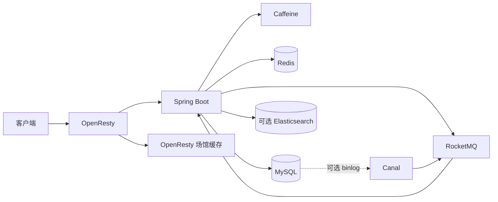

# CityPass

CityPass 是一个城市活动发现与限量名额预约平台。它面向展览、独立演出、运动场馆、研学营地和工作坊等场景，解决两个实际问题：热门活动瞬时请求会压垮数据库；用户取消或超时未支付后，空出的名额如果不能及时流转，会造成活动方的容量浪费。

项目把“找场馆、看动态、订阅创作者”和“限量预约、候补、自动补位”放在同一业务背景下。重点不是接口数量，而是让库存、订单、候补和 Redis 占位在消息重复、服务重启、支付与关单并发时仍能收敛。

## 核心能力

- 城市场馆：分类、关键词、坐标距离查询，OpenResty + Caffeine + Redis + MySQL 多级读取。
- 城市动态：发布、热榜、点赞排行、滚动 Feed、创作者订阅、评论与作者信息聚合。
- 用户体系：短信验证码登录、一次性验证码、Redis Token、滑动续期、签到位图。
- 限量预约：OpenResty 总量令牌桶、用户滑动窗口、RocketMQ 削峰、Redis Lua 原子占位、MySQL 条件扣减。
- 预约候补：MySQL 严格 FIFO 队列、活动级串行点、异常候补跳过、名额版本化交接。
- 可靠性：预约请求事实 + Transactional Outbox、支付/到期复合 CAS、任务级租约与版本栅栏、死信与手工重放、Micrometer 指标。
- 缓存一致性：与场馆写入同事务保存失效 Outbox，Redis 版本水位阻止旧读回写，Pub/Sub 广播驱逐所有 JVM 的 Caffeine。
- 活动搜索：Elasticsearch 中文全文检索与结构化过滤，PIT + `search_after` 游标分页，单调索引版本、场馆字段扇出和维护窗口全量重建。

## 系统结构



预约写链路采用一种明确的生产路径：

```text
POST /reservations/{passId}
  -> MySQL 同一事务：PROCESSING 请求事实 + CREATE Outbox
  -> 多实例 Relay 以任务租约发布 RocketMQ CREATE 消息
  -> 消费者校验活动时间窗与有效订单
  -> Redis Lua 原子占位
  -> MySQL 事务：条件扣库存 + 订单 + 请求状态 + 真实截止时间任务
  -> RESERVED

Redis 无库存且 acceptWaitlist=true
  -> MySQL WAITING 候补
  -> WAITLISTED
```

取消与超时关单使用不同的复合 CAS：超时路径必须同时命中 `status=1 AND offer_expire_time<=NOW()`。释放事务以活动库存行串行化，阻塞锁定真正队首，不会跳过被另一事务锁定的较早候补。Redis claim 以 `orderId:resourceVersion` 表示名额归属，只有期望版本匹配时才能交接或回补。

## 关键状态

| 对象 | 状态 | 含义 |
|---|---|---|
| 请求 | `PROCESSING` | 已受理，等待异步消费 |
| 请求 | `RESERVED` | 已获得限时支付资格 |
| 请求 | `WAITLISTED` | 库存不足，已进入候补 |
| 请求 | `FAIL_NOT_STARTED / FAIL_ENDED` | 不在活动预约时间窗 |
| 订单 | `1 / 2 / 4` | 未支付 / 已支付 / 已取消 |
| 候补 | `WAITING` | 正在排队 |
| 候补 | `OFFERED` | 已补位，等待支付 |
| 候补 | `ACCEPTED` | 补位订单已支付 |
| 候补 | `EXPIRED / CANCELLED` | 资格超时或主动退出 |

必须始终成立的业务不变量：

1. 同一用户对同一通行证最多存在一个有效订单或一个活动候补。
2. 数据库库存不会小于 0。
3. 名额补位只是所有权转移，不增加或减少库存。
4. 支付与关单只能有一方通过 CAS 把未支付订单推进到终态。
5. MySQL 订单和候补是最终依据，Redis 是可重建的快速状态。

## 快速启动

需要 Docker Desktop。仓库根目录执行：

```powershell
docker compose up -d --build
docker compose ps
```

服务地址：

- OpenResty 网关：`http://localhost:8080`
- Spring Boot：`http://localhost:8081`
- MySQL：`localhost:3307`
- Redis：`localhost:6379`
- RocketMQ NameServer：`localhost:9876`

全新环境会自动导入 `src/main/resources/db/citypass.sql`。旧增强版数据库依次执行：

```text
deploy/mysql/migration-v2.sql
deploy/mysql/migration-v3-waitlist.sql
deploy/mysql/migration-v4-reliability.sql
deploy/mysql/migration-v5-activity-search.sql
```

可选的 Canal 缓存驱逐链路：

```powershell
$env:CANAL_ENABLED='true'
docker compose --profile canal up -d --build
```

可选的活动全文检索模块使用 Elasticsearch 7.17.29，并在镜像中真实安装 SmartCN：

```powershell
$env:SEARCH_ENABLED='true'
$env:SEARCH_CURSOR_SECRET='替换为至少16字符的随机密钥'
$env:RELIABLE_TASK_ADMIN_TOKEN='替换为运维令牌'
docker compose --profile search up -d --build

Invoke-RestMethod -Method Post `
  -Uri http://localhost:8081/internal/activity-search/rebuild `
  -Headers @{'X-Admin-Token'=$env:RELIABLE_TASK_ADMIN_TOKEN}
```

搜索关闭时不会创建 Elasticsearch 客户端，预约与场馆业务仍可运行；期间产生的 `INDEX_ACTIVITY_SEARCH` 任务保持 `PENDING`，重新启用并完成首次重建后继续收敛。

## 验证

单元测试：

```powershell
mvn clean test
```

Docker 全链路测试：

```powershell
powershell -NoProfile -ExecutionPolicy Bypass -File .\scripts\smoke-test.ps1
powershell -NoProfile -ExecutionPolicy Bypass -File .\scripts\reliability-test.ps1
powershell -NoProfile -ExecutionPolicy Bypass -File .\scripts\cache-consistency-test.ps1
powershell -NoProfile -ExecutionPolicy Bypass -File .\scripts\activity-search-test.ps1
```

`smoke-test.ps1` 覆盖主要业务功能。`reliability-test.ps1` 使用真实 MySQL、Redis 和 RocketMQ 验证 100 用户并发争抢 10 份库存、双释放补位、锁住队首时不跳号、Broker 故障恢复、支付/超时边界和 Lua 重试幂等。`cache-consistency-test.ps1` 额外启动第二个应用实例，验证广播失效与旧版本回写拒绝。`activity-search-test.ps1` 使用 6 个可复现活动样例验证中文分词、排序与组合过滤、稳定游标、下架与乱序保护、场馆扇出、重建以及 ES 故障恢复；它是小样本功能验收，不是生产性能压测。

## 主要 API

| 方法 | 路径 | 作用 |
|---|---|---|
| GET | `/venues/{id}` | 场馆详情 |
| GET | `/venues/of/type` | 分类与距离查询 |
| GET | `/search/activities` | 活动全文检索、结构化过滤与游标分页 |
| POST | `/passes/limited` | 发布限量活动通行证 |
| PUT | `/passes/{id}/search-metadata` | 修改活动搜索元数据 |
| PUT | `/passes/{id}/status` | 活动上架或下架 |
| POST | `/reservations/{passId}` | 预约，可选择接受候补 |
| GET | `/reservations/requests/{requestId}` | 查询预约或候补状态 |
| PUT | `/reservations/{orderId}/pay` | 支付预约订单 |
| PUT | `/reservations/{orderId}/cancel` | 取消并触发补位 |
| DELETE | `/reservations/waitlist/{requestId}` | 退出候补 |
| POST / GET / DELETE | `/story-comments` | 发布、查询和删除动态评论 |
| PUT / DELETE / GET | `/subscriptions/{targetUserId}` | 订阅、取消订阅、查询状态 |

## 学习顺序

先读 [00-先读这里](docs/00-先读这里.md)，再按 [01-项目全景与代码地图](docs/01-项目全景与代码地图.md) 定位代码。预约与候补的核心推理在 [02-预约一致性与候补补位](docs/02-预约一致性与候补补位.md)，缓存与安全在 [03-缓存限流与安全](docs/03-缓存限流与安全.md)，面试表达和简历边界分别在 [04-面试讲法与追问](docs/04-面试讲法与追问.md) 与 [07-简历项目写法](docs/07-简历项目写法.md)。五项可靠性升级的最终代码与能力边界见 [08-v4 可靠性升级](docs/08-v4可靠性升级.md)，全文检索的字段、分页、版本与重建见 [09-活动全文检索与索引治理](docs/09-活动全文检索与索引治理.md)。

## 工程演进说明

本项目基于一个开源本地生活服务原型做二次开发，保留了部分通用的用户与内容能力。当前 CityPass 的领域背景、包名、表结构、API、预约时间窗、单一 MQ 写链路、候补状态机、自动补位、可靠任务和端到端验收均经过重新设计与实现。面试时应准确说明自己负责的改造范围，不把开源基础描述成从零原创。
