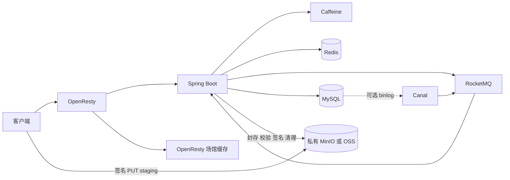

# CityPass

CityPass 是一个城市活动发现与限量名额预约平台。它面向展览、独立演出、运动场馆、研学营地和工作坊等场景，解决两个实际问题：热门活动瞬时请求会压垮数据库；用户取消或超时未支付后，空出的名额如果不能及时流转，会造成活动方的容量浪费。

项目把“找场馆、写活动笔记、订阅创作者”和“限量预约、候补、自动补位”放在同一业务背景下。三个重点分别是预约资源交接、多级缓存一致性，以及私有图片从上传到清理的完整生命周期。

## 核心能力

- 城市场馆：分类、关键词、坐标距离查询，OpenResty + Caffeine + Redis + MySQL 多级读取；详情读具备 IP 防刷、watchdog 热点重建和有界 DB 降级。
- 活动笔记：草稿、版本化编辑、发布与软删除；私有图片 staging 直传、封存校验、短期读取链接、可靠清理与迟到写入补扫；发布信息流由可靠任务分批推进。
- 用户体系：短信验证码登录、一次性验证码、Redis Token、滑动续期、签到位图。
- 限量预约：OpenResty 总量令牌桶、用户滑动窗口、RocketMQ 削峰、Redis Lua 原子占位、MySQL 条件扣减。
- 预约候补：已入队候补按请求号选队首、活动级串行点、异常候补跳过、名额版本化交接。
- 可靠性：预约请求事实 + Transactional Outbox、支付/到期复合 CAS、任务级租约与版本栅栏、死信与手工重放、Micrometer 指标。
- 缓存一致性：与场馆写入同事务保存失效 Outbox，Redis 版本水位阻止旧读回写，Pub/Sub 驱逐在线且连接正常的 JVM 的 Caffeine；Redis 故障由 failure gate 与每 JVM bulkhead 限制回源。

## 系统结构


```mermaid
flowchart LR
    Client[客户端] --> Gateway[OpenResty]
    Gateway --> App[Spring Boot]
    Gateway --> L0[OpenResty 场馆缓存]
    App --> L1[Caffeine]
    App --> Redis[(Redis)]
    App --> MQ[RocketMQ]
    MQ --> App
    App --> DB[(MySQL)]
    Client -->|签名 PUT staging| Files[(私有 MinIO 或 OSS)]
    App -->|封存 校验 签名 清理| Files
    DB -. 可选 binlog .-> Canal[Canal]
    Canal --> MQ
```

预约写链路采用一种明确的生产路径：

```text
POST /reservations/{passId}
  -> MySQL 同一事务：PROCESSING 请求事实 + CREATE Outbox
  -> 多实例 Relay 以任务租约发布 RocketMQ CREATE 消息
  -> 消费者校验活动时间窗与有效订单
  -> Redis Lua 原子占位
  -> MySQL 事务：条件扣库存 + 订单 + 请求状态 + 真实截止时间任务
  -> RESERVED

Redis 无库存且 acceptWaitlist=true
  -> MySQL WAITING 候补
  -> WAITLISTED
```

取消与超时关单使用不同的复合 CAS：超时路径必须同时命中 `status=1 AND offer_expire_time<=采样时间`。释放事务以活动库存行串行化，阻塞锁定真正队首，不会跳过被另一事务锁定的较早候补。Redis claim 以 `orderId:resourceVersion` 表示名额归属，只有期望版本匹配时才能交接或回补。

## 关键状态

| 对象 | 状态 | 含义 |
|---|---|---|
| 请求 | `PROCESSING` | 已受理，等待异步消费 |
| 请求 | `RESERVED` | 已获得限时支付资格 |
| 请求 | `WAITLISTED` | 库存不足，已进入候补 |
| 请求 | `FAIL_NOT_STARTED / FAIL_ENDED` | 不在活动预约时间窗 |
| 订单 | `1 / 2 / 4` | 未支付 / 已支付 / 已取消 |
| 候补 | `WAITING` | 正在排队 |
| 候补 | `OFFERED` | 已补位，等待支付 |
| 候补 | `ACCEPTED` | 补位订单已支付 |
| 候补 | `EXPIRED / CANCELLED` | 资格超时或主动退出 |

必须始终成立的业务不变量：

1. 同一用户对同一通行证最多存在一个有效订单或一个活动候补。
2. 数据库库存不会小于 0。
3. 名额补位只是所有权转移，不增加或减少库存。
4. 支付与关单只能有一方通过 CAS 把未支付订单推进到终态。
5. MySQL 订单和候补是最终依据，Redis 是可重建的快速状态。

## 快速启动

需要 Docker Desktop（Linux AMD64 容器）和 JDK 8。Spring Boot 保持 2.3.12，Maven Wrapper 使用 3.9.11。仓库根目录执行：

```powershell
Copy-Item .env.example .env
powershell -NoProfile -ExecutionPolicy Bypass -File .\scripts\prepare-minio.ps1
.\mvnw.cmd clean test package
# 官方 MinIO Release 固定版本 + SHA-256 校验；仅 minio 构建一次，init 复用镜像。
docker compose build minio
# 已有 jar 使用 Java 8 运行镜像；默认 Dockerfile 也可在容器内用 JDK 8 构建。
$env:APP_DOCKERFILE='Dockerfile.runtime'
docker compose up -d --build
docker compose ps
```

服务地址：

- OpenResty 网关：`http://localhost:8080`
- Spring Boot：`http://localhost:8081`
- MySQL：`localhost:3307`
- Redis：`localhost:6379`
- RocketMQ NameServer：`localhost:9876`
- MinIO S3：`http://localhost:9000`，控制台：`http://localhost:9001`
- 笔记调试页：[http://localhost:8080/debug/story-files](http://localhost:8080/debug/story-files)

全新 MySQL 卷自动依次导入 `citypass.sql`、Canal 用户、`migration-v6-story-files.sql`。初始化 SQL 仅用于空环境，**旧数据库不能重导初始化 SQL**。数据库、Redis、MQ、历史本地图片与 MinIO 都使用持久卷；常规启动和验收不删除卷。

旧增强版数据库补齐尚未执行的迁移，顺序如下；已应用过的 ALTER 不要重复执行：

```text
deploy/mysql/migration-v2.sql
deploy/mysql/migration-v3-waitlist.sql
deploy/mysql/migration-v4-reliability.sql
deploy/mysql/migration-v5-activity-search.sql
deploy/mysql/migration-v6-story-files.sql
```

v5 保留为历史迁移，活动分类、位置和时间仍用于业务；当前运行代码已经移除搜索模块。升级前停止所有旧应用实例，再执行 v6，最后启动新应用。v6 只将历史 `INDEX_ACTIVITY_SEARCH` 任务退役为 DONE，不处理预约/缓存任务，也不删除业务数据。已有 v5 数据库可用：

```powershell
docker compose stop app
powershell -NoProfile -ExecutionPolicy Bypass -File .\scripts\apply-story-migration.ps1 -Project citypass
docker compose up -d --build app openresty
```

首次安装无需手动执行该脚本。MySQL DDL 无法整体事务回滚，迁移失败应检查部分完成状态。旧笔记回填为 PUBLISHED；旧本地图片保留，通过受笔记可见性和路径边界约束的读取接口访问。

MinIO 为默认真实开发存储，bucket 初始化为私有；浏览器 endpoint 必须与实际 host/端口一致，不能改写已签名 URL。CORS 来源在 `.env` 配置。云端切换 OSS 时设置 provider、endpoint、public endpoint、region、bucket 与环境凭证，并在 OSS 配置相同来源的 GET/PUT CORS；OSS V4 适配器已实现，云端联调状态见验收记录。公开部署应关闭 `STORY_DEBUG_PAGE_ENABLED`，设置独立凭证及可靠任务管理员令牌。

可选的 Canal 缓存驱逐链路：

```powershell
$env:CANAL_ENABLED='true'
docker compose --profile canal up -d --build
```

多个独立 OpenResty shared dict 需要显式配置全部 purge 地址，逗号分隔；旧的 `GATEWAY_CACHE_PURGE_URL` 单地址变量仍兼容：

```powershell
$env:GATEWAY_CACHE_PURGE_URLS='http://gateway-a/internal/cache/venue,http://gateway-b/internal/cache/venue'
```

Venue 详情网关读限流与 Java 降级容量均可配置。读限流使用独立的按 IP 令牌桶；`CACHE_DB_FALLBACK_MAX_CONCURRENCY` 是每个应用实例的上限：

```powershell
$env:VENUE_READ_RATE_PER_SECOND='60'
$env:VENUE_READ_BURST='120'
$env:CACHE_REDIS_FAILURE_THRESHOLD='3'
$env:CACHE_REDIS_OPEN_DURATION_MS='3000'
$env:CACHE_DB_FALLBACK_MAX_CONCURRENCY='8'
```

## 验证

单元测试：

```powershell
.\mvnw.cmd clean test
```

Docker 全链路测试：

```powershell
powershell -NoProfile -ExecutionPolicy Bypass -File .\scripts\smoke-test.ps1
powershell -NoProfile -ExecutionPolicy Bypass -File .\scripts\reliability-test.ps1
powershell -NoProfile -ExecutionPolicy Bypass -File .\scripts\cache-consistency-test.ps1
powershell -NoProfile -ExecutionPolicy Bypass -File .\scripts\gateway-cache-consistency-test.ps1
```

`smoke-test.ps1` 覆盖业务闭环；`reliability-test.ps1` 验证真实 100 用户争抢 10 个名额、FIFO 与 Broker 恢复；缓存脚本验证双 JVM、旧版本拒写及网关行为。`story-files-test.ps1` 断言权限、真实图片内容、staging 防覆盖、CAS 编辑、发布幂等、Feed 分页及清理状态。文件验收使用独立环境与短 TTL，具体命令、历史图片和迁移测试见 [笔记学习文档](03-活动笔记发布与文件管理.md) 和 [验收记录](docs/10-活动笔记与文件验收.md)。不要对共享环境执行停止存储/数据库触发器故障注入。

## 主要 API

| 方法 | 路径 | 作用 |
|---|---|---|
| GET | `/venues/{id}` | 场馆详情 |
| GET | `/venues/of/type` | 分类与距离查询 |
| POST | `/passes/limited` | 发布限量活动通行证 |
| PUT | `/passes/{id}/metadata` | 修改活动分类、描述、时间等业务字段 |
| PUT | `/passes/{id}/status` | 活动上架或下架 |
| POST | `/reservations/{passId}` | 预约，可选择接受候补 |
| GET | `/reservations/requests/{requestId}` | 查询预约或候补状态 |
| PUT | `/reservations/{orderId}/pay` | 支付预约订单 |
| PUT | `/reservations/{orderId}/cancel` | 取消并触发补位 |
| DELETE | `/reservations/waitlist/{requestId}` | 退出候补 |
| POST / GET / DELETE | `/story-comments` | 发布、查询和删除动态评论 |
| PUT / DELETE / GET | `/subscriptions/{targetUserId}` | 订阅、取消订阅、查询状态 |
| POST | `/stories/drafts` | 幂等创建草稿 |
| PUT / DELETE | `/stories/{id}` | 版本化编辑、删除 |
| POST | `/stories/{id}/attachments` | 申请固定 staging 键的签名 PUT |
| POST | `/stories/attachments/{id}/confirm` | 封存与实际图片校验 |
| POST | `/stories/{id}/publish` | 状态推进与可靠信息流事件 |
| GET | `/stories/{id}` | 公开已发布笔记或作者自己的草稿 |

## 学习顺序

三个现行学习入口：[01-异步预约与候补调度](01-异步预约与候补调度.md)、[02-多级缓存一致性](02-多级缓存一致性.md)、[03-活动笔记发布与文件管理](03-活动笔记发布与文件管理.md)。再用 [代码地图](docs/01-项目全景与代码地图.md)、[v4 可靠性升级](docs/08-v4可靠性升级.md)、[简历写法](docs/07-简历项目写法.md) 定位与复习。五篇陈旧根目录学习文档及搜索专篇已退役删除。

## 工程演进说明

本项目基于一个开源本地生活服务原型做二次开发，保留了部分通用的用户与内容能力。当前 CityPass 的领域背景、包名、表结构、API、预约时间窗、单一 MQ 写链路、候补状态机、自动补位、可靠任务和端到端验收均经过重新设计与实现。面试时应准确说明自己负责的改造范围，不把开源基础描述成从零原创。
