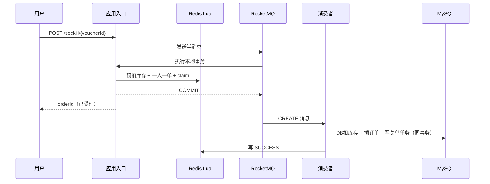

# 先读这里

你的目标不是记住所有类，而是能回答三个问题：一次请求怎样走完、每个一致性措施防什么故障、方案仍有什么边界。

推荐阅读顺序：

1. `VoucherOrderController.seckillVoucher`：找到入口。
2. `VoucherOrderServiceImpl.seckillVoucherModeA`：看半消息和本地 Lua。
3. `seckill.lua`：看库存、一人一单、claim 归属为何必须原子执行。
4. `SeckillTransactionListener`：理解 COMMIT、ROLLBACK、UNKNOW。
5. `OrderMQConsumer` 与 `createOrderFromMQ`：看重复消息如何进入同一条幂等链。
6. `VoucherOrderTransactionalService`：找到真正的数据库事务边界。
7. `ReliableTaskScheduler`：理解延迟消息和 Redis 补偿为什么不会因一次发送失败而丢失。
8. `SeckillReconcileTask`：理解实时链路之外怎样最终收敛。

先画出下面这条线，再看细节：

你需要牢牢记住：Redis 负责快速资格判断，MySQL 订单表是最终业务账本，MQ 负责削峰和重试，本地可靠任务处理“数据库已提交但外部动作失败”，对账处理长尾差异。

## 先跑三个实验

1. 同一 token 并发请求同一张券，观察只有一笔订单，其他请求得到重复失败。
2. 下单成功后立刻支付，15 分钟后观察延迟关单无法把已支付订单改成取消。
3. 更新商铺，连续查询并观察 OpenResty、Caffeine、Redis 的缓存驱逐和重新填充。

做完实验后再读面试稿，否则很容易只会复述术语。
