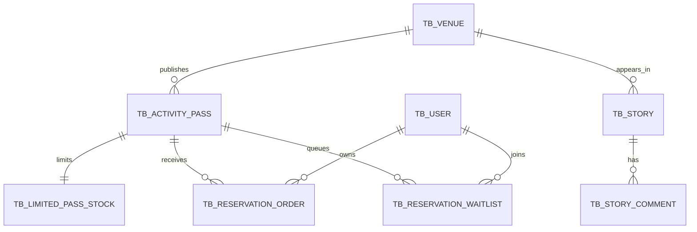

# 项目全景与代码地图

## 业务模块

| 模块 | HTTP 入口 | 核心存储/中间件 | 面试重点 |
|---|---|---|---|
| 用户登录与签到 | `UserController` | Redis Hash、Bitmap | Token 滑动续期、连续签到 |
| 场馆发现 | `VenueController` | OpenResty、Caffeine、Redis、MySQL GEO | 多级缓存与空间查询 |
| 城市动态 | `StoryController` | MySQL、Redis ZSet | 点赞排行、滚动 Feed |
| 评论 | `StoryCommentController` | MySQL | 所有权校验、计数事务 |
| 订阅 | `SubscriptionController` | MySQL、Redis Set | 订阅幂等、共同订阅 |
| 活动通行证 | `PassController` | MySQL、可靠任务 | 发布校验、Redis 库存初始化 |
| 预约与候补 | `ReservationController` | Lua、RocketMQ、MySQL | 削峰、幂等、补位、最终一致 |

## 预约类的职责

| 类 | 只负责什么 |
|---|---|
| `ReservationController` | 参数映射和返回结果 |
| `ReservationServiceImpl` | 编排 MQ、Redis、锁和请求状态 |
| `ReservationTransactionalService` | 定义订单、候补、库存与可靠任务的 DB 事务 |
| `OrderMessagePublisher` | 隔离 MQ 开启/关闭两种运行环境 |
| `RocketMQProducer` | 发送 CREATE 与 TIMEOUT |
| `OrderMQConsumer` | 消息分流与失败重试 |
| `ReliableTaskRepository` | 在数据库中保存待执行的副作用 |
| `ReliableTaskScheduler` | 投递延迟消息、初始化/恢复 Redis、转移 claim |
| `ReservationReconcileTask` | 超时关单与库存长尾收敛 |
| `ReservationWaitlistMapper` | 带行锁选取 FIFO 候补者 |

这个拆分的关键是：带 `@Transactional` 的数据库逻辑单独放到一个 Bean。若在同一个对象内部直接调用事务方法，Spring AOP 代理可能不会生效。

## 四条主路径

### 场馆读取

```text
OpenResty L1 -> Caffeine L2 -> Redis L3 -> MySQL
```

更新由 `VenueCacheInvalidator.evictAfterCommit` 在事务提交后驱逐。直接修改数据库时，可选 Canal 将 binlog 事件送入 RocketMQ，再执行同样的驱逐。

### 直接预约

```text
HTTP -> MQ -> 时间窗检查 -> Lua claim -> DB 事务 -> RESERVED
```

### 库存不足

```text
Lua 返回库存不足
  acceptWaitlist=false -> FAIL_STOCK
  acceptWaitlist=true  -> 插入 WAITING -> WAITLISTED
```

### 取消/超时

```text
CAS 关闭未支付订单
  有候补且活动未结束 -> 锁定队首 -> OFFERED + 新订单 + claim 转移任务
  无候补或活动已结束 -> DB stock + 1 + Redis 回补任务
```

## 表之间的关系



## 一眼定位目录

- `src/main/java/com/citypass/controller`：HTTP 契约。
- `service/impl/ReservationServiceImpl.java`：分布式编排。
- `service/impl/ReservationTransactionalService.java`：本地事务。
- `src/main/resources/*.lua`：Redis 原子状态转换。
- `src/main/resources/db/citypass.sql`：最终表结构与约束。
- `src/main/resources/openresty`：网关缓存和令牌桶。
- `scripts/smoke-test.ps1`：可重复的业务验收。
- `deploy/mysql`：旧数据库迁移。
