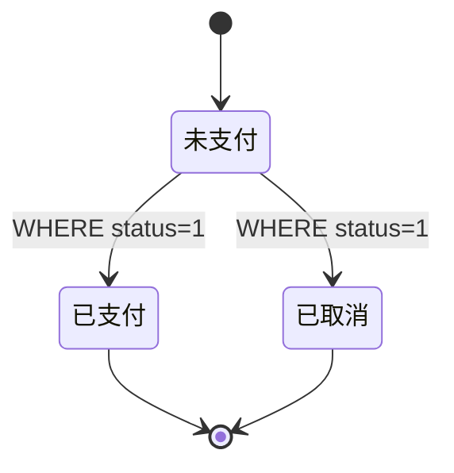

# 秒杀一致性深挖

## 为什么 Redis 和 MySQL 都要扣库存

Redis 扣库存挡住大部分无效流量，MySQL 条件更新守住最终库存。二者不会组成一个跨存储 ACID 事务，所以系统采用“主链路尽量可靠 + 可重试补偿 + 定时对账”。

MySQL 语句的核心语义是：

```sql
UPDATE tb_seckill_voucher
SET stock = stock - 1
WHERE voucher_id = ? AND stock > 0;
```

受影响行数为 0 就表示最终库存不足。Redis 即使暂时漂移，也不能让数据库变成负数。

## 数据库事务边界

创建订单必须把三件事放进同一事务：

1. DB 条件扣库存。
2. 插入 `tb_voucher_order`。
3. 插入 `ORDER_TIMEOUT` 可靠任务。

其中任何一步失败，三步全部回滚。事务方法单独放在 `VoucherOrderTransactionalService`，因为 Spring AOP 对同类内部调用不会套上事务代理。

## 三层一人一单

| 层 | 作用 | 为什么不能单独依赖 |
|---|---|---|
| Redis Lua | 在热点入口快速拒绝 | Redis 数据可能丢失或被误删 |
| 用户 Redisson 锁 + DB 查询 | 缩小并发插入窗口 | 锁租约、网络或编程错误不能当最终约束 |
| DB 唯一索引 | 最终不可突破的约束 | 冲突发生时成本高，不能承担所有热点请求 |

唯一索引是 `(user_id, voucher_id)`。重复消息若对应同一个订单号返回成功；同一用户的另一个订单号返回 `FAIL_REPEAT`。

## claim 为什么要记录 orderId

只有 Set 中的 userId 无法回答“这次失败消息能否回滚这个资格”。若用户的另一笔订单已经成功，盲目 `SREM userId + INCR stock` 会凭空增加库存并删除成功资格。

因此脚本同时写：

```text
seckill:order:{voucherId}                  Set(userId)
seckill:claim:{voucherId}:{userId}         String(orderId)
```

回滚脚本先比较 claim 的 orderId，只允许所有者回滚。

## 本地可靠任务解决什么

直接“提交 DB 后发延迟消息”有一个宕机窗口：订单已提交，消息没发出去。现在创建订单事务同时写 `tb_reliable_task`，调度器不断发送，成功后标记 DONE。

任务是至少一次执行，所以处理器必须幂等：

- TIMEOUT：`WHERE status=未支付`，重复消息只会成功一次。
- RESTORE_REDIS_STOCK：Lua 先检查 `seckill:restore:{orderId}` 标记，避免重复 `INCR`。
- INIT_SECKILL_STOCK：初始化标记防止任务重试把已扣减库存重新覆盖为初始值。

## 支付与关单竞争



两个事务同时执行时，数据库行锁和条件更新使其中一个先改变状态，另一个更新 0 行。关单只有成功把状态改成取消后，才会在同一事务回补 DB 库存并记录 Redis 补偿任务。

当前业务规则是“一名用户对一张券最多创建一笔订单”：超时取消会恢复库存，但不会删除 Redis 的抢购资格，也不会删除订单；数据库唯一索引因此仍会拒绝该用户再次抢购。这是有意选择的业务语义。若产品要求“取消后可重新抢购”，不能只在 Redis 中删除 userId，还要同时调整唯一索引、订单生命周期和幂等键，否则 Redis 放行后仍会被数据库拒绝。

## 故障矩阵

| 故障点 | 结果 | 修复机制 |
|---|---|---|
| 半消息发送失败 | Lua 未执行 | 接口失败 |
| Lua 成功但回包丢失 | 状态未知 | Broker 用 txn/claim 回查后提交 |
| CREATE 重复投递 | 再次消费 | 订单号/用户查询 + 唯一索引幂等 |
| DB 扣库存后插单失败 | 事务异常 | DB 事务整体回滚，MQ 重试 |
| DB 最终库存不足 | Redis 已 claim | 所有权校验后回滚自己的 Redis claim |
| 订单提交后应用宕机 | 延迟消息尚未发送 | 本地可靠任务稍后发送 |
| Redis 回补成功后应用宕机 | 任务仍是 PENDING | Lua marker 阻止重复回补 |
| MQ 长时间异常或人工误操作 | 局部差异 | 定时对账按订单账本收敛 |

## 仍需诚实说明的边界

RocketMQ 事务消息不是 Redis 与 MQ 的分布式 ACID 事务；它依赖可回查标记和补单对账降低不一致窗口。对账只在秒杀结束后补明显缺单，避免进行中的正常消费延迟被误判。真实生产还要接入死信告警、人工工单和业务审计记录。
