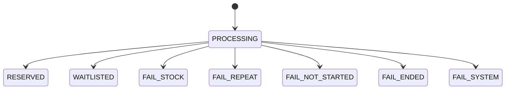
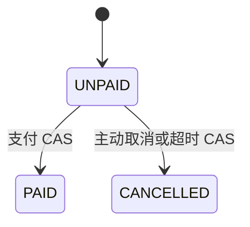
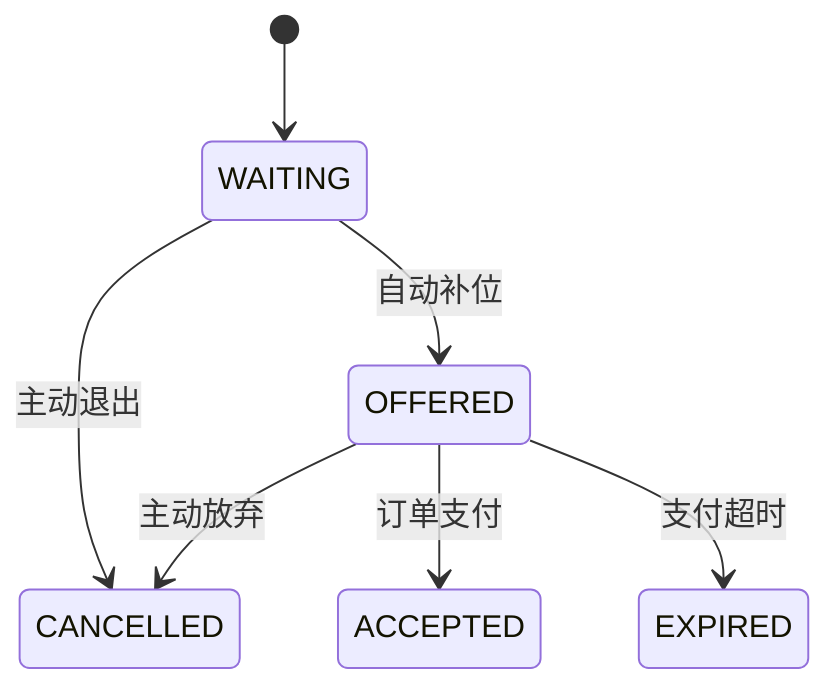

# 预约一致性与候补补位

## 先从不变量出发

设计每一段代码前，先问它保护哪个不变量：

1. **库存下界**：DB 库存永远不小于 0。
2. **用户唯一资格**：一个用户对一个通行证最多有一个有效订单或活动候补。
3. **名额守恒**：补位只改变持有人；候补为空才增加可售库存。
4. **终态互斥**：同一订单不可能既支付成功又被关闭。
5. **顺序可恢复**：服务重启后仍能从 MySQL 恢复候补顺序。
6. **副作用可重试**：MQ 投递和 Redis 补偿失败不会使 DB 事务回滚后的状态永久悬空。

## 三个状态机

### 请求视图



请求状态用于给客户端快速反馈。最终查询优先读取订单/候补表，Redis 请求状态只是异步处理早期的临时视图。

### 订单



支付和取消都带 `WHERE status=1`。只有一个更新能影响一行，因此只有胜者继续做后续动作。

### 候补



## 直接预约逐步推理

### 1. 接口只做受理

`reserve` 生成单调请求号，写 `PROCESSING` 与 owner，然后发送 CREATE 消息。客户端拿到的是请求号，不是假装已经成功的订单。

### 2. 消费者先校验时间窗

消费者读取 `ActivityPass` 和 `LimitedPassStock`。未开始、已结束、下架或非限量类型都不会进入 Lua。数据库扣库存还重复带上时间条件，覆盖校验后时间恰好越界的竞态。

### 3. Lua 原子占位

```text
reservation:stock:{passId}                 String
reservation:holders:{passId}               Set(userId)
reservation:claim:{passId}:{userId}         String(requestId)
```

Lua 先判断当前用户是否已有 claim，再判断库存，最后一次性执行减库存、加入持有人集合、写 claim。重复消费同一请求返回可继续落库，另一个请求号则返回重复。

### 4. MySQL 本地事务兜底

```sql
UPDATE tb_limited_pass_stock
SET stock = stock - 1
WHERE activity_pass_id = ?
  AND stock > 0
  AND begin_time <= NOW()
  AND end_time > NOW();
```

影响行数为 1 后，事务插入订单并写 ORDER_TIMEOUT 可靠任务。任何一步抛异常，三步全部回滚。

## 候补顺序为什么稳定

候补表的唯一约束：

- `request_id` 唯一，重复消息不会生成两条候补。
- `(activity_pass_id, active_user_id)` 唯一，同一用户不能同时占多个活动候补。
- 只有 WAITING/OFFERED 状态把 user_id 映射到生成列；离开终态后可以再次参与。

选人 SQL：

```sql
SELECT *
FROM tb_reservation_waitlist
WHERE activity_pass_id = ?
  AND status = 'WAITING'
ORDER BY request_id
LIMIT 1
FOR UPDATE SKIP LOCKED;
```

`request_id` 在 HTTP 入口生成，避免并发 MQ 消费改变排队先后。`FOR UPDATE` 防止两个关单事务选中同一人；`SKIP LOCKED` 使并发释放不同名额时无需等待同一候选行。

## 自动补位事务

`releaseOrPromote` 的一次事务包含：

1. CAS 将旧订单从未支付改为已取消。
2. 若旧订单来自候补，把旧候补从 OFFERED 改为 EXPIRED/CANCELLED。
3. 锁定队首 WAITING 候补。
4. 将候补改为 OFFERED，并记录支付截止时间。
5. 复用 request_id 插入新的未支付订单，来源为 WAITLIST，轮次加一。
6. 写 ORDER_TIMEOUT 和 TRANSFER_RESERVATION_CLAIM 可靠任务。

这里不修改 DB 库存。事务提交后，Lua 删除旧用户 claim 并把同一个 Redis 名额转给新用户。

若队列为空或活动已经结束，事务改为 DB stock + 1 并写 RESTORE_REDIS_STOCK。补偿 Lua 校验业务幂等标记，重复执行只生效一次。

## 失败矩阵

| 失败位置 | 已发生 | 恢复方式 |
|---|---|---|
| HTTP 发送 MQ 失败 | 仅 PROCESSING/FAIL_SYSTEM | 客户端重试 |
| CREATE 重复投递 | 可能已有 claim/订单/候补 | requestId、唯一索引、幂等分支 |
| Redis claim 成功，DB 库存不足 | Redis 多扣一次 | clear-stale-claim 清归属并把库存收敛为 0 |
| DB 事务成功，TIMEOUT 未发 | 可靠任务仍在表中 | Scheduler 重试 |
| 关单成功，Redis 回补失败 | DB 已释放，Redis 偏小 | 可靠任务指数退避重试 |
| 补位成功，claim 转移失败 | DB 新用户已获资格 | transfer 任务重试 |
| 延迟消息丢失 | 未支付订单未及时关闭 | 每分钟对账扫描 offer_expire_time |
| Redis 数据丢失 | 快速状态不可用 | 订单/候补/初始库存是重建依据 |

## 为什么只保留一种预约模式

同一业务同时保留两套运行模式会让故障语义、测试矩阵和面试解释翻倍。CityPass 选择“先入 MQ，消费者 claim”的单一路径：网关与 MQ 负责削峰，消费者统一执行时间窗、幂等和候补决策。项目把精力放在候补补位和恢复能力上，而不是维护两个相似实现。
