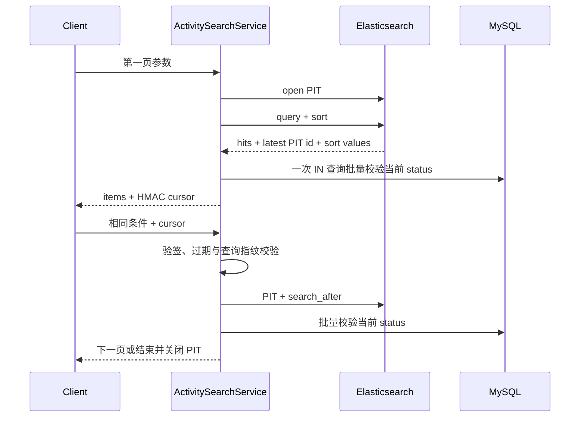
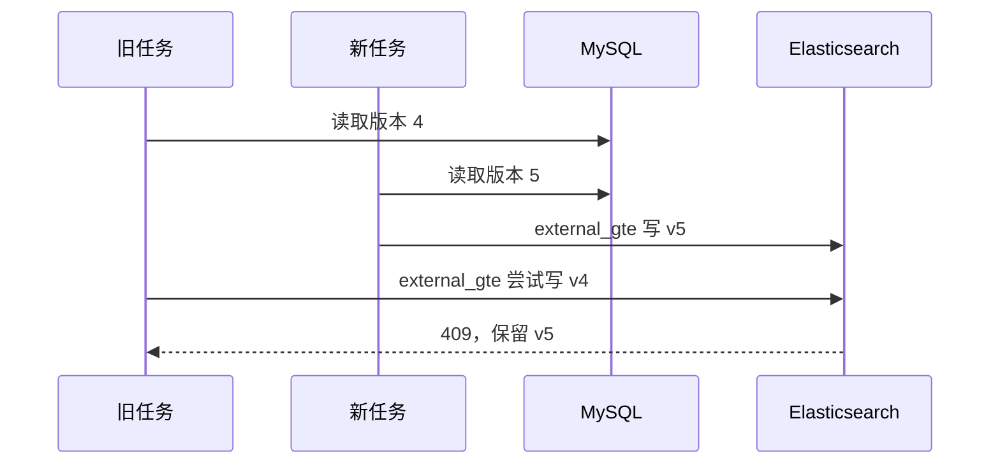

# CityPass 活动全文检索与搜索索引治理

这条主线解决的是“怎样找到活动”，不是“怎样抢到名额”。MySQL 继续保存活动和场馆事实，Elasticsearch 保存按活动构建、可以删除后重建的查询投影；搜索结果只说明活动当前可展示，库存、活动预约时间窗和用户资格仍由原预约链路重新校验。

本文对应的实施基线是 `94494b4779eb44a1af70707172e702063e9a660f`。服务端与 High Level REST Client 固定为 Elasticsearch `7.17.29`：项目仍使用 Java 8 和 Spring Boot 2.3，这一代客户端可在现有运行时接入，不需要为搜索升级整个框架。客户端已经进入维护状态，因此这里把版本固定并把 ES 封装在独立模块中，不把选择扩展成全项目升级。

## 1. 先区分五组容易混淆的字段

| 业务含义 | MySQL / Java 字段 | 搜索文档字段 | 说明 |
|---|---|---|---|
| 预约开放与截止 | `begin_time / end_time` | 不索引 | 决定何时可以提交预约 |
| 活动实际举办时间 | `event_start_time / event_end_time` | `eventStartTime / eventEndTime` | 决定搜索时间过滤和排序 |
| 通行证类型 | `type` | `passType` | `0` 普通、`1` 限量预约 |
| 活动内容分类 | `activity_category` | `activityCategory` | 如 MUSIC、SPORT、FAMILY |
| 上下架状态 | `status` | `status + searchable` | `1` 上架、`2` 下架；缺必要元数据也不可搜索 |

价格沿用 `pay_value`，单位为分，在搜索文档中命名为 `priceCents`。不能把预约截止时间当作举办时间，也不能把通行证 `type` 复用成活动分类。

当前数据模型没有独立场次表，因此一个 `tb_activity_pass` 对应一个搜索文档，文档 ID 就是活动 ID。将来若一个活动需要多个时间和价格不同的场次，应先增加场次事实表，再把索引粒度改为场次；现在不凭空制造这一层。

已有活动的举办时间和分类允许为空。全量重建仍会为它们写一份 `searchable=false` 的文档，以保存版本水位，但不会伪造时间或出现在结果中。新建活动如果完全不填写搜索元数据，可以继续兼容原接口；只要开始填写其中任一项，就必须同时提供标题、分类和合法的实际开始/结束时间。

## 2. 文档字段来自哪里

| 来源 | 字段 | 为什么放进 ES |
|---|---|---|
| ActivityPass | id、venueId、title、subTitle、description、rules、category、tags | 全文召回、分类过滤与结果展示 |
| ActivityPass | eventStartTime、eventEndTime、payValue、type、status | 时间相交、价格过滤、确定排序和软下架 |
| ActivityPass | searchVersion | 拒绝迟到旧写 |
| Venue | name、area、address、x、y | 搜场馆文字、返回地点、距离过滤与排序 |

场馆字段是搜索投影中的冗余字段，事实仍属于 `tb_venue`。因此 `PUT /venues` 除了执行原来的缓存失效，还必须推进所有关联活动的 `search_version` 并登记索引任务。当前实现按活动逐项登记任务，逻辑简单、可以复用现有可靠任务表；场馆拥有大量活动时会产生同步写放大，这是明确保留的边界。

字段拼装入口是 [ActivitySearchSourceRepository.java](../src/main/java/com/citypass/search/ActivitySearchSourceRepository.java)，活动与场馆在一条 SQL 中读取，避免分别查询产生 N+1；[ActivitySearchDocumentMapper.java](../src/main/java/com/citypass/search/ActivitySearchDocumentMapper.java) 决定标签拆分、时间转 epoch millis 和 `searchable` 条件。

## 3. 中文检索、权重与硬过滤

Elasticsearch 镜像通过 [deploy/elasticsearch/Dockerfile](../deploy/elasticsearch/Dockerfile) 安装与服务端同版本的 `analysis-smartcn`。标题、介绍、规则、标签及场馆文字字段在建索引时都显式使用 `smartcn`，测试会真实调用 `_analyze`，不会只检查配置字符串。

关键词进入 `multi_match`：

```text
title^4 > subTitle^2 = tags^2 > venueName^1.5 > description^1 > rules^0.3
```

标题最能表示活动主题，所以权重最高；标签和副标题是人工压缩后的主题信息；正文负责补充召回；规则通常含大量通用词，因此只给较低权重。这是当前小样本下可解释的起点，不是经过大规模点击数据训练出的最终参数。

分类、举办时间、价格、可搜索状态和地理半径都进入 `filter`，不会被关键词分数改变。时间范围使用**闭区间相交**：

```text
活动结束时间 >= eventFrom
AND 活动开始时间 <= eventTo
```

因此一个活动恰好在查询开始时结束，或恰好在查询结束时开始，也算边界相交。所有查询还固定过滤“活动尚未结束”，其比较基准在第一页生成并写进游标，后续翻页不会随着时钟变化。

排序规则：

| 请求 | 实际排序 |
|---|---|
| 有关键词且未指定 | `_score DESC, eventStartTime ASC, activityId ASC` |
| 无关键词且未指定 | `eventStartTime ASC, activityId ASC` |
| `sort=EVENT_TIME` | `eventStartTime ASC, activityId ASC` |
| `sort=DISTANCE` | 距离 ASC、eventStartTime ASC、activityId ASC |

`activityId` 是最终稳定次序。距离排序必须同时提供合法经纬度；半径、页大小、关键词、分类、价格和日期都有上限或交叉校验。客户端只能提交明确参数，不能提交任意 ES DSL。

查询构建与结果映射在 [ActivitySearchService.java](../src/main/java/com/citypass/search/ActivitySearchService.java)，参数归一化在 [ActivitySearchRequestValidator.java](../src/main/java/com/citypass/search/ActivitySearchRequestValidator.java)。

## 4. PIT + search_after 为什么缺一不可

单独使用 `search_after` 时，翻页间若索引刷新，前一页之后的视图可能变化。当前实现首次查询打开 PIT，后续携带 ES 返回的最新 PIT ID 和最后一条已扫描记录的全部排序值。



游标封装：

- 最新 PIT ID；
- 最后一条已扫描记录的排序值；
- 第一页快照时间；
- 游标到期时间；
- 查询指纹。

整个载荷用服务端密钥执行 HMAC-SHA256。查询指纹绑定关键词、过滤条件、排序、页大小和冻结时间；篡改载荷或换条件继续翻页都会被拒绝。应用自身检查 `expiresAtEpochMillis`，同时处理 ES 返回的 PIT 丢失异常。没有下一页时主动关闭 PIT，客户端也可调用 `DELETE /search/activities/cursor` 提前释放；关闭是尽力操作，PIT 最终仍受 keep-alive 限制。

PIT 保证索引快照内的排序视图稳定，却不代表业务状态永远停在第一页。每批 ES hits 会用一条 `WHERE id IN (...)` 查询回源 MySQL 当前上下架状态；已经下架的活动立即从响应中剔除。过滤造成不足一页时，服务从最后一条**已扫描**排序值继续有限补取，默认最多三批，不回到起点，也不逐条查库。达到补取上限时允许少于请求页大小，这仍不是 MySQL 与 ES 的跨系统强一致读。

## 5. 增量索引如何可靠推进

`search_version` 只服务于活动搜索文档，不复用可靠任务执行版本、预约 `resourceVersion` 或场馆 `cacheVersion`。

影响文档的写入口如下：

| 写入口 | 同一 MySQL 事务内发生的事 |
|---|---|
| 普通活动创建 | 活动 searchVersion=1 + INDEX_ACTIVITY_SEARCH |
| 限量活动创建 | 活动与库存基准 + INIT_RESERVATION_STOCK + INDEX_ACTIVITY_SEARCH |
| `PUT /passes/{id}/search-metadata` | 只改标题、副标题、介绍、分类、标签和举办时间；version+1 + INDEX |
| `PUT /passes/{id}/status` | 条件更新上下架；变化时 version+1 + INDEX |
| `PUT /venues` | Venue 更新与缓存任务 + 关联活动 version+1 + 每活动 INDEX |

搜索元数据接口不会修改 `payValue`、预约开放/截止时间、限量库存或已有订单。业务更新与任务 INSERT 任一步失败时，整个本地事务回滚。专项脚本通过临时 MySQL trigger 强制任务 INSERT 失败，检查活动字段、版本和任务数都没有残留变化。

索引任务只携带 `activityId + requestedVersion`，执行时重新用一条 join SQL 读取 MySQL 最新事实。这样可合并连续更新，但“读取最新”本身仍不足以解决先读后写交错，所以 ES 写入同时使用 `version_type=external_gte` 和当前文档的 `searchVersion`：



任务重复执行同版本是幂等覆盖；旧版本 409 只有在 ES 当前版本确实不低于待写版本时才按成功的 stale no-op 处理。下架采用版本化软文档：`status=2, searchable=false`。因此下架后的迟到旧任务也不能用较低版本把文档复活。

Elasticsearch 超时、非预期 409 或 bulk 单项失败都会抛出异常，由原 [ReliableTaskScheduler.java](../src/main/java/com/citypass/task/ReliableTaskScheduler.java) 执行指数退避，达到上限进入 DEAD。这里没有新建第二套调度线程。

## 6. 维护窗口内的全量重建

全量重建用于首次建索引、映射变化或索引丢失恢复。当前选择的是可验证的维护窗口，而不是零停机双写：

```text
取得 tb_search_rebuild_state 单例行锁
→ 标记 RUNNING + write_blocked=1
→ 创建新物理索引
→ 按 activityId 游标分批读取 MySQL
→ bulk 写入并逐项检查失败
→ refresh
→ 比较 MySQL、已提交批次数和 ES count
→ 原子切换业务别名
→ 标记 SUCCEEDED + write_blocked=0
```

活动创建、搜索字段/状态修改以及 Venue 更新都先锁同一状态行检查 `write_blocked`。已经提交的变化会被重建扫描读到；重建期间新的相关写入返回明确错误。搜索读取继续使用旧别名，直到新索引完成数量校验并一次切换。

创建、bulk 或数量校验失败时不会切换别名，原索引继续可读，状态记录为 FAILED 并保存截断后的原因。失败的新索引和切换后的旧索引都不会自动删除。管理员确认不再被别名使用后，才可通过受保护接口删除名称属于本模块的物理索引。

这个流程仍有维护窗口，会阻塞 Venue 更新以及活动相关写入；重建接口是同步长请求；单分片零副本设置只适合本地验收环境。它们是当前范围内接受的限制。

## 7. API、配置和启动

主要接口：

| 方法 | 路径 | 作用 |
|---|---|---|
| GET | `/search/activities` | 关键词、分类、时间、价格、距离、排序和游标搜索 |
| DELETE | `/search/activities/cursor?cursor=...` | 提前关闭 PIT |
| PUT | `/passes/{id}/search-metadata` | 编辑搜索字段 |
| PUT | `/passes/{id}/status?status=1|2` | 上下架 |
| POST | `/internal/activity-search/rebuild` | 带 `X-Admin-Token` 全量重建 |
| GET | `/internal/activity-search/rebuild` | 查看重建状态 |
| DELETE | `/internal/activity-search/indices/{index}` | 删除非当前物理索引 |

搜索示例：

```http
GET /search/activities?keyword=城市音乐节&category=MUSIC&eventFrom=2098-05-01T00:00:00&eventTo=2098-05-03T00:00:00&minPriceCents=500&maxPriceCents=1500&longitude=120.1915&latitude=30.2362&radiusMeters=2000&sort=DISTANCE&size=10
```

首次启动：

```powershell
$env:SEARCH_ENABLED='true'
$env:SEARCH_CURSOR_SECRET='请替换为至少16字符的随机密钥'
$env:RELIABLE_TASK_ADMIN_TOKEN='请替换为运维令牌'
docker compose --profile search up -d --build

Invoke-RestMethod -Method Post `
  -Uri http://localhost:8081/internal/activity-search/rebuild `
  -Headers @{'X-Admin-Token'=$env:RELIABLE_TASK_ADMIN_TOKEN}
```

已有数据库先执行 [migration-v5-activity-search.sql](../deploy/mysql/migration-v5-activity-search.sql)。主要配置在 [application.yaml](../src/main/resources/application.yaml)：连接与请求超时、最大页大小、最大半径、PIT keep-alive、有限补取批数和重建批大小均可配置。

`SEARCH_ENABLED=false` 时不创建 ES 客户端，搜索 API 返回“模块未启用”，预约和场馆业务仍可运行。此时调度器只排除 INDEX_ACTIVITY_SEARCH，任务保持 PENDING；重新启用后可继续增量处理，若索引不存在则先执行全量重建。模块启用但 ES 暂时不可用时，业务事实与索引任务仍能提交，任务失败后重试，搜索接口返回暂不可用。

## 8. 可观察内容

| 名称 | 含义 |
|---|---|
| `citypass.search.query.latency` | 搜索调用 Timer |
| `citypass.search.query.failures` | 搜索失败 Counter |
| `citypass.search.index.tasks.ready` | 当前可领取搜索任务 Gauge |
| `citypass.search.index.tasks.dead` | 搜索 DEAD 任务 Gauge |
| `citypass.search.rebuild.completed / failed` | 重建结果 Counter |
| `tb_search_rebuild_state` | 运行状态、目标/旧索引、数量、时间和失败原因 |

日志只记录异常类别与任务标识，不记录完整用户查询和游标密钥。项目提供 Micrometer 数据，但没有接入现成告警平台，因此不能把指标描述成已经具备完整值班告警。

## 9. 测试怎样证明边界

单元测试覆盖参数校验、游标签名与查询绑定、字段映射、查询 DSL 和“bulk 失败不得切别名”。真实依赖验收使用 [activity-search-test.ps1](../scripts/activity-search-test.ps1)，会启动 MySQL 8.0.36、Redis 7.2、RocketMQ 4.9.7、OpenResty 和安装 SmartCN 的 Elasticsearch 7.17.29。

```powershell
mvn test
powershell -NoProfile -ExecutionPolicy Bypass `
  -File .\scripts\activity-search-test.ps1
```

脚本用 6 个活动夹具验证：

- SmartCN 把“城市音乐节”切为“城市、音乐节”；
- 标题命中排在正文命中之前，无结果词不返回无关活动；
- 分类、价格、闭区间相交时间与距离组合过滤；
- 同举办时间连续翻页无重复和遗漏；
- PIT 过期、游标篡改、缺坐标距离排序被拒绝；
- PIT 中仍有旧上架文档时，MySQL 批量回源立即过滤，并继续推进游标；
- 旧 external version 确定性返回 409，不能复活下架活动；
- Venue 变化刷新关联活动；
- ES 停机时业务提交与任务保留，恢复后最终更新；
- 真实 bulk 单项失败时保留旧别名，修复数据后可再次重建并显式清理失败索引；
- 重建维护标记阻止相关写入；
- 业务任务 INSERT 失败时本地事务完整回滚。

少量人工标注的质量样例：

| 查询 | 人工预期 | 实际结果与处理 |
|---|---|---|
| 城市音乐节 | 标题直接命中的“城市音乐节限定专场”排在仅正文命中的“周末青年开放日”前 | 符合；据此保留 title 4、description 1 的权重差 |
| 城市音乐节 | 含“城市”的夜跑活动可能被召回，但应排在音乐节结果后 | SmartCN 会拆出“城市”，实际有歧义召回；依赖综合分数排序，不宣称精确短语匹配 |
| MUSIC + 价格 + 相交时间 + 2km | 只留下满足全部硬条件的两个音乐活动 | 符合；结构化条件放 filter，不参与相关性打分 |
| 量子潜水艇 | 无结果 | 符合；没有实现数据库兜底或模糊推荐 |

该结果是本机 Docker 单请求、小数据量的功能与故障验收，不是吞吐或延迟压测。LIKE 只做语义参照：它按连续子串匹配，ES 会按中文词元在加权字段中召回并排序，两者的结果数和顺序不应被假设相同。

## 10. 面试时要守住的能力边界

可以说：MySQL 是事实源；活动与索引意图同事务；ES 用单调版本抵御重复和乱序；PIT + search_after 稳定遍历快照；返回前批量读取 MySQL 当前状态；维护窗口重建校验成功才切别名。

不能说：搜索结果保证有库存；MySQL 与 ES 强一致；实现了零停机重建；SmartCN 参数来自大规模线上数据；单机 6 条样例等同生产性能；ReliableTask 是通用事件平台。

官方概念可对照：[Java REST Client 7.17 兼容说明](https://www.elastic.co/guide/en/elasticsearch/client/java-rest/7.17/java-rest-high-compatibility.html)、[Smart Chinese Analysis 插件](https://www.elastic.co/docs/reference/elasticsearch/plugins/analysis-smartcn)、[search_after 与 PIT](https://www.elastic.co/docs/reference/elasticsearch/rest-apis/paginate-search-results)、[索引别名](https://www.elastic.co/guide/en/elasticsearch/reference/current/aliases.html)。
